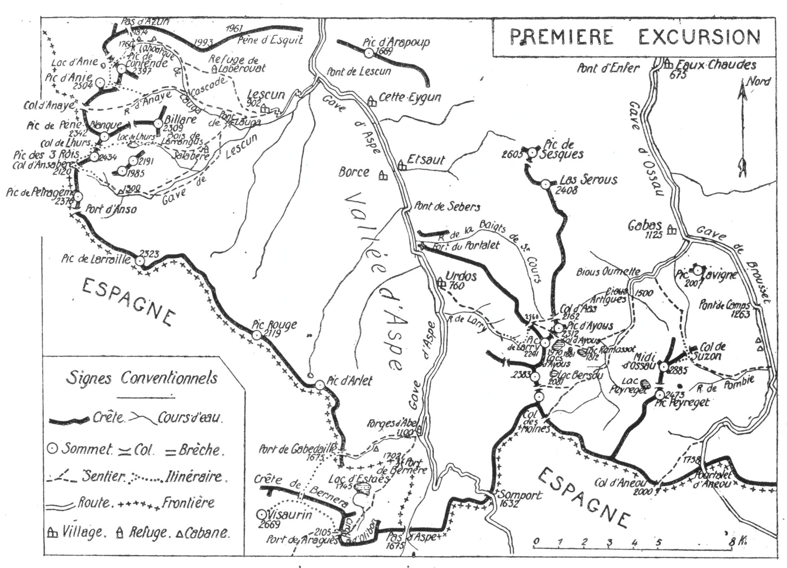

<style>.centre {text-align: center}</style>
<style>.droite {text-align: right}</style>


[//]: # (— p. 23 —)


# PREMIÈRE EXCURSION

__Cinq jours au départ de Lescun__

_B. E. — Du 15 Juillet au 31 Août._

Cartes à emporter : Mauléon et Sainte-Engrace réunies. Oloron et Laruns réunies.

__De LESCUN (1) aux EAUX-CHAUDES,__\
__par le Pic des Trois-Rois, le Pic d’Anie, le Visaurin,__\
__le Lac d’Estaès, le Pic de Larry, le Col, le Pic et les Lacs d’Ayous,__\
__le Pic de Midi d’Ossau et Gabas.__

(Emporter des conserves pour quatre repas).


## PREMIÈRE JOURNÉE

__Le Lac et le Cirque de Lhurs,__\
__le Pic et la Table des Trois-Rois (2.434-2.416m)__\
__et la Vallée d’Ansabe.__

—— GUIDE UTILE ——

Nota. — L’ascension du Pic d’Anie, plus courte que celle de
Lhurs, des Trois-Rois et d’Ansabe, viendra en seconde journée.
Elle permettra de rentrer de bonne heure à Lescun et d’en repartir 
assez tôt pour aller coucher le soir même à Urdos.

__Conseils.__ — __Itin. recomm.__ — La veille de l’excursion, on ira
coucher à Lescun et, le lendemain, on ne mettra dans son sac
que ce qui sera nécessaire pour la journée.

On prendra, à l'O. de Lescun, le chemin qui franchit, 1/2 h

<p class="droite">(Voir ci-contre la Carte de l'Excursion).</p>

———\
(1) Lescun (B.-Pyr.). 1.033 hab., C. d’Accous (9 k.), arr. d’Oloron
(35 k.), gare de Lescun-Eygun à 6 K. et à 1 k. du Pont de Lescun, ligne
d’Oloron au Somport par la vallée d’Aspe.


<div class="page"/>

[//]: # (— p. 24 —)




N. B. — Le tableau des signes conventionnels ci-dessus est
unique pour toutes les cartes.

<div class="page"/>

— p. 25 —  (1re EXCURSION) CIRQUE DE LHURS

après, le gave d’Azun au Pont de Lauga et qui se dirige ensuite
au S.-O. vers la vallée d’Ansabe. Environ 10 min. après le pont,
le chemin bifurque; on laissera à g. celui qui descend vers le
gave de Lescun, et on prendra celui de dr. qui continue presque
horizontalement jusqu’à la ferme de Salabère, près du bois de
Larrangus. Là, on trouve, direction S.-S.-O., un sentier à peine
tracé qui pénètre bientôt dans un bois de hêtres et qui, tournant
ensuite à dr., à l’O., aboutit sur une crête d’où on découvre un
beau cirque de verdure. Le ruisseau de Lhurs coule devant soi.
A partir de là, le chemin muletier longe la forêt de Larrangus,
en montant au N.-O., par la rive g. du vallon de Lhurs, jusqu’à
1/4 d'h. du lac. I1 passe rive droite à la base des rochers qui
forment la digue du cirque, grimpe sur un monticule d’où il
redescend pour aller se perdre au déversoir du lac.

Par le brouillard, la traversée du bois de Larrangus serait
assez compliquée et, si on a pris un guide, c’est l’endroit où il
sera le plus utile pour suivre la voie directe.

En débouchant à l’entrée du cirque de Lhurs, on aura devant
soi, en haut, à l’O., le Col de Lhurs et la Table des Trois Rois
qui forme une corne aiguë et qui masque presque entièrement
le Pic des Trois Rois qui est derrière. Le Col de Lhurs est
situé entre la Table des Trois Rois, au S., et les Pics de Pène-
Blanque au N. On pourra repérer en entier la voie d’ascension
jusqu’au Col, car tout le terrain est à découvert.

On laissera le lac à g. pour passer près de la bergerie et on
montera directement au Col. Sans neige, il n’y a pas la moindre
difficulté.

Du Col de Lhurs, on passera en Espagne et, quelques min.
après, on tournera à g., afin de monter par la face N. à la crête
qui va de la Table à la Pointe des Trois Rois, où on déposera
le sac. On fera, au S.-E., la Table des Trois Rois (2.416m) et
on montera ensuite à toute crête au Pic des Trois Rois (2.434m)
qu’on aperçoit environ 300 m. au N.-O.

Le Pic des Trois Rois s’élève sur le point de jonction de la
Sierra Longa avec la crête frontière. C’est sur la crête de Sierra
Longa qu'est la limite de la Navarre et de l’Aragon (1).

———\
(1) La légende dit que les trois rois du Béarn, de la Navarre et de
l’Aragon se réunissaient là en des agapes fraternelles pour discuter de
leurs intérèts réciproques. C’est, en effet, à la Table des Trois Rois
que confinent les trois provinces ci-dessus.

<div class="page"/>

— p. 26 —  PIC des TROIS ROIS (1re EXCURSION)


A l'E., au pied de la Table des Trois Rois, brille le petit lac
de Lhurs, enfoncé entre les crêtes du Billare et de Landrosque.
Mais c’est au Pic des Trois Rois qu’on jouit d’un plus beau
panorama.

Pour les environs immédiats, la vue des Trois Rois est supérieure 
en grâce et en beauté à celle de l’Anie. J’estime donc
que l’ascension des deux cimes s'impose, si on veut connaitre
et apprécier tout le charme de ce joli coin de nos Pyrénées.

Pour varier et compléter l’excursion, on rentrera à Lescun
par le cirque et la vallée fleurie d’Ansabe. Le retour par le
port d’Ansabère fera visiter une région des plus intéressantes.

Du Pic des Trois Rois, on descendra au S.-O., à travers une
région de calcaire fissuré, en se tenant aussi haut que possible;
on longera ainsi la frontière par le versant espagnol jusqu’au
Port d’Ansabère (2.120m) où on tournera à g. pour passer en
France (1). En dévalant ensuite au S.-E., par un couloir rapide,
on aboutira bientôt au cirque d’Ansabe. C’est pendant ce trajet
qu’on apercevra les aiguilles d’Ansabère ou de Pétragème, où
périrent le 24 juin 1923, victimes de la corde, nos malheureux
et regrettés camarades Calame et Carive.

En continuant la descente, direction S.-E., on aboutira bientôt,
sur la rive g. du vallon, au sentier qui longe le ruisseau d’Ansabère 
jusqu’au confluent de celui d’Ansabe qui descend du Port
d’Anso.

A la cabane d’Ansabère (1.300m), on rejoint le grand chemin
muletier qui passe, une demi-h. après, sur la rive dr. au pont
Lamary. On restera sur la rive g. et on suivra un petit sentier
qui longe presque horizontalement par le bas le bois de Landrosque 
jusqu’au torrent qui descend de Lhurs. Là, on trouve un nouveau 
sentier qui file au N.-E. et va rejoindre le chemin du matin,
près de la ferme de Salabère, d’où on rentrera à Lescun.

__Horaire de la Journée :__

```
De Lescuns au Lac de Lhurs................ 2h.50 }
Du Lac de Lhurs à la Table des Trois Rois. 2h.20 } 
De la Table des Trois Rois au Pic des            }  9h.30
Trois Rois.............. ................. 0h.20 }  (arrêts en sus)
Du Pic des Trois Rois au Port d’Ansabère.  1h. » }
Du Port d’Ansabère à Lescun............... 3h. » }
```

———

Dans la carte au 1/100.000, le Port d’Ansabère porte le nom de
Col de Naye, et dans celle d’état-major celui de Col d’Escoueste.


<div class="page"/>

— p. 27 —  (1re EXCURSION) VALLON du LAUGA


## DEUXIÈME JOURNÉE

__Ascension du Pic d’Anie (2.504m)__\
__et__\
__De Lescun (902m) à Urdos 760m) par la Vallée d’Aspe.__

—— SANS GUIDE ——

__Conseils.__ — __Itin. recomm.__ — On partira de très bonne heure
par le chemin du Pont de Lauga qu’on quittera 20 min. après,
près de deux granges, pour monter à dr. et suivre un chemin
muletier qui se dirige au N.-O. On remontera le vallon du Lauga
par la rive g., à une certaine distance du ruisseau, et après 1 h.
de marche, on parviendra en face de la cascade Sanchez, qui
bondit du haut de l’Escale d’Anaye, de l’autre côté du vallon,
sur le torrent du Lauga.

C’est par le sentier en escalier qu’on aperçoit au N. de la
cascade, qu’on descendra, au retour du Pic d’Anie, par le vallon
d’Anaye.

On laissera à g. le chemin d’Anaye, et on continuera l’ascension 
par la rive g. du ruisseau de la Hourque du Lauga qu’on
longe de très près.

On coupera trois canaux d'irrigation, et environ 1 h. 1/2 après
le départ, on entrera dans la forêt de Braca d’Azuns où le
sentier, à peine tracé, se perd par moments sous les feuilles
mortes. On restera constamment près du torrent qu’on longera
jusqu’à une clairière de verdure où se trouve un petit pont. Le
sentier repart à dr., au N. de la clairière, et deux min. après,
il rejoint le chemin qui, venant du refuge de Labérouat (1),
conduit en haut de la forêt aux pâturages d’Azuns.

Là, le vallon tourne à l’O. et on aperçoit, sur sa dr., la 
première cabane d’Azuns. On obliquera à g., à travers les pelouses,
pour gagner une croupe gazonnée qui se dirige à l’O. entre
le torrent du Lauga au N., et un ruisselet, au S. Des sentes

———

(1) Le refuge gardé de Labérouat est situé vers 1.400m d’alt., à
1 h. 1/2 au N.-O. de Lescun; on a avantage à y coucher la veille de
l’ascension au Pic d’Anie. S’adresser à M. Campagne, à Lescun.

<div class="page"/>

— p. 28 —  PIC D’ANIE (1re EXCURSION)

de moutons montent vers l’O., et bientôt on aperçoit à dr., au
fond, la cabane supérieure d’Azuns (1.760m) au pied du Pas de
ce nom. Le vallon tourne alors au S.-O. et, sur les pentes N.
du pic de Contende, on trouve un sentier qui remonte la rive
dr. du torrent vers le Col d’Anie où brille d’ordinaire un petit
névé.

Parvenu au col, l’Anie paraît, au S.-O., dans toute sa splendeur,
avec ses faces blanches et verticales. On se dirigera vers lui à
travers des gazons d’abord, ensuite par un sol crevassé assez
désagréable. On laissera, à dr., le minuscule lac d’Anie et, par
une trace de sentier, on gagnera un haut plateau de calcaire
fissuré et déchiqueté, au pied du pic.

Sur ce haut plateau, comme aux alentours de l’Anie, on remarquera 
le curieux et gigantesque travail des eaux d’orages qui
ont creusé là des cuvettes profondes, des rigoles sinueuses et
sculpté des aiguilles et des cônes au travers desquels il faut
circuler avec précaution. Elles ont même formé un petit vallon
de 20 mètres de large au milieu du plateau qu’il faut traverser.

Sur sa g., au S.-E., apparaît un large col situé entre le Pic de
Contende (2.397m) au N., et le Pic d’Anie (2.504m) à l’O. C’est
par ce col qu’à la descente, on passera au vallon d’Anaye.

Du plateau, on attaquera l’ascension de l’Anie en montant par
des ressauts rocheux et en inclinant un peu à g., afin d’arriver
au sommet par l’arête E. Du ressaut supérieur, on pourrait,
comme le conseillent certains auteurs, faire l’ascension par la
cheminée de la face N.-E. Cette voie est délicate et dangereuse
à cause de la chute de pierres. On fera donc un crochet à g.,
vers 2.350 m. d’alt., et on arrivera facilement au sommet par
la crête E.

C’est un belvédère de premier ordre tout en étant un pic très
facile.

Un gros signal rond, trapu, surmonte le Pic d’Anie (2.504m),
et on jouit sur son sommet d’un des plus beaux panoramas des
Pyrénées. Le Béarn et la Navarre sont sous les pieds et la vue
s’étend jusqu’à l'Océan qu’on aperçoit nettement à la lorgnette
par une journée claire. Au S. et à l’E., toute la chaîne se déroule
jusqu’au Vignemale.

De nombreux isards fréquentent les flancs de l’Anie et, lors
de ma dernière ascension, le 30 août 1918, j'en ai aperçu 48,
dont un troupeau de 24.

<div class="page"/>

— p. 29 —  (1re EXCURSION) VALLON D’ANAYE

Pour la descente, on suivra 1/2 h. environ le chemin d’ascension 
qu’on laissera ensuite à g. pour prendre un couloir de
pierraille qui se dirige vers le grand col, au S. du Contende.
A travers la rocaille, on parviendra rapidement audit col, d’où
la vue plonge au S.-E. au vallon d’Anaye. Un large et facile
couloir d’éboulis y conduit; on n’aura qu’à se laisser glisser
jusqu'aux pelouses.

Un sentier bien tracé descend par la rive g. du vallon d’Anaye
pour pénétrer bientôt à la forêt où le torrent creuse une 
profonde entaille qui aboutit à la cascade Sanchez. On dévalera
la série de lacets qui font franchir le ressaut d’Anaye et, après
avoir traversé le Lauga, on ira rejoindre le chemin du matin
pour rentrer à Lescun.

De Lescun, on ira prendre le train pour aller coucher à
Urdos (V. 2e E., p. 45).

Si on part à pied, on pourra prendre l’ancienne route à moitié
descente pour aboutir, par la gauche, directement au pont de
Lescun. On raccourcit par là de plus d’un k.

__Horaire de la Journée :__

```
De Lescun au Col d’Anie.................. 3h.10 }
Du Col d’Anie au Pic d’Anie.............. 1h.20 }  7h.30
Du Col d’Anie à la Cascade Sanchez....... 2h. » }  (Arrêts en sus)
De la Cascade Sanchez à Lescun........... 1h. » }
```

Nota. — Si on est parfi du refuge de Labérouat, 1 h. en moins.

## TROISIÈME JOURNÉE

__Ascension du Visaurin (2.669m) avec retour à Urdos,__\
__par le Cirque d’Olibon et le Lac d’Estaès (1.745m).__

—— GUIDE UTILE ——

__Conseils.__ — __Itin. recomm.__ — On ne prendra dans son sac que
ce qui est nécessaire pour la journée. Par un temps clair, cette
excursion pourrait être faite sans guide; mais, comme les brouillards 
sont fréquents dans cette région et que le moutonnement
du terrain compris entre le port de Gabedaille et la crête de
Bernera se prête particulièrement à l’erreur, on se fera accom-


<div class="page"/>

— p. 30 —  FORGES D’ABEL. — VISAURIN (1re EXCURSION)

-pagner par un guide, si on a le moindre doute sur l'orientation
de l'itinéraire d’ascension.

On pourra, soit prendre le premier train jusqu’aux Forges
d’Abel (7 k.), soit s’y faire conduire ou encore faire le trajet à
pied. En ce cas, on suit la grande route du Somport pendant
5 k. 500, puis on la quitte pour prendre, à dr., celle qui mène
horizontalement aux Forges en 1/4 d’h. (1).

Comme on vient de construire là une gare près du tunnel
international, vers 1.100 m. d’alt., il est probable qu’un petit
village s’y édifiera aux alentours, ce qui en fera un joli centre
d’excursions.

On montera, à l’O., vers le vallon d’Espelunguère, en franchissant 
un petit pont, à 5 min. du tunnel. On trouve là un
sentier muletier qui remonte tout le vallon par la rive g. jusqu’au
Port de Gabedaille (1.675m), où on passe en Espagne, port qu’on
nomme aussi d'Ayguetorte.

C’est un large et horizontal couloir gazonné qui n’a aucun
caractère des ports ordinaires. Sur la dr., direction N.-O., prend
naissance le vallon espagnol d’Aguas-Tuertas, qui descend à
Hecho en décrivant un arc de cercle vers l’O., avant de se diriger
au S.

Après 5 min. de marche vers l’O., on apercevra, droit au S.,
une étroite brèche qui se présente un peu en biais sur la crête de
Bernera qui fait face, en haut. C’est le chemin direct du Visaurin.

On montera donc vers cette brèche en franchissant ou en
contournant les moutonnements de roches calcaires qui garnissent 
tout ce flanc de la montagne; puis, par le couloir de la
brèche, on grimpera à la crête qu’on atteindra vers 2.300 m.
d’alt. Du haut de la crête de Bernera, la masse imposante du
Visaurin apparaîtra en forme de cylindre, et on pourra repérer
toute la voie d’ascension. Immédiatement après la brèche, on
tournera un peu à dr. et, par une marche oblique, en gagnant
de l’alt. sur une croupe facile, on arrivera au pied du pic dont
on fera l’ascension par la face N.-E.

La cime du Visaurin (ou Visaurri) est formée d’une crête de
250 m. environ, orientée E.-O. Le point culminant est à l’O.

Le panorama est très vaste; il embrasse surtout la région comprise 
entre le pic d’Anie et le Balaïtous. Le massif de Sesques

———

(1) Dans certaines cartes, ce lieu porte le nom de « Fonderie ».

<div class="page"/>

— p. 31 —   (1ère EXCURSION) CIRQUE D’OLIBON. — LAC D'ESTAES

fait un très bel effet et on distingue très bien les pics de Larry
et d’Ayous qu’on ascendra le lendemain. Vers le S., l'œil plonge
à l'infini le long des vallées espagnoles et, vers l'E. défilent
toutes les grandes cimes jusqu’au Mont Perdu.

Après être redescendu à la base du pic par la voie d’ascension, 
on se dirigera, à l’E., vers le haut vallon d’Araguès qu’on
contournera ensuite à flanc, par la g., afin d'aboutir presque
horizontalement au port de ce nom (2.105m), qui fait face au
Visaurin à l’E.-S.-E. (1). On arrivera ainsi, par l’O. au Cirque
d'Olibon, qui s’incline vers le N

C’est un cirque bijou, comme l'écrit M. G. Cadier, et ce dernier
a bien raison quand il ajoute : « C’est le plus harmonieux,
le plus confortable des cirques pyrénéens — un cirque boudoir (2). »

Un sentier le longe par la rive g. pour aboutir à une sorte
de porte située à l'entrée, au N., qu’on appelle « La Trinchéra ».
Dès qu’on a franchi la Trinchéra, on débouche sur le Lac
d’Estaès (1.745m) qui, vu de ce point, par une après-midi ensoleillée, 
est resplendissant.

Par sa situation exceptionnelle et aussi par son importance
(25 hect. environ), le Lac d’Estaès (3) est l’un des plus beaux
des Pyrénées. On resterait des heures à le contempler, du haut
de la Trinchéra, tellement le site est ravissant.

Situé en Espagne, il s'écoule souterrainement, par-dessous la
frontière, au vallon d’Espelunguère. Au N., on a construit un
mur en demi-cercle pour en barrer le déversoir et en régler le
débit au moyen de deux vannes. On contournera le lac par
la dr., et on ira donner un coup d’œil à la guérite qui les abrite.
On passera sur le petit pont qui domine le puits lugubre au fond
duquel bouillone l’eau qui s’enfuit. Cela est très impressionnant.

On reprendra ensuite, à l’E., le sentier d'arrivée qu’on suivra
quelques minutes, puis on se dirigera, au N.-E., vers le Port
de Bernère (1.702m) (4) où le chemin descend alors au N. en

———

(1) La cote 2.105 est celle du Joanne, de Wallon et des Cadier. La
carte au 1/100.000e cote ce port 2.080.

(2) Annuaire du C. A. F., 1903, p. 194.

(3) Dans les cartes, ce lac porte le nom d’Estaens, mais dans le
pays on prononce « Estaès ».

(4) Le soi-disant port de Bernère n’est qu’une simple croupe gazonnée 
située sur la frontière.

<div class="page"/>

— p. 32 — URDOS. — VALLON de LARRY (1re EXCURSION)

de nombreux lacets, jusqu’au bassin artificiel de la prise d’eau
d’Anglus. De ce point, un grand chemin muletier conduit dans
20 min. aux Forges d’Abel, où on retrouve la route qui descend
à Urdos.

__Horaire de la Journée :__

```
Des Forges d’Abel au Port de &abedaille... 1h.30 }
Du Port de Gabedaille au Visaurin......... 3h. » }     9h.30
Du Visaurin au Lac d’Estaës... ........... 2h.10 }  (Arrêts en sus)
Du Lac d’Estaès aux Forges d’Abel ........ 1h.30 }
Des Forges d’Abel à Urdos (7 k.}.......... 1h.20 }

N. B. — Si on est monté à pied d’Urdos aux Forges, 1 h. 1/2
en sus.
```

## QUATRIÈME JOURNÉE

__De URDOS (760m) à GABAS (1.125m),__ \
__par le Vallon et le Col de Larry (2.160m), le Col d’Ayous (2.200m),__\
__le Pic de Larry (2.241m),__\
__le Pic d’Ayous (2.312m), les Lacs d’Ayous et Bious-Artigues (1).__

—— GUIDE UTILE ——

__Conseils.__ — __Itin. recomm.__  Par une journée claire, cette 
excursion peut être faite sans guide, mais, par le brouillard, elle
devient compliquée pour celui qui n’a jamais fait la traversée
de la vallée d’Aspe à celle d’Ossau. Il sera donc prudent de se
faire accompagner jusqu’au col d’Ayous seulement; à partir de
ce point, l’itinéraire ne prête plus à erreur.

On prendra en haut d’Urdos, entre le corps de garde de la
douane et le pont, le chemin muletier qui, par le quartier de
Saou et de Baringou, va rejoindre le vallon de Larry en amont
et au S.-E. des métairies de Claverie d’en haut. Le vallon de
Larry, qui monte de la grand'route de l’O. à l’E., tourne là au
S.-E.

Après avoir franchi un petit ruisseau qui descend de la crête
de g., on prendra, en face, le sentier muletier qui longe le torrent 
de Larry par la rive dr. jusqu’au moment où il tourne au S. 

———

(1) Gabas (Basses-Pyrénées), sur la grand’route de Laruns à Panticosa, 
arr. d'Oloron, à 8 k. des Eaux-Chaudes et à 14 de la gare de
Laruns. Hôtel des Pyrénées, chez Baylou.

<div class="page"/>

— p. 33 — (1re EXCURSION) COL de LARRY. — COL D’AYOUS

pour le franchir sur un petit pont. Si on passait le pont, on irait
au col de Bious. On quittera donc le grand sentier, et on continuera 
l’ascension par la rive dr., direction E., jusqu’à un premier 
cirque de verdure situé vers 1.750 m. d’alt.

Là, on franchira plusieurs petits ruisseaux pour aller rejoindre 
un sentier bien tracé qui fait un crochet à g., afin de grimper
le ressaut qui mène au cirque supérieur de Larry (1.900m).

Ce cirque est dominé, au S.-E., par le Pic de Larry (2.241m),
et au S., par le Pic de la Hourquette (2.383m). Au N., à peine
marqué, s'ouvre le Col de Larry (2.160m), vers lequel monte un
petit sentier. Ce col fait communiquer le vallon de Larry avec la
Baigts de Saint-Cours (1).

Au centre du cirque, on trouvera une excellente source.

On montera au Col de Larry et là, on laissera à g. le sentier
qui continue vers le Col d’Aas (2.162m), qu’on aperçoit en face
de l’autre côté, du haut de la Baigts de Saint-Cours. Par cette
dernière vallée, on reviendrait à la vallée d’Aspe, qu’on rejoindrait 
au Pont de Sebers, au-dessous du fort du Portalet. Il est
donc très important de ne pas y descendre.

Immédiatement après le Col de Larry, on montera à dr. à flanc
de crête, pour aboutir au grand col d’Ayous situé tout près,
au S.-E., vers 2.200 m. d’alt. C’est une large et peu profonde
dépression d’une crête gazonnée, d’accès très facile et l’un des
plus beaux sites des Pyrénées.

Quand on fera, pour la première fois, la traversée de la vallée
d’Aspe à celle d’Ossau, c’est par le vallon de Larry et le col
d’Ayous que je conseille de passer, si on veut se ménager la
plus impressionnante des surprises. L'arrivée au Col d’Ayous est
un inoubliable lever de rideau, et je ne connais que ceux de
Tuquerouye et du Port de Venasque qui puissent lui être comparés.

La gigantesque pyramide du Pic de Midi d’Ossau (2) surgit

———

(1) Baigts est synonyme de vallée.

(2) C’est volontairement que j'écris « Pic de Midi », comme notre
éminent et regretté collègue Emile Belloc. Les habitants de nos vallées 
disent Pic d’et Mey dio, dont la traduction littérale est Pic du
Milieu du jour. C’est donc à tort qu’on a adopté la forme qui signifie : 
Pic du Sud. La confirmation de cette thèse existe, d’ailleurs, sur
le versant espagnol, aux environs de Bielsa, où on trouve plusieurs
sommets portant les noms suivants : Peña de las Once (pic de 11 h.);

<div class="page"/>

— p. 34 - pic de LARRY. — pic D’AYOUS  (1re EXCURSION)

du sol à une portée de fusil et d’un seul jet qui dépasse 1.000 m.;
on dirait que sa double cime va percer le ciel. Rien n’accompagne 
dans les airs ce sommet qui s’élance en dépassant tout
ce qui l’environne de plusieurs centaines de m. On éprouvera
là une des plus profondes sensations de montagne.

Au S.-E., 5 min. en contre-bas du col, on trouvera une petite
source qui ne tarit que vers la fin août. Le site est merveilleux
pour y faire un long déjeuner.

En 40 min. aller et retour, on fera, sans sac, le Pic de
Larry (2.241m), situé au S.-O. du col. Partant à flanc E. de la
crête gazonnée, on passera entre deux bosses rocheuses pour
descendre dans un petit vallon qu’on traversera obliquement,
afin de remonter en face jusqu’à la petite tourelle du sommet (1).

Le point de vue du Pic de Larry est presque analogue à celui
du Col d’Ayous en ce qui concerne les lointains, mais c’est sur
son sommet qu’il faut monter pour apercevoir en entier le splendide 
cirque lacustre de Bious qui ne comprend pas moins de
sept lacs dont quatre sont assez importants.

Le 30 août 1917, les deux petits situés au S.-E. du Lac Bersou
(2.075m) étaient glacés. |

Pour compléter le panorama et aussi pour voir de plus près le
Pic de Midi d’Ossau, on fera, au N.-E. du Col, l’ascension facile
du Pic d’Ayous (2.312m). C’est une montagne curieuse, composée
de trois cimes dont les faces O. sont gazonnées et en pente douce,
alors que les faces E. sont de véritables murailles en surplomb
sur les trois lacs d’Ayous.

Constituée d’assises de grès rouge régulièrement superposées,
de la base au sommet, on se croirait en présence d’un grand
travail romain, avec ses tours et ses créneaux de brique.

A sa base E., sont les trois lacs d’Ayous que je désigne par
rang d’alt., de l'E. à l’O. : Lac Romassot (1.812m); petit lac du
Milieu (1.880m); grand lac d’Ayous ou Gentaou (1.970m). 
Sur les

———

Peña del Mediodia (pic du milieu du jour);  Peña de la Una (pic de 1h)

Voici les principaux pics de Midi de la chaîne pyrénéenne : Midi
d’Ossau. — Midi de Ferrières (Gabizos). — Midi d’Arrens. — Midi de
Bigorre. — Midi de Saint-Lary. — Midi de Genost. 
— Midi de Bordes (Ariège) et Midi de Siguer.

———\
(1) Malgré ce qui est écrit dans les Grandes Ascensions de Russel,
j'affirme que toutes les crêtes qui dominent le cirque de Larry sont
praticables pour des pyrénéistes exercés.


<div class="page"/>

— p. 35 — (1re Excursion)  BIOUS-ARTIGUES

bords de ce dernier, on jouit d’une double vue sur le Pic de Midi
d’Ossau, car, quoique à 4 k. à vol d’oiseau, il se reflète en entier
dans les profondeurs bleues de ses eaux.

Du col, un petit sentier contourne par l’O. la première pointe,
pour conduire en pente douce à la cime centrale qui est le point
culminant (2.312m). De son sommet, on aperçoit, tout près, au
N., le fameux Capéran de Sesques dont la cime est restée vierge
jusqu’au 4 juin 1922 (V. 2e E., p. 41).

Entre le sommet principal et le troisième (sommet sans intérêt), 
on trouve une pente gazonnée qui permet la descente directe
vers le grand lac d’Ayous, au bord duquel on rejoint le sentier
qui, venant du col, le longe par la rive g.

A partir de là, on descendra direction N.-E. en restant sur les
pentes de la rive g. du cirque. On suivra un petit sentier qui
traverse un bout de forêt et qui conduit vers un plateau de verdure, 
près d’une cabane. Laissant la cabane à g., on descendra à
travers la prairie en obliquant un peu à dr., et bientôt, on rejoindra 
un bon sentier qui pénètre dans la grande forêt. Il faut le
surveiller attentivement pour ne pas le perdre de vue, surtout
aux endroits où on a abattu des arbres.

Après environ 3/4 d'h. de marche, direction N.-E., le sentier
aboutit à un joli pont où il franchit le gave en face de la fontaine 
de la Scala de Bious. On rejoint là le grand chemin de
chars de la rive dr. qui, dans les 10 min., mène au grand plateau
de Bious-Artigues (1.500m). Une route conduit ensuite directement 
à Gabas où on couchera, hôtel des Pyrénées, chez Baylou
(V.2e et 3e E., pp. 48 et 55).

Nota. — Du col d’Ayous, on peut rejoindre directement le
refuge de Pombie dans 3 h. environ, ce qui réduirait d’autant
la journée du lendemain. On n’a qu’à contourner horizontalement 
le haut du cirque d’Ayous afin d’aboutir au col de Peyreget, 
d’où on descendra à l'E. — V. à la page 38 la notice sur
le refuge de Pombie.

__Horaire de la Journée :__

```
D'Urdos au Col d'Ayous............. ..... 3h.45 }
Du Col d'Ayous au Pic de Larry et retour. 0h.40 }    8h.30
Du Col au Pic d'Ayous.................... Oh.25 }  (Arrêts en sus)
Du Pic d’Ayous à Gabas .................. 3h.40 }
```

<div class="page"/>

— p. 36 — GABAS. — COL de SUZON {1re EXCURSION)

## CINQUIÈME JOURNÉE

__Ascension du Pic de Midi d’Ossau (2.885m)__\
__avec retour à Gabas et descente aux Eaux-Chaudes (675m)__

—— GUIDE INDISPENSABLE ——

__Conseils.__ — __Itin. recomm.__ 

pour cette excursion, on retiendra
à l’avance un guide de la région, en lui donnant rendez-vous
à l'hôtel Baylou pour la veille au soir du départ.

On partira vers 3 h. ou 3h.30, afin d'arriver au sommet vers
9h. ou 9h.30, car le brouillard y est fréquent à partir de 10h.

On reprendra le chemin de Bious-Artigues qu’on quittera
environ 3/4 d’h. après, à Bious-Oumette (1), pour monter à g., au
vallon de Magnabatch (2). S’élevant ensuite par des pâturages
que des sentiers sillonnent vers le S., on atteindra bientôt le Col
de Suzon (2.100m) où on laissera le sac. On est là à 15 min. environ 
de la première cheminée qui grimpe vers le pic. On prendra
dans sa poche un simple casse-croûte et on commencera immédiatement 
l’ascension qui se fait par la face E.-N.-E., au début, et
ensuite par la face E.

Du Col de Suzon, on suivra à toute crête, à dr., pour aboutir
à la base d’un couloir incliné à plus de 70°; c’est la première
cheminée.

Elle était déjà praticable pour des pyrénéistes exercés; mais,
depuis qu’on y a mis des crampons (3), on monte là comme dans
une échelle. Au-dessus de la première cheminée, la pente s’adoucit 
et c’est avec une grande facilité qu’on franchit les deux autres.

Le terrain s'améliore encore au-dessus de la troisième cheminée, 
et c’est par des pentes douces d’éboulis et de pierraille qu’on
arrive à la Pointe de France. Une impressionnante mais courte

———

(1) C'est à tort que les cartes ont écrit Bious-Oumette. C’est Bious-Oulette 
qu’il faudrait dire, puisque ce petit cirque de verdure est
l’Oulette de Bious. 

(2) J'écris comme on prononce, mais la véritable orthographe est :
Magnabaïgt.

(3) C’est vers 1860 que le préfet Dauribeau a fait placer ces ridicules 
crampons.

<div class="page"/>

— p. 37 — (1 re EXCURSION) PIC de MIDI D'OSSAU.

corniche conduit, dans 2 min., au vrai sommet, la Pointe 
d’Espagne (2.885m), à 30 m. au S.

Le Pic de Midi d’Ossau (1) est le plus beau belvédère de la
région. De son sommet, on aperçoit toutes les cimes qu’on vient
de visiter et toutes celles qu’on ascendra aux deux prochaines
excursions. Mais ce qui attire irrésistiblement le regard vers
l'E. c’est le prestigieux Balaïtous (3.146m). C’est bien, de toute
la chaine frontière, la montagne la plus prenante et celle qui
procure aux pyrénéistes les émotions les plus variées. Du Pic
de Midi d’Ossau, on en aperçoit les principales crêtes et, dans
ses grandes lignes, toute la face O. des arêtes de la Frondella
à la crête de Fachon. Les ascensions prochaines au Pallas et à
l’Arriel permettront d’en étudier tous les détails, au moment d’y
monter pour la première fois.

A ceux qui ne connaissent pas le Balaïtous et qui se proposent 
d’en faire l’ascension, je ne saurais trop leur recommander
de faire préalablement l’achat de l’admirable volume que
M. G. Cadier a écrit sur le « Cervin des Pyrénées » (2).

Du grand pic d’Ossau, des pyrénéistes très exercés peuvent
descendre par le versant opposé à celui de l’ascension, vers le
lac de Peyreget, en faisant au passage le petit pic (2.784m). Cet
itinéraire présente trop de difficultés pour que je l’inscrive dans
mon livre. On redescendra donc par la voie d’ascension jusqu’au
col de Suzon.

A la montée, aux deux tiers de l’ascension, on aura remarqué
une croix de fer plantée sur un rocher, en haut et à gauche de
la dernière cheminée. Cette croix sert de point de repère pour
trouver l’amorce du chemin de descente en cas de brouillard.
C’est au N. de la croix qu'est le portillon par lequel on va 
rejoindre la cheminée supérieure.

Après avoir repris le sac, on suivra à dr., au S.-E., le sentier
qui descend dans le vallon de Pompie où on trouvera une bonne
source pour déjeuner. On longera ensuite le ruisseau de Pombie
qui tourne à l’E., et on ira rejoindre la grand’route au confluent

———

(1) Concernant l’étymologie des « Pics de Midi », v. note spéciale,
p. 33. V. aussi au Bulletin Pyrénéen, année 1916, p. 296, un article
sur l’heure légale au Pic du Midi.

(2) Petit in-8° illustré. Chez l’auteur, à Izarda-Osse, par Bedous
(Basses-Pyrénées).


<div class="page"/>

— p. 38 — REFUGE DE POMBIE (1re EXCURSION)

du Val d’Arrius, à 8 k. de Gabas, où on rentrera par la vallée de
Brousset. On n’aura plus qu’à descendre aux Eaux-Chaudes, à
8 k. de Gabas.

Nota. — Au cas où on voudrait prendre le train du soir à
Laruns, on retiendra une voiture qui viendra chercher les
touristes au confluent d’Arrius, 22 k. de la gare.

__Horaire de la Journée :__

```
De Gabas au Col de Suzon........ ....... 3h.45 }
Du Col de Suzon au Pic de Midi d'Ossau.. 2h.15 }     11h.30
Du Pic de Midi d’Ossau au Col de Suzon.. 1h.15 }   (Arrêts en sus)
Du Col de Suzon à Gabas par Brousset.... 2h.45 }
De Gabas aux Eaux-Chaudes (8 k.)........ 1h.30 }
```

Nota. — Si on est parti du refuge de Pombie, 3 h. en moins.

<u>__POINTS D’INTERRUPTION__</u>

__LESCUN et URDOS__
- Pour rejoindre ou abandonner aprés les 1re, 2me ou 3me journée.

__GABAS__ 
- Pour rejoindre ou abandonner après la 4me journée.
- Pour rejoindre des Eaux-Chaudes (8 k. de route).
- Pour rejoindre de Laruns (14 k. de route).

__REFUGE DE POMBIE__

La Section de Pau du C. A. F. vient de faire construire un refuge
qui facilitera grandement l’ascension du Pic de Midi d’Ossau au départ
de Sallent, de Pau, des Eaux-Bonnes ou des Eaux-Chaudes. Ce refuge
est situé au haut du vallon de Pombie, entre les cols de Peyreget et de
Suzon, au bord du petit lac de Pombie (2.030m). Il peut contenir une
douzaine de personnes.

Pour s’y rendre de Pau, on suit la route de Panticosa par Laruns,
les Eaux-Chaudes et Gabas jusqu’au débouché des vallons d’Arrius et
de Pombie, à 22 k. de Laruns, 14 des Eaux-Chaudes et 8 de Gabas. De
ce point, on arrivera au refuge dans 2 h. en remontant droit à l’O. tout
le vallon de Pombie, d’abord sous forêt puis à découvert. Quelques
min. après avoir quitté la forêt, on passera définitivement sur la rive
dr. du vallon de Pombie.

On peut aussi se rendre en auto jusqu’à la cabane de Soque (8 k. 500
de Gabas) pour prendre, cinq min. plus loin, le sentier qui tourne à
dr. et qui franchit immédiatement le gave de Brousset; à partir de là,
le sentier file direction N.-N.-O. pour aller rejoindre l'itinéraire 
précédent au vallon de Pombie.

Du refuge de Pombie, il suffira de rejoindre l'itinéraire classique
au Col de Suzon qu’on aperçoit à 1.200 m. au N., pour atteindre le
sommet de l’Ossau dans 3h. environ.

