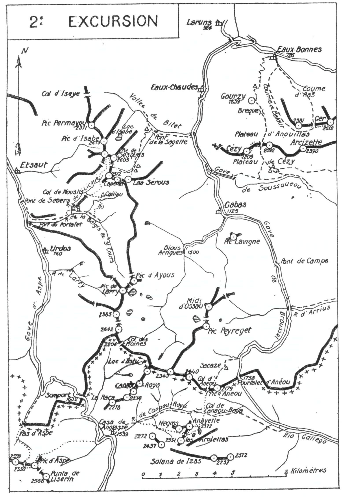

<style>.centre {text-align: center}</style>
<style>.droite {text-align: right}</style>

[//]: # (— p. 39 —)


# DEUXIÈME EXCURSION

__Cinq jours au départ des Eaux-Chaudes__

B. E. — Du 1" Juillet au 15 Septembre.

Cartes à emporter : Oloron et Laruns réunies.

__Des EAUX-CHAUDES (1) aux EAUX-BONNES,__\
__Par le Pic de Sesques,__\
__la Vallée d'Aspe, le Pic d'Aspe, l'Anayette, le Pic de Cézy__\
__et le Pic de Ger.__

(Emporter des conserves pour cinq repas).

<u>__AVIS AUX TOURISTES__</u>

C'est par un itinéraire nouveau que nous allons faire la traversée 
de la Vallée d'Ossau à la splendide Vallée d'Aspe dans la
première journée de la deuxième Excursion. Cet itinéraire, peu
pratiqué par les touristes pour le versant d'Ossau, est à peu près
inconnu (même par les guides Ossalois) pour le versant de la
Vallée d'Aspe. On retiendra donc un guide pour faire simplement
l'ascension jusqu'au pic de Sesques. Du Sesques à Urdos,
l'itinéraire en est si minutieusement détaillé qu'un débutant
pourra en effectuer le trajet sans erreur, même par le brouillard.

C'est à Urdos que je conseille de prendre un guide pour la
deuxième et la troisième journée.

<p class="droite">(Voir ci-contre la Carte de l'Excursion).</p>

———

(1) Les Eaux-Chaudes (B.-Pyr.), commune et c. de Laruns (5 k. 500),
postes et télégraphes, desservi par des automobiles depuis la gare
de Laruns (6 k.).


<div class="page"/>

— p. 40 —




<div class="page"/>

— p. 41 — (2me EXCURSION) CAPERAN DE SESQUES


## PREMIÈRE JOURNÉE

__Des EAUX-CHAUDES (675m) à URDOS (760m),__\
__par la Gorge de Bitet, le Pic de Sesques (2.605m)__\
__et le Chemin de la Mâture.__

—— GUIDE UTILE ——

__Conseils.__ — __Itin. recomm.__ — Comme on ira coucher à Gabas le
soir de la troisième journée, on pourrait, depuis les Eaux-Chaudes, 
y envoyer le linge et les provisions nécessaires aux deux
derniers jours. Les occasions ne manqueront pas pour faire remettre 
l'envoi, hôtel des Pyrénées, chez Baylou.

On partira de très bonne heure par la route de Gabas qu'on
suivra jusqu'après le pont de Miéjabat, à 2 k. 800 des Eaux-
Chaudes. Là, on verra un poteau du Touring-Club, placé à
l'amorce d'un chemin muletier et indiquant la gorge de Bitet,
à 20 min.; c'est le chemin du Col d'Iseye qu'il faut prendre, afin
de remonter le vallon de Bitet par la rive dr. Environ 20 min.
après, on s'avancera momentanément sur un petit pont situé à
dr. et du haut duquel on admirera l'impressionnante gorge de
Bitet; puis on reprendra le grand chemin du Col d'Iseye.

On monte sous bois et on arrive bientôt au pont qui franchit
le torrent de Sesques et qu'on nomme « Pont de la Sagette »,
parce que la Sagette de Sesques commence immédiatement après.
En haut, à g., on aperçoit la jolie cascade de Sesques.

A 100 m. du pont, on verra, sur la g., un sentier qui monte raide
vers un petit plateau où se trouve une cabane; c'est le chemin
de Sesques qu'il faut suivre en laissant, à dr., le grand chemin
du Col d'Iseye et en prenant la direction S.-O. Un peu plus haut
que la cabane, on trouve l'amorce définitive du sentier qui pénètre 
un peu, à g., dans une forêt d'épicéas et qui, en de nombreux 
lacets, grimpe au premier plateau de Sesques par la rive
g. du torrent.

On marche d'abord sous forêt, puis à découvert par des rochers, 
et enfin, par une clairière presque horizontale qui précède
le premier plateau ou Artigue de Sesques; parvenu là, on découvre 
subitement, au S.-S.-O., le fameux Capéran de Sesques, dont...


<div class="page"/>

— p. 42 — CIRQUE de SESQUES (2me EXCURSION)

...la première ascension a été faite par Pierre Bourdieu, d'Escot, le
4 juin 1922.

Parvenu au premier plateau, on le traversera direction S. en
laissant, à dr., les ruines d'une cabane. En haut de l'Artigue, le
chemin bien tracé continue par la rive g. du torrent et conduit
directement au plateau supérieur, ou cirque de Sesques, où se
trouvent plusieurs cabanes et une bonne source.

Le site, qui prend déjà l'aspect de la haute montagne, est très
beau. On a devant soi et presque sur la tête : au S., la crête de
Las Sérous, dont plusieurs pointes sont d'alt. à peu près égale,
aux environs de 2.400 m.; au S.-S.-O., le Capéran de Sesques

(2.300m), qui, vu de ce point, produit un effet terrifiant, au S.-O.
le Mondaout (2.512m) (1); enfin, à l'O. le Pic de Sesques ou
Scarput (2.605m).

Contrairement à ce qui est indiqué dans les cartes et dans le
Joanne, le Pic de Sesques et le Scarput sont un seul et même
pic. Les bergers d'Ossau le nomment « Scarput », et ceux d'Aspe
l'appellent « le plus haut pic de Sesques. »

Un grand névé garnit le haut du cirque, et c'est en amont, à
sa g., qu'il faut rejoindre l'amorce du sentier qui grimpe, de l'E.
à l'O., par le flanc N.-E. du Mondaout, jusqu'au Col de Sesques.
Dans ce trajet, on décrit un arc de cercle de g. à dr., par le
haut du cirque, et on passe exactement sous le Capéran, dont l'ai-
guille se dresse menaçante au-dessus de la tête.

Parvenu au col, on y déposera le sac. Le Col de Sesques est
situé vers 2.350 m., entre le pic de ce nom (2.605m), au N., et le
Mondaout (2.512m), au S. A 5 min., au N. du col, on trouve une
source à la base de petits rochers blancs.

Dans 1/2 h., on fera l'ascension facile du Pic de Sesques en
suivant, au N., les croupes mi-pierraille, mi-gazon. On y trouvera
les débris de l'ancien signal.

Le Sesques, qui comprend une double cime, est une montagne...

———

(1) Les bergers d'Aspe, qui ont droit de pacage sur cette montagne, 
l'appellent Mondaout; mais ce nom est presque inconnu sur le
versant d'Ossau. Dans son guide des Eaux-Bonnes, le Comte de
Bouillé (qui avait pris le pseudonyme de Jam) a francisé le nom de
ce pic en celui de « Mondos ». C'est par erreur que le panorama du
Pic de Ger, du Joanne, donne à ce pic le nom de « Scarput » en lui
attribuant une alt. de 2.607m. Le Mondaout n'a que 2.512m et la
côte 2.607 n'est atteinte par aucun des pics du massif de Sesques.

<div class="page"/>

— p. 43 —  (2me EXCURSION) PIC de SESQUES

...trapue, soutenue par de puissants contreforts. La pointe secondaire, 
située à environ 400 m. au N.-O. du sommet principal,
est en contrebas de quelques m. seulement. L'alt. relativement
modeste de ce grand pic est compensée par l'immensité de son
panorama, qui s'étend de la plaine aux plus hautes cimes des
environs de Cauterets. Les massifs d'Anie et d'Aspe paraissent
à deux pas, et le Visaurin a tout à fait l'aspect du cylindre du
Marboré. On a sous ses pieds, à plus de 500 m. de profondeur,
au N., le cirque d'Isabe avec son joli lac d'un beau vert d'émeraude.

Placé au centre d'une région située entre les vallées d'Aspe
et d'Ossau, le Sesques commande un massif d'environ 40 k. de
long sur 15 de large. De nombreux isards vivent dans ce massif.

Pour compléter le point de vue des abords immédiats et sur
la plaine, on ira à toute crête du sommet S.-E. au sommet secondaire. 
Dix min. suffisent pour ce trajet, et il n'en faut que 20
pour revenir de ce dernier sommet au col de Sesques.

Au S. du sommet secondaire, se trouve le large col par lequel
on peut descendre, en 3 h., à Etsaut. Cette voie est sans intérêt et
après avoir repris le sac, on se dirigera au S., vers la Baigt de
Saint-Cours.

Au S.-O. du Col de Sesques, au delà d'une cuvette, on aperçoit
un petit col herbeux, derrière lequel se trouve l'origine d'un
vallon rocheux qui s'incline, au S.-S.-O., vers les pâturages de
Moustis; c'est par là qu'on descendra en partant par la rive g.
du vallon.

Après 10 m. de marche, une sente de moutons passe sur la
rive dr., à travers les couches de calcaire fissuré, parsemé de
fines herbes dont ces animaux sont très friands. On suivra cette
sente pendant 10 m. environ sur la rive dr., puis, par un crochet
à g., on reviendra sur l'autre rive en sautant le petit torrent du
vallon, 50 m. en aval de sa source. Là, le sentier se précise en
longeant le torrent de très près et en se dirigeant vers les pentes
S. du pic de Mondaout. On le suivra jusqu'au moment où, devenant 
presque horizontal, il tourne à l'E.

De ce point, tout le fond des vallées se découvre, et on aperçoit 
un peu plus bas, au S.-O., une petite colline boisée qui
partage le vallon en deux, formant une verte dépression qu'on
nomme Col de Moustis. On quittera alors le sentier et, en zigzaguant 
les pentes de la rive g. on descendra directement au col.


<div class="page"/>

— p. 44 — CHEMIN pe La MATURE (2me EXCURSION)

Là, le torrent suit la face O. de la colline par le petit vallon
accidenté de Licoué. On optera pour le vallon de g., par lequel
la descente est très facile, en se dirigeant vers la Bergerie de
Caillau. On traversera par là un très beau champ de chardons
bleus (Eryngium Bourgati), et on aboutira au ruisseau du Port
Mourt qui descend au N.-E. Sur sa rive g., on rejoindra un petit
sentier qui file presque horizontalement, à travers des bruyères
d'abord et ensuite, par une fougeraie où il se perd momentanément 
près d'une cabane. On le retrouve un peu plus loin et il
se transforme alors en sentier muletier qui, après avoir fait un
long lacet vers le torrent, descend directement à la Baigt de
Saint-Cours où il rejoint le grand chemin de sa rive dr. Quelques 
min. après, on franchit le pont de la Hourcade et 10 min.
plus loin, après les métairies de Lacoste, celui de Sescoué, sur
le torrent de Licoué. Environ 60 m. après ce dernier pont, le 
chemin bifurque; on prendra celui de g. qui descend pendant
quelques min. et qui repart ensuite à dr., presque horizontalement.

On arrivera par là au chemin le plus fantastique des Pyrénées,
au chemin de la Mâture. Comme son nom l'indique, on faisait
passer par là les sapins fameux de la Baigt de Saint-Cours qu'on
destinait à des mâts de navires. On a échancré le flanc de la
montagne pour permettre le passage d'un mulet trainant un
sapin, et rien n'est plus terrifiant que ce chemin suspendu. Dans
la profonde gorge de la partie inférieure de la Baïigt de Saint-
Cours, on a dû, pour pouvoir passer, tailler le chemin en encorbellement 
dans le roc vif, sur une longueur d'environ 2 k. et sur
des flancs à pic. Parfois il surplombe le torrent de plusieurs
centaines de m. Rien n'est plus impressionnant que ce passage
et, comme le chemin n'est pas bien entretenu depuis quelques
années et, qu'en certains endroits, il s'est rétréci, on se penche
instinctivement vers les parois de la montagne, tant on a la
sensation d'être en l'air.

Si, au dernier tournant, à celui qui fait face au fort du Portalet
et qui le domine, on regarde en arrière, on se demande, en fré-
missant, comment on a pu passer par là sans difficulté et sans
vertige. Les amateurs d'émotions fortes trouveront pleine satisfaction 
dans ce trajet.

Parvenu à hauteur du fort, on débouche dans la vallée d'Aspe,
et le chemin qui contourne la montagne descend vers le N., par...

<div class="page"/>

— p. 45 —  (2me EXCURSION) URDOS

...la rive dr. du gave, jusqu'au pont de Sebers, où il rejoint la
grand'route, 8 k. en aval d'Urdos. On n'aura plus qu'à suivre
cette dernière qui remonte par la rive g. et qui fait passer près
du Fort du Portalet. On remarquera au passage l'entrée de l'impressionnante 
gorge et une partie du chemin de la Mâture suspendu tout en haut.

Nota. — Si, comme fin août 1918, le gave d'Aspe n'a qu'un
petit volume d'eau et qu'on puisse le traverser sur des pierres, 
en face d'une prairie située 1 k. en amont du pont de
Sebers, on évitera un fastidieux trajet de 2 k., ce qui fera
gagner 1/2 h. On peut toujours traverser le gave à gué vers ce
ce point, et 10 min. suffisent pour aller du chemin de la rive
dr. à la grand'route de la rive g.

__Horaire de la Journée:__

```
Des Eaux-Chaudes au Cirque de Sesques.....   3 h  "  }
Du Cirque au grand Pic de Sesques.........   2 h  "  }
Du grand Pic de Sesques au Col par le                }  10 h. 30
  petit pic                                  0 h. 30 }  (Arrêts en sus)
Du Col de Sesques à la Baigt de Saint-Cours. 2 h. "  }
De ce point à Urdos (1)....................  3 h. "  }
```


## DEUXIÈME JOURNÉE

__De URDOS (760m) à la CASA DE ANGLASSÉ (1.339m),__\
__par le Pic d'Aspe (2.645m) et le Cirque de Tortiellas.__

—— GUIDE INDISPENSABLE ——

__Conseils.__ — __Itin. recomm.__ — A son arrivée, la veille, on aura
retenu un guide pour deux jours et commandé une voiture pour
se faire conduire au grand lacet de Sansané, 10 k. d'Urdos, sur
la route de Somport.

Dès la sortie d'Urdos, on apercevra, droit au S., dans l'axe de
la vallée, le Pic d'Aspe, ainsi que la brèche située à sa dr., par
laquelle on en fait l'ascension. Cette brèche forme une échancrure 
profonde entre la Llena de la Garganta, à l'O. et le Pic
d'Aspe, à l'E.

Au grand lacet de Sansané, 4 k. en deçà du Somport, on quittera 
la grand'route pour prendre, à dr., un sentier qui passe sous...

———

(1) A Urdos, bon hôtel Ferras.


<div class="page"/>

— p. 46 — PIC D'ASPE  (2me EXCURSION)

...une hêtraie et va aboutir presque horizontalement près du gave
d'Aspe. Ce sentier longe ensuite le gave sur la rive dr. jusqu'à la
base de puissantes murailles qui ferment l'horizon. On arrive là
au pied d'un ressaut du haut duquel le gave tombe, en plusieurs
cascades, d'Espagne en France, en franchissant la frontière au
Pas d'Aspe (1.675m). Par une rude escalade de 1/4 d'h., le long
du gave, on arrive à l'entrée du cirque d'Aspe que dominent de
près de 1.000 m. les trois cimes qui le ferment au S.; à dr., la
Llena del Boso (2.562m); au centre, la Llena de la Garganta
(2.599m), et enfin, à g., le Pic d'Aspe (2.645m). Entre les deux
dernières, est située la Brèche d'Aspe.

Laissant à dr. les pentes qui conduisent au Port d'Aisa, on
s'élèvera par des pelouses, direction S.-E., vers une petite cascade 
qui est, dit-on, la source du gave d'Aspe. Puis, longeant la
base des falaises de la Llena de la Garganta, on arrivera sur
une terrasse herbeuse, au-dessus de laquelle on tournera à dr.,
au S.-O., vers un névé. On le traversera pour aboutir à la Brèche
d'Aspe (2.350m), où on passera sur le versant espagnol.

De la brèche, on fera l'ascension à flanc S. de crête en moins
de 1 h. Partant direction E., on traversera des pentes de roches
fendillées, des corniches fleuries et un petit ravin qui monte, par
l'O., au point culminant du massif d'Aspe (2.645m).

Le Pic d'Aspe a été mis en valeur et minutieusement exploré
par M. G. Cadier, qui en a fait une description aussi lumineuse
qu'enthousiaste dans l'Annuaire du C. A. F., année 1903, 
pages 164 à 194.

Son panorama est des plus complets. La vue est même plus
belle que celle du Visaurin, surtout vers le N., car le pic se trouvant 
dans l'axe de la vallée, on en suit toutes les sinuosités jusqu'à 
la plaine.

C'est surtout pour la descente aux cirques de Tortiellas et
d'Anglassé qu'un guide est utile. Par le brouillard, on trouverait
difficilement le chemin direct dans cette région mamelonnée.

On descendra, au N., par un couloir d'éboulis qui s'incline vers
le cirque d'Aspe; puis, en obliquant un peu au N.-E., on arrivera
près d'une arête qui le sépare du cirque de Tortiellas. L'arête
franchie, on continuera par la rive g. de ce dernier cirque, en
inclinant à l'E., vers le fond, afin d'aboutir au cirque d'Anglassé.
On rejoindra par là la grand'route et on ira coucher à la Casa
de Anglassé (1.339m).

<div class="page"/>

— p. 47 — (2me EXCURSION) PIC D'ANAYETTE

La Casa de Anglassé est située sur la rive g. du torrent, au
confluent du vallon de Canaou Roya.

Nota. — Si on ne peut plus coucher à la Casa de Anglassé,
on descendra 1/4 d'h. plus bas au nouveau vill. des Arañonés,
qui est situé, vers 1.200m d'alt., près de la gare internationale
de Canfranc (4 k.). On y trouve déjà trois hôtels.

__Horaire de la Journée :__

```
De Urdos au lacet de Sansané (en voiture). 1 h. 45 }
Du Lacet de Sansané au Pas d'Aspe......... 1 h. 30 } 9 h. 30
Du Pas d'Aspe au Pic d'Aspe............... 2 h. 30 } (Arrêts en sus)
Du Pic d'Aspe à Anglassé.................. 3 h. 45 }
```

## TROISIÈME JOURNÉE

__De la CASA DE ANGLASSÉ {1.339m) à GABAS (1.125m),__\
__par l'Anayette (2.572m)et le Col d'Anèou (2.100m).__

—— GUIDE UTILE ——

__Conseils.__ — __Itin. recomm.__ — On prendra, au N.-E. le sentier
qui remonte la rive dr. du ruisseau de Canaou Roya. Environ
3/4 d'h. après, on passera rive g., et on quittera le sentier pour
monter à dr., en contournant les pentes, afin de rejoindre assez
haut le petit vallon rapide qui tourne au S.-E. On aura bientôt sur
sa g., au N., la Punta de las Négras (2.460m), et droit devant soi, à
l'E., le col qui s'ouvre entre las Arolletas (2.551m), au S., et
l'Anayette (2.572m), au N.-N.-E. On montera au col et, à partir
de là, on grimpera à flanc E. de crête jusqu'au sommet.

L'Anayette est un pic très aérien. Ses murailles N. sont terrifiantes 
et il paraît inaccessible par cette face. Son panorama est
l'un des plus beaux de la région, mais ce qui retient surtout le
regard, ce sont les terribles escarpements méridionaux de l'Ossau
qu'on aperçoit dans tous leurs détails. Au S.-E., presque sous ses
pieds, brillent les deux petits lacs d'Anayette.

On peut descendre par la face E. pour aboutir au déversoir du
lac N., ce qui férait gagner 1/2 h.; mais, si cette voie parait trop
délicate, on reviendra au col, d'où on descendra, au N.-E. vers
les deux petits lacs.

<div class="page"/>

— p. 48 —  COL D'ANEOU-GABAS (2me EXCURSION)

Se dirigeant ensuite au N.-N.-E., on laissera bientôt, à g., le 
Col de Canaou Roya (2.095m), après lequel on prendra définitivement 
la direction N., afin de franchir la frontière au petit col
d'Anèou. Ce col, qu'il ne faut pas confondre avec le Pourtalet
d'Anèou (1.758m), plus à l'E. est situé vers 2.100 m. d'alt., à
l'O.-S.-O. du pic d'Anèou (2.179m).

Sur le versant français, immédiatement au-dessous du col, on
trouvera un bon sentier qui passe à la cabane de Sacaze et qui
va rejoindre la grand'route à 1.500 m. au N. du Pourtalet d'Anèou,
à 13 k. de Gabas (V. 1re E., p. 32).

Comme à partir du col d'Anèou, l'itinéraire ne présente pas
la moindre difficulté, même avec du brouillard, c'est de ce point
qu'on renverra le guide, ce qui lui permettra de rentrer le soir
même à Urdos.

Le trajet du col d'Anèou à Gabas, par la vallée de Brousset,
fait contourner l'Ossau par le S. et l'E. Donc, avec la descente
du Col d'Ayous par Bious-Artigues et l'ascension du pic lors de
la première excursion, le regard aura fait le tour complet de
cet intéressant sommet.

NOTA. — Au cas où on n'aurait pas réussi la première ascen-
sion de l'Ossau et qu'on veuille la reprendre, on couchera au
refuge de Pombie, au lieu de redescendre à Gabas.

__Horaire de la Journée :__

```
De la Casa de Anglassé à l'Anayette..... 4 h. "  }  9 h. 30
De l'Anayette au Col d'Anèou............ 2 h. "  }  (Arrêts en sus)
Du Col d'Anèou à Gabas.................. 3 h. 30 }
```

Nota. — Si on a couché aux Arañones, 20 min. en sus.

## QUATRIÈME JOURNÉE

__De GABAS (1.125m) aux EAUX-BONNES (726m),__\
__par la Gorge de Soussoueou,__\
__le Pic de Cézy (2.209m) et le Col de Lurdé (1.951m).__

—— SANS GUIDE ——

__Conseils.__ — __Itin. recomm.__ — Au N.-N.-E., l'horizon est borné
par une gracieuse montagne qui domine Gabas d'environ 1.100 m.
Ses faces blanches, ses crêtes dentelées et ses deux cimes qui
pointent vers le ciel, lui donnent une allure superbe des plus...

<div class="page"/>

— p. 49 —  (2me EXCURSION) PIC pe CEZY

...tentantes. C'est le Pic de Cézy (1) que le 4e jour d'excursion va
nous faire ascendre. Les aigles rôdent souvent autour de son
sommet, et ses pentes méridionales sont pleines d'Etoiles des
Neiges.

On prendra la route des Eaux-Chaudes qu'on suivra pendant
3 k. 600, jusqu'au point où on trouve, sur la dr., un petit sentier
qui descend par la forêt pour rejoindre, 10 min. après, la route
de chars de Soussoueou. Ce raccourci fait gagner 1/4 d'h.

On franchit bientôt, sur un pont de pierre, le gave de Gabas
qui est là très encaissé dans une gorge très sauvage, et la route
continue jusqu'aux bâtiments délabrés d'une ancienne scierie.
En amont de la scierie, un sentier muletier succède à la route,
en se dirigeant vers l'E., pour franchir le torrent de Soussoueou
au Pont de Goua, pont formé de deux sapins. A partir de là, on
s'élève en de nombreux lacets, par un chemin rocailleux qui
remonte la rive dr. du torrent à une certaine distance et presque
toujours sous forêt.

Environ 2 h. 30 après le départ, avant d'arriver à l'endroit
qu'on nomme « La Tume », on trouve, sur la g., l'amorce d'un
nouveau sentier qui grimpe au N., puis tourne au N.-E. pour
longer les falaises de calcaire blanc qui le surplombent. On
suivra ce sentier; on passera devant les abris naturels sous roche
et, après 1/4 d'h. de marche sur ce nouveau sentier, on tournera 
à g., au N., pour aboutir au plateau de Cézy, à l'O. des
Cabanes, vers 1.650 d'alt.

Parvenu au plateau, on aura devant soi, au N., le Col de Lurdé
(1.951m) et, un peu à g., presque sur la tête, la double pointe
du Pic de Cézy d'un blanc éclatant. A l'O. du Col de Lurdé,
on remarquera un deuxième col, plus étroit et plus élevé; c'est
vers ce dernier qu'il faut se diriger après avoir utilisé en partie
le sentier qui monte au col principal.

Vu du Col de Lurdé, le Pic de Cézy (2.209m) prend l'allure
hardie d'un sommet de haute alt. et, de fait, il procure au touriste 
qui en fait l'ascension les sensations d'un 3.000. Précédé
d'une crête déchiquetée aux multiples gendarmes, orné dans sa
face S. d'une corniche gazonnée qui a l'air d'un jardin suspendu,
on se demande par quelle voie on va y monter. Rien n'est plus
facile.

———

(1) Dans les cartes, ce sommet porte le nom de « Pic de Goupey ».


<div class="page"/>

— p. 50 — COL De LURDE (2me EXCURSION)

Après avoir déposé le sac au col, on partira vers l'O., dans la
direction du pic, en suivant une sente qui traverse presque
horizontalement le flanc S. d'une crête secondaire. Dans 1/4 d'h.,
on aboutira à la base d'un petit couloir gazonné, qu'on n'aperçoit 
pas du col, et qui grimpe, à dr., vers la crête. On trouvera
là le sentier qui conduit à 5 min. du sommet. Après avoir
gagné la crête, il passe sur le versant N., pour continuer à flanc
de crête jusqu'à une haute muraille située à l'E. du pic. Là, il
tourne à g., au S., en longeant par la base cette haute muraille,
pour repasser sur le versant S., d'où il monte droit à l'O., par
la corniche de gazon jusqu'à 30 m. du sommet. Dans 5 min.
d'escalade facile, par un éperon déchiqueté, on atteindra le
sommet du Cézy (2.209m), qu'on nomme aussi « Pic de Goupey ».

Ce sommet offre une vue superbe sur les vallées qui l'entourent, 
mais principalement sur celles de Brousset, de Gabas
et de Bious-Artigues. C'est au Cézy qu'il faut monter, si on veut
contempler dans toute sa puissance ce gigantesque monolithe
de 1.000 m. qu'est le Pic de Midi d'Ossau.

A l'E.-N.-E., à 5 k., on apercevra la masse blanche du Ger et
sa crête hirsute. On pourra, à la lorgnette, repérer presque toute
la partie supérieure de la voie d'ascension du lendemain.

Dans le versant S.-S.-E. du Cézy, on trouve plusieurs colonies
d'Etoiles des Neiges (1); c'est dans la corniche gazonnée que
sont les plus belles. Si on en cueille, on aura soin de couper la
fleur sans déraciner le pied; une plante arrachée est une plante
perdue. On reviendra au col par le chemin d'ascension.

Après avoir repris le sac, on descendra au N.-E. vers un ruisselet 
au delà duquel on rejoindra le sentier qui vient du vrai
col de Lurdé et qui se dirige au N., en contournant les croupes
mamelonnées du plateau d'Anouillas. On laissera, à dr., des entonnoirs 
profonds qui seraient des lacs sans l'écoulement souterrain 
des eaux. Bientôt le chemin descend en tournant vers
la g. et on le voit remonter en face vers une échancrure qu'on
nomme la Brèque. On aperçoit de ce point le vallon rapide de
Balour qu'on laisse en contrebas, à dr. et par lequel on pourrait 
aussi descendre aux Eaux-Bonnes par un temps très clair...

———

(1) Cette fleur portait autrefois un nom allemand. Sur la proposition 
de M. Léon Aucher, président du tourisme en montagne au
Touring-Club, on a adopté le nom français de « Etoile des Neiges ».


<div class="page"/>

— p. 51 — (2me EXCURSION) EAUX-BONNES

...ou avec un guide. Il vaut mieux suivre le bon chemin du Gourzy.

Après la Brèque, le sentier continue horizontalement au
N.-N.-O. vers le signal du Gourzy (1.839m) qu'on laisse à g.
pour descendre à nouveau, direction N., vers la cabane de
Gouziotte. Là, par un crochet à dr., il plonge dans un vallon
qu'on quittera bientôt, par un nouveau crochet à dr., afin d'aboutir, 
par la forêt, aux promenades Jacqueminot et Gramont qui
conduisent directement aux Eaux-Bonnes (1).

__Horaire de la Journée :__

```
De Gabas au Col de Lurdé..:............ 3 h. 45 }
Du Col de Lurdé au Pic de Cézy......... 0 h. 45 } 7 h. 45
Du Pic de Cézy au Col de Lurdé......... 0 h. 30 } (Arrêts en sus).
Du Col de Lurdé aux Eaux-Bonnes........ 2 h. 45 }
```

## CINQUIÈME JOURNÉE

__Ascension du Pic de Ger (2.612m) par la Coume d'Aas,__\
__avec retour aux Eaux-Bonnes par la Coume de Balour.__

 
—— GUIDE INDISPENSABLE ——

__Conseils.__ — __Itin. recomm.__ — Dès son arrivée aux Eaux-Bonnes,
on retiendra un guide, afin de partir à la pointe du jour.

Par un temps clair, un bon pyrénéiste pourrait conduire une
caravane au pic de Ger; mais, comme le brouillard y est fréquent 
l'après-midi et que le plateau d'Anouillas est par excellence 
le terrain qui, dans ce cas là, prête à erreur, un guide me
paraît indispensable.

Partant en amont des Eaux-Bonnes, direction S.-E., on prendra
le sentier qui remonte le torrent de la Sourde par la rive g.
Environ 1/2 h. après, on laissera, à dr. la gorge de Balour et,
1 h. plus haut, on arrivera près de la fontaine de Gesque, à
l'origine de la Coume d'Aas. C'est là qu'on fait d'ordinaire sa
première halte.

Le terrain change d'aspect; ce ne sont qu'éboulis et raillères,
sauf sur la dr., un peu plus haut, où les pentes sont boisées.

——— 

(4) Les Eaux-Bonnes (Basses-Pyrénées), desservi par des automobiles 
depuis la gare de Laruns (6 k.).


<div class="page"/>

— p. 52 — PIC de GER  . (2me EXCURSION)

Quelques min. plus loin, on tourne à dr., pour entrer dans la
forêt par laquelle on s'élève sur des pentes escarpées jusqu'à la
cabane de Ger, vers 1.900 d'alt. On quitte là la forêt pour attaquer 
des pentes rapides de gazon et de rochers blancs.

On aura devant soi, au S., l'impressionnante aiguille du Capéran 
du Ger qu'on contournera afin de gagner la crête au col
du Ger, entre le Pambassibé (2.381m) à l'O., et le Pic de Ger,
à l'E.

A partir du col, on suit la crête jusqu'à la base du pic dont
on gravit facilement la pointe secondaire. Une arête, plus impressionnante 
que difficile, conduit ensuite au sommet principal
(2.612m).

Le Pic de Ger est un belvédère de premier ordre. Le Joanne,
dans un panorama admirablement dessiné, en a donné le tour
d'horizon complet.

Pour la descente, on reviendra au Col du Ger où on trouve
un sentier qui descend d'abord au S. et qui tourne ensuite à l'O.
par le plateau de Cardoua, vers celui d'Anouillas. On longera
ce dernier par la rive dr. en se dirigeant au N.-O. et en laissant,
à g., un grand entonnoir, afin d'aboutir en haut de la Coume
de Balour.

On contournera ainsi, par le S. et l'O., la base des pentes et
des contreforts du Pambassibé. On prendra ensuite la direction N.
pour descendre toute la Coume de Balour, et on ira rejoindre la
voie d'ascension à 20 min. des Eaux-Bonnes.

__Horaire de la Journée :__

```
Des Eaux-Bonnes au Col du Ger.......... 4 h. 30 } 10 h. 
Du Col du Ger au Pic de Ger............ 1 h. 30 } (Arrêts en sus)
Du Pic de Ger aux Eaux-Bonnes.......... 4 h.    }
```

Nota. — En partant à 4 h., on peut rentrer assez tôt pour
prendre un train qui quitterait Laruns vers 18 h.

<u>__POINTS D’INTERRUPTION__</u>

__URDOS__

- Pour abandonner ou pour rejoindre après la 1" journée
d'excursion.
- Pour rejoindre de Laruns (14 k.)... 3h.

__GABAS__
- Pour rentrer à Laruns après la 3° journée... 2 h. 45
- Pour rentrer à Laruns après la 4° journée... 1h.

__EAUX-BONNES__
- Pour rejoindre de Laruns (5 k.)... 1h.
