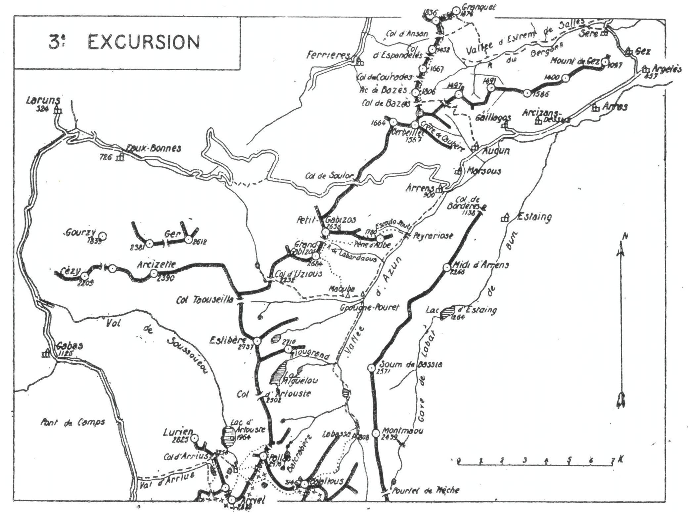
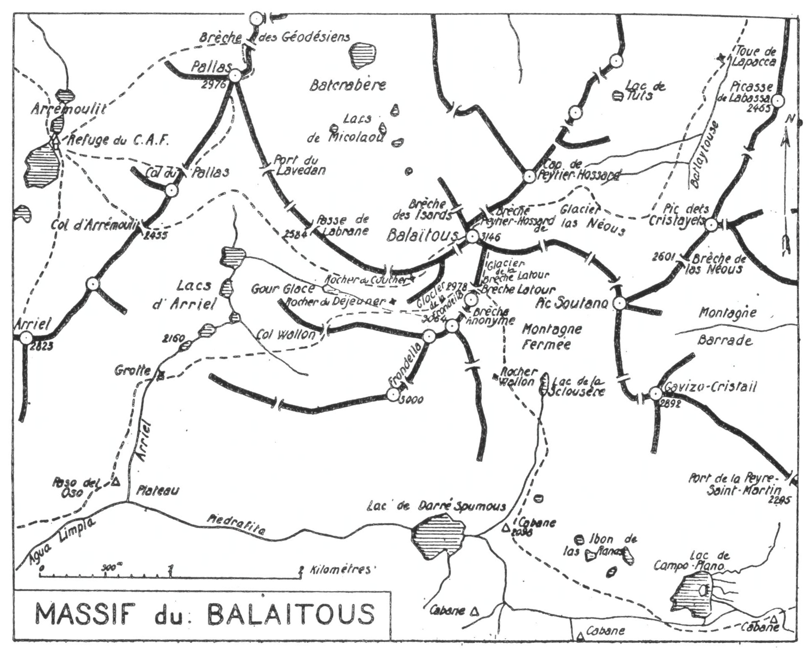

<style>.centre {text-align: center}</style>
<style>.droite {text-align: right}</style>

[//]: # (— p. 53 —)

# TROISIÈME EXCURSION

__Cinq jours au départ de Laruns__

_B. E. — Du 15 Juillet à fin Août._

Cartes à emporter : Oloron et Laruns réunies, Tarbes.

__De LARUNS (1) à ARGELÈS,__\
__par les Eaux-Chaudes, Gabas, le Pallas, le Pic d'Arriel,__\
__le Balaïtous, le Gabizos,__\
__le Pic de Bazès et le Soum de Granquet.__

(Emporter des vivres pour sept repas).

<u>__AVIS AUX TOURISTES__</u>

Pour cette excursion, il est prudent de retenir un bon guide
à l'avance pour les quatre premiers jours. Si on part plus
de deux, on prendra aussi un porteur, au moins pour les deux
premiers jours.
Le nouveau refuge d'Arrémoulit, où on couchera le premier
soir, a été solidement reconstruit en 1925, à la même place
que l'ancien, et peut contenir 12 à 14 personnes. Comme il
est bâti en ciment armé, on est maintenant assuré de le trouver 
debout pour de nombreuses années. Grâce à cette réédification, 
et aussi à la construction récente des refuges de
Labassa et de Campo-Plano, on peut dorénavant circuler dans
tous les sens à travers le massif du Balaïtous, sans s'exposer
à coucher à la belle étoile.

<p class="droite">(Voir ci-contre la Carte de l'Excursion).<br>
(Voir aussi page 58 le Plan du Balaïtous).</p>

———\
(1) Laruns, chef-lieu de canton, 2.200 h., point terminus du chemin
de fer dont l'embranchement est à Pau. Gare desservant les Eaux-
Bonnes et les Eaux-Chaudes.

<div class="page"/>

— p. 54 —



<div class="page"/>

— p. 55 — (3me EXCURSION) ARRIUS-ARREMOULIT

## PREMIÈRE JOURNÉE

De LARUNS (524m) au REFUGE D'ARRÉMOULIT (2.304m),
par les Eaux-Chaudes (675m), Gabas (1.125m),
la Vallée de Brousset, le Val et le Col d'Arrius (2.254m).

—— GUIDE INDISPENSABLE ——

__Conseils.__ — __Itin. recomm.__ — Si on n'a pas couché la veille à
Laruns, on y arrivera par le premier train. On se fera conduire
immédiatement en auto par les Eaux-Chaudes (6 k.), Gabas
(14 k.) et la vallée de Brousset sur la route de Panticosa qu'on
suivra jusqu'au confluent du Val d'Arius, 22 k. de Laruns. On
pourra déjeuner là.

Remontant ensuite à l'E. le Val d'Arrius, on suivra le sentier
qui, par la rive dr. et après avoir franchi deux ressauts, conduit
au col de ce nom (1).

Du Col d'Arrius, on dominera d'environ 300 m. le Lac d'Artouste 
et on aura en face la cime majestueuse du Pallas. Au
S.-S.-E., se présentent, un peu en biais, les deux pointes de
l'Arriel qu'on ascendra le lendemain. Celle qui est le plus au
S. est le véritable sommet.

Pour rejoindre le refuge d'Arrémoulit, on descendra 10 min.
à l'E.; puis, laissant à g. le sentier d'Artouste, on prendra, à dr.,
celui qui traverse une terrasse gazonnée pour aboutir près du
lac inférieur (2.232m). On n'aura ensuite qu'à remonter à travers
la rocaille en suivant le sentier; ce dernier franchit bientôt le
déversoir du grand lac, en vue et à 2 min. du refuge qui est
situé rive dr., à 2.304 m. d'alt.

Nota. — Du col d'Arrius, il existe un raccourci qui permet
d'arriver presque horizontalement au refuge d'Arrémoulit;
c'est la voie Orteig. On en trouve l'amorce à quelques min.
au S. du col, en laissant à g. un piton rocheux et, à dr. le
lac d'Arrius. Après avoir contourné de dr. à g. un flanc
escarpé et très incliné sur le versant d'Artouste, on arrive en
face du refuge, qu'on aperçoit 5 min. en contrebas.

__Horaire de la Journée :__

```
De Laruns au Val d'Arrius (22 k. de route)... 
De ce point au Refuge d'Arrémoulit...........   3h.30
```

———\
(1) Le col d'Arrius est situé à 2.25m d'alt., entre le Lurien (2.825m),
au N.-N.-E. et le petit pic d'Arriel (2.606m), au S.-S.-E.

<div class="page"/>

— p. 56 — PALLAS (3me EXCURSION)


## DEUXIÈME JOURNÉE

__Journée d'approches du Balaïtous__\
__en faisant les Ascensions du Pallas (2.976m) et de l'Arriel (2.823m).__

—— GUIDE INDISPENSABLE ——

__Conseils.__ — __Itin. recomm.__ — Le porteur gardera les provisions
tout en faisant la corvée du bois. On pourra le renvoyer dans
l'après-midi, si on ne veut pas le garder pour toute l'excursion.

On fera, sans sac, l'ascension du Pallas le matin, et celle de
l'Arriel, l'après-midi; on n'emportera qu'un casse-croûte.

On montera à l'E. au Col du Pallas (col supérieur d'Arrémoulit) 
où on passera en Espagne. Obliquant ensuite à g., au
N.-E., on marchera horizontalement à flanc de montagne pendant 
1/4 d'h. environ, puis on grimpera directement pendant
1/2 h. On arrivera alors au pied de trois cheminées obliques
qui descendent de l'arête S.-S.-O. dont une, celle de dr., est à
peine visible; c'est par cette dernière qu'il faut gagner la crête
qu'on suivra jusqu'au sommet du Pallas (2.976m).

Si, du Pallas, on porte ses regards au S.-E., de l'autre côté du
cirque, on peut étudier presque tous les détails de la face vertigineuse 
qui, du Balaïtous, plonge dans Batcrabère et reconnaitre
la partie délicate de l'ascension du lendemain. Le trajet de la
« Grande Diagonale », comme l'appelle M. G. Cadier (1), commence 
à la crête frontière, au-dessus du Rocher du Coucher,
pour finir à moins de 100 m. au N. de la tourelle du Balaïtous.

Au grand intérêt que présente l'ascension du Pallas, s'ajoute
le puissant attrait de la belle vue dont on jouit de ce sommet
sur la face la plus grandiose du Balaïtous. Je suis bien de l'avis
de mon collègue, M. Bourdil, quand il écrit à ce sujet : « On
note le détail de ses abimes. On mesure l'élan vertigineux de sa
muraille surgie du chaos des neiges comme une sombre image
de la mort, etc., etc. (2). »

Pour varier l'excursion, on pourra descendre au N., à toute
crête, jusqu'à une petite échancrure qu'on nomme « Brèche des

———\
(1) V. le volume sur le Balaïtous, p. 85, et aussi Au Pays des
Isards, tome 2, p. 122.
(2) V. Bulletin Pyrénéen, année 1907, p. 278.


<div class="page"/>

— p. 57 —  (3me EXCURSION) ARRIEL

Géodésiens ». Ce trajet, un peu délicat, exige quelque attention.

On partira à toute crête en franchissant une brèche de 4 ou
5 m., à pariir de laquelle on continuera sur d'énormes blocs.
Quelques min. après, on suivra une petite corniche du versant E.,
d'où on passera sur le versant O. pour continuer jusqu'à la
Brèche des Géodésiens. A partir de là, on descendra à l'O., afin
de contourner la base d'un contrefort après lequel on obliquera
au S.-O. pour revenir directement au refuge.

__Horaire du Pallas__, aller et retour, environ 5 h., arrêts en sus.

L'ascension de l'Arriel se fait ordinairement (au départ du Col
d'Arrius) par le Col de Sobe (2.445m) d'où, par une crête facile,
on arrive en 1 h. au sommet principal. Mais je conseille l'ascension 
directe par l'itinéraire suivant :

Du refuge, on montera droit au S. et, en laissant le Col d'Arrémoulit 
à g., à l'E., on se dirigera vers un névé qu'il faut traverser. 
On apercevra bientôt devant soi deux couloirs parallèles
qui se réunissent vers le haut pour aboutir à la profonde dépression 
située entre le grand et le petit Arriel. On montera d'abord
par le couloir de g. et, à mi-hauteur, on tournera à dr. pour
passer à l'autre couloir qui grimpe jusqu'au Col. On rejoint là
l'itinéraire du Col de Sobe et, dans moins de 1/2 h., on arrive
au sommet du grand Pic d'Arriel (2.823m).

L'ascension de l'Arriel est facile par les faces :N. et O.; les
faces S. et E. sont des murailles à pic.

Sans offrir l'intérêt du Pallas, l'Arriel est un belvédère magnifique. 
On a sous ses pieds le beau cirque de ce nom et la profonde 
gorge de l'Agua-Limpia.

A l'E., on apercevra dans toute leur splendeur les arêtes de la
Frondella, le glacier de ce nom et la brèche Latour par laquelle
nous fera passer une prochaine excursion.

Que dire de la vue sur le Balaïtous ? De quel côté qu'on le
regarde, il paraît imposant, grandiose et fascinateur. A plus
forte raison de l'Arriel, puisque, comme du Pallas, on le touche
presque.

Si on ne veut pas rentrer au refuge par la même voie, on
pourra descendre à l'O. au Col de Sobe où on prendra le sentier
qui se dirige au N. vers le lac d'Arrius. Là, on franchira une


<div class="page"/>

— p. 58 — PLAN du BALAÏTOUS (3me EXCURSION)



<div class="page"/>

— p. 59 — (3me EXCURSION) COL D'ARREMOULIT

croupe, au N.-E., pour retrouver, quelques minutes après, le
sentier de la veille qui, par le Col d'Arrius, conduit au refuge.

Horaire direct de l'Arriel, aller et retour, 4 h., arrêts en sus.
(Par le Col de Sobe et le Lac d'Arrius, 1 h. en sus.)

## TROISIÈME JOURNÉE

D'ARRÉMOULIT (2.304m)au REFUGE DE LABASSA (1.970m),
par le Balaïtous (3.146m).

—— GUIDE INDISPENSABLE ——

NoTa, — Depuis quelque temps, on dirait que certaines
montagnes s'humanisent, et le Balaïtous est de ce nombre. A
l'occasion du centenaire des officiers géodésiens, en 1925, j'ai
refait l'ascension de ce fier sommet et, malgré mon âge
(68 ans), je l'ai trouvé extraordinairement débonnaire. Aucune des
grandes rimayes des alentours n'était ouverte le
3 août; la surface glaciaire du couloir neigeux de la « Grande
Diagonale » était si diminuée en profondeur que ma caravane 
a pu en contourner le glacier par la base sans quitter
le rocher, ce qui a considérablement facilité l'ascension; enfin,
comme on a placé des crampons à la Brèche Latour, la descente 
sur le couloir s'est effectuée sans la moindre difficulté.

__Conseils.__ — __Itin. recomm.__ — L'ascension du Balaïtous, au
départ d'Arrémoulit, est aujourd'hui classique, avec un itinéraire
bien déterminé. C'est celui qui, dans la partie supérieure, passe
par la voie que les Cadier appellent la « Grande Diagonale ».

La « Grande Diagonale » est située sur la face O., versant de
Batcrabère, et parallèle à la crête Packe-Russell.

On montera au Col d'Arrémoulit (2.455m) où on passera en
Espagne, et on contournera par la g. le cirque d'Arriel aussi
haut que possible, afin d'aboutir au Rocher du Coucher en laissant 
à dr., en bas, le Gourg-Glacé et le Rocher du Déjeuner.
A dr., à l'E., entre la falaise verticale de l'arête S.-O. et le Rocher
du Coucher, un couloir monte directement à la crête frontière.
En haut de ce couloir, sur un rocher à g., quelques pierres superposées 
indiquent le passage; c'est le portillon de la « Grande
Diagonale » par lequel on repasse en France sur le versant de
Batcrabère.

<div class="page"/>

— p. 60 — BALAITOUS (3me EXCURSION)

Pour un pyrénéiste exercé, le trajet de la « Grande Diagonale »
est idéal, surtout à l'ascension, si on prend les précautions indiquées 
pour les montagnes très accidentées. On marchera en rang
serré, le guide en tête et le meilleur pyrénéiste le dernier.

Après quelques min. de marche sur une corniche presque
horizontale, la pente s'accentue subitement en abordant le premier 
couloir; c'est pendant près de 2 h. une ascension pénible
et pour laquelle il est indispensable de garder tout son sang-
froid. On grimpe et on coupe plusieurs couloirs dont quelques-
uns sont vertigineux; on laisse à g. la brèche des Isards, et
finalement on aboutit à une petite cheminée rapide qui conduit
à quelques min. au N. de la tourelle.

Parvenu au sommet, on fera le tour complet du plateau pierreux 
qui couronne le Balaïtous en plongeant ses regards vers
les profondeurs de toutes les faces du grand pic.

Après plus de 40 ans de montagne et après avoir visité presque
tous les grands pics de la chaîne pyrénéenne, j'ai fait une dernière 
ascension du Balaïtous en 1925, et mes impressions premières 
n'ont fait que se fortifier. Le Balaïtous est et sera toujours 
le plus attirant, le plus grandiose et le plus loyal des sommets 
pyrénéens.

Si le massif calcaire et celui des Monts-Maudits sont plus
imposants et plus majestueux, aucun de leurs pics, pris séparément, 
ne peut être comparé au Balaïtous.

Une nouvelle excursion nous fera monter au Balaïtous par la
Brèche Latour, pour redescendre ensuite à Sallent par le glacier
de la Frondella, le cirque d'Arriel, le Paso del Oso et la gorge
de l'Agua-Limpia. Deux visites au Balaïtous, c'est le minimum
qu'on puisse consacrer à l'admirable montagne.

La descente par le glacier de « Las Nèous » est encore plus
classique que l'ascension par la Grande Diagonale et, si les flancs
de la cheminée ne sont pas verglacés, cette descente est très
facile. Une seule difficulté existe quelquefois en tardive saison :
c'est l'ouverture exagérée de la rimaye du fond, ce qui rend
délicat le débarquement sur le glacier.

L'amorce de la cheminée de Las Nèous est située au N. de la
tourelle, en face de celle de l'ascension, mais sur l'autre versant. 
On descendra donc par la cheminée au glacier de Las
Nèous qu'on traversera par la g., le long des rochers, pour
éviter les crevasses de la partie supérieure. Toute la partie infé-

<div class="page"/>

— p. 61 — (3me EXCURSION) LABASSA

-rieure peut être franchie en de nombreuses glissades. On quittera
le glacier avant d'arriver tout à fait au fond, en obliquant à g.,
vers les pâturages de Lapaca. Là, on trouvera des sentes de
moutons qui descendent au N.-N.-E. jusqu'au refuge de Labassa (1).

Le nouveau refuge, qui est situé sur une petite terrasse à
1.970 m. d'alt., a été bâti au haut des pâturages de Labassa, au
S.-O. et à 25 min. en amont des Cabanes. Il peut contenir 10 ou
12 personnes et a été inauguré le 26 septembre 1926. Les dimensions 
intérieures sont de 5m sur 3m80, et la forme de la voûte est
ogivale comme celle du refuge de Tuquerouye. Le lit de camp est
en sapin.

Nota. — Au cas où on arriverait de très bonne heure à
Labassa, ce qui est très possible, on pourrait continuer la
descente jusqu'aux cabanes de Grougne-Pouret (1.232m), au confluent 
du vallon de Labas. Cela diminuerait la journée du lendemain 
d'environ 2 h. et augmenterait les chances du beau
point de vue au Gabizos, puisqu'on arriverait plus tôt au sommet.

__Horaire de la Journée :__

```
D'Arrémoulit au Balaïtous.......... 5h.   }   7h.45
Du Balaïtous à Labassa............. 2h.45 } (Arrêts EN US).
    (Pour descendre à Grougne-Pouret, 2 h. en sus.)
```

## QUATRIÈME JOURNÉE

__De LABASSA (1.970m) à ARRENS (900m),__\
__par les Pics de Gabizos (2.684-2.639m) et la Vallée d'Azun.__

—— GUIDE INDISPENSABLE ——

__Conseils.__ — __Itin. recomm.__ — C'est par une voie nouvelle, véritable 
voie de pyrénéiste, pleine d'intérêt, que nous allons monter
au grand Gabizos (2.684m) nommé aussi « Les Taillades. »

On descendra par la vallée d'Azun en suivant le chemin muletier 
jusqu'à Grougne-Pouret (1.232m), au confluent du vallon de

———\
(1) Il paraît que le nom officiel de ce refuge est « Refuge du
Balaïtous ».

<div class="page"/>

— p. 62 — GRAND GABIZOS (3me EXCURSION)


Labas. On remontera ce dernier, direction O., après avoir gagné
le sentier de la rive g. qui passe à une certaine hauteur. Après
la cabane de Maouba, on aboutira à un vallon qui grimpe droit
au N. et au fond duquel coule un petit torrent. On le remontera
en suivant les rives du torrent, afin d'aboutir à la dépression
située vers 2.100 d'alt. sur le contrefort S.-E. de la crête des
Taillades.

De ce point, on pourra repérer la voie d'ascension qui consiste
à suivre l'arête direction N.-O. afin de rejoindre la première
pointe des Taillades au point de jonction de la crête de Pènes
Blanques.

La crête des Taillades est composée de plusieurs aiguilles de
schistes ardoisiers, et le point culminant, presque au centre de
la crête, est le sommet assez spacieux de l'une de ces aiguilles.
Vers le N., deux autres rendent cette crête assez délicate, et on
ne peut la suivre que si on est un pyrénéiste exercé, non sujet
au vertige. Elle est cependant praticable, et c'est le chemin direct
du petit Gabizos, but principal de notre excursion.

Dans la partie supérieure, le vallon de Labardaous se divise
en deux branches, et tous les couloirs qui descendent vers la
branche S., sont praticables. Donc, si on juge quelque passage de
la crête trop scabreux, on pourra toujours descendre, plus ou
moins, à l'E. par l'un des couloirs puis, par une marche à flanc
d'éperon, rejoindre le couloir suivant qui ramènera à la crête.

Si, encore, après avoir ascendu la première pointe, la voie
de la crête paraît trop délicate, on n'aura qu'à redescendre à
l'E. d'environ 300 m. et à contourner horizontalement deux contreforts 
en se dirigeant au N. On aboutira par là à la profonde
brèche qui sépare les deux Gabizos, brèche que je propose de
nommer col de Labardaous, puisqu'elle domine le vallon de ce
nom. On y laissera le sac et le piolet.

A 30 m. du col, on apercevra une large rainure entaillée dans
les flancs du pic; c'est par là qu'il faut monter en tournant à g.
vers le haut, afin d'aboutir au pied d'une muraille de 4 ou 5 m.,
presque verticale. Des fissures du roc, dans lesquelles on introduit 
les mains et les pieds, permettent l'ascension de cette
muraille qui, de loin, paraît inaccessible, et on arrive immédiatement 
après au sommet du petit Gabizos (2.639m).

La cime du Gabizos est très pointue, et il n'y a place, tout au
plus que pour quatre ou cinq personnes. C'est un des rares som-


<div class="page"/>

— p. 63 —  (3me EXCURSION) PETIT GABIZOS

-mets sur lesquels on a l'impression du vide tout autour de soi, car
on ne peut suivre les lignes de chute jusqu'à la base du massif.
C'est au petit Gabizos qu'on jouit d'un magnifique panorama,
surtout sur les plaines de Pau et de Tarbes. Le Balaïtous, vu
du Gabizos, est terrifiant et majestueux.

On redescendra au col par la voie d'ascension, et, si on ne
veut pas garder le guide pour le lendemain, c'est de ce point
qu'il faut le renvoyer, il aura ainsi le temps de rentrer aux Eaux-
Bonnes le soir même.

A l'E. du col, s'ouvre le vallon de Labardaous qui descend
directement au fond de la vallée d'Azun. Il est garni d'éboulis
faciles dans sa partie supérieure, et la descente par cette voie
n'offre pas la moindre difficulté. On dévale bientôt par un flanc
très fertile en iris multicolores et fleurs de toutes sortes. En aval
du confluent des deux vallons supérieurs de Labardaous, le sentier 
passe rive dr. où on trouve une cabane, puis revient définitivement 
rive g. jusqu'au fond de la vallée où on rejoint le chemin 
de chars près d'une grange. Quelques centaines de m. plus
bas, près d'une carrière de baryte, ce chemin se transforme en
une route carrossable qui mène à Arrens dans moins de 1 h.

Nota. — S'il est de bonne heure, on peut s'offrir une variante
intéressante. A mi-descente, on pourrait faire un crochet à
g, au N. afin de gagner la crête E. du Gabizos au petit pic de
Pène d'Aube (1.780m). On a de ce petit. sommet un magnifique
point de vue sur la partie supérieure de la vallée.

On descendra ensuite par les pentes N.-E., vers le fond du
vallon d'Escoute-Pout, qui tourne à l'E. pour aboutir au grand
chemin de chars au pont de Peyrariose, à 3/4 d'h. d'Arrens.

__Horaire de la Journée :__

```
De Labassa à Grougne-Pouret........... 2h.   }
De Grougne-Pouret au Grand Gabizos.... 3h.   }   9h.45
Du (Grand Gabizos au Petit Gabizos.... 2h.30 } (arrêts en sus).
Du Petit Gabizos à Arrens............. 2h.15 }
```

<div class="page"/>

— p. 64 — PIC de BAZES (3me EXCURSION)


## CINQUIÈME JOURNÉE

__D'ARRENS (900m) à ARGELÈS (455m),__\
__par le Pic de Bazès (1.806m), le Pic de Navaillo (1.667m),__\
__le Roc de Monbula (1.452m),__\
__le Soum de Granquet (1.874m) et la Vallée d'Estrem de Salles.__


—— SANS GUIDE ——

Nota. — Cette cinquième journée, toute pleine d'un charme
reposant, fera monter sans fatigue aux deux jolis belvédères de
premier plan que sont le Pic de Bazès et le Soum de Granquet.
De leurs sommets, on jouit d'une vue splendide sur les régions
qu'on vient de visiter et aussi sur les plaines d'Argelès, de Tarbes 
et de Pau. C'est par la riante vallée d'Estrem de Salles
qu'on quittera les Pyrénées Occidentales, et c'est par Argelès
que la prochaine excursion nous fera aborder les Pyrénées
Centrales.

__Conseils.__ — __Itin. recomm.__ — On partira par la route d'Argelès
qu'on suivra jusqu'à Aucun (3 k.), chef-lieu de canton avec bureau
de poste. On traversera le vill. direction N. et, en amont d'Aucun,
on prendra le chemin muletier qui remonte au N.-O. vers la cabane 
d'Aguses par la rive g. du vallon. Après de nombreux lacets,
le chemin fait un long crochet vers l'O. pour franchir une crête
secondaire vers 1.400 d'alt. Continuant direction O., on traversera 
une petite sapinière et, par une légère remontée, on aboutira
au Col de Bazès (1.500m) d'où on découvre la partie haute de la
vallée de l'Ouzon. Droit au N. du col, on aperçoit le Pic de
Bazès (1.806m), et on peut en repérer presque toute la voie d'ascension 
qu'on fera à toute crête.

Au sommet du Bazès, on a sous les yeux tout le trajet à effectuer 
dans la journée jusqu'au vill. de Sère qui n'est qu'à 3/4 d'h.
d'Argelès. Devant soi, s'aligne la gracieuse et facile crête qui va
du Bazès au IGranquet. Ce parcours est tout à fait charmant, car
on domine constamment une des plus coquettes régions des Pyrénées.

On quittera le Bazès en suivant la crête au IN. par une descente 
au Col des Courades, pour remonter ensuite au Pic de
Navaillo (1.667m). On sera là tout à fait dans l'axe de la vallée
d'Estrem de Salles qu'on apercevra en entier. Poursuivant sa

<div class="page"/>

— p. 65 — (3me EXCURSION) SOUM DE GRANQUET

marche vers le N., on descendra au Col d'Espandelès, où passe
le grand chemin muletier qui fait communiquer la vallée de
l'Ouzon avec celle d'Argelès. Suivant toujours la crête, en se tenant 
de temps en temps sur l'un ou l'autre versant, on fera au
passage le Roc de Monbula (1.452m) et on arrivera enfin à la dernière 
échancrure de l'intéressante crête, au Col d'Ansan (1.400m).
A partir de là, celle-ci prend l'allure de haute montagne, sans
cependant offrir de difficulté. On grimpera d'abord au N., au
sommet coté 1836, puis on tournera au N.-E. pour suivre la crête
jusqu'au Soum de Granquet (1.874m), point culminant du massif
de Saint-Pé.

Ce modeste sommet est un belvédère de premier ordre. On a
sous ses yeux : au N.-E., les vertes pelouses du Prat deou Rey
dont les pentes N. descendent vers la vallée de la Génie Longue;
au N.-O., le haut du Cirque d'Arrioussec et le vallon de ce nom
qui descend à Arthez-d'Asson; au S.-O., le riche bassin de Ferrières 
et ses nombreux hameaux; enfin, au S.-E., la riante vallée
d'Estrem de Salles, qui conduit le regard vers l'une des plus
coquettes régions pyrénéennes, celle d'Argelès et ses environs.

Pour les lointains, la vue s'étend sur les hautes cimes en arc
de cercle, du Pic de Sesques au Pic de Midi de Bigorre. Mais au
sommet du Granquet, la surprise sera grande en constatant que
la forme des lieux ne correspond pas du tout à ce qu'indiquent
les cartes. Une grosse erreur s'y est glissée et perpétuée. Au lieu
d'apercevoir le vallon de l'Arrioussec courir E.-O., presque parallèlement 
à la chaîne du Prat deou Rey au Granquet, on trouve
un chainon qui est perpendiculairement soudé à cette chaîne et
qui descend direction N., entre les deux Génies. C'est sur ce chaînon 
qu'est échancré le Col d'Espadrès qui fait pendant à celui du
Prat deou Rey, plus à l'E., et qui fait communiquer cette dernière
région avec celle de l'Arrioussec. Le haut vallon de l'Arrioussec,
indiqué sur les cartes de l'E. à l'O., sur une longueur d'environ
3 k., n'existe pas.

On pourra quitter le Granquet à sa fantaisie, soit en revenant
à toute crête au Col d'Ansan pour prendre le sentier qui descend
à l'E., soit en dégringolant les pentes S. du pic pour aboutir au
même sentier, à l'E. du Col.

Après avoir décrit un crochet direction N.-E., le sentier descend 
au S.-E. vers le hameau de Bergons, puis va rejoindre le
chemin muletier du fond de la vallée. On longera ensuite le ruis-


<div class="page"/>

— p. 66 — ESTREM de SALLES (3me EXCURSION)

seau de Bergons jusqu'au vill. de Sère où on rejoint la route
qui, par Gez, conduit directement à Argelès.
Quelques min. après le vill. de Gez, on passe du vallon du
Bergons dans le bassin d'Argelès et, après un tournant de la
route, on voit se dérouler devant soi un des plus jolis panoramas
de la contrée. D'un seul coup d'œil, on embrasse toute la vallée
depuis le Viscos jusqu'au Ger de Lourdes.

__Horaire de Ia Journée :__

```
D'Arrens au Pic de Bazès............... 3h.30 }    9h.30
Du Pic de Bazès au Soum de Granquet.... 2h.50 } (Arrêts en sus)
Du Soum de Granquet à Argelès.......... 3h.10 } 
```
 
<u>__POINTS D’INTERRUPTION__</u>

__ARRÉMOULIT__
- 1
    - Pour rejoindre de Laruns par Gabas et Arrius : 8h.
    - Pour rentrer à Laruns par cette voie : 7h.30
- 2
    - Pour rejoindre de Laruns par Soussoueou et Artouste : 5h.
    - Pour rentrer à Laruns par cette voie : 7h.30.

__LABASSA__
- Pour rejoindre d'Argelès : 6h.30.
- Pour rentrer à Argelès : 6h.

__ARRENS__
- Pour rejoindre d'Argelès (13 k. de route) 3h.
- Pour rentrer à Argelès : 2h.30
