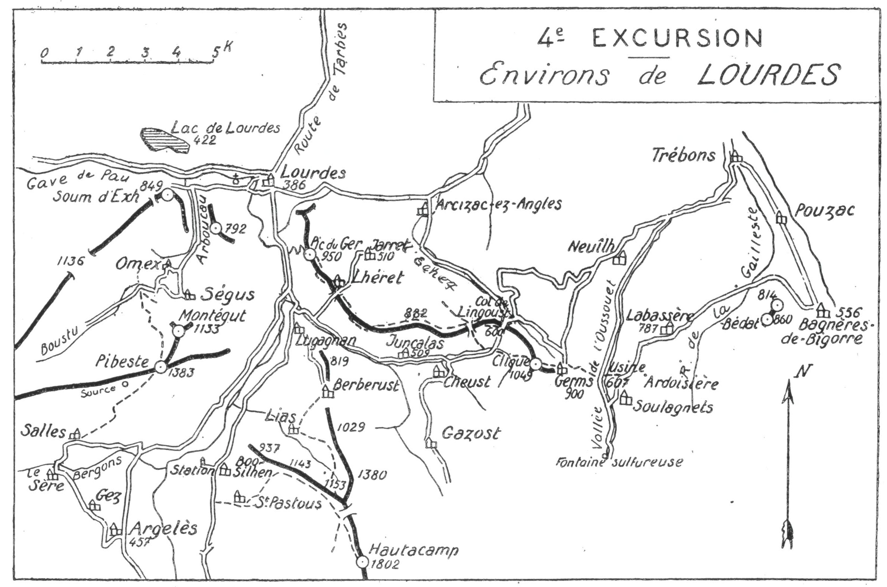

<style>.centre {text-align: center}</style>
<style>.droite {text-align: right}</style>

[//]: # (— p. 67 —)

# QUATRIÈME EXCURSION

__Trois jours aux environs de Lourdes__

_B. E. — Du 15 Juin au 15 Octobre._

Carte à emporter : Tarbes.

<u>__AVIS AUX TOURISTES__</u>

La quatrième excursion nous fait entrer par Lourdes dans les
Pyrénées Centrales, qu'on considère comme étant la plus belle
partie de la chaîne pyrénéenne. On peut la diviser en quatre
régions, car chacune d'elles présente un caractère bien spécial :

1re Région de Cauterets et du Vignemale;
2e Région de Gavarnie et du Massif Calcaire;
3e Région lacustre d'Orèdon et de la Vallée d'Aure;
4e Région de Luchon et des Monts Maudits.

C'est par la petite montagne que nous commencerons, en
faisant monter d'abord le touriste au petit pic de Pibeste, qui
est bien le meilleur point de départ initial pour embrasser
d'un coup d'œil, non seulement les hautes régions de Cauterets, 
de Gavarnie et de Barèges qu'on va aborder, mais aussi
pour voir défiler dans son tour d'horizon presque toutes les
cimes qu'on vient de visiter.

Situé au S.-O. et à moins de 4 h. de Lourdes, ce modeste
sommet se trouve dans l'axe des trois vallées suivantes, qui
conduisent le regard vers les hautes cimes :

a) Celle d'Arrens, vers le Balaïtous;<br>
b) Celle de Cauterets, vers l'Ardiden et le Vignemale;<br>
c) Celle de Luz, vers Gavarnie, le Massif Calcaire, la Munia,
le Pic Long, le Néouvielle et le Pic de Midi de Bigorre.

<p class="droite">(Voir ci-contre la Carte de l'Excursion).</p>

<div class="page"/>

— p. 68 —



<div class="page"/>

— p. 69 — (4me EXCURSION) MONTEGUT
****

## PREMIÈRE JOURNÉE

__De LOURDES (386m) à LOURDES,__<br>
__par la Gorge de l'Arboucau, Omex, le Pic de Montégut (1.133m),__<br>
__le Pibeste (1.383m), Salles (638m), Sère, Gez (660m)__<br>
__et Argelès (455m).__

—— SANS GUIDE ——

__Conseils.__ — __Itin. recomm.__ — Partant par la basilique, on passera 
devant la grotte du Loup, et, avant d'entrer dans la forêt
de Subercarrère, on tournera à g., afin de suivre la route qui, par
la gorge de l'Arboucau et les Portes de Fer, conduit à Ségus. On
laissera à dr. la grotte du Roy et, 1/2 h. après, on arrivera en vue
d'Omex et de Ségus.

En cours de route, on apercevra, droit au S., en amont de
Ségus, un petit vallon très rapide, qui grimpe vers le bois de ce
nom; c'est par ce vallon que passe la bonne et facile voie d'ascension 
au Pibeste.

A environ 1 h. de Lourdes, on quittera la route de Ségus pour
prendre, à dr., celle d'Omex, qui est à 5 min. En haut du vill,
on trouvera une petite route qui monte au S., pour aller rejoindre 
celle du Boustu. On suivra cette dernière jusqu'au haut de
la côte, au point nommé : « Cap d'éra Costo. » Là, on verra sur
sa g. deux chemins qui filent direction S.-E.; on prendra celui
de dr., celui d'en haut, qui conduit en pente douce aux ardoisières 
situées à l'entrée du vallon rapide aperçu en cours de
route. C'est par la rive dr. de ce vallon qu'un petit sentier monte
directement au col situé au S. du Montégut, en faisant un crochet 
à g., dans la partie supérieure. On déposera le sac au col
et on fera l'ascension du Montégut (1.133m) dans 1/4 d'h., aller
et retour. La vue y est déjà très belle sur Lourdes et la plaine
de Tarbes; mais son ascension est surtout utile pour repérer
la voie qui monte au Pibeste.

Droit au S., on apercevra une sente rapide qui monte en ligne

<div class="page"/>

— p. 70 — PIBESTE (4me EXCURSION)
****

directe, à travers des taillis, jusqu'à la crête. Il faut, en 
contournant un mamelon rocheux par la g., rejoindre cette sente
et la suivre jusqu'en haut, où elle débouche sur l'arête, à 5 min.
et à l'O. du Pibeste. Sur le versant S., on trouve un sentier qui
tourne à g. et qui conduit directement au sommet (1383m).

Le Pibeste n'a aucun des caractères ordinaires d'un pic; c'est
une crête hérissée de petites pointes et parsemée de jeunes hêtres
rabougris. De loin, il est même difficile d'en discerner le véritable 
sommet. Mais, quel panorama! Il est splendide, et on s'attarderait 
volontiers des heures entières à le contempler.

Dès l'arrivée à la cime, le rideau se lève subitement vers le
S., dans un décor féerique. Devant soi, et presque sous ses pieds,
s'épanouit toute la verdoyante vallée d'Argelès, avec ses nombreux 
villages dont les toits d'ardoises bleues miroitent au soleil;
puis, plus haut, dans un immense demi-cercle, l'œil monte vers
les hautes cimes par les nombreuses vallées qui l'y conduisent.
Dans toute la chaîne, je ne connais aucun sommet qui, à alt.
égale, puisse lui être comparé. C'est le pic de premier plan qui
sert au relevé panoramique circulaire des prochaines excursions.

Le tour d'horizon commence, à dr., par le Gabizos, d'où il
grimpe au Pallas et au Balaïtous, puis, de dr. à g., on voit défiler
toutes les cimes de moyenne et de haute alt. situées entre ce dernier 
sommet et le Pic de Midi de Bigorre (1).

C'est le grand Pyrénéiste Henri Russell qui a découvert ce
beau point de vue, mais c'est à notre éminent collègue, M. Lary,
que revient l'honneur d'avoir mis le Pibeste en lumière, d'abord,
en y conduisant des caravanes du C. A. F., et ensuite, en écrivant 
un intéressant article sur le massif de Saint-Pé (2).

On repartira du Pibeste par le sentier d'arrivée qui tourne
à g., 3 min. après, pour redescendre, au S.-O., vers un plateau de
verdure où paissent des bestiaux. Au haut de ce plateau, existe
une source qui ne tarit que vers fin août. A l'O., on trouvera
un sentier qui descend directement au fond de la vallée d'Estrem 
de Salles en de nombreux lacets. C'est au vill. de Salles
qu'on rejoindra la route qui conduit à Argelès (6 k.).

Après une petite descente jusqu'à Sère où on franchit le Ber-

———<br>
(1) Concernant l'étymologie des Pics du Midi, voir note p. 3.
(2) V. Bulletin de la Section des Pyrénées Centrales, n° 49. 

<div class="page"/>

— p. 71 — (4me EXCURSION) ARGELES
****

-gons, elle remonte au S.-E. jusqu'au village de Gez (660m), où commence 
la descente définitive sur Argelès. A 1/4 d'h. de Gez, à un
tournant de la route, on aura devant soi un des plus jolis panoramas 
de la région : on dominera Argelès et on en embrassera
toute la vallée, depuis le Viscos jusqu'au Ger de Lourdes.
Parvenu à Argelès, on prendra le train pour Lourdes.

> Nota. - On peut aussi coucher à Argelès pour faire, le
lendemain, l'ascension du Hautacamp. Dans ce cas, on ira
rejoindre l'itinéraire à Saint-Pastous, à 5 k. d'Argelès.

__Horaire de la Journée :__

```
De Lourdes au Pibeste................. 3h.45  }
Du Pibeste à Salles................... 2 h.   }   7 h.
De Salles à Argelès (6 k.)............ 1h.15  } (Arrêts en sus)
```

## DEUXIÈME JOURNÉE

__Ascension du HAUTACAMP (1.802m),__<br>
__par Saint-Pastous (583m), avec retour à Lourdes,__<br>
__par Lias, Berbérust et Lugagnan.__
 

—— SANS GUIDE ——

__Conseils.__ — __Itin. recomm.__ — On partira par le premier train
jusqu'à Boo-Silhen et, au vill., on prendra la route qui remonte
la vallée d'Argelès par la rive dr. Dès la sortie de Boo-Silhen,
on apercevra sur la g., à flanc de montagne, la façade blanche
d'une vieille église; c'est celle de Saint-Pastous qui se dissimule
sous la châtaigneraie. Le chemin muletier qui y conduit s'embranche 
à 1/4 d'h. de Boo-Silhen.

En haut de Saint-Pastous, près d'une grange, on quittera le
chemin principal pour suivre, à g., un sentier qui monte au N.-E.
à travers des prairies et des pâturages, et va rejoindre la crête
à la cote 1143. A partir de là, il file, tantôt à toute crête, tantôt
à flanc O., jusqu'au point culminant du massif (1.802m), situé en
amont de la belle forêt de sapins qu'on aperçoit de la plaine. Il
n'y a pas d'eau au sommet; il sera prudent d'en faire provision
à Saint-Pastous.

On remarquera au passage, sur la g., la jonction du beau sen-

<div class="page"/>

— p. 72 — HAUTACAMP (4me EXCURSION)
****

tier qui monte de Berbérust, par Lias; c'est par là qu'on descendra. 
De ce point, Cauterets apparait en partie.

Parvenu au col spacieux qui forme un petit plateau au haut de
la sapinière, on laissera le grand chemin à dr. pour prendre, à
g., le sentier de crête qui mène directement au sommet (1.802m).
C'est le point culminant de trois collines gazonnées d'un accès
des plus faciles.

Le belvédère du Hautacamp (1) est de premier ordre. Il s'étend
sur toute la grande chaîne du Pic de Midi d'Ossau au Pic de Midi
de Bigorre. On voit admirablement les crêtes qui couronnent le
cirque de Gavarnie, du Taillon au Marboré. Mais ce qui retient
le plus l'attention, ce sont les premiers plans qu'on domine merveilleusement. 
On a sous les yeux les vallées d'Argelès, d'Azun,
d'Estrem de Salles, de Gazost et toute la plaine de Tarbes à Pau.

Pour rentrer à Lourdes, on reviendra sur ses pas pendant
3/4 d'h., puis on suivra la crête afin de ne pas manquer l'amorce
du sentier de Lias et Berbérust qu'on aura repéré à l'ascension.
On quittera alors la crête pour descendre droit au N. S'il fait
clair, on apercevra de très loin un sentier bien tracé sur le flanc
O. d'une colline secondaire, sentier qui, après avoir fait un crochet 
à g. pour passer à Lias, se transforme en un chemin de
chars jusqu'au curieux vill. de Berbérust.

De ce dernier, qui est situé sur un col, on domine la grande
vallée d'Argelès, à g., et celle de Castelloubon, à dr. On fera 
ensuite un des plus jolis trajets des Pyrénées. De Berbérust, une
petite route descend en corniche, à flanc de montagne et en
pente douce jusqu'à Lugagnan. C'est un admirable et dernier
tableau de cette splendide excursion dont le décor s'évanouit à
mesure qu'on descend, car les vallées d'Argelès et d'Estrem de
Salles, qu'on voyait encore du Col de Berbérust, disparaissent
insensiblement.

Pour éviter les nuages de poussière soulevés par les autos qui
rentrent de Gavarnie, on prendra le train à Lugagnan, 5 k. de
Lourdes.

__Horaire de la Journée :__

```
De Boo-Silhen au Hautacamp.......... 4h.30 }   7h.45
Du Hautacamp à Lugagnan............. 3h.15 } (Arrêts en sus).
```

———<br>
(1) Certains le nomment « Davantaïgues », d'autres, montagne de
Gazost.

<div class="page"/>

— p. 73 — (4me EXCURSION) GER De LOURDES
****

## TROISIÈME JOURNÉE

__De LOURDES (386m) à BAGNÈRES-DE-BIGORRE (556m),__<br>
__par le Pic du Ger (950m), Lheret, le Col de Lingoust (600m),__<br>
__Germs et la Clique (1.049m), les Ardoisières__<br>
__et le village de Labassère (787m).__

—— SANS GUIDE ——

<u>__AVIS AUX TOURISTES__</u>

Au S.-E. du Ger de Lourdes, se détache une colline gazonnée, 
longue de 7 k., qui va mourir au col de Lingoust après de
multiples ondulations qui forment plusieurs cols. Facile à
parcourir, elle offre à chaque pas des horizons nouveaux, surtout 
sur les premiers plans, puisqu'elle domine et sépare la
vallée supérieure de l'Echez de celle de Castelloubon, vallées
parsemées de nombreux villages qui défilent sous les yeux.
C'est par ce chaînon secondaire que nous allons partir à la
conquête de la Clique de Germs, qu'on aperçoit du Ger en une
pointe verdoyante s'estompant sur le ciel, droit au S., à moins
de 8 k.

__Conseils.__ — __Itin. recomm.__ — Si on veut gagner 1 h. et éviter
une ascension de 500 m., on utilisera le premier départ du funiculaire, 
qui a lieu vers 7 h., pour monter au pic du Ger. Dans
tous les cas, un grand chemin muletier, qui s'amorce derrière
la gare du funiculaire, conduit au sommet en une dizaine de
lacets. |

Au haut du Ger, au belvédère du Touring-Club, on trouve une
table d'orientation (1) qui permet d'identifier rapidement l'admirable 
tour d'horizon.

Du Pic de Midi de Bigorre au Gabizos, toute la grande chaîne
est sous les yeux. A ses pieds, au S., s'allonge la vallée d'Argelès
et, au N., dans un immense éventail, paraissent un grand nombre

———<br>
(1) En été, à l'époque des pèlerinages, il est perçu un droit de
0 fr. 50 pour monter au belvédère. Avec la carte du Touring-Club, on
y monte gratis.

<div class="page"/>

— p. 74 — GERMS (4me EXCURSION)
****

de villes et de villages du Béarn, du Gers et des Hautes-Pyrénées.
Le lac de Lourdes est là, tout près et, plus loin et dans son axe,
on peut reconnaître toutes les grandes maisons du boulevard
des Pyrénées de Pau.

On partira du Ger direction S.-E. et, derrière la bâtisse d'un
ancien restaurant, on rejoindra un sentier qui descend à g. sur le
flanc E. de la colline, vers un large col. Là, le chemin passe sur
le flanc O. et s'en va presque horizontalement jusqu'à un petit plateau 
duquel on découvre le hameau de Lhéret et le sentier qui y
conduit.

A Lhéret, s'échancre le premier col profond de cette colline;
aussi y croise-t-on une petite route qui fait communiquer les
deux vallées. Laissant à dr. les quelques maisons du hameau, le
sentier monte à g. et, par un crochet à dr., ramène le touriste
sur le flanc O. de la colline, en lui faisant traverser une prairie.
Au haut de celle-ci, on peut à son choix, soit gagner de suite
la crête, soit suivre un bon chemin muletier qui longe les propriétés 
pendant 3/4 d'h., et qui aboutit enfin à la crête à la cote 882.
On jouit là d'un très joli point de vue sur les deux grandes
vallées, et l'œil prend en enfilade le haut vallon de Gazost.

On continuera à toute crête, à travers les bruyères et les fougeraies,
jusqu'à un second col très large, où passe un chemin
qui va de Cheust à Sère-Lanso. Là, le sentier repart par le flanc
O. de la colline pour aboutir, par une descente rapide, au troisième 
et dernier col coté 699 m.; un chemin muletier le traverse.

De Lhéret au Col 699, c'est un véritable régal; on domine constamment 
les deux vallées dont les nombreux villages défilent
successivement sous les yeux. A partir du Col 699, et après une
petite remontée, le sentier continue par le flanc O. pour aboutir
au Col de Lingoust (600m), à la jonction des deux vallées.

Là, on prendra la route de Bagnères-de-Bigorre et, 2 min.
après avoir franchi le pont sur l'Echez, on montera à dr. par un
raccourci qui grimpe sous une châtaigneraie et va rejoindre la
petite route de Germs. On débouche bientôt en bordure d'un cirque 
verdoyant où l'Echez prend sa source et au haut duquel se
profile, en plein col, le village de Germs. Et la Clique qui culmine
encore presque verticalement d'environ 200 m., prend maintenant 
l'allure d'une haute montagne.

Aux granges de Bourdalats, coule, près de la route, une très

<div class="page"/>

— p. 75 — (4me EXCURSION) CLIQUE DE GERMS
****

bonne source; on y fera sa provision d'eau, car celle du vill. de
Germs n'est pas des meilleures.

Le village de Germs est situé sur un col, vers 900 m. d'alt.,
dans un des sites les plus coquets de la région; on peut y laisser
le sac. A l'O., une croupe, mi-gazon, mi-pierraille, conduit au
joli belvédère de la Clique (1.049m) et 25 min. suffisent pour en
faire la facile ascension.

De ce petit sommet, le point de vue est splendide. On aperçoit
les principales cimes des environs de Bagnères-de-Bigorre, d'Argelès 
et de Lourdes et, vers la plaine, la vue s'étend jusqu'au
Béarn, aux Landes et au Gers. Au S., le Pic de Montaigu (2.341m)
est majestueux. Derrière lui, en arrière plan et à sa g., émerge une
partie du Pic de Midi. A l'E., le Mont du Bédat (881m), dont la
vierge parait à deux pas, masque la ville de Bagnères-de-Bigorre.

Du vill. de Germs, un grand chemin de chars descend à l'E. à
la vallée de l'Oussouet où on coupera la route qui monte à la
« Fontaine Sulfureuse » dont les eaux sont captées et amenées à
Bagnères. On franchira l'Oussouet près d'une usine d'ardoises
et on suivra la petite route qui monte en zigzags vers la grande
ardoisière et qui conduit ensuite au vill. de Labassère (787m). On
jouira au passage d'un joli point de vue vers les Baronnies et
Mauvezin.

De Labassère (6 k. de Bagnères), la route descend au N.-E.
vers le ruisseau de la Gailleste qu'elle longe pendant quelques
min., puis, après avoir contourné la base des pentes N. du Mont
Olivet (814m), elle prend la direction S.-E. pour aboutir à Bagnères,
derrière le Casino.

__Horaire de la Journée :__

```
Du Pic du Ger à Germs............. 3h.30 }
De Germs à la Clique et retour.... 0h.40 }   7h.45
De Germs à Labassère.............. 2h.10 } (Arrêts en sus).
De Labassère à Bagnères (6 k.).... 1h.15 }

     (Si on est monté au Ger à pied, 1h.15 en sus).
```

<u>__AVIS IMPORTANT__</u>

Si, après avoir effectué les excursions des environs de Lourdes, 
on veut continuer immédiatement par les environs de
Cauterets, c'est de la Clique de Germs qu'on rentrera à Lour-

<div class="page"/>

— p. 76 — LUGAGNAN (4e EXCURSION)
****

des, par la voie suivante. Du sommet de la Clique, on descendra 
à l'O. par des sentes faciles jusqu'aux bords de l'Aucère,
qu'on rejoindra près de sa source. Là, un grand sentier en
longe la rive g. et, 20 min. plus bas, on retrouve la grand'route
à la cote 587, à 10 k. de Lourdes et à 6 de Lugagnan, où on
pourra prendre le train pour Cauterets.

<u>__POINTS D'INTERRUPTION__</u>

- __ARGELÈS__ 
  - Pour abandonner après le premier jour.

- __LOURDES__ 
  - Soit pour abandonner après les deux premiers jours, soit
pour rejoindre.
