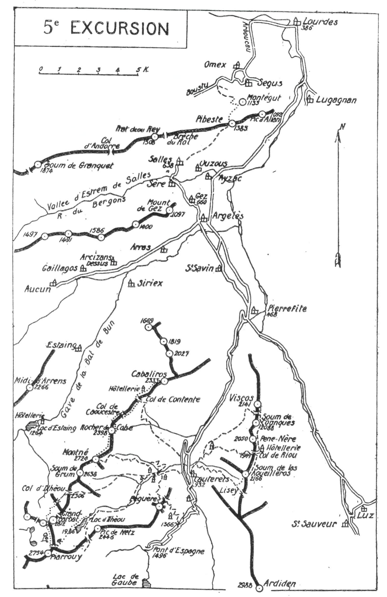

<style>.centre {text-align: center}</style>
<style>.droite {text-align: right}</style>

<div class="page"/>

[//]: # (— p. 77 —)

# CINQUIÈME EXCURSION

(N° 4 de la 1re édition)

__Quatre jours aux environs de Cauterets__

_B. E. — Du 1° Juillet à fin Septembre._

Cartes à emporter : Luz et Gavarnie réunies.

__Ascensions du Pic de Viscos,__<br>
__du Soum de Conques, du Pène-Nère, du Col de Riou,__<br>
__du Soum de Las Aoueillèros, du Péguère.__<br>
__du Montné, du Pic Wilson,__<br>
__du Cabaliros, du Grand Barbat et du Lac d'Ilhèou.__

 
<u>__AVIS AUX TOURISTES__</u>

Parmi les nombreux centres d'excursions des Pyrénées, l'un
des plus attrayants est certainement Cauterets. C'est, avec Gavarnie, 
le seul qui offre au touriste l'immense avantage d'être
à pied d'œuvre; de plus, comme on trouve dans ses alentours
toute la gamme des beaux spectacles, depuis la petite montagne 
facile jusqu'aux hautes et délicates cimes, tous, simples
touristes ou intrépides grimpeurs, seront attirés et retenus par
la grâce et la grandeur des monts qui entourent la célèbre ville
d'eaux.

<p class="droite">(Voir ci-contre la Carte de l'Excursion).</p>

<div class="page"/>

— p. 78 — 5° EXCURSION



<div class="page"/>

— p. 79 — (5me EXCURSION) VISCOS

# PREMIÈRE JOURNÉE

__Ascensions du Pic de Viscos (2.141m),__<br>
__du Soum de Conques (2.088m), du Pène-Nère (2.050m),__<br>
__du Col de Riou (1.949m), du Soum de Las Aoueillèros (2.166m),__<br>
__avec retour à Cauterets, par le Lisey.__

—— SANS GUIDE ——

__Conseils.__ — __Itin. recomm.__ — Partant par le Parc, on prendra le
chemin qui monte au Col de Riou par la Reine Hortense. Parvenu 
à la deuxième grange de Genthieu, celle qui est immédiatement 
au-dessous de la Reine Hortense, on quittera le grand
chemin, afin de suivre un petit sentier qui passe à g., sous cette
grange; on traversera une prairie pour pénétrer, 80 m. plus loin,
dans un petit bois.

Après le bois, on trouve une nouvelle grange, après laquelle le
sentier bifurque; on prendra celui d'en haut qui monte, à dr.
vers la forêt et la traverse en entier. On franchira le ruisseau de
Dillon et, immédiatement après, on s'élèvera en deux lacets jusqu'aux 
granges supérieures de Cancéru, sur un verdoyant plateau
qu'on aperçoit de Cauterets. Après le deuxième lacet, on aura
soin de laisser à dr. le sentier qui monte à l'E., et de prendre,
à g., celui qui part horizontalement, direction N.-O., vers le
plateau. On aura constamment devant soi le Viscos comme point
de direction et aussi le Roc de Maillaraoube au pied duquel il
faut passer.

Après avoir traversé le plateau, on entrera à nouveau dans la
forêt par un sentier bien tracé. Dix min. après, on coupera un
petit ruisseau suivi immédiatement d'un autre qui coule en bordure 
d'une clairière. Là, le sentier bifurque quelques m. avant
le deuxième ruisseau; on prendra celui d'en haut, peu apparent
dans le gazon, mais qui se précise en montant dans la forêt en
plusieurs lacets et en tournant définitivement vers le N. On
débouchera bientôt à découvert près d'un couloir et on aura
presque en face, en haut, le Roc de Maillaraoube, vers lequel on
montera en suivant le petit sentier qui zigzague cette pente très
inclinée.

<div class="page"/>

— p. 80 — COL DE RIOU - (5me EXCURSION)

Le sentier, très difficile à suivre, traverse là un luxuriant pâturage 
en plusieurs lacets et, après avoir fait un long crochet à dr.,
vers deux sapins, il file vers le Roc de Maillaraoube, dont la
partie N.-O. s'est éboulée, et sous lequel peuvent s'abriter cent
personnes. Il franchit un petit col quelques min. après, et il continue 
à flanc presque horizontalement.

On coupera trois ravins qui descendent de la face N.-O. du
Soum de Conques, dans lesquels on trouve plusieurs colonies
d'Etoiles des Neiges et quantité d'autres fleurs : Lis Martagon,
Eryngium Bourgati (chardon bleu), Arnica, Gentiane de Burser,
etc., etc. Si on en cueille, on aura soin ide couper la fleur sans
déraciner le pied; une plante arrachée est une plante perdue.

Au moment où le sentier arrive à la base du couloir du Viscos,
on trouve une bonne source qui sourd d'une fente de rocher
sur le bord supérieur du sentier. Il sera prudent de faire là sa
provision d'eau, car on n'en trouvera plus jusqu'au col de Riou.

On remontera les pentes de la rive dr. du grand couloir en se
dirigeant à l'E. pour aboutir au Col du Viscos, au S. du pic,
où on laissera le sac. Là, on rejoindra un petit sentier qui, venant 
du Col de Riou, monte à toute crête au Pic de Viscos
(2.141m). On y remarquera une grande croix de fer et on y jouira
d'un panorama splendide dans toutes les directions.

Si, en pénétrant dans la vallée d'Argelès, vous portez vos regards 
vers le S., vous apercevrez un pic pointu en forme de pal
qui semble s'avancer pour partager la vallée en deux; c'est le
Viscos, pic de second plan et belvédère de premier ordre. De
son sommet, on aperçoit presque toutes les hautes cimes des
régions de Cauterets, de Gavarnie et de Barèges. Aussi, est-ce
au Viscos qu'il faut consacrer la première excursion, dès son arrivée 
à Cauterets.

Après avoir repris le sac, on suivra, au S. du col, le sentier
qui conduit au Col de Riou, tantôt à toute crête, tantôt à flanc.
Environ 20 min. après avoir quitté le col, on l'abandonnera pour
monter, à dr., au Soum de Conques (2.088m), où on trouve les
débris de l'ancien signal. On jouit encore sur ce sommet d'un
joli point de vue. Une descente de quelques min. au S. et une
petite remontée conduiront au Pène-Nère (2.050m). De là, dans
10 min., on rejoindra le Col de Riou, où existe une hôtellerie et
une table d'orientation.

<div class="page"/>

— p. 81 — (5me EXCURSION) SOUM DE LAS AOUEILLEROS

Du Col de Riou, on continuera l'excursion vers le S. par des
pentes gazonnées très faciles. On suivra à flanc E. de crête et,
après avoir contourné par la g. deux mamelons secondaires, on
montera à toute crête au Soum de Las Aoueillèros (1) dont on
aura déjà-aperçu la tourelle construite par M. A. Meillon.

Après celui du Viscos, le belvédère de Las Aoueillèros est le
complément indispensable du tour d'horizon de cette coquette
et facile excursion. Si, du Viscos, on aperçoit mieux Saint-
Sauveur et la vallée de Gavarnie, du Soum de Las Aoueillèros, on
découvre plus nettement la haute vallée de Barèges.

On descendra à sa fantaisie, par la face O., au cirque du Lisey
qu'on domine en entier. On trouvera, en cours de descente, un
grand sentier qui fait, à dr., un trop long crochet; on le coupera 
en se dirigeant vers la g. du cirque. Là, on rejoindra le
grand chemin muletier qui, en de nombreux lacets, descend directement 
à Cauterets.

> Nota. - Pour cette excursion, on peut déjeuner à l'hôtellerie
du Col de Riou ou avec les vivres tirés du sac.

__Horaire de la Journée :__

```
De Cauterets au Viscos................. 4h.10 }
Du Viscos au Col de Riou............... 1h.20 }   
Du Col de Riou au Soum de Las Aoueil-         }   8h.15
   èros ............................... Oh.50 } (Arrêts en sus).
Du Soum de Las Aoueillèros à Cauterets. 1h.55 }
```

## DEUXIÈME JOURNÉE

__Ascension du Péguère (2.252m), par le Cerisey,__<br>
__avec descente à Cauterets, par le Cambasque.__

—— SANS GUIDE ——

__Conseils.__ — __Itin. recomm.__ — L'ascension du Péguère n'exige
que les 3/4 d'une journée moyenne, et point n'est besoin de partir
à l'aurore. On prendra donc le tram de La Raillère, vers 7 h.,
ce qui fera gagner plus de 100 m. d'alt., et on suivra ensuite la
route jusqu'au Cerisey. Au-dessus de la cascade, on prendra, à
 
———<br>
(1) C'est volontairement que j'écris en deux mots « Las Aoueillèros ». 
La traduction littérale, en patois du pays, est : Les Bergères.
Le nom de ce sommet signifierait donc : Pic des Bergères. On aurait
dû, par conséquent, l'orthographier en deux mots.

<div class="page"/>

— p. 82 — Le PEGUERE (5me EXCURSION)

 dr., le grand chemin muletier qui zigzague les flancs S. et E. du
Péguère jusqu'au sommet de la Laoune. A 5 min. du Cerisey,
on franchit sur un pont le gave de Jeret (1.366m), et on aborde
immédiatement le chemin à pente régulière et à nombreux lacets. 
On s'élève sans fatigue, la plupart du temps sous forêt, en
contournant insensiblement la montagne, et, bientôt vers 1.500 m.
d'alt., on domine merveilleusement la route du Pont d'Espagne et
La Raillère. On atteint ensuite les chalets forestiers, dans un site
charmant (1.608m), où on trouve deux bancs rustiques qui vous
invitent au repos. On est là à moitié chemin, et on peut y déjeuner. 
Une canalisation récente amène l'eau près des chalets; on
fera là sa provision, car on n'en trouvera pas plus haut.

En amont des chalets, on suivra le chemin de dr. qui se dirige
vers le N. Les lacets sont maintenant plus courts et on découvre,
petit à petit, la vallée de Lutour. La Raillère est sous ses pieds
à une grande profondeur. On parvient enfin à l'impressionnante
corniche presque horizontale qui surplombe Cauterets et qui
coupe le vertigineux couloir de la Glacière : c'est la Laoune
(1.980m). C'est là que les montures s'arrêtent, au pied d'un escalier 
en bois qui barre le chemin. Quelques min. après, on aboutit
à un petit col bordé, à dr., de quelques sapins; à ce point est
l'amorce du sentier qui descend par le Cambasque. On aura soin
de bien le repérer au passage, car, au Péguère, on a souvent
le brouillard dans l'après-midi, ce qui rend l'orientation difficile.

A partir de ce point, le sentier est plus étroit et on continue
à contourner le Péguère jusqu'à sa face N. On franchit un
deuxième col au delà duquel le sentier redescend de quelques
m. et d'où on découvre tout le haut vallon du Cambasque, vers
le lac d'Ilhéou. Encore quelques lacets courts et rapides, et on
arrive sans difficulté au point culminant du Péguère, près de la
Tourelle (2.252m).

Le Péguère, étant entouré de montagnes de premier ordre, est
un magnifique belvédère; mais ce qui attire surtout le regard,
c'est le lac de Gaube et sa longue vallée que l'œil remonte en
entier jusqu'au Vignemale.

On reviendra par le même chemin jusqu'au premier col où
on le quittera pour prendre, à g., le sentier du Cambasque. Environ 
1/4 d'h. après, on franchira un ressaut rocheux et, à partir
de là, on peut descendre directement vers les fermes du Cambasque 
sans suivre les méandres du sentier.

<div class="page"/>

— p. 83 — (5me EXCURSION) MONTNE de CAUTERETS

Au Cambasque, on rejoindra un grand chemin qui conduit
directement à Cauterets.

__Horaire de la Journée :__

```
De La Raillère au Péguère.............   4h.   }   6h.45
Du Péguère à Cauterets par le Cambasque. 2h.45 } (Arrêts en sus).
```

## TROISIÈME JOURNEE

__Ascensions du Montné (2.724m), du Pic Wilson (2.398m)__<br>
__et du Cabaliros (2.333m).__

—— GUIDE UTILE ——

__Conseils.__ — __Itin. recomm.__ — Pour l'excursion séparée du
Montné ou du Cabaliros, on n'a pas besoin de Guide; ce n'est que
pour le trajet de l'un à l'autre pic qu'il peut être utile en cas de
brouillard. En faisant l'excursion comme je l'indique, on gagne
un jour et on évite la fatigue d'une ascension; on peut donc, à
la rigueur, prendre un guide.

On partira de très bonne heure par l'avenue du Mamelon Vert
et, au delà des chalets Galitzin, on prendra, à g., la rue Wallon
qui se continue par un sentier tournant au S. pour pénétrer dans
la futaie. Là, un poteau indique le chemin du Cambasque qu'on
suivra.

Environ 1 h. après le départ, on franchira le torrent d'Ilhéou,
sur le pont du Cambasque, où on passe rive g. On tournera à
dr. immédiatement après le pont et, 20 m. plus loin, on laissera,
à dr., le chemin muletier pour prendre, à g., un sentier rapide
qui longe le mur d'enceinte d'une prairie. Quelques min. après,
on franchira le ruisseau du Cinquet et on ira rejoindre le chemin 
muletier qui remonte au Montné par la face E.

Au-dessus de la deuxième cabane de Cinquet, vers 1.900 m.
d'alt., on trouve la petite fontaine Boudouresque qui sourd d'un
rocher, sur le bord du chemin; c'est la dernière eau potable de
l'ascension au Montné, et il sera prudent d'en faire provision.

Le sentier continue régulièrement en de nombreux lacets jusqu'à 
10 min. du premier sommet (2.719m) visible de Cauterets.
Puis on grimpe sans danger ni difficultés une pente de roches
redressées et on débouche à la crête. Le point culminant (2.724m),
surmonté d'une tourelle et invisible de Cauterets, est quelques
min. plus à l'O. On peut y arriver, soit à toute crête, soit par une
sente du flanc N.

<div class="page"/>

— p. 84 — Le CABALIROS (5me EXCURSION)

Même avec du brouillard, on ira droit au sommet, car, dans
la partie supérieure, on rejoint une crête qui y monte directement.

Le belvédère du Montné est le plus beau des environs immédiats 
de Cauterets. Son panorama est aussi merveilleux qu'immense, 
soit sur la grande chaîne, soit sur la plaine. Aucune
haute cime n'échappe au regard, depuis les monts de la vallée
d'Aspe jusqu'à ceux des hautes régions de Bagnères; le Balaïtous
est impressionnant et le Vignemale majestueux. Pau est visible
par un temps clair; on en distingue même les principaux édifices. 
Du côté S. et S.-O., l'œil est attiré, d'abord, par la sombre
nappe bleue du lac d'Ilhèou qu'on domine, puis, par la pointe
du Grand Barbat qu'on ascendra le lendemain.

Une arête déchiquetée se prolonge au N.-E. jusqu'au Cabaliros; 
elle est hérissée de plusieurs pointes et, sur chacune d'elles,
on jouit d'une vue spéciale sur tous les environs. On ira donc
du Montné au Cabaliros par le flanc O. de crête, en faisant, au
passage, l'ascension du Pic de Lion (2.520m), du Pic Wilson (1)
ou Rocher de Cohe (2.398m), et du Soum de Picarre (2.311m).
Pendant ce trajet, on apercevra plusieurs fois le lac d'Estaing,
dans les profondeurs de la Bat de Bun.

Parvenu à l'hôtellerie du Cabaliros, on y laissera le sac et,
dans 3/4 d'h., on fera, à toute crête, l'ascension du sommet
(2.333m); un sentier y conduit. On y trouvera une belle table
d'orientation.

Sans valoir celui du Montné, le belvédère du Cabaliros est
splendide. Ce qui en augmente l'intérêt, ce sont les indications
si précieuses de la table d'orientation.

De l'hôtellerie située sur la crête à 2.095 d'alt., un grand sentier 
muletier descend, au S.-E., à Cauterets, en faisant de nombreux 
lacets et en coupant plusieurs ravins. On ne peut pas se
tromper, même par un brouillard intense.

__Horaire de la Journée :__

```
De Cauterets au Montné................ 5h. »  } 
Du Montné au Cabaliros................ 2h.45  }   10 h.
Du Cabaliros à Cauterets.............. 2h.15  } (Arrêts en sus)
```

———<br>
(1) C'est après son ascension par une caravane américaine, le
30 janvier 1919, sous la direction de M. A. Meillon, qu'on a donné le
nom de « Wilson » au Rocher de Cohe.

<div class="page"/>

— p. 85 — (5me EXCURSION) - COL D'ILHEOU

## QUATRIÈME JOURNÉE

__Ascension du Grand Barbat (2.812m), par le Col d'Ilhèou (2.306m),__<br>
__et retour à Cauterets,__<br>
__par la Brèche des Hourats (2.600m) et le Lac d'Ilhèou (1.986m).__

—— GUIDE UTILE ——

__Conseils.__ — __Itin. recomm.__ — On partira de très bonne heure, et
on suivra le chemin du Montné jusqu'au pont du Cambasque où
on tournera à g., au S.-O., pour prendre le sentier qui longe
le torrent d'Ilhèou. Trois min. après, en face d'une grange, un
petit pont ramène sur la rive dr., et, 6 min. plus haut, on franchit 
un nouveau pont pour passer définitivement rive g.

On trouve là plusieurs sentiers parallèles qui montent vers
l'O., à travers des pelouses; on prendra le plus élevé, afin de
passer au-dessus du refuge du Lis. Continuant à monter direction 
O., on franchira le torrent du Lis 1/4 d'h. après et, en faisant 
quelques lacets sur les pentes d'en face, on se dirigera vers
un petit col gazonné au-dessus duquel existe une cabane en ruines. 
On montera ensuite à travers les pelouses pour gagner la
crête du Lis vers 2.200 d'alt.

De ce point, on dominera toute la cuvette du Lac d'Ihèou et
du Lac Noir. Sur la crête même, on trouvera un sentier qui
passe sur l'autre versant et qui conduit en pente douce, à flanc
de montagne, au Col d'Ihèou (2.306m). Du col, on montera, à g.,
vers un mamelon gazonné d'où on obliquera un peu à dr., afin
de suivre le flanc N.-O. de la Montagne de Ségalas. Une vague
trace de sentier franchit plusieurs petits ravins rocailleux pour
aboutir à un col élevé d'où la vue plonge sur le vallon de Bat-
Escure où dort le petit lac du Barbat. On aura en face, de l'autre
côté du vallon, la brèche inférieure de Bat-Escure, 2.600m environ, 
située dans le massif même de Maleshores, brèche qu'on
laissera tout à l'heure à dr. On descendra environ 200 m. pour
contourner, par la base, le contrefort N. du Grand Barbat et,
imédiatement après, on tournera un peu à g., au S., afin de remonter 
le large couloir neigeux qui conduit à la brèche supérieure 
de Bat-Escure (2.700m). Cette brèche est située entre le
sommet supérieur de Maleshores (2.766m), à l'O., et la crête

<div class="page"/>

— p. 86 — GRAND BARBAT (5me EXCURSION)

de Piarrouy, à l'E. On y déposera le sac et on fera, au N.-E.,
l'ascension facile du Barbat, à flanc O. de crête, jusqu'à la tourelle.

Le point de vue du Grand Barbat est presque analogue à
celui du Montné en ce qui concerne les lointains; mais il est
beaucoup plus impressionnant sur ses abords immédiats. On
domine une région très tourmentée, mais égayée par de nombreux 
lacs. On n'est entouré que de cirques profonds et de crêtes 
déchiquetées; la face E. est une muraille à pic sur le cirque
et le lac d'Ihèou.

On pourrait, dans 4-h., redescendre à Cauterets par la voie
d'ascension:; mais l'excursion atteindra son maximum d'intérêt
par l'itinéraire suivant : De la brèche de Bat-Escure, on descendra,
environ 5 min. au S.-O., puis on marchera à flanc de montagne, 
direction S., afin d'aboutir à une seconde brèche en forme
de V, entaillée dans la crête de Piarrouy, entre le pic de ce
nom (2.754m), au S., et le Grand Barbat, au N. Cette brèche
fait communiquer le cirque de Piarrouy, à l'O., avec le grand
couloir des Hourats et avec la gorge d'Aillec, à l'E.

Pendant le trajet d'une brèche à l'autre, on dominera le cirque
lacustre de Piarrouy et on apercevra ses six lacs, dont les deux
plus grands portent les noms de Lac Nère et de Lac Long.

Par la brèche des Hourats (2.600m), on repassera sur le versant 
de Cauterets et on trouvera, 20 min. plus bas, un petit lac
sauvage, sans déversoir apparent, qui ne figure dans aucune
carte. On le longera par la dr., vers un petit col situé à l'E.
et, à partir de là, on suivra le grand couloir des Hourats qui
descend jusqu'au lac d'Ilhèou (1.986m). Quelques min. avant
d'arriver au lac, on obliquera à g., et, par des pentes gazonnées
faciles, on le longera par la rive g., afin d'aboutir au déversoir.
On franchira ce dernier pour aller rejoindre, sur la rive dr. du
vallon, le sentier qui conduit à Cauterets par la gorge d'Ilhèou
et le Cambasque.

__Horaire de la Journée :__

```
De Cauterets au Col d'Ilhèou............  3h.30 } 
Du Col d'Ilhèou au Grand Barbat.........  2h.15 }   10h.30
Du Grand Barbat à la Brèche des Hourats.  0h.50 } 
De la Brèche des Hourats aulLac d'Ilhèou. 1h.40 }  (Arrêts en sus).
Du Lac d'Ilhèou à Cauterets.............. 2h.15 } 
```
 