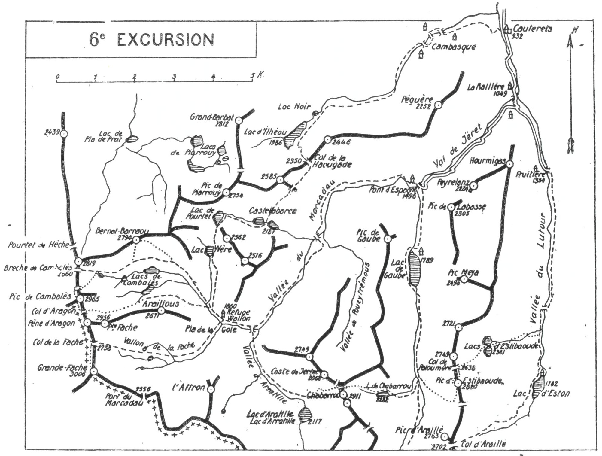

<style>.centre {text-align: center}</style>
<style>.droite {text-align: right}</style>

[//]: # (— p. 87 —)

# SIXIÈME EXCURSION

(N° 5 de la 1re édition)

__Quatre jours aux environs de Cauterets__

(2° Série)\
B. E. — Du 15 Juillet au 15 Septembre.

Cartes à emporter : Laruns et Luz.

__ASCENSIONS de la GRANDE FACHE,__\
__du PIC de CAMBALÈS, du BERNAT BARRAOU, du CHABARROU__\
__et du PIC d'ESTIBAOUDE.__

<u>__AVIS AUX TOURISTES__</u>


Un pyrénéiste exercé peut très bien diriger cette excursion.
On emportera des vivres pour trois repas et, si on ne prend
pas de guide, un porteur me paraît indispensable.

Depuis juillet 1920, le refuge du Marcadau est gardé et le
tenancier y est installé tout l'été. Comme il a été agrandi en
1922, on y trouve toutes sortes de provisions et des lits à des
prix modérés.

<p class="droite">Voir ci-contre la Carte de l'Excursion</p>


<div class="page"/>

— p. 88 —



<div class="page"/>

— p. 89 — (6me EXCURSION) GRANDE FACHE

## PREMIÈRE JOURNÉE

__Ascension de la Grande Fache (3.006m),__\
__avec retour au Refuge du Marcadau (1.860m).__


—— GUIDE UTILE ——


__Conseils.__ — __Itin. recomm.__ — On partira à 4h. en voiture jusqu'au 
Pont d'Espagne (1.496m). Là, on mettra immédiatement
sac au dos pour prendre, à l'O., le chemin muletier qui, par le
Cayan et le Marcadau, conduit en Espagne aux Bains de Panticosa.

Dans 2 h. 1/2 environ, on parviendra au refuge du Pla de la
Gole (1.860m), situé sur la rive g. du ruisseau du Marcadau; on
le nomme Refuge Wallon, en souvenir du grand pyrénéiste de
ce nom. On prendra dans son sac les provisions d'un grand
repas et d'un casse-croûte, et on laissera le reste au refuge.

Partant direction O., on franchira, 10 min. après, le ruisseau
de Cambalès qu'on laissera à dr., pour remonter en face tout le
vallon qui descend du Col de la Fache (2.738m). On aura aperçu,
dr. à l'O., la profonde échancrure de ce col quelques min. avant
d'arriver au refuge.

Deux petits sentiers remontent le vallon de la Fache par la
rive g.; on suivra celui qui longe le torrent et qui, dans la
partie supérieure, aboutit près du lac central de Remoulains
dont on longera la rive N. De ce point, on montera droit au
col, en laissant un petit névé à g.

A 5 min. en contrebas du col, versant espagnol; on trouve
une source auprès de laquelle je conseille de déjeuner. Laissant
ensuite le sac au col, on fera, au S., l'ascension de la Grande
Fache (3.006m) à toute crête au départ, et à flanc O. de crête
dans la partie supérieure. Une trace de sentier suit l'arête au
début, puis passe sur le versant O. en coupant plusieurs ravins
et couloirs. On aura soin de se tenir très haut, près de la crête
principale qu'il ne faut jamais perdre de vue jusqu'au sommet.

Le point de vue de la Fache est de toute beauté, surtout vers
le N.-O., sur le Balaïtous et le Pic de Midi d'Ossau, et. vers le
S.-E., sur le Vignemale.


<div class="page"/>


— p. 90 — CIRQUE de CAMBALES (6me EXCURSION)

Dans plusieurs cartes, la Grande Fache est cotée 3.020 m.; les
mesures récentes à l'éclimètre ont réduit cette alt. à 3.006.

Au S.-S.-O. de la Fache, à une portée de fusil, se dresse la
masse blanche du Pic d'Enfer, dont on aperçoit la double cime
(3.081-3.073m). On pourra, à la lorgnette, repérer la cheminée
par laquelle on passera à la prochaine excursion pour la descente 
au glacier N.

On rentrera au refuge par la voie d'ascension.

__Horaire de la Journée :__

```
De Cauterets au Pont d'Espagne.......... 1 h. 30 de voiture }
Du Pont d'Espagne au refuge du Marcadau. 2 h. 30            } 9 h. 15
Du refuge du Marcadau au Col de la Fache.2 h. 30            }
Du Col de la Fache à la (Grande Fache... 1 h. 15            } (Arrêts en sus).
De la Grande Fache au refuge...........  3 h. »             }
```

## DEUXIÈME JOURNÉE

__Ascensions du Pic de Cambalès (2.965m) et du Pic__\
__de Bernat Barraou (2.794m).__

—— SANS GUIDE ——

__Conseils.__ — __Itin. recomm.__ — On ne prendra dans son sac que
ce qui est nécessaire pour une petite journée, car on peut rentrer 
de bonne heure au refuge.

Partant direction N.-O. on suivra pendant quelques min. le
sentier de moutons qui longe, par la rive g., le ruisseau de Cambalès 
qu'on franchira pour passer rive dr. On trouvera aussitôt
un nouveau sentier qui suit cette rive, de terrasse en terrasse,
jusqu'au gradin supérieur d'où on domine légèrement le grand
lac de Cambalès. On entrera là en plein cirque de Cambalès
qui apparaîtra dans toute sa beauté. Rien de tout ce qui l'entoure 
n'échappe au regard : à g., l'arête des Araillous, la Petite
Fache (2.956m) et le Pène d'Aragon; en face, le splendide Cambalès 
(2.965m), flanqué du Col d'Aragon, au S., et de la Brèche
de Cambalès (2.660m), au N.; à dr. et faisant face à l'Araillous,
le Bernat Barraou (2.794m).


<div class="page"/>


— p. 91 — (6éme EXCURSION)  CAMBALES-BERNAT BARRAOU

L'excursion de ce jour nous fera contourner en entier le
cirque de Cambalès et ses magnifiques lacs.

Partant par la g., dans la direction du Col d'Aragon, on longera 
par leurs bases les escarpements N. du Pic d'Araillous
(2.671m), de la Petite Fache (2.956m) et ceux du Pène d'Aragon, afin
de parvenir au col de ce nom, vers 2.800 d'alt. Ce trajet est des
plus faciles et on a même l'agrément de traverser deux névés en
pente douce. Au col d'Aragon, on passera en Espagne (1). On
obliquera alors à dr., en laissant à g., un petit lac glacé, et on
fera l'ascension du Cambalès à flanc O. de crête jusqu'au sommet.

Cette ascension, qu'on fait sans fatigue, grâce au refuge du
Marcadau, conduit le touriste dans un belvédère de premier
ordre. La vue sur le Balaïtous, qui fait pendant par la face
opposée à celle du Pic de Midi d'Ossau, est des plus impressionnantes. 
A l'E., tout le cirque de Cambalès resplendit, illuminé 
par ses nombreuses nappes bleues. Au N.-E., de l'autre
côté du cirque, se dresse la tourelle du Bernat Barraou qu'on
ascendra dans l'après-midi.

Pour descendre du Cambalès, on suivra la crête N. pendant
quelques min.; puis, en obliquant un peu à g., à flanc de crète,
on ira rejoindre une petite brèche par laquelle on dévalera vers
le lac supérieur de Cambalès (2). On pourra déjeuner sur ses
bords. Le site est charmant et les minutes passent vite en contemplant 
là-bas, au S.-E., la sveltesse de la Pique Longue du
Vignemale.

Du lac supérieur, on longera la rive g. du cirque, en laissant
tous les lacs à dr.; on arrivera bientôt à la base d'un ravin
qui descend de la crête O. du Bernat Barraou. On le remontera
direction N., afin d'aboutir, par la dr., à une terrasse gazonnée
d'où on découvre le pic au N.-E. A partir de là, on n'aura qu'à
grimper les divers ressauts qui flanquent sa face S., et on atteindra 
sans difficulté la tourelle aperçue du Cambalès.

Les récents travaux géodésiques de M. A. Meillon ont, non
seulement déterminé la situation exacte du Bernat Barraou, mais

———\
(1) C'est à tort que les cartes font passer la frontière à la Petite.
Fache, qui est en entier en France. Du Col de la Fache (2.738m), elle
monte directement au Pène d'Aragon, d'où elle descend au col de ce
nom pour remonter au Pic de Cambalès.

(2) Ce lac reste ordinairement glacé jusqu'aux premiers jours d'août.


<div class="page"/>


— p. 92 — VALLEE D'ARRATILLE (6me EXCURSION)

aussi son alt. qui est de 2.794, au à lieu de 2.742 comme l'indiquent
les cartes.

Le pic situé plus à l'O., coté 2.819, est le faux Bernat Barraou.

Le point de vue du Bernat Barraou est surtout intéressant
sur les abords immédiats. Il est le complément nécessaire de
celui de Cambalès pour reconnaître la région si compliquée du
Cirque de Piarrouy, au N.-E., et de la montagne de Castellabarca,
à l'E.

Pour rentrer au refuge, on n'aura qu'à descendre au S.-E. A
quelques min. du sommet, on rejoindra des pentes faciles fréquentées 
par les moutons. Parvenu à la cabane de Pé det Mail,
on trouvera un sentier qui longe le ruisseau de Cambalès par
la g. et qui rejoint plus bas celui du matin.

__Horaire de la Journée :__

```
Du Refuge au Col d'Aragon............. 2h. 45 }
Du Col d'Aragon au Pic de Cambalès.... 0h. 30 }   8h. 
Du Pic de Cambalès au Bernat Barraou.. 3h. »  } (Arrêts en sus).
Du Bernat Barraou au Refuge........... 1h. 45 }
```

## TROISIÈME JOURNÉE

__Du REFUGE DU MARCADAU (1.860m) au LAC DE GAUBE(1.789m),__\
__par la Vallée d'Arratille et le Pic de Chabarrou (2.911m).__

—— GUIDE UTILE ——

__Conseils.__ — __Itin. recomm.__ — On prendra le chemin de Cauterets 
qu'on quittera quelques min. après, pour franchir le ruisseau
du Marcadau sur le pont du Pla de la Gole. Marchant ensuite
direction S.-E., on entrera dans la vallée d'Arratille dont on
franchira aussitôt le ruisseau pour rejoindre le sentier de la
rive dr. On remontera toute la vallée par cette rive jusqu'à la
digue rocheuse du bassin supérieur du Lac d'Aratille (2.117m).
De là, le lac apparaît quelques centaines de m. plus loin; on le
laissera à dr. On apercevra en haut, au N.-E., une grande échancrure; 
c'est la brèche du Poueytrémous (2.720m) qui fait communiquer 
le vallon de ce nom avec la vallée d'Arratille. C'est vers
cette brèche qu'il faut monter pour ascendre le Chabarrou par

<div class="page"/>

— p. 93 — (6me EXCURSION) CHABARROU

le versant d'Arratille. Elle est située entre le Chabarrou, au S.-E.,
et Coste de Jertet (2.868m), au N.-O.

A g. de la digue, on verra une sente de moutons qui contourne 
le cirque en s'élevant vers les gradins supérieurs; on la
suivra et, en décrivant un arc de cercle de g. à dr., on s'élèvera
vers un promontoire rocheux qui domine le lac d'Arratille de
plus de 300 m. A partir de là, on montera directement vers la
brèche de Poueytrémous. On trouvera de l'eau jusqu'à 2.600 d'alt.;
la dernière sort d'un névé.

A la brèche, on se contentera de donner un coup d'œil sur
le vallon de ce nom et de constater qu'on peut y descendre facilement 
par le ravin d'éboulis qui naît au-dessous d'elle. On tournera 
à dr. et on montera à travers des éboulis vers une autre brèche 
située au N. du Chabarrou, et au bord de laquelle M. A. Meillon
a construit un petit cairn. C'est le point de jonction de la voie
d'ascension du Chabarrou par le versant de Gaube, et c'est par là
qu'on redescendra; on pourra y laisser le sac. Dès lors, l'ascension 
n'est qu'un jeu. On monte d'abord à toute crête, puis à flanc
O., sans s'éloigner de l'arête jusqu'à une échancrure qui domine
un couloir rapide; on contourne un gendarme et, quelques min.
après, on atteint le sommet principal (2.911m).

Il existe, plus au S., un deuxième sommet surmonté d'une tourelle. 
Après le premier, il offre très peu d'intérêt. On peut cependant 
en faire l'ascension à flanc E. de crête jusqu'à la brèche qui
sépare les deux sommets et ensuite, par la face E. du pic. Dans
ce cas, on gardera son sac et on descendra au lac de Chabarrou
par les pentes de la rive dr. Cela allonge la course d'environ 1 h.

Le point de vue du Chabarrou est splendide, parce que ce
sommet est situé dans un centre de hautes montagnes et de profondes 
vallées; mais le principal attrait de cette journée réside
dans le passage de la vallée d'Arratille à celle de Gaube.

Du Chabarrou, on pourra repérer, pour le lendemain, la voie
d'ascension au pic d'Estibaoude par la face O. C'est de ce point
que j'ai découvert, il y a quelques années, cet itinéraire nouveau
qui est le plus direct et le plus facile.

Revenu à la brèche N., on descendra, à l'E., par un petit couloir 
qui conduit sur des pentes faciles, et on continuera tout
droit vers le lac de Chabarrou (2.282m) qu'on longera par la g.
Immédiatement après, le sentier franchit le déversoir et, en de
nombreux lacets, descend, par la rive dr., jusqu'au fond de la


<div class="page"/>


— p. 94 — LAC de GAUBE | (6me EXCURSION)

vallée de Gaube où il rejoint le sentier muletier du Vignemale.
Un peu plus bas, ce chemin passe rive dr. jusqu'au lac de Gaube
qu'il longe par la rive g. Après avoir franchi le déversoir, on
tournera à dr. et, dans quelques min., on arrivera à l'hôtellerie
de Gaube (1.789m) où on couchera.

__Horaire de la Journée :__

```
Du refuge de Marcadau à la digue d'Arra-           }
   tille ................................ 1 h. 30  } 7 h. 30
De la digue d'Arratille au Pic de Cha-             }
   barrou................................ 2 h. 30  } (Arrêts en sus)
Du Chabarrou au Lac de Gaube............. 3 h. 30  }
(Si on fait la deuxième pointe du Chabarrou, la journée sera de 9 h.)
```

## QUATRIÈME JOURNÉE

__Du LAC de GAUBE (1.789m) à CAUTERETS (932m),__\
__par la Vallée de Gaube, le Pic d'Estibaoude (2.820m),__\
__les Lacs d'Estibaoude (2.361m) et la Vallée de Lutour.__

—— GUIDE UTILE ——

__Conseils.__ — __Itin. recomm.__ — Voici une nouvelle voie d'ascension 
à l'Estibaoude qui a étè suivie pour la première fois, je crois,
par mon jeune camarade Dulmo et moi, le 3 août 1917, dans
les meilleures conditions. Je me contente de reproduire ici l'article 
que j'en ai publié dans notre Bulletin de la Section des Pyrénées 
Centrales, n° d'Avril-Octobre 1917.

L'itinéraire en est, je crois, assez précis pour qu'il n'y ait rien
à ajouter ni à retrancher. On peut très bien faire cette excursion sans guide si le temps est clair.

__Le Pic d'Estibaoude (2.820m) par l'Ouest__

Connaissez-vous l'Estibaoude ?

C'est le nom d'un très joli massif, encore plein de mystère,
malgré son voisinage avec la mondaine station de Cauterets..

Situé immédiatement au S. de la Raillère, puisqu'il est bormé
au N. par le Hourmigas, il est encerclé par des sites universeltement 
connus : au N., le Val de Jéret: à l'O., la Vallée de Gaube;


<div class="page"/>

— p. 95 — (6me EXCURSION) VALLEE DE GAUBE

au S., le Pic et le Col d'Araillé, et enfin à l'E., la Vallée de Lutour.

Bien rares sont les touristes qui ont fait l'ascension du sommet
principal, et plus rares encore, ceux qui ont fait la traversée
complète du massif, qui devrait être une excursion classique.
Je n'en connais pas qui aient suivi le chemin direct d'ascension,
chemin qui me paraît aussi le plus commode.

En 1915, descendant du Chabarrou avec mon camarade Fiton,
de Bordeaux, j'avais, à la lorgnette, étudié la face O. de l'Estibaoude, 
car, depuis longtemps, j'en voulais tenter l'ascension
par là, afin d'effectuer la traversée du massif et aussi pour éviter
la montée éreintante de la face E. En quelques min. j'ai pu repérer 
une voie directe dont j'ai pris note pour le jour propice.

Le 3 août 1917, avec mon jeune camarade Dulmo, de Cauterets, 
nous quittons la ville à 5 h. 10 (heure nouvelle) pour prendre
le chemin du Vignemale par la vallée de Gaube. Nous arrivons au
lac à 7 h. 30 et à la cascade de Splumous à 8 h. 20.

Nous sommes encore en plein brouillard, mais le froid intense
qui nous saisit pendant le casse-croûte nous fait présager une
claire journée.

Repartis à 8 h. 50, nous suivons pendant 1/4 d'h. encore le
sentier du Vignemale, jusqu'au point où il se rapproche du torrent 
pour le franchir. Là, obliquant un peu à g., nous nous élevons 
sur la rive dr., direction S., vers la base d'un contrefort
rocheux, afin d'aboutir à un grand couloir d'éboulis qui descend
verticalement sur la deuxième oulette. De ce point, on aperçoit en
haut, à dr., un deuxième couloir plus petit et plus rapide, qui
prend naissance aux trois quarts de la hauteur du grand couloir
pour se diriger vers le S.-E. Au sommet existe encore un petit
névé qui doit servir de point de repère pour la direction.

Remontant le grand couloir jusqu'au confluent du petit, nous
entrons dans celui-ci par une pente rapide vers 9 h. 30. Nous
venons de quitter la mer de nuages et nous sommes, vers 2.100m
d'alt., en pleine lumière. Toutes les crêtes sont ensoleillées, et
sur notre droite, le Vignemale nous écrase de sa majesté. Le petit
couloir qui, vu d'en bas, a un aspect rébarbatif, n'offre aucune
difficulté. Au début de l'été, le creux de sa partie supérieure est
garni de neige (le névé vu d'en bas) et il faut le remonter par le
flanc de la rive dr., ce que nous faisons aujourd'hui. Après le
15 août, on peut en suivre le centre dans toute sa longueur.


<div class="page"/>


— p. 96 — ESTIBAOUDE (6me EXCURSION)

Si le bas du couloir est étroit et rapide, le haut en est très
évasé et en pente douce; nous débarquons facilement au gradin
supérieur, vers 2.300 m., à 10 h. 10.

Nous dominons déjà le lac de Chabarrou, situé à l'O., de l'autre 
côté de la vallée, à 2.282 m. Sur notre dr. s'étend un plateau
rocailleux et désolé qui conduit l'œil vers le Pic d'Araillé
(2.763m), plus au S., et sans caractère vu d'ici.

Droit à l'E., une coume pierreuse monte directement à la crête
vers une forte dépression située au S. de l'Estibaoude; nous la
remontons par la rive g., et, à 11 h. précises, nous atteignons
ce large col qui doit dépasser 2.500 m.

Au N.-O. du Col, on aperçoit deux cheminées rapides qui, sur
le flanc O., montent à la crête. La première aboutit à un à-pic.
Nous passons à la seconde qui nous fait franchir une arête secondaire 
et nous mène ensuite à un flanc facile de la crête principale. 
Après quelques min. de marche, nous passons quelques
instants sur le versant E., puis nous continuons à toute crête
jusqu'à 200 m. du sommet, où nous arrivons par flanc O., à midi.

Nous trouvons à la tourelle un carnet déposé par M. A. Meillon,
en 1908, lors de ses travaux topographiques.

Le pic principal d'Estibaoude est formé d'une crête très étroite
et très déchiquetée. Placé au centre d'un cirque de hautes montagnes, 
dont il est éloigné de plusieurs k., c'est un belvédère incomparable.

Pour nous mettre à l'abri du vent qui souffle très fort, nous
déjeunons sur une corniche du versant E. qui n'a pas 0m50 de
largeur, et qui est perchée sur un à-pic formidable vers les lacs
d'Estibaoude. Ces deux lacs paraissent être sous nos pieds, à
500 m. de profondeur. Mais ce qui impressionne le plus, c'est
la vue très complète du cirque lacustre d'Estom Soubiran. Cette
vue seule vaut l'ascension.

La crête de descente au N., vers le Col de Paloumère, est plus
facile que celle de l'ascension. Il nous suffit, au départ, de perdre 
une trentaine de m. d'alt. sur le versant O., afin de couper
un large couloir par le haut, ce qui demande 1/4 d'h. Nous
rejoignons ensuite l'arête pour descendre à toute crête jusqu'au
col de Paloumère (2.638m). Le col de Paloumère fait communiquer 
la vallée de Gaube avec celle de Lutour par un couloir dont
Pamorce est située 20 min. en amont et au S.-E. de la cascade

<div class="page"/>


— p. 97 — (6me EXCURSION) LACS D'ESTIBAOUDE

de Splumous. Ce couloir, relativement facile à la montée, serait
très délicat à la descente. Il faut donc, si on veut faire la traversée 
du massif sans ascendre le sommet principal, monter par
Gaube et descendre par Lutour. Cela présente d'ailleurs l'avantage 
de pouvoir faire le trajet en voiture jusqu'au Pont d'Espagne,
ce qui raccourcit d'au moins 1 h. 1/2 la course un peu longue, si
elle est faite de Cauterets à Cauterets.

Du col de Paloumère aux lacs, c'est aujourd'hui un véritable
régal. Quelques min. de descente dans un gazonné facile, quelques 
glissades dans deux névés successifs dont l'inférieur plonge
presque dans le premier lac, et mous rejoignons rapidement le
banc de pierraille qui sépare les deux lacs, à 14 h. 30.

Aujourd'hui, ce banc n'émerge que de 2 m. environ au-dessus
des eaux dans la partie la plus élevée, et encore entend-on et
voit-on l'eau filtrer à travers la rocaille. Je suis donc surpris
qu'un éminent pyrénéiste ait parlé de 30 à 40 m. de hauteur. En
tardive saison, alors que les eaux sont les plus basses (en septembre), 
ce banc rocheux atteint 5 ou 6 m. seulement. La mise
à point, sur cette soi-disant erreur de la carte d'état-major, a été
faite par M. A. Meillon dans le Bulletin pyrénéen, année 1917,
pages 87 et 89 (1).

Situés dans un cirque aride, à une alt. égale de 2. 361 m., les
deux lacs d'Estibaoude retiennent longtemps le touriste par leur
sauvage beauté.

Après une 1/2 heure d'arrêt, vers 15 h., nous longeons par l'E.
le lac N. jusqu'à quelques min. du déversoir. Là, nous prenons,
à dr., un sentier que nous suivons 1/4 d'h. environ, puis, descendant 
verticalement à travers les pelouses, nous aboutissons
au haut d'un ressaut plein d'arbustes et de rhododendrons. Obliquant 
alors à g., nous trouvons un fragment de sentier qui nous
fait franchir un premier torrent (probablement celui qui descend
des lacs) pour nous mener ensuite sur une autre pente de pe-

———\
(1) La carte d'état-major ne fait figurer 1à qu'un lac et ce n'est
point toujours une erreur, car, au printemps, quelquefois, la fonte
des neiges élève le niveau des eaux qui recouvrent alors d'une seule
nappe d'eau les deux cuvettes voisines. Lorsque l'été vient, les névés
ont disparu, les sources tarissent et le niveau des eaux baisse, laissant
entre: les deux cuvettes un espace desséché; il y a alors deux lacs à
l'endroit même où, quelques semaines auparavant, on n'en voyait
qu'un seul.


<div class="page"/>


— p. 98 — VALLEE de LUTOUR (6me EXCURSION)

louses. Nous quittons ce sentier et, par une nouvelle descente
rapide, nous aboutissons à un second ressaut où nous répétons la
première manœuvre pour franchir, à g., un deuxième torrent.
Comme celui-ci descend directement vers Pouey-Caou, nous le
longeons par la rive g. et, 20 min. après, nous rejbignons le chemin 
muletier qui descend du lac d'Estom, vers 16 h. 30.

Nous nous assurons, au passage, qu'on pourrait coucher à la
cabane de Pouey-Caou, et, après avoir franchi le pont, nous reprenons 
le chemin de Cauterets où nous rentrons, en flânant, à
18-h. 30.

Après le pont de Pouey-Caou, un grand chemin muletier longe à
le gave par la rive dr. jusqu'à la Fruitière. On pourra repérer au
passage l'amorce du sentier du refuge de Culaous par lequel on
montera à la 8° Excursion. A la Fruitière, le chemin passe rive g.
et se transforme, quelques instants après, en une route qui descend 
sous forêt jusqu'à La Raïllère. -

__Horaire de la Journée :__

```
Du lac de Gaube au grand Couloir....... 1 h. 25. }
Du grand Couloir au Pic d'Estibaoude... 2 h. 30  }   8 h. 30
Du pic aux lacs d'Estibaoude........... 1 h. 20  } (Arrêts en sus).
Des lacs d'Estibaoude à Cauterets...... 3 h. 15  }
```

Nota. — De la digue des lacs d'Estibaoude, on apercevra en
face, mais de l'autre côté de la vallée et presque à sa hauteur,
le refuge de Culaous et le sentier qui y conduit.

<u>__POINTS D’INTERRUPTION__</u>

__REFUGE DU MARCADAU__
- Pour rejoindre de Cauterets : 4 h. 30
- Pour rentrer à Cauterets : 3 h. 30

__LAC DE GAUBE__
- Pour rejoindre de Cauterets : 2 h.
- Pour rentrer à Cauterels : 2 h.
