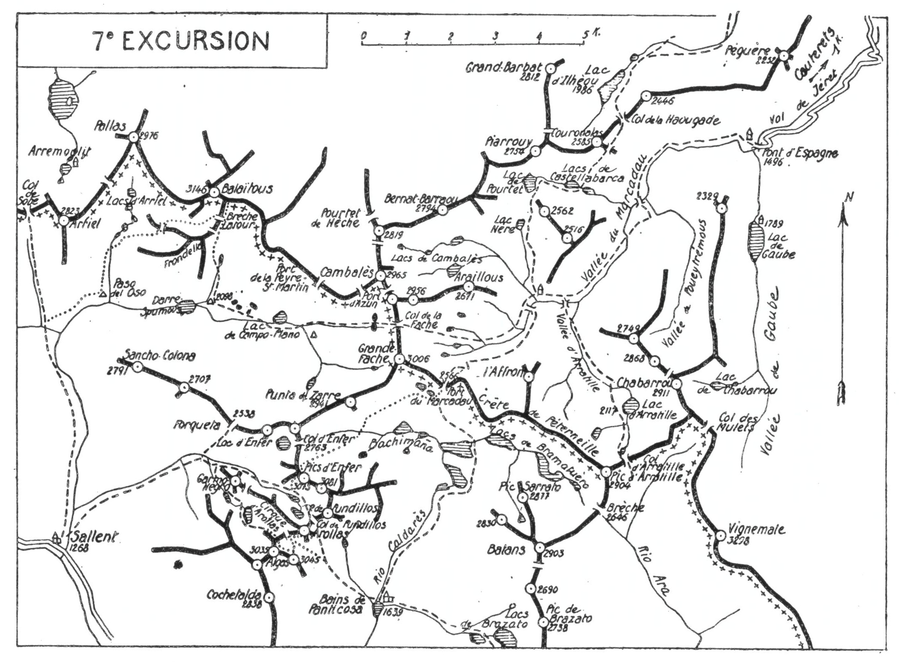

<style>.centre {text-align: center}</style>
<style>.droite {text-align: right}</style>

-----------------------
[//]: # (— p. 99 —)

# SEPTIÈME EXCURSION

(N° 6 de la 1re édition)

__Cinq jours aux environs de Cauterets__

(3° Série)<br>
_B. E. — Du 15 Juillet à fin Août._

Cartes à emporter : Oloron et Laruns réunies.

__De CAUTERETS à CAUTERETS,__<br>
__par le Balaïtous, Sallent, l'Algas, l'Arollas, les Bains de Particosa,__<br>
__le Pic d'Enfer, le Port du Marcadau,__<br>
__les lacs Nère, du Pourtet, de Castellabarca et d'Ilhèou.__

<u>__AVIS AUX TOURISTES__</u>
 
Un bon guide est indispensable pour toute l'excursion, et si
on est plus de deux, on prendra aussi un porteur. On emportera
des vivres pour quatre repas, du pain et du vin pour deux jours.

Cette excursion comprenant des passages délicats et des journées 
assez dures, il sera prudent de ne l'entreprendre qu'avec
des compagnons exercés et résistants à la fatigue.

<p class="droite">(Voir ci-contre la Carte de l'Excursion).</p>

(Voir aussi le Plan du Balaïtous, page 58).


<div class="page"/>

— p. 100 —



<div class="page"/>


— p. 101 — (7me EXCURSION) CAMPO PLANO

## PREMIÈRE JOURNÉE

__De CAUTERETS (902m)au REFUGE de CAMPO-PLANO (2.100m),__<br>
__par le Marcadau et le Col de la Fache (2.738m).__

—— GUIDE INDISPENSABLE ——

__Conseils.__ — __Itin. recomm.__ — On partira de très bonne heure en
voiture jusqu'au Pont d'Espagne (1.494m), où on mettra sac au
dos pour monter déjeuner au refuge du Marcadau (1.860m).
(V. 6° E., pp. 89, 92.) On pourra y déposer une partie de ses provisions 
qu'on retrouvera trois jours après.

On repartira du Marcadau, à 13 h. au plus tard, pour monter
au Col de la Fache en suivant la rive g. du vallon par le même
itinéraire qu'à l'excursion précédente. (V. 6° E., p. 89.)

Au Col de la Fache, on passera sur le versant espagnol au
vallon qui conduit à Campo-Plano. On descendra par la rive dr.
d'abord, puis, vers le fond du vallon, on prendra la rive g., pour
aboutir au S. du grand lac de Campo-Plano.

Longeant ce lac par la rive g., on franchira aussitôt après le
torrent de Piédrafita, pour repasser définitivement rive dr. jusqu'au 
nouveau refuge de Campo-Plano (2.100m), qu'on nomme
« Refuge Alphonse XIII », où on couchera.

Ce refuge est situé entre les lacs de Campo-Plano et de Darré
Spumous, près des laquets de las Ranas. C'est la Peñalara, de
Madrid, qui l'a fait construire; il a été inauguré le 12 août 1929,
et il remplace avantageusement la cabane de Darré Spumous où
on couchait autrefois très à l'étroit.

__Horaire de la Journée :__

```
De Cauterets au Pont d'Espagne, en voi-         }
    ture................................. 1h.30 }   9h.30
Du Pont d'Espagne au Col de la Fache..... 5h. » }  (Arrêts en sus)
Du Col de la Fache au refuge de Campo-          }
    Plano ............................... 3h. » }
```

<div class="page"/>

— p. 102 — BALAITOUS (7me EXCURSION)

## DEUXIÈME JOURNÉE

__De CAMPO-PLANO (2.100m) à SALLENT (1.268m),__<br>
__par le Balaïtous (3.146m),__<br>
__le Cirque d'Ariel, le Paso del Oso et la Garganta d'Agua Limpia.__


—— GUIDE INDISPENSABLE ——

__Conseils.__ — __Itin. recomm.__ — On fera l'ascension du Balaïtous
par la brèche Latour (2.978m); la voie est classique. Du refuge de
Campo-Plano, on monte au N.-O. par la rive g. du ruisseau de la
Sclousère qu'on franchit avant d'arriver au lac de ce nom. Prenant 
ensuite la direction N., on s'élève à travers de gros éboulis
descendus de la Frondella, et environ 2 h. après le départ, on
arrive au glacier très incliné de la brèche. On le traverse direction 
N.-O., vers le couloir de la brèche, afin d'aboutir au pied des
murailles qui se dressent en haut, à dr. du couloir. C'est là que
commençait autrefois la partie délicate de l'ascension. On a devant 
soi un mur presque vertical d'une quarantaine de m. et, à
sa base, une rimaye assez incommode à franchir, si elle est très
ouverte. On pourra laisser là le sac, à la garde du porteur, ce qui
facilitera l'ascension et surtout le passage de l'impressionnante
muraille.

Depuis qu'on a placé des crampons au passage le plus délicat,
l'ascension de la muraille ne présente plus de difficulté. A la
descente, le passage de la rimaye, si elle est très ouverte, exige
une certaine prudence. Cependant, si les crampons d'en haut sont
utiles, les deux d'en bas sont plutôt dangereux, car, si on glissait
en débarquant au couloir, on pourrait s'empaler sur l'un d'eux,
puisque la pente glaciaire du couloir incline à g.

Parvenu au haut de la muraille, on aboutit à une petite plateforme 
d'où on domine la brèche, au S. et, à l'O., le glacier de
la Frondella, par lequel on descendra. A partir de là, une large
crête monte en pente douce au sommet du Balaïtous (3.146m).

J'ai dit à la 3° E., p. 60, mes impressions sur cette magnifique
montagne.

Pour la descente, on reprendra l'itinéraire d'ascension jusqu'à
la base de la muraille de 40 m. Là, selon l'état du couloir de la


<div class="page"/>


— p. 103 — (7me EXCURSION) GORGE de L'AGUA LIMPIA

brèche et la qualité de la caravane, le guide jugera de la voie
à suivre pour passer du glacier de la brèche à celui de la Frondella. 
Il existe trois passages : 1° la traversée directe par la
brèche, si le rocher qui y est coincé est en l'air et laisse un vide
suffisant pour passer dessous; 2° les corniches Casse-Latour et
J. Blanchet; 3° enfin, plus au S., par la Brèche Anonyme entaillée
sur la crête de la Frondella. Ce dernier passage est le plus facile
entre la montagne Fermée et le glacier de la Frondella.

On abordera le glacier de la Frondella avec prudence et en
taillant des pas très profonds dans la partie supérieure. Bientôt
la pente s'adoucit et, en une longue glissade, on rattrapera le
temps perdu pour le passage de la brèche. Parvenu au fond du
glacier, on obliquera à g., au S.-O., sans perdre d'alt., afin de franchir 
le Col Wallon, en laissant à dr., très bas, les lacs d'Arriel.

Continuant la descente direction S.-O., on arrivera bientôt sur
un petit ressaut qui domine le dernier lac; on fera alors un
crochet à g., puis un second à dr., afin d'aboutir au-dessous
de la cascade du déversoir du dernier lac. Là, on franchira le
torrent d'Arriel qu'on longera par la rive dr. jusqu'à un petit
plateau où se trouve une grande cabane en ruines. On la laissera
à g. et on obliquera à dr., à l'O.-S.-O., afin d'arriver au fameux
« Paso del Oso. » (Pas de l'Ours) qu'il faut franchir au moment
d'entrer dans la gorge de l'Agua Limpia.

Plusieurs écrivains de montagne ont indiqué ce passage
comme très dangereux; cela est exagéré, car, en août 1913, une
caravane de cinq membres l'a franchi, sous ma direction, sans
la moindre difficulté. Il s'agit simplement de choisir la meilleure
traversée de cette pente rocheuse. Le Paso del Oso n'est dangereux 
que pour le touriste qui manquerait le seul passage commode 
et qui serait sujet au vertige.

Après avoir coupé deux couloirs d'écoulement des eaux d'orages,
on en trouve un troisième par lequel il faut descendre jusqu'à 
des roches lisses. Il y a là une quarantaine de m. de dalles
très inclinées, avec de petites prises, mais d'une sécurité absolue
pour un pyrénéiste non sujet au vertige. Cela ne demande que
10 min. d'attention. On descend en diagonale, de g. à dr., et on
aboutit immédiatement dans un terrain facile. On n'arrivera pas
au fond de la cuvette, mais on tournera à l'O., en se tenant très
haut, pour entrer dans la gorge par la rive dr. On passe là à la


<div class="page"/>


— p. 104 — SALLENT (7me EXCURSION)

base du contrefort S. du Pic d'Arriel, en dominant le torrent
d'environ 200 m. pendant près de 1 h. On ne trouvera que des
tronçons de sentiers et, quand on croira pouvoir descendre, on
sera obligé de remonter pour arriver au passage.

L'important est de marcher presque horizontalement, afin
d'aboutir aux verts pâturages de Soba qu'on aperçoit dès son entrée 
dans la gorge. On rejoindra bientôt le sentier qui descend
du Col de Sobe et, à partir des pâturages de Soba, un grand
chemin muletier conduit directement à Sallent par la rive dr. de
L'Agua Limpia. On passe d'abord à la verte prairie qu'on nomme
« Cueva de las Palomas » (1), puis, 3/4 d'h. plus bas, on arrive
près du « Salto de Sallent » (2) d'où on découvre subitement
le bourg.

A Sallent, je recommande la « Fonda » de Enrique Bergua et,
pour la location des mulets, el señor Eugenio Perer.

Nota. — Dès son arrivée à Sallent, on louera un mulet pour
faire monter les sacs, le lendemain matin, au plateau supérieur
de Pundillos, vers 2.000 d'alt.

__Horaire de la Journée :__

```
De Campo-Plano au Balaïtous.......... 3h.30 }
Du Balaïtous au Col Wallon par la Brèche    }
   Latour............................ 2h.15 }   10h.45
Du Col Wallon au Paso del Oso........ 2h. » } (Arrêts en sus)
Du Paso del Oso à Sallent............ 3h. » }
```

## TROISIÈME JOURNÉE

__De SALLENT (1.268m) aux BAINS de PANTICOSA (1.639m),__<br>
__par les Pics d'Algas (3.035m-3.045m) et d'Arollas (3.060m),__

—— GUIDE INDISPENSABLE ——

__Conseils.__ — __Itin. recomm.__ — De Sallent, il existe un sentier qui
va directement aux bains de Panticosa par le vallon de Pundillos 
et le col de ce nom. On l'utilisera en partie pour faire
monter les sacs par un mulet jusqu'au plateau supérieur de Pundillos, 
vers 2.000 d'alt. 

———<br>
(1) Nid des Colombes.
(2) Cascade de Sallent, qu'on peut admirer au passage.

<div class="page"/>


— p. 105 — (7me EXCURSION) ALGAS — AROLLAS

Partant de très bonne heure, on sortira de Sallent par le N.-E.
en franchissant l'Agua Limpia. On remontera le vallon de Pundillos 
en longeant le torrent par la rive g. jusqu'au cirque où
tombent plusieurs petites cascades. On remarquera de l'autre
côté, au N.-E. le sentier qui monte à la Forqueta de Piedrafita
(2.538m).

Avant d'arriver à la première cascade, le sentier tourne à dr.,
au S., et, en de multiples lacets, gagne le plateau supérieur où le
mulet s'arrêtera. A l'E. le Pic d'Enfer paraît imposant et majestueux 
avec ses faces blanches; le sentier des bains semble se
diriger vers lui.

Après avoir mis sac au dos, on quittera le sentier du Col de
Pundillos pour monter, au S., vers un petit vallon qui contourne,
par l'O. et le S., le massif secondaire de Garmo Negro. On longera
le ruisseau par la rive dr, et, après avoir dépassé un petit lac,
on arrivera subitement près d'un lac glacé, situé à l'entrée du
cirque d'Arollas, au pied d'un contrefort du petit Algas, vers
2.300. Nommons-le lac supérieur de Garmo Negro.

On montera par la rive O. du lac, puis par le flanc E. du contrefort,
pour arriver à toute crête au petit Algas (3.035m). A ce
sommet, la crête se divise en deux : une branche descend au
S.-O., et l'autre se relève légèrement vers l'E. jusqu'au sommet
principal (3.045m). Une crête déchiquetée sépare les deux Algas;
si on la trouve trop délicate, on descendra un peu au N. pour
suivre la base des murailles jusqu'au sommet oriental. Parvenu
à la cime, on avancera d'une cinquantaine de m. au S.-E., afin
d'apercevoir presque sous ses pieds, à 1.400 m. de profondeur, les
Bains de Panticosa et le petit lac voisin. Cette vue est des plus
impressionnantes.

De l'Algas, on descendra au N., pour traverser un névé et remonter 
en face au Col d'Arollas, où on laissera le sac. Montant
ensuite au N.-E., on fera à toute crête l'ascension de l'Arollas
(3.060m) (1). Son belvédère est splendide, surtout sur les régions
voisines qui l'entourent. Le petit cirque de Pundillos, avec ses
deux lacs, et le massif d'Enfer sont de toute beauté. A l'E. se
creuse très profondément le vallon de Caldarès, et l'œil remonte
aux cimes aiguës du massif des Batans que domine plus loin la
pointe de la Pique Longue.

———<br>
(1) Les Espagnols prononcent : Las Arouélas.

<div class="page"/>


— p. 106 — PIC D'ENFER (7me EXCURSION)

A environ 400 m. au N.-E., s'entaille le Col de Pundillos, par
lequel on passera le lendemain pour se rendre au Pic d'Enfer.

Pour descendre aux Bains de Panticosa, on reviendra au Col
d'Arollas, puis on se dirigera au S.-E., en traversant, par la g.,
le névé par lequel on y est monté. On rejoindra plus bas les traces
du sentier qui vient de Sallent par le Col de Pundillos, et on arrivera 
aux bains par la rive dr. du vallon de Caldarès.

__Horaire de la Journée :__

``` 
De Sallent au plateau de Pundgillos....... 2h.15  }
Du plateau au lac supérieur de Garmo              }
    Nègro..........................        1h.30  }   10h.45
Du lac au Pic occidental d'Algas.......... 2h. »  }
Du Pic occidental d'Algas au Pic oriental. Oh. 30 } (Arrêts en sus).
Du Pic oriental à l'Arollas............... 1h.30  }
De l'Arollas aux Bains de Panticosa....... 3h. »  }
```

## QUATRIÈME JOURNÉE

__Des BAINS de PANTICOSA (1.639m) au REFUGE__<br>
__du MARCADAU (1.860m), par les Pics d'Enfér (3.073m-3.081m)__<br>
__et le Port du Marcadau (2.556m).__

—— GUIDE INDISPENSABLE ——

__Conseils.__ — __Itin. recomm.__ — On emportera des provisions pour
un repas et deux casse-croûte, et on partira dès qu'on pourra se
conduire, car la journée sera dure.

On reprendra, au N.-O. des bains, le chemin de la veille qu'on
suivra 1 lh. 1/2 environ. Laissant alors à (g. l'itinéraire du Col
d'Arollas, on montera, au N.-N.-O. vers le Col de Pundillos qui
est situé entre le pic de ce nom, au N.-E., et l'Arollas, au S.-O.
C'est par ce col que passe le chemin direct des bains de Panticosa
à Sallent.

Parvenu au col, on aura devant soi, au N.-O. le petit cirque
de Pundillos, où brillent deux jolis lacs; au N., un peu en biais,
la grande face S.-O. du Pic d'Enfer et, au fond du cirque, à
dr., l'arête S.-O., par laquelle l'ascension du pic est très facile.
On descendra donc au cirque qu'on longera par la dr., afin d'aller
rejoindre l'arête S.-O. On montera à toute crête jusqu'au sommet 
(3.073m), où on déposera le sac.

<div class="page"/>


— p. 107 — (7me EXCURSION) PORT du MARCADAU

A environ 400 m., à l'E.-S.-E., on aperçoit la tourelle du point
culminant du massif d'Enfer (3.081m). Une crête impressionnante,
mais facile, réunit les deux sommets, et 20 min. suffisent pour
l'aller et le retour. Dans ce trajet d'un pic à l'autre, on chemine
sur la ligne de faîte qui sépare les deux grandes faces blanches
du massif d'Enfer. Leur éclat est tel que les glaciers de leurs
bases semblent monter jusqu'au sommet.

Le belvédère des Pics d'Enfer, que les espagnols appellent :
Quijada de Pundillos, est de tout premier ordre; il complète
merveilleusement les panoramas déjà vus des Pyrénées occidentales. 
Si les excursions précédentes ont été effectuées par un
temps clair, avec celle de l'Enfer, la chaîne frontière n'aura plus
de secrets pour le touriste, du Pic d'Anie au Vignemale.

Du pic occidental, on suivra la crête N.-O. quelques min., afin
d'aboutir au haut d'une cheminée rapide qui descend directe-
ment au glacier N. Par cette voie, on gagne 1 h. sur le trajet
qui fait passer plus au N. au Col d'Enfer. En quelques glissades,
on franchira tout le glacier, et on arrivera rapidement au vallon
qui descend, à dr., vers les lacs de Bachimaña.

Au lieu de le suivre, on le coupera par une petite remontée
en face et on obliquera immédiatement à dr., au N.-E. On passera
à flanc de montagne à la base des escarpements de la Punta de
Zarre (2.941m), afin d'aboutir au déversoir du petit lac inférieur
Del Pécico de la Canal, près du Port du Marcadau. Quelques min.
après, on rejoindra le chemin muletier de Panticosa à Cauterets.
On n'aura qu'à franchir le Port du Marcadau (2.556m) et à redescendre 
en France, en suivant le sentier muletier jusqu'au Pla de
la Gole. On ira coucher au refuge Wallon (1.860m).

Selon la saison et le volume d'eau du ruisseau de Cambalès,
le guide jugera s'il vaut mieux franchir le gave au Pont des
Espagnols ou à celui du Pla de la Gole. Par le premier, on gagne
20 min., mais il faut sauter au passage le ruisseau de Cambalès
dans sa partie la plus large (1).

__Horaire de la Journée :__

```
Des Bains de Panticosa au Pic d'Enfer... 5h.30 }   10h.45
Du Pic d'Enfer au Port du Marcadau...... 3h. » } (Arrêts en sus)
Du Port du Marcadau au Refuge Wallon.... 2h.15 }
```

———<br>
(1) Le Pont des Espagnols est situé sur le gave du Marcadau,
environ 10 min. en amont du confluent du ruisseau de Cambalès.


<div class="page"/>


— p. 108 — LAC du POURTET (7me EXCURSION)

## CINQUIÈME JOURNÉE

__Du REFUGE du MARCADAU (1.860m) à CAUTERETS (932m);__<br>
__par le Lac Nère (2.250m),__<br>
__le Lac du Pourtet (2.450m), les Lacs de Castellabarca (2.187m),__<br>
__le Col de la Haougadé (2.350m) et le Lac d'ilhèou (1.986m).__


—— GUIDE UTILE ——

__Conseils.__ — __Itin. recomm.__ — Du refuge du Marcadau, on peut
rentrer à Cauterets dans 3h.30; mais, si on veut terminer cette
belle excursion par une intéressante journée, on suivra l'itinéraire 
suivant qui fait visiter huit lacs, franchir trois cols et
passer dans trois vallées différentes.

A 10 min. au N.-O. du refuge, on rejoindra le petit ruisseau
qui descend du N. pour se jeter dans celui de Cambalès; il vient
du Lac Nère, vers lequel on montera. On ne rencontre que des
pâturages, et le terrain est si propice à l'ascension qu'en 1 h 1/2
environ, on atteindra ce joli lac, en se servant du ruisseau
comme guide. On arrive sur ses bords par un étroit goulet qui
laisse juste le passage du déversoir entre deux éperons rocheux.

Enchâssé dans une cuvette profonde et entouré de rochers
à pic sur tout son pourtour, le Lac Nère, avec ses eaux bleu
foncé, est d'un charme saisissant qui retient longuement le touriste. 
Il semble qu'on ne peut le dépasser. Cependant, en examinant 
les pentes rocheuses de la rive E., on découvre une sente
de moutons qui suit à flanc les roches qui l'entourent; cela
permet de le contourner par la dr., afin d'aboutir à un couloir
d'éboulis qu'on aperçoit au N. du lac. C'est par là qu'on passera
pour monter au Lac du Pourtet. A l'entrée du couloir, on trouvera 
un sentier bien tracé.

Après une ascension facile au N. du Lac Nère, on arrive dans
un large col pierreux. Le curieux Lac du Pourtet (2.450m) est un
peu à g. et presque à cheval sur les deux versants (1). Retenu au

———<br>
(1) C'est, sans doute, sa situation spéciale qui lui a fait donner le
nom de « Pourtet »; il est, en effet, sur le Pourtet qui fait communiquer 
la région de Castellabarca avec celle de Cambalès.

<div class="page"/>


— p. 109 — (7me EXCURSION) COL de LA HAOUGADE

S. par une digue insignifiante, il s'écoule, à l'E., dans le vallon
de Castellabarca. Quelques coups de pioche le feraient se déverser 
du côté opposé, sur le Lac Nère, comme l'indique, par erreur,
la carte du ministère de l'Intérieur.

Pour se diriger sur Castellabarca, il faut revenir quelques pas
en arrière et reprendre le sentier qui franchit la crête au S.-E.
du lac. On descend ensuite rapidement à travers la rocaille vers
deux petits lacs qu'on longe par la dr. A partir de ce point, le
sentier, très bien tracé, suit les bords du torrent jusqu'au lac
supérieur de Castellabarca (2.187m) qu'on longera par la rive S.

Ce coin est délicieux et on y fait d'ordinaire une longue halte.
Un peu plus bas, à une cinquantaine de m. de différence de niveau, 
se blottit le joli lac inférieur creusé dans le roc même. On
l'appelle Lac de l'Embarrat (l'Enfermé), ce qui rend bien sa situation.

Franchissant le déversoir du lac supérieur, sans descendre à
l'autre, on suivra à g., au N.-E., un sentier qui, après avoir monté
pendant quelques min. file presque horizontalement vers un petit
col situé au S.-E. du Pic Couronalas (2.585m), à 2.375 d'alt. De ce
point, on dominera toute la région de Cayan jusqu'au Pont d'Espagne. 
Une petite descente de quelques min. au N. mènera au
Col de la Haougade (2.350m). Là, on passera au versant d'Ilhèou,
direction N.-O. et dès qu'on aura franchi le col, le lac apparaîtra
dans toute sa splendeur. On ira vers lui en suivant le sentier. On
le longera par la rive dr. et, après l'avoir dépassé, on n'aura qu'à
suivre le chemin muletier qui descend à Cauterets par la gorge
d'Ihèou et le Cambasque.

__Horaire de la Journée :__

```
Du Refuge du Marcadau au Lac Nère......... 1h.30 }
Du Lac Nère au Lac du Pourtet............. 0h.45 }
Du Lac du Pourtet aux Lacs de Castella-          }
    barca................................. 0h.45 }
Des Lacs de Castellabarca au Lac d'Ilhèou. 2h. » } (Arrêts en sus)
Du Lac d'Ilhèou à Cauterets............... 2h.15 }
```

<div class="page"/>


— p. 110 —

<u>__POINTS D'INTERRUPTION__</u>

__SALLENT__
- Pour rejoindre de Laruns, 36k. de route, 2h d'autobus
- Pour rentrer à Laruns, 36k. de route, 2h d'autobus

__BAINS DE PANTICOSA__ 
- Pour rejoindre ou pour rentrer A Laruns, 6 k. de route, 3h d'autobus
- Pour rejoindre de Cauterets par le Port de Marcadau : 10h
- Pour rentrer à Cauterets par le port Marcadau : 8h.30

__REFUGE DU MARCADAU__
- Pour rejoindre de Cauterets : 4h.30
- Pour rentrer à Cauterets : 3h.30
