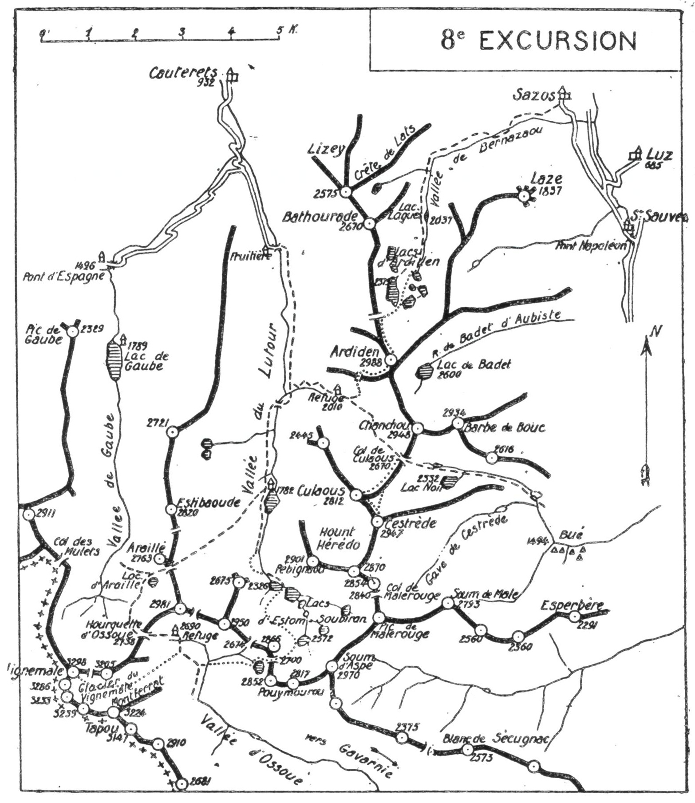

<style>.centre {text-align: center}</style>
<style>.droite {text-align: right}</style>

-----------------------
[//]: # (— p. 111 —)


# HUITIÈME EXCURSION

(N° 7 de la 1re-édition)

__Quatre jours au départ de Cauterets__

_B. E. — Du 15 Juillet à fin Août._

Cartes à emporter : Luz et Gavarnie réunies.

__De CAUTERETS à LUZ,__

__par la Vallée de Lutour, le Lac d'Estom,__<br>
__le Col et le Pic d'Araillé, le Refuge d'Ossoue, le Vignemale,__<br>
__les Lacs d'Estom Soubiran,__<br>
__le Refuge de Culaous, le Pic de Culaous, le Pic de Cestrède,__<br>
__l'Ardiden et la Vallée de Bernazaou.__

 
<u>__AVIS AUX TOURISTES__</u>

Un guide est indispensable pour toute l'excursion.

On emportera la clé du refuge de Culaous (1), des conserves
pour quatre repas, du pain et du vin pour un jour et la carte
de sociétaire, si on est membre du C. A. F. Grâce à cette dernière, 
on obtiendra quelques réductions au Refuge d'Ossoue, et
on ne paiera que 2 fr. 50 pour coucher au lit de camp.

<p class="droite">(Voir ci-contre la Carte de l'Excursion).</p>
 
# PREMIÈRE JOURNÉE

__De CAUTERETS (9321m) au REFUGE d'OSSOUE (2.690m),__<br>
__par la Vallée de Lutour, le Lac d'Estom (1.782m), le Col et le Pic__<br>
__d'Araillé (2.763m) et la Hourquette d'Ossoue (2.738m).__

—— GUIDE UTILE ——

__Conseils.__ — __Itin. recomm.__ —- On partira vers 5 h. et on remontera 
la vallée de Lutour pour arriver, vers 9 h., à l'hôtellerie
du Lac d'Estom. On y déjeunera vers 10 h., afin de pouvoir en
repartir à 11h.30 ou midi. On ne prendra dans son sac que ce<br>
(1) On trouve cette clé au Syndicat d'Initiative à Cauterets.

<div class="page"/>

[//]: # (— p. 112 —)



qui est nécessaire jusqu'au lendemain soir, et on laissera le reste
à l'hôtellerie en retenant des lits.

Partant direction S.-O., on suivra le sentier qui monte au Col
d'Araillé (2.596m) où on déposera le sac. En 1h.30, aller et
retour, on fera au N. du col l'ascension facile du Pic d'Araillé
(2.763m).

Sauf qu'il trône au centre d'un monde rocailleux dont il tire
son nom, l'Araillé est par lui-même sans caractère. Mais c'est


<div class="page"/>

— p. 113 — (8me EXCURSION) COL D'ARAILLE

le balcon révé pour bien jouir de l'envolée gracieuse de la Pique
Longue.

Du Col d'Araillé, on suivra pendant quelques min. le sentier
qui descend à l'O. vers les Oulettes de Gaube; puis on obliquera 
à g., à flanc de montagne, pour passer sur les bords du
petit lac d'Araillé. On remontera ensuite direction S., afin de
rejoindre le sentier muletier qui monte de la vallée de Gaube.
On franchira la Hourquette d'Ossoue (2.738m) et, 1/4 d'h. après,
on arrivera au refuge du Vignemale (Refuge Baysselance) où
on couchera (1).

__Horaire de la Journée :__

``` 
De Cauterets au Lac d'Estom................. 3h.39 }
Du Lac d'Estom au Col d'Araillé............. 2h.50 }    8h.45
Du Col d'Araillé aw Pic d'Araillé et retour. 1h.30 } (Arrêts en sus)
Du Col d'Araillé au refuge d'Ossoue......... 1h.15 }
```

## DEUXIÈME JOURNÉE

__Du REFUGE D'OSSOUE (2.690m) au LAC D'ESTOM (1.782m),__<br>
__par le Vignemale (3.298m),__<br>
__le Col de Pouymourou (2.700m) et les Lacs d'Estom Soubiran.__

—— GUIDE INDISPENSABLE ——

__Conseils.__ — __Itin. recomm.__ — Bien que le Vignemale soit l'un
des plus grands pics de la chaîne, l'ascension en est facile. Avec
un bon guide, elle peut être entreprise par des débutants.

On partira à la pointe du jour et on fera l'ascension sans sac;
on emportera simplement un casse-croûte et on reviendra déjeuner 
au refuge. On peut aussi, si on veut éviter 1 h. de marche 
et déjeuner avec ses provisions, partir avec le sac qu'on
laissera au pied du glacier.

On suivra, au S.-E., le chemin de Gavarnie environ 20 min.
afin de contourner l'éperon E. du petit Vignemale (3.205m). Selon
l'époque de l'excursion et l'état du glacier, on pourra faire

———<br>
(1) Le refuge gardé d'Ossoue a été construit en 1899 et inauguré le
26 août 1900. Un tenancier y est installé du 10 juillet au 10 septembre.
On y trouve des provisions, et le couchage au lit de camp coûte
2 fr. 50 aux membres du C. A. F.


<div class="page"/>

— p. 114 — Le VIGNEMALE (8me EXCURSION)

l'ascension en entier par ce dernier, ou en partie par la crête de
Montferrat. En tardive saison, la partie basse du glacier est très
crevassée et remplie de séracs qui en rendent la traversée dangereuse. 
Il faut alors passer plus à l'E., et emprunter la crête de
Montferrat, pour aboutir à la partie supérieure du glacier qui
est plane et généralement unie. C'est le guide qui jugera de l'itinéraire 
à suivre, comme il jugera de l'utilité de s'encorder pour
traverser le glacier.

Après avoir franchi le grand plateau supérieur du glacier, on
escalade, souvent à quatre pattes, des escarpements amusants
qui grimpent raides vers le petit refuge du Paradis (1), situé
à 3.280 d'alt.; de là, dans moins de 5 min., on atteint la cime
de la Pique Longue (3.298m), point culminant du Vignemale.

M. Russell y a construit une belle tour de 3 m. de hauteur,
et c'est le « Nec plus ultra » du pyrénéisme que de monter sur
son sommet pour s'élever à 3.301 d'alt. Je ne connais rien de
plus impressionnant que cette chute verticale de 1.200 m. de la
muraille N. de la Pique Longue sur les Oulettes de Gaube; le
vide absolu des alentours la rend encore plus terrifiante. Les
lointains sont grandioses.

Contrairement à l'opinion répandue, le Vignemale n'est pas
le pic français le plus élevé, puisque, la frontière passant sur
son sommet, il est à moitié espagnol. C'est au Pic Long (3.194m)
que revient cet honneur, car, lui, est en entier en France.

Du bas du glacier, si on est parti avec le sac, on descendra
directement vers l'E., afin de rejoindre le sentier de Gavarnie
en amont des grottes de Bellevue (2.400m). Environ 10 min. en
aval, au point où le sentier fait un grand lacet vers le torrent,
on le quittera pour tourner, à g., vers ce dernier qu'on franchira 
en contournant à flanc g., presque horizontalement. On
rejoindra une trace de sentier pour remonter, par la rive g.
le petit vallon qui descend du N.-E. du Col d'Estom Soubiran
(2.674m), vers lequel il faut se diriger.

Après 3/4 d'h. d'ascension, en vue du col, on en apercevra, à
l'E., un deuxième légèrement plus élevé : c'est celui de Pouymourou, 
situé entre le pic de ce nom (2.852m), au S., et le Pic
d'Estom Soubiran (2.866m), au N. Ce dernier sommet n'est pas

———<br>
(1) Le refuge du Paradis, qui mesure 2 m. cubes, : a été construit
par M. Russell en 1893.


<div class="page"/>

— p. 115 — (8me EXCURSION) CIRQUE D'ESTOM SOUBIRAN

sur la crête séparative, mais un peu en recul vers le N. sur le
cirque lacustre d'Estom Soubiran. C'est par le Col de Pouymourou 
(2.700m) qu'il faut passer, si on veut jouir complètement des
sauvages beautés de ce cirque. On aura devant soi un petit vallon
oblique qui monte, à dr., vers le Col de Pouymourou et, 1/2 h.
après, dès qu'on aura franchi un ressaut rocheux, on arrivera
près du joli lac des Gentianes (1), vers 2.600 d'alt., au pied du
col. De là, 20 min. suffisent pour déboucher sur le cirque
d'Estom Soubiran.

Le Col de Pouymourou, très évasé, est d'un accès très facile par
les deux versants. On y jouit d'une vue magnifique sur le Vignemale 
et sur les lacs glacés d'Estom Soubiran qu'on a sous ses
pieds. On descendra à g., par la base des pentes E. du pic d'Estom 
Soubiran, en longeant la rive O. du lac supérieur (2.572m).
On arrivera ainsi au centre du cirque d'où on continuera la descente 
par la g., direction N.-O., en laissant tous les lacs à dr., :
sauf le dernier {2.326m), qu'on contournera par la rive E.

Immédiatement au-dessous, on sautera le torrent pour passer
définitivement sur la rive g. jusqu'au lac d'Estom.

Le torrent, qui franchit à un grand ressaut, s'est creusé un
passage à travers le rocher par où il bondit en de multiples cascades. 
On peut descendre par les deux rives. Les guides, comme
d'ailleurs les cartes, indiquent un sentier sur la rive dr. dans la
partie supérieure. J'ai trouvé, sur la rive g., un passage plus commode 
dont voici la description. Au moment où le torrent plonge
dans la fissure du roc, on n'a qu'à continuer horizontalement à,
g., par la base du Tuc des Monges, pendant 10 min. environ.
Bientôt, ou aboutira à une pente gazonnée qui plonge à dr., jusqu'au 
bord du torrent; on n'aura qu'à la zigzaguer jusqu'au fond,
pour rejoindre un sentier qui descend directement jusqu'à l'hôtellerie 
du Lac d'Estom (1.782m) où on couchera.

__Horaire de la Journée :__

``` 
Du Refuge au Vignemale............... 3h.15 } 
Du Vignemale au Col de Pouymourou.... 3h.45 }    9h.45
Du Col de Pouymourou au Lac d'Estom.. 2h.45 } (Arrêts en sus)
```

———<br>
(1)  Ce petit lac, d'une coquetterie sauvage, tire son nom de la 
gracieuse fleurette bleue qu'on trouve en quantité dans ses alentours.


<div class="page"/>


— p. 116 — LAC D'ESTOM — PIC de CULAOUS  (8me EXCURSION)


## TROISIÈME JOURNÉE

__Du LAC d'ESTOM (1.782m) au REFUGE de CULAOUS (2.010m)__<br>
__et aux Pics de Culaous (2.812m) et de Cestrède (2.947m).__

—— GUIDE INDISPENSABLE ——

__Conseils.__ — __Itin. recomm.__ — Avant de quitter l'hôtellerie d'Estom, 
on fera provision de pain et de vin pour trois repas et deux
casse-croûte.

On prendra le chemin de Cauterets qu'on suivra jusqu'après
le pont de Pouey-Caou. Là, on apercevra en face, à l'E., les lacets
du chemin muletier qui monte vers Culaous; on n'aura qu'à suivre 
ce dernier jusqu'au refuge qui est situé à l'entrée du plateau,
à 2.010 d'alt. On le nomme Refuge Russell, en souvenir du grand
pyrénéiste de ce nom.

Après avoir mis dans son sac ce qui est nécessaire pour la
journée, on déposera le reste au refuge et on repartira immédiatement 
pour faire l'ascension du Culaous et du Cestrède par
le Col de Culaous (2.670m). Un sentier, qui disparait par moments,
monte directement au col dont on aperçoit la grande échancrure
en haut, au S.-E. du refuge.

Le Col de Culaous est situé au S. du Pic de Chanchou (2.948m),
sur la crête qui sépare la vallée de Lutour de celle de Gavarnie.
C'est par là que passe le chemin le plus court et le plus intéressant 
pour aller de Cauterets à Gédre.

Parvenu au col, on obliquera à dr., au S., pour suivre la crête
qui monte directement au sommet supérieur de Culaous (2.812m).
Après 3/4 d'h. d'ascension facile à travers des gazonnés parsemés
de pierres, la crête s'effile; il faut alors la suivre par son flanc
O., sauf dans la partie supérieure qu'on grimpera à toute crête
jusqu'au sommet.

Au pic de Culaous, on aura littéralement sous ses pieds le vallon 
sauvage de Hount-Hérédo que ferme, au S.-O., l'arête déchiquetée 
du Pébignaou. A quelques centaines de m. à l'E., on apercevra 
le signal du Cestrède, et on pourra en repérer en entier la
facile voie d'ascension.

Après être redescendu d'une cinquantaine de m. au S.-E., on
suivra presque horizontalement le flanc N. de la crête qui sépare

<div class="page"/>


— p. 117 — (8me EXCURSION) PIC de CESTREDE

les deux sommets jusqu'au point situé verticalement au-dessous
du Cestrède. Pendant ce trajet, on longera les bords de deux
névés, petites taches blanches qu'on aperçoit de la place aux
Œufs et qui se maintiennent jusqu'à fin août. Une petite cheminée 
grimpe directement à la crête qu'on rejoint 5 min. au N.-E.
du sommet; on n'aura qu'à continuer à toute crête jusqu'à la tourelle.

Le Pic de Cestrède, d'accès facile, ne reçoit pas les visites que
mérite son belvédère de tout premier ordre. Cependant un bon
marcheur peut en faire l'ascension de Cauterets ou de Gèdre dans
la même journée. Son panorama est des plus intéressants, car il
embrasse tous les grands sommets de la région : de l'E. à l'O. le
Néouvielle, le Pic Long, le Campbieil, les Aiguillous, la Munia, le
Massif Calcaire et enfin, le Vignemale qui est à deux pas. C'esi
au Cestrède qu'il faut monter pour reconnaître d'une façon précise 
les formes si compliquées de la région qu'encerclent les trois
vallées de Lutour, d'Ossoue et de Gavarnie.

On n'est entouré que de crêtes tourmentées, de petits cirques
placés dos à dos, avec leurs pentes opposées, et de vallons tortueux 
qui filent dans toutes les directions.

Pour rentrer au refuge, on reprendra le même chemin qu'on
suivra jusqu'au premier névé; là, on obliquera à dr., en dessous,
afin d'aller rejoindre en biais la crête qui monte du Col de
Culaous où on retrouvera la voie d'ascension.

Nota. — En redescendant, on pourra repérer la voie d'ascen-
sion du lendemain, vers la Pourtère de l'Ardiden.

__Horaire de la Journée :__

``` 
Du Lac d'Estom au refuge de Culaous..... 2h.30 }
Du refuge de Culaous au Pic de Culaous.. 3h.30 }   9h.45
Du Pic de Culaous au Pic de Cestrède.... 1h. » } (Arrêts en sus).
Du Pic de Cestrède au refuge............ 2h.45 }
```

<u>__EAU au REFUGE de CULAOUS__</u>

Au cas où la fontaine de Jouvence serait tarie, on trouvera
une grande source à environ 300 m. au N.-N.-O. du refuge. On
reprendra le chemin de Cauterets et, 2 min. après, on rejoindra
l'amorce d'un petit sentier, au-dessous du fanion du T. C. F.;
on le suivra direction N. jusqu'à un vieux sapin qui barre le
chemin. On n'aura alors qu'à descendre à g. et, après trois
lacets, le sentier conduit, à dr., près d'une source abondante.

<div class="page"/>

— p. 118 — PIC D'ARDIDEN — LUZ (8me EXCURSION)


## QUATRIÈME JOURNÉE

__Du REFUGE de CULAOUS (2.010m) à LUZ (685m),__<br>
__par le Pic d'Ardiden (2.988m), les Lacs d'Ardiden et la Vallée__<br>
__de Bernazaou.__

—— GUIDE INDISPENSABLE ——

__Conseils.__ — __Itin. recomm.__ — On repartira par le sentier du Col
de Culaous qu'on suivra pendant 20 min. environ jusqu'aux ruines 
d'une ancienne cabane. Là, on prendra, à g., un nouveau
sentier, direction E., qui mène à une petite source. Tournant alors
à g., au N.-O., on zigzaguera les pentes dans cette direction, afin
d'aboutir à la Pourtère d'Ardiden d'où on découvre subitement
Cauterets. Comme son nom l'indique, c'est une large échancrure
entaillée dans le contrefort O. du pic.

Après avoir franchi la Pourtère, on descendra une trentaine de
m. au N. pour aboutir à un ravin qui monte, à l'E., vers l'Ardiden.
On remontera ce ravin par la dr. et, dès qu'on aura rejoint l'arête
du contrefort O., on continuera l'ascension, d'abord à flanc, puis
à toute crête jusqu'au sommet. On franchira la partie supérieure
en louvoyant à travers d'énormes rochers branlants.

Le belvédère de l'Ardiden: est l'un des plus beaux des Pyrénées;
il est analogue à celui du Cestrède, avec un plus large horizon.
Les champs immenses de pierres écroulées dans ses alentours
indiquent bien que l'Ardiden, auquel il manque 12 m. pour être
un 3.000, dépassait, récemment encore, cette alt. de plusieurs centaines 
de m.

De l'Ardiden, on suivra la crête N. environ 3/4 d'h., puis on
descendra à dr., à l'E., vers le Lac Grand (2.379m) qu'on laissera
à g. On continuera vers ies petits lacs Casdabat, Hourat et Cantet,
et on passera rive g. pour rejoindre le sentier qui mène au Lac
Laquès (2.037m), en haut de la vallée de Bernazaou.

A partir de là, le sentier longe le ruisseau de Bernazaou jusqu'
au vill. de Sazos où on rejoint la route qui conduit à Luz.

__Horaire de la Journée :__

``` 

Du refuge de Culaous à l'Ardiden....... 3h. » }
De l'Ardiden au Lac Grand.............. 1h.45 }    8h. »
Du Lac Grand à Sazos................... 2h.45 } (Arrêts en Sus).
De Sazos à Luz (3 k. de route)......... 0h.30 }
```

