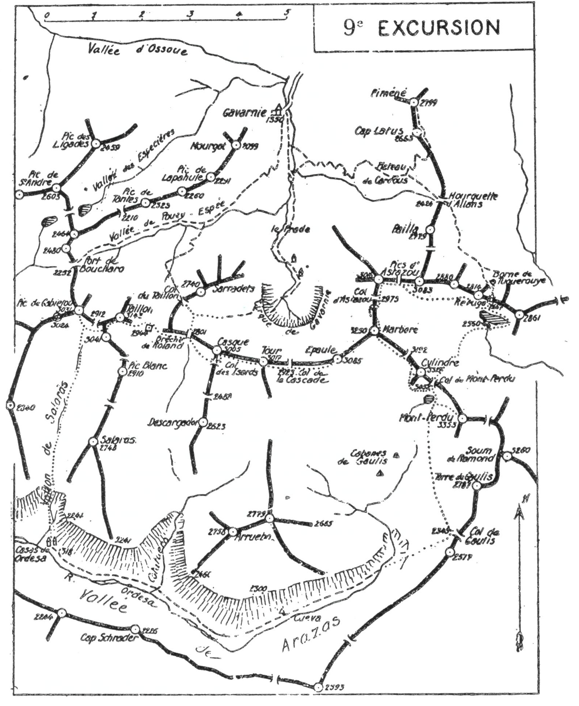

<style>.centre {text-align: center}</style>
<style>.droite {text-align: right}</style>

-----------------------
[//]: # (— p. 119 —)


# NEUVIÈME EXCURSION

(N° 8 de la 1re édition)

__Une semaine à Gavarnie et ses Environs__

_B. E. — Du 20 Juillet à Fin Août._

Cartes à emporter : Luz et Gavarnie réunies.


<u>__AVIS AUX TOURISTES__</u>

Après le concert de louanges des articles dithyrambiques parus
sur le massif calcaire, j'espère que ma faible voix sera aussi
entendue, et qu'elle décidera quelques pyrénéistes de plus à
faire l'ascension des divers sommets du joyau des Pyrénées.

Il faudrait au moins quinze jours pour visiter le massif calcaire 
et tout ce qu'il y a d'intéressant aux environs de Gavarnie. 
A ceux dont le temps est mesuré, je conseille d'y consacrer
une semaine, avec le programme ci-dessous.

Un bon guide est indispensable et, si on part avec un ou deux
compagnons, on prendra aussi un porteur pour toute l'excursion.

<p class="droite">(Voir ci-contre la Carte de 9me Excursion).</p>


<div class="page"/>

— p. 120 — MASSIF CALCAIRE (9me EXCURSION)



CARTE DU MASSIF CALCAIRE

<div class="page"/>

— p. 121 — (9me EXCURSION) CIRQUE DE GAVARNIE


## PREMIÈRE JOURNÉE

—— SANS GUIDE ——

__Conseils.__ — __Itin. recomm.__ -— Si on n'a pas couché, la veille, à
Luz, on y arrivera par le premier train et on prendra immédiatement 
la correspondance pour Gavarnie, afin d'y être pour déjeuner.

Dans l'après-midi, on visitera le cirque 9 k. aller et retour,
et on retiendra un guide pour les cinq jours suivants. Si on part
seul, on prendra aussi un porteur, mais seulement pour monter
les provisions au refuge de Tuquerouye, car le guide ne pourrait
se charger d'un si gros excédent.

On préparera son sac le soir même, avec des vivres pour cinq
repas et les divers casse-croûte. On laissera le reste des provisions 
à Gavarnie pour les retrouver le soir du cinquième jour.

# DEUXIÈME JOURNÉE

__De GAVARNIE (1.350m) au REFUGE de TUQUEROUYE (2.667m),__\
__par le Piméné (2.799m)__\
__et la Hourquette d'Allans (2.424m) (1).__

—— GUIDE INDISPENSABLE ——

__Conseils.__ — __Itin. recomm.__ On partira de bonne heure par le
chemin du cirque qu'on quittera bientôt pour prendre, à g.
sentier qui, par la Hourquette d'Allans et le Port de Pinède,
conduit à Bielsa.

Parvenu au plateau de Cardous (2.200m), un nouveau sentier
se détache à g., direction N., pour monter au Piméné en de multiples 
lacets; on laissera là le sac à la garde du porteur, et on fera,

———\
(1) Les cotes d'alt. sont celles de la carte au 1/20.000e de F. Schrader.


<div class="page"/>

— p. 122 — LE PIMENE (9me EXCURSION)

avec le guide, l'ascension de ce dernier sommet. Les montures
peuvent arriver jusqu'à la crête N. du Cap Latus, vers 2.600 d'alt.
Le sentier continue ensuite à toute crête jusqu'au sommet du
Piméné (2.799m).

Le merveilleux belvédère du Piméné est trop connu pour qu'il
soit nécessaire de le recommander. Je signale simplement qu'à
son immense panorama dont M. F. Schrader a dessiné le tour
d'horizon (1), s'ajoute le plaisir d'apercevoir tous les sommets du
massif calcaire. C'est donc par ce pic qu'il faut en commencer
l'exploration.

Après être redescendu au plateau de Cardous, on reprendra,
vers le S.-E., le sentier qui monte à la Hourquette d'Allans où l'on
passe dans la partie supérieure du cirque d'Estaubé. Là, le chemin 
de Bielsa descend assez bas, en perdant environ 200 m. d'alt.
On peut éviter une partie de cette descente en prenant, à dr.
un sentier à peine tracé qui coupe un flanc d'éboulis; il va rejoindre, 
20 min. plus loin, le grand chemin qui remonte direction S.

Continuant la marche en direction du port de Pinède qu'on
aperçoit au S.-O., on suivra, 1/2 h. encore, le sentier qui y conduit; 
on le quittera dès qu'on arrivera en vue de la Borne de
Tuquerouye (2.461m).

Située au-dessus du chemin de Bielsa, elle marque l'entrée du
grand couloir au haut duquel est bâti le refuge. On s'élèvera vers
sa dr., en biais, afin d'entrer dans le couloir en laissant la borne
à g. Un semblant de sentier conduit vers le petit col situé au S.
de la Borne et continue encore quelques min. par la rive g. du
couloir.

Selon la saison et l'état des lieux, on grimpe ce dernier par le
centre du glacier en majeure partie, puis par des éboulis, ou encore 
par les crampons de fer placés dans la partie supérieure,
à dr.

Si, par une claire journée, on arrive au refuge au moment où
le soleil commence à décliner à l'occident, on jouira là, subitement, 
d'un des plus beaux spectacles de la nature. Rien ne peut
être comparé au féerique coucher du soleil sur le Marboré, le
Cylindre et le Mont Perdu, vu de Tuquerouye.

———\
(1). V. Annuaire du C. A. F., 1876, p. 625. Ce panorama est en vente
à la Direction centrale, 121, botlevurd Haussmann, Paris, au prix de
6 francs.


<div class="page"/>


— p. 123 — (9me EXCURSION) TUQUEROUYE

C'est la brèche de Tuquerouye qui inspira à Ramond sa page
la plus enthousiaste lorsqu'il y arriva, en 1797 (1).

Le Refuge de Tuquerouye qu'on a construit sur la brèche même,
à 2.667 m. d'alt., a été inauguré le 5 août 1890; il a été agrandi
en 1927 par une nouvelle bâtisse, qui a été accolée au S.-E. de
l'ancienne, et il y a maintenant de la place pour une vingtaine de
personnes. Du refuge, on domine d'une centaine de m. le lac glacé
du Mont Perdu qui est sur le versant opposé au grand couloir, et
on peut affirmer, sans crainte d'être contredit, que c'est le mieux
situé des Pyrénées et l'un des plus utiles.

Nota. — Des travaux pour capter la houille blanche ayant été
effectués aux alentours du Lac glacé, il existe, près du déversoir,
une cantine où on peut aussi coucher.

__Horaire de la Journée :__

``` 
De Gavarnie au Piméné............. 4h.15  }   7h.45
Du Piméné à Tuquerouye............ 3h.30  } (Arrêts en sus).
```

## TROISIÈME JOURNÉE

__Ascensions des Pics d'Astazou (3.083-3.016), du Marboré (3.253m)__\
__et du Cylindre (3.327m).__

—— GUIDE INDISPENSABLE ——


Conseils. —— Itin. recomm. — Cette excursion, la plus belle des
Pyrénées, est délicate et longue; elle ne doit être entreprise que
par des pyrénéistes exercés et non sujets au vertige. Un débu-

———\
(1) Voici des extraits de cette belle page :

« En vain, j'essaierai de peindre la magnifique apparence de ce
tableau. En vain, je tenterai de décrire ce que son apparition a d'inopiné, 
d'étonnant, de fantastique, au moment où le rideau s'abaisse, où
la porte s'ouvre, où l'on touche enfin le seuil du gigantesque édifice.
On n'en croit pas ses yeux; on cherche autour de soi un appui, des
comparaisons : tout s'y refuse à la fois. Un monde finit, un autre
commence. Jamais rien de pareil ne s'était offert à ma vue. J'ai vu les
Hautes-Alpes, je les ai vues dans ma première jeunesse, à cet âge où
l'on voit tout plus grand et plus beau que nature. Du Mont Blanc
même, il faut venir au Mont Perdu : Quand on a vu la première des
montagnes granitiques, il reste à voir la première des montagnes calcaires. »


<div class="page"/>

— p. 124 — PICS D'ASTAZOU (9me EXCURSION)

tant ne pourrait l'effectuer qu'encadré d'un guide et d'un bon
pyrénéiste.

On ne prendra dans son sac que ce qui est nécessaire pour
la journée et on laissera le reste au refuge. On partira dès qu'on
pourra se conduire et, après 5 min. de descente vers le lac glacé,
on tournera à dr., à l'O., pour passer dans un flanc de roches
lisses qui descendent jusqu'au lac. On trouve là de petites corniches 
qui rendent ce passage facile et qui dispensent de contourner 
le lac par l'E., ce qui fait gagner 1/2 h.

Dans 10 min., on rejoindra la base du vallon glaciaire qui
monte, direction N.-O., vers l'échancrure qui sépare les deux
Astazou; on le nomme Col Swan, en souvenir du touriste de ce
nom qui a fait la première ascension de l'Astazou par le couloir
N., le 16 septembre 1885 (1).

On remontera tout le vallon jusqu'au col où on déposera le
sac. On fera à dr., à toute crête, l'ascension de l'Astazou oriental
(3.083m) ou Grand Astazou, et on redescendra au col; puis on
fera aussi, à toute crête, à l'O., celle du petit Astazou (3.016m).

Si la vue du Grand Astazou est plus étendue, celle du petit me
paraît plus intéressante. On a sous ses yeux le cirque de Gavarnie 
et presque toutes ses crêtes; on domine verticalement le fond
de l'Oule et l'impression du vide est des plus fortes.

Du Petit, Astazou, on pourra reconnaître toute la voie d'ascension 
au Marboré par l'arête N. qui, de loin, paraît impraticable.
C'est là la partie la plus délicate de la journée, mais aussi la
plus intéressante pour un vrai pyrénéiste.

C'est le célèbre guide, Henri Passet, qui a découvert ce passage et
 qui y a conduit, en 1875, d'abord Lacotte-Minard, puis
Lequeutre, mais à la descente (2).

Les Cadier qui ont remonté cette crête le 9 août 1903, n'ont
pas rencontré le plus mauvais passage signalé par Lequeutre;
plus tard, je l'ai aussi cherché en vain (3).

« C'est le passage le plus périlleux des Pyrénées, dit Henri
Passet. »

« I n'y a que deux passages réellement périlleux, dit Lequeutre. »

———\
(1) V. Annuaire du C. A. F., 1885, p. 209.
(2) V. Annuaire du C. A. F., 1875, p. 391.
(3) V. Au Pays des Isards, tome II, p. 38.


<div class="page"/>


— p. 125 — (9me EXCURSION) MARBORE-CYLINDRE

« Passage d'escalade pure, disent les Cadier. Un jeu, après
l'ascension de l'Astazou par les murailles E. »

A mon tour, je dis que l'ascension directe du Col d'Astazou
au Marboré est un passage délicat, réservé aux grimpeurs de hauts
sommets; un chemin qui fait gagner une demi-journée, tout en
procurant au pyrénéiste, maître de soi, un pur régal de haute
montagne. On suivra donc la voie des Cadier.

Après être descendu au Col d'Astazou (2.975m), on marchera
quelques min. et presque horizontalement à flanc O. de crête, versant 
du cirque, direction S. En grimpant ensuite assez raide, on
zigzaguera pendant 20 min. la face O. du contrefort N. du Marboré 
qu'on franchira bientôt de l'O. à l'E.; on aboutira alors près
d'un névé très incliné qu'il faut traverser, afin d'en remonter la
rive dr. vers la cheminée qu'on aperçoit tout en haut. Cette cheminée 
rapide grimpe directement au plateau du Marboré, mais,
comme elle est très délicate à cause des pierres qui s'en détachent, 
on suivra sur la dr. une corniche facile qui monte en pente
douce jusqu'à la tourelle (3.253m).

Tout ce trajet est impressionnant, mais nullement dangereux;
je n'en connais pas de plus captivant dans les Pyrénées.

C'est au Marboré qu'il faut monter, si on veut admirer, dans
leur ensemble, les splendeurs du cirque et du massif calcaire.

Du Marboré, on traversera tout le plateau de pierraille vers l'E.,
puis on descendra par les pentes faciles du S.-E., en laissant, à g.,
le Col du Cylindre (1). Parvenu à la partie supérieure du glacier
du Cylindre, on le traversera, afin d'aboutir à la cheminée qui
conduit au sommet par la face S.-O.

C'est au Cylindre qu'est le plus beau point de vue du massif
calcaire. Les lointains sont magnifiques et cette ascension complète 
merveilleusement celles des deux Astazou et du Marboré.

Je pense qu'il est impossible de trouver nulle part, dans la
même journée, un panorama aussi grandiose que celui dont on
jouit par l'ascension successive de ces quatre cimes.

Du Cylindre, on rentrera au refuge par le Col du Mont Perdu.
On contournera le contrefort S. du Cylindre et on laissera le

———\
(1) Il ne faut pas confondre ce col, qui est à 3.192 m. avec le col du
Mont Perdu (3.052m) situé au S.-E. du Cylindre. C'est à tort que certains 
écrivains appellent ce dernier col du Cylindre. Le vrai col du
Cylindre est entre le pic de ce nom et le Marboré.


<div class="page"/>

— p. 126 — LE MONT PERDU (9me EXCURSION)

petit lac à dr., pour monter directement au col (3.052m). De ce
point, on découvre tout l'itinéraire du retour au refuge en longeant le lac glacé par l'E.

__Horaire de la Journée :__

``` 
Du Refuge au Col Swan................ 2h. » }
Du Col au Grand Astazou et retour.... 0h.45 }
Du Col Swan au Petit Astazou......... 0h.45 }    10h.15
Du Petit Astazou au Marboré.......... 2h.30 } (Arrêts en sus).
Du Marboré au Cylindre............. . 1h.15 }
Du Cylindre au Refuge................ 3h. » }
```

## QUATRIÈME JOURNÉE

__Du TUQUEROUYE (2.667m) à ORDESA (1.318m),__\
__par le Mont Perdu (3.353m), le Saut de Gaulis (1.890m),__\
__| __et la Vallée d'Arazas.__


—— GUIDE INDISPENSABLE ——

__Conseils.__ — __Itin. recomm.__ — On partira de très bonne heure et
on reprendra le chemin de retour de la veille, en contournant
le lac glacé par l'E., pour monter au Col du Mont Perdu (3.052m)
et redescendre, enfin, près du petit lac où on laissera le sac. On
fera ensuite l'ascension du Mont Perdu par le couloir occidental
qui est la voie classsique.

Le Mont Perdu (3.353m) est le point culminant du massif calcaire 
et l'un des plus grands sommets de la chaîne. Il est le 4° par
rang d'alt. (1). Son panorama est immense et sa croupe glacée
est visible à plus de 100 k. Cependant on n'a pas, sur son sommet, 
l'impression d'être suspendu sur des abimes sans fond
comme, par exemple, au Pic de Midi d'Ossau, à la Pique Longue

———\
(1) Le premier est le Néthou (3.404m); le deuxième, le Posets
(3.367m) et le troisième, la Pointe d'Astorg (3.354m), l'une des cimes des
Monts-Maudits, à l'O. du Néthou.

<div class="page"/>


— p. 127 — (9me EXCURSION) Le SAUT de GAULIS

et au Pic Long. Les larges assises qui l'entourent presque en entier, 
sont de trop haute alt. pour créer le frisson qu'on ressent au
sommet de certains pics plus modestes, mais plus pointus. C'est
le monarque de la plus belle région pyrénéenne, mais un monarque 
trapu. Le Cylindre et le Marboré ont pour moi plus de
charme.

Avant de quitter le Mont Perdu, on pourra repérer presque
toute la voie de descente jusqu'au Saut de Gaulis, point où le
regard s'engouffre dans la vallée d'Arazas.

Depuis le petit lac, on descendra droit au S., de gradin en gradin, 
en laissant le ruisseau de Gaulis à dr. Vers 2.300 d'alt., on
coupera de sentier qui file, à g., vers le Col de Gaulis (2.343m)
qu'on laissera à l'E. pour faire un crochet vers l'O. Parvenu sur
un replat, on apercevra le nouveau refuge de Gaulis, situé vers
2.200 m. d'alt., au point où le sentier de Fanlo au plateau de
Millaris coupe le torrent qui descend d'entre le Cylindre et le
Mont Perdu. Ce torrent alimente la cascade de Gaulis et donne
naissance au cours d'eau de la vallée d'Arazas.

Le nouveau refuge a été construit en 1922 et, par ses dimensions 
de 4m 50 sur 4m, il peut contenir une douzaine de personnes.
S'il rend des services à ceux qui viennent d'Espagne, il est presque 
sans utilité pour les Français, car il est trop bas.

Après une descente vers des pelouses, on fera un nouveau crochet 
à g., afin d'arriver près d'une excavation naturelle qui surplombe 
le Saut de Gaulis ou « Paso de Soaso » (1.890m). On aura à
sa dr., au N. et un peu en contre-bas, la Cascade de Gaulis ou de
Soaso (1), et on dominera la partie supérieure de la Vallée d'Arazas 
d'une centaine de m.

Le Saut de Gaulis qui comprend une muraille d'une soixantaine
de m. est plus impressionnant que difficile, car les prises sont
nombreuses et le rocher des meilleurs. A mon dernier passage, le
31 juillet 1924, j'ai trouvé là huit ou dix crampons plutôt gênants.
Vraiment, la « Peñalara » exagère.

Après une petite descente par les gazonnés du haut de la vallée,

———\
(1) En 1892, lors de ma première excursion au Massif Calcaire, le
nom de « Soaso » était inconnu sur le versant français; en parlant de
ces lieux, tous nos guides disaient : Saut de Gaulis, Cascade de Gaulis.
Ma préférence va à ces premières appellations.


<div class="page"/>


— p. 128 — VALLEE D'ARAZAS (9me EXCURSION)

on sautera le Rio Ordesa, pour rejoindre de sentier qui le longe
définitivement par la rive dr. jusqu'aux Casas de Ordesa (1.318m).

Après le joyau français du N. du massif : le Cirque de Gavarnie, 
voici la perle espagnole du S. : la vallée d'Arazas. Pour l'une
comme pour l'autre, je me garde de toute description et de toute
comparaison entre ces deux merveilles. Je conseille simplement
au touriste de passer là lentement et de regarder de tous ses yeux,
dans toutes les directions et sur tout ce parcours de près de 10 k.

Après avoir côtoyé plusieurs ressauts du torrent qui ressemblent 
à une succession d'écluses, on passe près de la Cueva, abri
naturel sous roche, et le chemin traverse ensuite une jolie forêt
de buis. La vallée, très étroite dans cette partie, tourne à l'O.
et on entend le torrent mugir à des profondeurs insondables.
Bientôt on arrive en vue des murailles et du cirque du Cotatuero; 
on fera là une longue halte pour admirer la montagne à
la gigantesque et fine architecture qu'il est impossible de décrire,
tant elle est extraordinaire. On franchit ensuite le rio du Cotatuero 
et, par une marche horizontale, on arrive, 20 min. après,
aux Casas de Ordesa (1.318m) où l'on couchera.

Il y a deux chalets-hôtels à Ordesa tenus, l'un, par Viu Ramond, 
l'autre, par Pierre Vergez (hôtel de la Brèche de Roland).

__Horaire de la dournée :__

```
De Tuquerouye au Col du Mont Perdu... 3h. » }    9h.30
Du Col au sommet du Mont Perdu....... 1h.30 } (Arrêts en sus)
Du Mont Perdu à Ordesa............... 5h. » }
```

<div class="page"/>

— p. 129 — (9me EXCURSION) LE GABIETOU

## CINQUIÈME JOURNÉE

__D'ORDESA (1.318m) à GAVARNIE (1.350m),__\
__par le Gabiétou (3.031m), le Taillon (3.143m) et la Brèche__\
__de Roland (2.801m).__

—— GUIDE INDISPENSABLE ——


<u>__AVIS AUX TOURISTES__</u>

Au N. des Casas de Ordesa, et les dominant de près de
1.000 m., paraissent les hautes murailles du Salarüs que les
aurores lumineuses font rougeoyer; c'est par là que nous allons
rentrer à Gavarnie, afin de fermer la boucle de quatre jours
qui nous aura fait encercler presque complètement le Massif
Calcaire. On peut franchir ces hautes murailles par deux passages : 
le premier qui fait grimper droit au N. et où on a aussi
placé d'inutiles crampons, et le deuxième qui fait passer par
la Corniche. Ma préférence va carrément à ce dernier.

__Conseils.__ — __Itin. recomm.__ — Dès avoir quitté les Casas, on traversera 
un lambeau de forêt par des sentiers sinueux; dans quelques 
min., on débouchera à découvert dans un flanc de taillis
très incliné et qu'il faut zigzaguer jusqu'au pied des murailles, où
on fait la première halte.

Après quelques m. d'escalade dans du meilleur rocher, on laissera 
à g. le chemin des crampons pour suivre à dr. celui de la
corniche qui fait un crochet vers l'E. De l'avis de tous ceux qui
sont passés par là, ce trajet à lui tout seul vaudrait le voyage. On
chemine sur un long balcon littéralement suspendu à flanc de
montagne, dans un site féerique, et on a cependant l'impression
absolue qu'on est en pleine sécurité. Une petite escalade fait quitter 
la corniche, et on débouche dans le gradin supérieur, près
d'une source, dans un pays de tout repos.

A partir de là on remontera toute la partie supérieure du vallon 
de Salarüs jusqu'au Col du Gabiétou (2.912m), situé entre le
pic de ce nom à l'O., et le Taillon, à l'E. On déposera le sac at
col et, dans 40 min., aller et retour, on fera l'ascension du Gabiétou 
(3.031m) à toute crête.

Le Gabiétou comprend une double cime (3.031m-3.024m). Seul,


<div class="page"/>


— p. 130 — TAILLON - BRECHE DE ROLAND (9me EXCURSION)

le sommet N. E. (3.031m) présentes quelque intérêt sur ses abords
immédiats qui sont de toute beauté.

Du col du Gabiétou, on peut monter directement au Taillon à
toute crête; si cette voie paraît trop délicate, on suivra l'itinéraire 
suivant : du col, on se dirigera au S. -E. et presque horizontalement 
à flanc de montagne, afin d'aboutir à gaine petite dépression 
située au N. de la Pointe de Turenne (3.041m). passera là
sur le versant E. et on n'aura qu'à continuer l'ascension direction 
N. jusqu'au Taillon (3. 143). Cette voie est plus longue, mais
plus facile.

Le belvédère de tout premier ordre du Taillon est l'un des plus
faciles à atteindre. Par les pentes qui partent de la Brèche de
Roland, on y ferait monter un mulet. Situé sur la grande crête
dans l'axe des vallées de Gavarnie, au N., et de Broto, au S., le
Taillon est le sommet qu'on voit le plus longtemps en venant de
la plaine. De sa cime, on aperçoit très bien les vill. espagnols de
Broto et d'Oto; Gavarnie et Gèdre paraissent sous les pieds.

C'est au Taïllon qu'il faut monter pour découvrir toutes les
beautés du massif calcaire et tous les mystères du cirque de Gavarnie.

On descendra à l'E., en suivant le sentier de la crête jusqu'au
doigt de la fausse brèche qu'il faut contourner par le N., en passant 
pendant 2 min. en France. Immédiatement après la fausse
brèche, on reviendra sur le versant espagnol, et on longera par
leurs bases les murailles S. du Pic Bazillac jusqu'à la Brèche de
Roland.

On remarquera, au passage, le refuge Gaurier, si curieux et
surtout si utile si on est pris par le mauvais temps dans cette région.

De la Brèche, on rentrera à Gavarnie par les échelles des Sar-
radets et le cirque.

Parvenu à la Prade de Saint-Jean, on apercevra sur la rive,
à flanc du Turon de la Courade, ur simple monument de pierre
élevé par ses admirateurs et amis au grand Schrader, monument
qui a été solennellement inauguré le 19 septembre 1927.

__Horaire de la Journée :__

``` 
D'Ordesa au Gabiétou................... 4h.45 }
Du Gabiétou au Taillon, voie directe... 1h. » }     9h. »
Du Taillon à la Brèche de Roland....... 0h.30 } (Arrêts en sus)
De la Brèche à Gavarnie................ 2h.45 }
```

<div class="page"/>

— p. 131 — (9me EXCURSION) CASQUE - TOUR - EPAULE

## SIXIÈME JOURNÉE

__Ascensions du Casque (3.005m), de la Tour (3.017m)__\
__et de l'Epaule du Marboré (3.085m).__
 
—— GUIDE INDISPENSABLE ——

__Conseils.__ — __Itin. recomm.__ — Avec cette journée, on aura vu le
cirque sous tous les aspects, et on aura reconnu les formes de son
enceinte supérieure.

On prendra le chemin du Port de Boucharo qu'on suivra 1 h.
environ jusqu'à la rencontre du gave des Tourettes. Sautant alors
le torrent, on remontera en face, en zigzaguant les pentes N.-O.
des Sarradets. On inclinera bientôt à dr., au S.-O., afin de rejoindre 
le ruisseau du Taillon qu'on longera quelques instants en
grimpant vers la base du glacier.

Cette partie de l'ascension est des plus impressionnantes. Le
front du glacier du Taillon, souvent boursouflé, forme une terrasse 
de séracs qui surplombent le passage. Figés par la température 
glaciale de la nuit, ces séracs se détachent souvent dès que
la chaleur du jour arrive. Il serait donc dangereux d'y passer
l'après-midi.

Après être parvenu au pied du glacier, on tournera à g., pour
monter directement au Col du Taillon, situé au S. des Sarradets (1). 
On passera là sur le versant du cirque et, par une marche 
en biais vers le S.-E., on ira rejoindre le chemin de la veille,
à 1/4 d'h. de la Brèche de Roland. De la brèche, on se dirigera
par des pentes d'éboulis vers le Col des Isards (2.740m), et on
montera au Casque par la face S.-E. Du Casque (3.005m), on fera
successivement à flanc S. de crête l'ascension de la Tour (3.017m),
de l'Epaule (3.085m), et on rentrera à Gavarnie par le Col des
Isards, la Brèche et le Cirque.

———\
(1) C'est par erreur que la carte de Schrader porte pour ce col le
nom de « Sarradets ». D'après Henri Passet et Bernat Salles, c'est le
col du Taillon. Le col des Sarradets n'existe pas.


<div class="page"/>


— p. 132 — GAVARNIE (9me EXCURSION)

 
__Horaire de la Journée :__

```
De Gavarnie à la Brèche de. Roland...    4h. » }
De la Brèche à l'Epaule par le Casque et       }   10h.45
  la Tour .............................. 2h.30 } (Arrêts en sus)
De l'Epaule à Gavarnie ................. 4h.15 } 
```
 

<u>__POINTS D’INTERRUPTION__</u>

__TUQUEROUYE__
- Pour rentrer à Gavarnie : 4h.45
- Pour rejoindre de Gavarnie : 3h.30

__ORDESA__
- Pour rejoindre de Gavarnie par le port de Boucharo,
- Pour rentrer à Gavarnie par le port de Boucharo : 7h. à pied ou 6h. à cheval