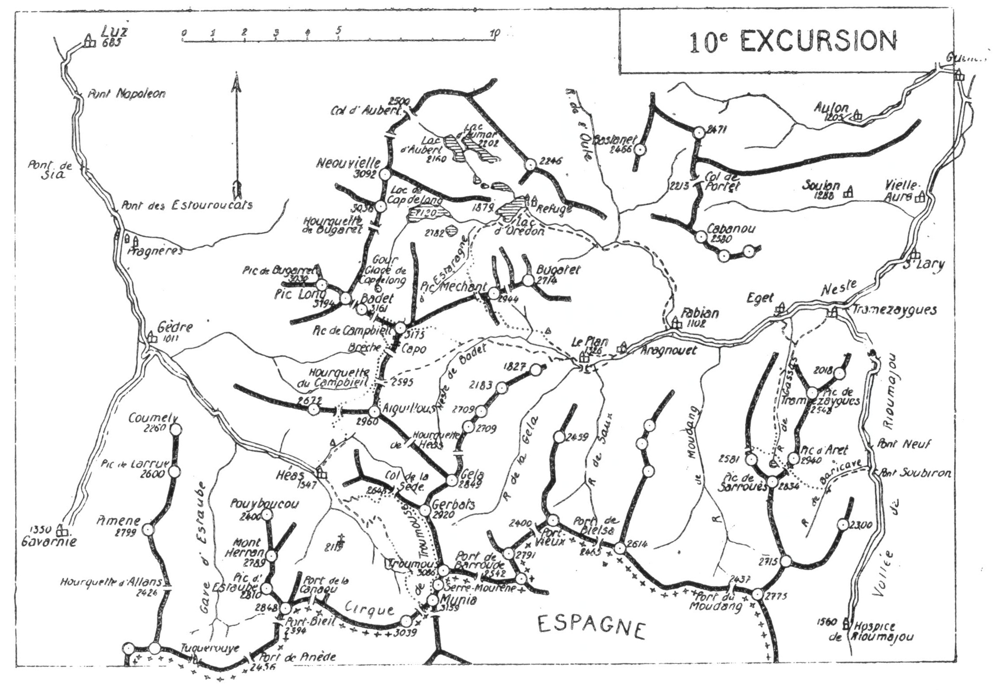

<style>.centre {text-align: center}</style>
<style>.droite {text-align: right}</style>

[//]: # (— p. 133 —)

# DIXIÈME EXCURSION

(N° 9 de la 1re édition)

__Cinq jours au départ de Luz__<br>
__B. E. — Du 15 Juillet à fin Août.__

Cartes à emporter : Luz et Gavarnie réunies.

__De LUZ à SAINT-LARY,__<br>
__par Gèdre; le Cirque de Troumouse, le Pic de Troumouse,__<br>
__la Munia, le Pic des Aiguillous, le Pic de Campbieil,__<br>
__le Pic Méchant, le Lac d'Orédon et le Pic d'Aret.__

<u>__AVIS AUX TOURISTES__</u>

On emportera des conserves pour quatre grands repas et on
retiendra un guide à l'avance pour quatre jours, en lui donnant
rendez-vous à Gèdre, vers 13 ou 14 h.

<p class="droite">(Voir ci-contre la Carte de l'Excursion).</p>

<div class="page"/>

— p. 134 — (10me EXCURSION)

****



<div class="page"/>

— p. 135 — (10me EXCURSION) LUZ-GEDRE 136

****

## PREMIÈRE JOURNÉE

__De LUZ (685m)à HÉAS(1.547m), par Saint-Sauveur et Gèdre (1.011m)__

—— SANS GUIDE ——

__Conseils.__ — __Itin. recomm.__ — Si on n'a pas couché la veille à
Luz, on y arrivera par le premier train et on partira immédiatement 
pour aller déjeuner à Gèdre, à l'excellent Hôtel de la
Grotte. Le trajet à pied me parait préférable, parce qu'il servira
d'entrainement, et aussi parce qu'il permettra de mieux voir ce
qu'il y a d'intéressant sur la route : Saint-Sauveur, le Pont Napoléon,
etc., etc.

Dix k. séparent Gèdre de Héas, mais, au départ, on peut raccourcir 
de 1k. en prenant l'ancien chemin muletier. On quittera
Gèdre vers 14h.30, afin d'arriver à Héas à 17 h.

Si à l'hôtel Chapelle il n'y a plus de lits, on peut toujours coucher 
dans une grange, ou encore chez le guide Lavignolle.

__Horaire de la Journée :__

``` 
De Luz à Gèdre (12 k. de route)......... 2h.45 }   5h.15
De Gèdre à Héas (10 k. de route)........ 2h.30 } (Arrêts en sus)
```

## DEUXIÈME JOURNÉE:

__Ascensions du Pic de Troumouse (3.086m)__<br>
__et de la Munia (3.159m), par le Col de la Sède (2.618m)__<br>
__et Serre-Mourène.__

—— GUIDE INDISPENSABLE ——

__Conseils.__ — __Itin. recomm.__ — Pour donner à cette excursion son
maximum d'intérêt et pour voir le grand cirque dans toute sa
splendeur, il faut faire l'ascension de la Munia par le Col de la
Sède et les crêtes de Serre-Mourène. On en descendra par le Col
de la Munia et par la cheminée qui débarque dans le cirque.

On partira de très bonne heure et, 10 min. après, on quittera
le sentier de Touyères pour monter, à g., au Turon de Bédous

<div class="page"/>

— p. 136 — TROUMOUSE-MUNIA (10me EXCURSION)

****

et de là, à la cabane de Lieousaoubes. Tournant alors un peu à
dr., direction E.-N.-E., on gagnera de l'alt. à travers des gazonnés, 
afin d'aboutir à des pentes rapides de calcaire gris qui conduisent 
au Col de la Sède (2.648m). La vue est déjà très belle. On
domine, au N., le haut vallon des Aiguillous et on a, en face, le
beau pic de ce nom. Si on traversait par la dr. le haut de ce vallon, 
on atteindrait, dans une h. et sans difficultés, le pic de la
Géla (2.849m).

Du Col de la Sède, on suivra la crête E. pendant 10 min., puis
on descendra d'une trentaine de m. dans le versant du cirque,
afin de continuer sa marche par la face S.-O. du Gerbats. C'est là
qu'est le passage le plus délicat de la journée, car les érosions
récentes ont encore diminué les rares bonnes prises qui existaient.
Il n'y a pas cependant de danger, parce que le rocher est solide;
mais une grande prudence s'impose. Dans 1/4 d'h., on franchira
ce mauvais pas et, dans 5 min., on rejoindra la crête, immédiatement 
après le pic de Gerbats. On continuera à toute crête jusqu'au
pic de Troumouse (3.086m) dont on fera l'ascension au passage.

Après le pic de Troumouse, le pic de Serre-Mourène ne présente 
guère d'intérêt; on le contournera donc à son choix par le
versant de Troumouse ou par celui de Barrosa, pour aboutir au
grand col qui le sépare de la Munia. Dans une remontée de
1/4 d'h., on atteindra le petit pic de la Munia (3.150m) et, quelques 
min. après, au delà d'une petite brèche, le sommet principal
(3.159m) (1).

Je ne connais rien dans les Pyrénées qui puisse être comparé
au trajet du Col de la Sède à la cime de la Munia. Du Gerbats au
Pic de Troumouse, on chemine sur le faîte de formidables remparts 
de 5 à 600 m. de haut sur une longueur de 2 k. A dr., une
succession de couloirs et de contreforts, d'une hauteur moyenne
de 1.000 m., plongeant à pic dans le cirque. A g., une partie des
terrifiantes murailles est en surplomb et une autre baigne dans les
lacs de Barroude. Vus du haut de la crête, le cirque sauvage de
Barroude, ses lacs cristallins à demi-glacés et la haute vallée de la
Géla sont on ne peut plus impressionnants.

Au pic de Troumouse, le regard franchit le port de Barroude

———<br>
(1) Dans la minute au 1/40.000, les deux pointes de la Munia sont
cotées 3.150 et 3.159. Il faut donc hausser de 9 m. la cote des cartes
actuelles.

<div class="page"/>

— p. 137 — (10me EXCURSION) CIRQUE de TROUMOUSE-HEAS

****

et plonge dans les profondeurs du cirque de Barrosa dont on
aperçoit les gradins qui s'étagent jusqu'au pic de Las Louséras
(3.007m).

Par une journée claire, le spectacle de la Munia est grandiose
et plein d'harmonie, car le Cirque de Troumouse est le plus 
caractéristique de tous les cirques pyrénéens. Il est plus régulier,
plus vaste et plus fermé que celui de Gavarnie. Dans nul autre, on
ne trouve une pareille pureté de formes.

Bien que la crête qui descend au S.-O. vers le Col de la Munia
(2.800m) soit très déchiquetée, elle ne présente pas de difficulté,
pas plus, d'ailleurs, que la fameuse cheminée de descente au cirque. 
On la suivra, tantôt sur le flanc N. et tantôt sur le flanc S.,
puis, quelques min. avant d'arriver au Col, on la quittera pour
prendre, à dr., la direction N. Après une pente d'éboulis, on rejoindra 
le glacier qui vient du Col et, par une longue glissade, on
arrivera, dans quelques min., au-dessus de la cheminée de descente. 
On franchira alors, par la g., une muraille de 3 ou 4 m. de
hauteur, afin de débarquer dans le couloir qui aboutit, à dr.,
directement au Cirque. A partir de là, on continuera par sa rive
E., en suivant des sentes de moutons jusqu'à Touyères où l'on
rejoindra le grand sentier qui conduit à Héas.

__Horaire de la Journée :__

``` 
De Héas à la Munia..................... 6h. » }    9h. »
De la Munia à Héas, par le col......... 3h. » } (Arrêts en sus).
```
> Nota. - L'ascension directe par le col se fait en 4 h. environ:

## TROISIÈME JOURNÉE

__De HÉAS (1.547m) au PLAN d'ARAGNOUET (1.326m),__<br>
__par le Pic des Aiguillous (2.960m),__<br>
__la Hourquette de Campbieil (2.595m) et le Pic de Campbieil (3.175m)__

—— GUIDE INDISPENSABLE ——

__Conseils.__ — __Itin. recomm.__ — On partira de très bonne heure et
on prendra, direction N.-E. le sentier qui, par la rive g. du torrent 
d'Aguila, monte à la Hourquette de Héas. Environ 1 h. après,
lorsqu'on aura atteint le premier plateau, on quittera le sentier

<div class="page"/>

— p. 138 — PIC des AIGUILLOUS (10me EXCURSION)

****

pour tourner à g. et franchir le torrent. Prenant alors la direction 
N., on zigzaguera les pentes gazonnées de Terre-Arrouye,
pour rejoindre la crête O. des Aiguillous, vers 2.600 d'alt., dans
la dépression située à l'E. du Soum de la Hourquette (2.672m).
Passant sur l'autre versant, celui du Campbieil, on tournera immédiatement 
à dr., au N.-E., pour marcher horizontalement à
flanc de montagne, en côtoyant par la base une masse rocheuse
et un névé, afin d'aboutir directement à la Hourquette de Campbieil 
(2.595m). On sera là sur la ligne de partage des eaux des
gaves et des Nestes, entre le bassin de l'Adour et celui de la Garonne.

De la Hourquette de Campbieil, l'œil enfile, à l'E., deux autres
cols : la Hourquette de Chermentas et le Port Vieux (2.400m).

Après avoir déposé le sac, on fera au S., à toute crête, l'ascension 
du Pic des Aiguillous (2.960m) qu'on nomme aussi Som de
Salettes. Son belvédère est de premier ordre, et c'est aux Aiguillous 
qu'il faut monter pour apprécier l'importance du Cirque de
Troumouse.

Contrairement à ce qui est indiqué par le _Joanne_, la crête qui
va de la Hourquette de Héas au Pic des Aiguillous n'est pas praticable, 
parce qu'elle est coupée d'une cassure verticale d'environ 
150 à 200 m. de hauteur. La crête O. est aussi entaillée d'une
profonde brèche qui me paraît très délicate. Un bon rochassier
pourrait monter par les murailles S., mais, d'où que l'on vienne,
on a intérêt à faire l'ascension des Aiguillous par la Hourquette
de Campbieil. Par cette voie, on ferait monter un mulet jusqu'à
10 min. du sommet.

On redescendra à la Hourquette de Campbieil par la même
voie, et on aura soin d'examiner, en face, la crête de Lentilla,
par laquelle on fera l'ascension directe du pic de Campbieil. A
l'O. de la Hourquette, à 5 min. en contre-bas, une petite source
coule d'ordinaire sur une dalle lisse. Si elle est tarie, on trouvera
plus bas la grande source de Lentilla.

Pour l'ascension du Campbieil, on montera au N., en suivant
la crête de Lentilla qui, malgré son air rébarbatif, n'offre aucune
difficulté sérieuse à la montée. On l'attaquera par le flanc O. jusqu'à 
la « Brèche Capo » qui est la première entaille profonde de
cette arête. A partir de là, on découvrira sa route à mesure, tantôt 
à flanc, tantôt à toute crête, jusqu'au pic S. de Campbieil

<div class="page"/>

— p. 139 — (10me EXCURSION) PIC de CAMPBIEIL

****

(3.165m). A environ 500 m. au N., on apercevra la tourelle du pic
principal (3.175m), et 10 min. suffisent pour y arriver à toute
crête.

La vue du Pic de Campbieil est analogue à celle des Aiguillous
en ce qui concerne les lointains et son panorama est magnifique.
Tout près, au N.-O., parait, très élancée, la pointe noire du Pic
Long sur laquelle une prochaine excursion nous fera monter
(V. 11° E., p. 151). Mais l'œil est surtout attiré vers le N.-E. par
la crête diabolique qui file vers le Pic Méchant et les formidables
murailles qui en descendent. Plus près, à l'E. et presque sous ses
pieds, on aperçoit les profondeurs de la vallée du Badet, le ruban
bleu de sa Neste et les maisons du Plan.

Le Pic de Campbieil, aux à-pic formidables sur ses faces S.-E.
et N., est peut-être le seul sommet de plus de 3.100 m. où l'on
puisse faire monter un mulet. En effet, d'Orédon, il est possible
d'en faire l'ascension avec une monture jusqu'à la tourelle, par
la face O.

On peut descendre directement à l'E., vers le fond de la vallée
de Badet. Cette voie, qui est plus intéressante et qui fait gagner
plus d'une h., ne doit être adoptée que par un temps clair. Plus
impressionnante que délicate, elle ne présente aucune difficulté
sérieuse, mais avec du brouillard, on risquerait de se fourvoyer
sur des à-pic.

Descendant immédiatement à l'E. de la tourelle, on se dirigera
vers des pâturages rapides, qu'on appelle « Bassias » dans le
pays et qu'on aperçoit du pic. Obliquant ensuite un peu à g., on
trouvera les traces du sentier fréquenté par les moutons qui viennent 
paître à ces « Bassias » ; on les suivra, afin d'aboutir au haut
d'un couloir d'éboulis qu'on traverse d'abord, et par lequel il faut
descendre en le rejoignant par la rive g. On débarquera bientôt
sur les pelouses, en amont de la cabane du Badet.

Si le temps ne permet pas d'adopter cette voie, on descendra
à l'O., vers la Hourquette du Badet; mais 300 m. avant d'y arriver,
on tournera carrément à g., au S., et par une marche de flanc,
en longeant la base des murailles, on rejoindra la Hourquette
de Campbieil. A partir de là, un sentier régulier descend par la
rive g. de la vallée jusqu'à la cabane du Badet. Quelques min.
en aval de la cabane, on trouve deux rochers assez rapprochés
pour permettre de sauter le torrent et de passer rive dr. Le sen-

<div class="page"/>

— p. 140 — PLAN D'ARAGNOUET (10me. EXCURSION)

****

tier remonte pendant 1/4 d'h. à travers des gazons, puis repart
en pente douce par la rive dr., à une certaine hauteur. On a constamment 
sous ses yeux les maisons du Plan. Enfin, après avoir
fait un long crochet à dr., on franchit la Neste du Badet sur un
petit pont et, 1/4 d'h. après, on arrive au Flan d'Aragnouet
(1.326m).

On trouve au Plan, chez le guide Péclose, des provisions et des
lits.

__Horaire de la Journée :__

``` 
De Héas à la Hourquette de Campbieil....... 3h.45 }
De la Hourquette au Pic des Aiguillous et         }
  retour...............................     1h.30 }    10h.15
De la Hourquette au Pic de Campbieil....... 2h.15 } (Arrêts en sus)
Du Pic de Campbieil au Plan, voie directe.. 2h.45 }
```

> Nota. - Si on repasse à la Hourquette de Campbieil, 1 h. en
sus.

## QUATRIÈME JOURNÉE

__Du PLAN d'ARAGNOUET (1.326m) à FABIAN (1.100m),__<br>
__par le Pic Méchant (2.944m) et le Lac d'Orédon (1.879m).__

—— GUIDE INDISPENSABLE ——

> Nota. - Voici un pic au nom rébarbatif qui n'a reçu qu'une
douzaine de visites. Serait-ce à cause de son appellation ? Il
n'est cependant un peu « Méchant » que par la face S., celle du
Badet, alors qu'il est très débonnaire sur le versant d'Orédon.
>
>Tous les touristes, sauf un (1), sont montés par la face N. en
venant d'Orédon; celui qui l'a gravi par le S. n'ayant laissé
aucune relation de son ascension, il me paraît utile d'en décrire
le terrain et l'itinéraire que j'ai suivi le 14 juillet 1916.
>
>Le Pic Méchant est flanqué de deux brèches profondes, une à
l'E. et l'autre à l'O. De chacune de ces brèches, descend un
couloir vertigineux jusqu'au fond de la vallée. Entre ces deux 

———<br>
(1) Le guide Péclose, dont la maison et les propriétés sont au pied
des murailles S. du Pic Méchant, m'affirme qu'un seul touriste y est
monté par la face du Badet, le 19 août 1905. C'est le lieutenant Dollfus,
du 4me colonial. J'ai, en effet, trouvé sa carte au sommet, dans une
boîte à sardines.

<div class="page"/>

— p. 141 — (10me EXCURSION) PIC MECHANT

****

>couloirs, exactement au S. du pic, existe un puissant contrefort
dont la partie supérieure forme une crête qui va mourir en
pente douce au pied de la brèche O. C'est par la rive dr. du
couloir E. et la crête supérieure du contrefort qu'il faut faire
l'ascension.
>
>Ce qui fait l'intérêt et la beauté de l'excursion, en montant
par la face du Badet pour descendre ensuite à Orédon, c'est non
seulement le charme des émotions qu'elle procure, mais surtout
l'impression ressentie au sommet lorsque le rideau se lève sur
un paysage nouveau. Au Pic Méchant, cette impression est des
plus fortes, quand on découvre la plus belle région lacustre des
Pyrénées. C'est bien par en haut qu'il faut arriver là la première
fois, si on veut se ménager la plus agréable des surprises.

__Conseils.__ — __Itin. recomm.__ — Partant de chez Péclose, on suivra,
pendant 1/4 d'h., le chemin de la Hourquette de Campbieil
qu'on quittera à 100 m. du pont pour prendre, à dr., un petit sentier 
qui, par la rive g..de la Neste, monte vers une grange isolée.
Après la grange, on traversera les éboulis du couloir E. et on
franchira le torrent, afin de monter sur un tertre gazonné de la
rive dr., où on trouvera un sentier de brebis à peine tracé. Gagnant 
de l'alt. direction O., on ira faire un long lacet à g., puis,
tournant brusquement à dr., au N., on s'élèvera vers un ressaut
rocheux à partir duquel on se rapproche du torrent qu'on domine 
à une grande hauteur. On pénètre alors dans une gorge
rapide. Le terrain se redresse; on coupe plusieurs petits couloirs
et il faut souvent zigzaguer les pentes pour pouvoir avancer. Se
tenant constamment à une grande hauteur du torrent, on longera
à sa g. les escarpements E. du contrefort, afin d'aboutir à sa crête
d'où on domine les deux couloirs. Là, on aborde la partie supérieure 
la plus délicate. Montant d'abord à flanc O. de crête, on
gagnera bientôt l'arête elle-même, pour continuer à toute crête
jusqu'à la brèche O., où on déposera le sac et le piolet. De la brèche,
on attaquera la paroi de dr. en montant en diagonale, pour
rejoindre une vire qui file vers l'E. jusqu'au pied d'une muraille
qui parait verticale. C'est là qu'on trouve le passage le plus délicat 
de l'ascension; mais c'est aussi par là qu'est le chemin direct
du pic. La muraille, haute de 5 ou 6 m., est presque verticale,
mais le rocher est bon et les prises nombreuses. Pour un pyrénéiste 
exercé, cela n'exige que quelques minutes d'attention. Du
haut de la muraille, un couloir facile conduit au sommet dans

<div class="page"/>

— p. 142 — LAC d'OREDON (10me EXCURSION)

****

1/4 d'h. Si cette voie paraît scabreuse, on n'aura qu'à redescendre
de quelques m. à dr. pour contourner un petit éperon rocheux.
On trouvera derrière une large et facile cheminée qui monte
directement au sommet en rejoignant au passage l'itinéraire précédent, 
en haut de la délicate muraille. Par là, on allonge de
quelques imin., mais c'est plus facile (1).

Revenu à la brèche par l'un des deux chemins d'ascension, on
verra sous ses pieds, au N., un rapide et long couloir qui plonge
vers le fond de la vallée, jusqu'au ruisseau d'Estaragne; c'est par
là qu'on descendra sans fatigue et en toute sécurité.

La partie supérieure du couloir est garnie de menus éboulis
qui aident à la descente, car tout bon pyrénéiste sait cela : les
bons éboulis, dans une pente à 45°, sont des chemins qui marchent. 
Aux éboulis, succède un bon névé qu'on franchira par une
longue glissade. On n'aura plus qu'à faire un crochet à dr., pour
aboutir à un petit couloir facile qui, dans 10 min., mène aux pelouses 
du bord du ruisseau. Un bon sentier, qui longe la rive dr.,
descend directement jusqu'à la Prade d'Orédon où on rejoint le
chemin de chars qui conduit au fond du lac par la rive S. (2).

On visitera en passant le magnifique et confortable Chalet-
Hôtel d'Orédon qui, par sa situation privilégiée, est appelé à rendre 
les plus grands services au pyrénéisme (V. 11° E., p. 151).

Une pittoresque route de 9 k., non ouverte aux voitures, descend 
toute l'intéressante vallée de Couplan jusqu'au pont de
Fabian (1.100m), où elle rejoint la grand'route.

En sus des curiosités naturelles, gouffres, gorges, cascades, etc.,
etc., on remarquera dans ce trajet les formidables travaux exécutés 
pour créer le lac artificiel de l'Oule, dont les réserves de
houille blanche doivent fournir la force nécessaire pour faire
marcher une partie des trains de la Compagnie du Midi. On passera 
d'ailleurs, le lendemain, devant l'usine qui, près d'Eget,
réglemente et distribue cette force. Au pont de Fabian, on verra le
travail gigantesque accompli par l'eau pour se frayer un passage

———<br>
(1). Dans le petit cairn du sommet, j'ai déposé une boîte en fer contenant 
un carnet dans lequel j'ai soigneusement recueilli les cartes de
visite de mes courageux devanciers.<br>
(2) Si on ne garde pas le guide pour le 5me jour, c'est de ce point
qu'il faut le renvoyer pour qu'il puisse rentrer à Gèdre le soir même.

Si on le garde le 5me jour, on aura à lui payer une journée supplémentaire
 de rapatriement.

<div class="page"/>

— p. 143 — (10me EXCURSION) FABIAN

****

vers la plaine, à travers le roc vif. Quelques min. en aval du pont,
on passera devant le bureau de poste de Fabian et, immédiatement 
après, on arrivera à l'hôtel Fouga, où on trouvera des provisions 
et de bons lits (1).

__Horaire de la Journée :__

``` 
Du Plan d'Aragnouet au Pic Méchant.... 5h. »  }    9h.»
Du Pic Méchant au Lac d'Orédon........ 2h.15  } (Arrêts en sus)
Du Lac d'Orédon à Fabian.............. 1h.45  }
```

## CINQUIÈME JOURNÉE

__De FABIAN (1.100m) à SAINT-LARY (825m),__<br>
__par le Lac de Sarrouès (2.500m) et le Pic d'Aret (2.940m).__

—— GUIDE UTILE ——

> Nota. - L'ascension de l'Aret nous mène au principal belvédère 
de l'une des plus belles vallées pyrénéennes : « la
Vallée d'Aure ». Elle inspira à Russell les lignes suivantes :
>
>« Où trouverait-on, en Suisse, des teintes si chaudes, tant de
lumière et de couleurs, de tels contrastes entre le soleil, la
neige, les fleurs et la verdure ? » (2).
>
>J'ajoute qu'aucune autre vallée ne possède de pareilles richesses 
dans les parties habitées, ni une telle profusion de beaux
sites dans les hauteurs environnantes qui trônent sur elle.
>
>C'est par le Pic d'Aret qu'il faut commencer les ascensions en
haute vallée d'Aure, et c'est la raison pour laquelle j'y conduis
directement le touriste dès avoir visité la région de Gavarnie.

__Conseils.__ — __Itin. recomm.__ — On suivra la route de Saint-Lary
pendant 3 k. et, à environ 100 m. en aval du pont d'Aragnouet (3),
en face de la cascade d'Eget, on prendra, à dr., un sentier qui
monte dans la forêt de Bert. En de multiples lacets, par la rive

———<br>
(1) Hameau d'Aragnouet, desservi par un autobus partant d'Arreau
(23 k.) à l'arrivée du premier train du matin, et repartant de Fabian
vers 16 h.<br>
(2) Souvenirs d'un Montagnard, 2 édition, p. 236.<br>
(3) Pont de la Hosse de la carte d'Etat-Major. Situé à 976 m. d'alt., ce
pont sépare la commune de Tramezaygues de celle d'Aragnouet.

<div class="page"/>

— p. 144 — LAC de SARROUES - PIC D'ARET  (10me EXCURSION)

****

g. du torrent de Lassas, ce sentier gagne le haut de la forêt en
contournant l'éperon N. du Pic des Aiguilles (1.883m).

Après environ 1/2 h. d'ascension par un sentier taillé en escalier,
on passera momentanément rive dr., où on rejoindra le chemin 
qui vient de Tramezaygues. Quelques min. en amont de la
forêt, on franchira le torrent pour prendre un nouveau sentier
qui monte directement au Lac de Sarrouès par la rive g. du vallon 
de Lassas.

C'est ici que je me sépare de l'itinéraire du _Joanne_. Celui que
j'indique est plus facile, moins fatigant et plus intéressant, puisqu'il 
fait passer près du joli lac de Sarrouès et qu'il permet de
jeter un coup d'œil sur l'impressionnante vallée du Moudang. De
plus, par cette voie, on trouve l'eau jusqu'à 2.600 d'alt.

Le sentier qui longe la rive g. du ruisseau de Lassas est très
bien tracé jusqu'au-dessus d'un ressaut, vers 2.300. Il meurt dans
un petit cirque de pierrailles, mais, à partir de là. on peut passer
partout; il suffit de monter droit au S., pour atteindre, 1/2 h.
après, le joli lac de Sarrouëès (2.500m environ).

Le petit lac de Sarrouès est enchâssé dans le roc, au haut de
la vallée de Lassas et au pied d'un large col. En juillet, il est plein
de coquetterie avec sa collerette de glace. Par sa situation au N.
du Pic de Sarrouès (2.834m) qui le protège contre les vents chauds
du S., il reste souvent glacé jusqu'à la fin du mois.

A l'O. du lac, sur la crête de Sarrouès, on apercevra une petite
brèche d'où on a une vue plongeant à plus de 1.000 m. dans les
profondeurs de la vallée du Moudang. On y montera sans sac
dans quelques min., et on reviendra au lac. Du Lac de Sarrouès,
on montera, à l'E., par le creux d'un petit vallon qui conduit au
Col de Hountanet (2.700m environ), col qui fait communiquer le
vallon de Lassas avec la vallée de Baricave.

L'Aret est situé au N. du col, et l'ascension en est très facile.
Un semblant de sentier suit le flanc O. de la crête jusqu'à 10 min.
du sommet où il faut passer versant E., pour arriver à la tourelle.

Situé dans l'axe de la vallée principale au'il domine en entier,
l'Aret est l'observatoire rêvé pour reconnaître tous les détails de
cette admirable région qu'est la Vallée d'Aure. Vallons rampant
vers les crêtes entre les arêtes sinueuses; lacs étincelants d'où
s'échappent les Nestes en serpentant vers la plaine; cimes sourcilleuses 
et glaciers immaculés, tout est sous les yeux, du Pic

<div class="page"/>

— p. 145 — (10me ECCURSION) VALLEE de RIOUMAJOU 

****

Long au Perdighero. On aperçoit presque tous les vill. de la vallée, 
jusqu'à Arreau, et la vue s'étend jusqu'à la plaine de Lannemezan.

Du pic d'Aret, on repèrera toute la voie d'ascension prochaine
au pic de Lustou et toute la partie supérieure de celle du Batoua.

Dans 3h.30, on pourrait descendre à Saint-Lary par les pentes 
N.-O., le vallon de Lassas et le vill. de Tramezaygues; mais,
pour donner à l'excursion son maximum d'intérêt, on descendra
par la vallée de Rioumajou, avec l'itinéraire suivant.

On reviendra au Col de Hountanet par où l'on passera sur le
versant E., versant de Baricave. Après une descente de 1/4 d'h.
environ, on apercevra, sur la dr., un couloir d'éboulis qui vient
de la face E. du pic de Sarrouès (2.834m); on rejoindra ce couloir
en faisant un crochet à dr. C'est là qu'est le seul passage un peu
délicat.

Le couloir rejoint, on le suivra jusqu'au fond et, dès qu'on sera
parvenu au ruisseau de Baricave, on le sautera pour passer rive
dr. et entrer dans la forêt. On trouvera bientôt un bon chemin
muletier qui, par la rive dr., va rejoindre la route de l'hospice
de Rioumajou, près du Pont Soubiron, 6 k. en amont de Tramezaygues.

En aval du Pont Soubiron, la vallée se rétrécit et le ruisseau de
Rioumajou creuse plus profondément son passage. Bientôt les
arbres des deux rives projettent leurs ombres épaisses sur la
route, rendant ce trajet plein de mystère. Sur une fin d'excursion,
rien n'est plus reposant et, après avoir franchi les trois ponts :
Neuf, Debat et Tisné, on arrive en vue de Tramezaygues comme
par enchantement.

On ne descendra pas jusqu'au vill., mais on entrera, à dr., dans
une prairie, pour suivre un petit sentier qui la traverse et qui va
rejoindre la grand'route, à 125 m. du pont du Rioumajou. On
n'aura plus que 3 k. à faire pour arriver à Saint-Lary (1).

__Horaire de la Journée :__

```
De Fabian au Pic d'Aret................... 6h. » }    10h.30
Du Pic d'Aret à Saint-Lary, par Baricave.. 4h.30 }  (Arrêts en sus)
```

———<br>
(1) Saint-Lary (Hautes-Pyrénées), à 12 k. de la gare d'Arreau, est
desservi deux fois par jour par un courrier automobile, en attendant
la construction d'un tramway électrique.

<div class="page"/>

— p. 146 — SAINT-LARY (10me EXCURSION)

****

<u>__POINTS D'INTERRUPTION__</u>

- __HEAS__ 
  - Pour rejoindre de Gèdre : 2h.30
  - Pour rentrer à Gèdre : 2h. »
- __HOURQUETTE DE CAMPBIEIL__
  - Pour rentrer à Gèdre : 2h.45
  - Pour rejoindre de Gëdre : 4h.15
- __PLAN D'ARAGNOUET__
  - Pour rejoindre de Saint-Lary : 3h.30
  - Pour rentrer à Saint-Lary : 3h. »
- __FABIAN__
  - Pour rejoindre de Saint-Lary : 2h. »
  - Pour rentrer à Saint-Lary : 1h.40
