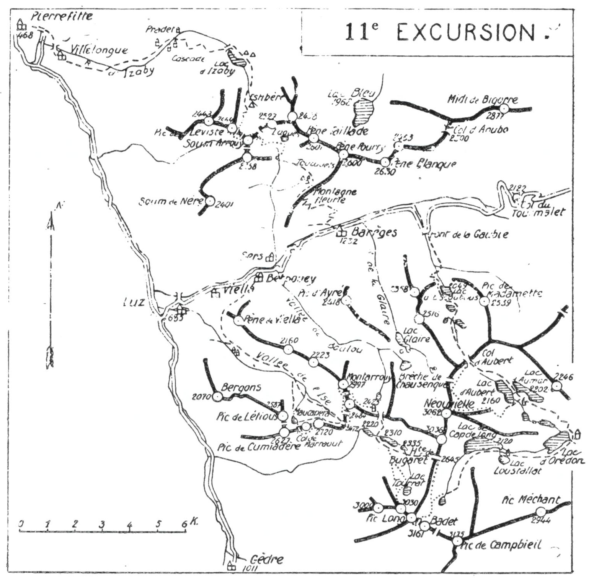

<style>.centre {text-align: center}</style>
<style>.droite {text-align: right}</style>

[//]: # (— p. 147 —)

# ONZIÈME EXCURSION

(N° 10 de la 1re édition)

__Cinq jours aux environs de Barèges__

_B. E. — Du 15 Juillet à fin Août._

Cartes à emporter : Luz et Gavarnie réunies.

__1re De BARÈGES à BARÈGES,__<br>
__par les Lacs d'Escoubous, le Nèouvielle, les Lacs d'Aubert,__<br>
__d'Aumar, d'Orédon et de Cap-de-Long,__<br>
__le Pic Long, le Pic de Bugaret, le Montarrouy et le Maucapera.__

__2me De BARÈGES à PIERREFITTE,__<br>
__par le Soum Arrouy, le Pic Léviste et le Lac d'Izaby.__

<u>__AVIS AUX TOURISTES__</u>

On prendra un guide au moins pour les trois premiers jours.
On emportera des conserves pour six repas et du pain et du vin
pour un jour. On trouvera des provisions au Chalet-Hôtel
d'Orédon.
 
<p class="droite">(Voir ci-contre la Carte de l'Excursion).</p>

****
****
<u>__Concernant le PIC de MIDI de BIGORRE__</u>

>L'ascension du Pic de Midi de Bigorre se fait très souvent de
Barèges, mais, comme j'y conduis le touriste par une autre voie,
on en trouvera le programme à la 13me Excursion. Cependant,
si on veut en faire l'ascension de Barèges, voici comment je la
conseille. On partira vers 14h. par la route du Tourmalet qu'on
quittera au Pont de Tournaboup pour passer sur la rive dr. du
Bastan. A partir de là, un bon chemin muletier monte directement 
à l'hôtellerie du Col de Sencours (2.378m) où on couchera.
Le lendemain matin, on partira à la lanterne, à 3 h., afin d'ar-

<div class="page"/>

— p. 148 — ENVIRONS de BAREGES (11me EXCURSION)
****



> river au sommet pour le lever du soleil. On visitera l'observatoire 
et on redescendra à l'hôtellerie pour le petit déjeuner. En
repartant immédiatement après, on rentrera à Barèges vers
11 h. — L'Excursion peut être faite sans guide.

__Horaire probable :__

```
De Barèges à J'Hôtellerié. eee... 3h.15 }    8h.30
De l'Hôtellerie au Pic........... 1h.45 } (Arrêts en sus)
Du Pic à Barèges................. 0h.30 }
```

> Nota. - On peut aussi faire l'excursion dans la même journée 
en partant de très bonne heure; mais, dans ce dernier cas,
on ne jouit pas d'un aussi joli point de vue.

<div class="page"/>

— p. 149 — (11me EXCURSION) COL D'AUBERT — NEOUVIELLE
****

## PREMIÈRE JOURNÉE

__De BARÈGES (1.232m), au LAC d'ORÉDON (1.879m),__<br>
__par les Lacs d'Escoubous, le Col d'Aubert (2.500m),__<br>
__le Nèouvielle (3.092m),__<br>
__le Lac d'Aubert (2.160m), et le Lac d'Aumar (2.202m).__
 

—— GUIDE INDISPENSABLE ——

__Conseils.__ — __Itin. recomm.__ — On partira par la route du Tourmalet 
qu'on quittera après le pont de la Gaubie, au grand lacet
de dr. Là, on prendra, au S., le sentier qui monte au Lac d'Escoubous 
(2.049m) en laissant à g. la vallée d'Aygue-Cluse. Longeant 
le lac par la rive O., on montera au Col d'Aubert (2.500m),
en laissant aussi à g. le lac de Tracens et le Lac Négré.

Au Col d'Aubert, le rideau se lève sur un paysage magnifique.
On se croirait en Suisse, en plein Oberland, avec en plus l'éclatante 
lumière pyrénéenne. L'impression de beauté de cette région 
lacustre est peut-être plus forte du Col d'Aubert, au N., que
du Pic Méchant, au S.; c'est aussi par en haut qu'il faut y arriver, 
si on vient du N. A ses pieds scintillent les lacs d'Aumar,
d'Aubert et les Laquettes. Là-bas, dans le fond, les noirs sapins
qui entourent le Lac d'Orédon donnent à ce dernier une teinte
vert sombre d'un effet saisissant.

Au Col d'Aubert, on quittera le sentier qui descend, à g., vers
le Lac d'Aumar et on obliquera à dr., au (S.-O., à travers la
rocaille, afin d'aborder le grand glacier du Nèouvielle au pied
de la Brèche de Chausenque. On traversera le glacier en diagonale, 
en remontant vers la base d'un petit couloir où on pourra
laisser le sac. On suivra ce couloir qui grimpe jusqu'au sommet 
du Néouvielle (3.092m).

Le Néouvielle, d'ascension facile, est un belvédère de tout
premier ordre. Ce qui le caractérise et le rend visible de très
loin, c'est, non seulement sa haute alt. mais surtout la grande
face glaciaire qu'il étale au N.-E., comme le Balaïtous et les Monts-
Maudits. On le distingue de plusieurs sommets secondaires du
Saint-Gironnais, à cause de l'arête rocheuse qui partage son
glacier en deux, comme l'arête du Portillon, celui des Monts-

<div class="page"/>

— p. 150 —  LAC D'OREDON (11me EXCURSION)
****

Maudits. Le Pic de Midi de Bigorre, dont on aperçoit tous les
détails de l'observatoire, est à deux pas. Au S., la pointe noire
du Pic Long, qu'on ascendra le lendemain, est à une portée de
fusil.

Après avoir repris le sac au bas du couloir rapide, on fera
une longue glissade jusqu'au fond du glacier; là, on tournera
à dr., à l'E. afin de longer par sa base le glacier oriental. On
traversera un ravin de gros éboulis pour aboutir sur un mamelon
qui domine le Lac d'Aubert. On contournera ce mamelon
par la dr., et on descendra directement jusqu'à la digue du lac
qu'on franchira. A partir de là, on trouvera un grand chemin
qui, après avoir longé le fond du Lac d'Aumar par la dr., descend 
directement au Lac d'Orédon où on couchera.

Un beau chalet-hôtel a été construit à Orédon, un peu au-
dessus de la maison des ingénieurs, dans un site splendide. On
pourra s'y approvisionner de pain et de vin pour deux jours
et demi.

__Horaire de la Journée :__

```
De Barèges au Lac d'Escoubous.......... 2h.45 }
Du Lac d'Escoubous au Col d'Aubert..... 1h.30 }   9h.30
Du Col d'Aubert au Nèouvielle.......... 2h.30 } (Arrêts en sus)
Du Néouvielle au Lac d'Orédon.......... 2h.45 }
```

## DEUXIÈME JOURNÉE

__Du LAC d'ORÉDON (1.879m) au REFUGE du RABIET (2.524m),__<br>
__par le Lac de Cap-de-Long (2.120m),__<br>
__le Pic Long (3.194m) et la Hourquette de Bugaret (2.645m).__

—— GUIDE INDISPENSABLE ——

__Conseils.__ — __Itin. recomm.__ — On partira dès qu'on pourra se
conduire, car il faut arriver à la cime du Pic Long vers 10h.
au plus tard, pour jouir plus sûrement du joli point de vue.

On prendra le chemin de chars qui, par la rive dr. du Lac
d'Orédon, monte au Lac de Cap-de-Long (2.120m). Après la maison

<div class="page"/>

— p. 151 — (11me EXCURSION) LAC de CAP-De-LONG
****

du garde, on trouvera un sentier qui longe la rive S. du lac, à
une certaine hauteur, à travers la rocaille et les rhododendrons.
C'est 1 h. de mauvais chemin à passer. En amont du Lac de
Cap-de-Long, on laissera à dr., à l'O., le sentier de la Hourquette
de Bugaret qu'on aperçoit en haut.

Tournant alors à g, on montera direction S., en suivant un
petit sentier qui grimpe les divers ressauts rocheux de la rive dr.
du torrent. On franchira bientôt ce dernier pour passer rive g.;
là, on attaquera des pentes rapides qu'il faut zigzaguer pour
aboutir au plateau supérieur, en vue de la Hourquette du Badet
qui forme un large col droit au S.

On aura, sur la g., la masse trapue du Campbieil dont l'ascension 
est très facile par cette face. Au S.-S.-O., le Pic Badet (1)
barre l'horizon et, à sa dr., au S.-O., le Pic Long s'élance majestueux 
vers le ciel. On sent que c'est lui qui est le roi de la
contrée.

Entre le Pic Badet (3.161m) et le Pic Long {3.194m), s'échancre
la brèche par laquelle il faut passer pour monter à ce dernier.
On se dirigera vers elle, en laissant à g. le petit Gourg glacé de
Cap-de-Long (2) et en contournant par leur base les contreforts
N. du Pic Badet.

On pourra déposer le sac dans le glacier du Pic Long, immédiatement 
au-dessous de la brèche située à la plus basse dépression 
de l'arête qui va du Badet au Pic Long. En tardive saison,
la rimaye est très ouverte et difficile à franchir. On peut éviter

———<br>
(1) Le nom donné à ce pic étonne les gens du pays, car ce sommet
est en entier sur le Campbieil, tandis que la montagne et la vallée du
Badet sont plus à l'E., de l'autre côté du pic de Campbieil et de la
crête de Lentilla. Les bergers et les chasseurs l'appellent Pic d'Estibère 
Male. Satellite très rapproché du Pic Long qui le domine et lui
masque une partie de la vue, le Badet est presque sans intérêt.<br>
Il est facilement faisable par la crête E., en partant de la Hourquette 
du Badet, ou encore par la coume rapide de la face N. qui
aboutit à la crête, entre le petit pic et le sommet 3161.<br>
(2) Certains auteurs appellent ce petit gourg « Lac du Badet »;
d'autres, « Lac d'Estaragne ». Comme il ne se déverse ni dans la
vallée du Badet, ni dans le vallon d'Estaragne dont il est séparé par
une longue crête, on ne s'explique aucune de ces appellations.

Certains chasseurs que j'ai interrogés, le nomment « Gourg glacé de
Cap-de-Long ». Cette appellation me paraît être la bonne, puisqu'il
s'écoule par la vallée de Cap-de-Long au grand lac de ce nom.

<div class="page"/>

— p. 152 — PIC LONG (11me EXCURSION)
****

ce mauvais passage en appuyant un peu à g., vers le Badet, où
on aborde plus facilement le rocher. C'est un détour de quelques 
min. vite rattrapées car, sur l'autre versant, une corniche
très facile longe la crête jusqu'à la base du Pic Long.

C'est à partir de ce point qu'on entre dans un terrain délicat,
car le sol s'effrite sous les pieds, alors que la pente s'accentue.
On montera lentement à flanc de crête d'abord, puis par la face
rapide du S.-O. et enfin, par une cheminée qui conduit directement 
au sommet.

Le Pic Long est le plus élevé des pics français, puisque le
Vignemale, le Marboré et le Perdighero sont sur la frontière et,
par conséquent, moitié espagnols. Son belvédère est l'un des
premiers, sinon le premier des Pyrénées. Son grand recul de la
chaîne principale fait que rien ne gêne sa vue et, par sa haute
alt., il domine tout ce qui l'entoure.

Dans nul autre sommet, on ne trouvera une vue mieux groupée, 
et son panorama s'étend des monts Aspois aux monts Ariégeois. 
Si les lointains sont splendides, ses abords immédiats
sont de toute beauté. Rien n'est plus impressionnant que ses
murailles à pic, surtout celle de la face N. qui tombe verticalement 
de 500 m. environ sur le Lac Tourrat.

Du haut du Pic Long, on peut repérer tout le trajet de l'après-
midi pour rejoindre le refuge du Rabiet dont on aperçoit distinctement 
la masse noire là-bas, au fond, direction .N. On pourra
aussi reconnaître la voie d'ascension du Pic de Bugaret qu'on
fera le lendemain et celle du Montarrouy pour le surlendemain.

A la descente, comme on ne fait pas face au rocher et que
les pentes sont très rapides, il faudra prendre plus de précautions 
qu'à la montée jusqu'à la brèche.

Après avoir repris le sac, on se dirigera au N., en suivant à
flanc E. la crête de Cap-de-Long jusqu'à la Hourquette de Bugaret 
(2.645m) où on passera, à l'O., sur le versant de Pragnères.
Après quelques min. de descente, on franchira le torrent du
Lac Tourrat pour suivre un sentier à peine tracé qui se dirige
à l'O., à une certaine hauteur. On laissera à dr., assez bas, les
lacs de Bugaret (2.335m) et de Coueyla-det-Mey (2.310m), puis,
parvenu en vue du lac de Rabiet (2.220m), on descendra rapidement 
vers lui. Bientôt, le sentier bifurque; celui de g. conduit
au Col de Pierrefitte qu'on aperçoit au N.-O.; celui de dr. monte

<div class="page"/>

— p. 153 — (11me EXCURSION): REFUGE du RABIET — LAC TOURRAT
****

au N., en laissant à g. le Lac de Rabiet et, en plusieurs lacets,
conduit directement au Col de ce nom. On suivra ce dernier
et on ira coucher au Refuge du Rabiet (2.524m) qu'on nomme
aussi refuge Packe, en souvenir du grand pyrénéiste qui l'a
fait construire.

__Horaire de la Journée :__

``` 
D'Orédon au haut du lac de Cap-de-Long. 2h. » }
Du Cap-de-Long au Pic Long............. 3h.30 }    9h. »
Du Pic Long au refuge du Rabiet........ 3h.30 } (Arrêts en sus)
```

> Nota. - Du Refuge du Rabiet, l'ascension du Pic Long est
faisable dans 8 h., aller et retour. Elle peut donc être reprise
de ce point au cas où, pour une cause quelconque, on l'aurait
manquée le premier jour.

## TROISIÈME JOURNÉE

Ascensions du Lac Tourrat (2.700m) et du Pic de Bugaret(3.030m)

—— GUIDE INDISPENSABLE ——

__Conseils.__ — __Itin. recomm.__ — On prendra dans son sac ce qui
est nécessaire pour la journée, et on laissera le reste au refuge.

On repartira par le chemin de la Hourquette de Bugaret qu'on
suivra jusqu'à environ 1/4 d'h. du torrent du Tourrat, au-dessus
et au S. du lac de Coueyla-det-Mey. Obliquant alors à dr., au
S.-E., on remontera les pentes rocheuses vers le Lac Tourrat au
bord duquel on arrivera facilement par la rive g. du torrent, à
une certaine hauteur.

C'est un petit lac merveilleux et je ne puis mieux le faire
connaître qu'en cédant la parole à un des Cadier qui en fait
une si vivante description :

« Le Lac Tourrat, carré de 200 à 250 m. de côté, est un
exemple, probablement unique aux Pyrénées, d'un lac important
où se déverse tout entier un glacier d'une seule venue. Très

<div class="page"/>

— p. 154 — PIC de BUGARET (11me EXCURSION)
****

incliné, très crevassé, ce dernier y tombe directement du Pic
Long. Sur l'eau moirée, ses débris éclatants errent à la dérive.

« L'attention est surtout captivée par les stries diversement
colorées que présente la paroi terminale du glacier, longue de
plus de 200 m., haute de 10 m., au-dessus du lac. Horizontales
au centre, elles se redressent vers les côtés jusqu'à dépasser la
verticale, laissant deviner l'effroyable pression que subit la glace
à l'étroit dans son lit de granit » (1).

Cette petite merveille, qui n'est qu'à 2 h. du refuge du Rabiet
et à 6 h. de Luz et de Barèges, est à peu près inconnue.

Du lac Tourrat, on montera au S.-S.-O., en suivant la large
croupe rocheuse qui sépare son glacier de celui de Crabounouse, 
afin d'aboutir à toute crête au Pic de Bugaret (3.030m).

Si le Pic Long est pointu, celui de Bugaret est formé d'un
assez long plateau où on peut circuler à son aise. Son belvédère, 
sans être de premier ordre, est des plus intéressants.
L'attrait de son ascension réside dans la beauté de ses abords
immédiats qui, tous, ne sont pas visibles du Pic Long.

On pourra rentrer au refuge à son choix, soit par la voie
d'ascension, soit en appuyant à g., avant d'arriver au Lac
Tourrat, afin d'aboutir directement au Lac de Rabiet où on
retrouvera le sentier.

__Horaire de la Journée :__

```
Du Refuge au Lac Tourrat.............. 2h. » }  6h.30
Du Lac Tourrat au Pic de Bugaret...... 1h.45 } (Arrêts en sus)
Du Pic de Bugaret au Refuge........... 2h.45 }
```

> Nota. - Si on ne garde pas le guide pour la 4me journée, on
le renverra du Rabiet, ce qui lui permettra de rentrer à Barèges 
le soir même.

———<br>
(1) Au Pays des Isards, tome II, p. 16.

<div class="page"/>

— p. 155 — (11me EXCURSION) PIC de MONTARROUY
****

## QUATRIÈME JOURNÉE

__Du REFUGE DU RABIET (2.524m) à BARÈGES (1.232m),__<br>
__par le Montarrouy (2.797m), __<br>
__le Maucapéra (2.720m) et la Vallée de l'Ise (1).__

—— GUIDE UTILE ——

> Nota. - L'ascension du Montarrouy est des plus faciles et,
quoi qu'on ait écrit sur le Maucapéra, ce dernier ne présente pas
de difficultés sérieuses, si on se contente d'y monter par la
voie la plus commode. Donc, un bon pyrénéiste peut y conduire,
non une caravane, mais quelques compagnons.

__Conseils.__ — __Itin. recomm.__ — Au N. du refuge, on trouve le
sentier qui, par la vallée du Bolou, descend à Betpouey; on le
suivra 10 min. environ. Tournant ensuite à g., à l'O., on montera 
vers un ravin de pierraille, au bout duquel on apercevra
un petit couloir rapide qui conduit au col situé au S. du sommet 
principal du Montarrouy. On y laissera le sac et on fera à
dr., à flanc de crête, l'ascension facile du Montarrouy (2.797m)
par les terrasses O.

On jouit sur le Montarrouy d'un joli point de vue sur les
massifs du Nèouvielle, du Pic Long et du Maucapéra qu'on
touche presque. Au N., la chaîne du Léviste au Pic de Midi fait
un effet splendide.

Revenu au col, on prendra, à l'O., le couloir rapide qui descend 
vers la vallée de l'Ise, et, avant d'arriver au fond, on le
quittera pour contourner à g., au S.-O., un contrefort facile,
afin d'aboutir horizontalement au Col supérieur de Pierrefitte
(2.484m). Un morne rocheux le sépare du Col inférieur (2.472m)
où passe le sentier qui monte de la vallée. Dans 10 min., on
franchira ce morne, partie à flanc E., partie à flanc O., jusqu'au
col (2.472m). On jouira là d'une belle vue sur les trois lacs de
Rabiet, de Coueyla-det-Mey, de Bugaret et sur la Hourquette

———<br>
(1) Je ne m'explique pas les variations de divers auteurs en ce qui
concerne le nom de cette vallée. Les uns la nomment « La Liza »,
d autres, « La Lise ». En parlant du ruisseau qui donne son nom à la
vallée, les gens du pays disent « Et Ise ». Donc, Ise étant masculin,
aucune des appellations ci-dessus ne doit être adoptée.

<div class="page"/>

— p. 156 — LAC et PIC de MAUCAPERA  (11me EXCURSION)
****

de ce nom. Au bout de la courbe formée, à g., par les escarpements 
S.-E. du Montarrouy, on apercevra à nouveau le refuge,
accroupi comme une bête fauve dans son col rocheux.

Quelques pyrénéistes très exercés, amateurs de fortes émotions,
ont fait l'ascension du Maucapéra par les crêtes, en partant du
Col de Pierrefitte. Cette voie est très délicate, très fatigante et
très longue. Quoique la déconseillant, je donne les grandes lignes
de cet itinéraire.

On montera au S.-O. et, 1/4 d'h. après, on obliquera un peu à dr.
afin d'aboutir à une première brèche située entre la première pointe
(2.608m) et la deuxième (2.660m). On fera la deuxième pointe à toute
crête et on descendra à la deuxième brèche (2.597m), vers l'O. Continuant 
en corniche par la face N., on coupera le haut d'une cheminée
rapide pour arriver à la troisième brèche (2.639m), d'où on grimpera
directement au sommet principal (2.720m).

Voici la voie la plus sûre et la plus directe.

Après une descente de 5 minutes sur la vallée de l'Ise, on se
dirigera horizontalement à g., à flanc de montagne, direction O.
On franchira plusieurs ravins d'éboulis par le haut des terrasses
qui dominent la rive g. de la vallée et, par des sentes de bestiaux,
on arrivera directement au Lac de Maucapéra (2.314m). Quelques 
min. avant, on passera à la base d'un couloir rapide qui
monte directement à la petite brèche (2.647m), située au S.-O.
du Maucapéra, entre ce sommet et le pic d'ets Pradets (2.711m).
L'ascension par ce couloir d'éboulis mouvants serait éreintante,
mais on pourrait y passer à la descente. Il vaut donc mieux
opter pour la voie suivie par Lequeutre qui en a fait la première 
ascension en 1870.

Après avoir déposé le sac au bord du lac, on gagnera la crête,
direction S.-S.-E., au Col de Marraout (2.524m), situé à l'O. du
Pic d'ets Pradets. On passera ensuite à flanc S., afin de rejoindre
la brèche 2.647 d'où on montera à toute crête au Maucapéra
(2.720m) (1).

Si on veut varier le chemin du retour et gagner 1/4 d'h. à la
descente, on prendra le couloir rapide à la brèche 2.647, et on
fera au bas un crochet à g., afin de rejoindre son sac.

———<br>
(1) Je ne partage pas l'opinion de plusieurs auteurs quand ils
disent que ce mot signifie « mauvais prêtre ». Maucapera viendrait
plutôt des mots : maou capérat, ce qui signifierait : « Mal Coiffé -
Pose tête ». C'est d'ailleurs aussi l'opinion des chasseurs de
Barèges.

<div class="page"/>

— p. 157 — (11me EXCURSION) VALLEE DE L'ISE — BAREGES
****

Du Lac de Maucapéra, on descendra par la rive g. du déversoir 
en suivant un des nombreux sentiers qui filent vers le fond
de la vallée. On franchira bientôt le torrent principal et on trouvera 
sur la rive dr. le chemin muletier qui descend à Luz.

Parvenu aux granges supérieures de Villenave, vers 1.500 d'alt.,
on laissera, à g., le chemin de Luz pour suivre à dr. direction
N., un petit sentier qui longe en pente douce un canal d'irrigation. 
Obliquant bientôt à dr., on contournera par le N. les contreforts 
du Pène de Viella, afin d'aboutir presque horizontalement 
à Betpouey où on rejoindra la route de Barèges. Cette
marche à flanc de montagne permettra de jouir plus longtemps
d'une jolie vue sur le bassin de Luz et aussi d'éviter la descente
éreintante qui y conduit.

__Horaire de la Journée :__

``` 
Du Refuge au Montarrouy.................... 1h. » }
Du Montarrouy au Col infér. de Pierrefitte. 1h.10 }
Du Col inférieur de Pierrefitte au Lac de         }    9h.45
  Maucapera ..............................  1h. » } (Arrêts en sus.)
Du Lac au Pic de Maucapera et retour......  2h.45 }
Du Lac de Maucapera à Barèges.............  3h.50 }
```

## CINQUIÈME JOURNÉE

__De BARÈGES (1.232m) à PIERREFITTE (4681m),__<br>
__par le Soum Arrouy (2.491m), le Pic Léviste (2.464m)__<br>
__et le Lac d'Izaby (1.572m).__

—— SANS GUIDE ——

__Conseils.__ — __Itin. recomm.__ — Partant par la petite ruelle, au-
dessous de l'hôtel Tainturier, on franchira immédiatement le
Bastan pour suivre à l'O., pendant 1/4 d'h., le chemin de Saint-
Justin. Au centre de la sapinière, un sentier se détache à dr.
direction N.-E.; on le suivra et, après quelques lacets, on passera 
momentanément sur la rive g. d'un ravin pierreux. Le sentier 
revient ensuite sur la rive dr. pour aboutir au haut d'une
prairie. Là, on continuera droit à l'O., et presque horizontalement, 
jusqu'à la Montagne fleurie.

<div class="page"/>

— p. 158 — SOUM ARROUY (11me EXCURSION)
****

On arrivera dans un parc de reboisement récent, couvert
d'une flore variée qui a donné son nom à cette partie de la
montagne où les bestiaux ne pénètrent pas. La vue est déjà très
belle vers le S. et le S.-E.; Barèges est sous ses pieds au fond
de la vallée.

Au haut de ce parc, la crête de Toucouets est jalonnée d'une
clôture de fils de fer, au bord de laquelle grimpe un sentier,
du S.-O. au N.-E. Après avoir franchi les nombreux lacets de la
Montagne fleurie pour gagner la crête, on suivra ce sentier
1/4 d'h. environ. De ce point, on domine la vallée du Bastan et
celle de Sers; tout le terrain d'ascension se découvre, et on peut
repérer tout l'itinéraire jusqu'au Soum Arrouy qu'on aperçoit
au N.-O.

Quittant alors la crête, on suivra, à g., un sentier qui conduit
horizontalement aux cabanes de Toucouets (1.672m) et qui continue 
vers l'O., en contournant le haut de la vallée de Sers.
Après avoir franchi un torrent, le chemin fait un crochet à dr.
au N., pour aboutir au petit cirque de Lagués (2.013m), au fond
duquel grouillent les eaux noires d'un lac minuscule. Là, un
vallon monte direction N.-O. et un sentier en longe la rive g.;
on le suivra pendant 20 min., puis on attaquera, à dr. les pentes
escarpées qui grimpent vers la crête E. du Soum Arrouy, crête
qui sépare le bassin du Bastan de celui d'Izaby. C'est la seule
grimpette un peu rude de la journée.

Parvenu à la crête, on découvre subitement, là-bas, tout au
fond, le Lac d'Isaby et le vallon verdoyant qui y conduit directement. 
Sous les pieds, plonge un couloir d'éboulis qui permettrait 
d'y descendre dans quelques min. A quelques centaines
de m., à g., paraît la cime de l'Arrouy constituée par des schistes
rouges et d'un accès très facile; il suffit de suivre la crête pendant 
10 min. et de passer sur le versant N. pour aboutir à un
petit col situé au S. du pic. De là, on monte facilement, en 2 min.,
au sommet du Soum Arrouy (2.491m).

Le belvédère du Soum Arrouy est splendide et son panorama
est très étendu; il n'est qu'un peu masqué vers l'E. par le Pène
Taillade qui cache le massif du Pic de Midi de Bigorre. Le
massif calcaire et ceux du Pic Long et du Nèouvielle sont de
toute beauté.

Au N.-O., à moins de 500 m. parait le signal du Pic Léviste

<div class="page"/>

— p. 159 — (11me EXCURSION) PIC LEVISTE — LAC D'IZABY
****

(2.464m) dont on est séparé par une forte dépression de la crête.
Un morne rocheux en occupe le fond, créant ainsi une petite
brèche sur chacun de ses côtés. Pour aller d'un pic à l'autre, on
n'aura qu'à descendre à flanc S. de crête jusqu'au morne. On le
contournera pour aboutir à sa brèche O. où on déposera le sac.
Dans 10 min., on fera, à toute crête, l'ascension facile du Pic
Léviste (2.464m).

Le panorama du Léviste est analogue à celui du Soum Arrouy
en ce qui concerne les lointains; il le complète pour les abords
immédiats. Mais le regard est surtout attiré par le grandiose
spectacle qu'on découvre vers le S.; l'œil prend en enfilade
toute la vallée de Gavarnie qu'il remonte jusqu'au cirque, pour
s'élever ensuite jusqu'aux hautes cimes du massif calcaire.

La descente du Léviste au Lac d'Izaby, par le vallon qui est
dans l'axe du Soum Arrouy, est un véritable régal. Après avoir
repris le sac, on dévale au N.-E., par une pente rapide d'éboulis
qui mène à un névé; on glisse quelques min. sur la partie
inclinée du névé et on traverse le reste à la course pour aboutir
à un ressaut gazonné. Là, on trouve, sur la g., un sentier qui
descend à flanc sur la rive g. du vallon et qui oblique ensuite,
à dr., vers les cabanes d'Estibère. A partir de cet endroit, plusieurs 
chemins longent le torrent et on peut descendre par les
deux rives. Le sentier de la rive g. est meilleur, et je conseille de
le suivre jusqu'à ce qu'on découvre le lac en entier. On prendra
ensuite le chemin muletier de la rive dr. pour aboutir près de
la cabane qui le domine à une centaine de m. au N.-E.

Du Lac d'Izaby à la prise d'eau de la canalisation de l'usine de
Villelongue, il existe un sentier muletier sur chaque rive. Celui
de la rive g. qui traverse la forêt est le plus agréable, surtout
si le soleil est ardent.

On contournera le lac par la rive dr. jusqu'au-dessous de son
déversoir et, parvenu au point où le sentier bifurque, on prendra 
celui de g. qui fait franchir le torrent sur le deuxième pont,
en aval du lac. C'est ensuite une descente délicieuse, pendant
1h. 1/2 environ, par un terrain facile, sous les frondaisons de
la forêt.

A la prise d'eau de la canalisation, les deux chemins se rejoignent 
et, quelques min. après, on arrive au petit cirque de verdure 
du Pradet que domine, au S., sa superbe cascade. Là, le

<div class="page"/>

— p. 160 — PIERREFITTE (11me EXCURSION)
****

chemin remonte un peu à dr. entre des prairies, et reprend
ensuite sa descente rapide vers Villelongue.

Toute la plaine d'Argelès se découvre et on jouit d'un point
de vue plein de coquetterie.

Après les ruines de l'ancienne abbaye de Saint-Orens, on fran-
chit le ruisseau d'Izaby sur un petit pont très hardi qui fait
passer rive g. Bientôt après, on traverse le hameau d'Ortiac et on
arrive enfin à Villelongue. Là, on prendra la route de Beaucens
qu'on quittera 1 k. plus loin, pour franchir le gave à la passe-
relle de l'usine de Pierrefitte. La gare est à 10 min. de la
passerelle.

__Horaire de la Journée :__

```
De Barèges au Soum Arrouy............... 4h.   }
Du SoumArrouy au Pic Léviste............ 0h.30 }  9h.45
Du Pic Léviste au Lac d'Izaby........... 2h. » } (Arrêts en sus).
Du Lac d'Izaby à Pierrefitte............ 3h.15 }
```

> Nota. - Cette course peut être faite en sens inverse; elle
serait ainsi la première journée de la 10me excursion, au lieu
de la dernière. Mais, comme il y a dans ce sens une différence de
niveau de plus de 2.000 m. à monter et un long parcours à
effectuer, il est indispensable de prendre les dispositions suivantes :<br>
> 1° On montera à cheval jusqu'au Lac d'Izaby, afin de réserver
ses forces pour l'ascension des 900 m. qui restent à gravir;<br>
> 2° On partira au plus tard à 4 h., pour arriver au Pic Léviste
avant midi.

****
****

<u>__POINTS D'INTERRUPTION__</u>

- __LAC D'OREDON__
  - Pour rejoindre de Saint-Lary : 4h.15
  - Pour rentrer à Saint-Lary : 3h.30
- __REFUGE DU RABIET__
  - 1°. Pour rejoindre de Barèges : 5h.
  - Pour rentrer à Barèges : 4h. »
  - 2°. Pour rejoindre de Luz par le Bolou : 6h.
  - Pour rentrer à Luz par le Bolou : 4h.
  - Pour rentrer à Luz par la vallée de l'Ise : 5 h.
