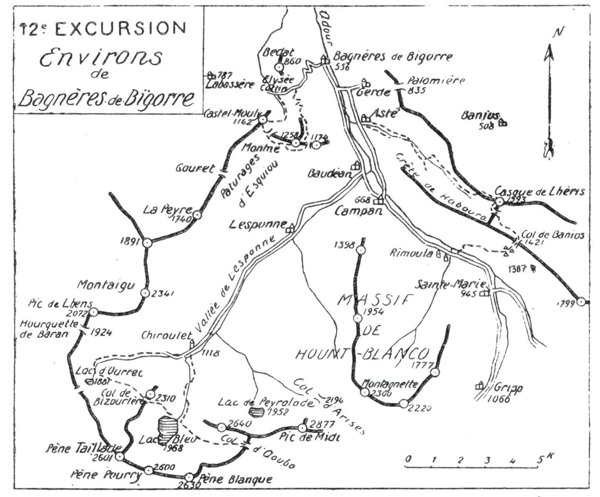

<style>.centre {text-align: center}</style>
<style>.droite {text-align: right}</style>

-----------------------
[//]: # (— p. 161 —)

# DOUZIÈME EXCURSION

__Trois jours aux Environs de Bagnères-de-Bigorre (556m)__

_B. E. — Du 15 Juin au 15 Octobre._

Cartes à emporter : Tarbes et Luz.

<u>__AVIS AUX TOURISTES__</u>

On peut faire aux environs de Bagnères-de-Bigorre une multitude 
de promenades intéressantes d'une demi-journée comme
celles du Bédat, de la Fontaine Ferrugineuse et du Mont Olivet,
des palomières de Gerde, de l'Elysée Cottin, des Ardoisières de
Labassère, etc., etc.

Mon Guide se cantonnant uniquement à la montagne, je décris
simplement les trois excursions dont les itinéraires permettent
d'embrasser l'ensemble de tout le paysage des environs de
Bagnères.

<p class="droite">(Voir ci-contre la Carte de l'Excursion).</p>

<div class="page"/>

— p. 162 — ENVIRONS de BAGNERES-DE-BIGORRE (12me EXCURSION)



<div class="page"/>


— p. 163 — (12me EXCURSION) CROIX de MANSE

## PREMIÈRE JOURNÉE

Ascensions du Montné (1.258m) et du Castel-Mouly (1.142m),
avec retour à Bagnères par les Portes de Fer et l'Elysée Cottin.

—— SANS GUIDE ——

__Conseils.__ — __Itin. recomm.__ — Partant par l'avenue de Salut, on
tournera à dr., au pont de Moulette, pour passer devant la laiterie 
Carrère. A partir de là, une route de chars qui monte par
les pentes S.-E. du Bédat, conduit en 3/4 d'h. à la « Croix de
Manse » que les cartes nomment « Cot de Ger ». On quittera
là le grand chemin qui poursuit horizontalement devant soi, et
on montera à g., sous une châtaigneraie, pour déboucher à découvert 
10 min. plus haut.

Depuis la « Croix de Manse », on a emprunté une partie du
trajet des Allées Dramatiques qu'on laisse bientôt à g. pour
continuer l'ascension direction S., vers le Tucou (1). Une douzaine 
de lacets, admirablement tracés à travers les pelouses,
élèvent insensiblement le touriste jusqu'au large col situé au S.
du Tucou et duquel on jouit déjà d'un joli point de vue. On a à
ses pieds, légèrement à dr., le coquet vallon de l'Elysée Cottin;
en face, l'étroite gorge des Portes de Fer, et tout en haut, le
Castel Mouly (1.142m).

A partir de ce col, on ne peut plus se tromper. Le chemin
monte par le flanc E. de la colline à travers des taillis de hêtre,
pour aboutir au petit col de verdure qu'on nomme « Couret du
Montné ». La dernière source est à 3 min. en contrebas du col,
à g., un petit sentier y. conduit.

Après avoir fait sa provision d'eau, on poursuivra l'ascension
devant soi en pénétrant à nouveau sous forêt, afin de contourner
le massif du Montné par le S. et l'O. Le sentier tourne bientôt
à dr. et on découvre tout d'un coup, devant soi, toute la vallée
de Lesponne que domine majestueusement, au S., le Pic de Midi
de Bagnères. Ce point de vue est très beau. Baudéan est sous soi

———\
(1) Sorte de gros rocher qui culmine la colline naissante.


<div class="page"/>


— p. 164 — MONTNE — CASTEL-MOULY (19me EXCURSION)

à 500 m. de profondeur, et l'œil prend en enfilade toute la vallée
de Campan.

Passant à nouveau à travers des taillis, le chemin s'élève
bientôt en corniche par le versant O. de la montagne, pour
aboutir au sommet secondaire du Montné. sur lequel on a construit 
une table d'orientation. On pourra laisser là le sac et, dans
quelques min., en traversant un lambeau de forêt, on montera
au point culminant, situé au S.-E., pour y jouir d'un panorama
qui s'étend du Vignemale aux Monts Maudits. Par temps clair,
on aperçoit une infinité de villes et de villages des Hautes-
Pyrénées, du Gers et des plaines du Béarn.

Pour varier l'excursion et lui conserver son maximum d'intérêt, 
on descendra par un itinéraire différent de celui de l'ascension. 
On rentrera donc à Bagnères par le petit pic de Castel-
Mouly (1.142m) et les Portes de Fer. Ce dernier itinéraire étant
le plus intéressant, j'en donne la description sommaire.

De la table d'orientation, on descendra droit au N.-O. vers les
hauts pâturages d'Esquiou qui forment un large col à la lisière
de la forêt. On rejoindra là un petit sentier qui, en contournant
de g. à dr., remonte en pente douce jusqu'à la petite crête
rocheuse qui couronne le Castel-Mouly. Du sommet secondaire
du Montné, on aperçoit tout ce trajet qui se fait dans une demi-h.

La vue du Castel-Mouly complète heureusement le panorama
verdoyant de cette jolie région, surtout vers la plaine.

Du Castel-Mouly, on dégringolera droit à l'E. par des pentes
rapides, mais sans danger, afin d'aboutir au creux du vallon
boisé qui descend du col d'Esquiou. Un sentier en longe le
ruisseau, et on arrivera bientôt à la petite gorge rocheuse que les
Bagnérais ont baptisée du nom pompeux de « Portes de Fer ».
C'est un petit coin sauvage, caché au creux de la montagne, et
on est surpris de trouver un site si pittoresque à 1h. de Bagnères.

En continuant la descente, on aboutira, quelques min. après,
en amont du vallon de l'Elysée Cottin qui, par sa verdure et
sa lumière, forme un joli contraste avec les Portes de Fer. Un
grand chemin qui file horizontalement en corniche par les flancs
inférieurs du Tucou, contourne tout le haut du vallon. Ce trajet
est délicieux. Après une marche reposante d'environ 20 min,
pendant laquelle on passera près de la source de Cot de Ger, on


<div class="page"/>

— p. 165 — (12me EXCURSION) GORGE DE LHERIS

rejoindra le chemin d'ascension à la Croix dé Manse, à une
demi-h. de Bagnères.

__Horaire de la Journée :__

``` 
De Bagnères au Montné................... 2h.30 }
Du Montné au Castel-Mouly............... 0h.30 }  4h.30
Du Castel-Mouly aux Portes de Fer....... 0h.20 } (Arrêts en sus).
Des Portes de Fer à Bagnères............ 1h.10 }
```

Nota. — Comme cette excursion ne demande qu'une demi-
journée, on peut la faire sans sac, soit dans la matinée, soit
dans l'après-midi.

## DEUXIÈME JOURNÉE

__Ascension du Casque de Lhéris (1.593m), avec retour à Bagnères__\
__par le Col de Banios (1.421m),__\
__les Cabanes d'Ordincède (1.345m) et Campan (668m).__


—— SANS GUIDE ——


__Conseils.__ — __Itin. recomm.__ — Partant par la route de Campan,
on franchira l'Adour au Pont de Gerde (1/4 d'h.) et, immédiatement 
après, on prendra à dr. la petite route qui mène à Asté
(3 k.). Au centre du vill. on quittera la grand'rue et on tournera
à g, à l'E. afin d'aboutir, en haut d'Asté, au débouché de la
gorge de Lhéris qui descend du S.-E.

Au début, il y a un chemin sur chaque rive; s'il fait grand
soleil, il vaut mieux suivre celui de la rive g. A 20 min. d'Asté,
ce dernier franchit le torrent pour rejoindre celui de la rive dr.
qui continue, unique, jusqu'à un gros rocher gris, coté 696 m., et
près duquel on fait ordinairement la première halte, à 1h.15
de Bagnères. Le site est charmant. La vallée est comme fermée
devant soi par de rapides pentes boisées et le torrent passe
dans une étroite gorge, entre deux hautes parois rocheuses qui
se touchent presque.

En amont du gros rocher, le sentier bifurque. Bien se garder
de suivre le chemin indiqué à dr. par le Joanne, car il est plus


<div class="page"/>


— p. 166 — CASQUE de LHERIS (12me EXCURSION)

long et plus fatigant. Poursuivant droit devant soi, on franchira,
trois min. après, le ruisseau de Lhéris et, en deux lacets rapides,
on gagnera le palier supérieur de la vallée. A partir de là, on
longera constamment la rive dr. du torrent à une certaine distance 
jusqu'aux hautes pelouses de Lhéris, vers 1.300 d'alt.

Cet itinéraire, qui file presque en droite ligne d'Asté au Casque,
s'élève en pente régulièrement douce et on fait la moitié du
trajet à l'ombre. Dans la partie supérieure de la forêt, vers
1.200 d'alt., le grand chemin incline légèrement à dr., vers le
lit du torrent asséché; on le quittera alors par la g., pour suivre
un sentier à peine tracé qui grimpe sous bois, direction S.-E.,
et, dans 1/4 d'h. environ, on débouchera à découvert aux pelouses
du Lhéris.

Au sortir de la forêt, le Casque parait devant soi, droit au
S.-E.; on obliquera alors carrément à g., afin de gagner le haut
de la colline d'Aris, au point coté 1.474 m. On arrivera là sur le
flanc de vertes pelouses qui furent si chères au botaniste Tournefort. 
On cheminera à travers un parterre fleuri et on arrivera
au Casque comme par enchantement.

Le Casque ou Pène de Lhéris (1.593m) est un splendide belvédère 
de premier plan et sa vue s'étend très loin, surtout vers
l'O. Le Montaigu (2.341m), le Pic de Midi (2.877m), le Massif des
Quatre Termes et l'Arbizon (2.831m) paraissent à deux pas. Mais
ce qui rend ce sommet intéressant, c'est, d'abord, sa forme spéciale 
de bonnet phrygien, puis la joliesse de ses alentours et enfin
ses impressionnants à-pics du S. et du S.-O. Les gens sujets au
vertige éprouveront de fortes émotions en regardant du côté du
Col de Lhéris qu'on surplombe de plus de 200m., ou encore
vers les profondeurs du Goueil de l'Arros qui s'enfoncent à l'E.
à plus de 300 m.

La cime du Casque et la petite crête qui le précède étant
gazonnées et glissantes, il ne faut s'y engager qu'avec des souliers 
bien ferrés.

Du haut du Lhéris, on peut repérer presque tout le trajet
du sentier qui va du Col de Lhéris (1.380m) au Col de Banios
(1.421m) qu'on suivra tout à l'heure; il s'amôrce au S.-E. du Col
de Lhéris, à l'entrée de la forêt.

On descendra du Casque avec prudence par les pentes rapides
du S.-O., afin d'aboutir à la petite cheminée qu'on nomme « Pas


<div class="page"/>

— p. 167 — (12me EXCURSION) COL DE BANIOS — CABANES d'ORDINCEDE

du Chat ». Ce passage est plus impressionnant que difficile; l'important 
est de marcher en rang serré dans le couloir inférieur
pour éviter les chutes de pierres. On débarque bientôt aux
vertes pelouses du Lhéris et, en dévalant droit au S., on rejoint
le sentier du Col de Banios, 1/4 d'h. après avoir quitté le sommet. 
Ce sentier descend légèrement pour contourner par leurs
bases deux escarpements rocheux de la partie S.-E. de la Crête
de Haboura, en perdant une cinquantaine de m. d'alt. On passera
là près d'un immense abri naturel sous roche où les moutons
se réfugient en cas d'orage. Au besoin, on pourrait y coucher.

A 1/4 d'h. du Col de Lhéris, on rejoindra un grand chemin
muletier qui fait communiquer la vallée de l'Arros avec celle
de Campan par le Col de Banios (1.421m). Il monte en pente
douce, sous forêt, avec quelques échappées sur la plaine et,
1 h. après avoir quitté le Casque, on arrive à découvert sur une
large et verdoyante dépression de la crête.

Le Col de Banios est une sorte de plateau gazonné, large de
plusieurs centaines de m., où paissent plusieurs troupeaux de
moutons; au centre, versant N., on trouve une très bonne source
et, cinq min. plus à l'O., une belle cabane. A mesure qu'on
avance sur le plateau, le rideau se lève vers le S. et bientôt on
domine merveilleusement la vallée de Campan. Le spectacle sera
complet si on redescend cinq min. au S., jusqu'aux cabanes
d'Ordincède, situées à 1.345 m. d'alt. sur un balcon suspendu.
Sainte-Marie-de-Campan est littéralement sous les pieds et on
découvre la magnifique vallée depuis Campan jusqu'à la Hourquette 
d'Arreau. Devant soi, parait toute la vallée de Gripp et
ses hautes cimes.

Des cabanes d'Ordincède, un magnifique sentier mène au fond
de la vallée. Taillé dans la roche vive et accroché à flanc de
montagne, il descend, d'abord, en quatre lacets rapides, puis,
prend la direction N., pour aboutir en pente douce au pont de
Rimoula où il rejoint la grand'route, à 4 k. de Campan et à
10 k. de Bagnères. On peul prendre là ou bien à Campan le tram
électrique.

__Horaire de la Journée :__

``` 
De Bagnères au rocher gris............. 1h.15 }
Du rocher gris au Casque de Lhéris..... 2h.15 }   6h.30
Du Casque au Col de Banios............. 1h. » } (Arrêts en sus)
Du Col de Banios à Campan.............. 2h. » }
```

<div class="page"/>


— p. 168 — LAC BLEU de BAGNERES (12me EXCURSION)

## TROISIÈME JOURNÉE

__Ascension du Lac Bleu (1.968m),__\
__du Col de Bizourtère (2.275m) et retour à Bagnères__\
__par Le Lac Vert ou Lac d'Ourrec (1.681m).__

—— SANS GUIDE ——


__Conseils.__ — __Itin. recomm.__ — On louera une voiture pour la
journée et on partira de très bonne heure, afin d'arriver vers
6 h. 1/2 au haut de la vallée de Lesponne, à Chiroulet (1.118m).
On est là au terminus de la route, à 15 k. de Bagnères. Si on
prend quelque chose à l'Hôtellerie, il ne faut pas s'y attarder,
afin de faire à l'ombre la plus grande partie de l'ascension au
Lac Bleu.

On franchira l'Adour immédiatement au S. de l'hôtellerie et
on suivra le grand sentier qui, après avoir traversé le bois,
débouche à découvert sur les pelouses où il fait de nombreux
lacets sur les deux rives de la Coume. Après 2 h. d'ascension,
on apercevra, sur la dr., la galerie souterraine par laquelle on
peut vider le lac en partie pour alimenter l'Adour en cas de
sécheresse. Une petite cascade s'en échappe ordinairement.
Encore trois lacets et, quelques min. après, apparait subitement
la belle nappe d'eau d'un bleu intense.

Situé dans un site sauvage, le Lac Bleu de Bagnères-de-Bigorre
est l'un des plus beaux des Pyrénées. C'est à lui qu'aurait dû
aller la renommée presque mondiale de deux autres lacs qui
lui sont bien inférieurs en beauté et surtout en surface, puisqu'il
couvre 49 hectares. Les cimes qui le couronnent se reflètent
dans ses eaux et, si on en fait le tour, ce qui demande environ
1h., on les voit défiler dans sa nappe d'azur.

En arrivant au déversoir, on reconnaîtra les crêtes des trois
Pènes (Blanque, Pourry et Taillade) qui le dominent majestueusement 
au S., crêtes vues par l'autre versant lors de l'ascension
au Soum Arrouy (V. 11° E., p. 158).

Après le Pic de Midi, le Lac Bleu est la perle des environs
de Bagnères-de-Bigorre; son ascension peut être facilement faite
dans la même journée.


<div class="page"/>


— p. 169 — (12me EXCURSION) LAC VERT de BAGNERES


Afin de donner à cette ascension son maximum d'intérêt, on
montera, à l'O., au Col de Bizourtère (1) pour redescendre par
l'autre versant, et revenir à Chiroulet par le Lac Vert et sa
jolie cascade.

On grimpera donc à dr., rive g. du déversoir, par des rochers
faciles et, 10 min. après, on rejoindra le petit sentier qui s'élève
à travers les pelouses jusqu'au Col de Bizourtère (2.275m). On y
jouit d'une vue splendide sur les hautes cimes de la région et
surtout vers l'O. Mais le spectacle le plus prenant de ce belvédère, 
c'est le contraste saisissant qui existe entre le bleu intense
du lac qu'on vient de quitter et le vert émeraude du Lac d'Ourrec
vers lequel on descendra. Le regard va de l'un à l'autre sans
jamais se lasser.

A l'O. du Col, descend un sentier rapide qui, en de nombreux
lacets, conduit au Lac Vert où Lac d'Ourrec (1.681m); on dévalera 
par là jusqu'au lac qu'on laissera à g. On passera près de la
Cascade d'Ouscouaou qui sort du lac et qui est l'une des nombreuses 
sources de l'Adour. Après la cascade, se creuse un vallon
qui tourne bientôt à l'E.; il n'y a qu'à le suivre.

A 20 min. de la cascade, le sentier bifurque, car il y en a un
sur chaque rive; il vaut mieux rester sur celui de la rive g. qui
mène directement à Chiroulet où on retrouvera la voiture pour
rentrer à Bagnères.

__Horaire de la Journée :__

``` 
De Bagnères à Chiroulet, 15 k. de voiture. 2h.30 }
De Chiroulet au Lac Bleu.................. 2h.45 }     10h.30
Du Lac Bleu au Col de Bizourtère.......... 1h. » } {Arrêts en sus)
Du Col de Bizourtère à Chiroulet.......... 2h.45 }   dont 6h.30
De Chiroulet à Bagnères en voiture........ 1h.30 }   de marche.
```

Nota. - Si, du Lac Bleu, on voulait aller coucher à l'Hôtellerie 
de Sencours, afin de faire l'ascension du Pic de Midi
le lendemain, rien n'est plus facile; en voici l'itinéraire :
Sur la rive dr. du déversoir, on trouve un sentier à peine
tracé qui grimpe dans le rocher par le Pas du Bouc, pour
gagner le haut du plateau; là, il rejoint le chemin direct du
Col d'Aoubo dont on a aperçu l'amorce en montant. Ce pla-

———\
(1) Ce col est appelé Hourquette d''Ouscouaou par la carte d'Etat-
Major et Col du Lac par celle du Ministère de l'Intérieur.


<div class="page"/>


— p. 170 — BAGNERES-DE-BIGORRE (12me EXCURSION)

-teau gazonné forme un promontoire admirable pour voir le
lac en entier.

Le Col d'Aoubo est situé à l'E.-S.-E. et, de ce plateau, on en
aperçoit très bien l'échancrure. Un très joli sentier y conduit
en pente douce et, même avec du brouillard, on y parviendra
sans difficulté en marchant à l'E.-S.-E. Au Col d'Aoubo, on a
une fort belle vue, surtout sur la cuvette d'Escoubous et le
massif de Nèouvielle.

Le sentier descend dans la cuvette d'Aoubo qu'il traverse
direction S.-E., pour remonter, en face, au nouveau Col d'Oncet, 
et contourner le contrefort de ce nom. Il se dirige ensuite
au N.-E.; on découvre subitement le Lac d'Oncet, l'Hôtellerie
et, tout en haut, l'observatoire du Pic de Midi. Quelques min.
après, on rejoint le chemin qui, de Barèges, monte directement 
à l'Hôtellerie du Col de Sencours (2.373m).

<u>__POINT UNIQUE D'INTERRUPTION__</u>

__BAGNÈRES de BIGORRE__
- Soit pour abandonner, après la 1re ou la 2e journée, soit pour rejoindre.