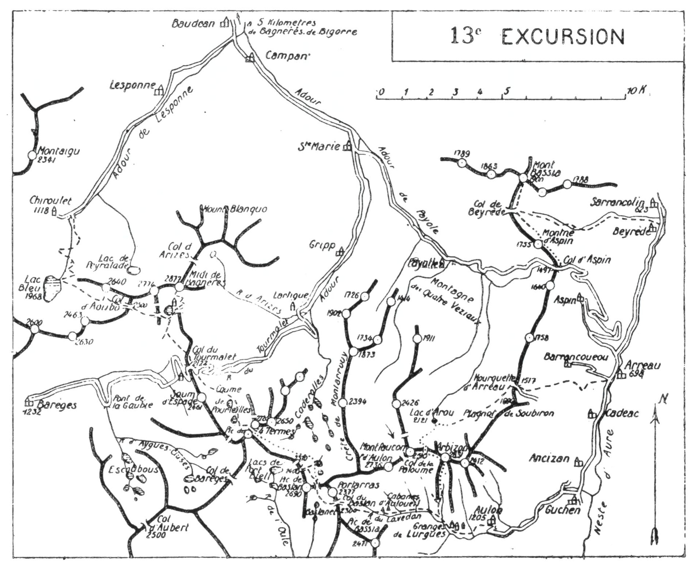

<style>.centre {text-align: center}</style>
<style>.droite {text-align: right}</style>

-----------------------
[//]: # (— p. 171 —)


# TREIZIÈME EXCURSION

(No 11 de la 1re édition)

__Trois jours au départ de Bagnères-de-Bigorre__

_B. E. — Du 1° Juillet à fin Septembre._

Cartes à emporter : Luz, Bagnères-de-Luchon.

 

__De BAGNÈRES-de-BIGORRE à ARREAU,__\
__par le Pic de Midi, le Pic des Quatre Termes et l'Arbizon.__


<u>__AVIS AUX TOURISTES__</u>

C'est par l'un des plus beaux belvédères des Pyrénées, le
Pic de Midi de Bigorre, que débutera la 13° excursion, en faisant 
visiter au passage l'admirable et fertile vallée de Campan. 
Comme on pourra déjeuner à l'Hôtellerie du plateau
d'Artigues et qu'on dînera à l'Hôtellerie de Sencours et à
Aulon les deux autres soirs, il suffira d'emporter des conserves
pour deux repas et les divers casse-croûte.

UNE ROUTE AU PIC DE MIDI

On vient de construire une route qui va du col du Tourmalet 
(2.122m) à l'Hôtellerie de Sencours (2.373m); elle sera continuée 
jusqu'à l'observatoire du Pic de Midi (2.877m).

Longue de 3 k. 500, avec une pente de 7 %, la nouvelle
route s'amorce quelques m. en contrebas du Tourmalet, sur
le versant de Barèges, pour monter en droite ligne, grâce à

<p class="droite">(Voir ci-contre la Carte de l'Excursion).</p>

———\
(1) Concernant l'étymologie des pics de Midi, voir note spéciale, p. 38.


<div class="page"/>

— p. 172 —



deux petits tunnels, jusqu’au Col de Sencours. Dans ce trajet,
elle s’élève en corniche par les flancs O. du Pic du Tourmalet
(2.467) et du Cap de Sencours (2.469), en dominant d’abord
les cabanes de Toue, puis le lac d’Oncet. Actuellement, on
peut donc arriver en auto à 1 h. 15 du sommet et, prochainement, 
tout à fait en haut.

Il existe un service d’auto-cars du Tourmalet qui correspond 
avec les tramways de Bagnères à Gripp.


<div class="page"/>


— p. 173 — (13me EXCURSION) PIC de MIDI de BIGORRE


## PREMIÈRE JOURNÉE

__De BAGNÈRES-de-BIGORRE (556m) à l'HOTELLERIE__\
__de SENCOURS (2.373m),__\
__par Gripp (1.066m), le Plateau d'Artigues (1.300m), la Cascade__\
__de Garet et la Gorge de Sencours.__


—— SANS GUIDE ——


__Conseils.__ — __Itin. recomm.__ — On partira par le premier tram
électrique du matin et, si ce dernier s'arrête à Gripp (16 k.), il
restera 3 k. de route à faire à pied pour parvenir au Plateau
d'Artigues; on y arrivera sans doute vers 9 h. On pourrait faire
un déjeuner léger à l'Hôtellerie d'Artigues, et profiter de cet
arrêt pour aller donner un coup d'œil à la Cascade de Garet
qui n'est qu'à cinq min.

On repartira d'Artigues au plus tard à 11 h. et on prendra,
près du dépôt de l'observatoire, le grand sentier muletier qui
remonte au N.-O. le vallon d'Arizes par la rive g. Vers 1.600 d'alt.,
on sautera le torrent, en laissant à dr. le sentier du Col d'Arizes,
et bientôt, on entrera dans la gorge de Sencours qui grimpe à
l'O. jusqu'au Col de ce nom où est bâtie l'Hôtellerie. On longera
ainsi par leurs bases les contreforts S.-E. et S. du Pic de Midi.

Comme on arrivera à l'Hôtellerie vers 15 h., on aura largement 
le temps de monter à l'observatoire avant le diner, puisqu'il
ne faut que 2 h. 1/4, aller et retour.

Si on veut jouir du spectacle complet du Pic de Midi, il faut
y monter au moins deux fois et à des heures différentes : le
matin, pour le lever du soleil, et le soir, au moment où celui-ci
décline à l'horizon. Donc, après avoir retenu son lit et absorbé
un sérieux casse-croûte, on quittera l'Hôtellerie vers 16 h. pour
faire l'ascension du sommet par le sentier qui y mène tout
droit.

Le panorama du Pic de Midi de Bigorre est universellement
connu et apprécié. La construction sur sa cime du seul observatoire 
existant aux Pyrénées indique suffisamment que sa situation 
est unique. Sentinelle détachée de la grande chaîne, on
jouit sur son sommet d'une vue incomparable dans toutes les
directions.


<div class="page"/>


— p. 174 — COL du TOURMALET (13me EXCURSION)

__Horaire de la Journée :__

``` 
De Bagnères à Gripp, 1 h. de tram.              }
De Gripp à Artigues.. ....................0h.40 }    6h.15
D'Artigues à l'Hôtellerie de Sencours.... 3h.20 } (Arrêts en sus)
De l'Hôtellerie à l'observatoire, aller et      }
  retour..................................2h.15 }
```

Nota. — Si on veut faire l'ascension du Pic de Midi et du
Lac Bleu, en revenant à Bagnères, voici comment je la conseille : 
On partira le matin en tramway jusqu'à Artigues, afin
d'y arriver à 9 ou 10 h.; dans 20 min., aller et retour, on ira
voir la cascade de Garet. Dans l'après-midi, on montera coucher 
à l'Hôtellerie de Sencours.

Le lendemain, on partira à la lanterne, à 3 h., pour assister
au pic au lever du soleil; on visitera l'observatoire et on redescendra 
à l'hôtellerie pour le petit déjeuner. Repartant immédiatement 
après, on ira, par le Col d'Aoubo, faire le grand
déjeuner au bord du Lac Bleu, et on rentrera à Bagnères par
Chiroulet et la vallée de Lesponne.

Si les 15 k. de route paraissent longs, on peut se faire
prendre en voiture à Chiroulet.

Pour l'ascension du Pic de Midi depuis Barèges, voir la note
spéciale, p. 147.

## DEUXIÈME JOURNÉE

__Du PIC de MIDI à AULON (1.205m),__\
__par le Col du Tourmalet(2.122m), le Pic des Quatre Termes(2.720m),__\
__le Col de Bastanet (2.350m) et le Col du Bâästan (2.300m).__


—— GUIDE UTILE ——

<u>__Concernant le PIC des QUATRE TERMES__</u>

Le nom du Pic des Quatre Termes ne figurant dans aucun
guide, ni sur aucune carte et, de plus, ce sommet étant presque
inconnu, même à moins de 20 k., une note sur sa situation
et sur sa forme me paraît indispensable.

Si, du Pic de Midi, vous portez vos regards immédiatement
au S.-E., vous remarquerez, à environ 6 k., un massif de forme
particulière : c'est celui du Pic des Quatre Termes que les
cartes nomment « Som de Port Bieil ».

Quatre crêtes déchiquetées et torturées convergent vers son
sommet, formant ainsi entre elles quatre vallons constellés
de nombreux lacs : au S., celui de Port Bieil, qui verse ses
eaux dans l'Oule de Couplan, où on vient de créer le lac
artificiel qui alimente en force la grande usine électrique
d'Eget; à l'O., celui d'Aygue-Cluse, qui descend vers Barèges;
à l'E., celui de Caderolles et, enfin, au N., celui du Tourmalet.


<div class="page"/>


— p. 175 — (13me EXCURSION) COUME DE POURTEILLE
 

Les deux derniers versent leurs eaux vers Gripp et Campan;
ce sont les vraies sources de l'Adour.

Dans la carte de la 13° excursion, on remarquera la direction 
des quatre crêtes séparatives : celle d'Aygue-Cluse, au
S.-O.; celle de Port Bieil, au S.-E.; celle de Teste-Guillem et
Pène Blanque, au N.-E.; enfin, celle des Agalots qui, après
avoir décrit une courbe au S.-O. va mourir au N.-O., au Col
du Tourmalet.

Le Pic des Quatre Termes comprend deux sommets séparés
par un large col et distants d'environ 300 m. Le point culminant 
(2.720m), surmonté d'une tourelle, est au N. Mais,
c'est le sommet S., 2.700 m. environ, qui est le véritable
Quatre Termes, puisqu'il est le nœud des quatre crêtes. Une
troisième cime, 2.650 m. environ, s'élève à 800 m., à l'E. du
sommet principal.

La quantité de rochers descendus de ces divers pics est considérable, 
en épaisseur et en surface; les parties supérieures
des quatre vallons sont de véritables chaos. Seule, la région de
l'Ardiden pourrait lui être comparée.

Si on se basait sur la quantité de pierres entassées aux
alentours pour juger de son ancienne hauteur, on en conclurait
que le Quatre Termes était le point culminant de la contrée.

__Conseils.__ — __Itin. recomm.__ — En partant à 3 h., heure solaire,
on peut remonter au Pic de Midi pour assister au lever du soleil
et être de retour à l''Hôtellerie vers 6 h. Même, en quittant l'Hôtellerie 
à 7 h., on a largement le temps d'effectuer le programme
de la deuxième journée, et d'arriver à Aulon avant la nuit.

Comme on l'a vu p. 171, une petite route de 3 k. 500, terminée
en 1930, relie maintenant la grand'route des Pyrénées à l'Hôtellerie 
de Sencours. A la descente, ce trajet est des plus agréables;
la route passe en corniche par les pentes O. du Cap de Sencours,
puis au haut des cabanes de Toue qu'elle domine de plus de
200 m. On partira donc par la nouvelle route, afin de rejoindre
celle des Pyrénées au Col du Tourmalet, où on passera sur le
versant de Gripp. On suivra alors la grand'route jusqu'au premier 
tournant (300 m. environ) où on la quittera par la dr.

On aura devant soi un petit sentier qui file direction S.-E., en
rasant par leur base les premiers contreforts du Som de l'Espade
(2.461m). On s'y engagera par un flanc d'éboulis et, en descendant 
légèrement, on aboutira à l'entrée de la Coume de Pourteille 
qui monte à dr., direction S. (1).

 
———\
(1) Le nom de la Coume de Pourteille est presque inconnu sur le
versant de Barèges; donc, on ne sera pas surpris si le guide l'ignore
et s'il veut passer par une autre voie, ce qu'il ne faut pas accepter,
sous peine de compromettre la journée.


<div class="page"/>


— p. 176 — PIC des QUATRE TERMES (13me EXCURSION)

On entrera là, dans un monde de pierraille qui ne finira que
dans l'après-midi, 1/2 h. après avoir quitté le pic des Quatre
Termes. On remontera la Coume de Pourteille par la rive g.
jusqu'à un petit lac qu'on contournera par la rive dr.; on
reprendra ensuite l'ascension par la rive g. du vallon, c'est-à-dire
par la base des pentes E. de la crête des Agalots. On laissera à
g. un vallon secondaire qui grimpe vers une petite brèche et
bientôt, on rejoindra un sentier qui monte jusqu'à un nouveau
lac plus important que le premier. De ce point, on sera dominé
au S.-E. par les deux sommets du pic des Quatre Termes, et on
apercevra toute la voie d'ascension jusqu'au col qui les sépare.
On y montera et on y déposera le sac.

Du col, on descendra d'une cinquantaine de m. sur le versant
E. et on tournera à g.; dans 10 min., on aboutira à une cheminée
rapide, mais facile, qui monte par la face S.-E. au sommet principal 
(2.720m) surmonté d'une tourelle. Le point de vue est de
toute beauté; pour les lointains, il est analogue à celui du Pic
de Midi, sauf sur la plaine de Tarbes que ce dernier lui masque
en partie. Mais pour les environs immédiats, il est indispensable
de faire les deux sommets si on veut jouir d'une vue complète.
On reviendra donc au col par la même voie et, après avoir
repris le sac, on montera droit au S., à flanc E. de crête, jusqu'au 
sommet secondaire, 2.700 environ. Ce dernier est le vrai
Quatre Termes, puisqu'il est le nœud des quatre crêtes.

C'est du sommet secondaire qu'on aperçoit le mieux les régions
lacustres de Caderolles et de Port Bieil. L'œil plonge au S.-S.-E.
jusqu'au lac artificiel de l'Oule. Au S.-E., se détache la crête
de Port Bieil par laquelle on partira, et on distingue très bien
au bout, un peu à g., le petit Col de Bastanet qui n'est qu'à 2h.

Avant de quitter le Quatre Termes, point central de cette
journée d'excursion, le touriste remarquera que celle-ci fait
passer sur le versant de trois bassins et de trois grandes vallées.
Au départ, en franchissant le Tourmalet, on quitte le bassin des
gaves et la vallée de Luz pour passer dans la vallée de Campan
et le bassin de l'Adour. Tout à l'heure, en franchissant le petit
Col de Bastanet, on passera sur le versant de la vallée de l'Aure
et du bassin de la Garonne. Du haut du Quatre Termes, on
aperçoit la naissance de ces vallons opposés, et on peut dire
qu'à ce point de vue, sa situation est peut-être unique.


<div class="page"/>


— p. 177 — (13me EXCURSION) COLS du BASTANET et du BASTAN

 
On repartira direction S.-E., à toute crête d'abord, puis à
flanc de crête sans trop descendre, afin d'aboutir à la base de
la Hourquette Braque (2.375m). Cette brèche, la plus profonde
de la crête de Port Bieil, est à environ 1 h. du pic des Quatre
Termes. La Hourquette de Caderolles (2.400m), où passe le sentier 
de Gripp à Orédon, est 10 min. plus à l'E.

Après la Hourquette Braque, on descendra légèrement à g.,
pour aboutir au petit lac supérieur de Caderolles (1); on coupera 
là le sentier de Gripp à Orédon, et on aura en face, au
S.-S.-E., le petit Col de Bastanet d'accès très facile. Ce col est
situé entre le Pic de Bastan (2.690m) (2), à l'O., et le Pic de
Portarras (2.377m), à l'E. On peut y monter en contournant le
lac, soit par la dr., soit par la g., à sa fantaisie.

Parvenu au Col de Bastanet, on dominera, au S., les deux jolis
lacs de ce nom, et on aura sur sa g., à peu près à égale alt.
le Col de Bastan (2.300m) par lequel il faut passer pour se rendre
à Aulon. Un sentier descend au S. vers le premier lac; on le
suivra 1/4 d'h. environ, puis on tournera à g. et, par une marche
horizontale à travers les éboulis de la face S. du Pic de Portarras,
on ira rejoindre le chemin de Barèges à Arreau au pied
du Col du Bastan. Dans 10 min., on franchira cette nouvelle
crête et on passera sur le versant d'Aulon, au vallon du Lavedan.
De nombreux troupeaux fréquentent cette région et le sentier
descend sur les cabanes d'Auloueil où couchent les bergers. C'est
par le Col du Bastan que passe le chemin direct de Barèges
à la vallée d'Aure; aussi, n'a-t-on pas la moindre hésitation
sur sa direction. D'ailleurs, dès avoir franchi le col, on est
canalisé par le vallon du Lavedan qui descend au S.-E. et, à
partir des cabanes d'Auloueil, le sentier qui passe définitivement 
rive g., se transforme bientôt en un chemin de chars jusqu'à 
Aulon.

On trouvera à Aulon une aimable hospitalité chez M. Alexandre 
Capdetrey. Ce dernier, qui n'est pas aubergiste, mais sim-

———\
(1) Je crois que c'est à tort que certains auteurs appellent ce lac
« Lac Rond de Port Bieil », puisqu'il s'écoule sur Caderolles. Les lacs
de Port Bieil sont tous à l'O. de la crête de ce nom, dans le cirque de
Port Bieil, et s'écoulent dans l'Oule de Couplan.

(2) Pic de Port Bieil des cartes.


<div class="page"/>


— p. 178 — AULON (13me EXGURSION)

plement propriétaire, est, à l'occasion, un excellent guide pour
l'Arbizon.

__Horaire de la Journée :__

``` 
De l'Hôtellerie au Col du Tourmalet..... 1h, » }
Du Tourmalet au Pic des Quatre Termes... 3h.15 }   9h.30
Du Pic des Quatre Termes au Col du Bas-        }
  tanet................................. 2h. » } (Arrêts en sus)
Du Col du Bastanet au Col du Bastan..... 1h. » } 
Du Col du Bastan à Aulon................ 2h.15 }
```

## TROISIÈME JOURNÉE

__D'AULON (1.205m) à ARREAU (698m),__\
__par le Pic d'Arbizon (2.831m), le Lac d'Arou (2.121m)__\
__et la Hourquette d'Arreau (1.517m).__

 
—— GUIDE UTILE ——

__Conseils.__ — __Itin. recomm.__ — On reprendra le chemin de la
veille par les granges de Lurgues et, 1/4 d'h. en amont, au baut
des dernières prairies, on laissera à g., à l'O., celui du Col du
Bastan.

Suivant le sentier de dr. qui monte direction N., on rejoindra
quelques min. après le ruisseau qui descend du Col de la Paloume; 
on le longera par la rive g. jusqu'à la grande fontaine
de Coulariot.

Cette fontaine, qui comprend trois sources, est située vers
1.800 d'alt., sur le bord supérieur du ruisseau et au pied du
contrefort S. de l'Arbizon (1).

A partir de là, il faut bien se garder de suivre l'itinéraire
qu'indique le Joanne par le Col de la Paloume; il est long,
éreintant et dépourvu d'intérêt. J'insiste pour recommander
exclusivement celui qui a été suivi, fin juin 1913, par une caravane 
sous ma direction. Il est le plus sûr, le plus direct et le
moins fatigant.

Au-dessus de la fontaine, monte une pente gazonnée, direction
N.-N.-E., vers les bases rocheuses du contrefort S.-S.-O. du pic,

———\
(1) La petite fontaine de Coulariot signalée par la carte d'Etat-Major
sourd d'une faille de rocher un peu plus haut.


<div class="page"/>


— p. 179 — (13me EXCURSION) PIC D'ARBIZON

et une sente suivie par les moutons en escalade le premier ressaut
jusqu'à des rochers lisses qui bordent la rive dr. d'un petit couloir. 
On suivra cette sente qui fait quelques lacets, puis on
montera droit au N., en se tenant, pendant 1 b., sur le flanc E.
du contrefort, c'est-à-dire sur la rive droite du couloir et à une
certaine hauteur.

Gagnant ensuite la crête qui devient très facile, on arrivera
bientôt au pied d'une protubérance rocheuse qui est coupée dans
son centre par deux petits couloirs parallèles. A l'entrée de
celui de g., on remarquera une curieuse fenêtre au travers de
laquelle on aperçoit le pic de Montfaucon, de l'autre côté du
cirque.

Continuant l'ascension par le couloir de dr., on arrivera immédiatement 
après au terrain facile d'une croupe qui s'élargit à
mesure que l'on monte et, dans 1/2 h. environ, on atteindra le
signal de l'Arbizon (2.831m).

Comme au Pic de Midi, on jouit sur l'Arbizon d'un imnmense
panorama qui s'étend du Balaïtous aux monts Ariégeois; mais
le grand intérêt de son ascension est dans la vue splendide de
toute la vallée d'Aure qu'on a littéralement sous les pieds. Les
plaines de Lannemezan et du Gers paraissent dans tous leurs
détails. Au N., à plus de 1.000 m. de profondeur, brille la tache
verte du lac d'Arou, et le regard qui plonge vers Payole remonte
rapidement vers la crête du Mont Bassia qu'on ascendra le lendemain. 
C'est vers le Lac d'Arou qu'on descendra en suivant l'itinéraire 
ci-dessous.

On se dirigera à l'O., à flanc S. de crête, pendant 20 min.
environ, pour rejoindre une petite échancrure de l'arête située
immédiatement après un gendarme. Là, s'ouvre, sur le versant
N., une étroite cheminée oblique, régulièrement creusée entre
deux murs, qui aboutit 20 m. plus bas à une petite plaque de
gazon. C'est le seul chemin direct de descente par la face N., chemin 
impressionnant, mais sans danger pour un pyrénéiste un
peu exercé. Il ne serait délicat qu'avant fin juin, à cause de la
couche de neige glacée qui, jusqu'à cette époque, garnit le couloir 
rapide **** du fond. Il faudrait alors tailler des pas pour le
franchir.

On peut aussi descendre au Lac d'Arou en contournant le
Monfaucon par l'O. et en prenant, au N. du pic, un couloir


<div class="page"/>


— p. 180 — HOURQUETTE D'ARREAU (13me EXCURSION)

d'éboulis qui dévale, à l'E., au cirque N. de l'Arbizon. C'est un
trajet fastidieux qui allonge de 1 h. On descendra donc par
l'étroite cheminée jusqu'à la plaque de gazon. Au fond de celle-ci,
on tournera à g., à l'O., en longeant la base de parois verticales,
afin d'aboutir au haut du couloir neigeux. Si la neige est molle,
on pourra descendre directement par le couloir; mais, si elle
est verglacée, on le traversera en diagonale vers les rochers de
la rive g. A partir de là, il n'y a plus la moindre difficulté, et on
pourra descendre à sa fantaisie vers le lac qu'on a constamment 
sous les yeux. On n'arrivera pas jusqu'à lui: on le laissera
à g., à 500 m. (1).
De ce point, on apercevra au N.-E., à 4 k. environ, la grande
dépression de la Hourquette d'Arreau, vers laquelle on marchera 
en utilisant les divers sentiers qui s'y dirigent presque
horizontalement à flanc de montagne. On contournera plusieurs
contreforts gazonnés et plusieurs ravins pierreux par le haut du
cirque. Après environ 1 h. de marche, on longera par la g. le
Plagnot de Soubiron (1.694m) et, par une légère descente, on
arrivera à la Hourquette d'Arreau (1.517m), où on coupe la
petite route de Guchen à Payolle.
A la Hourquette, on laissera à dr. la route de Guchen, pour
suivre, à l'E., un sentier muletier qui descend par le Bois d'Oubac, 
et qui va rejoindre la grand'route de la vallée, 500 m. en
amont d'Arreau.

__Horaire de la Journée :__

``` 
D'Aulon à la Fontaine de Coulariot...... 1h.45 }
De la Fontaine au Pic 'd'Arbizon........ 2h.30 }     9h.15
Du Pic d'Arbizon au Lac d'Arou.......... 1h.45 } (Arrêts en sus)
Du Lac d'Arou à Arreau.................. 3h.15 }
```
 

<u>__POINTS D’INTERRUPTION__</u>

__HOTELLERIE DU PIC DE MIDI__
- Pour rejoindre de Barèges : 3h.15
- Pour rentrer à Bareges :  2h. »

__AULON__
- Pour rejoindre d'Arreau (11 k. 500 de route) : 3h. »
- Pour rentrer à Arreau : 2h.30

———\
(1) C'est de ce point qu'on pourra renvoyer le guide, ce qui lui
permettra de rentrer le soir même à Barèges, par le Tourmalet.
