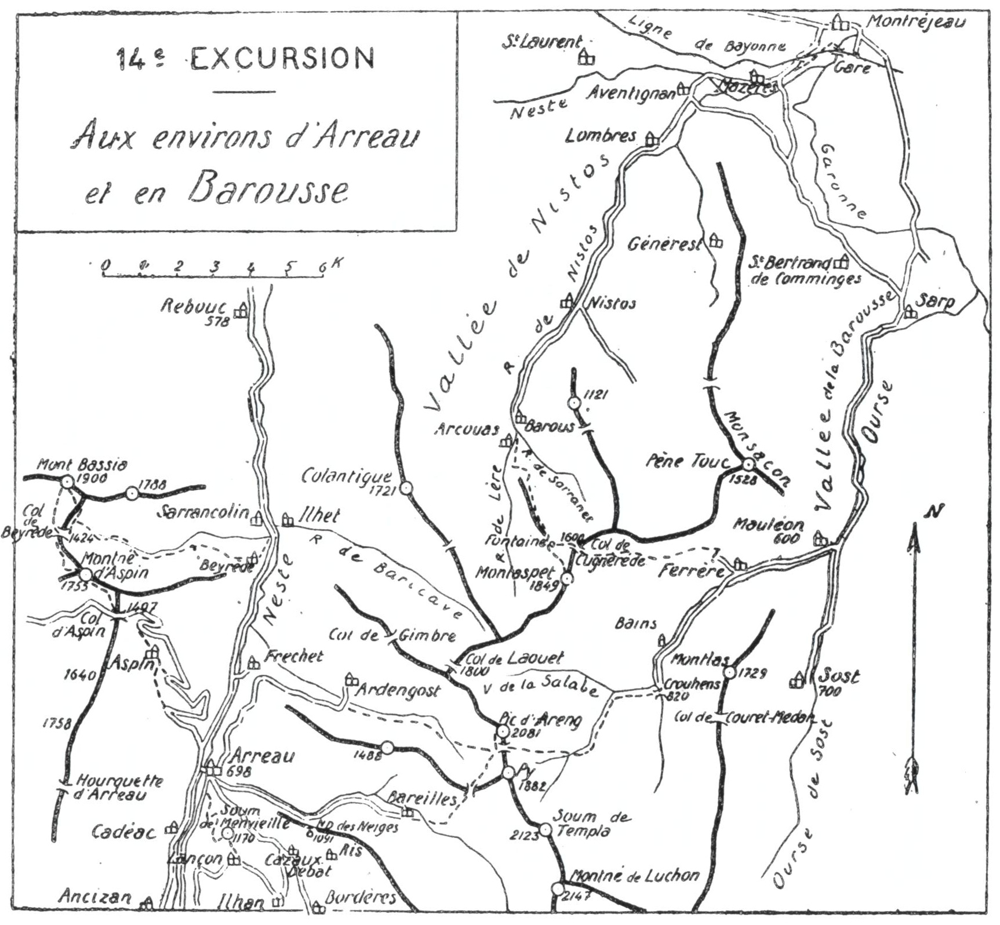

<style>.centre {text-align: center}</style>
<style>.droite {text-align: right}</style>

-----------------------
[//]: # (— p. 181 —)

# QUATORZIÈME EXCURSION

__Quatre jours aux Environs d'Arreau et En Barousse__

_B. E. — Du 15 Juin au 15 Octobre._

Cartes à emporter : Luz, Bagnères-de-Luchon, Saint-Gaudens.

<u>__NOTICE sur ARREAU__</u>

Au haut de la vallée de la Neste, après un étroit défilé de 10 k.,
le chemin de fer débouche à Arreau, au confluent des trois vallées
supérieures d'Aure, du Louron et de Barcilles. La situation privilégiée 
de cette ville accidentée, à 700m. d'altitude, constitue,
aussi bien pour le simple touriste que pour le grimpeur de hauts
sommets, un des plus beaux centres d'excursions des Pyrénées.

<p class="droite">(Voir ci-contre la Carte de l'Excursion).</p>

## PREMIÈRE JOURNÉE

__Ascension du Soum de Menvielle (1.170m), par Lançon (1.089m)__<br>
__et retour à Arreau par la Forêt de Lançon, Ilhan__<br>
__et la Vallée du Louron.__

—— SANS GUIDE ——

__Conseils.__ — __Itin. recomm.__ — On partira de Toulouse ou de Tarbes 
par le premier train et, après avoir changé à Lannemezan, on
arrivera à Arreau vers 10 h. On déjeunera assez tôt, afin de pouvoir 
repartir sans sac vers 13 h.

Sortant d'Arreau par le S., rive dr. de la Neste d'Aure, on prendra 
le chemin qui passe au-dessus du cimetière, afin de rejoindre,
20 min. plus haut, la petite route forestière qui monte à Lançon
par le Bois du Bédat. Après avoir décrit à g. un long crochet qui
ramène verticalement au-dessus d'Arreau, cette dernière file en
corniche, droit au S., pour pénétrer bientôt dans la gorge de
Lançon. Comme on s'est élevé de 300 m., on jouit déjà d'un très
joli point de vue sur les environs immédiats.

<div class="page"/>

— p. 182 — ENVIRONS D'ARREAU (14me EXCURSION)
 


<p class="centre">
CARTE DES ENVIRONS D'ARREAU<br>
ET D'UNE PARTIE DE LA BAROUSSE
</p>

<div class="page"/>

— p. 183 —

(14me EXCURSION) SOUM de MENVIEILLE
 

Après 1h.15 d'ascension, on débouche subitement au verdoyant 
plateau de Lançon, d'une alt. moyenne de 1.100 m.; ce
site est si riant qu'il peut à lui seul servir de but à une excursion.
A quelques min. à l'E., paraît le petit vill. de haute alt. qu'est
Lançon, au centre d'une oasis cachée aux regards des habitants
de la plaine.

On n'arrivera pas au vill.; au premier lacet à g., on quittera
le chemin pour monter au N.-E. par des pelouses faciles, afin
d'aboutir directement au Soum de Menvieille (1.170m). On laissera
ainsi le vill. de Lançon à ses pieds au S.

Le Soum de Menvieille est le premier sommet d'un intéressant
chaînon qui nait à Arreau même et qui grimpe droit au S. par
la Serre d'Azet, le Pic d'Estos (2.804m) et le Pic de Parraouis
(2.908m) jusqu'au Lustou (3.025m), son point culminant. C'est ce
chaînon qui sépare la vallée d'Aure de celle du Louron.

Le Soum de Menvieille, où on peut monter à cheval, est
admirablement situé. Commé il est placé à l'entrée des vallées
d'Aure et du Louron et dans l'axe de celle de la Neste, on apercoit, 
de son sommet, toutes les montagnes de la région. Au N.
on domine presque verticalement Arreau de 500 m.; au S., on à
sous les yeux les deux grandes vallées d'Aure et du Louron, leurs
nombreux vill. et leurs hautes montagnes.

On descendra au S. vers le grand Col qui domine le Cirque de
Lançon à l'E.; puis, après avoir laissé le vill. à dr. et coupé la
route d'Ilhan (1) qui file à g., on traversera un pré pour rejoindre 
un chemin muletier qui monte à la forêt de Lancon. Cette
dernière, qui a été reconstituée par le service du reboisement, est
l'une des plus belles des Pyrénées. Les sapins, régulièrement plantés 
à plus de 1 m. de distance, forment des allées dans tous les
sens et leur hauteur est prodigieuse. Ce sont de fines et droites
colonnes pleines de grâce, et c'est par dizaines de mille qu'on les
compte.

On traversera la forêt par le versant du Louron, versant E.,
et quelle que soit la puissance du soleil, cet agréable trajet de
3/4 d'h. se fera en entier à l'ombre.

Dès l'entrée de la forêt, le chemin tourne un peu à g, puis
monte en pente douce, direction S.-E., jusqu'au haut de la colline

———<br>
(1) Cette route, qui va de Gouaux à Bordères par Lançon et Ilhan,
met en communication la vallée d'Aure avec celle du Louron.

<div class="page"/>

— p. 184 — ILHAN (14me EXCURSION)

boisée; là, on quitte la sapinière pour des taillis de hêtres et on
franchit un petit col. En y débouchant, on découvre à nouveau
la vallée du Louron jusqu'au Port de Peyresourde et on a en face,
de l'autre côté de la vallée, le vill. de Ris et sa chapelle de N.-D.
des Neiges (1.091m),

A partir du tol, le chemin descend rapide jusqu'à Than, où
on retrouve la route qui vient de Lancçon. Au bas du vill., on laissera 
à dr. le chemin de Bordères, pour suivre à g. la petite route
en corniche qui descend au fond de la vallée. Ce trajet est des
plus intéressants; après un double lacet qui varie le point de vue,
on repart direction N. pour rejoindre la grand'roûte thermale, en
face de Cazaux-Debat, 3 k. 700 d'Arreau.

__Horaire de la Demi-Journée :__
```
D'Arreau au Soum de Menvieille......... 1h.20 }  4h.30
Du Soum de Menvieille à Ihan........... 1h.40 } (Arrêts en sus)
D'Ilhan à Arreau....................... 1h.30 }
```

> Nota. - Si, parvenu au pont de Cazaux, on dispose de
1 h. 1/2, je conseille de faire au N.-E. l'ascension facile de
N.-D. des Neiges (1.091m); on y jouit d'un charmant point de
vue. On domine à dr. la vallée du Louron et, à g., une partie
de celle de Bareilles. Vers le S., en arrière du port de Peyresourde, 
paraissent les grands sommets qui couronnent le Cirque 
du Lys.

## DEUXIÈME JOURNÉE

__D'ARREAU (698m) à SARRANCOLIN (623m),__<br>
__par le Col d'Aspin (1.497m), le Montné d'Aspin (1.755m)__<br>
__le Mont Bassia (1.900m) et le Col de Beyrède (1).__

—— SANS GUIDE ——

> Nota. - Il est des sommets, même de petite alt. qui, par
leur situation isolée et leur éloignement de la grande chaîne,
constituent des belvédères de premier ordre pour embrasser
d'un coup d'œil circulaire toute une région. Tels le Pic de
Sesques (2.605m), pour les vallées d'Aspe et d'Ossau; le Pibeste 
(1.383m), pour les vallées d'Azun, de Cauterets et de
Gavarnie; le Pouylouby (2.098m), le Montné (2.147m) et le
Burat (2.150m), pour les environs de Luchon et le Haut Aran;

———<br>
(1) Cette ascension est déjà décrite, en dernière journée de la
11me excursion, dans la première édition de mon guide, à la page 151.

<div class="page"/>

— p. 185 — (14me EXCURSION) COL d'ASPIN

les Trois Seigneurs (2.199m) et le Soularac (2.360m), pour les
monts Ariégeois et Catalans; enfin, les pics de la Tausse
(2.037-2.038m), pour le Capcir, la Cerdagne, da vallée de la Tet
et toute la chaîne orientale du Puigmal au Canigou.

Comme les pics ci-dessus, le Montné d'Aspin (1.755m) et le
Mont Bassia (1.900m) sont deux de ces belvédères au premier
chef.

Le touriste peut, à son choix, soit monter sur ces sommets
avant d'excursionner dans la région qu'il veut explorer, soit
finir ses longues randonnées par ces cimes, ce qui lui permettra 
de revivre, dans leur ensemble, les impressions des
jours précédents.

Aujourd'hui, au Montné d'Aspin et au Bassia, nous aurons
la double sensation du « déjà vu » en haute vallée d'Aure et
des spectacles. que nous réservent nos prochaines excursions
vers Luchon.

__Conseils.__ — __Itin. recomm.__ — D'Arreau au Col d'Aspin (13 K.),
on aura l'occasion d'utiliser plusieurs raccourcis qui font gagner
4 k. environ; le plus important est celui qui fait passer par le
chemin muletier situé en amont du vill. d'Aspin.

On partira par la route de Sarrancolin et, à 500 m. en aval
d'Arreau, on prendra à g., la route thermale de Bagnères-de-
Bigorre. A environ 3 k. d'Arreau, on laissera la grand'route à
dr., pour suivre celle qui conduit au vill. d'Aspin. Parvenu sur la
place, en face de l'église, on s'engagera, à dr., dans un chemin
muletier qui sort du vill. par l'E. et qui, quelques min. au-dessus
de la dernière maison, tourne à g., direction N.-O.

Après avoir franchi un petit torrent, le chemin tourne vers l'O.
pour repasser verticalement au-dessus du vill. d'Aspin qu'il domine 
alors d'une centaine de m. A partir de là, on zigzaguera les
pentes direction N., et on s'élèvera rapidement pour rejoindre la
route vers 1.200 d'alt.

De ce point, on apercevra tout près, au N.-O., la grande échancrure 
du Col d'Aspin, et on pourra repérer le sentier qui y monte
directement par le haut d'une prairie en bordure d'un petit bois.
On suivra la route environ 10 min. et, au moment où elle tourne
à dr. pour décrire le dernier grand lacet vers l'E., on le quittera
pour prendre, à g., le dernier raccourci qui va la rejoindre à
nouveau, à 200 m. du col.

Au Col d'Aspin (1.497m), on jouit d'une vuc splendide sur les
hautes montagnes de la grande chaîne et sur les vallées d'Aure
et de Louron. Tout en haut de celle-ci et tout à fait dans son
axe, resplendit le magnifique glacier des Gourgs-Blancs. Au N.

<div class="page"/>

— p. 186 — MONTNE d'ASPIN — MONT BASSIA (14me EXCURSION)

du Col, à quelques m au-dessus de la route, on trouve une intéressante 
table d'orientation. Mais, si on veut jouir d'un panorama
complet, il faut monter au Montné d'Aspin qui domine le col de
258 m., au N.-N.-O. L'ascension en est des plus faciles puisque un
cheval peut monter jusqu'au sommet. Un petit sentier, qui commence 
au-dessus de la table d'orientation, part d'abord dans la
direction du pic en s'élevant en pente douce, puis, après avoir
fait un long crochet à dr. pour gagner la crête, suit cette dernière
jusqu'au sommet.

Le Montné d'Aspin comprend deux petites pointes d'alt. à peu
près égale et reliées entre elles par une crête des plus faciles. Il
faut monter sur les deux pour jouir d'une vue complète sur les
abords immédiats. De la pointe S.-E., on découvre mieux les vallées 
d'Aure et de Louron, et de celle qui est N.-O., on aperçoit une
plus grande étendue de la vallée de Campan. Pour les lointains,
la vue est la même sur les deux sommets.

Le belvédère du Montné d'Aspin est de premier ordre et son
panorama s'étend du Pic de Midi de Bigorre au Montarto d'Aran
et jusqu'à la chaîne ariégeoise. Entre ces deux points, tous les
hauts sommets de la grande chaîne sont sous les yeux et, vers
l'O. derrière la grande échancrure du Tourmalet, émerge la
crête déchiquetée de l'Ardiden.

On ira à toute crête au sommet N.-O. pour descendre ensuite
au N., à travers la forêt, jusqu'au Col de Beyrède (1.424m) où on
déposera le sac. On aura le soin de le cacher à l'entrée de la sapinière 
qui est au N. du Col, pour le soustraire aux regards.

L'ascension du Mont Bassia est des plus faciles depuis le Col.
On n'a qu'à monter au N., en longeant la sapinière par la dr., afin
de rejoindre l'arête 200 m. à l'E. du pic. A partir de là, on arrivera 
au sommet à toute crête.

Le Mont Bassia (1.900m), qu'on appelle aussi Bassia de Hèches,
est le point culminant d'un massif qui est encerclé, au S., par le
Col d'Aspin; à l'E., par la vallée de la Neste; au N., par le plateau 
de Lannemezan et à l'O., par la vallée de Campan. Par sa
situation très isolée et son grand recul vers la plaine, il est un
belvédère de tout premier ordre. Son panorama est analogue
à celui du Montné d'Aspin avec, en plus, une magnifique vue sur
la plaine.

On peut redescendre au Col de Beyrède, soit par la voie d'as-

<div class="page"/>

— p. 187 — (14me EXCURSION) COL de BEYREDE — SARRANCOLIN

cension, soit en dévalant par les pentes S. vers une source dont
on aperçoit le bassin de l'orée de la forêt. De ce point, un beau
sentier, qui file vers l'E., traverse la sapinière et mène directement 
au Col.

Après avoir repris le sac, on suivra à l'E. le chemin muletier
qui descend en pente douce par le vallon de Beyrède; on longera
tout le temps le torrent, sauf vers le bas, où on fera un crochet à
dr. pour passer à Beyrède, et on ira rejoindre la grand'route
500 m. en amont de Sarrancolin.

Parvenu à Sarrancolin, le touriste peut, à son choix : soit prendre 
le train pour rentrer chez lui, le soir, soit revenir à Arreau
pour réaliser ensuite les programmes de la troisième et de la
quatrième journée.

__Horaire de la Journée :__

``` 
D'Arreau au Col d'Aspin.............. 2h.30 }
Du Col au Montné d'Aspin............. 0h.45 }   9h. »
Du Montné d'Aspin au Mont Bassia..... 2h.15 } (Arrêts en sus).
Du Mont Bassia à Sarrancolin......... 3h.30 }
``` 

## TROISIÈME JOURNÉE

__D'ARREAU (698m) à MAULÉON-BAROUSSE (600m),__<br>
__par le Pic d'Areng (2.081m), Crouhens (820m) et Ferrère (691m).__

—— SANS GUIDE ——

__Conseils.__ — __Itin. recomm.__ — On partira par la route d'Ardengost 
qui franchit la ligne du chemin de fer au S. de la gare et la
longe ensuite, par la dr., direction N. Après un crochet à l'E. pour
passer à Pailhac, la route s'élève en corniche, en pente douce,
jusqu'au joli promontoire qui surplombe le vill. de Fréchet-
Aure. On jouit là d'un très joli point de vue et on lui consacrera
quelques min. La route devient ensuite l'une des plus pittoresques
des Pyrénées.

Après avoir décrit une courbe gracieuse pour pénétrer dans le
vallon étranglé d'Ardengost, elle grimpe, accrochée à flanc de
montagne, en dominant le torrent à une très grande hauteur. Il
n'y a place que pour de petites voitures, avec des points de croisement 
tous les 400 m. environ. Ces dernières ne peuvent donc y
circuler que munies d'une corne d'avertissement.

Pendant 3 k., on est comme suspendu et, par endroits, on a dû

<div class="page"/>

— p. 188 — PIC D'ARENG (14me EXCURSION)

placer des rampes en fer, car il n'y a pas une place suffisante
pour y construire des parapets en pierre. Et ce trajet est d'autant
plus agréable qu'il se fait toujours à l'ombre dans la matinée,
alors que les crêtes d'en face sont déjà ensoleillées.

Parvenu à 600 m. d'Ardengost, au moment où la route tourne
et descend à g. pour franchir le torrent, on la quittera pour poursuivre 
tout droit, direction E. Un grand chemin de chars longe
le ruisseau d'Ardengost par la rive g. pendant plus d'une h.; puis,
un sentier continue sur la rive dr. jusqu'à la source qui est dans
les pentes S.-O. du Pic d'Areng.

Pendant le trajet du chemin de chars, la pente en est douce;
elle se redresse dans la partie supérieure où le sentier, à peine
tracé, grimpe au Col de Py (1.850m) situé au S. de l'Areng. On
rejoindra là le chemin de Bareilles à Ferrère, et on pourra y
laisser le sac.

Du Col de Py on montera à toute crête, droit au N., par des
croupes faciles et, dans 20 min. environ, on atteindra le signal
de l'Areng (2.081m). C'est le sommet qui commande toute la Barousse 
et une partie très importante de la région d'Aure.

Par le S., on y ferait monter un cheval; mais la face N. est
constituée par des escarpements à pic formant une haute et 
impressionnante muraille qu'on aperçoit de la plaine.

La vue de l'Areng s'étend très loin dans toutes les directions,
aussi bien sur la grande chaîne que sur les plaines de Toulouse,
du Gers et des Hautes-Pyrénées. En face, à 4 k. 500 au N., on
aperçoit très bien la grande tourelle du Montaspet (1.849m) qu'on
ascendra le lendemain. Enfin, au N.-E., entre Bagiry et Saléchan,
paraissent tout près : la Garonne, le chemin de fer de Luchon et
les nombreux vill. entre Fronsac et Saint-Pé d'Ardet.

Revenu au Col de Py, on descendra droit à l''E., par la rive g.
d'un ravin qui mène à la forêt et aboutit au ruisseau principal.
Là, le sentier franchit le torrent de Py qu'il longe ensuite par
la rive dr. jusqu'à sa jonction avec le grand chemin de chars de
la vallée de la Salabe. Encore 20 min. de marche sur ce grand
chemin, et on arrive à Crouhens, où on rejoint la grand'route,
à 7 %k. de Mauléon (1).

———<br>
(1) Mauléon-Barousse, chef-lieu de canton des Hautes-Pyrénées,
desservi par un autobus qui part de la gare de Loures-Barbazan
(10 k.), à l'arrivée des principaux trains. A Mauléon, l'Hôtel de la
Poste, chez Noguès, est recommandé.

<div class="page"/>

— p. 189 — (14me EXCURSION) FERRERE — MAULEON

Le trajet de Crouhens et Mauléon est des plus intéressants;
la route descend en pente douce par une étroite gorge au fond
de laquelle elle serpente sans quitter les rives de l'Ourse. Après
les bains de Ferrère, qu'on nomme « Chalets Saint-Néré », elle
passe par l'endroit le plus étranglé et débouche enfin au vill. de
Ferrère, 3 k. de Mauléon. Si on doit réaliser le programme du
lendemain et qu'on ne soit que deux ou trois, on pourra coucher
à Ferrère pour éviter une remontée de 3/4 d'h.

__Horaire de la Journée :__

``` 
D'Arreau au point d'abandon de la route. 2h. 15 }
De ce point au Pic de l'Areng........... 2h. 30 }   8h.30
Du Pic de l'Areng à Crouhens............ 2h. 15 } (arrêts en sus).
De Crouhens à Mauléon (7 k. de route)... 11h.30 }
```

## QUATRIÈME JOURNÉE

__De MAULÉON-BAROUSSE (600m) à la gare de MONTRÉJEAU (420m),__<br>
__par le Montaspet (1.849m), le Nistos, Aventignan et Mazères.__

—— SANS GUIDE ——

__Conseils.__ — __Itin. recomm.__ — On partira par Ferrère et, au
milieu du vill., on quittera la route de Crouhens pour suivre
au N.-O. celle qui est en construction et qui monte vers le Bois
de Salauque. Après 3/4 d'h. d'ascension, un chemin muletier succède 
à la partie de route construite; ce chemin s'amorce à dr.
pour tourner une min. après à g., et prendre la direction définitive 
vers l'O. La route en construction doit mettre en communication 
directe la Barousse et la région d'Aure par le Col de Cugnièrède, 
les flancs N. du Montaspet, le Col de Gimbre et Ardengost.

Parvenu au bois de Salauque, on le traversera de l'E. à l'O., à
mi-hauteur, afin de déboucher à découvert dans des gazonnés; là,
on montera au N.-O., au Col de Cugnièrède (1.600m), à l'entrée
d'un plateau gazonné. Devant soi, on apercevra un sentier qui file
vers l'O. et qui conduit dans 10 min. à la jolie fontaine de Hourcadère 
située à la base des pentes N. du Montaspet. On y laissera
le sac en le suspendant à un sapin voisin et, en 1 h., aller et retour,
on fera l'ascension du sommet par des pentes faciles.

<div class="page"/>

— p. 190 — MONTASPET — NISTOS (14me EXCURSION)

Le Montaspet (1.849m) est un point de triangulation de premier
ordre; une belle tourelle est bâtie sur le sommet. Son panorama
est immense; il s'étend, en arc de cercle, de Pau au Crabère, en
passant par la grande chaîne. Comme au pic de l'Areng, on domine 
toute la Barousse, ainsi que toute la plaine de l'O. à l'E. Par
une journée claire, on aperçoit très bien Pau à la lorgnette.

On déjeunera près de la fontaine, car on ne trouverait de la
bonne eau que très tard.

De la fontaine, on prendra le sentier qui se dirige au N.-N.-O.
vers une croupe gazonnée. On suivra une demi-h. environ le faite
d'une petite colline qui sépare la vallée de Lère, à g., du vallon
de Sarranet, à dr.; ‘puis on descendra en écharpe vers ce dernier
vallon, pour aboutir au grand chemin muletier du flanc E. de la
colline. En quelques longs lacets, on parviendra au hameau de
Barous, où on rejoint la route. De là, en 3/4 d'h., on arrivera au
chef-lieu de la commune de Nistos, d'où part un courrier pour
la station de Saint-Laurent-Saint-Paul, 9 k. 500. Mais, si on n'est
pas fatigué et qu'on rentre sur Toulouse, il vaut mieux continuer
à pied jusqu'à la gare de Montréjeau 12 k. Ce trajet est des plus
intéressants, car on longe le Nistos jusqu'à Aventignan où il se
jette dans la Neste.

En cours de route, on passera aux villages coquets de Lombrès,
d'Aventignan où on franchira la Neste, puis à celui de Mazères.
Dix min. après ce dernier, on quittera la route pour suivre un
chemin muletier qui traverse un ramier et va aboutir au pont du
chemin de fer, à 500 m. de la gare. Comme on laisse franchir la
Garonne par la ligne, on n'a pas besoin de faire le tour par 
Montréjeau.

__Horaire de la Journée :__

```
De Mauléon au Montaspet......... ..... 4h.25 }  9h.30
Du Montaspet au Nistos................ 2h.30 } (Arrêts en sus)
De Nistos à Montréjeau.................2h.35 
```

> Nota. - Si on part de très bonne heure, on aura le temps
de dîner au buffet de Montréjeau et de rentrer à Toulouse
par le dernier train.

<u>__POINTS D'INTERRUPTION__</u>

ARREAU-SARRANCOLIN et MAULÉON-BAROUSSE

 