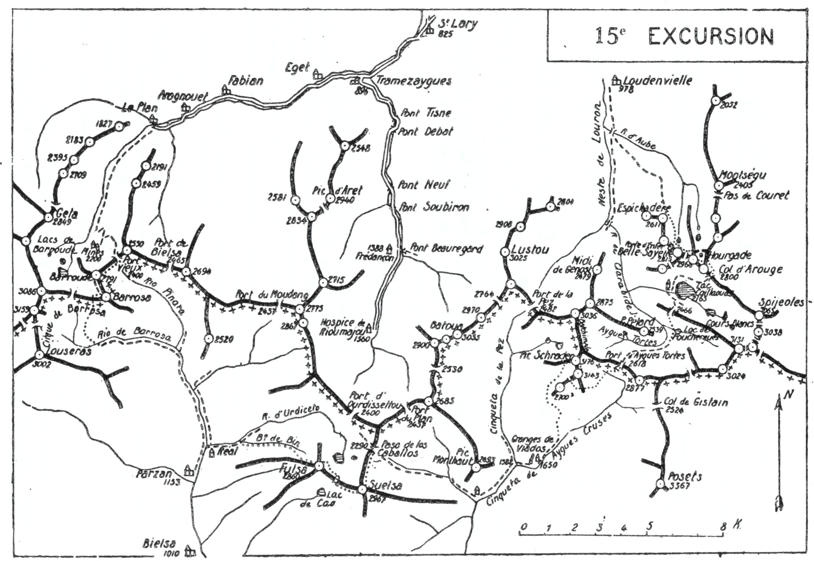
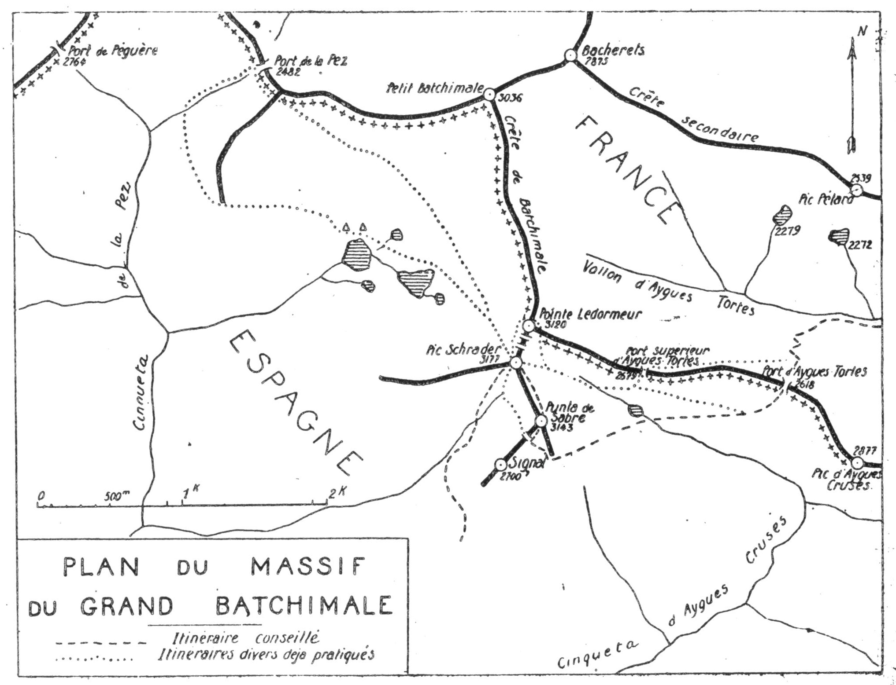
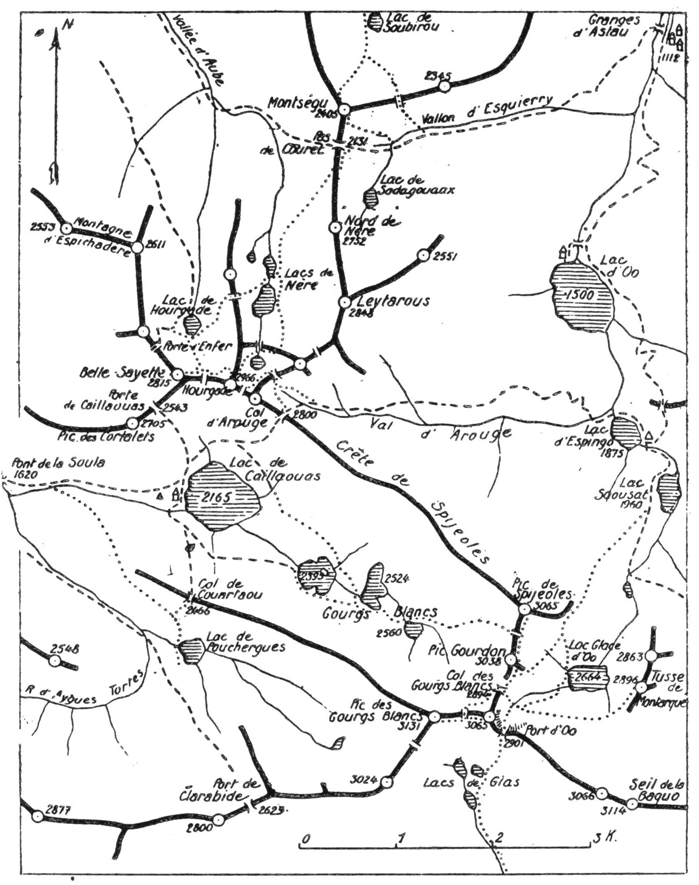

<style>.centre {text-align: center}</style>
<style>.droite {text-align: right}</style>
<style>.notedroite {text-align: right; font-size:10px; }</style>

-----------------------
[//]: # (— p. 191 —)

— p. 191 —

# QUINZIÈME EXCURSION

(N° 12 de la 1° édition)

__Quatre jours au départ de Saint-Lary__

_B. E. — Du 15 Juillet à fin Août._

Cartes à emporter : Luz et Gavarnie réunies, Bagnères-de-Luchon et Val d'Arouge réunies.

__De SAINT-LARY à LOUDENVIELLE,__\
__par le Port Vieux,__\
__le Pic de Barroude, le Pic et le Cirque de Barrosa, Parzan.__\
__La Punta Fulsa, La Suelsa,__\
__le Pic Schrader ou Grand Batchimale, le Lac de Caillaouas,__\
__le Pic de Hourgade et la Belle-Sayette.__

<u>__AVIS AUX TOURISTES__</u>

Un guide est indispensable pour toute l'excursion.

Les régions du Batchimale et de Caillaouas, peu familières
aux guides ordinaires des autres contrées, sont très connues
de ceux de Loudenvielle. Pour cette raison, et à moins qu'on
n'ait déjà un guide attitré, on fera bien de le prendre dans
cette commune, en lui donnant rendez-vous à Saint-Lary pour
la veille au soir du départ.

(On emportera des conserves pour cinq repas.)

<p class="droite">(Voir ci-contre la Carte de l'Excursion).</p>

Voir, page 198, le plan du Massif du Batchimale et
voir aussi, page 202, la carte des régions de Caillaouas,
du Hourgade, des Gourgs-Blancs, d'Espingo et d'Oô.

———\
(1) Saint-Lary (H.-Pyr.), à 12 k. de la gare d'Arreau, est desservi
deux fois par jour par un autobus, en attendant la construction
d'un tramway électrique.


<div class="page"/>


— p. 192 — DE SAINT-LARY A LOUDENVIELLE (15me EXCURSION)



<div class="page"/>


— p. 193 —  (15me EXCURSION) VALLEE DE LA GELA
 
## PREMIÈRE JOURNÉE

__De SAINT-LARY (825m) à PARZAN (1.153m).__\
__par la Vallée de la Géla,__\
__le Port Vieux (2.1400m), le Pic de Barroude (2.791m),__\
__le Pic et le Cirque de Barrosa.__

—— GUIDE INDISPENSABLE ——

__Conseils.__ — __Itin. recomm.__ — On partira de bon matin et, pour
gagner 1 h. et ménager ses forces, on se fera conduire en voiture
jusqu'à Aragnouet (12 k.), au terminus de la route, près de
l'église (1). Un chemin de chars continue jusqu'au Plan d'Aragnouet. 
Après avoir franchi la Neste, on monte au hameau de
Chaubère où on coupe le ruisseau de Saux qui descend du port
de Bielsa; quelques min. après, on en laissera le sentier à g. pour
continuer jusqu'en face du Plan.

Au Plan d'Aragnouet, la vallée bifurque : la branche de dr.
remonte la Neste de Badet vers la Hourquette de Campbieil; celle
de g. qui continue devant soi, direction S.-O., est la vallée de la
Géla; elle conduit à la frontière, au Port Vieux (2.400m), et au
Port de Barroude (2.542m). On n'arrivera pas au Plan qu'on laissera 
à dr., sur l'autre rive. D'ailleurs, à la bifurcation du chemin,
on trouve un poteau indicateur pour les deux directions.

Le chemin de la Géla qui remonte la rive dr. du ruisseau de
ce nom, s'élève en pente douce jusqu'aux pâturages du cirque supérieur. 
A 40 min. du Plan, au lieu dit la « Lavasse », on trouvera 
une belle colonie d'étoiles des neiges au-dessous et au-dessus
du chemin. Si on en cueille, on aura soin de couper la fleur sans
déraciner le pied; une plante arrachée est une plante perdue.

Un peu plus haut, un portail en fer barre le passage; on aura
soin de le refermer, car il est destiné à empêcher les bestiaux
d'entrer dans la région affermée par la Société de l'aménagement
des Montagnes.

A l'entrée du cirque de la Géla, le chemin du Port de Barroude

———\
(1) La commune d'Aragnouet, qui s'étend sur 9 k., comprend les
hameaux d'Eget, de Fabian, de Castets, de Chaubère et du Plan. Le
bureau de poste est à Fabian.


<div class="page"/>


— p. 194 — PICS de BARROUDE et de BARROSA (15me EXCURSION)

franchit le ruisseau pour remonter les pentes de la rive g. Celui
du Port Vieux continue presque horizontalement, direction S.,
jusqu'aux baraques des dépôts de la mine de la Géla. Là, il tourne
un peu à g. et, en de multiples lacets, grimpe directement au Port
Vieux, en laissant à dr. les bâtiments et les chantiers de la mine.
On peut visiter cette dernière au passage; c'est l'affaire de 1/2 h.

Par suite des travaux d'amélioration effectués par la Société
des mines de Parzan dans le chemin qui passe au Port Vieux.
celui-ci est maintenant le plus commode pour aller de la haute
vallée d'Aure à Bielsa. Le Port Vieux est d'ailleurs le plus bas de
la région.

Immédiatement après de port, on tournera à dr., au S.-O., pour
suivre la crête frontière en se tenant sur le versant espagnol, afin
de grimper au Pic de Barroude (2.791m) surmonté d'une tourelle.

Quoique de moyenne alt., ce sommet est un admirable belvédère. S'avançant comme une proue de navire sur les cirques de
Barroude et de la Géla, il domine majestueusement une région
des plus intéressantes. On a, en face, à l'O., la longue et terrifiante 
muraille de Troumouse dont une partie plonge dans les lacs
glacés de Barroude. (V. 10° E., p. 136.) Au S., à environ 1 k., on
aperçoit un sommet d'égale alt. qu'une crête facile relie au Barroude; 
c'est le pic de Barrosa qui fait pendant, pour le versant
espagnol, au belvédère du Pic de Barroude pour le versant français. 
En 3/4 d'h., on peut aller d'un pic à l'autre à toute crête.

De son sommet, on domine, au S.-O., tout le cirque de Barrosa
et à l'E., le vallon de Pinara. Dans cette dernière direction, l'œil
embrasse en éventail tous les ports de la crête frontière, depuis
le Port Vieux jusqu'à celui d'Ourdissettou. Le massif des Puntas
Suelsa et Fulsa, qui est tout près, paraît des plus imposants. La
voie d'ascension à la Punta Fulsa par le Barranco de Bin se découvre 
presque en entier. Mais ce qui retient surtout l'attention,
ce sont les grands pics de Troumouse, de Serre-Mourène et de la
Munia qui, vus de là, ont des allures de géant. Descendant au
S.-O., on rejoindra bientôt le sentier qui, venant du Port de Barroude 
(2.542m), plonge dans le cirque de Barrosa dont il franchit
le ruisseau pour passer rive dr. On jouira pendant cette descente
d'un nouveau spectacle non moins impressionnant. Au N.-O., en
deux gradins superposés, une muraille d'environ 1.500 m. de hau-


<div class="page"/>


— p. 195 — (15me EXCURSION) - PUNTA FULSA 

teur monte presque verticalement jusqu'à la crête de la Munia
qui se profile sur le ciel. Rien n'est plus imposant.

On continuera par le vallon de Barrosa et bientôt on arrivera
au confluent du ruisseau de Pinara où l'on rejoint le sentier des
Port Vieux et de Bielsa. A partir de là, la vallée se dirige au S. et
on descend en pente douce en longeant le torrent jusqu'à Parzan,
où on couchera.

Parzan est situé à l'O. du chemin de Bielsa, sur une hauteur, à
1.153 d'alt.; il y a quelques provisions. Il faudra en repartir avec
du pain et du vin pour deux jours, puisqu'on n'en retrouvera
qu'au Lac de Caillaouas.

__Horaire de la Journée :__

``` 
De Saint-Lary à Aragnouet (12 k. de route).  }
D'Aragnouet au Pic de Barroude........ 4h.15 }   8h.45
Du Pic de Barroude au Pic de Barrosa.. Oh.45 } (Arrêts en sus)
Du Pic de Barrosa à Parzan............ 3h.45 }
```

## DEUXIÈME JOURNÉE

__De PARZAN (1.153m) aux GRANGES de VIADOS (1.650m),__\
__par la Punta Fulsa (2.860m) et la Punta Suelsa (2.967m).__

—— GUIDE INDISPENSABLE ——

__Conseils.__ — __Itin. recomm.__ — Repartant par le chemin d'arrivée,
on franchira le ruisseau quelques min. après pour passer rive g.
et aboutir un peu plus haut aux granges de Réal. On est là au
confluent du ruisseau d'Ourdissettou le long duquel un sentier
monte au port de ce nom. On suivra ce sentier 1/2 h. environ,
jusqu'au débouché du Barranco de Bin qui vient de l'E., et par
lequel il faut monter. A partir de là, on ne trouve que des sentes
de moutons qui disparaissent tout à fait dans la partie supérieure.
Le vallon tourne alors au S.-E. et les pentes deviennent rapides;
la Punta Fulsa est droit devant soi, tout en haut. On grimpera
dans sa direction en appuyant un peu à dr. afin de gagner la
crête au S.-O. de la cime. On n'aura ensuite qu'à monter à toute
crête jusqu'au sommet.

Le panorama de la Fulsa (2.860m) est déjà très beau, puisque


<div class="page"/>


— p. 196 — PUNTA SUELSA (15me EXCURSION)

ce sommet pointu appartient à un massif qui réunit le double
avantage de l'isolement et de la haute alt.; mais c'est à la Suelsa,
plus élevée de plus de 100 m., qu'on jouira d'un des plus beaux
belvédères des Pyrénées.

De la Fulsa, une arête de 2 k. file droit au S.-E. et, après s'être
légèrement infléchie à moitié course, elle se relève dans un élan
magnifique jusqu'à la Punta Suelsa (2.967m). La vue d'un sommet
à l'autre est très belle, mais il me paraît impossible d'aller directement 
de la Fulsa à la Suelsa, tellement la crête est accidentée.
C'est donc par le versant N. qu'on repartira.

Après une petite descente au N.-E., on obliquera à dr., pour
contourner le contrefort N. par une corniche qui aboutit sous un
rocher coincé, au haut d'une cheminée; au bas de cette dernière,
on traversera une dalle assez délicate vers l'E. A partir de là,
on marchera presque horizontalement par des corniches faciles
pour aboutir à la plus basse échancrure de la crête où l'on passera 
sur le versant S. Cette profonde brèche est à 2.585 d'alt.;
dès qu'on l'a franchie, on a sous ses pieds le joli lac de Cao. On
n'aura qu'à reprendre l'ascension à flanc S. de crête d'abord, puis
à toute crête jusqu'à la Punta Suelsa (2.967m).

Le tour d'horizon de la Suelsa est l'un des plus grandioses des
Pyrénées. A l'O., l'œil suit la crête des Parets de Pinède qui le
conduit aux sommets imposants du massif calcaire; puis, en décrivant 
un cercle de g. à dr., on voit défiler la Munia, les Aiguillous, 
le Campbieil, l'Aret, le Batoua et le Batchimale qui sont tout
près, et enfin, le Perdighero et le Posets pour ne citer que les
principaux. Les abords immédiats du versant N. avec leurs nombreux 
lacs sont aussi de toute beauté; à l'O.-N.-O., la Fulsa semble 
une pyramide.

Bien peu de touristes visitent cet intéressant massif; cependant,
on peut en faire l'ascension depuis l'Hospice de Rioumajou en
10 h., aller et retour.

On descendra à toute crête, au N.-N.-E., vers le Paso de Los
Caballos (2.290m). Là, on trouve un sentier qui se dirige au S.-E.
et qui va rejoindre, 1 h. plus bas, celui qui vient du port du Plan.
On passera alors sur la rive g., et bientôt, on arrivera près des
ruines de l'Hospital-de-Gistaïn (1.495m), où on aboutit à la vallée
de la Cinqueta. On remontera celle-ci jusqu'au confluent des
Cinquetas de la Pez et d'Aygues-Cruses (1.582m). Là, on tournera


<div class="page"/>

— p. 197 — (15me EXCURSION) GRANGES de VIADOS

à l'E. et on ira coucher aux Granges de Viados (1.650m), à l'entrée 
du vallon d'Aygues-Cruses (1).

__Horaire de la Journée :__

```
De Parzan à la Punta Fulsa............ 4h.45 }  10h
De la Punta Fulsa à la Suelsa......... 1h.45 } (Arrêts en sus)
De la Suelsa aux Granges de Viados.... 3h.30 }
```

## TROISIÈME JOURNÉE

__Des GRANGES de VIADOS (1.650m) au LAC de CAILLAOUAS (2.165m),__\
__par le Pic Schrader ou Grand Batchimale (3.177m),__\
__le Vallon d'Aygues-Tortes,__\
__le Lac de Pouchergues (2.165m) et le Col de Couartaou (2.466m).__

—— GUIDE INDISPENSABLE ——

__Concernant le PIC SCHRADER ou GRAND BATCHIMALE.__

Voici un des plus importants massifs de la chaîne, un des
mieux situés et cependant un des moins visités. Ce n'est pas
parce qu'il est d'accès difficile, car les difficultés sont moyennes 
pour un pyrénéiste exercé, mais plutôt parce qu'il est loin
de partout. Il faut, en effet, d'où que l'on vienne, lui consacrer 
deux jours.

Sans avoir fait couler des flots d'encre comme son frère le
Balaïtous, quelques polémiques, très courtoises d'ailleurs, ont
été échangées à son sujet entre les maîtres du pyrénéisme,
non pour déterminer la meilleure voie d'ascension, mais pour
savoir si le point culminant du massif du Batchimale est en
Espagne ou à la frontière.

Pour celui qui a observé attentivement la structure de ce
massif, le doute n'est pas possible : le Grand Batchimale, ou
Pic Schrader, est bien en entier en Espagne, à environ 200 m.
de la frontière. Celle-ci suit la ligne de partage des eaux;
mais il faut reconnaître que, sur une longueur de plusieurs
centaines de m,., elle est formée d'une simple nervure de terrain 
dont la hauteur ne dépasse guère 1 m. L'erreur devient
très facile lorsque le vallon qui longe cette mince croupe est
garni de neige qui le nivelle à sa hauteur.

Avec MM. Schrader, de Saint-Saud et Ledormeur, je dis donc
que le Grand Batchimale est bien en Espagne.

L'erreur de Russell, des Cadier et de quelques autres grands
pyrénéistes provient de ce que, parvenus au Port d'Aygues-
Tortes, ils ont situé la frontière plus à l'O. Elle passe au port

———\
(1) Les Granges de Viados, non signalées dans les cartes, sont
situées 1/4 d'h. à l'E. . du confluent de la Pez, vers 1.650m d'alt., sur
la rive dr. de la Cinqueta d'Aygues-Cruses.


<div class="page"/>



même en continuant une ligne droite, direction N.-O., pour
monter à la crête du Batchimale à laquelle elle se soude,
environ 200 m. au N. du pic.

Entre ce point de jonction, qu'on nomme pointe Ledormeur
(3.120m) et le grand pic, sont entaillées deux brèches par où
passent les eaux qui se déversent en Espagne, soit par l'O. au
vallon de la Pez, soit par l'E., à celui d'Aygues-Cruses.

Le chaînon par lequel les Cadier sont montés à la Punta

<div class="page"/>

— p. 199 — (15me EXCURSION) PIC SCHRADER

del Sabré (1) et de là à toute crête au Pic Schrader, n'est qu'un
contrefort extrême de la crête S. du Batchimale qui meurt en
Espagne, au Vallon d'Aygues-Cruses (2).

__Conseils.__ — __Itin. recomm.__ — Cette journée d'excusion étant une
des plus longues, on partira dès qu'on pourra se conduire. On
prendra au-dessus des granges le sentier qui monte au N.-E. par
la rive dr. de la Cinqueta d'Aygues-Cruses. On le quittera 3/4 d'h.
après pour tourner à g., au N., afin de grimper par les pentes
gazonnées vers un plateau situé à la base du contrefort S. d'un
petit pic surmonté d'une tourelle (2.600m). Du haut de ces pentes,
on pourra repérer presque toute la voie d'ascension au Posets
par le vallon de Lardana et la face O. (V. 16° E.).

Après avoir contourné la base du contrefort par la g., on
aboutira à un couloir rapide qu'il faut traverser pour reprendre
la direction N. On montera alors par un large vallon qu'on coupera 
en diagonale, afin d'aboutir à la base des murailles, au /S.-O..
du grand pic. On n'aura plus qu'à grimper jusqu'à l'arête et de
là, à toute crête, jusqu'au Pic Schrader.

Le grand Pic de Batchimale a été gravi pour la première fois
par l'éminent géographe F. Schrader, en août 1878. En l'honneur
de ce grand pyrénéiste, on a donné son nom au sommet principal 
du massif du Batchimale qu'on connaît maintenant sous trois
appellations : « Pic Schrader », « Grand Batchimale » et « Pic
Pétard », comme le portent plusieurs cartes.

Le belvédère du Pic Schrader est de tout premier ordre et,
dans la région, je ne connais que celui du Perdighero qui rivalise
avec le sien.

On peut descendre au Port d'Aygues-Tortes par deux voies
différentes : 1° en suivant la crête N. jusqu'à la Pointe Ledormeur 
d'où on tournerait d'abord à l'E., puis au S., pour repasser
en Espagne jusqu'au port; 2° par la crête S. et la Punta del Sa-

———\
(1) La Punta del Sabré (3.143m) est à environ 400 m. au S. du grand
pic. Le 16 août 1912, avec mon jeune camarade Jean Duffour et le
guide luchonnais Jean Courrège, dit Zogue, nous avons élevé un
cairn de 1 m. sur ce sommet. Le lendemain, du haut du Posets, nous
avions da satisfaction d'apercevoir notre petite tourelle à l'œil nu.

(2) Le nom d'Aygues-Cluses, que M. de Saint-Saud donne au pic 2.877
et à la Cinqueta qui naît presque à sa base, me paraît le plus logique.
Mais, comme ce nom de lieu existe déjà plus à l'O., près de Barèges,
je conserve celui d'Aygues-Cruses, tel qu'il est porté dans les cartes,
pour éviter une confusion possible dans l'esprit du lecteur.


<div class="page"/>


— p. 200 — LAC de CAILLAOUAS (15me EXCURSION)

bré. Cette, dernière voie me paraît de beaucoup la plus intéressante, 
et c'est celle que je vais décrire.

Partant par la crête S., on découvrira son chemin à mesure
qu'on avancera; mais presque tout le trajet se fait à flanc E. de
crête jusqu'à la Punta del Sabré (3.143m). De ce sommet, se détache,
au S.-O., une crête qui conduit à une cime secondaire,
2.600m environ, surmontée d'une belle tourelle; c'est la cime
aperçue le matin. On suivra cette crête 10 min. environ jusqu'à
une petite brèche où on la quittera pour descendre à g., sur des
pentes rocheuses, direction S. On parviendra là sur de larges
corniches qui s'étagent à g. comme des balcons et sur lesquelles
on peut circuler comme sur une route. Par une marche à l'E.
en contournant un petit vallon, on rejoindra la partie inférieure
du contrefort S. de la Punta del Sabré.

De ce point, on domine le port supérieur d'Aygues-Tortes
(2.679m) situé à quelques min. au N. d'un petit lac qu'on a devant
soi. Le vrai part de ce nom (2.618m) est plus à dr. On descendra
vers l'E. jusqu'à 1a base du contrefort pour rejoindre le sentier
qui, venant des granges de Viados, monte au N.-E. au Port d'Aygues-
Tortes (2.618m). Le port passé, on descendra directement au
vallon d'Aygues-Tortes qu'on longera par la rive dr. jusqu'au
point où il tourne à g., au N.; là, on quittera le sentier pour monter 
à l'E. jusqu'au déversoir du lac de Pouchergues qu'on franchira. 
Se dirigeant ensuite au N., on traversera un chaos de pierraillle, 
afin d'aboutir à une pente gazonnée rapide qui grimpe au
Col de Couartaou (2.466m) (1). De là, on découvre subitement la
sombre nappe du Lac de Caillaouas, dans un décor impressionnant. 
Le touriste le plus pressé ne peut résister au plaisir de le
contempler longuement.

Le Lac de Caillaouas, qui mesure 40 hectares environ, est non
seulement un des plus grands, mais un des plus captivants des
Pyrénées. A l'heure du soleil couchant, lorsque les montagnes
qui l'entourent reflètent leurs cimes dorées dans le vert sombre
de ses profondes eaux, le spectacle est sublime vu du Col de
Couartaou. Les pentes qui l'encerclent plongent directement dans
le lac qui est inaccessible sur les 3/4 de son pourtour. Un petit

———\
(1) Le col de Couartaou est ouvert sur la partie inférieure de la
crête des Hermittans, qui sépare le vallon de Pouchergues de la
région des Gourgs-Blancs.


<div class="page"/>


— p. 201 — (15me EXCURSION) . COL D'AROUGE

sentier descend, à travers des pelouses, jusqu'à la passerelle du
déversoir, et quelques min. après, on arrive à la Maison des Ingénieurs 
où on couchera. On y trouve des lits et quelques provisions 
que les gardiens cèdent aimablement. (V. 17° E.).

__Horaire de la Journée :__

```
Des Granges de Viados au Pic Schrader... 4h.30 }
Du Pic Schrader au Port d'Aygues-Tortes. 2h.15 }    10h.30
Du Port d'Aygues-Tortes au Lac de Cail-        } (Arrêts en sus)
  laouas ............................... 3h.45 }
```

## QUATRIÈME JOURNÉE

__Du LAC de CAILLAOUAS (2.165m) à LOUDENVIELLE (978m),__\
__par le Col d'Arouge (2.800m),__\
__le Pic de Hourgade (2.966m), la Belle-Sayette (2.815m)__\
__et la Vallée d'Aube.__

—— GUIDE INDISPENSABLE ——

__Conseils.__ — __Itin. recomm.__ — On montera direction N. vers la
Porte de Caillaouas afin de gagner de l'alt. et, 1/2 h. après, on
obliquera à dr., à l'E., pour suivre le petit sentier qui contourne
le lac à une grande hauteur. Parvenu au N.-E., on aura devant
soi le large contrefort qui se détache au S.-O. du Cap d'Arouge et
se relève à la base par un rocher gris qu'on aperçoit de la Maison
des Ingénieurs. Quittant alors le sentier qui passe sous ce rocher,
on montera à g. en attaquant le contrefort en écharpe, afin
d'aboutir à mi-hauteur du couloir qui grimpe au Col d'Arouge.
Ce col est situé sur la crête du Spijeoles vers 2.800m d'alt. et au
S. du Cap d'Arouge (2.929m). C'est par là que passe le chemin
direct de Caillaouas à Luchon. On montera par la rive dr. du couloir, 
sauf dans la partie supérieure où on le traversera en diagonale 
pour atteindre directement le col (1).

Du Col d'Arouge., on obliquera à g. et, par une marche horizontale, 
en contournant le haut du Val d'Arouge, on aboutira au Col
de Nère. à peu près de même alt., au delà duquel dort un petit
lac glacé. Ce col sépare le département de la Haute-Garonne de

———\
(1) De ce point, on peut descendre à Espingo dans 2h.30 le
Val d'Arouge. (V. 19me E.)


<div class="page"/>


— p. 202 — ENVIRONS D'ESPINGO — PARTIE OUEST (15me EXCURSION)




CARTE des RÉGIONS de CAILLAOUAS, du HOURGADE,
des GOURGS-BLANCS, d'ESPINGO et d'OO.


<div class="page"/>


— p. 203 — (15me EXCURSION) HOURGADE — BELLE-SAYETTE


celui des Hautes-Pyrénées. On n'aura alors qu'à monter au N.-O.
et, dans 40 min. d'escalade facile, on atteindra le sommet du
Hourgade (2.966m).

L'impression ressentie au Hourgade est grande quand on découvre 
subitement sous ses pieds, à plus de 800 m. de profondeur, 
le beau lac de Caillaouas. En effet, la face S.-O. du Hourgade, 
qui est presque verticale, paraît en surplomb lorsqu'on
arrive au sommet. L'ascension n'offre pas la moindre difficulté
par les faces E. et N. (V. 19° E.).

Par l'admirable région qu'il domine, par sa haute alt. et son
éloignement de la chaîne frontière, le Pic de Hourgade est un belvédère 
de premier ordre. Accessible à des débutants, c'est un des
rares sommets qui procure des sensations inoubliables sans exiger 
de grands efforts.

Au N.-O., à environ 800 m., on aperçoit la pointe effilée de la
Belle-Sayette (2.815m) et une crête délicate, entaillée d'une profonde 
brèche à moitié parcours, relie le Hourgade à ce pic. On
peut aller d'un sommet à l'autre en restant sur le versant N.-E.

Si l'ascension du Hourgade par les Cols d'Arouge et de Nère
permet d'admirer les belles régions des Gourgs-Blancs, de Spijeoles, 
d'Arouge et de Nère, celle de la Belle-Sayette fera connaitre 
les impressionnantes profondeurs de la Gorge de Clarabide,
les beautés du vallon de Hourgade et les pentes fleuries de la
vallée d'Aube. Ainsi faite, cette journée d'excursion est l'une des
plus complètes en spectacles variés où le grandiose le dispute à
la coquetterie.

On quittera le Hourgade par l'arête N.-E. qu'on suivra à toute
crête pendant 10 min. environ. Tournant alors à g., on descendra 
vers l'O. par un long et facile ravin pierreux qui aboutit à la
crête principale, près de la profonde brèche. A partir de là, on
montera à flanc E. jusqu'à la Belie-Sayette (2.815m).

Vu de la Belle-Sayette, avec sa jolie tourelle qui se profile sur
le ciel, le Hourgade est magnifique. Mais ce qui attire surtout le
regard, c'est la pente vertigineuse du ravin de la Belle-Sayette
qui plonge presque verticalement de 1.600 m. sur le gouffre noir
de Clarabide. Sur le versant opposé, celui du vallon de Hourgade,
le contraste est frappant : l'œil descend vers les vertes pelouses
de l'Hourtiga, en s'arrêtant longuement sur les pentes fleuries
d'Espichadère et d'Aube.


<div class="page"/>


— p. 204 — VALLEE D'AUBE  (15me EXCURSION) 

Pour la descente, on reviendra sur ses pas 1/4 d'h. environ,
puis, on se dirigera au N.-O. vers le petit lac de Hourgade, afin
de rejoindre le sentier qui descend de la Porte d'Enfer.

On laissera le lac à dr. et on descendra par la rive g. Le sentier 
disparaît sur un parcours de 5 ou 600 m., mais on le retrouve 
plus bas à la base du contrefort N.-E. du Pic d'Espichadère 
(2.611m). A partir de là, on coupe plusieurs petits couloirs
avant d'aboutir sur les hauts pâturages d'Aube. On aperçoit au
fond du cirque la grange de l'Hourtiga par laquelle on pourrait
descendre; il vaut mieux poursuivre vers le N.-E., car, non seulement 
cette voie est la plus courte, mais aussi la plus intéressante.

Marchant presque toujours à découvert sur des pentes gazonnées 
faciles, on a constamment la vallée sous ses yeux, et on peut
descendre à sa fantaisie pour rejoindre le chemin muletier du
Lac de Caillaouas en amont du pont qui franchit le torrent
d'Aube.

Après le pont, un grand chemin de chars conduit dans 1/2 h.
à Loudenvielle. (V. 17° E.).

__Horaire de la Journée :__

```
Du Lac de Caillaouas au Pic de Hourgade. 3h.45 }
Du Pic de Hourgade à la Belle-Sayette... 1h.45 }   9h.30
De la Belle-Sayette à Loudenvielle...... 4 h.  } (Arrêts en sus)
```
 

<u>__POINTS D’INTERRUPTION__</u>

__GRANGES DE VIADOS__
- Pour rejoindre de Saint-Lary par l'Hospice de Rioumajou et le port de Cauouarère : 9h »
- Pour rentrer à Saint-Lary par cette voie : 8h. »
- Pour rejoindre de Loudenvielle par le Port de la Pez : 8 h. »
- Pour rentrer à Loudenvielle par cette voie : 7h. »
  
__LAC DE CAILLAOUAS__
- Pour rejoindre de Loudenvielle : 5h.15
- Pour rentrer à Loudenvielle : 4h. »

