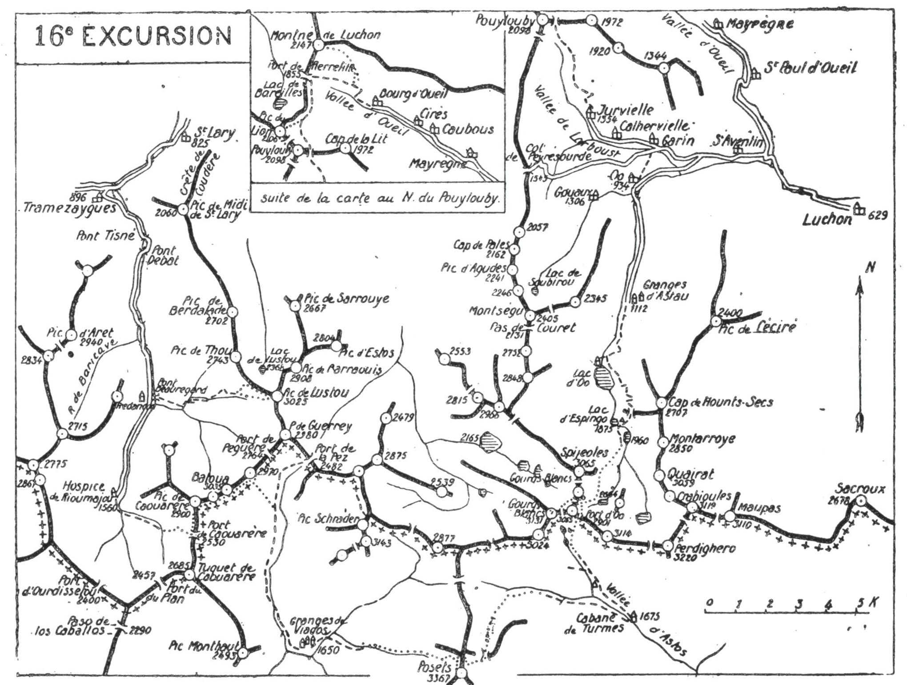
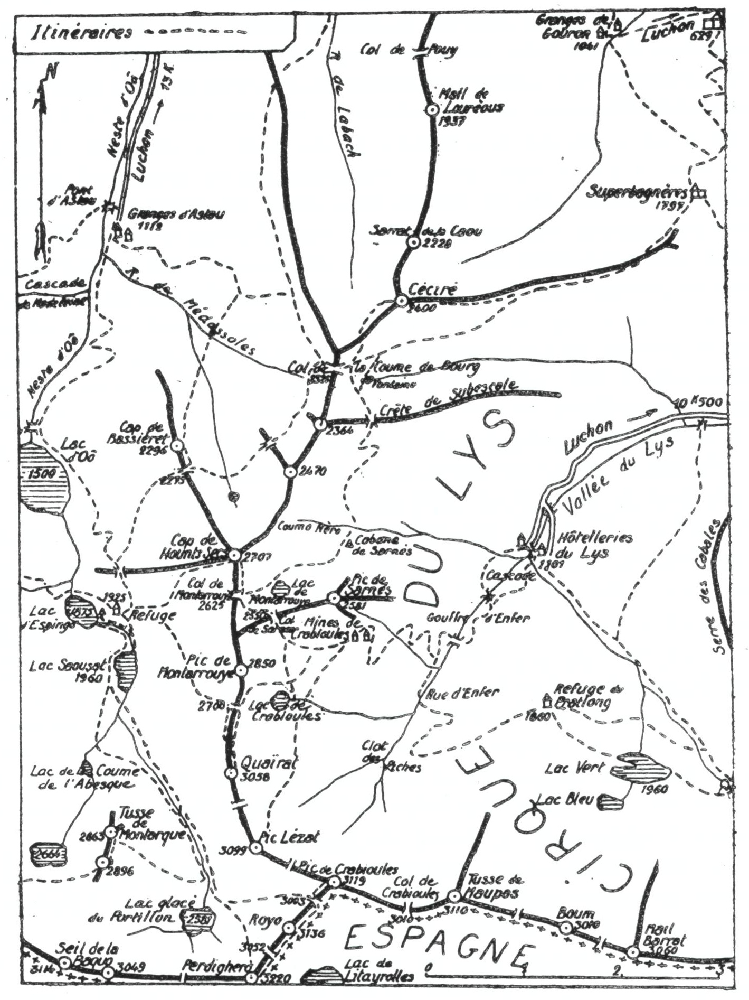

<style>.centre {text-align: center}</style>
<style>.droite {text-align: right}</style>

-----------------------
[//]: # (— p. 205 —)

— p. 205 —


# SEIZIÈME EXCURSION

(N° 13 de la 1re édition)

__Cinq jours au départ de Saint-Lary__

_B. E. — Du 15 Juillet à fin Août._

Cartes à emporter : Luz et Gavarnie réunies, Bagnères-de-Luchon et Val d'Arouge réunies.
 
__De SAINT-LARY (1) à LUCHON__<br>
__par le Lustou, le Batoua, le Posets, le Pic du Port d'Oô,__<br>
__le Pic des Gourgs-Blances, les lacs du Port d'Oô,__<br>
__de Saousat et d'Espingo, le Cap de Hounts-Secs__<br>
__et le Pic Lézat.__

<u>__AVIS AUX TOURISTES__</u>

Pour cette excursion de grande envergure, on emportera des
provisions pour six repas et les divers casse-croûte. Si on n'a
pas de guide attitré, on en prendra un des meilleurs à Luchon
ou à Loudenvielle, auquel on donnera rendez-vous à Saint-
Lary.

En raison de la quantité de vivres nécessaires, un porteur
est indispensable pour les deux premiers jours; on le prendra
à Saint-Lary même.

<p class="droite">(Voir ci-contre la Carte de l'Excursion).</p>

(Voir aussi les cartes des Environs d'Espingo, p. 202 et 214).

———<br>
(1) Saint-Lary (H.-Pyr.), à 12 k. de la gare d'Arreau, est desservi
deux fois par jour par un autobus, en attendant la construction d'un
tramway électrique.


<div class="page"/>

— p. 206 —  DE SAINT-LARY A LUCHON  (16me EXCURSION)



<div class="page"/>

— p. 207 —


(16me EXCURSION) VALLEE de RIOUMAJOU
 

## PREMIÈME JOURNÉE

__De SAINT-LARY (825m) à l'HOSPICE de RIOUMAJOU (1.560m),__<br>
__par le Lustou (3.025m) et la Vallée de Rioumajou.__

—— GUIDE INDISPENSABLE ——

Nota. — L'ascension du Lustou par la voie que je vais
décrire fait gagner près de 2 h. sur celle qu'indiquent les divers
guides : 1° parce que la pente est régulière de Saint-Lary au
sommet; 2° parce que le terrain d'ascension est des meilleurs
et qu'on monte à l'ombre jusqu'à 2.200 m. d'alt.

Par Azet et le vallon d'Arsoue, les ondulations du chemin
augmentent la différence de niveau à franchir et, de plus, en
amont du lac de Lustou, on ne peut éviter un terrain d'éboulis
des plus fatigants.

__Conseils.__ — __Itin. recomm.__ — On ne mettra dans son sac que ce
qui est nécessaire pour la journée; on fera monter le gros des
provisions à l'Hospice de Rioumajou par un âne accompagné
du porteur.

On partira de très bonne heure et on suivra la route d'Aragnouet 
jusqu'au 3° k. Environ 125 m. en amont du pont qui franchit 
le ruisseau de Rioumajou, on apercevra, sur la g., un petit
sentier qui grimpe par des prairies en laissant Tramezaygues
à dr.; c'est celui par lequel on est passé à la descente de l'Aret
(V. 10° E., p. 145). On le prendra et on ira rejoindre la route
du Rioumajou, environ 600 m. en amont du vill. A partir de là,
et sur une longueur de plus de 5 k., la gorge de Rioumajou est
d'une sauvage beauté. Comme entre Pierrefitte et Luz, la vallée de
Rioumajou n'a permis la construction d'une étroite route qu'en
changeant quatre fois de rive : au Pont Tisné, au Pont Debat,
au Pont Neuf et au Pont Soubiron. Ce dernier est situé au confluent 
de la vallée de Baricave qui s'ouvre à l'O. Là; l'état des
lieux correspond absolument à celui du Pont de Sia, entre Luz
et Gavarnie.

On suivra la route de l'Hospice jusqu'aux Granges de Frédancon 
(1.388m) où on tournera à g., à l'E., pour franchir le Rioumajou 
sur le Pont de Beauregard (1) et monter au vallon de Péguère.


———<br>
(1) Beauregard est le nom du complaisant propriétaire de la confortable 
grange située à l'O. du pont et où de nombreux touristes ont
trouvé une aimable hospitalité.


<div class="page"/>


— p. 208 — Le LUSTOU (16me EXCURSION)

De ce point, on apercevra en haut, à dr., l'imposant massif du
Batoua, dont les trois cimes sont souvent dans les nuages.

Un grand chemin de chars monte au S.-E., au vallon de
Péguère; on le suivra 20 min. environ jusqu'au pont qu'on ne
passera pas. Restant sur la rive dr. du torrent qu'on longera
pendant 10 min., on sautera bientôt le ruisseau de Lapiarre, afin
de remonter, par le tertre d'en face, à la sapinière de Thou. On
trouve là un sentier qui longe la rive g. du ruisseau de Lapiarre
jusqu'en haut de la forêt où il tourne à dr., à l'E., dans la direction 
du Lustou qu'on aperçoit.

On s'éloignera du ruisseau de Lapiarre pour remonter la rive
g. d'un ruisselet qu'on franchira 1/4 d'h. après; puis on attaquera 
les pentes gazonnées des pâturages de Thou. Pendant 1/2 h.
environ, on trouvera des sentes de moutons qui facilitent l'ascension, 
mais qui disparaissent bientôt vers 2.100 d'alt. On aura
devant soi, au N.-E. et à une grande hauteur, toute la crête du
Lustou vers laquelle il faut monter et on pourra en repérer toute
la voie d'ascension.

Comme on repassera là à la descente, on y laissera le sac, en
prenant soigneusement un point de repère pour le retrouver.
Repartant direction N.-E., on zigzaguera les pentes de Thou jusqu'à 
la crête qu'on rejoindra verticalement au-dessus du lac de
Lustou, vers 2.750 d'alt.; à partir de là, on montera à toute crête
jusqu'au sommet du Lustou (3.025m).

C'est à l'arrivée à la crête que le point de vue devient des plus
intéressants quand on découvre subitement le versant N. et les
rapides vallons de Lustou et d'Arsoue, vers Azet. Comme on est
dans l'axe de la partie inférieure de la vallée d'Aure et dans celui
de la vallée de la Neste, le regard poursuit la descente jusqu'au
plateau de Lannemezan. Ne serait-ce que pour jouir de cette vue
subite, l'excursion doit être faite par Frédancon.

Parvenu au sommet, tous les lointains se découvrent et le panorama 
est immense; il s'étend du Balaïtous au Montcalm et
comme le dit justement Russell, on a sous les yeux presque tous
les glaciers des Pyrénées. La vue n'est bornée qu'au S.-S.-O. par
le massif du Batoua.

Contrairement à ce que croyait Russell, on pourrait descendre
à l'E., au vallon de la Pez; mais je ne crois pas l'arête S. praticable
comme il l'indique dans son ascension au Batoua. Par la


<div class="page"/>

— p. 209 — (16me: EXCURSION) HOSPICE de RIOUMAJOU

base des murailles de la crête de Guerreys et le haut du cirque,
on irait facilement, dans 2 h., du Lustou au Port de Péguère
(2.764m) et de là, dans 1 h., à la cime du Batoua. Par la crête, en
admettant qu'elle soit praticable, on mettrait le double de temps.

La descente s'effectuera presque en droite ligne, du sommet du
Lustou au ruisseau de Lapiarre. Repartant par la crête du Lustou,
on arrivera en quelques min. au haut d'un couloir rapide de fins
éboulis qui plonge, au S.-O., vers un petit névé; on dévalera par
là, et on continuera droit à l'O. jusqu'au point où on a laissé le
sac. On n'aura alors qu'à suivre la voie d'ascension jusqu'aux
granges de Frédancon.

Là, on rejoindra la route qui, dans 1 h., conduit directement
à l'Hospice de Rioumajou (1.560m) où l'on couchera (1).

__Horaire de la Journée :__

```
De Saint-Lary aux Granges de Frédancon. 2h.30 }    9h.45
De Frédancon au Pic de Lustou.......... 3h.45 } (Arrêts en sus)
Du Lustou à l'Hospice de Rioumajou..... 3h.30 }
```

## DEUXIÈME JOURNÉE

__De l'HOSPICE DE RIOUMAJOU (1.560m)__<br>
__aux GRANGES de VIADOS (1.650m),__<br>
__par le Port de Caouarère (2.5302m), le Tuc de Caouarère (2.900m),__<br>
__le Batoua (3.035m) et la Cinqueta de la Pez.__

—— GUIDE INDISPENSABLE ——

__Conseils.__ — __Itin. recomm.__ — Si on n'a déjà la provision de pain
et de vin, on en prendra à l'Hospice pour deux jours et demi.

Partant au S. de l'Hospice, on tournera au S.-E. 10 min. après
pour franchir le Rioumajou au Pont de Caouarère, afin de remonter 
par la rive g. le vallon de ce nom. On suivra par là le
sentier du port du Plan jusqu'au moment où il fait un crochet
à dr., vers 2.100 d'alt. De ce point, le Port de Caouarère parait
à l'E.-S.-E. et on découvre les pentes qui y conduisent; on quittera 
donc le sentier du port du Plan pour grimper directement

———<br>
(1) L'Hospice de Rioumajou qui, jadis, laissait tant à désirer, est
maintenant très bien tenu par M. Soulan. On y trouve trois ou quatre
lits et des provisions.

<div class="page"/>

— p. 210 — Le BATOUA (16me EXCURSION)

à la crête de Caouarère. L'ascension sera un peu dure, mais par
là, on gagne près d'une h. sur le trajet du sentier qui fait un
long détour à l'O., avant de quitter celui du Port du Plan.

Parvenu au port, on prendra la direction N. et on montera à
toute crête au Tuc de Caouarère dont on aperçoit la tourelle
(2.900m). Le point de vue est déjà très beau, car on domine les
trois vallées de la Pez, de Péguère et de Rioumajou.

Au Tuc de Caouarère, l'arête que les cartes appellent « Crête
de Guerreys » (1) tourne direction N.-E., sur une longueur de
3 k., jusqu'au Port de Péguère (2.764m) où elle plonge presque
verticalement de plus de 200 m. Echancrée de trois brèches, elle
porte les trois cimes du Batoua (2.950m-3.035m-2.970m) (2). On suivra 
toute la crête en se tenant le plus souvent sur le versant espagnol.

Le massif du Batoua est l'un des plus impressionnants de la
chaîne. Son panorama est supérieur à celui du Lustou, surtout
vers le S., mais ce qui attire le regard, c'est la crête déchiquetée
du Batchimale qui est à deux pas, de l'autre côté de la vallée.
C'est du Batoua qu'on aperçoit bien les deux brèches qui séparent 
le Pic Schrader de la crête frontière. Que ceux qui ont encore 
des doutes sur la nationalité du Grand Batchimale montent
au Batoua; ils seront tout de suite édifiés.

Du sommet principal, on passera à toute crête jusqu'à la pointe
2.970 pour compléter le point de vue des abords immédiats.
Tournant ensuite à dr., on descendra sur le versant espagnol, direction
S.-E., afin de rejoindre, au fond de la vallée, le sentier
qui longe la Cinqueta de la Pez par la rive dr. A partir de là, on
n'aura qu'à suivre le chemin de Gistaïn jusqu'au confluent de la
Cinqueta d'Aygues-Cruses où on tournera à l'E., pour aller coucher 
aux granges de Viados (V. 15° E., p. 197).

Nota. — Le porteur ne montera pas au Batoua. Du Port de
Caouarère, il descendra directement à l'E., au fond de la vallée 
espagnole de la Pez, où il attendra la caravane sur le sen-

———<br>
(1) On ne s'explique pas cette dénomination, puisque le pic de Guerreys 
est à 1 k. au N.-E. du Port de Péguère. C'est donc la crête qui va
de ce dernier port au Lustou qui est la vraie Crête de Guerreys. Celle
du Batoua domine les régions de Péguère et de Laniscoude; elle
devrait donc porter l'un de ces deux noms, si on ne veut lui donner
celui de Batoua.<br>
(2) La pointe N.-E. cotée 2.970, est désignée par les gens du pays
sous le noin de « Pic Balinet ».


<div class="page"/>


— p. 211 — (16me EXCURSION) Les GRANGES De VIADOS

tier. Cependant, s'il connaît déjà le chemin, il pourra filer
directement jusqu'aux granges de Viados pour y préparer le
gîte.

__Horaire de la Journée :__

```
De l'Hospice au Port de Caouarère....... 3h. » }
Du Port au Tuc de Caouarère............. 1h.15 }   9h.15
Du Tuc de Caouarère au Batoua........... 0h.50 }
Du Batoua à la Pointe 2.970............. Oh.40 } (Arrêts en sus).
De la Pointe 2.970 aux Granges de Viados.3h.30 }
```

## TROISIÈME JOURNÉE

__Des GRANGES de VIADOS (1.650m)__<br>
__aux CABANES de TURMES (1.675m), par le Posets (3.367m).__

—— GUIDE INDISPENSABLE ——

__Conseils.__ — __Itin. recomm.__ — C'est des granges de Viados qu'on
renverra le porteur, en lui payant l'indemnité de retour de la
troisième journée.

On prendra, au N.-O., le sentier du Port d'Aygues-Cruses qui
remonte la Cinqueta par la rive dr.; environ 10 min. après, on
le quittera pour franchir le torrent, à dr., sur un pont en troncs
de sapins. On trouve là un nouveau sentier qui monte, au N.-E.
vers les pâturages d'El Clot où la cabane tombe en ruines. On
laissera cette dernière à g., et on montera en écharpe, direction
E.-N.-E., en coupant deux petits ruisseaux qui descendent des
pentes du pic de Las Espades (3.326m). Bientôt on arrivera au
grand torrent de Lardana qu'on franchira et on montera encore
10 min., direction N.-E. A partir de là, on quitte les pâturages
pour attaquer le rocher et l'ascension se continue, direction E,
par la rive dr. du torrent. Parvenu en vue du glacier O du Posets,
vers 2.800 d'alt., on grimpera à g., par une pente rude qui aboutit
au glacier supérieur situé au N.-N.-O. du pic, vers 3.100 m. C'est
là qu'on rencontre le plus mauvais terrain de la journée. |

Dans un plateau assez incliné, la pierraille s'incruste dans la
glace vive, ce qui en facilite l'ascension; mais, pendant 3/4 d'h.
il faut une attention soutenue et de grandes précautions pour
gravir ces pentes sans s'écorcher. On gagnera enfin la crête, à
environ 500 m. au N. de la tourelle, où on déposera le sac.


<div class="page"/>


— p. 212 — Les POSETS (16me EXCURSION)

On n'aura plus qu'à suivre l'arête S. à toute crête jusqu'au
signal (3.367m).

Second de la chaîne par son alt., le Posets serait l'un des premiers 
par l'immensité de son panorama, si la crête frontière ne
lui masquait une partie des plaines de France. J'en diminuerais
la grandeur en essayant de le décrire. Qu'il me suffise de dire
qu'on a toutes les Pyrénées sous les yeux, depuis le Pic de Midi
d'Ossau, jusqu'aux monts catalans.

Après avoir retrouvé le sac, on suivra pendant quelques min.
l'arête N., puis on prendra, au N.-E., la cheminée qui plonge vers
le glacier de Paül. Cette descente paraît effrayante vue d'en haut;
en réalité, elle n'offre pas de difficulté à un pyrénéiste exercé.
Elle ne demande que 1/2 h. d'attention.

Selon l'état du glacier, on pourra descendre, soit verticalement
si la rimaye n'est pas trop ouverte, soit en suivant à dr., à mi-
hauteur, une vire en pente douce qui facilite le débarquement.
Ce ne sera àprès qu'une succession de glissades à g., vers le Col
de Paül, au-dessous duquel le glacier continue encore 2 ou 300 m.

Après une descente de quelques min. au N. vers le haut de la
vallée d'Astos, on trouvera un sentier qui file à l'E., à flanc de
montagne et qui, par la rive dr. de la vallée, conduit directement
à la grande cabane de Turmes (1.675m) où l'on couchera.

__Horaire de la Journée :__

```
Des Granges de Viados au Posets..... 5h.45 }   9h.30
Du Posets aux Cabanes de Turmes..... 3h.45 } (Arrêts en sus).
```

## QUATRIÈME JOURNÉE

__Des CABANES de TURMES (1.675m) à ESPINGO (1.925m).__<br>
__par le Port d'Oô (2.901m), le Pic du Port d'Oô (3.065m),__<br>
__le Pic des Gourgs-Blancs (3.131m), le Lac Glacé (2.664m)__<br>
__et le Lac Saousat (1.960m).__

—— GUIDE INDISPENSABLE ——

__Conseils.__ — __Itin. recomm.__ — Après avoir franchi le pont de
Turmes, on remontera la vallée d'Astos par la rive g. jusqu'à la
cabane du Soldat, située au confluent du ruisseau de Gias qui
descend des lacs de ce nom. Prénant alors la direction N.-N.-O.

<div class="page"/>


— p. 213 — (16me EXCURSION) PORT d'Oô ET PIC des GOURGS-BLANCS

on suivra la rive g. du ruisseau jusqu'aux trois petits lacs d'où
on montera, au N., au Port d'Oô (2.901m).

Si l'on veut jouir de l'un des plus beaux tours d'horizon des
Pyrénées, il faut faire successivement l'ascension du Pic du Port
d'Oô, à cause de ses abords immédiats vers l'E. et celle du Pic des
Gourgs-Blancs pour les lointains.

Du Port d'Oô, on tournera à g., au N.-O., et par une marche
horizontale par le haut de la Coume glacée, on aboutira à la base
des escarpements N. du pic du Port d'Oô, où on déposera le sac.
On contournera ces escarpements vers l'O. en s'élevant légèrement, 
afin d'aboutir au ravin qui descend de la brèche située
entre le pic du Port d'Oô et celui des Gourgs-Blancs. On grimpera
par une pente rapide en contournant un gendarme, et on atteindra 
la brèche où on passera sur le versant espagnol. En 10 min.
d'escalade à l'E., sur d'excellent granit, on arrivera au Pic du
Port d'Oô (3.065m).

C'est par erreur que la carte d'Etat-Major attribue 3.114 m.
à ce sommet. Cette alt. est celle du Seil de la Baquo, plus à l'E.

Du Pic du Port d'Oô, on reviendra à la brèche et on fera, à
l'O., le Pic des Gourgs-Blancs (3.131m), partie à toute crête, partie
à flanc S. On redescendra par la voie d'ascension et, après avoir
retrouvé le sac, on suivra, au N.-E. la crête de neige du Col des
Gourgs-Blancs (V. 17° E., p. 223), pour aboutir sur le flanc E. du
Pic Noir ou Pic Gourdon (3.038m). On prendra ensuite la direction 
N. en laissant à dr. le Lac Glacé du Port d'Oô (2.664m).

Aux pentes E. du Pic Noir, succèderont les rudes escarpements
N.-E. du Pic de Spijeoles, assez délicats à passer. On aura soin
de ne pas trop descendre et de laisser très bas, à l'E. le lac de la
Coume de l'Abesque, afin d'aboutir au sentier qui mène directement 
à Espingo par la rive g. du Lac Saousat.

En cours de descente depuis le Col des Gourgs-Blancs, on aura
apercu plusieurs fois la bâtisse du nouveau refuge d'Espingo
qui est situé à 160 m. à l'E. du lac de ce nom.

Autrefois, Espingo, avec sa vieille cabane, n'était qu'un lieu de
passage, tandis qu'à présent, grâce au nouveau refuge, c'est un
magnifique centre d'excursions (1).


———<br>
(1) Voir du même auteur : Espingo et le Cirque d'Oô, brochure de
40 pages contenant 12 itinéraires, 2 cartes et une vue du refuge.


<div class="page"/>


— p. 214 — ENVIRONS D'ESPINGO - PARTIE EST (16me EXCURSION)



Au Chalet-Hôtel d'Espingo, on trouve des lits, des provisions
et des repas à des prix modérés. Voir à la 18° Excursion la Notice
sur le Refuge d'Espingo.

<div class="page"/>


— p. 215 — (16me EXCURSION) CAP de HOUNTS-SECS

 
__Horaire de la Journée :__

```
De Turmes au Port d''Oô............ 4h. » }
Du Port au Pic du Port d'Oô........ 1h. » }   8h.15
Du pic du port d'Oô au Pic des Gourgs-    } (Arrêts en sus).
  Blancs   .............................. }
Du Pic des Gourgs-Blancs à Espingo. 2h.25 }
```

## CINQUIÈME JOURNÉE

__D'ESPINGO (1.925m) à LUCHON (629m),__<br>
__par le Cap de Hounts-Secs (2.707m), le Col de Mon-__<br>
__tarrouye (2.625m), le Col de Sarnès (2.550m), le Pic Lézat (3.099m),__<br>
__les Mines de Crabioules, la Rue d'Enfer (1.576m)__<br>
__et la Vallée du Lys.__

—— GUIDE UTILE ——

__Conseils.__ — __Itin. recomm.__ — Comme cette journée d'excursion
est très longue, on partira dès qu'on pourra se conduire. Du
refuge, on se dirigera droit à l'E., en s'élevant insensiblement,
afin d'aboutir à la base du ravin gazonné qui descend du Col de
Montarrouye (1). On aperçoit ce ravin en entier du Lac Saousat,
car il est dans son axe.

Aprés avoir zigzagué le ravin dans son centre pendant 20 min.,
on obliquera carrément à g., direction N., vers un petit plateau
où gisent les débris d'une ancienne cabane. Continuant devant
soi, on fera plusieurs lacets, afin de rejoindre le chaînon O. du
Hounts-Secs à une légère dépression de l'arête, vers 2.500 m. d'alt.
Là, on découvre subitement le Lac d'Oô sous soi, à 1.000 m. de
profondeur, puis, plus bas et plus loin, les vallées d'Astau et de
Larboust.

A partir de ce point et jusqu'au Cap de Hounts-Secs, la crête
est des plus faciles; on peut la suivre tantôt par le flanc S., tantôt
par le flanc N. et finalement à toute crête. Ce trajet d'environ 1 h.
est des plus captivants. A mesure qu'on avance, l'horizon change
et de nouveaux spectacles surgissent de toutes parts. C'est d'abord
le vallon fleuri de Médassoles qu'on découvre en rejoignant la
crête qui se détache à g., vers le Cap de Bassiéret, puis le Céciré

———<br>
(1) Le Col de Montarrouye (2.625m), peu caractérisé, est une simple
dépression de la crête qui va du Pic de Montarrouye (2.850m), au S.,
au Cap de Hounts-Secs (2.707m), au N.


<div class="page"/>


— p. 216 — COLS de MONTARROUYE et De SARNES (16m EXCURSION)

et le Cirque du Lys; enfin, une infinité de grandes cimes environnantes 
et lointaines. L'Hôtel de Superbagnères paraît à deux
pas.

Bien que le Cap de Hounts-Secs soit un sommet de second
ordre, on y jouit cependant d'un splendide panorama. C'est sur
sa cime qu'il faut monter pour apercevoir à la fois et dans toute
leur splendeur les trois lacs superposés d'Oô, d'Espingo et de
Saousat.

Au S. et au S.-O., les crêtes aériennes du Perdighero, du Seil
de la Baquo, du Port d'Oô, du Spijeoles, ainsi que les glaciers
figés sur leurs flancs, sont d'une incomparable beauté. Au N. se
creuse le riant vallon de Médassoles et, dans les lointains, paraissent 
de nombreux villages du Larboust et de la vallée d'Oueil.
A l'E. et au S.-E., le Cirque du Lys étale ses verdoyantes parures
à travers les ondulations qui captivent longuement le regard.

Dans moins de 10 min., on ira de la tourelle du Cap de Hounts-
Secs au Col de Montarrouye situé plus au S.; un petit sentier y
descend en suivant la crête par le versant E.

A environ 400 m. au S.-E. du Col de Montarrouve, s'ouvre à
angle droit un autre large col gazonné (1), vers 2.550 m. d'alt.,
c'est le Col de Sarnès, situé entre le pic de ce nom (2.581m), à
l'E., et le Pic de Montarrouye (2.850m), au S.-O. On ira d'un col
à l'autre en contournant par le flanc et presque horizontalement
le haut du vallon.

Au Col de Sarnès, s'amorce un sentier qui descend au S.-E.
vers les Mines de Crabioules et la Rue d'Enfer; on le suivra pendant 
cinq ou six min., puis on le quittera par la dr. pour continuer, 
direction S., à flanc de montagne. On longera la base du
contrefort E. du Quaïrat, après lequel on s'élèvera vers le ravin
rapide qui grimpe au col situé entre ce dernier pic et le Lézat.
Montant alors en diagonale vers la g., on traversera le ravin et le
petit névé qui lui fait suite, afin d'aboutir près d'une corniche
qui mène à la large face E. du Lézat.

On pourra laisser le sac à la corniche.

A partir de la corniche, on grimpera droit au sommet sans la
moindre difficulté.

 
———<br>
(1) Certains Luchonnais soutiennent que c'est là le vrai Col de
Montarrouye ; à mon avis, il est plus logique de l'appeler Col de Sarnès :
1° parce qu'il est très voisin de la montagne de Sarnès ; 2 parce qu'il ne
pourrait y avoir deux cols du même nom dans une même montagne.

<div class="page"/>

— p. 217 — (16me EXCURSION) PIC LEZAT — RUE D'ENFER

Comme le Quaïrat et le Crabioules, le Lézat est un belvédère
de premier ordre, surtout sur les cirques d'Oô et du Lys. Ce sommet 
qu'on appelait autrefois « Intermédiaire» ou « du Passage »,
porte maintenant le nom du grand pyrénéiste Lézat qui est l'auteur 
du magnifique plan en relief qu'on admire à Luchon.

Après avoir repris le sac, on descendra droit au N.-N.-E., afin
de rejoindre, en amont des Mines de Cabrioules, d'abord, le sentier 
quitté tout à l'heure, puis celui qui vient de la Coume de
Bourg (V. 19° E.). Ce dernier conduit directement à travers les
anciennes mines, au nouveau refuge du Club Alpin, duquel on
domine merveilleusement la Rue d'Enfer.

Grâce au don de la principale baraque, par la Compagnie
d'Electricité Industrielle, le Club Alpin Français a pu aménager
là, vers 2.000 m. d'alt., un nouveau refuge des plus utiles, aussi
bien pour les pyrénéistes des hautes cimes que pour les touristes 
de moyenne montagne. Le refuge comprend une pièce, pourvue 
de quatre bats-flancs où peuvent coucher une vingtaine de
personnes.

Pour descendre à la Rue d'Enfer, on suivra le sentier qui, après
avoir fait un crochet vers l'E. en quelques lacets, prend définitivement 
la direction N. On circulera alors à travers un parterre
fleuri jusqu'à la Rue d'Enfer.

Après avoir coupé un ravin où coule un torrent rapide, le sentier, 
mieux tracé, dévale en une douzaine de lacets jusqu'au chemin 
qui monte de la Vallée du Lys qu'il rejoint cinq min. en
aval de la Rue d'Enfer.

Déposant là le sac, on remontera à dr., pour visiter la Rue
d'Enfer; puis, on descendra à l'Hôtellerie du Lys (1.101m), où on
rejoindra la grand'route à 11 k. de Luchon. Cette descente magnifique 
marque l'une des plus belles heures de la journée.

Elle montre au passage la dégringolade vertigineuse de l'un des
plus impétueux torrents d'Europe, avec son gouffre d'Enfer et la
cascade du même nom; tout cela, dans un décor unique. A chaque 
tournant du sentier près des gouffres, on entend les mugissements
tumultueux du torrent contre les parois rocheuses qui
l'emprisonnent et le canalisent jusqu'à la vallée qu'il rejoint par
les formidables bonds du Gouffre et de la Cascade d'Enfer.

De la Rue d'Enfer, le chemin descend pendant une demi-h., en
de nombreux lacets, par la rive g., jusqu'au pont supérieur (Pont
Nadié) (1.375m) où il passe rive dr. On fera là une petite halte


<div class="page"/>


— p. 218 — GOUFFRE d'ENFER — VALLEE du LYS (16me EXCURSION)

pour admirer l'élan vertigineux des eaux du Gouffre d'Enfer;
mais, c'est cinq min. plus bas qu'on trouve le spectacle le plus
impressionnant.

Au grand tournant de g. qui ramène près du torrent, succède :
un escalier sans rampe aboutissant au « Promontoire Julien Sacaze » 
qui se dresse au milieu de l'abime; c'est de là qu'on aperçoit 
le mieux, dans sa terrifiante beauté, le Gouffre d'Enfer et
son panache argenté.

On continuera la descente jusqu'au pont inférieur (Pont de
Rouge) qu'on franchira, afin d'arriver par la rive g. à l'Hôtellerie
du Lys. Depuis les catastrophes de 1925 et 1926, les ponts et les
passerelles du Lys ayant été emportés, le passage par le sentier
de la rive dr. n'est pas toujours possible.

A l'Hôtellerie du Lys, on trouve ordinairement des places dans
l'une des nombreuses voitures qui rentrent le soir à Luchon.

__Horaire de la Journée :__

``` 
D'Espingo au Cap de Hounts-Secs........ 2h.30 }
Du Hounts-Secs au Pic Lézat............ 2h.30 }   10h.15
Du Pic Lézat à la Rue d'Enfer.......... 2h.   } (Arrêts en sus)
De la Rue d'Enfer à Luchon............. 3h.15 }
```

<u>__POINTS D'INTERRUPTION__</u>

__GRANGES DE VIADOS__ 

- 1er - Pour rentrer à Saint-Lary par le port de Caouarère et l'Hospice de Rioumajou : 8h
- Pour rejoindre par cette voie : 9 h.
- 2me - Pour rentrer à Loudenvielle par le Port de la Pez : 7h.
- Pour rejoindre de Loudenvielle par cette voie : 8h

__REFUGE D'ESPINGO__

- Pour rejoindre de Luchon, 1 h. d'auto et 2h de sentier
- Pour rentrer à Luchon, 4h.30 de marche dont 13 Km de route

Nota. — A Luchon, les bons hôtels sont nombreux; mais
je ne saurais trop recommander l'Hôtel de Bordeaux dont le
propriétaire, M. Saffores, membre du C. A. F., est plein de
sollicitude pour ses collègues.
