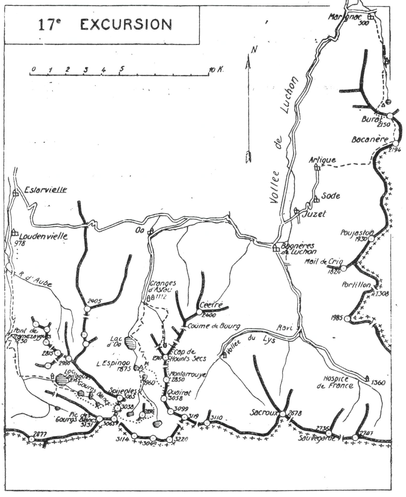

<style>.centre {text-align: center}</style>
<style>.droite {text-align: right}</style>

[//]: # (— p. 219 —)

# DIX-SEPTIÈME EXCURSION

(N° 14 de la 1re édition)

__Quatre jours au départ d'Arreau__

_B. E. — Du 15 Juillet au 15 Septembre._

Cartes à emporter : Bagnères-de-Luchon et Val d'Arouge réunies.

__D'ARREAU à LUCHON et à MARIGNAC__<br>
__par la Gorge de Clarabide,__<br>
__le Lac de Caillaouas, les Gourgs-Blancs, le Spijeoles,__<br>
__le Pic Gourdon, le Col des Gourgs-Blancs,__<br>
__la Tusse de Montarqué,__<br>
__le Quaïrat, le Montarrouye, Bacanère et le Burat.__

(Emporter des provisions pour quatre repas et les divers casse-croûte.)

<u>__AVIS AUX TOURISTES__</u>

Les récents travaux de MM. Eydoux, Maury et de Saint-Saud
ont rectifié la plupart des cotes d'alt. des régions de Caillaouas
et du Cirque d'Oô. J'ai adopté ces cotes définitives dans mon
guide.

<p class="droite">(Voir ci-contre la Carte de l'Excursion.)<br/>
(Voir aussi les cartes des Environs d'Espingo, pp. 202 et 214.)</p>

<u>__GOURGS-BLANCS et CIRQUE d'OO__</u>

La 17me Excursion va nous faire visiter, avec les Gourgs-
Blancs et le Cirque d'Oô, une des régions les plus riches en
glaciers et en sommets de haute alt. en même temps que l'une
des plus captivantes par l'harmonie de ses formes. C'est là
qu'on trouve la plus grande étendue de glace, car, si on allait
du Gourg-Blanc inférieur, à l'O., au lac de Litayrolle, à l'E., on
effectuerait un trajet de 10 k. environ sans la quitter. A cette

<div class="page"/>

— p. 220 — D'ARREAU A LUCHON ET A MARIGNAC (17me EXCURSION)
****



situation unique dans les Pyrénées, s'ajoute le spectacle grandiose 
du Cirque d'Oô couronné de 14 sommets, dont 11 dépassent 
3.000 m. C'est du belvédère central de la Tusse de Montarqué 
qu'on apercevra dans leur ensemble toutes les splendeurs 
du plus grand cirque glaciaire de la chaîne.

<div class="page"/>

— p. 221 — (17me EXCURSION) GORGE de CLARABIDE — LAC de CAILLAOUAS
****

## PREMIÈRE JOURNÉE

__D'ARREAU (698m) au LAC de CAILLAOUAS (2.165m),__<br>
__par la Vallée de Louron,__<br>
__Loudenvielle (9782m) et la Gorge de Clarabide.__

—— GUIDE UTILE ——

__Conseils.__ — __Itin. recomm.__ — Si on n'a pas couché la veille à
Arreau, on y arrivera par le premier train, afin de partir immédiatement
pour Loudenvielle (15 k.) par l'autobus.

Si, comme je le conseille, on a retenu un guide de Luchon, on
lui donnera rendez-vous pour déjeuner à Loudenvielle, à l'hôtel
Gros, et on repartira vers 13 h. au plus tard. On pourrait louer
un mulet pour monter les sacs au lac, ce qui augmenterait l'agrément 
en diminuant la fatigue.

On prendra, au S;, le grand chemin de chars et on remontera
la vallée par la rive dr. de la Neste de Louron jusqu'au pont de
Tramezaygues (1.230m), au confluent des Nestes de la Pez et de
Clarabide. Dix min. plus haut, on laissera à dr. le sentier du Port
de la Pez (2.482m) pour suivre, à g., le chemin muletier qui, en
de nombreux lacets à travers la forêt, monte jusqu'à la Santète
(1.590m), petite vierge placée à l'entrée du cañon de Clarabide
pour protéger les voyageurs. Nous entrons là dans une des nombreuses 
merveilles pyrénéennes.

A partir de la Santète, le chemin, taillé dans le roc même à
flanc de montagne et dominant le torrent d'environ 300 m., continue 
presque horizontalement pendant toute la traversée de
l'admirable gorge. Ce site seul vaut le voyage. La gorge franchie,
le sentier descend un peu pour sauter le torrent de Clarabide au
pont de la Soula (1.620m) et, quelques min. plus haut, on arrive
au confluent du ruisseau de Caillaouas. On quittera alors la Neste
de Clarabide et on montera à g., au S.-E., en suivant le grand
sentier qui conduit directement au Lac de Caillaouas (V. 15° E.).
p. 200).
 

__Horaire de la Journée :__

```
De Londenvielle au Pont de Tramezaygues.. 1h.45 }
Du Pont de Tramezaygues à la Santète..... 1h. » }  5h.15
De la Santète au Pont de la Soula........ 0h.30 } (Arrêts en sus).
Du Pont de la Soula au Lac de Caillaouas. 2h. » }
```

<div class="page"/>

— p. 222 — GOURGS-BLANCS — SPIJEOLES (17me EXCURSION)
****

## DEUXIÈME JOURNÉE

__Du LAC de CAILLAOUAS (2.165m) à ESPINGO (1.925m),__<br>
__par le Spijeoles (3.065m),__<br>
__le Pic Gourdon (3.038m), le Col des Gourgs-Blancs (2.896m)__<br>
__et la Tusse de Montarqué (2.896m).__

—— GUIDE INDISPENSABLE ——

__Conseils.__ — __Itin. recomm.__ — Partant par le chemin d'arrivée
de la 15° Excursion (V. p. 201), on passera le petit pont (1) situé
au-dessous du déversoir du lac pour remonter en face, direction
S.-E. Quelques min. après, on laissera, à dr., le petit sentier qui
grimpe au Col de Couartaou et on suivra, à g., celui qui s'élève
vers un rocher carré et blanc qu'on aperçoit plus loin.

A partir de là, plusieurs sentiers de moutons continuent direction 
S.-E. vers le premier lac des Gourgs-Blancs (2); on prendra
le plus élevé, celui qui suit le haut du plateau.

Arrivé au premier gourg (2.395m), on le contournera par l'O.
afin de passer à la base d'un éperon rocheux qui descend du
massif des Hermittans, et on continuera tout droit jusqu'au gourg
supérieur (2.560m). On peut aussi, lorsque les eaux sont basses,
franchir le déversoir du premier gourg et contourner celui-ci
par l'E., pour rejoindre l'itinéraire précédent au gourg supérieur.
Obliquant légèrement à g., direction S.-E., on laissera à dr. le
grand glacier des Gourgs-Blancs pour attaquer, à l'E., une rude
pente de neige qui, par un couloir, rampe jusqu'à la brèche située
entre le Spijeoles et le Pic Noir. On y déposera le sac et on fera,
au N.-O., l'ascension du Spijeoles à toute crête en se tenant de

———<br>
(1) Au cas où l'avalanche aurait emporté ce pont, comme je lai
constaté en 1910, et qu'on ne puisse franchir le torrent, on contournera 
le lac facilement par le N. et l'E., à une certaine hauteur, pour
aboutir au premier gourg. Par là, on n'allonge que de 1/2 h. environ.<br>
(2) Le mot « Gourg » signifie lac, étang profond. La région des
Gourgs-Blancs comprend trois lacs superposés aux altitudes de 2.395,
2.524 et 2.560. Anciennement, ces gourgs de haute alt. étaient constamment 
glacés et couverts de neige; ils le sont encore actuellement
pendant dix mois et demi. De cet état des lieux est né le nom de
« Gourgs-Blancs » donné à cette admirable région.

<div class="page"/>

— p. 223 — (17me EXCURSION) PIC GOURDON — TUSSE De MONTARQUE
****

préférence sur le versant d'Oô. Ce sommet est devenu tristement
célèbre par la chute mortelle qu'y fit le grand pyrénéiste Marcel
Spont, le 6 septembre 1906.

Le Spijeoles est un magnifique belvédère sur les régions des
Gourgs-Blancs, de Caillaouas, du Hourgade et du Cirque glaciaire 
d'Oô.

Après être revenu à la brèche, on montera au S.-E., à toute
crête jusqu'au Pic Noir (3.038m) qu'on nomme maintenant Pic
Gourdon en l'honneur d'un de nos plus célèbres pyrénéistes. Le
point de vue est presque analogue à celui du Spijeoles; il le complète 
pour les abords immédiats. On descendra ensuite au S., au
grand col neigeux des Gourgs-Blancs (2.896m) (V. 16° E., p. 213).

Du col, on pourra, soit contourner par le haut le cirque glacé
du Port d'Oô sans perdre d'alt., soit faire une glissade dans la
cuvette pour remonter en face au glacier du Seil de la Baquo. On
apercevra alors la double tourelle de la Tusse de Montarqué
qu'on atteindra sans difficultés. La cime S. (2.896m) est le belvédère 
rêvé pour admirer dans toute sa splendeur le grand cirque
d'Oô qu'on aperçoit en entier. On est entouré de toute part par
de hautes cimes, sauf dans la direction N. vers laquelle l'œil
plonge dans la vallée d'Oô.

De la cime S., on passera à la cime N., puis on tournera à dr.
à l'E. afin d'aboutir à un couloir herbeux qui dévale vers le déversoir 
du lac du Portillon, où on rejoindra un sentier.

Pour faciliter les travaux d'exhaussement du niveau du lac
du Portillon, la C. E. L. a fait construire un magnifique sentier
qui part du refuge d'Espingo. Il longe les bords O. du Lac Saousat, 
passe à la Coume de L'Abesque et remonte la rive g. du torrent 
du Portillon jusqu'au lac. C'est par ce sentier qu'on descendra 
au refuge d'Espingo, où on couchera et où l'on trouvera des
provisions.

__Horaire de la Journée :__

```
Du Lac de Caillaouas au gourg supérieur. 2h.15 }
Du gourg supérieur au Spijeoles......... 2h. » }   9h. »
Du Spijeoles au Pic Gourdon............. 1h. » }
Du Pic Gourdon à la Tusse de Montarqué.. 1h.45 } (Arrêts en sus).
De la Tusse de Montarqué à Espingo...... 2h. » }
```

<div class="page"/>

— p. 224 — QUAIRAT (17me EXCURSION)
****

## TROISIÈME JOURNÉE

__D'ESPINGO (1.925m)à LUCHON (629m),__<br>
__par le Quaïrat (3.0582m), le Montarrouye (2.850m)__<br>
__et le Vallon de Médassoles.__

—— GUIDE INDISPENSABLE ——

> Nota. - Le Quaïrat est l'un des sommets les plus captivants
des Pyrénées, et le meilleur point de départ pour en faire
l'ascension, c'est le refuge d'Espingo. Cette ascension, qui comprend 
un trajet d'environ 2 h en terrain délicat, exige une
attention soutenue; elle est cependant sans danger, le rocher
étant des meilleurs, et l'intérêt s'intensifie à chaque pas.
> 
> Le 21 août 1930, à 73 ans, j'en ai fait la quatrième ascension
en y conduisant une caravane de cinq (1), et j'ai constaté, qu'à
chaque excursion, le plaisir s'amplifie.

__Conseils.__ — __Itin. recomm.__ — On partira à la pointe du jour
car, si on veut arriver avant la nuit à Luchon, il faut faire l'ascension 
du Quaïrat dans la matinée.

Du refuge, on se dirigera droit à l'E. en s'élevant en pente
douce, afin de passer à la base d'un éperon rocheux qui descend
des flancs O. du Montarrouye et couper le grand couloir pierreux
qui est derrière. On montera ensuite direction S.-E. pour atteindre 
une première corniche qui domine le Lac Saousat. De ce
point, on aperçoit tout en haut une cheminée très étroite et très
rapide; puis, plus à dr., une autre plus large qui grimpe vers
une grande échancrure de la crête; c'est par cette dernière qu'il
faut monter.

Continuant à s'élever direction S.-E., par des terrasses gazonnées, 
on aboutira bientôt à la dernière corniche rocheuse où
s'amorce la cheminée qui mène à la brèche située entre le Montarrouye 
(2.850m), au N., et le Quaïrat (3.058m), au S. Nommons la
Brèche du Quaïrat, et laissons-y le sac pour faire l'ascension du
Quaïrat avant déjeuner.

Le Quaïrat comprend deux sommets distants d'une cinquantaine de m.; tous les deux sont visibles du refuge, mais surtout le
sommet N. qui est le moins élevé.

De la brèche, on montera à toute crête, à sa fantaisie, jusqu'au
premier sommet; il n'y a qu'un entassement de rocs granitiques,
mais pas la moindre difficulté. Après le sommet N., on suivra le
flanc E. de la crête par d'étroites corniches, puis on grimpera à

———<br>
(1) Mme et M. Descazaux, Marcel Gandillon et Blaise Baylac.

<div class="page"/>

— p. 225 — (17me EXCURSION) MONTARROUYE
****

la cime principale (3.058m). Le point culminant est constitué par
un monolithe de granit, d'une hauteur d'environ 3m. et planté
dans la crête entre deux abimes. Ses arêtes supérieures, qui sont
très polies, n'offrent pas la moindre prise, ce qui en rend l'ascension 
des plus délicates.

Il y a trois façons de monter sur ce roc aérien : 1° en se hissant 
sur les épaules d'un camarade qui fera la courte échelle;
2° en dressant le piolet contre le rocher pour qu'il serve de marche-pied; 3° enfin, si on est de grande taille, en faisant un bond
en hauteur.

Les deux dernières manières sont très scabreuses, car il ne
faudrait pas donner à l'élan une fausse direction. Sans dire
comme Russell (1) qu'on ferait une chute de 1.000 m., on peut
affirmer qu'elle serait sûrement mortelle, si on manquait le saut.

Le Quaïrat est un magnifique belvédère régional duquel on
domine majestueusement les cirques d'Oô et du Lys. Vers l'E. et
le S.-E., la vue s'étend très loin par delà les monts ariégeois jusqu'aux 
cimes catalanes, C'est du haut du Quaïrat qu'on aperçoit
le mieux les plaines de Saint-Gaudens et de Toulouse. Sa forme
pyramidale et la teinte sombre de ses parois le font reconnaître
à plus de 100 kilomètres.

Pour revenir à la brèche et retrouver le sac, on se tiendra de
préférence sur le versant E. de la crête; une partie de ce flanc
est constituée par des éboulis, et c'est un terrain très propice à la
descente.

Une récente érosion d'une corniche rocheuse rend très délicat
le passage par le versant du Lys, à partir de la brèche du Quaïrat;
on contournera donc un morne rocheux par le versant d'Espingo,
puis on repassera sur le versant du Lys afin d'aboutir à la brèche
située au S. du Montarrouye. A partir de là, on montera au sommet 
à flanc de crête, mais de préférence par le versant E., tandis
que pour la descente au Col de Montarrouye c'est par le flanc O.
que c'est le plus commode.

Le Pic de Montarrouye (2.850m), qu'on nomme aussi « Petit
Quaïrat-», est un très joli belvédère régional; il complète les divers 
points de vue des environs d'Espingo.

Du Cap de Hounts-Secs (2.707m), qu'on dominera vers le N.
(V. 16° E., p. 215), se détache au N.-E. une longue crête qui va se

———<br>
(1) V. Souvenirs d'un Montagnard, seconde édition, p. 278.

<div class="page"/>

— p. 226 — VALLON de MEDASSOLES  (17me EXCURSION)
****

souder au Pic de Céciré (2.400m); c'est cette crête qu'on franchira
tout à l'heure pour débarquer au vallon de Médassoles. Du haut
du Montarrouye, on peut en repérer tout le trajet.

On descendra par la crête septentrionale du Montarrouye vers
le col de ce nom (V. 16° E., p. 216) qu'on laissera à g.; on dévalera 
ensuite direction N., en coupant un petit vallon en diagonale 
et en laissant le petit lac de Montarrouye à dr., afin de rejoindre 
la crête 800 m. environ en aval du Cap de Hounts-Secs.
Parvenu à cette crête, on découvrira sous soi un petit lac, non
mentionné dans les cartes, et tout le haut du vallon de Médassoles 
qu'on nomme « Bassiérèt » dans sa partie O.

Dans sa partie supérieure, le vallon de Médassoles se divise en
deux branches en forme d'Y; la branche E. confine. au Col de la
Coume de Bourg (2.325m), et la branche O. au Col de Bassiérèt
(2.275m). C'est par la branche O. qu'on descendra, en allant rejoindre,
à g. du cirque pierreux, le sentier qui longe la base E.
du Pic de Bassiérèt (2.296m) dont on aperçoit la tourelle.

Le sentier traverse bientôt un flanc de taillis, puis le grand
torrent de Médassoles, pour aboutir à des pâturages où paissent
des moutons. A partir de là, on descendra à découvert et en de
nombreux lacets jusqu'aux granges d'Astau, où on retrouve la
route à 4 k. du vill. d'Oô, et 13 k. de Luchon.

Si le haut du vallon de Médassoles (quartier de Bassiérèt) est
plein d'éboulis, la partie médiane est parsemée de fleurs et, sur
une fin de journée, cette descente est un vrai régal.

Aux granges d'Astau on trouve généralement place dans une
des nombreuses voitures qui ramènent les touristes à Luchon.

__Horaire de la Journée :__

``` 
D'Espingo au Quaïrat................. 3h.45 }
Du Quaïrat au Montarrouye............ 1h.30 }  10h.30
Du Montarrouye aux granges d'Astau... 2h.45 }  (arrêts en sus)
Des granges d'Astau à Luchon......... 2h.30 }
```
> Nota. - Du col de Montarrouye, on peut aussi rentrer à
Luchon par l'itinéraire suivant et par Superbagnères :
>
> On dévale droit au N.-E. en laissant à dr., d'abord, le petit
lac de Montarrouye, puis, la cabane de Sarnès, près de laquelle
on rejoint le grand sentier qui, par Coumo Néro et la crête de
Subescale, mène à la Coume de Bourg. Là, on suit le sentier
qui passe par les pentes S. du Céciré pour aboutir à Superbagnères, 
où l'on prend la crémaillère pour Luchon (V. 18me E.).

Horaire probable du Col de Montarrouye à Superbagnères. 3h.

<div class="page"/>

— p. 227 — (17me EXCURSION) BACANERE — BURAT
****

## QUATRIÈME JOURNÉE

__De LUCHON (629m) à MARIGNAC (500m), par Bacanère (2.194m),__<br>
__le Pic de Burat (2.150m) et la Gorge de Marignac.__

—— SANS GUIDE ——

__Conseils.__ — __Itin. recomm.__ — Si on doit revenir à Luchon en
prenant le train du soir à Marignac, on ne mettra dans son sac
que ce qui est nécessaire pour la journée.

On partira par l'allée de Barcugnas et la route de Montréjeau
qu'on quittera 10 min. après, pour passer sous la voie ferrée et
gagner le vill. de Juzet. Là, on prendra la route qui, par Sode, 
monte à Artigue (1.320m). Après avoir traversé le vill., on tournera 
à dr., à l'E., pour suivre un chemin muletier qui monte
sous forêt puis à travers de maigres pâturages et qui rejoint la
chaîne frontière à l'Estagnon de Bacanère, vers 2.100 d'alt. On
n'aura plus qu'à longer la crête gazonnée, direction N.-E., pour
arriver à la croupe arrondie de Bacanère (2.194m).

Le panorama est très beau sur les environs de Luchon et sur
les Monts-Maudits, mais on n'aperçoit qu'une partie du Val
d'Aran. Pour compléter la vue sur cette intéressante vallée et
aussi pour avoir le recul suffisant qui agrandira le tour d'horizon,
il faut se transporter 1 h. plus au N., au Pic de Burat, qu'on
nomme aussi Pales de Burat.

Descendant dans cette direction vers le creux d'un petit vallon, 
on aboutira dans 20 min. près d'une des meilleures fontaines
des Pyrénées « Fontaine ferrugineuse du Burat », au bord de
laquelle on pourra déjeuner. Elle est tout près du sentier qui
descend à Gouaux, vers 2.000 d'alt. et tout à côté d'une langue
de roche grisâtre. De cette fontaine, on remontera au N.-N.-E.
par des croupes très faciles et, 40 min. après, on atteindra le
point culminant du Burat (2.150m). Ce sommet est surmonté
d'une borne géodésique qu'on aperçoit de Bacanère.

Le panorama du Burat est très vaste dans toutes les directions.
Par une journée claire, on distingue très bien la cime neigeuse
du Mont Perdu qui est à 57 k. On domine les vallées d'Aran, de
Montréjeau, de Luchon, de Larboust et tous les vallons secondaires 
des environs. C'est au Burat qu'il faut monter pour avoir
une vue d'ensemble sur le Cirque du Lys et pour en admirer les
splendeurs.

<div class="page"/>

— p. 228 — GORGE de MARIGNAC (17me EXCURSION)
****

Le Montlude (2.516m), au N.-E., prend l'aspect d'une très haute
montagne et le Pic du Gars (1.757m), au N., est pleine d'allure.

Lorsqu'on aura fait l'ascension du Pouylouby, du Montné et
du Burat, par un temps clair, la région luchonnaise aura livré
tous ses secrets.

Pour descendre à Marignac, on suivra, 1/4 d'h. environ, la
crête N.-O. jusqu'à l'amorce d'une cheminée facile qui plonge
à dr., et qui mène.à la cabane du Mail des Clots. Sous ce ressaut,
on apercevra, un peu à dr., le petit lac du Burat vers lequel on
descendra; mais avant d'y arriver, on reprendra, à g., la direction 
N. et, après avoir franchi le ruisseau, on montera au tertre
d'en face. On trouvera là l'amorce du sentier qui suit la rive g.
de la gorge de Marignac jusqu'à la maison forestière où il passe
rive dr. Toute cette partie de la gorge, avec ses cascades couleur
de rouille, est de toute beauté. A partir de la maison forestière,
c'est un grand chemin de chars qui, par la rive dr. d'abord, puis
par celle de g., conduit directement à Marignac. On peut, de Marignac, 
soit revenir à Luchon par le train, soit continuer vers la
plaine.

__Horaire de la Journée :__

```
De Luchon à Bacanère................. 5h. » } 
De Bacanère au Burat................. 1h. » }   9h. »
Du Burat à Marignac.................. 3h. » }  (Arrêts en sus).
```

__Variante possible :__

Si, du Burat, on veut revenir directement à Luchon, on n'aura
qu'à descendre droit à l'O. pour retrouver le sentier qu'on a quitté
à la fontaine du Burat et qui mène à Gouaux. Là, on prendra la
petite route qui se dirige au S.; elle descend en plusieurs lacets
pour aller rejoindre 1a grand'route de la vallée, 800 m. en aval
de la halte d'Antignac, à 6 k. de Luchon.
 

<u>__POINTS D'INTERRUPTION__</u>

- __ESPINGO__
  - Pour rejoindre de Luchon, 13 k. de roule et 2h.30 de sentier.
  - Pour rentrer à Luchon après la 2° journée : 4h.15
- __LUCHON__
  - Pour abandonner après la 3e journée.
  - Pour rejoindre et faire la 4e journée.
