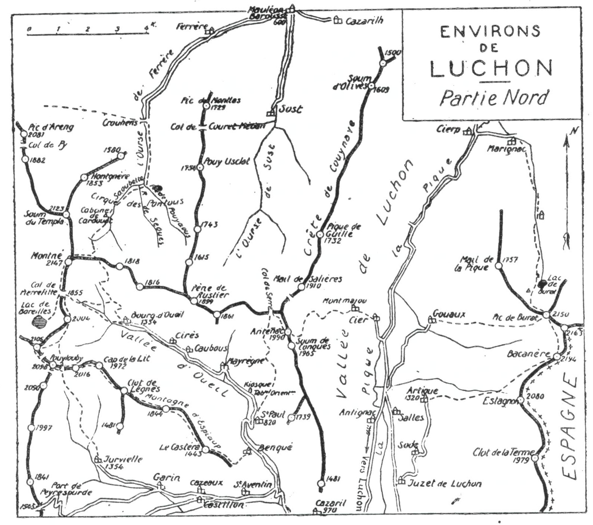
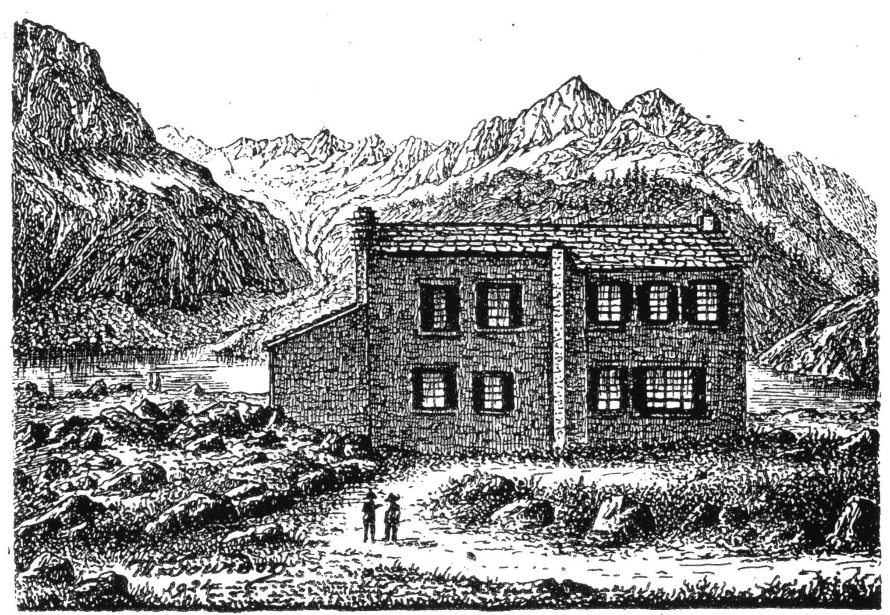
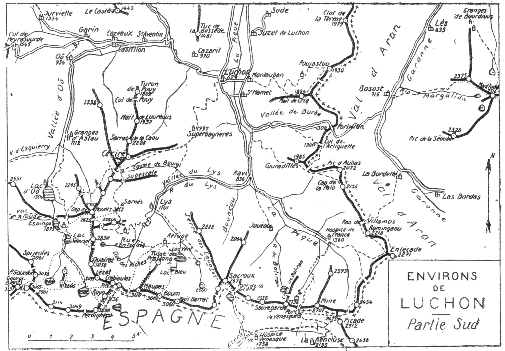

<style>.centre {text-align: center}</style>
<style>.droite {text-align: right}</style>

-----------------------
[//]: # (— p. 229 —)

# 18°, 19° et 20° EXCURSIONS

__Quinze jours aux Environs de Luchon__\
__En trois Excursions__

<u>__NOTICE sur LUCHON__</u>

On peut effectuer un nombre infini d'excursions aux environs
immédiats de Luchon, et plusieurs saisons ne suffiraient pas, si
on en voulait visiter tous les coins intéressants. Pour ceux dont le
temps est limité, j'ai condensé ces excursions en 15 itinéraires
quotidiens qui permettront, non seulement d'apercevoir toutes
les beautés de cette région privilégiée, mais surtout, d'en explorer 
les sites qui en constituent le grand charme.

Grâce à l'initiative de quelques hommes dévoués au bien public, 
Luchon est maintenant doté de deux admirables centres
d'attraction de tourisme et de pyrénéisme : Superbagnères, avec
sa crémaillère et son hôtel à 1.800 m. d'altitude; Espingo, avec
son chalet-hôtel, au pied de superbes glaciers.

De Superbagnères qui occupe le centre de l'immense cirque
de montagnes qui environnent Luchon, on aperçoit près de la
moitié des grands sommets pyrénéens. Comme site de sports
d'hiver, il n'y en a pas de supérieurs en Europe. Pour le tourisme
et le pyrénéisme d'été, Superbagnères se combine avec Espingo
dont le chalet-hôtel est bâti à 1.925 im. d'alt.; ce dernier, qui est
entouré de lacs et de glaciers étincelants, est dominé par 14 cimes 
dont 11 dépassent 3.000 m.

Dans 45 min. et à travers un décor magnifique, la crémaillère
de Superbagnères hisse le touriste de 1.200 m. jusqu'à l'un des
plus beaux belvédères du monde; puis, un sentier bien tracé, le
conduit à Espingo en lui faisant franchir deux cols qui sont de
nouveaux points de vue. Aussi, dès notre arrivée à Luchon,
irons-nous, dans une même journée, visiter ces deux lieux charmants, 
autour desquels nous rayonnerons ensuite.

(Voir les cartes des Environs de Luchon, pp. 202 et 214.\
(Voir aussi les cartes des Environs d'Espingo, pp. 232 et 240.


<div class="page"/>


— p. 230 — ENVIRONS de LUCHON (18me EXCURSION)

__Pour ceux qui ne fréquentent pas les hautes cimes.__

Pour ceux qui ne fréquentent pas les hautes cimes, et qui voudraient 
cependant jouir des merveilles situées à toutes les altitudes 
de la région luchonnaise, je ne saurais trop recommander
l'ouvrage qu'un savant normand vient de faire paraitre. Admirateur 
passionné de la célèbre station thermale, où il séjourne l'été
depuis de nombreuses années, M. Gadeau de Kerville a écrit sur
Luchon et ses Environs deux volumes qui sont deux petits chefs-
d'œuvre (1).

La précision historique, l'exactitude des renseignements
donnés par l'érudit observateur qu'est M. de Kerville, ne sont
égalées que par le luxe de l'édition, la valeur artistique des gravures 
et l'élégance du texte. Toutes les beautés et toutes les curiosités 
naturelles y sont décrites et artistiquement reproduites par
169 héliogravures.

<u>__AVIS AUX TOURISTES__</u>

C'est par la montagne que nous arriverons à Luchon; cela
nous permettra, non seulement de visiter une partie très pittoresque 
de la Barousse, mais encore de monter à l'ombre sur
l'un des plus beaux belvédères des environs de Luchon : le
Montné (2.147m).

Pour l'exploration méthodique des environs de Luchon, il y
a intérêt à faire les excursions dans l'ordre indiqué; on peut
cependant, sans inconvénient sérieux, effectuer chacune d'elles
selon sa fantaisie.

———\
(1) Deux volumes in-4° couronne, illustrés de 169 héliogravures et d'une
carte. En vente à la librairie E. Privat, 14, rue des Arts, Toulouse.


<div class="page"/>

[//]: # (— p. 231 —)

# DIX-HUITIÈME EXCURSION

__Cinq jours aux environs de Luchon__

(1re Série)

_B. E. — Du 1er Juillet au 1er Octobre._

Cartes à emporter : Bagnères-de-Luchon et Val d'Arouge réunies.

## PREMIÈRE JOURNÉE

__De MAULÉON-BAROUSSE (600m) à LUCHON (629m),__\
__par la Vallée de Ferrère. le Mortré-de-Luchon (2.147m)__\
__et la Vallée d'Oueil.__

—— SANS GUIDE ——

__Conseils.__ — __Itin. recomm.__ — On prendra un billet direct pour
Luchon, afin d'y faire enregistrer la valise qu'on retrouvera le
lendemain au soir, et on descendra à la station de Loures-Barbazan 
pour aller coucher à Mauléon-Barousse (10 k.), la veille de
l'excursion. I1 existe un service d'autobus entre ces deux localités 
aux principaux trains.

Le lendemain, on quittera Mauléon à l'aurore, et on partira par
Ferrère pour suivre la route jusqu'à Crouhens (7 k.) (V. 14° E.,
p. 188). On ne passera pas le pont et on continuera tout droit,
par la rive dr. de l'Ourse, en laissant à g. le vallon de la Hosse
qui monte au Col de Couret-Médan (1.331m). Bientôt, la gorge se
rétrécit et, après avoir traversé les Aygouats de Batmale (1), on
débouche au petit cirque des Pontous; là, se réunissent les trois
ruisseaux de Pouvaous, de Sèouès et de la Saoubette de Cardouet,
qui forment l'Ourse de Ferrère.

———\
(1) Petites mares, terrains saturés d'eau.

<div class="page"/>

— p. 232 — MONTNE de LUCHON  (l8m18me EXCURSION)

 

On franchira les deux premiers ruisseaux, afin de rejoindre le
sentier qui monte de Crouhens par la rive g., au point où il
bifurque; on suivra ensuite le sentier de dr. qui longe la Saoubette 
jusqu'à la cabane de Cardouet.

De ce point, le Montné paraît tout en haut, au S.-O., dominant
tout le paysage et, s'il fait clair, on peut en repérer toute la voie
d'ascension. Suivant pendant quelques min. la rive dr. du Cardouet,
on quittera bientôt le cours du ruisseau pour zigzaguer
les pentes, direction S., d'abord, puis direction S.-O.; dans cette
ascension, on décrira une courbe de g. à dr.; afin d'aboutir au
sommet par la crète E.

Situé très en recul de la grande chaine, le Montné de Luchon
(2.147m) est l'un des plus jolis belvédères de la région. Vus de ce
sommet, les Monts-Maudits surtout font un effet magnifique. Tout

<div class="page"/>


— p. 233 — (18me EXCURSION) VALLEE D'OUEIL

le Cirque du Lys est sous les yeux et la vue s'étend du Marboré
aux monts catalans. Au N., au fond de la vallée de Bareilles,
Arreau paraît à une portée de fusil. Au haut de la même vallée,
au S.-O. du Montné, brille son joli lac aux teintes vert sombre.

Pour la descente, on repartira par la crête E. dont on suivra
la croupe pendant une dizaine de min.; obliquant alors carrément 
à dr., on dégringolera à travers les pelouses, direction S.,
pour rejoindre le chemin muletier qui mène directement à Bourg-
d'Oueil, où l'on retrouve la route à 15 k. de Luchon.

Un autobus fait ordinairement le service de Bourg-d'Oueil à
Luchon; s'informer de l'horaire au cas où on voudrait le prendre.

__Horaire de la Journée :__

```
De Mauléon à Crouhens.............. 1h.45 }
De Crouhens au Montné.............. 3h.45 }   9h.45
Du Montné à Bourg-d'Oueil.......... 1h.15 } (Arrêts en sus).
De Bourg-d'Oueil à Luchon (15 k.).. 3h. » }
```

Nota. — Cette course pourrait être faite en sens inverse, de
Luchon à Luchon, en se faisant conduire en voiture à Bourg-
d'Oueil pour aller coucher à Mauléon. De rapides marcheurs
pourraient même effectuer le trajet entier dans la même journée 
sous les conditions suivantes : 1° d'être parvenu à Bourg-
d'Oueil vers 6 h., ce qui est possible en auto; 2° d'arriver assez
tôt à Mauléon pour prendre le courrier qui correspond au
dernier train s'arrêtant à Loures.

L'ascension du Montné peut aussi être effectuée dans la journée 
depuis Luchon, en se faisant conduire en auto à Bourg-
d'Oueil.

__KIOSQUE de MAYRÈGNE__

En descendant du Montné par la vallée d'Oueil, on fera une
petite halte au joli point de vue du Kiosque de Mayrègne, où
l'on vient d'édifier une table d'orientation et où l'on peut se restaurer.

Au moment où le soleil décline à l'horizon, on jouira là d'un
spectacle unique : l'incandescence des glaciers des Monts-Maudits
et l'illumination des crêtes du Lys qui sont alors de toute beauté.

En saison estivale, le Kiosque de Mayrègne est l'une des grandes 
attractions des Environs de Luchon.


<div class="page"/>

— p. 234 — SUPERBAGNERES (18me EXCURSION)

## DEUXIÈME JOURNÉE

__EXCURSION au CIRQUE d'ESPINGO (2.000m),__\
__par Supérbagnères (1.800m), le Col de la Coume de Bourg (2.325m)__\
__et le Col de Bassieret (2.275m), avec retour à Luchon__\
__par le Lac d'Oô (1.500m) et les Granges d'Astau (1.112m).__

—— SANS GUIDE ——

<u>__AVIS AUX TOURISTES__</u>

Un sentier très bien tracé relie Superbagnères à Espingo par
un pays splendide, et il faut environ 4h.30 pour effectuer ce
parcours; on peut donc, en partant par la crémaillère de 6 h.,
arriver vers midi au chalet-hôtel d'Espingo pour y déjeuner.
Il suffira d'emporter dans son sac un simple casse-croûte.

Comme, par la nature du terrain parcouru, ce trajet a tout à
fait le caractère de la haute montagne, un bon bâton et des
souliers ferrés sont indispensables; une journée claire est aussi
nécessaire, tant pour jouir des divers points de vue que pour
se conduire avec facilité.

Grâce à ces précautions, on pourra réaliser l'une des plus
intéressantes excursions des environs de Luchon, tout en visitant 
ses deux plus beaux centres de tourisme et de pyrénéisme.

__Conseils.__ — __Itin. recomm.__ — On partira par la première crémaillère, 
à 6 h., pour arriver à Superbagnères vers 7 h.

A 400 m. au S. de l'Hôtel, sur un promontoire gazonné, on a
édifié, en 1926, une magnifique table d'orientation; de ce point,
on domine la vallée du Lys et on aperçoit tout le cirque. On
s'arrêtera là quelques instants pour identifier les cimes des alentours 
et admirer les beautés du cirque splendide qu'on a sous
les yeux : 

<u>__LE CIRQUE DU LYS__</u>

Voici le second joyau de la chaîne : le Cirque du Lys.
Si le Cirque de Gavarnie est imposant et majestueux, celui
du Lys réunit à la fois la coquetterie de la petite montagne et
le grandiose des hautes cimes. Ici, la nature a prodigué toutes
ses beautés : lacs d'émeraude et d'azur, gouffres impressionnants, 
cascades magnifiques, pentes verdoyantes et fleuries,
forêts mystérieuses, ruisselets jaseurs, etc., etc. Puis, couronnant 
et dominant ces merveilles, des glaciers étincelants et des
cimes majestueuses.

Le Cirque du Lys affecte la forme d'un fer à cheval incliné
à 45°.

<div class="page"/>


— p. 235 — (18me EXCURSION) COUME be BOURG — COL de BASSIERET

Sauf l'ascension de ses cimes qui est réservée aux pyrénéistes, 
il est accessible aux touristes de tout âge et de toute
aptitude. On y va en chemin de fer jusqu'à 1.800 m. d'alt.
(Superbagnères); en voiture, jusqu'au pied des cascades et à
cheval, jusqu'à la base des glaciers.

Avec les trois premiers jours de la vingtième excursion, on
en fera le tour par les crêtes, ce qui permettra d'en voir toutes
les formes et d'en admirer toutes les beautés par toutes les
lumières.

On repartira direction S.-O., en suivant le faîte de la colline
jusqu'aux premières croupes rocheuses; là, un sentier qui
s'amorce en contrebas, à g., file par les pentes S. du Céciré et à
une certaine hauteur jusqu'à la source de la Coume de Bourg
(2.300m), source située à 5 min. au-dessous du col de ce nom. On
remarquera au passage, sur la g. du sentier, le nouvel abri adossé
au S. d'une roche grise, quelques min. avant d'arriver à la source.

De la source, on franchira le Col de la Coume de Bourg (2.325m)
de l'E. à l'O. pour passer au versant du vallon de Médassoles; puis
après cinq lacets en descente, on remonte à g., et le sentier contourne 
ce vallon par le haut pour aboutir au Col de Bassiéret
(2.275m).

Pour parvenir à ce dernier, on passe en amont d'un petit cirque,
à travers des éboulis et, par une rude grimpette de 1/4 d'h.
on atteint la crête de Bassiéret qu'on franchit vers 2.275 m. d'alt.
à une centaine de m. au S. de la tourelle du Cap de Bassiéret
(2.296m). De ce point, on a littéralement sous les pieds le Lac d'Oô
à 800 m. de profondeur et, plus haut, à g., parait un coin du Lac
d'Espingo. Ce site est de toute beauté.

Du Col de Bassiéret, le sentier repart à g., puis, après avoir fait
quelques lacets en descente, pour aboutir à un bouquet de pins
qu'on aperçoit 300 m. plus bas, il prend définitivement la direction 
S. Encore quelques lacets et on arrive à la partie horizontale 
qui mène directement au Col d'Espingo où on rejoint le
grand chemin qui monte du Lac d'Oô.

Parvenu au Col d'Espingo (1.975m), on découvre subitement
tout le cirque et le chalet-hôtel qu'on a devant soi, à 5 min. en
contrebas. Le spectacle est sublime.

On aperçoit le cirque verdoyant d'Espingo, son joli lac, le refuge 
et, plus loin, une partie du Lac Saousat. En face, au premier 
plan, la masse imposante de la Tusse de Montarqué (2.896m)
semble s'avancer au milieu du cirque pour offrir au touriste son


<div class="page"/>


— p. 236 — REFUGE d'ESPINGO (18me EXCURSION)



<div class="page"/>


— p. 237 — (18me EXCURSION) ENVIRONS D'ESPINGO

admirable belvédère; enfin, couronnant tout le paysage, en arc
de cercle, depuis le Montarrouye (2.850m), à l'E., jusqu'au Hourgade 
(2.966m), à l'O., les hautes cimes dépassant 3.000 m. : Quaïrat
(3.058m), Lézat (3.099m), Royo (3.136m), Perdighero (3.220m), Seil
de la Baquo {3.114m), Port d'Oô (3.065m), Gourdon (3.038m), Spijeoles 
(3.065m) et sa longue crête hirsute. Sur les flancs de presque 
toutes ces montagnes, resplendissent de magnifiques glaciers.

<u>__NOTICE sur le REFUGE d'ESPINGO__</u>

La construction du refuge d'Espingo, à l'entrée de l'admirable
cirque de ce nom et à 160 m. à l'E. du lac, ouvre des horizons
nouveaux, non seulement aux grimpeurs de hauts sommets et aux
pyrénéistes moyens, mais encore aux simples touristes avides de
beaux spectacles. Ce joli coin des Pyrénées est désormais accessible 
à tous, puisque on peut s'y rendre, partie en voiture, partie
à cheval.

C'est grâce à l'inlassable dévouement du président de la Section 
des Pyrénées Centrales, M. Paul DUFFOUR, et à la forte subvention 
du Club Alpin Français qu'a été édifiée en 1923, à
1.925 m. d'alt., cette petite maison de montagne, l'une des plus
utiles des Pyrénées. Elle est la propriété du Club Alpin Français.

Le refuge comprend une salle commune, une cuisine, une
chambre pour le tenancier, 4 chambres à un et deux lits, 2 à trois
lits et 2 bat-flanc superposés, munis de matelas et de couvertures 
et pouvant contenir 20 personnes. Le tenancier y est installé
du 1er juillet au 15 octobre (1).

Alpinistes et touristes y trouveront, non seulement le logement,
mais encore des provisions et des repas à des prix modérés. Le
tarif des repas, du couchage et des consommations indispensables 
est affiché au refuge et au Syndicat d'Initiative de Luchon.
Les membres du C. A. F. y jouissent d'un tarif spécial sur présentation 
de leur carte de l'année.

Autour d'Espingo, s'élèvent 14 cimes majestueuses dont 11 dépassent 
3.000 m. Pour les pyrénéistes de haute montagne, le refuge 
d'Espingo est le point de départ rêvé qui permet d'en faire

 

———\
(1) Indépendamment du refuge gardé, ouvert seulement en été, il
existe : 1° une pièce libre, contenant un bat-flanc et fermée seulement 
au loquet; 2° une nouvelle cabane, très spacieuse, construite
aux lieu et place de l'ancienne.


<div class="page"/>


— p. 238 — LAC d'Oô — GRANGES D'ASTAU (18me EXCURSION)

l'ascension dans une semaine, tout en retrouvant, tous les soirs,
le confortable des repas et du coucher.

On repartira du refuge vers 14h.30 et, après être remonté au
Col d'Espingo, on y déposera le sac; on se dirigera ensuite vers
l'O. à toute crête par les flancs et le haut d'une sapinière. On
aboutira là, au point culminant de cette petite colline, sur un
très joli belvédère situé à 2.000 1m. d'alt. On aura à sa g. les lacs
d'Espingo et de Saousat et, à sa dr., le Lac d'Oô à 500 m. de
profondeur; on apercevra la plus grande partie du chemin par
lequel on descendra tout à l'heure, et on dominera presque verticalement 
la naissance de la grande cascade d'Oô.

Revenu au col, on descendra vers le lac d'Oô par le chemin
qu'on avait rejoint à l'arrivée. Après 20 min. de marche, on aboutira 
à un replat, à la hauteur de la grande cascade. A partir de
là, la beauté du spectacle est presque uniquement accaparée par
le lac. Ce dernier monte petit à petit en prenant de multiples
teintes et, dans ses eaux, se reflètent les hauts sommets aux pointes 
renversées.

Après une petite halte près du lac, on continuera la descente
jusqu'aux Granges d'Astau, 13 k. de Luchon, où on trouvera,
sans doute, place dans une des nombreuses voitures qui ont porté
les touristes du Lac d'Oô. Dans tous les cas, si on se fait indiquer
les raccourcis en aval de Saint-Aventin, on gagne 1 k. et le trajet
peut alors être effectué dans 2h.30 (V. 17° E., p. 226).

__Horaire de la Journée :__

```
De Superbagnères à Espingo......... 4h. » }
D'Espingo aux granges d'Astau...... 2h. » }   8h. 30
Des granges d'Astau à Luchon....... 2h.30 } (Arrêts en sus)
```

## TROISIÈME JOURNÉE

__Ascensions du Poujastou (1.930m) du Mail de Criq (1.824m)__\
__et des Tourettes de Pène-Mélère.__

—— SANS GUIDE ——

__Conseils.__ — __Itin. recomm.__ — On partira par Montauban et, en
haut du vill., on prendra à dr. le grand chemin muletier qui fait
un long crochet vers le S. et qui, en de nombreux lacets, conduit
aux prairies de Herran. Il existe, dans ce flanc de montagne, de


<div class="page"/>


— p. 239 — (18me EXCURSION) Le POUJASTOU

nombreux chemins qui croisent dans tous les sens la forêt de
Montauban; la plupart, qui peuvent servir de raccourcis à la descente, 
sont des glissières pour le bois. A l'ascension, il vaut mieux
suivre le grand chemin, c'est-à-dire le plus régulier qui monte
en pente douce.

Au 5° et au 7° lacet, on laisse à dr. les deux sentiers du Prat de
la Hount et, au 9°, le chemin du Mail de Criq. On arrive là dans
une clairière propice à la première halte, car on y jouit d'un très
beau point de vue sur le bassin de Luchon, sur le Cirque du Lys
et sur la vallée de Larboust. Le chemin se dirige ensuite au N.-E.
pour aboutir, 20 min. après, aux prairies de Herran, vers
1.200 d'alt.

On traversera les prairies direction N. pour rejoindre la lisière
de la forêt de Sésartigues (ou de Saroutjès) qu'on longera ensuite
par la dr. sur une centaine de m. environ. Là, le chemin bifurque; 
le sentier de dr. conduirait au Mail de Criq par le haut des
prairies. On prendra le grand chemin de g. qui pénètre sous la
forêt et qui aboutit peu après à la petite clairière de la Fontaine
Rouge, près du Refuge forestier de Saroutjès (1.565m). On trouve
encore de l'eau plus haut, en sortant de la forêt, mais il vaut
mieux en faire provision à la source ferrugineuse de Saroutjès.

Trois sentiers partent de la clairière de Saroutjès : un descend
à g. à la grotte du Chat qui est à 200 m.; un autre grimpe à dr.
à l'E, au Col des Panets. On suivra le grand chemin du milieu
(celui par lequel on est arrivé) qui poursuit en pente douce, direction 
N., en contournant sous forêt plusieurs ravins qui descendent 
de la crête forestière. Au sortir de la forêt, ce chemin
continue horizontalement pour passer au-dessus de la grange de
Larrieu qu'on aperçoit devant soi. C'est verticalement au-dessus
de cette grange qu'il faut quitter le chemin pour monter à dr., à
l'E., en suivant la croupe gazonnée qui grimpe tout droit au
Poujastou (1.930m).

Quoique de faible alt., le Poujastou est un magnifique belvédère, 
à cause de sa situation privilégiée. En effet, il fait exactement 
face au Cirque du Lys qu'on voit en entier et, vers le S.-E.,
l'œil prend en enfilade tout le Val d'Aran qu'il remonte jusqu'au
Montarto. Son panorama s'étend du Pic de Midi de Bigorre au
Comolo Forno. Tout à fait à l'O., la pointe noire du Pic Long
émerge derrière la crête du Campbieil.


<div class="page"/>

— p. 240 — (18me EXCURSION) ENVIRONS DE LUCHON + PARTIE SUD



<div class="page"/>


— p. 241 — (18me EXCURSION) Le MAIL De CRIQ

On domine une grande partie du Val d'Aran, et Bosost est
littéralement sous soi, à 1.200 m. de profondeur.

Contrairement à ce qu'ont écrit certains auteurs (1), on aperçoit 
admirablement tout le massif des Monts-Maudits.

Du Poujastou, on redescendra au Col de Panets et on continuera, 
à toute crête, direction S., jusqu'à la, petite tourelle de
Mail de Criq (1.824m). Ce trajet est des plus intéressants, car on
domine constamment les deux grandes vallées d'Aran et de Luchon. 
En arrivant à Mail de Criq, on découvre subitement sous
ses pieds le vallon de Burbe.

Le point de vue est analogue à celui du Poujastou pour les
lointains; mais pour les abords immédiats, les deux se complètent.

A 2 min. en contrebas, sur le versant S., on trouve une petite
source près de laquelle s'amorce un sentier qui file horizontalement 
direction S.-O.; en le suivant, on arrivera, 10 min. après,
en vue des curieuses Tourelles de Pène Mélère qui sont presque
inconnues. De ce point, on remontera à la crête pour rejoindre
le sentier qui, par la cabane de Hournets, ramène aux bords S.
des prairies de Herran, près de la délicieuse fontaine de la Prise,
où tous les touristes ont l'habitude de se désaltérer longuement.
On n'aura alors qu'à longer les prairies par la g., et à marcher
ensuite sous bois, direction O., pour aboutir au grand chemin qui
va rejoindre celui de l'ascension au 9° lacet.

__Horaire de la Journée :__

``` 
De Luchon au Poujastou............... 4h.30 } 
Du Poujastou au Mail de Criq......... 0h.50 }   8 h.
Du Mail de Criq à Luchon............. 2h.40 } (Arrêts en sus).
```

__VARIANTES POSSIBLES__

Du Mail de Criq, en se tenant sur le versant espagnol de préférence, 
on peut suivre la crête frontière jusqu'au Portillon (1.308m)
et de là, rentrer à Luchon par le vallon de Burbe et la Cascade
Sidonie; cela allongerait d'environ 1 h. On peut aussi. du Portillon, 
descendre à Bosost dans 1h.30.

———\
(1) Henry Spont, Luchon et ses environs, p. 86.


<div class="page"/>

— p. 242 — SAINT-MAMET (18me EXCURSION)

## QUATRIÈME JOURNÉE

__Ascensions du Soum de Couradilles (1.985m)__\
__et du Cap de la Palo (2.156m), avec retour à Luchon__\
__par les Cols de Barèges (1.800m) et de l'Artiguette (1.300m),__\
__le Vallon de Burbe et la Cascade Sidonie.__

—— GUIDE UTILE ——

<u>__AVIS AUX TOURISTES__</u>

Grâce à la construction d'un joli chemin muletier qui zigzague, 
sous bois, les flancs N. et O. de la montagne pour déboucher 
à découvert vers 1.750 m. d'alt., l'ascension du Couradilles
est l'une des plus charmantes des environs de Luchon. Elle
atteindra un grand intérêt, si on y ajoute celle du Cap de la
Palo qui est très facile.

__Conseils.__ — __Itin. recomm.__ — On partira par Saint-Mamet et la
route du Portillon qu'on laissera à g., près de la guérite de la
douane. Poursuivant devant soi par le chemin de chars, on longera 
la Pique pendant 4 ou 5 min. puis, après avoir franchi le
ruisseau de Burbe, on entrera dans la forêt par un chemin rapide
et caillouteux. Quelques min. plus haut, sur un petit promontoire
en clairière, on laissera à dr. le sentier qui conduirait au Pont
Lapadé.

Prenant celui de g., on entre à nouveau sous forêt et on monte
en pente douce par la partie O. de Bois-Neuf; un chemin bien
tracé conduit directement jusqu'à Couradilles De temps en
temps, la bonne voie est signalée par des marques bleues sur des
arbres. Quelques rares clairières procurent des points de vue intéressants 
sur la vallée de Luchon et les cimes du Cirque du
Lys. L'Hôtel de Superbagnères est très souvent sous les yeux.

Après 1 h. 1/2 d'ascension sous forêt, on arrive à découvert
près de la source de l'Artigue, située dans une grande clairière
d'où l'on jouit d'un très beau point de vue. C'est là qu'on fait
ordinairement le premier casse-croûte.

Un crochet direction N. fait passer près des ruines d'une
grande cabane, et l'ascension continue en lacets réguliers qui font


<div class="page"/>


— p. 243 — (18me EXCURSION)  COURADILLES — CAP De La PALO

aboutir au haut de la forêt une demi-h. après. C'est alors la féerie
qui commence.

Au sortir de la forêt, tout se découvre dans toutes les directions. 
On n'a pas besoin de se retourner; les lacets du sentier
zigzaguant dans tous les sens, on n'a qu'à regarder devant soi
pour voir émerger presque toutes les hautes cimes de la grande
chaîne, depuis le prestigieux Néouvielle, à l'O., jusqu'à l'imposant 
Montcalm, à l'E. Au S., resplendit bientôt le massif des
Monts-Maudits.

Parvenu au sommet, le point de vue sur les vallées environnantes 
s'ajoute à celui des hautes cimes. C'est, d'abord, Luchon et sa
vallée qu'on domine merveilleusement; puis, une partie du Val
d'Aran; enfin, vers le S. et vers l'O., les vallons de la Freche, du
port de Venasque, de la Glère et de Bounèou. Vu du Couradilles,
le cirque du Lys est dans toute sa splendeur.

Si le temps est chaud, on ne pourra pas séjourner longtemps
au Couradilles, car on est ordinairement assailli par des tourbillons 
de fourmis ailées; c'est le seul désagrément de cet intéressant 
sommet.

A 2 k. 500, au S.-E., paraît la crête du Cap de la Palo (2.156m);
son ascension est le complément indispensable pour donner à
cette excursion son maximum d'intérêt. Pour s'y rendre, on descendra 
d'abord au Col de Barèges (1.800m), où on pourra déjeuner 
près de la cabane.

Du haut du Couradilles, on aperçoit la source du col qui alimente 
un immense abreuvoir; on peut y descendre dans moins
de 1/4 d'h. en dévalant à sa fantaisie à travers les pelouses.
Comme on repassera au Col de Barèges au retour, on peut y
laisser le sac, soit à l'intérieur de la cabane, soit sur le toit.

Pour l'ascension du Cap de la Palo, on montera direction S.-E.,
en s'élevant insensiblement par les pâturages du flanc O. du Pic
d'Aubas (2.072m), afin d'aboutir en pente douce à la grande dépression 
située au S. A partir de là, on n'aura qu'à suivre la
crête frontière jusqu'au point culminant (2.156m).

Ce qui fait le charme du Cap de la Palo, c'est d'abord, en y
arrivant, de découvrir et de dominer presque tout le Val d'Aran;
puis, de jouir, de son sommet, d'une vue magnifique sur la chaine
ariégeoise, du Crabère au Mont Valier. Les massifs de la Sèoube
(2.328m) et du Montlude (2.516m) sont à deux pas, de l'autre côté


<div class="page"/>


— p. 244 — COL De BAREGES — VALLON DE BURBE (18me EXCURSION)

 de la vallée. Les lointains, sont splendides, et un grand nombre
de sommets, non visibles du Couradilles, paraissent à l'horizon.

On reviendra au Col de Barèges par la voie d'ascension.

Pour rentrer à Luchon, on prendra, au N.-E. de la cabane, le
grand chemin muletier qui descend à La Bordette et à Bosost par
le Col de l'Artiguette (1.300m). Ce col est situé au S. du Port du
Portillon (1.308m), où passe la route de Luchon à Bosost, et dont
il n'est séparé que par une protubérance rocheuse en partie boisée..
Il est caractérisé par l'existence d'une petite prairie triangulaire 
qui borde le chemin à g.

Là, il faut quitter le grand chemin et traverser la prairie,
direction N.-O. afin de rejoindre un nouveau sentier qui mène
au vallon de Burbe en passant par la partie E. du Bois Neuf.
Bientôt, un grand chemin descend rapidement sous une hêtraie
aux arbres magnifiques, et on aboutit, à mi-hauteur du vallon de
Burbe, au milieu de vertes prairies. Le sentier traverse alors
celles-ci et va rejoindre la route, à 6 k. de Luchon. Un quart d'h.
plus bas, on passera près d'une délicieuse source située en bordure 
du ruisseau, à quatre ou cinq m. d'un petit pont. On n'aura
plus qu'à suivre la route jusqu'à la Cascade Sidonie, où on fera
une petite halte; encore un quart d'h. de descente et on retrouvera
le chemin d'ascension à la guérite de la douane.

__Horaire de la Journée :__

```
De Luchon à Couradilles...............  4h.30 }
De Couradilles au Col de Barèges......  0h.15 }  9h.30
Du Col de Barèges au Cap de la Palo...  1h.15 }
Du Cap de la Palo au Col de Barèges...  0h.30 } (Arrêts en sus).
Du Col de Barèges à Luchon............  3h. » }
```

Nota. — On peut aussi, du Col de Barèges, rentrer à Luchon
dans 3 h. environ, en passant à la Fontaine de Berns pour
rejoindre la route entre l'Hospice de France et le Pont Lapadé.


<div class="page"/>


— p. 245 — (18me EXCURSION) HOSPICE DE FRANCE

## CINQUIÈME JOURNÉE

__Excursion au Port de Venasque (2.448m),__\
__avec ascension facultative du Pic de Sauvegarde (2.736m)__\
__et retour à Luchon par le Port de la Picade (2.475m).__

—— GUIDE UTILE ——

<u>__AVIS AUX TOURISTES__</u>

L'excursion du Port de Venasque et du Sauvegarde, qui
n'offre pas la moindre difficulté, est cependant l'une des plus
grandioses des environs de Luchon; on peut la classer parmi
celles de haute montagne, en raison de l'alt. du Sauvegarde et
de l'immensité de son panorama. Elle peut être réalisée de
deux manières différentes : 1° en louant une voiture pour la
journée, voiture qui montera jusqu'à l'Hospice de France et
y attendra le retour de la caravane; 2° en allant coucher la
veille à l'Hospice de France, pour faire le lendemain tout le
trajet à pied.

Ma préférence étant pour la deuxième manière, c'est celle-ci
que je vais décrire.

__Conseils.__ — __Itin. recomm.__ — On partira de Luchon vers 16 h.,
en emportant dans son sac des provisions pour un repas et un
casse-croûte. Le trajet de Luchon à l'Hospice est plein d'intérêt
au moment où le soleil commence à décliner à l'horizon en dorant 
les crêtes du Sacroux et du Cirque du Lys. En outre, ce
parcours, de 10 k. 600, qui élève le touriste de plus de 700 m.,
est un merveilleux entrainement pour la longue randonnée du
lendemain. On ira donc diner et coucher à l'Hospice, la veille,
soit une marche d'environ 2h.45, arrêts compris.

Pour faire l'ascension du Port de Venasque à l'ombre et avec
le minimum de fatigue, on partira au plus tard à 6 h., heure
nouvelle. Un vallon rapide monte au port de Venasque entre le
chainon qui va du pic de la Pique au pic de la Mine. à g., et la


<div class="page"/>


— p. 246 — PORT De VENASQUE (18me EXCURSION)

crête de Baliran, à dr. (1). on n'aperçoit pas le port depuis l'Hospice 
de France.

Un magnifique sentier monte en pente douce en 74 lacets, au
Port de Venasque (2.448m). Cette montée, fastidieuse par le soleil, 
est un véritable régal par une fraîche matinée. A mesure
qu'on s'élève, on voit les collines: secondaires s'abaisser et se
niveler presque avec la plaine, tandis que des pics voisins émergent 
à l'horizon.

Divers points retiennent l'attention au passage : 1° le Culet,
roche lisse, presque verticale, sur laquelle glissent plusieurs peties 
cascades; 2° l'Homme, pyramide de pierres empilées sur un
rocher, pour indiquer la voie au voyageur quand la couche de
neige est épaisse; l'abri couvert en ciment est situé 2 min. plus
haut; 3° le Trou des chaudronniers, grande cavité à g. du chemin,
où périrent, sous la neige, neuf ouvriers de cette profession;
4° les quatre lacs de Boum qui se déversent l'un dans l'autre dans
un site splendide: 5° enfin, la grande merveille, le Port de Venasque.

Au Port de Venasque; surgit tout à coup, comme dans le lever
d'un immense rideau, le féerique panorama des Monts-Maudits,
avec ses crêtes vertigineuses et ses glaciers étincelants. Bien que
prévenu sur sa magnificence, nul ne résiste à la grandeur du spectacle 
sans éprouver une intense émotion. Seul, le point de vue
de la Brèche de Tuquerouye peut lui être comparé.

Si on est arrivé au port avant 10 h., on peut effectuer l'ascension 
du Sauvegarde avant déjeuner; on trouve l'amorce du sentier
une min. en contre-bas du port, versant espagnol, à dr.

On déposera le sac à l'amorce du sentier, sous la garde de ceux
qui ne feront pas l'ascension du Sauvegarde; si tous y montent,
on le laissera un peu plus haut, afin de le soustraire à la curiosité 
des passagers du port. 
Bien que le Sauvegarde soit un pic de second ordre et d'un
accès très facile, on jouit sur son sommet d'un point de vue

———\
(1) C'est par erreur que M. H. Spont donne à cette crête le nom
de Montagnette; le pic de ce nom (2.558m) est situé plus au S.-O. à
environ 3 k., entre le pic de la Glère et le Sauvegarde. Cette erreur
n'est pas, d'ailleurs, la seule sur ce vallon, car le sentier du port de
la Glère ne passe pas à la Cascade du Parisien, mais s'amorce plus
haut, sur le petit plateau herbeux situé en amont du deuxième pont
(V. Luchon et ses environs, pp. 105 et 106).

<div class="page"/>


— p. 247 — (18me Exc.) PORT be LA PICADE — PAS DE L'ESCALETTE 

incomparable dans toutes les directions. C'est un belvédère merveilleux 
pour celui qui veut explorer le massif des Monts-Maudits,
car on-en a tous les détails sous les yeux. C'est enfin, pour le
simple touriste, l'excursion rêvée, puisqu'on peut monter à cheval 
jusqu'à 45 min. du sommet.

Du haut du Sauvegarde, comme, d'ailleurs, du Port de Venasque, 
on voit très bien le chalet-hôtel de La Rencluse et la cascade
qui s'échappe du gouffre de Turmon. Si, de la tourelle, on
s'avance d'une quarantaine de m. à toute crête vers lO., on
aperçoit une partie de la Ville de Venasque.

Sur le versant espagnol, au S.-O. et à moins de 10 min. du port,
on trouve une bonne source près de laquelle on déjeunera, face
aux Monts-Maudits. L'endroit est des plus attrayants; mais il ne
faudra pas trop s'y attarder, si on veut rentrer à Luchon par le
joli tour de la Picade.

Le retour par la Picade constitue une variante des plus intéressantes, 
puisqu'elle permet de voir au passage la vallée d'Artiga
de Lin et ses alentours, ainsi que le Pic de l'Entécade (2.271m)
qu'on ascendra à une prochaine excursion. On rentrera donc par
la Picade, s'il fait beau; cela n'allonge que d'une h. environ.

Du Port de Venasque, un petit sentier file vers l'E. par la base
des escarpements méridionaux du Pic de la Mine (2.707m), pour
aboutir presque horizontalement au Port de la Picade (2.475m).
On franchit là la ligne de partage des eaux d'Europe et on passe
de l'Aragon dans la Catalogne. C'est au port de la Picade qu'était
située la frontière, lorsque le Val d'Aran était français.

Dix min. en aval du port, le sentier bifurque; celui de dr. descend 
à Goueil de Jouèou (1), à l'Ermitage d'Artiga de Lin, et à
Las Bordas, dans le Val d'Aran. On prendra à g. le sentier qui
remonte rapidement à la crête rocheuse de la frontière qu'on
nomme « Pas de l'Escalette » (2). C'est par là qu'on rentre en
France (V. 22° E.).

A partir du Pas de l'Escalette, le trajet est la plus agréable des
promenades. On descend en pente douce par le versant français,
en longeant la frontière qu'on laisse à dr. et en dominant constamment 
le vallon fleuri de la Frèche qui se creuse à g. Parvenu

———\
(1) 11 s'agit bien ici du fameux « Goueil de Jouèou », que certains
auteurs considèrent comme l'une des sources de la Garonne.

(2) Petite échelle.


<div class="page"/>


— p. 248 — PAS DE la  MOUNJOYE (18me EXCURSION) 

au Pas de la Mounjoye (2.115m), où aboutit le sentier qui va de
l'Ermitage d'Artiga de Lin à Luchon, on quitte la frontière pour
tourner à g., direction N.-O. Le chemin traverse alors les pâturages 
de Roumingaou, en laissant à dr. le sentier qui monte à
l'Entécade.

C'est le long d'un immense parterre fleuri qu'on chemine depuis 
le Pas de la Mounjoye jusqu'à l'entrée du grand plateau du
Campsaur. Là, le chemin tourne carrément à g., à l'O., et, dans
une plongée de quatre lacets, parvient au fond de la vallée de la
Frèche d'où il mène à l'Hospice dans 10 mn.
A l'Hospice, on trouve ordinairement place dans l'une des nombreuses 
voitures qui redescendent le soir. à Luchon. Ce sera
moins onéreux que d'en louer une pour tout un jour. Dans tous
les cas, cette descente peut parfaitement être-faite à pied sans
trop de fatigue.

__Horaire de la Journée :__

```
De l'Hospice de France au Port de Venas-         }
  que..................................... 2h.45 }
Du Port de Sauvegarde, aller et retour.... 1h.15 }  9h.30
Du Port de Venasque à la Picade........... 0h.50 }
Du Port de la Picade à l'Hospice de              } (Arrêts en sus).
  France.................................. 2h.30 }
De l'Hospice de France à Luchon........... 2h.10 }
```
