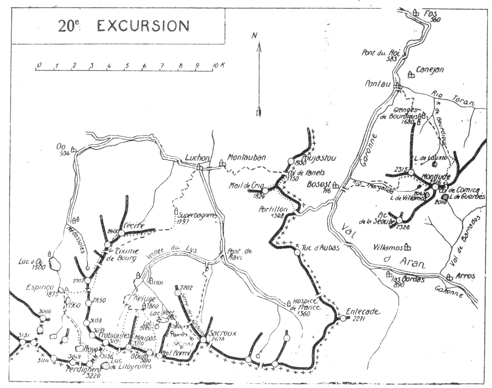

<style>.centre {text-align: center}</style>
<style>.droite {text-align: right}</style>

-----------------------
[//]: # (— p. 265 —)

# VINGTIÈME EXCURSION

(N° 17 de la 1re édition)

__Cinq jours aux Environs de Luchon__

(3° Série)<br>
_B. E. — Du 15 Juillet au 15 Septembre._

Cartes à emporter : Bagnères-de-Luchon et Val d'Arouge réunies.

__1° Le TOUR du CIRQUE du LYS,__

__par Superbagnères, le Céciré, le Col de Montarrouye,__<br>
__le Cap de Hounts-Secs. Espingo, le Perdighero, le Royo.__<br>
__le Crabioules, la Tusse de Maupas, le Boum,__<br>
__le Lac Bleu et le Lac Vert.__

(Un Guide est indispensable pour cette première partie,
et il faut emporter des vivres pour quatre repas).

__2° De LUCHON à FOS,__

__par l'Entécade, Bosost, le Montlude et le Pont du Roi.__

<p class="droite">(Voir ci-contre la carte schématique de l'Excursion).<br/>(Voir aussi : 1° la carte de la partie E. d'Espingo, p. 214);
2° les cartes des Environs de Luchon, pp. 232 et 240).</p>

<div class="page"/>

— p. 266 — ENVIRONS de LUCHON (20me EXCURSION)
****



<div class="page"/>

— p. 267 — (20me EXCURSION) SUPERBAGNERES — CECIRE
****

## PREMIÈRE JOURNÉE

__De LUCHON (629m) au REFUGE d'ESPINGO (1.925m),__<br>
__par Superbagnères (1.797m),__<br>
__le Céciré (2.400m) et le Col de Montarrouye (2.600m).__

—— GUIDE INDISPENSABLE ——

<u>__AVIS AUX TOURISTES__</u>

Comme il faut emporter des vivres pour quatre repas et les
divers casse-croûte de trois jours, on louera un porteur pour
deux jours. On ne mettra dans son sac que ce qui est nécessaire
pour la première journée, et on donnera le reste des
provisions au porteur pour qu'il les monte à Espingo dans
l'après-midi.

Le second jour, on pourra renvoyer le porteur après déjeuner, 
au Col de Litayrolles, ce qui lui permettra de rentrer
à Luchon le soir-même.

__Conseils.__ — __Itin. recomm.__ — On partira par la première crémaillère
de 6 h., afin de débarquer à Superbagnères avant 7 h.
De la gare de Superbagnères, on ira donner un coup d'œil à la
table d'orientation (V. 18 E., p. 234), puis on suivra la croupe
gazonnée direction S.-O. jusqu'au moment où, sous une barre
rocheuse, à g., prend naissance le chemin de la Coume de Bourg
(V. 18° E., p. 235). Environ 40 min. après avoir quitté la gare, on
trouvera l'amorce du petit sentier qui gagne vers la dr. la crête
accidentée; on quittera alors le grand chemin pour suivre le
petit sentier qui longe presque toujours la crête, par le versant
du Lys jusqu'au pic de Céciré (2.400m).

Cette voie d'ascension est idéale pour des pyrénéistes exercés; 
très impressionnante, parce que très aérienne, elle est cependant
sans difficultés. A chaque mètre monté, correspond un
point de vue nouveau, et le Céciré surtout est un très beau belvédère
dans toutes les directions.

Du sommet du Céciré, un très beau sentier, qui descend au
S. conduit dans une vingtaine de min. à la fontaine de la Coume
de Bourg, où on coupera l'itinéraire de la deuxième journée de
la 18° E. Prenant alors le sentier des mines de Crabioules. on le
suivra jusqu'à la source de Sarnès (V. 19° E., p. 258). On aperçoit
tout ce trajet du haut du Céciré.

On déjeune ordinairement à la source de Sarnès, et c'est là

<div class="page"/>

— p. 268 — COL de MONTARROUYE (20me EXCURSION)
****

qu'on quitte le chemin du Crabioules pour prendre le petit sentier
qui monte au Col de Montarrouye.

De la source de Sarnès, on s'élève droit à l'O. par le vallon
gazonné qui grimpe entre le Pic de Sarnès (2.581m), au S., et la
crête de Fontaine Rouge, au N. De vagues traces de sentier accompagnent
le touriste et, après avoir franchi deux petits ressauts
faciles, on arrive à la cuvette du lac minuscule de Montarrouye, 
au pied du col de ce nom. On n'a plus qu'à zigzaguer des
pentes supérieures pour parvenir à la large dépression de la
crête, d'où on découvre subitement le splendide décor d'Espingo
et du Cirque d'Oô.

Parvenu au Col de Montarrouye, on pourra, sans sac, répéter
l'ascension du Cap de Hounts-Secs en 20 min., aller et retour. En
fin de journée, lorsque les grandes cimes projettent leurs ombres
sur l'immense cirque d'Oô, le spectacle est splendide (V. description
à la 16° E., p. 216).

Du Col de Montarrouye, on descendra droit à l'O., en zigzaguant
les pentes à sa fantaisie, et dans 1 h. environ, on arrivera
au refuge. Si le brouillard empêche de l'apercevoir pendant la
descente, on n'a qu'à incliner à dr. au bas de la pente pour y
parvenir directement.

__Horaire de la Journée :__

```
De Superbagnères au Céciré............ 2h. » }  6h.30
Du Céciré au Cap de Hounts-Secs....... 3h.20 } (Arrêts en sus).
Du Cap de Hounts-Secs à Espingo....... 1h.10 }
```

## DEUXIÈME JOURNÉE

__D'ESPINGO (1.925m) au REFUGE de PRATLONG (1.860m),__<br>
__par le Lac Glacé du Portillon (2.581m),__<br>
__le Perdighero (3.220m), le Royo (3.136m), le Crabioules (3.119m)__<br>
__et le Col de Crabioules (3.010m).__

—— GUIDE INDISPENSABLE ——

__Conseils.__ — __Itin. recomm.__ — On partira dès qu'on pourra se
conduire, car pour la bonne réussite de la journée, il faudrait
arriver au Crabioules entre 11 h. et midi. On montera par la
rive g. du Lac Saousat (1.960m) jusqu'à la Coume de l'Abesque
où on coupera le torrent du Port d'Oô. Là, on tournera à g., au
S.-E., pour suivre le nouveau sentier qui remonte la rive g. du

<div class="page"/>

— p. 269 — (20me EXCURSION) Le PERDIGHERO — Le ROYO
****

ruisseau du Portillon jusqu'au lac glacé de ce nom. On franchira
le torrent en aval du déversoir, afin de contourner le lac par l'E.
en gagnant de l'alt. Dès qu'on aura dépassé le contrefort rocheux
qui domine le déversoir du lac, le porteur montera droit à l'E.
au Col inférieur de Litayrolles (3.003m), où il attendra la caravane
On prendra alors la direction S., en contournant la base
des escarpements O. du Pic Royo, et, par une marche oblique, on
atteindra le col supérieur de Litayrolles (3.052m) où on laissera
le sac. Dans 3/4 d'h. d'escalade à toute crête, au S., on arrivera
au sommet du Perdighero (3.220m).

Tout comme le Pic Long, le belvédère du Perdighero est l'un
des plus beaux des Pyrénées. La situation privilégiée de ces
deux pics et l'immensité de leur panorama sont si semblables,
qu'entre le Pic Long et le Perdighero, je n'ose dire auquel j'accorde
la palme. Ils sont assez isolés et assez élevés pour laisser
la vue s'étendre à l'infini, sans écraser les sommets d'alentour
et sans leur enlever une partie de leur beauté.

Au S.-E., les Monts-Maudits paraissent à une portée de fusil
et l'œil prend en enfilade presque toute leur longue crête. Au
S.-O., le Posets est à deux pas, et on peut en repérer la voie
d'ascension par le glacier de Paül. Mais ce qui impressionne le
plus, c'est la chute presque verticale de la face S. sur la vallée
d'Astos qui se creuse à 1.600 m. de profondeur; la cabane de
Turmes paraît sous les pieds.

A l'E. et au N., les lacs glacés de Litayrolles et du Portillon
semblent les deux yeux du magnifique sommet.

On redescendra au col supérieur de Litayrolles d'où, en suivant
à toute crête, au N., on montera en pente douce au Pic
Royo (3.136m) qu'on nomme aussi Pic de Litayrolles. Tout l'intérêt
de ce sommet est dans les environs immédiats, mais vers l'E.
on jouit d'une belle vue sur les lointains. On le quittera par la
dr. et, en en contournant la face E., on descendra au N. au Col
inférieur de Litayrolles (3.003m) où on déposera le sac et le piolet.

Pour faire l'ascension du Crabioules, on ne suivra pas l'itinéraire
indiqué par le Joanne, mais le suivant qu'on peut repérer
en entier du sommet du Royo.

Après avoir parcouru par la crête le petit éperon rocheux qui
s'avance vers le col, on contournera à g., à l'O., un contrefort
qui descend verticalement du sommet principal. Deux min. après,
on arrivera à la base d'une cheminée facile qui grimpe à mi-

<div class="page"/>

— p. 270 — Le CABRIOULES (20me EXCURSION)
****

hauteur du pic; un crochet à dr., par une petite brèche, mènera
à une deuxième cheminée qui monte directement à la crête, près
du point culminant (3.119m).

Le Crabioules est une étroite et longue arête orientée E.-O.
Si la face S., inclinée à 70°, semble verticale, la face N., plus
rapide, parait en surplomb. L'impression du vide est absolue
sur le cirque du Lys et cette vue seule suffirait à rendre le Crabioules
l'un des plus intéressants des Pyrénées. L'œil reste longtemps
fixé sur le ruban blanc de la route qu'on aperçoit tout au
fond, où de petites taches noires : fourmis, gens ou voitures se
meuvent à la suite les unes des autres. On s'attarderait là de
longues heures, tant cette vue de la face N. est captivante.

On redescendra au col par la voie d'ascension et, après avoir
repris le sac et renvoyé le porteur, on se dirigera à l'E., par le
haut du glacier; on contournera horizontalement la cuvette de
Litayrolles pour aboutir au Col de Crabioules (3.010m). Ce col
est situé à l'E. de la cime orientale du Crabioules (3.117m), entre
ce sommet et la Tusse de Maupas.

Pendant le trajet du Perdighero au Col de Crabioules, on dominera, 
en la contournant, l'admirable cuvette de Litayrolles et son
curieux et joli lac presque toujours glacé. Situé vers 2.800 d'alt.,
je pense qu'à importance égale, il est le plus élevé des Pyrénées.

Ordinairement la descente de la partie supérieure du glacier
du Crabioules est assez délicate, et une grande prudence s'impose
pendant 3/4 d'h. environ jusqu'au fond de la ligne de
grande pente. La suite n'est qu'un jeu. Restant constamment sur
la rive dr. du cirque, on laissera à g. le Clot des Piches en obliquant
légèrement à dr. Environ 1/2 h. en amont de la rue d'Enfer, 
on rejoindra l'amorce du sentier qui remonte à l'E. et qui,
en 20 min., conduit au refuge du Pratlong où on couchera.

Le refuge est situé à 1.860 d'alt., à la base de la Tusse de
Pratlong, en bordure N. d'un petit plateau.

__Horaire de la Journée :__

```
D'Espingo au Perdighero................... 4h.30 }
Du Perdighero au Pic Royo................. 1h. » }
Du Pic Royo au Col inférieur de Litay-           }
  rolles.................................. 0h.30 }   10h.30
Du Col au Crabioules (aller et retour).... 1h. » } (Arrêts en sus).
Du Col de Litayrolles au Col de Crabioules 0h.45 }
Du Col de Crabioules au Refuge de Pratlong 2h.45 }
```

<div class="page"/>

— p. 271 —(20me EXCURSION) PRATLONG — TUSSE de MAUPAS
****

## TROISIÈME JOURNÉE

__Du PRATLONG (1.860m) à LUCHON (629m),__<br>
__par la Tusse de Maupas (3.110m), le Pic de Boum (3.010m),__<br>
__le Lac Bleu, le Lac Vert (1.960m), la Rue d'Enfer,__<br>
__le Gouffre d'Enfer, la Cascade et la Vallée du Lys.__

—— GUIDE INDISPENSABLE ——

__Conseils.__ — __Itin. recomm.__ — On ne prendra dans son sac qu'un
casse-croûte et le déjeuner; on laissera le reste au refuge.

On montera direction S.-O. pour contourner, par l'O., la Tusse
de Pratlong au-dessus de laquelle on passera en faisant un crochet
à g. On doublera par l'E. une protubérance rocheuse, afin
d'aboutir à la base du glacier du Maupas. Obliquant alors à dr.,
on ira rejoindre l'arête du contrefort N. de la Tusse de Maupas.
A partir de là, on montera à toute crête jusqu'au sommet (3.110m).
Pour un pyrénéiste exercé, c'est le meilleur chemin et le plus
rapide. On peut aussi, 10 min. après avoir rejoint la crête, passer
à dr., à flanc O. de celle-ci, par des corniches faciles; par là, on
aboutira directement à la dépression de la crête qui précède les
grandes dalles lisses qu'on nomme le « Mauvais Pas ».

Le belvédère de la Tusse de Maupas est analogue à celui du
Crabioules pour les lointains, mais il est bien inférieur, vers l'O.,
pour les abords immédiats.

La Tusse de Maupas, surmontée d'une haute tour, occupe au
S. le centre du cirque du Lys et ne le ferme pas à l'E. comme
l'indiquent certains auteurs. En effet, si la branche O. du fer à
cheval est formée par la crête Céciré-Quaïrat, la branche E. l'est
par la Serre des Cabales qui va du Sacroux au Mont du Lys.
Toutes les eaux de cet immense cirque convergent vers un même
point : la vallée du Lys, aussi bien celles des Graouès et du Port-
Bieil que celle du Crabioules, de Coumo-Néro, de Subescale et
de la Coume de Bourg. C'est donc le Pic de Sacroux (2.678m) qui
ferme le cirque à l'E. (V. 21° E. ).

A environ 1 k. à l'E. de la Tusse de Maupas, se dresse, sur la
chaîne frontière, une pyramide noire, d'aspect tout à fait rébarbatif: 
c'est le Pic de Boum qu'on ascendra tout à l'heure par
la voie suivante. Après être descendu au N.-E., jusqu'au glacier,
on se dirigera à l'E. et, par une marche presque horizontale en
suivant la base des escarpements N. du Boum, on aboutira près

<div class="page"/>

— p. 272 — PIC de BOUM — LAC BLEU (20me EXCURSION)
****

d'un rocher planté dans le glacier, au-dessous d'un grand col. Ce
col profond et de forme arrondie sépare le Pic de Boum (3.010m)
à l'O., du Mail Barat (3.060m), à l'E.

C'est à tort que certains écrivains de montagne parlent de deux
Pics de Boum. Celui qu'ils nomment Pic Oriental est en réalité
le Mail Barrat (rocher fermé). Ce nom s'applique très bien à cette
montagne qui forme un énorme bastion fermant, à l'E., le glacier
du Boum.

Si, du fond de la vallée du Lys, on regarde droit au S., on
aperçoit, immédiatement à g. de la Tusse de Maupas, une pyramide
noire plantée dans la glace : c'est le Boum. Le sommet plus
à l'E. et de forme arrondie est le Mail Barrat.

Parvenu au rocher situé au-dessous du col, on pourra y laisser
le sac. Après avoir grimpé au col, on fera à toute crête, à l'O.,
l'ascension du vrai Pic de Boum (3.010m). Bien qu'inférieur d'une
centaine de m. à la Tusse de Maupas, on jouit sur son sommet
d'une vue presque aussi belle. Les précipices de la face S., sur la
vallée de Ramouñ, sont effrayants; mais, en remontant direction
S.-E., l'œil se repose agréablement sur les splendeurs des
Monts-Maudits.

Après avoir repris le sac, on descendra droit au N., de façon
à aboutir sur la haute berge qui domine par la g. le Lac Bleu.
On le contournera en partie et on s'avancera jusqu'à sa digue,
afin d'apercevoir sous ses pieds la curieuse nappe du Lac Vert
(1.960m). On jouira ainsi du joli spectacle des deux lacs aux couleurs
et aux formes si différentes, quoique dans un même cadre.
On se dirigera ensuite à l'O.-N.-O. en coupant presque horizontalement
des ravins et des pentes gazonnées, afin d'aboutir au
plateau et au refuge du Pratlong. Là, on reprendra le sentier de
la veille qui descend à la rue d'Enfer. Après avoir sauté le torrent
du Lys, on trouvera le chemin muletier qui, en de nombreux
lacets, fera visiter les gouffres et les cascades avant de rejoindre
la route aux hôtelleries du Lys. On n'aura plus que 11 k. à faire
pour rentrer à Luchon.

__Horaire de la Journée :__

```
Du Refuge de Pratlong à la Tusse de          }
  Maupas.............................. 3h.15 }   10h.45
De la Tusse de Maupas au Pic de Boum.. 2h. » }
Du Pic de Boum au Refuge de Pratlong.. 2h. » } (Arrêts en sus).
Du Pratlong à Luchon.................. 3h.30 }
```

<div class="page"/>

— p. 273 — (20me EXCURSION) PIC de L'ENTECADE
****

## QUATRIÈME JOURNÉE

__De LUCHON (629m) à BOSOST (716m), par l'Entécade (2.271m),__<br>
__le Pas de Villamos et la Bordette (760m).__

—— SANS GUIDE ——

<u>__AVIS AUX TOURISTES__</u>

Les quatrième et cinquième journées de la 20me Excursion
nous font pousser une pointe de reconnaissance au Val d'Aran
qui confine aux monts ariégeois et catalans si peu connus;
puis, en ascensionnant ses deux meilleurs belvédères, « l'Entécade
et le Montlude », nous apercevrons en entier la magnifique
vallée, depuis la frontière, au Pont du Roi, jusqu'aux
sources de la Garonne, au Port de Béret.

On ne traversera pas de glaciers ni on n'ascendra aucun pic
farouche comme les jours précédents; des prairies verdoyantes,
avec de fraîches sources, et deux belvédères splendides, voilà
ce qu'on trouvera sur sa route.

__Conseils.__ — __Itin. recomm.__ — Cette excursion peut être faite entièrement
à pied, par un marcheur ordinaire, puisqu'il ne faut
qu'environ 5 h. à la montée et 3h.45 à la descente. On peut
toujours se faire conduire en auto jusqu'à l'Hospice de France,
ce qui réduira l'ascension de 2h.30 environ et fera gagner 2 h.
sur la durée de la course.

On prendra, derrière l'Hospice de France, le chemin du Port
de la Picade par lequel on est descendu à la cinquième journée
de la 18° E. (V. 1p. 248). On laissera à dr. le vallon de la Flèche
pour monter, d'abord sous forêt, puis à découvert, en quelques
lacets, au plateau de Roumingaou. Le sentier de la Picade tourne
au S. quelques min. après, tandis que celui de l'Entécade poursuit
vers l'E., à travers les pâturages, pour aboutir bientôt près
du petit étang des Garces à moitié desséché. De ce point, on est
dominé à l'E. par le Pic de l'Entécade et on peut en repérer toute
la voie d'ascension.

Comme on passe près de la dernière source qui coule dans un
abreuvoir, on fera là sa provision d'eau. On obliquera ensuite
légèrement à dr. et, en s'élevant sur des croupes gazonnées, direction
E.-S.-E., on ira rejoindre la frontière quelques min. au N.
du Col de Pouylané. On n'aura alors qu'à suivre de petit sentier
qui monte à toute crête jusqu'à l'Entécade (2.271m).

<div class="page"/>

— p. 274 — PAS de VILLAMOS —— BOSOST (20me EXCURSION)
****

Ce modeste sommet a un panorama très étendu dans toutes les
directions; mais ce qui en fait sa beauté, c'est la magnifique vue
sur la Maladetta et sur le Val d'Aran dont on aperçoit quatorze
villages. L'ascension de l'Entécade est facilement faisable de Luchon, 
et on peut monter à cheval jusqu'à 2 min. du sommet.

Au lieu de redescendre vers l'Hospice, on continuera presque
horizontalement, direction N.-N.-O., afin de contourner par l'O.
le Pic de Roumingaou (2.218m). On chemine par là dans un sentier
des plus agréables qui s'en va vers le Pas de Villamos, en
laissant constamment sous les yeux le magnifique spectacle des
montagnes du S. et de l'O.

Au Pas de Villamos, on rejoindra le chemin qui va directement
de Luchon à Las Bordas; c'est ce chemin qu'on va suivre
pendant 1/2 h., dès qu'on sera passé sur le versant espagnol, où
on trouve une bonne source, 10 min. plus bas.

Descendant d'abord direction N.-E., à travers des pâturages, le
sentier tourne bientôt à l'E. pour aboutir à la forêt. Après 10 min.
de marche sous bois, on quittera le chemin de Las Bordas qu'on
laissera à dr., et on coupera par la g. un petit ravin afin d'aboutir
dans une prairie. On trouvera là un grand sentier qui descend
direction N. et qui va rejoindre la grand'route à la Bordette, à
4 k. de Bosost.

> Nota. - Pour le trajet de l'Entécade à Bosost, consulter la
carte des « Environs de Luchon », p. 240.

__Horaire de la Journée :__

```
De Luchon à l'Entécade............. 5h. » }   8h.45
De l'Entécade à Bosost............. 3h.45 } (Arrêts en sus).
```

## CINQUIÈME JOURNÉE

__De BOSOST (716m) à FOS (560m),__<br>
__par le Montlude (2.516m), le Val de Toran et le Pont du Roi.__

—— SANS GUIDE ——

__Conseils.__ — __Itin. recomm.__ On partira de très bonne heure,
afin d'arriver au Montlude avant 11 h. On franchira, à l'E. de
Bosost, le vieux pont sur la Garonne et, après avoir laissé la
chapelle à dr., on prendra, au N.-E., un sentier de traverse qui
monte par des champs et des prés. Dans 20 min., on rejoindra

<div class="page"/>

— p. 275 — (20me EXCURSION) MONTLUDE — VAL DE TORAN
****

le grand chemin muletier du vallon de Margalida au moment
où il va franchir le torrent pour passer rive dr.

On remontera le vallon jusqu'aux vieux murs d'un ancien
barrage. Quelques min. après, le chemin tourne à g., au N., et
on abandonne le vallon pour monter jusqu'à une mine. A partir
de là, on ne trouve que des sentes de moutons qui se dirigent
à l'E. jusqu'en haut de la forêt. On les suivra jusqu'aux pelouses
supérieures, vers 2.000 d'alt., où on prendra la direction N.-E.
pour gagner la crête O. du Montlude.

Tout le pays se découvre et on jouit déjà d'une très belle vue.
surtout sur les Monts-Maudits dont les glaciers resplendissent.
On zigzaguera les pentes à sa fantaisie, pour aboutir à la crête
qu'on suivra ensuite, à l'E., jusqu'à la tourelle du Montlude
(2.516m).

Cet itinéraire est d'environ 1 h. plus court que celui qui est
indiqué par le Joanne et il offre deux avantages : 1° de faire
monter par un terrain facile et'en pente régulière de Bosost au
sommet; 2° de faire à l'ombre la partie la plus dure de l'ascension.

La situation du Montlude est tout à fait privilégiée, et c'est
sur son sommet qu'il faut monter avant de faire l'ascension des
cimes du haut Aran. C'est le balcon rêvé pour découvrir toute
cette région. Placé presque au centre de la vallée, entre la chaîne
luchonnaise au S.-O. et la chaîne ariégeoise à l'E., on peut, de
son sommet, identifier presque tous les pics qui dominent l'Aran.
Le Comolo Forno, le Bécibéri, le Comolos Pales, le Montarto,
le Grand Colomès et les aiguilles de Sabourède sont sous les
yeux.

A l'O.-N.-O. et bien qu'à plus de 50 k., on distingue à l'œil nu
la coupole blanche de la grande lunette du Pic de Midi et le
belvédère s'étend de ce dernier sommet au Montcalm.

Au N. du Montlude, se creuse de vallon de Bourdious par
lequel on descendra au Val de Toran (1). On suivra d'abord la
crête E. pendant 10 min. environ, jusqu'à une petite brèche qui
permet de prendre la direction iN. et de débarquer dans le val-

———<br>
(1) Une grosse erreur s'est glissée dans les cartes françaises concernant
cette région. Au N. du Montlude, vers 2.000 d'alt., existe un
très joli lac, invisible du sommet : c'est « l'Estañ de Lauxio », que
les cartes appellent « Lac de Guarbès ». Ce dernier (2.010m) est situé
au S.-E. du Montlude; il s'écoule au Val de Barrados.

<div class="page"/>

— p. 276 — PONT du ROI — FOS (20me EXCURSION)
****

lon. On restera constamment sur la rive dr. jusqu'au sommet de
la forêt. On trouvera là un sentier qui tourne au N.-E. et qui
pénètre presque horizontalement sous la futaie; on de suivra
1/2 -h. environ, puis, prenant à g. un des nombreux couloirs
rapides, on descendra jusqu'aux prairies qu'on aperçoit au fond.

Parvenu aux prairies, on rejoindra un grand chemin muletier
qui les longe jusqu'aux granges de Bourdious (1.680m). Ces granges, 
non signalées sur les cartes, sont situées à environ 4 k. au
N. du Montlude, sur la rive g., et presque au fond du vallon de
Bourdious. De ce point, on domine presque tout le Val de Toran
et la chapelle de San Juan paraît à deux pas, à l'E.

A partir des granges, un grand chemin muletier descend au
N.-O. en de nombreux lacets et on rejoint le Rio Toran à Pontau, 
au moment où il se jette dans la Garonne. Le pont franchi,
on trouve la grand'route qui, par le Pont du Roi, conduit directement
à Fos.

Un tramway électrique fait le trajet du Pont du Roi à Marignac; 
on pourrait le prendre au cas où on ne voudrait pas
coucher à Fos.

__Horaire de la Journée :__

```
De Bosost aux murs de l'ancien barrage. 2h. » }
De l'ancien barrage au sommet du Mont-        }
  lude ................................ 3h.30 }   11 h. »
Du sommet du Montlude à Pontau......... 3h.45 } (Arrêts en sus).
De Pontau à Fos (8 k. de route)........ 1h.45 }
```

<u>__POINTS D'INTERRUPTION__</u>

- __REFUGE de PRATLONG__
  - Pour rejoindre de Luchon : 5h.15
  - Pour rentrer à Luchon : 3h.45
- __BOSOST__
  - Pour rej. de Fos, 3 h. à pied ou 1/4 d'h. de tram et 2 h. à pied.
  - Pour rentrer à Fos (13 k. de route : 2h.45
