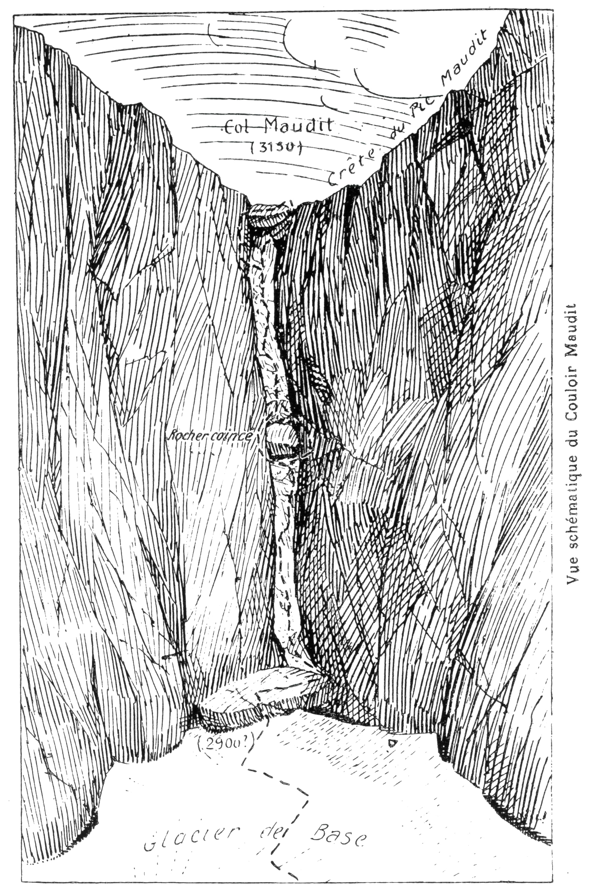

<style>.centre {text-align: center}</style>
<style>.droite {text-align: right}</style>

-----------------------
[//]: # (— p. 277 —)

# VINGT et UNIÈME et VINGT-DEUXIÈME EXCURSIONS

__Le MASSIF des MONTS-MAUDITS__<br>
__Et ses Environs__

__En deux Excursions au départ de LUCHON__

_B. E. — Du 15 Juillet au 15 Septembre._

Cartes à emporter : Bagnères-de-Luchon et Val d'Arouge.

<u>__AVERTISSEMENT de l'AUTEUR__</u>

Un mois serait nécessaire pour visiter tous les sites intéressants
du massif des Monts-Maudits et notamment pour ascendre ses
principaux sommets dont 18 dépassent 3.000 m. A ceux qui ne
disposent que de peu de jours, je conseille d'y faire deux courses
de cinq jours avec les programmes de la vingt et unième et de la
vingt-deuxième excursion. Toutes les parties de leurs itinéraires
ne sont pas également détaillées, estimant qu'il appartient au
guide de choisir la voie la plus propice selon la saison, l'état du
terrain et des glaciers et la qualité de la caravane.

Depuis l'apparition de la première édition de mon « Guide
des Pyrénées » en juillet 1920, deux événements nouveaux sont
venus compléter la connaissance des Monts-Maudits et modifier
sensiblement la manière d'explorer cet important massif :

1° Le repérage détaillé et définitif du Couloir Maudit et la fixation 
des conditions essentielles pour en franchir le fameux col
sans danger (1);

<p class="droite">Voir à la p. 284 la carte spéciale des Monts-Maudits (2).</p>

———<br>
(1) V. Bulletin de la Section des Pyrénées Centrales, n° d'octobre-
décembre 1922.<br>
(2) Pour la partie au N. de la frontière, voir la carte des Environs
de Luchon.

<div class="page"/>

— p. 278 — MONTS-MAUDITS (21me EXCURSION)

2° L'attribution de mon nom au pic coté 2.865 m., pic situé au
S.-E. du massif, et la mise en évidence de cet intéressant sommet.

Par leur position particulière, ces deux sites offrent aux pyrénéistes
des attraits nouveaux par des voies nouvelles : le premier,
parce qu'il est situé au cœur même des Monts-Maudits et qu'il
permet ainsi de nombreuses variantes à travers le massif; le second, 
parce qu'il occupe le centre d'une région étrange, à peu
près inconnue.

Dans l'intérêt de ceux dont le temps est limité, et surtout pour
rester dans la forme pratique et économique, j'ai synthétisé l'exploration
des Monts-Maudits en quatre courses au départ de
La Rencluse. Grâce au passage du couloir Maudit, maintenant
bien connu, on pourra explorer cet important massif par des
voies nouvelles et plus rapides.

Si on se rend à La Rencluse pour réaliser immédiatement les
quatre courses, on a intérêt à les effectuer comme je les indique;
mais, si on ne veut exécuter qu'une partie du programme, on peut
sans inconvénient en intervertir l'ordre.

<u>__AVIS IMPORTANT__</u>

Si on n'est pas soi-même un pyrénéiste très exercé, et qu'aucun
membre de la caravane ne connaisse déjà le massif des Monts-
Maudits, un bon guide est indispensable pour les trois courses
A,B et C.

<div class="page"/>

— p. 279 — (21me EXCURSION) HOSPICE de FRANCE

# VINGT et UNIÈME EXCURSION

__Cinq jours au départ de Luchon__

(Emporter des conserves pour cinq repas).

## JOURNÉE D'APPROCHES

__De LUCHON (629m) à LA RENCLUSE (2.133m),__<br>
__par l'Hospice de France (1.360m), le Port de Venasque (2.448m)__<br>
__et le Pic de Sauvegarde (2.736m).__

—— GUIDE UTILE ——

__Conseils.__ — __Itin. recomm.__ — On partira assez tôt en voiture
jusqu'à l'Hospice de France, afin d'y arriver au plus tard à 7 h.
La montée du Port de Venasque, assez fastidieuse par du soleil,
est au contraire pleine de charme, si on la fait à l'ombre; donc
on doit quitter l'Hospice vers 7 h., heure nouvelle.

De l'Hospice (1.360m), un magnifique sentier monte en pente
douce, en 74 lacets, au Port de Venasque (2.448m). A mesure
qu'on s'élève, on aperçoit, vers l'E. et vers le N., les collines secondaires
s'abaisser et presque se niveler avec la plaine, tandis
que des pics voisins émergent à l'horizon.

Divers points de vue retiennent l'attention au passage : 1° le
_Culet_, roche lisse, presque verticale, sur laquelle glissent plusieurs
petites cascades; 2° l'Homme, longue pierre posée debout
sur un rocher pour indiquer la voie au voyageur quand la couche
de neige est très épaisse (1); 3° le _Trou des chaudronniers_,
grande cavité située à g. du chemin, dans laquelle périrent, sous
la neige, neuf ouvriers de cette profession; 4° les _cinq lacs de
Boum_ qui se déversent l'un dans l'autre, dans un site splendide;
enfin, la grande merveille : _le Port de Venasque_.

Au Port de Venasque, surgit tout d'un coup, comme dans un

———<br>
(1) La cabane de l'Homme est située 2 min. plus haut.

<p class="droite">(Voir ci-contre la vue des Monts-Maudits).</p>

<div class="page"/>

— p. 280 — PORT de VENASQUE (21me EXCURSION)


__Massif des Monts-Maudits__<br>
(Vu du Port de Venasque)

_1. Col des Salenques (2.801m). 2. Pic de La Rencluse. 3. Pic Margalide
(3.258m). 4. Néthou (3.404m). 5. Portillon d'en bas (2.815m). 6. Col
Coroné (3.173m). 7. Pic Coroné (3.310m). 8. Portillon d'en haut (2.908m). 9. 
Pic du Milieu (3.345m). 10. Pic Maudit (3.354m). 11. Maladetta
(3.312m). 12. Premier Pic Occidental (3.204m). 13. Deuxième Pic Occidental
(3.187m). 14. Brèche supérieure d'Albe (3.075m). 15. Dent d'Albe
(3.114m). 16. Pic d'Albe (3.096m). 17. Pic Paderne (2.625m)._

immense lever de rideau, le féerique panorama du massif des
Monts-Maudits, avec ses crêtes vertigineuses et ses glaciers étincelants
Bien que prévenu sur sa magnificence, nul n'aperçoit
ce grandiose spectacle sans éprouver une intense émotion. Seul,
le point de vue de la brèche de Tuquerouye peut lui être comparé
(1).

Du Port de Venasque, on aperçoit très bien le chalet-hôtel de
La Rencluse et la cascade nouvelle qui s'échappe du gouffre de

———<br>
(1) C'est le tirage à part qui nécessite une nouvelle description de
l'ascension au port de Venasque, description parue déjà dans le
volume, à la 18me Excursion. 

<div class="page"/>

— p. 281 — (21me EXCURSION) PIC de SAUVEGARDE

Turmon, maintenant transformé en canal par la percée de son
mur d'enceinte. Si cette cascade peut être utile aux touristes
comme point de repère, je n'en regrette pas moins l'escamotage
de l'attraction naturelle qu'offrait aux passants la mystérieuse
disparition des eaux du glacier de la Maladetta dans les profondeurs
de la terre.

Si on est arrivé au port vers 10 h., on peut effectuer l'ascension
du Sauvegarde avant déjeuner; on trouvera l'amorce du sentier
à une min. en contrebas, à dr. On déposera les sacs à l'amorce
du sentier si quelqu'un doit rester pour les garder; dans le cas
contraire, on les emportera 5 min. plus haut, sur le sentier du
Sauvegarde, afin de les soustraire à la curiosité des nombreux
passants du port.

Un petit sentier, très bien tracé sur les pentes S. du versant
espagnol, conduit à la crête frontière, puis à la cime du Sauvegarde
(2.736m) en 45 min. environ; donc, depuis le port, 1 h. 1/4
suffisent pour l'aller et le retour, arrêts en sus. 

Bien que le Sauvegarde soit un pic de second ordre et d'un
accès très facile, on jouit sur son sommet d'un point de vue incomparable
dans toutes les directions. Pour celui qui veut explorer
les Monts-Maudits, c'est le belvédère idéal, car il aura
sous les yeux tous les détails de cet intéressant massif. C'est, enfin,
pour le simple touriste, l'excursion rêvée, puisqu'on peut monter
à cheval jusqu'à 45 min. du sommet.

Si, de la tourelle, on s'avance d'une quarantaine de m. à toute
crête vers l'O., on aperçoit une partie de la ville de Venasque; du
côté N., parait littéralement sous les pieds, à 500 m. de profondeur, 
le joli petit lac de Baliran. Vers l'O. et vers l'E., la vue
s'étend à l'infini.

Sur le versant espagnol, au S.-O. et à moins de 10 min. du port,
on trouve une bonne source près de laquelle on déjeunera, face
aux Monts-Maudits. L'endroit est des plus attrayants.

Pour se rendre à La Rencluse, on ira rejoindre, à une centaine
de m. à l'E. de la source, le chemin qui va du port à la ville de
Venasque par la vallée de l'Esera. Après quelques lacets en descente
sur un flanc de colline rocheuse, on filera horizontalement,
direction S.-E., à travers le haut plateau gazonné de Peña Blanca,
jusqu'au point où on laisse le sentier qui monte au Port de la
Picade. Le chemin de Venasque tourne alors à dr. en descente

<div class="page"/>

— p. 282 — La RENCLUSE (21me EXCURSION)

rapide direction S.-O., pour aboutir au fond de la Vallée de
l'Esera. On le quittera 10 min. après, à la première amorce d'un
sentier qui tourne à g. et qui, après être descendu au Plan des
Etangs vers 1.900 m. d'alt., remonte en face, droit à La Rencluse.
On aura perdu le chalet-hôtel de vue en arrivant au creux de la
vallée, et il n'apparaitra à nouveau que quelques min. avant d'y
arriver.

__Horaire :__

```
De Luchon à l'Hospice de France, 10 k. 500 de route. }
De l'Hospice au Port de Venasque.............. 2h.45 } 6h. de marche
Du Port au Sauvegarde, aller et retour........ 1h.15 } (Arrêts en sus).
Du Port de Venasque à La Rencluse............. 2h. » }
```

> Nota. - Le programme général des courses aux Monts-Maudits
est le même pour les Espagnols que pour les Français, sauf
qu'ils devront se rendre à La Rencluse le soir de la « Journée
d'approches », et qu'ils redescendront à Venasque l'après-midi
de la dernière journée, au lieu de rentrer à Luchon.

<u>__NOTICE sur LA RENCLUSE__</u>

Le Chalet-Hôtel de La Rencluse qu'on a construit sur le versant
septentrional du massif des Monts-Maudits, à 2.133 m. d'alt.,
est situé à l'E. de l'ancienne cabane, sur un petit plateau qui le
met à l'abri des avalanches et de la tramontane; il a été auvert
au public en 1916. C'est une bâtisse ordinaire qu'on aperçoit très
bien du port de Venasque, ainsi que le sentier qui y conduit. Une
quarantaine de personnes peuvent y coucher, soit dans les chambres
particulières du premier, soit dans le dortoir du second.

Tous ceux qui, depuis la construction, ont eu le rare plaisir
de pouvoir séjourner à La Rencluse et surtout d'ascendre quelques-
unes des grandes cimes voisines, estiment à un haut degré
la commodité de cette hôtellerie de montagne et l'aménité sans
pareille de la tenancière, Mme Sayo. A l'ancienne Rencluse, dans
cette rustique cahute sous roche, nous avions déjà apprécié les
qualités de cœur de cette aimable dame, qualités qui se sont amplifiées
avec le confortable des lieux. Cuisine excellente et copieuse, 
consommations supérieures, service parfait et prix raisonnables, 
voilà le caractéristique de ce petit paradis des pyrénéistes

Dans l'intérêt du pyrénéisme, formulons aujourd'hui un
souhait : c'est que la peseta retrouve sa modestie d'antan.

<div class="page"/>

— p. 283 — (21me EXCURSION) Le TROU du TORO

__<p class="centre">Course A (deux jours)</p>__

## PREMIÈRE JOURNÉE

__De LA RENCLUSE (2.133m)à l'HOSPICE de VIELLA (1.626m),__<br>
__par le Trou du Toro (2.020m), le Col des Salenques (2.801m),__<br>
__le Pic Pierre-Soubiron (2.865m) et les lacs de Rio Bueno.__

—— GUIDE INDISPENSABLE ——

__Conseils.__ — __Itin. recomm.__ — On partira de très bonne heure,
car cette journée d'excursion est l'une des plus longues de la
région. Reprenant le chemin d'arrivée, on le quittera 10 min.
après pour tourner à dr. vers une cabane; là, le sentier remonte
à l'E. pour aboutir au plateau gazonné qui mène au Trou du Toro
où s'engouffrent les eaux pour reparaître on ne sait où.

Le Trou du Toro est l'une des curiosités de la région des Monts-
Maudits. Situé au Plan des Agualluts, à 2.020 d'alt., il forme un
bassin rond, très régulier et très profond, où les eaux des glaciers
du Néthou, des Salenques et du Moulières tombent en une belle
cascade. Entouré de toutes parts de murailles à pic, on domine,
sur tout son pourtour et à une grande hauteur, les eaux tranquilles
de son lac. On voit par où elles entrent dans le bassin, mais
on ne voit pas où elles s'écoulent.

_L'Enigme du Trou du Toro vient d'entrer, je crois, dans sa
phase finale, grâce aux trois campagnes spéléologiques de notre
courageux et savant collègue du C. A. F., M. Norbert Casteret.
Voici ses conclusions dont il entend conserver toute la responsabilité_

1° _La source géographique du rio Eséra, jamais précisée, se
trouve au lac supérieur de Villamuerta;_

2° _Les eaux englouties au Trou du Toro ne revoient pas le jour
dans la vallée de l'Eséra;_

3° _Le torrent qui jaillit au Goueil de Jouéou, dans la vallée
d'Artiga de Lin, est celui-là même qui disparait sous terre au Trou
du Toro;_

4° _La Garonne occidentale prend sa source aux grands glaciers_

<div class="page"/>

— p. 284 — PLAN des AGUALLUTS (21me EXCURSION)


_N. du Néthou qui sont tributaires de l'Océan Atlantique. Le rio
des Barrancs n'est autre chose que la Garonne naissante (1)._

Longeant le Trou du Toro par la g., on traversera le Plan des
Agualluts direction S., afin d'aboutir à l'étroit goulet qui s'ouvre
à l'entrée du vallon des Barrancs. En passant par là, on raccourcit
sur le trajet du sentier qui s'amorce plus à l'E., en haut du
Plan des Agualluts. 

On grimpera pendant quelques min. entre deux bandes rocheu-

———<br>
(1) Norbert Casteret. « L'Enigme du Trou du Toro. Détermination
des sources du rio Esera et de la Garonne occidentale. » (Bulletin de
da Société d'Histoire naturelle de Toulouse, 1er fascicule 1931.)

<div class="page"/>

— p. 285 — (21me EXCURSION) COL Des SALENQUES

ses, à travers de hautes herbes, mais bientôt le terrain s'améliore
et on retrouve le sentier. Ce dernier monte par la rive dr. pendant
1/4 d'h. environ, puis se perd dans la rocaille au point où
le vallon s'élargit. Il faut alors franchir le torrent et monter sur
les terrasses gazonnées de la rive g., au haut desquelles le vallon
se divise en deux. C'est par la branche E., et par une étroite
gorge, que s'écoule le ruisseau qui descend du Lac des Barrancs;
mais c'est par la branchel O. qu'on trouve encore quelques traces
de sentier. On montera donc par le vallon O. jusqu'au petit Col
des Barrancs (2.478m).

De ce point, on a devant soi, tout en haut au S.-S.-E., le Col
des Salenques (2.801m), et on peut en repérer toute la voie d'ascension
jusqu'au haut du glacier. Après une descente d'une cinquantaine
de m., on apercevra sur sa g. le Lac des Barrancs et
on perdra toute trace de sentier. C'est, tantôt à travers la rocaille
et tantôt par des glaciers, qu'on fera l'ascension du Col des Salenques.

Parvenu au col, on découvrira subitement le Pic Pierre-Soubiron, 
dont la cime émerge derrière le contrefort E. du Pic
Russell, à g. de celui-ci. Au S.-E., s'enfonce la sauvage et profonde
vallée des Salenques.

En raison de sa situation et de sa haute alt., le Col des Salenques
est un très beau belvédère vers le S. et vers le N.; dans cette
dernière direction, la vue passe par-dessus la chaîne frontière
pour s'étendre jusqu'aux plaines de Saint-Gaudens et de Toulouse.

Pour parvenir au Pic Pierre-Soubiron, il' aut perdre d'abord
une centaine de m. d'alt. dans la vallée des Salenques, puis remonter
en face, droit au S., afin de contourner le contrefort E.
du Russell. Si le glacier qui est au-dessous du col est ramolli dans
sa couche supérieure, sous l'action du soleil, on gagnera au moins
20 min en le descendant en glissade. S'il est bien glacé, on le
longera vers le bas par les rochers de dr., en perdant le moins
d'alt. On remontera immédiatement en face, puis on passera à la
base du contrefort E. du Russell en suivant une vague trace de
sentier. Bientôt le Pic Pierre-Soubiron apparaît, majestueux, droit
au S. On n'aura alors qu'à le prendre comme point de direction
et à marcher vers lui.

Après une petite descente, on remontera en pente douce à travers
une région unique dans toutes les Pyrénées. Pendant plu-

<div class="page"/>

— p. 286 — COL PIERRE-SOUBIRON (21me EXCURSION)

sieurs kilomètres, on cheminera, tantôt sur des dalles de granit
polies par les anciens glaciers, tantôt par de minuscules couloirs
de verdure. On aboutira enfin près du grand Lac Russell dont on
franchira le déversoir. Obliquant alors vers l'O., par une petite
remontée, on parviendra au haut des berges N. du Lac Packe
qu'on aura littéralement sous les pieds, à 100 m. de profondeur.


__Pic Pierre-Soubiron__ (2.865m). Face Nord. 1. 
Lac Packe (2.650m). — 2. Pic. — 3. Col Pierre-Soubiron (2.750m).

Cette région est splendide. Je ne connais rien dans les Pyrénées
qui puisse être comparé à ces lieux pour leur grande sauvagerie
On a l'impresssion qu'on a abandonné toute civilisation
pour un exil des plus lointains.

Le Pic Pierre-Soubiron est là, en face, de l'autre côté du lac,
dont la muraille N., haute de plus de 200 m., baigne directement
dans ses eaux. A dr. du pic, tout près, on aperçoit le Col Pierre-
Soubiron qui fait communiquer la vallée des Salenques avec les
vallons de Llauzet et de Rio Bueno; on se dirigera vers lui en
contournant le lac par les hautes berges de droite. Du col, on

<div class="page"/>

— p. 287 — (21me EXCURSION) PIC PIERRE-SOUBIRON

grimpera à flanc S. de crête, droit au sommet coté 2.865 et surmonté
d'un petit cairn.

La première ascension du Pic Pierre-Soubiron en a été faite
en août 1920, par mes disciples Jean Arlaud et Henri Sabadie.
Sur la proposition d'Arlaud, la Commission de toponymie franco-
espagnole lui a donné mon nom, en reconnaissance de mes services
au pyrénéisme. La deuxième ascension a été effectuée par
six membres de la Section des Pyrénées Centrales, sous ma direction, 
le 23 août 1921, afin de procéder au baptème du pic. Enfin,
une nouvelle caravane de huit en a fait la troisième ascension
le 3 août 1922.

Le Pic Pierre-Soubiron (2.865m) est une montagne granitique,
parsemée de cristaux de roche sur sa face S. Bien que n'atteignant
pas 3.000 m., il n'en est pas moins un belvédère de premier
ordre, en raison de son isolement absolu. Sauf par la face N.,
qui est presque verticale et qui plonge directement dans le Lac
Packe, son ascension en est très facile. C'est son grand éloignement
de tout gite qui en rend l'ascension assez dure.

__Situation du pic Pierre-Soubiron et notes explicatives__

De la chaîne qui va du pic Russell aux pics de Malibierne, se
détache, vers l'E., un chaînon secondaire qui sépare la vallée
des Salenques des vallons de Los Anglos et de Rio Bueno. C'est
le point culminant de ce chaînon qui est le pic Pierre-Soubiron
(2.865m).

Le versant N., presque vertical, baigne directement dans le
lac Packe (2.650m); les pentes S., plus douces, vont mourir sur
les lacs de Los Anglos et sur ceux de Rio Bueno. Du sommet,
on aperçoit douze lacs, dont quatre très importants.

Son tour d'horizon s'étend à l'infini vers l'E. et le S. Les sommets
qui limitent une partie de la vue vers le N. et l'O., sont
à environ 3 kilomètres.

La meilleure voie d'ascension, au départ de La Rencluse, passe
par le col des Salenques. On peut, dans l'après-midi, soit rentrer
à La Rencluse, soit descendre par le vallon de Rio Bueno peur
aller coucher à l'Hospice de Viella ou au village de Senet. Un

<div class="page"/>

— p. 288 — LACS de RIO BUENO (21me EXCURSION)

bon marcheur aurait le temps de faire, de jour, le trajet de
La Rencluse à Venasque par le pic Pierre-Soubiron, le col et la
vallée de Malibierne.

L'ascension du pic Pierre-Soubiron peut être facilement faite
dans la journée des points ci-dessous, et par les itinéraires suivants

1° De La Rencluse, par le col des Salenques, en 10 h., aller
et retour;

2° De l'Hospice de Viella, par le vallon de Rio Bueno, en
9 h., aller let retour;

3° De Senet, par de col de ce nom et les lacs de Rio Bueno,
en 8h.45, aller et retour.

Arrêts en sus.

Du sommet du pic, on domine au S. le vallon désolé de Los
Anglos et au S.-E., celui de Rio Bueno qui lui fait suite avec ses
trois jolis lacs. On descendra de terrasse en terrasse vers les
lacs de Rio Bueno qu'on longera par la g.; on rejoint là un petit
sentier. Après avoir franchi le déversoir du lac inférieur (2.195m),
le sentier fait un grand lacet vers la dr., puis reprend la descente
direction N.-E., sur une pente rapide. On aperçoit alors le bas de
la vallée des Salenques à 500 m. de profondeur, et plus loin, à
dr., son confluent avec celle de la Ribagorzana.

Une vague trace de sentier descend maintenant rapide, à travers
des éboulis, pour aller se perdre dans un flanc inextricable
de taillis et de rhododendrons; c'est le seul trajet désagréable
de la journée. On descendra lentement et verticalement en utilisant
le creux d'un minuscule vallon herbeux, au bas duquel
on rejoindra un nouveau sentier qui conduit près du torrent
des Salenques.

A partir de ce point, il y a un sentier sur chaque rive; mais,
pour aller à l'Hospice de Viella, on a avantage à suivre celui
de la rive g.; on sautera donc le ruisseau, soit à travers de
grosses pierres, soit en passant sur un tronc de sapin, s'il existe
encore. Après une demi-h. de marche, on débouche à la grande
vallée de la Ribagorzana, 5 k. en aval de l'Hospice de Viella,
et on passe de l'Aragon dans la Catalogne.

Un grand chemin de chars remonte la vallée par la rive dr.
jusqu'à 10 min. de l'Hospice de Viella (1.626m), où il passe rive g.
L'Hospice est construit au centre de vertes pelouses qu'entou-

<div class="page"/>

— p. 289 — (21me EXCURSION)  HOSPICE de VIELLA

rent des forêts noires de sapins gigantesques. Les crêtes très
élevées qui le dominent le protègent contre la fureur des vents.

L'Hospice de Viella n'est pas très confortable; il y a cependant
quelques lits et la nourriture est passable. Il est très important
de faire les prix du tout à l'avance. (V. 23° E.)

__Horaire :__

```
De La Rencluse au Col des Salenques.... 3h.15 }
Du Col des Salenques au Pic Pierre-Soubi-     }
  ron.................................. 2h.30 }   9 h. 45
Du Pic Pierre-Soubiron à l'Hospice de         } (Arrêts en sus).
  Viella                                4h    }
```

### La Haute Ribagorzana

La Haute Ribagorzana est une véritable vallée suspendue, d'un
pittoresque grandiose, qui a pour base l'Hospice de Viella
(1.626m) et pour sommet le Pic de Moulières (3.005m) qui trône
dans pon axe, tout en haut, à l'O. Elle est creusée entre la ligne
de partage des eaux d'Europe, qui passe à la crête du Gerbauze,
et les hautes murailles du Féchan qui la dominent verticalement
sur toute sa longueur.

Dans mon guide des Pyrénées, p. 222, j'ai décrit le site au
centre duquel est bâti l'Hospice de Viella et les forêts qui l'entourent; 
c'est un lambeau de l'une de ces forêts qui cache aux
passants l'entrée de la haute vallée de la Ribagorzana, l'une des
plus captivantes des Pyrénées.

En amont des derniers sapins, vers 1.800 m. d'alt., on découvre
subitement la cuvette d'un ancien lac, transformé aujourd'hui
en un cirque de verts pâturages. Au-dessus, la pente se redresse
immédiatement pour conserver une moyenne qui dépasse 30 %.
Aux 3/4 de la hauteur, on trouve encore trois lacs étagés, lacs
qui restent glacés pendant 11 mois. La splendeur de la Haute
Ribagorzana n'a d'égale que l'oubli dans lequel on l'a laissée jusqu'à 
ce jour.

Sauf le compte rendu de mes deux excursions, l'une à la descente
en 1912 et l'autre à la montée en 1922, je ne connais
aucune relation sur cette intéressante vallée. C'est elle que nous
allons remonter pour aller de l'Hospice de Viella à La Rencluse,
en faisant au passage la Fourcanade et le Moulières.

<div class="page"/>

— p. 290 — HAUTE RIBAGORZANA (21me EXCURSION)

__<p class="centre">Course A</p>__

## DEUXIÈME JOURNÉE

__De l'HOSPICE de VIELLA (1.626m) à LA RENCLUSE (2.133m),__<br>
__par La Fourcanade (2.882m) et le Pic de Moulières (3.005m).__

—— GUIDE INDISPENSABLE ——

__Conseils.__ — __Itin. recomm.__ — On aura soin, la veille, de faire
ses provisions et de régler ses dépenses, afin d'être libre de partir
à la première heure.

On partira, direction N., par le chemin du Port de Viella; on
le quittera 2 min. après pour suivre, à g., un petit sentier qui
traverse des prairies et tourne, à l'O., vers la forêt de sapins
qui dissimule l'entrée ide la Haute Ribagorzana. Le chemin zigzague
la forêt, puis débouche à découvert sur la digue de l'ancien
lac, aujourd'hui transformé en cirque verdoyant. On franchira
alors le torrent et on longera ensuite de petit cirque par
le S. jusqu'en haut, où l'on passera définitivement sur la rive g. de
la vallée. A partir de là, la pente est très raide jusqu'à la crête
de Gerbauze.

Au début, il faut s'élever très haut par la dr. afin de rejoindre
un sentier de moutons qui longe la base des rochers pendant
3/4 d'h., et qui tourne ensuite légèrement à g., à travers des
pâturages, jusqu'à des bandes rocheuses très inclinées. Au Haut
de celles-ci, on découvrira subitement le premier des trois lacs,
le plus grand, dans sa cuvette de granit. On se retournera alors
pour jouir du beau point de vue sur les Bécibéri et le Comolo
Forno.

On continuera l'ascension le long des lacs qu'on laissera à g.
et, parvenu à la hauteur du troisième et dernier, on tournera
carrément à dr., direction N., pour zigzaguer de rudes pentes
gazonnées; on grimpera ensuite, par une succession de petites
terrasses et un ravin d'éboulis, vers une petite échancrure de la
crête de Gerbauze qu'on aperçoit seulement 20 min. avant d'y
arriver. Cette brèche est située entre un contrefort du petit Moulières, 
à g., et le Pic de Gerbauze (2.714m), à dr.

On franchit là la ligne de partage des eaux d'Europe, puisque

<div class="page"/>

— p. 291 — (21me EXCURSION) FOURCANADE — MOULIERES

la Ribagorzana s'écoule sur l'Ebre, tandis que les eaux du Cirque
de Los Négros descendent sur Viella où elles se jettent dans la
Garonne. On aura, en face, les deux pointes principales de la
Fourcanade, dont je conseille de faire l'ascension avant de
déjeuner.

De la brèche de Gerbauze, on marchera presque horizontalement, 
à flanc de montagne et en contournant trois petits ravins,
afin d'aboutir directement au pied de la pointe S., où l'on déposera
le sac et le piolet. C'est par un petit couloir de la face S.
de la pointe méridionale qu'on montera, pour passer ensuite à
la pointe N. qui est la plus élevée; un col impressionnant, mais
facile, les fait communiquer.

Pour cette ascension, les conseils suivants me paraissent indispensables: 
1° A l'ascension de la première pointe, le meilleur
pyrénéiste passera le premier; le guide montera le dernier, afin
d'enrayer en cas de dérapage; 2° Pour le passage d'une pointe
à l'autre, on renversera l'ordre de marche; 3° Pour la descente.
le guide passera le premier, suivi immédiatement du touriste le
moins exercé. On redescendra par la voie d'ascension.

Le plus joli point de vue est à la pointe N. (2.882m), mais ce
qui fait de grand intérêt de la Fourcanade, c'est da difficulté spéciale
de son ascension. On ne domine le paysage que dans un
petit rayon, et cependant on a la sensation d'être suspendu très
haut, sur un terrain des plus instables.

Sauf sur la crête du Comolo Forno, sur aucun autre sommet
je n'ai ressenti pareille impression. Sur les faces N., les pointes
de la Fourcanade sont terrifiantes; on les croirait en surplomb.

Après avoir repris le sac et le piolet, on remontera direction
S., en suivant la base de la crête qui relie la Fourcanade
au Petit Moulières, afin d'aboutir au Col Alfred (2.849m). Ce col
est une large dépression de la crête, au N. et tout près du Petit
Moulières;, on y déposera le sac et on fera, au S.-O., l'ascension
facile du Moulières (3.005m) en 1h.15, aller et retour.

Le Moulières est un belvédère de premier ordre; si on s'avance
de quelques pas au S. et à d'E. de la tourelle, on revoit avec
émotion presque tout le paysage parcouru depuis la veille. Le
Pic Pierre-Soubiron est à deux pas, et l'Hospice de Viella parait
tout au fond, au milieu de son cirque verdoyant. Les lointains
sont magnifiques.

<div class="page"/>

— p. 292 — COL ALFRED  (21me EXCURSION) 

Du Col Alfred, on descendra à sa fantaisie, direction N., en
obliquant légèrement à dr., afin d'aboutir au vallon qui contourne
le massif des Barrancs par l'E.; on y rencontre trois petits lacs
et on passe près du Col des Aranais qu'on daisse à dr. On longera
les deux premiers lacs par la dr. et le troisième par la g.
Après ce dernier, on trouve un bon sentier qui descend directement
au Plan des Agualluts, et on rejoint bientôt le chemin de
la veille, près du Trou du Toro. De là, 3/4 d'h. suffiront pour
rentrer à La Rencluse.

__Horaire :__

```
De l'Hospice de Viella à La Fourcanade... 4h.30 }
De La Fourcanade au Col Alfred........... 1h. » }   9h.30
Du Col Alfred au Moulières (all. et ret.) 1h.15 } (Arrêts en sus).
Du Col Alfred à La Rencluse.............. 2h.45 }
```

__<p class="centre">Course B (un jour)</p>__

## Traversée du Col Maudit

__De LA RENCLUSE (2.133m) à LA RENCLUSE,__<br>
__par la Dent d'Albe (3.114m),__<br>
__le Lac Grégonio, le Col Maudit (3.150m) et la Maladetta (3.312m).__

<u>__NOTICE sur le COL MAUDIT__</u>

Bien que Russell ait écrit « Il n'y a pas un isard qui puisse le
traverser » (1), l'itinéraire de son passage en est maintenant
connu et précisé, grâce à un compte rendu paru dans le Bulletin
de la Section des Pyrénées Centrales, d'octobre à décembre 1922.
Tout pyrénéiste exercé peut s'offrir, désormais sans danger, le
régal de cet impressionnant passage.

Voici la liste des traversées connues à fin 1923 :

1° La première a été effectuée en août 1908 par M. Busquet,
de Barcelone, avec le guide Anselmo, de Venasque.

———<br>
(1) Souvenirs d'un Montagnard, 2e édition, p. 472.

<div class="page"/>

— p. 293 — (21me EXCURSION) COL MAUDIT

2° Le 22 juillet 1910, deux intrépides étrangers, munis d'une
corde de 60 m., en ont réussi la deuxième.

3° Mon collègue Eugène Fache, en a fait la troisième en août
1919, accompagné des guides J. Haurillon et Antonio Abadia.

4° La première traversée à la descente a été réalisée en juillet
1920, par une caravane de sept Catalans, sous la direction de
Luis Estasen, grâce à plusieurs rappels de corde.

5° L'unique traversée sans cordes ni guide a été merveilleuscment
réussie par une caravane de six membres de la Section des
Pyrénées Centrales, le 5 août 1922, sous ma direction. C'est cette
traversée qui a permis de fixer définitivement le meilleur itinéraire, 
la meilleure époque et l'heure la plus favorable pour éviter
le danger des chutes de pierres.

6° Enfin, le 13 août 1923, la première traversée féminine du
fameux passage a été effectuée par une jeune Toulousaine
Mlle Jane Renodier, accompagnée de M. Laborde-Padie et de
M. Jean Sabadie comme chef de course.

Depuis, on ne compte plus, tellement est important le nombre
de ceux qui le franchissent tous les ans à la belle saison.

<u>__CONCLUSIONS PERSONNELLES sur la Traversée du COL MAUDIT__</u>

A. — Jusqu'au 10 août, à da condition d'être au moins trois
et que le couloir soit sans neige, les difficultés sont moyennes
pour des pyrénéistes exercés.

B. — Passé le 10 août, on s'expose à trouver la rimaye de
base grande ouverte, ce qui constituera la plus grande difficulté
soit à la montée, soit à la descente.

C. — La traversée à la montée offre plus de charme qu'à là
descente et est moins dangereuse.

D. — Comme nombre de touristes, il faut être au moins trois,
mais ne pas dépasser six.

E. — Il ne faut pas tenter le passage, s'il survient un mauvais
temps subit ou une chute de neige fraîche.

<div class="page"/>

— p. 294 —



<div class="page"/>

— p. 295 — (21me EXCURSION) DENT D'ALBE

__Conseils.__ — __Itin. recomm.__ — On partira de très bonne heure,
car, pour éviter le danger des chutes de pierres au couloir Maudit, 
il faut y passer, non seulement avant l'arrivée du soleil, mais
encore avant le relèvement de la température qui, à cette alt. et
à l'ombre, commence vers 11 h. Il faut donc qu'à cette heure-là
le col soit franchi.

On prendra, au S.-O., le sentier qui monte au Lac Paderne
qu'on longera par la dr., pour gagner les terrasses supérieures
vers le massif d'Albe. Après 2 h. d'ascension, on parviendra à
hauteur du Pic d'Albe (3.096m), qu'on laissera à dr.; on remontera
par la g. l'étroit vallon qui mène à la brèche supérieure
d'Albe (3.075m), où on franchit la crête des Monts-Maudits.

Au moment de s'engager dans le vallon, on apercevra en haut,
sur sa dr., les deux pointes de la Dent d'Albe, séparées par un
petit col; c'est la pointe N. qui est la plus élevée.

Parvenu à la Brèche supérieure d'Albe, où se trouve une petite
tourelle, on passera sur le versant S., en faisant un crochet de
2 min. à dr., et on déposera le sac et le piolet au pied d'une
petite cheminée rapide qui monte au petit col situé entre les
deux pointes. A quatre pattes, en 20 min., aller et retour, on fera
l'ascension de la pointe N. qui a nom Dent d'Albe (3.114m). C'est
la cime la plus intéressante de l'extrémité N.-O. du massif, tant
par sa forme accidentée que par son magnifique point de vue.

Après avoir repris sac et piolet, on filera, direction S., par
les pentes méridionales de la Maladetta et sans descendre audessous
de 2.900 m., afin d'aboutir presque horizontalement à
la base du glacier situé au pied du Couloir Maudit. Dans ce
trajet, on contournera en hauteur une partie du Lac Grégonio et
ce parcours seul suffirait à justifier cette excursion, en raison
de la grandeur et de la beauté de cette région.

Pour attaquer le couloir Maudit, il faut, d'abord, zigzaguer Je
glacier de base en taillant des pas à la partie supérieure. Si la
rimaye n'est pas ouverte, on abordera facilement le couloir en
grimpant sur une large corniche de granit qui forme un magnifique
balcon de 3 m. de long sur 1 m. de large. C'est là qu'on
prend les dispositions définitives pour la traversée qui ne
demande que 45 où 50 min. Ce balcon est exactement au centre
de base du couloir rocheux.

<div class="page"/>

— p. 296 — COULOIR et COL MAUDIT (21me EXCURSION)

Voici maintenant l'itinéraire à suivre pour l'ascension du couloir
jusqu'au col.

A l'extrémité droite du balcon, il faut se hisser sur une vire,
suivie d'une corniche facile qui fait bientôt un crochet à g., et
conduit le touriste là la naissance d'un étroit canal granitique
situé au centre du grand couloir. Ce canal grimpe droit au col,
avec une pente moyenne de 65 à 70 degrés. On montera par là
en prenant soin de ne pas faire glisser des pierres.

A mi-hauteur, on trouve un rocher coincé qui barre la route;
on peut franchir ce passage de deux manières : 1° par la dr.
en montant sur les épaules d'un camarade; c'est le plus grand
et le plus agile qui fera la courte échelle; 2° par la g., en se
hissant à la force du poignet sur une petite corniche qui rejoint
l'étroit canal au-dessus du rocher coincé. Les prises sont très
bonnes, et tout pyrénéiste exercé passera par là.

A partir du rocher coincé, la partie est gagnée; il n'y a plus
la moindre difficulté. L'important est de marcher en rang serré,
à cause de la forte pente à travers des cailloux instables qui
garnissent Je creux du couloir. La moindre petite pierre qui
filerait serait un gros danger pour le dernier touriste, s'il était
éloigné.

Au sommet du couloir, une haute muraille en surplomb le
ferme en travers, et semble en interdire la sortie; il n'en est
rien, et, comme au rocher coincé, on peut passer par les deux
côtés.

Passage de droite : Par un rétablissement facile et quelques
pas vers le S., on débarque sur une terrasse rocheuse qui domine
le couloir, et qui constitue une partie du Col Maudit.

Passage de gauche : Il faut se hisser sur une étroite et rapide
corniche, bordée en dehors par une petite arête en dents de
scie qui forme rampe, corniche qui grimpe droit au col. C'est
un chemin acrobatique, qui procure à celui qui y passe un supplément
de fortes sensations.

On déjeune ordinairement au col même, car, en cas de vent,
on peut très bien s'abriter sous un gros rocher situé dans la
partie N.

Du Col Maudit, on peut faire l'ascension de la Maladetta
(3.312m) dans 1 h. environ, aller et retour, à la condition d'v
monter à toute crête; pour un pyrénéiste exercé, c'est la voie la

<div class="page"/>

— p. 297 — (21me EXCURSION) COL MAUDIT


1. Crête montant au Pic Maudit (3.350m). 2. Caravane de 5 alpinistes
descendant du Col Maudit (3.150m). 3. Col Maudit (3.150m). 4. Crête
montant à la Maladetta (3.312m).

plus intéressante. Cette ascension est le complément naturel de
la traversée du Col Maudit.

On montera direction N. vers le petit col qui s'échancre dans
la crête S. de la Maladetta, où on déposera le sac et le piolct.
A partir de là, on grimpera d'abord à flanc E. de crête, puis,
pendant quelques min., à flanc O., et enfin à toute crête jusqu'au
sommet. A moitié ascension, on apercevra au passage un petit
chef-d'œuvre d'architecture naturelle constitué par un chapiteau,
sur lequel s'appuie un balcon vertigineux.

Le belvédère de la Maladetta est incomparable dans toutes les
directions; aucun autre sommet du massif ne procure au touriste
un si beau spectacle.

Après avoir repris sac et piolet, on descendra direction E., à
travers le glacier du Néthou, puis, au bout de 20 min. environ,

<div class="page"/>

— p. 298 — LAC des GOURGOUTES (21me EXCURSION)

on tournera droit au N. pour rentrer à La Rencluse par le
Portillon d'en bas.

> Nota. - Du Col Maudit, on peut, au lieu de l'ascension de la
Maladetta, faire celle du Néthou; il faut environ 1h.30 pour y
parvenir. On suit le haut du glacier jusqu'au Col Coroné (3.173m)
où on laisse le sac. A partir de là, l'itinéraire est classique :
on remonte le Dôme et on franchit le Pas de Mahomet.

__Horaire :__

```
De La Rencluse à la Dent d'Albe....... 3h. » }
De la Dent d'Albe au pied du Couloir         }
  maudit.............................. 1h.50 }   8h.45
Du pied du Couloir au Col Maudit...... Oh.50 }
Du Col Maudit à la Maladetta.......... Oh.35 } (Arrêts en sus)
De la Maladetta à La Rencluse......... 2h.30 }
```

<u>__AVIS AUX TOURISTES__</u>

Si, parvenu au pied du couloir Maudit, on est obligé, pour
une cause quelconque, de renoncer au passage, on redescendra
coucher aux Bains de Venasque (1.702m) par l'itinéraire suivant: 
On dévalera sur le Lac de Grégonio qu'on longera par la
rive dr. jusqu'au déversoir. On remarquera au passage un grand
abri sous un immense rocher situé au N. du lac, abri où pourraient
coucher 50 personnes.

A 1/4 d'h. en aval du déversoir, on laissera le vallon de Grégonio
s'enfoncer à g., et on continuera à flanc, direction N.-O.
et à travers la rocaille, pour aboutir à-un petit col situé au
milieu d'un bouquet d'arbres. De ce point, les Bains de Venasque
paraissent au N., à 20 min. en contrebas.

Le lendemain, on pourrait rentrer à La Rencluse par le Pic
d'Albe (3.096m).

## CINQUIÈME JOURNÉE

__De la vingt et unième Excursion__

__De LA RENCLUSE (2.133m) à LUCHON (629m)__<br>
__par le Lac des Gourgoutes, le Pic de Sacroux (2.678m),__<br>
__le Cirque des Graouès et la Cascade du Cœur.__

—— GUIDE UTILE ——

__Conseils.__ — __Itin. recomm.__ — On descendra par le Plan des
Etangs jusqu'à l'Hospice de Venasque qu'on laissera à g. pour
monter au N.-O., afin de rejoindre le chemin du Port de la Glère.
On franchira le torrent qui descend du lac des Gourgoutes et

<div class="page"/>

— p. 299 — (21me EXCURSION) PIC de SACROUX

on suivra le sentier qui en remonte la rive dr., en de multiples
lacets, jusqu'au premier plateau. Là, il passe rive g. et, après
avoir traversé des pâturages et fait un crochet vers l'E. il
revient vers le torrent pour s'engager dans le vallon des Gourgoutes
qu'il suit jusqu'au port. En amont du lac des Gourgoutes,
à 2 min. du Port de la Glère (2.323m), on trouve l'une des meilleures
sources de la région. Laissant le port à dr., on montera
direction N.-O., afin d'aboutir au pied du Sacroux dont on fera
l'ascension directe par la face S.

Le Sacroux (2.678m), d'accès facile, est un magnifique belvédère
sur le Cirque du Lys et sur la vallée de la Pique. Tous
ceux qui, de Luchon, sont montés à la vallée du Lys ou à l'Hospice
de France, ont aperçu de la route, avant d'arriver à Ravi,
la calotte noire d'un sommet qui s'estompe dans le ciel, droit
au S.; c'est le Sacroux.

Quoique certains écrivains le placent en dehors du magnifique
Cirque du Lys, il doit être compris dans le nombre des sommets
qui le couronnent. La ligne de crête qui forme la branche E.
du fer à cheval prend naissance au Mail Barrat (3.060m) à partir
duquel elle décline par le Mail Pintrat, le Sacroux et la Serre
des Cabales jusqu'au Mont du Lys (2.222m).

Du Sacroux, on domine, à l'O., toute la région des Graouès,
du Boum et de la Tusse de Maupas. On pourra repérer presque
toute la voie d'ascension aux deux derniers sommets.

Du sommet du Sacroux, on se dirigera à l'O. et, par une marche
presque horizontale en longeant les pentes N. du Pic des
Taouas, on ira rejoindre le haut de la crête de la Serre des Cabales. 
On trouvera par là les traces de l'ancien sentier, aujourd'hui 
disparu. Parvenu au haut de la Serre des Cabales, on dominera
tout le Ciraue des Graouès et on aura à ses pieds. à g., le
magnifique lac de Port Bieil, enchâssé dans sa conque de granit.
Un peu plus bas, à la dépression de la crête, on rejoindra le
nouveau sentier qui descend à la vallée du Lys par le Cirque des
Graouès et la cascade du cœur. On suit d'abord la crête de la
Serre des Cabales, puis on dévale à g., au fond du Cirque des
Graouès, jusqu'à la cabane de la Coume. A partir de là, le sentier
longe le ruisseau de Houradade par da rive dr., en passant devant
la cascade de Trégon, et on aboutit à la prairie de l'Artigue. près
de la cascade de Solage. Au bas de la prairie, on retrouve le che-

<div class="page"/>

— p. 300 — VALLEE du LYS (21me EXCURSION)

min qui descend directement à l'Hôtellerie du Lys, en longeant
au passage la belle cascade du Cœur.

De l'Hôtellerie du Lys à Luchon, 11 k. de route qu'on pourra,
sans doute, faire en voiture, les occasions étant fréquentes l'été.

__Horaire de la Journée :__

```
De La Rencluse à la Fontaine de La Glère. 3 h.30 }
De la Fontaine de La Glère au Pic de Sa-         } 8h.45
  croux.................................. 1 h. » } (Arrêts en sus).
Du Sacroux à Luchon...................... 4 h.15 }
```

> Nota. - On peut aussi, au départ de Luchon, faire l'ascension 
du Sacroux comme je l'indique ci-dessous.

1° En couchant la veille à l'Hospice de France puis en suivant
le sentier du Port de la Glère, qu'on nomme « Chemin de
l'Impératrice ». Ce sentier s'amorce sur le chemin du Port de
Venasque à 1/4 d'h. environ de l'Hospice, immédiatement après
le deuxième pont. Il contourne presque horizontalement les
contreforts N. de la crête de Baliran, pour aboutir au cirque de
la Glère, d'où il monte au port en de nombreux lacets.

2°. En allant coucher à la maison forestière de Jouèou pour
monter, le lendemain, par le Gouffre Maleplate, au cirque de la
Glère. Par cette dernière voie, l'ascension est plus dure, puisqu'il 
faut s'élever de près de 1.800 m.
