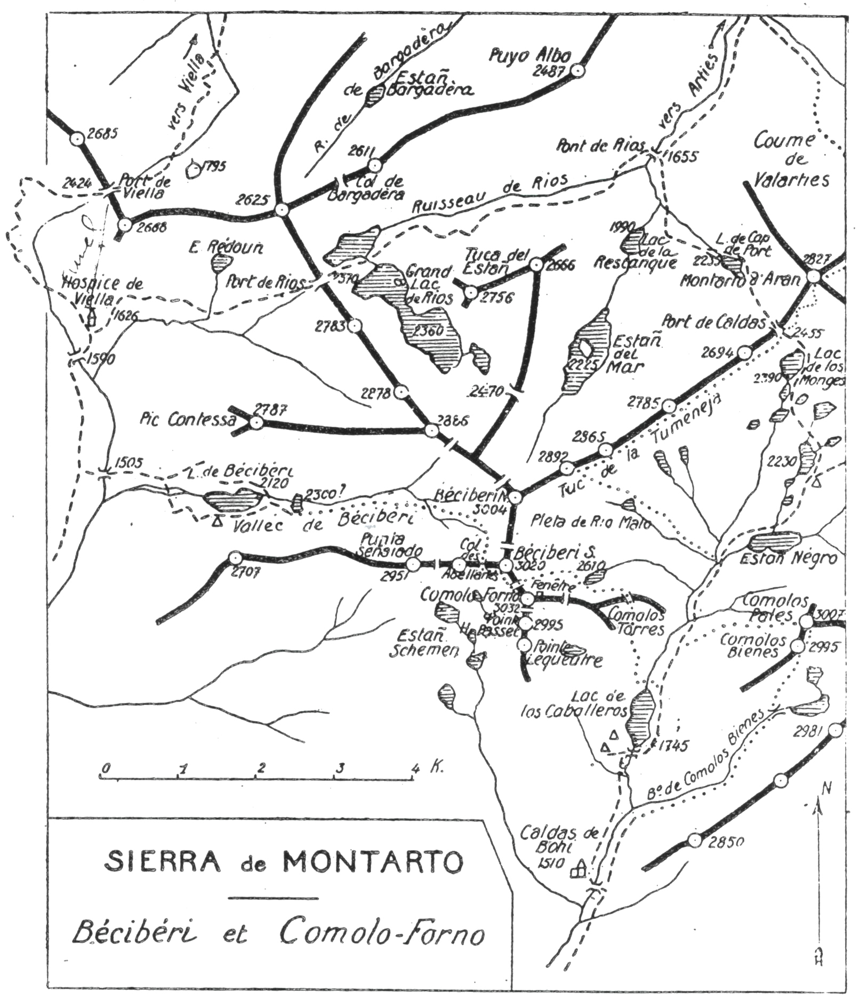

<style>.centre {text-align: center}</style>
<style>.droite {text-align: right}</style>

[//]: # (— p. 313 —)

# VINGT-TROISIÈME EXCURSION

(N° 18 de la-1re édition)

__Cinq jours en Haut Aran et à la Sierra de Montarto__<br>
__AU DÉPART DE MARIGNAC__

_B. E. — Du 15 Juillet à fin Aout._

Cartes à emporter : Bagnères-de-Luchon et Val d'Arouge réunies.
 Saint-Girons et Mont Rouch réunies.

__De MARIGNAC (1) à LUCHON,__<br>
__par Viella, le Port de Viella, l'Hospice de Viella,__<br>
__le Bécibéri, le Comolo Forno,__<br>
__Caldas de Bohi, le Comolos Bienes, le Comolos Pales,__<br>
__le Tuc de la Tuménéja,__<br>
__le Montarto d'Aran, le Pic d'Aubas et Couradilles.__

__<u>AVIS AUX TOURISTES</u>__

On retiendra un guide luchonnais pour toute l'excursion, ou
tout au moins pour les quatre premiers jours, en lui donnant
rendez-vous à Marignac pour l'arrivée du premier train.

On emportera des conserves pour quatre repas et du pain
et du vin pour un jour. On trouvera des provisions à l'Hospice
de Viella et à Caldas de Bohi.

Depuis 1924 (une nouvelle route faisant communiquer le Val
d'Aran avec l'Espagne par le port de la Bonaïgue) (2.072m), il
existe un service d'autobus entre Fos et. Esterri-de-Anèou.
Avant de partir, il sera prudent de se renseigner sur l'horaire
de ce service, si on ne l'a pas fait au passage à Fos, lors de
la vingtième excursion.

__<u>SIERRA de MONTARTO</u>__

La Sierra de Montarto étant peu connue et peu fréquentée,
j'ai jugé indispensable de donner une carte spéciale de cette
région; on la prouvera p. 318.

<p class="droite">(Voir ci-contre la Carte de l'Excursion).</p>

———<br>
(1) Marignac (Haute-Gar.), ec. de Saint-Béat; 600 hab., sur la ligne
de Montréjeau à Luchon, postes et télégraphes. Il y a deux bons hôtels
près de la gare.

<div class="page"/>

— p. 314 — EN HAUT-ARAN et EN CATALOGNE (23me EXCURSION)

****


<div class="page"/>

— p. 315 — (23me EXCURSION) DE MARIGNAC A VIELLA

****

## PREMIÈRE JOURNÉE

__De MARIGNAC (500m) à l'HOSPIÇE de VIELLA (1.626m),__<br>
__par le Pont du Roi (583m),__<br>
__Viella (960m) et le Port de Viella (2.424m).__

—— GUIDE UTILE

__Conseils.__ — __Itin. recomm.__ — Si on n'a pas couché la veille à
Marignac, on y arrivera par le premier train.

Ordinairement, un autobus fait le service spécial du Val d'Aran,
ce qui permet d'effectuer le irajet de Marignac à Viella (39 k.)
en 1 h. 1/2 environ. Dans tous les cas, on pourra prendre le tram
électrique jusqu'au Pont du Roi (15 k.) où l'on trouvera une correspondance
par voiture. L'important, c'est d'arriver à Viella
avant 11 h.

A Saint-Béat, 4 k. de Marignac, on rejoindra les bords de la
Garonne qu'on ne quittera plus jusqu'à Viella. On verra défiler
les nombreux vill. et bourgs qui. bordent agréablement la route
de l'une des plus belles vallées pyrénéennes. Fos est le dernier
bourg français, à 5 k. du Pont du Roi où l'on franchit la frontière
(V. 20° E., p. 276). C'est là que la Garonne s'est frayé un passage
en rongeant la crête frontière pour s'élancer, enfin libérée, vers
les plaines de Toulouse. Ce passage est si étranglé que, pour pouvoir
y construire un pont et y faire passer la route, il a fallu
abattre, sur les deux rives, une partie de la crête.

Le pont franchi, on entre en Espagne, au Val d'Aran, par une
route splendide qui traverse Lès-les-Bains, Bosost et Las Bordas,
pour arriver en pente douce à Viella (960m).

On pourra déjeuner à l'hôtel Abadia qui, au besoin, fournira
les renseignements utiles concernant un porteur et un mulet.

L'ascension du Port de Viella par une après-midi chaude est
dure; on fera donc bien de louer un mulet pour y monter les
sacs. On partira au plus tard à 13 h., afin d'arriver au port vers
17 h. et à l'Hospice, avant la nuit.

On sortira de Viella par le S. et on prendra le chemin muletier
qui remonte la rive dr. du vallon de Rio Négro. Environ 1 h.
après, on laissera à dr. le rio de ce nom qui descend de la Fourcanade
pour suivre à g., au S., le sentier du port. On sera vers
1.300 d'alt., et c'est là que commence la rude mais intéressante
ascension.

<div class="page"/>

— p. 316 — PORT ET HOSPICE DE VIELLA (23me EXCURSION)

****

Le barranco du port est parfois si étroit et si profond qu'il
a fallu tailler le sentier sur le roc même, à une certaine hauteur;
on ne longe le torrent que par de courts intervalles et on le domine
toujours. Après avoir franchi un premier ressaut, le sentier
passe rive g. et monte par de nombreux lacets jusqu'à un deuxième
ressaut d'où le regard embrasse une. partie de la vallée. Il
revient rive dr. pour se diriger au S.-O. jusqu'au Port de Viella
(2.424m). |

On jouit au port d'une vue splendide, surtout vers le N.-E. et
l'O.; le massif des Monts-Maudits paraît presque'en entier à deux
pas. On passe ensuite sur l'autre versant en faisant un long crochet
vers l'O, et enfin, on reprend la direction S. Bientôt, on
arrive au débouché du vallon supérieur de la Noguera Ribagorzana
qui descend du Moulières. Le sentier traverse alors les verts
pâturages et coupe un petit torrent; 10 min. après, on arrive à
l'Hospice de Viella (1.626m). (V. 21° E., p. 289.)

Le site est splendide. L'Hospice est construit au centre de vertes
pelouses qu'entourent des forêts noires de sapins gigantesques
Les crêtes très élevées qui les dominent les protègent contre
la fureur des vents. Malgré sa haute alt., ce coin conviendrait
admirablement à l'édification d'un sanatorium. Nulle part, le
touriste ne trouvera un pareil régal des yeux, avec si peu de fatigue.

> Nota. - Comme il faut partir de très bonne heure le lendemain, 
on fera ses provisions et on règlera les dépenses le
soir même. Si on ne prend pas cette précaution, on perdra plus
d'une h. au moment du départ, ce qui peut compromettre le
bon résultat de la journée.

__Horaire de la Journée :__

```
De Viella au Port.................... 3h.45 }   5h.30
Du Port à l'Hospice.................. 1h.45 } (Arrêts en sus).
```

## DEUXIÈME JOURNÉE

__De l'HOSPICE de VIELLA (1.626m) à CALDAS de BOHI (1.510m),__<br>
__par le Bécibéri S. (3.020m) et le Comolo Forno (3.032m).__

—— GUIDE INDISPENSABLE ——

__Conseils.__ — __Itin. recomm.__ — On prendra au S. le chemin qui
descend à Senet et on le quittera 1/2 h. après, à la cote 1505,
pour franchir, à l'E., la Ribagorzana sur un petit pont en bois.

<div class="page"/>

— p. 317 — (23me EXCURSION) VALLEE et PIC De BECIBERI

****

On entrera alors dans la gorge de Bécibéri dont on remontera
la rive -dr. à travers la forêt pendant 3/4 d'h. environ.

Le chemin conduit près du torrent qu'on franchira au premier
endroit propice pour passer rive g. On trouvera bientôt des pistes
de bestiaux qui se transforment en un petit sentier; on le
suivra jusqu'au grand Lac de Bécibéri (2.120m).

Continuant l'ascension, par la rive g., sans s'éloigner du torrent
on arrivera au petit lac supérieur (2.300m) en partie glacé.
On le contournera par la dr., par le S., pour aboutir à une bonne
source qui se trouve 100 m. environ au-dessus. Les pentes s'accentuent
et l'escalade devient dure. On se trouve en présence d'un
ressaut qui couronne le cirque inférieur et qu'il faut franchir
pour passer au cirque grandiose qui domine le haut de la vallée.
Ce ressaut franchi, on se dirigera au S.-E., à travers un chaos
de rochers énormes, vers une large échancrure : c'est le Col des
Abellanés (2.880m) (1), situé entre le pic de ce nom (2.980m), à l'O.,
et le Bécibéri S. (3.020m), à l'E. Après le pénible chaos, on traversera
un névé pour aboutir à la base d'un petit couloir qui conduit
directement au Col. De ce point, on découvre vers le S. les
vill. d'Aneto et de Senet et la vue est déjà fort belle vers le N.-O.
En 20 min., par une croupe facile, on montera à l'E., au Bécibéri
S. d'où le panorama est de toute beauté dans tout son pourtour
C'est le cas de rappeler ici ce qu'a écrit notre éminent collègue
F. Schrader, dans l'Annuaire du C. 4. F., 1878, p. 363 :
« La vallée de Bécibéri me paraît une des plus belles des Pyrénées, 
et la vue des sommets de ce groupe sur le Néthou vaudrait
à elle seule l'ascension. »

Le Bécibéri S. est facilement accessible par toutes ses faces,
sauf par le couloir N.-O. qui serait très délicat. C'est de son sommet
qu'on apercevait autrefois la curieuse fenêtre de la crête E.
du Comolo Forno. Une érosion de l'arête a démoli le linteau
aérien, transformant ainsi la fenêtre en une simple brèche de
haute alt.

Un pyrénéiste exercé peut aller du Bécibéri au Comolo Forno
en 1/2 h., en suivant le flanc O. de la crête. On n'a qu'à redescendre
d'une trentaine de m., puis tourner à g., au S.; on
marchera à flanc jusqu'à une petite brèche qui coupe la crête

———<br>
(1) Mot catalan qui, comme le mot espagnol « Avellanos », signifie
noisetiers.

<div class="page"/>

[//]: # (— p. 318 —)



à environ 50 m. du sommet; on y déposera le sac et le piolet. A
partir de là, c'est un entassement de rocs branlants sur une arète
étroite avec des abîmes de chaque côté. Il n'y a pas-de danger
réel, mais il faut, à tout instant, tâter les pierres pour s'assurer
qu'elles tiennent bien. Dans 10 min., on franchit ce mauvais pas
et on arrive enfin sur la terre ferme où est bâtie la tourelle, à
3.032 d'alt.

Le belvédère du Comolo Forro est de tout premier ordre et

<div class="page"/>

— p. 319 — (23me EXCURSION) COMOLO FORNO — CALDAS de BOHI

****

la gradation des teintes de toutes les alt. passe sous les yeux.

Glaciers étincelants, lacs bleus miroitant au soleil, sombres
forêts qui s'enfoncent dans les vallées, tout, autour de soi, forme
le plus beau des spectacles. Une infinité de crêtes sourcilleuses
l'entourent de toutes parts et, aussi loin que l'œil puisse percer
l'atmosphère, c'est un océan de sommets qui ondulent vers les
lointains horizons.

On trouvera au Comolo Forno un registre roulé dans une boite
en fer et la trace du passage des quelques rares touristes qui ont
ascensionné cette intéressante cime.

Après avoir repris le sac, on traversera la crête et, par une
petite et facile cheminée, on passera sur le versant E. afin de
débarquer dans le glacier de Rio Malo; on descendra alors un peu
à dr., en longeant par la base l'arête E. du Comolo Forno, celle
qui était percée d'une curieuse fenêtre, pour aboutir au petit lac
glacé S. (2.610m)

A dr., au S.-E. du lac, une petite brèche fait communiquer la
Pleta de (Rio Malo avec la Coume de Comolos Torres par un
couloir court et rapide. Parvenu au fond, on apercevra une partie
du lac de Los Caballeros vers lequel il faut descendre. On se
tiendra constamment sur la rive g. de la Coume jusqu'en amont
du lac, où l'on rejoindra la vallée de la Noguera de Tor et le chemin
qui vient du Port de Caldas.

Après avoir franchi le torrent en amont du lac, on longera ce
dernier par la rive g. jusqu'au déversoir où on passera rive dr.,
sur un pont de troncs de sapins. On n'aura ensuite qu'à suivre
le chemin muletier qui, par cette rive, conduit directement aux
Bains de Caldas de Bohi où l'on couchera.

L'établissement thermal comprend une grande bâtisse carrée
à trois étages avec une cour centrale et des arceaux sur trois
côtés. Il est éclairé à l'électricité par son usine spéciale et peut
recevoir 150 pensionnaires.

Ce qui surprend en y arrivant, c'est de trouver un pareil
confortable en pleine montagne et à 20 k. de toute route. Comme
en chemin de fer, il y a trois classes aux bains de Caldas; on
optera pour la première : on aura ainsi de très bonnes chambres
et une cuisine à la française. Ici, même recommandation qu'à
l'Hospice de Viella; on fera ses provisions et on règlera le soir
même pour ne pas perdre de temps le lendemain matin.

<div class="page"/>

— p. 320 — COMOLOS BIENES — COMOLOS PALES (23me EXCURSION)

****

__Horaire de la Journée :__

```
De l'Hospice au grand Lac de Bécibéri... 2h.15 }
Du Lac de Bécibéri au Col des Abellanés. 3h. » }
Du Col des Abellanés au Bécibéri S...... 0h.20 }
Du Bécibéri S. au Comolo Forno.......... 0h.30 }   10h. »
Du Comolo Forno au Lac de Los Caballe-         }
  ros................................... 2h.40 } (Arrêts en sus).
Du Lac de Los Caballeros à Caldas de           }
  Bohi.................................. 1h.15 }
```

## TROISIÈME JOURNÉE

__De CALDAS de BOHI(1.510m)au LAC de LOS CABALLEROS(1.745m),__<br>
__par le Comolos Bieres (2.995m) et le Comolos Pales (3.007m).__

—— GUIDE INDISPENSABLE ——

__Conseils.__ — __Itin. recomm.__ — On partira de très bonne heure
en franchissant le pont situé à l'E. de l'établissement et on remontera
la vallée en longeant la Noguera de Tor par la rive g.
Parvenu au confluent du torrent de Comolos Bienes, on tournera
à dr., au N.-E. par le barranco de ce nom. On restera constamment 
au centre du vallon. La traversée de la forêt et la pente
rapide qui lui succède étant très fatigantes, on marchera lentement
pour ne pas s'exténuer.

Le barranco de Comolos Bienes, qui à l'origine monte à l'E.
tourne au N.-E. dans la partie supérieure pour aboutir vers
2.600 d'alt. à un large col situé à l'entrée d'un petit cirque. En
y arrivant, on aperçoit au fond deux jolis lacs entourés de névés.
On obliquera alors à g., au N., et on attaquera les parois rocheuses
qui grimpent au Comolos Bienes (2.995m). Sauf vers le N., la vue
est déjà fort belle dans toutes les directions; elle sera splendide
au Comolos Pales. Devant soi, une crête délicate d'environ 300 m.
conduit directement au point culminant du massif (3.007m), dans
moins de 1/2 h.

Sans la Pique d'Estats et le Montcalm, la Punta Alta de Comolos
Pales serait le dernier sommet dépassant 3.000 vers les Pyrénées
orientales. Comme au Comolo Forno et au Bécibéri, le point
de vue est des plus étendus; il est surtout majestueux vers le haut
Aran.

On descendra à l'O. par de rapides couloirs neigeux, mais sans

<div class="page"/>

— p. 321 — (23me EXCURSION) PIC PIERRE HARLE

****

difficultés sérieuses. Vers les trois quarts de la descente, on fera
un crochet à dr., afin d'éviter un ressaut que le ruisseau franchit
en cascades, et on ira rejoindre le sentier du port de Caldas en
amont du lac de Los Caballeros. Si la cabane est convenable, on
couchera là; dans le cas contraire, on redescendra à Caldas de
Bohi.

__Horaire de la Journée :__

```
Des Bains au Col de Comolos Bienes.... 4h. »  }
Du Col au Pic de Comolos Bienes....... 1h. 20 }     8 h. 15
Du Comolos Bienes au Comolos Pales.... Oh. 25 } (Arrêts en sus).
Du Comolos Pales au Lac de Los Caballe-       }
  ros................................. 2h. 30 }

  (Si on redescend à Caldas de Bohi, 1h.15 en sus.)
```

## QUATRIÈME JOURNÉE

__Du LAC de LOS CABALLEROS (1.745m) à ARTIES (1.143m),__<br>
__par le Tuc de la Tuménéja ou Pic Pierre Harlé (2.892)__<br>
__et le Montarto d'Aran (2.827m).__

—— GUIDE UTILE ——

__Conseils.__ — __Itin. recomm.__ — Si on est redescendu pour coucher
à Caldas, on y louera un mulet pour monter les sacs au port de
ce nom (2.455m). On prendra alors un casse-croûte dans sa poche
en amont du lac de Los Caballeros avant de quitter le sac. Le
porteur accompagnera le mulet jusqu'au port où il attendra la
caravane pour le déjeuner.

Du lac de Los Caballeros, on suivra le chemin du port 40 min.
environ jusqu'au-dessus du torrent qui descend du Comolos
Pales; tournant alors à l'O., on franchira la Noguera de Tor pour
monter au N.-O. par la petite gorge du Rio Malo qui conduit au
lac glacé N. de ce nom (2.650m). On sera dominé à l'O. par le
Bécibéri N. (3.004m) et, au N.-O., par le point culminant de la
crête de la Tuménéja (2.892m) dont on ne sera séparé que par un
petit névé. On montera vers ce dernier pic qu'on ascendra par la
cheminée qui grimpe jusqu'à la crête (1).

———<br>
(1) A propos de cette crête, que les guides et les cartes appellent
« Tuc Ménège », je suis de l'avis de mon collègue, M. Bepmale, qui
la nomme « Tuc de la Tuménéja », du mot catalan : cheminée. Tous
les bergers de la région l'appellent ainsi.

<div class="page"/>

— p. 322 — Le MONTARTO d'ARAN (23me EXCURSION)

****

Le point culminant de la crête de la Tuménéja, qui a été gravi
pour la première fois le 8 août 1912, porte maintenant le nom de
« Pic Pierre Harlé », en souvenir du vaillant et héroïque pyrénéiste
de ce nom, qui est glorieusement tombé au champ d'honneur
le 8 avril 1915, à la tête de la section dont il était le lieutenant.

Quoique d'alt. secondaire, le Tuc de la Tuménéja est l'un des
sommets les plus intéressants de la région par sa situation exceptionnelle
On domine toute la haute vallée de Caldas, les cirques
de l'Estañ del Mar et des grands lacs de Rios. Ce sommet complète
la vue sur la région mieux que ne le ferait le Bécibéri N.,
cependant plus élevé de 112 m.

Du Tuc de la Tuménéja, on redescendra quelques min. à l'E.
vers la base du sommet 2865, afin d'aboutir à des pentes de
pâturages. Là, on prendra définitivement la direction N.-E., en
longeant le flanc E. du chaînon jusqu'au lac supérieur de Los
Monges (2.390m). De ce point, dans 1/4 d'h. environ, on rejoindra
le Port de Caldas (2.455m), d'où on fera l'ascension du Montarto
d'Aran (2.827m). Cette ascension est des plus faciles et 1 h. suffit
depuis le port. De la, on montera au N.-E. en zigzaguant les pentes
gazonnées et en contournant par la dr., par l'E., le petit Montarto
afin d'aboutir à un petit col. Le vrai sommet apparaît alors
à quelques centaines de m., de l'autre côté de la cuvette; on n'a
qu'à contourner cette dernière par la g. et à remonter en face
pour atteindre en 20 min. le Montarto d'Aran (2.827m).

La description qu'en a faite M. Bepmale (1) traduit fidèlement
l'impression qu'on ressent sur ce sommet. « Bien qu'il soit dépassé
en hauteur par la plupart des pics qui forment le cercie
autour de lui, le Montarto est cependant un merveilleux observatoire
isolé de tous les côtés, assez éloigné de ses voisins pour n'être
pas dominé par eux, il laisse la vue s'étendre à l'infini, etc., etc. »

La déscente facile à Arties par le Port de Caldas serait plus
longue et bien moins intéressante. Je conseille donc de prendre
la direction N.-E. vers le petit étang de Lassole qu'on longera
par la g., afin d'aboutir à une cheminée rapide qui plonge dans
la coume supérieure de Valarties. Ce passage, un peu impressionnant
au-dessous d'un rocher coincé, est sans difficulté.

———<br>
(1) V. Bulletin Pyrénéen, année 1909, p. 248.

<div class="page"/>

— p. 323 — (23me EXCURSION) D'ARTIES A LUCHON

****

Après avoir débarqué dans la coume, on obliquera légèrement
à g., pour éviter un à-pic qu'il faut contourner par l'O. Au-dessous
de ce ressaut, on trouvera un petit sentier qui, à travers de
la rocaille d'abord et une forêt ensuite, descend directement au
Pont del Ressec (1.310m) (1). A partir de là, un grand chemin de
chars mène directement à Arties à la Posada d'el Señor Delsell.

__Horaire de la Journée :__

```
Du lac de Los Caballeros au Tuc de la          }
  Tuménéja.............................. 3h. » }    9h.45
Du Tuc de la Tuménéja au Port de Caldas. 2h.15 } (Arrêts en sus).
Du Port de Caldas au Montarto d'Aran.... 1h. » }
Du Montarto à Arties.................... 3h.30 }

 (Si on vient de Caldas de Bohi, 1 h. en sus.)
```

## CINQUIÈME JOURNÉE

__D'ARTIES (1.143m) à LUCHON (629m), par le Val d'Aran,__<br>
__le Pic d'Aubas (2.072m) et Couradilles (1.985m).__

—— SANS GUIDE ——

> Nota. - Pour la cinquième journée, on peut, le cas échéant,
en modifier le programme par l'une des deux variantes ci-après : 
1° en rentrant directement à Marignac, si on voulait
continuer vers la plaine; 2° en reprenant l'ascension de l'Entécade
dans le cas où on aurait eu du brouillard à la vingtième
excursion.
>
> Pour l'Entécade, on quittera l'autobus à Las Bordas et,
après avoir traversé le vill, on franchira, sur un deuxième
pont, à l'O., la Garonne de Jouéou. Immédiatement après, on
trouvera un sentier qui monte au S. par la rive g. de la vallée
d'Artiga de Lin, pour s'élever, à l'O., jusqu'au Col de Pouy-
lané. De ce point, en grimpant à toute crête, on atteindra
l'Entécade dans 3/4 d'h. environ. Pour rentrer à Luchon, on
suivra l'itinéraire indiqué pour l'ascension à la vingtième
excursion, p. 273, mais en sens inverse.

__Conseils.__ — __Itin. recomm.__ — On partira, soit par l'autobus, soit
par le premier courrier jusqu'à la Bordette (827m), à 19 k. d'Arties
et à 4 k. en amont de Bosost où on quittera la grand'route. On
prendra, rive g., le chemin de la Bareste qui se dirige au N.-O.

———<br>
(1) C'est à tort que les cartes françaises portent « Pont de la Resseque
»; ce dernier mot ne signifie rien. Il s'agit du pont de la scierie 
(ressec); il faut donc dire « Pont del Ressec ». En patois du pays,
ressec est masculin.

<div class="page"/>

— p. 324 — PIC D'AUBAS — COURADILLES (23me EXCURSION)

****

vers le Portillon de Burbe. Parvenu au ruisseau de la Bareste,
on abandonnera le grand sentier pour monter à l'O., en longeant
les rives du torrent.

Après 3/4 d'h. d'ascension dans cette direction, on aura le
choix entre deux itinéraires : 1° En continuant direction O., on
rejoindrait quelques min. après un grand chemin muletier qui
monte directement au Col de Barèges où l'on pourrait laisser le
sac; de là, on ascendrait le Pic d'Aubas par la face O.; 2° En
tournant à g., au S.-O., pour remonter une coume qui aboutit à la
base des escarpements N. du pic; on ferait alors l'ascension par
une cheminée rapide qui conduit à la crête, à quelques min. à
l'O. du sommet.

Ce dernier itinéraire, qui prend le caractère de la haute montagne
est plus court d'environ 1 h. et beaucoup plus intéressant.

Au Pic d'Aubas, on jouit d'un très beau point de vue sur les
environs de Luchon, mais surtout sur le Val d'Aran qu'on apercoit
presque en entier. Luchon n'est pas visible et nous monterons
à Couradilles pour le dominer de plus de 1.300 m.

On descendra à l'O. jusqu'au Col de Barèges d'où une montée
facile au N.-O. conduira en 1/2 h. environ au sommet de Couradilles
(1.985m) (V. 18 E., p. 243). Là, apparaît subitement et presque
sous ses pieds, tout le cirque verdoyant qui entoure Luchon.
On distingue à l'œil nu les principaux monuments et les jardins
fleuris de la coquette station.

Le soum de Couradilles est la montagne la plus facile des environs
de Luchon; un cheval peut monter jusqu'à la cime et s'y
promener sans danger. C'est un sommet plein de charme qui n'a
qu'un inconvénient : celui de donner asile, de temps en temps, à
des fourmis ailées qui agacent les photographes.

Pour rentrer à Luchon, on suivra le chemin forestier qui descend
d'abord vers l'O. et qui contourne la montagne à flanc, vers
le N., afin d'aboutir au bas du vallon de Burbe, près de la douane;
on n'aura qu'à continuer par Saint-Mamet.

(Voir, en sens inverse, l'itinéraire détaillé à la 18° E., p. 242).

__Horaire de la Journée :__

```
D'Arties à La Bordette, 1 h. 1/4 d'autobus.     }
De La Bordette au Pic d'Aubas............ 4h. » }  8h. »
Du Pic d'Aubas à Couradilles............. 1h.15 } (Arrêts en sus).
De Couradilles à Luchon.................. 2h.45 }
```

[p301 à 312](guide-soubiron-301-312.md) - [Sommaire](../README.md) - [p325 à 330](guide-soubiron-325-330.md)