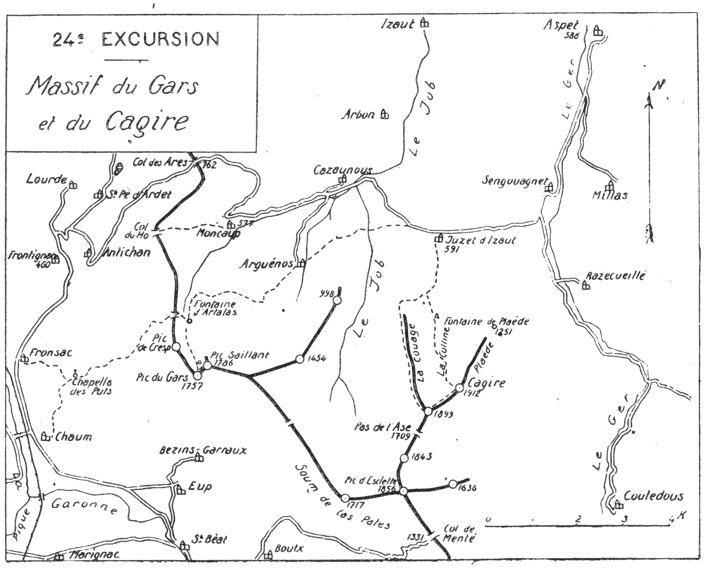

<style>.centre {text-align: center}</style>
<style>.droite {text-align: right}</style>

[//]: # (— p. 325 —)

# VINGT-QUATRIÈME EXCURSION

__Le Massif du Gars et du Cagire__

_B. E. — Du 15 Juin au 15 Octobre._

Carte à emporter : Bagnères-de-Luchon.

__<u>AVIS AUX TOURISTES</u>__

Malgré leur éloignement relatif de Luchon, les pics du Gars
et de Cagire appartiennent à sa région, en raison de leur point
de vue spécial sur ses environs. Aussi, pour jouir de ce point
de vue dans les meilleures conditions, je conseille de réaliser
la vingt-quatrième excursion, soit au départ de Luchon, soit
au départ de Marignac, par le premier train. On peut aussi
aller coucher à Fronsac, la veille.

## PREMIÈRE JOURNÉE

__De FRONSAC (425m) à JUZET-d'IZAUT (591m),__<br>
__par les Pics du Gars (1.757-1.786n) et le village d'Arguenos.__

—— SANS GUIDE ——

__Conseils.__ — __Itin. recomm.__ — On prendra à l'E. de Fronsac le
grand chemin muletier qui monte à la chapelle des Puts, située
sur un plateau. On arrive là au pied des pentes O. du Gars dont
les arêtes de calcaire blanc se profilent tout en haut, en plein
ciel.

Un sentier s'amorce au N., tout près de la chapelle; on le laissera
à g. Montant d'environ 300 m. plus à l'E., on en rejoindra un

<p class="droite">(Voir ci-contre la Carte de l'Excursion).</p>

<div class="page"/>

— p. 326 — (24me EXCURSION)

****



<div class="page"/>

— p. 327 — (24me EXCURSION) PICS du GARS

****

second, plus grand, qui part aussi direction N., en amont et parallèlement
au premier. Ce sentier monte en pente douce en contournant
par le N. le Pic de Cresp, pour aboutir directement
à la Fontaine d'Artalas (1). Cette fontaine est à la base du thalweg
N. du Gars, presque à la lisière de la forêt.

Le trajet de la chapelle à la fontaine d'Artalas est plein de
charme; le sentier s'élève en corniche et presque toujours sous
forêt. Les clairières qui se succèdent par intermittences permettent
d'apercevoir tout le paysage qui défile en tournant comme
un grand cinéma. Parti par les hautes cimes luchonnaises, le
regard court vers la chaîne occidentale qu'il quitte bientôt pour
errer à travers les plaines du N. et de l'E. Au moment où le sentier
tourne au levant, la forêt devient plus dense, et c'est à l'ombre
de grands arbres qu'on arrive à la fontaine d'Artalas.

Parvenu à la source, on n'aura qu'à monter droit au S., par des
gazonnés faciles, pour atteindre la cime secondaire du Gars
(1.757m). C'est sur ce sommet qu'est le plus beau point de vue.
La surprise de ce lever de rideau est aussi forte que le spectacle
est saisissant.

En face, toute la grande chaîne, depuis les montagnes du Haut
Aran jusqu'au Pic de Midi de Bigorre. Les monts luchonnais sont
là, à deux pas. Mais ce qui fait le grand charme de ce petit sommet
c'est sa position de balcon suspendu qui domine surtout la
vallée de Montréjeau à Luchon et une partie du Val d'Aran. Plus
de 40 vill. ou villes sont sous les yeux. Seule, la vue sur la plaine
de Toulouse est un peu bornée par le Pic Saillant (1.786m), situé
à 10 min. au N.-E. On y montera pour compléter le tour d'horizon.

En moins de 3 h., on pourrait redescendre par le même chemin
à Fronsac et rentrer par le train, le soir même, à Luchon.
Mais, si on veut faire en entier la connaissance de cette jolie
région avant d'aborder l'Ariège, on ira coucher à Juzet-d'Izaut
pour faire le lendemain l'ascension du Cagire.

Pour la descente, on repassera à la fontaine d'Artalas où on
quittera le chemin d'ascension; là, on prendra, à dr., un sentier
qui file vers l'E. Après environ 1 h. de marche sous bois, on débouchera 
à découvert au bas de la forêt, d'où l'on apercevra sous

———<br>
(1) Une autre petite source, qui ne tarit ordinairement qu'en août,
existe à environ 100 m. au N. du sommet 1757.

<div class="page"/>

— p. 328 — ARGUENOS (24me EXCURSION)

****

soi, au N., le vill. d'Arguenos. A partir de là, le sentier se transforme
en, un grand chemin de chars qui, après avoir fait un long
lacet à dr., descend directement au vill.

D'Arguenos, une petite route se dirige au N. pour rejoindre la
grand'route de Saint-Béat à Aspet par Juzet-d'Izaut; on allongerait
par là d'environ 20 min. Il vaut mieux prendre le chemin de
traverse qui descend au N.-E. vers le Job qu'on franchira 1/4 d'h.
après; par une petite remontée à l'E. et en longeant des champs
cultivés, on aboutira à la grand'route, aux premières maisons de
Jus d'Izaut (1).

__Horaire de la Journée :__

```
De Fronsac à la chapelle des Puts...... 1h.05 }
De la chapelle à la fontaine d'Artalas. 2h.30 }   7h.45
De la fontaine au Pic du Gars (1.757m). 1h. » }
Du Gars (1.757m) au Gars (1.786m)...... Oh.10 } (Arrêts en sus).
Du Gars à Juzet-d'Izaut................ 3h. » }
```

## DEUXIÈME JOURNÉE

__De JUZET-d'IZAUT (591m) à ASPET (588m),__<br>
__par le Cagire (1.912m) et Sengouagnet.__

—— SANS GUIDE ——

__NOTE sur le CAGIRE__

Si, de la plaine, on examine la montagne du Cagire, elle apparaît
sous la forme d'un fer à cheval dressé sur ses deux pointes.
La branche O. se nomme « la Couage » et la branche E. s'appelle
« Plaède ». Le haut du fer est constitué par une crête très
aérienne et le centre est formé par un beau cirque verdoyant et
très incliné qu'on appelle « la Colline » et qui vient mourir au
haut de la forêt de Cagire, à la cabane de Juzet-d'Izaut. Il y a

———<br>
(1) Juzet-d'Izaut, 504 hab., c. d'Aspet, 7 k. Si, à l'auberge, il n'y a
plus de lits, on en trouve facilement dans le village.

<div class="page"/>

— p. 329 — (24me EXCURSION) PIC de CAGIRE

****

beaucoup de fleurs dans la « Colline » et notamment des Etoiles
des Neiges.

__Conseils.__ — __Itin. recomm.__ — On ne mettra dans son sac que
les provisions du déjeuner et un simple casse-croûte. Si on veut
rentrer le soir même à Toulouse ou filer sur Montréjeau, il faut
partir à la pointe du jour, afin d'arriver à Aspet assez tôt pour
prendre le dernier train sur Saint-Gaudens.

On suivra le grand chemin de chars qui passe devant l'église
et qui monte direction S. jusqu'au haut des prairies; là, il se
transforme en chemin muletier et quelques min. après, il pénètre
sous forêt.

Après avoir fait un long lacet vers l'O. et être passé dans une
clairière, on reprendra l'ascension direction S. par le flanc occidental
de la Couage, et bientôt on atteindra le haut de la forêt.
On grimpera alors à travers les pâturages et, en inclinant légèrement
à g., on ira rejoindre le sentier de crête qui mène directement
au sommet secondaire, coté 1.899 m., qu'on nomme Pique-
Poque (1).

Pendant le trajet à découvert, on dominera merveilleusement
toute la haute vallée du Job; le vill. d'Arguenos paraîtra littéralement
sous les pieds, à plus de 1.000 m. de profondeur. On aura
en face le chemin de descente du Gars et sa belle forêt.

A Pique-Poque, le point de vue est déjà fort beau, surtout vers
les plaines du N.; on le complétera au sommet principal, situé
à 800 m. au N.-E. Le trajet pour s'y rendre est des plus faciles.
On suivra presque horizontalement le flanc N. de l'arête, puis on
continuera à toute crête jusqu'au point culminant du massif
(1.912m). 

Sur la crête, à l'O. et à 2 min. du sommet existe un puit très
étroit et très profond qui serait dangereux si il était masqué par
une légère couche de neige. Dans ce dernier cas, il sera prudent
de passer 20 m. en contrebas, 5 min. avant d'arriver au sommet.

Le Cagire est le type parfait des sommets de premier plan
Sa vue sur la grande chaîne est immense, et celle qui s'étend
sur la plaine va de Tarbes à Toulouse et aux confins de l'Aude.

———<br>
(1) Petite pique

<div class="page"/>

— p. 330 — JUZET-d'IZAUT (24me EXCURSION)

****

Il est aussi un merveilleux belvédère sur la Garonne qu'il domine
sur un parcours de plus de 100 kilomètres.

On descendra au N. à travers les terrasses verdoyantes de la
« Colline » pour aboutir à la grande cabane de Juzet, située à 
l'orée de la forêt. Là, pour gagner dû temps, on dégringolera
par les pentes faciles de la forêt de Cagire jusqu'au sentier
d'ascension, qu'on rejoindra dans son grand lacet vers l'O. De
ce point, 3/4 d'h. suffisent pour rentrer à. Juzet.

De Juzèt-d'Izaut à la gare d'Aspet, 7 k. de route.

__Horaire de la Journée :__

```
De Juzet à Pique-Poque.............. 4h. »  }
De Pique-Poque au sommet 1.912m..... Oh. 30 }    8h. »
Du Cagire à Juzet-d'Izaut........... 2h. 10 } (Arrêts en sus).
De Juzet à Aspet.................... 1h. 20 }
```

> Nota. - La vingt-quatrième excursion peut être réalisée en
sens inverse, en allant coucher la veille, soit à Aspet, soit à
Juzet. 

[p313 à 324](guide-soubiron-313-324.md) - [Sommaire](../README.md) - [p331 à 342](guide-soubiron-331-342.md)