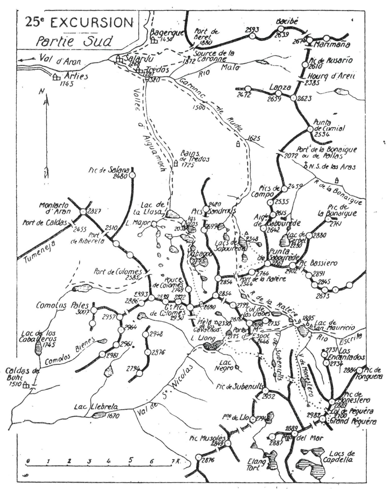
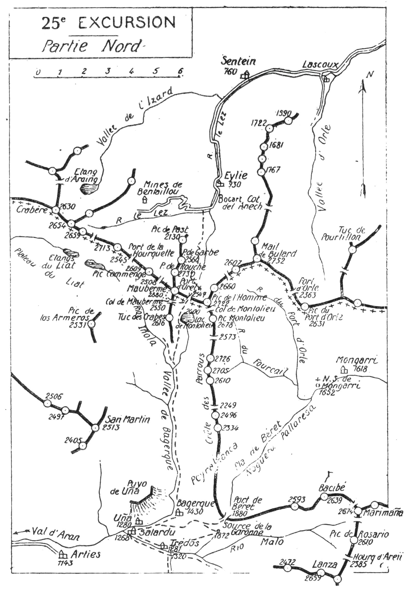

<style>.centre {text-align: center}</style>
<style>.droite {text-align: right}</style>

-----------------------
[//]: # (— p. 331 —)

# VINGT-CINQUIÈME EXCURSION

(No 19 de la 1re édition)

__Cinq jours en Haut Aran et en Catalogne__<br>
__AU DÉPART DE MARIGNAC OU DE LUCHON__

_B. E. — Du 15 Juillet au 15 Septembre._

Cartes à emporter : Saint-Girons et Mont Rouch réunies.
De MARIGNAC à SENTEIN,

__par le Val d'Aran,__<br>
__Les Sources de la Garonne, le Grand Pic de Colomès,__<br>
__le Grand Péguéra, la Pointe de Sabourède,__<br>
__Salardu, la Vallée de Bagerque, le Maubermé et le Port d'Urets.__<br>

<u>__AVIS AUX TOURISTES__</u>

Si les vingtième et vingt-troisième excursions nous ont fait
visiter la majeure partie du beau Val d'Aran, la vingt-cinquième
nous en fera connaître la. haute région, qui est magnifique
c'est-à-dire les Cirques de Colomès et de Sabourède et
les Sources de la Garonne.

On prendra un guide luchonnais connaissant les régions de
Colomès et de Los Encantados, ou tout au moins la première;
on trouvera à Salardu un berger ou un chasseur qu'on louera
comme porteur et qui pourrait être, au besoin, un guide complémentaire
pour Los Encantados.

On emportera des provisions pour cinq repas et les divers
casse-croûte.

<u>__CARTES de la 25me EXCURSION__</u>

La vingt-cinquième excursion évolue sur une quarantaine
de k. au S. et au N. de Salardu. Comme la partie méridionale
est très riche en sites touristiques, deux cartes m'ont paru
indispensables. La première comprend la partie au S. de
Salardu jusqu'au Grand Péguéra et la deuxième, la partie au
N. jusqu'à Sentein.

<p class="droite">(Voir ci-contre la Carte de la Partie S.).<br/>
(Voir page 340, celle de la Partie N.).</p>

<div class="page"/>

— p. 332 — DE SALARDU aux ENCANTADOS (25me EXCURSION)



<div class="page"/>

— p. 333 — (25me EXCURSION) SOURCES DE LA GARONNE

## PREMIÈRE JOURNÉE

__De MARIGNAC (500m) à SALARDU (1.268m)__<br>
__et aux SOURCES de la GARONNE (1.872m), par le Val d'Aran.__

—— SANS GUIDE ——

__Conseils.__ — __Itin. recomm.__ — Si on n'a pas couché à Marignac,
on y arrivera par le premier train et on prendra l'autobus du
Val d'Aran, afin d'arriver à Salardu (1) pour déjeuner.

A Salardu, on reconnaîtra sa chambre et on y déposera tous
ses bagages. On retiendra, pour le lendemain, un mulet qui
montera les sacs jusqu'au Cirque de Colomès. On louera aussi
un porteur pour trois jours.

Si on est arrivé à Salardu au plus tard à 15 h., on aura le
temps de monter au port de Béret où se trouvent les sources
de la Garonne. On s'y rendra par le chemin qui se dirige au
départ vers le vill de Bagerque et qui tourne à dr. avant d'y
arriver. On s'élève ensuite en corniche en contournant de l'O.
à l'E. le versant S. de Peyreblanca, et bientôt le chemin devient
presque horizontal jusqu'au port. On jouira là d'un point de vue
splendide sur le Val d'Aran, les vallées supérieures d'Aiguamoch
et de Ruda, et sur les cirques de Colomès et de Sabourède
A l'O.-S.-O., dans un fond de tableau merveilleux, paraissent
les Monts-Maudits et les glaciers brillants du Néthou et de
la Maladetta.

Après quelques min. de marche horizontale, au tournant d'une
petite crête, on apercevra subitement, devant soi, le port de
Béret (1.880m) et un peu plus près, en contrebas, deux petites
fontaines qui sont les sources de la Garonne. Sources minuscules
dans un cadre ordinaire.

On redescendra au S.-O. en longeant la rive dr. de la Garonne
naissante, et on rentrera à Salardu par le Cap de Aran.

__Horaire de la Journée :__

```
De Salardu au port de Béret........ 2h. » }   3h.30
Du Col de Béret à Salardu.......... 1h.30 } (Arrêts en sus).
```

———<br>
(1) Salardu, 482 hab., dernier vill. important du Val d'Aran, à 48 k.
de Marignac.

<div class="page"/>

— p. 334 — CIRQUE DE COLOMES (25me EXCURSION)

## DEUXIÈME JOURNÉE

__De SALARDU (1.268m) à la PLETA DE LOS GAVACHOS (2.125m),__<br>
__par la Vallée d'Aiguamoch,__<br>
__le Cirque de Colomès et le Grand Pic de Colomès (2.930m).__

—— GUIDE INDISPENSABLE ——

__Conseils.__ — __Itin. recomm.__ — On sortira de Salardu par la
route de Trédos et, quelques min. après, on franchira la Garonne
pour la longer par la rive g. jusqu'à hauteur du vill. On quittera
bientôt la nouvelle route (1) du port de la Bonaïgue et on tournera
au S. pour remonter la vallée d'Aiguamoch jusqu'aux Bains
de Trédos (1.725m). Là, le chemin muletier passe rive dr. 1/2 h.
environ et on revient définitivement rive g. jusqu'au lac de la
Llosa (2.035m) situé à l'entrée du cirque de Colomès. Droit
au S., apparaît alors, majestueux, le Grand Pic de Colomès
flanqué d'énormes précipices sur sa face N.

Bien que la vallée d'Aiguamoch soit des plus intéressantes, ce
n'est vraiment qu'à partir du lac de la Llosa que l'esprit est
captivé par la splendeur de cette région.

Par sa forme particulière et ses nombreux lacs, le Cirque de
Colomès est unique dans les Pyrénées. Une crête secondaire (2)
qui se détache du Grand Pic de Colomès, s'avance au centre du
cirque sur les deux tiers de sa longueur, le partageant en deux
vallons reliés entre eux par le N., ce qui lui donne la forme
d'un U. Grands ou petits, on compte plus de 40 lacs, presque
tous visibles du pic de Colomès.

C'est par le vallon oriental que nous allons monter au grand
pic en longeant la plupart des beaux lacs de l'admirable cirque.

A l'O. du lac de la Llosa, le sentier bifurque; celui de dr.
continue direction S.-O. vers le port de Colomès (2.585m) d'où
on peut descendre à Caldas de Bohi; on prendra celui de g. en
franchissant le ruisseau qui vient du Lac Major, et on longera
ensuite le lac de la Llosa par la rive méridionale. Tournant alors
direction S., on laissera à g. le lac de Lac Clotos, facilement

———<br>
(1) Voir 23° E., p. 313.<br>
(2) C'est sur cette crête que s'élève le sommet nommé par M. Gourdon
« Pouce de Colomès » et que les gens du pays appellent « Tuc
del Cap de Colomès ». V. Annuaire du C. A. F., année 1877, p. 559.

<div class="page"/>

— p. 335 — (25me EXCURSION) GRAND PIC de COLOMES

reconnaissable à la petite ile rocheuse située à son centre, puis
on longera par l'E. le Lac Llarc. Immédiatement après, le sentier
fait un crochet vers l'O., puis reprend la direction S. en longeant
par la rive g. le Lac Rond et le beau Lac Oubagou
(2.175m). Ce dernier est le plus grand de tous et, comme le
Lanoux (V. 38° E.), il affecte la forme d'un violon.

Après le Lac Oubagou, un sentier monte à l'E. vers le Col
de la Ratère de Colomès (2.540m); on le laissera à g. et on poursuivra
l'ascension direction S. en attaquant les rudes pentes
qui grimpent vers le large col situé sur la crête, à l'E. du grand
Pic de Colomès. C'est dans ce col même qu'est entaillée une
étroite brèche, d'environ 2 m. de haut sur 1 m. de large, qu'on
nomme Traouc del Rat (2.690m). C'est par cette brèche qu'il
faut faire l'ascension du grand pic. On s'élèvera donc droit au
S. en laissant à l'O. la crête secondaire, pour aboutir au Traouc
del Rat. De ce point, on découvre le versant S. et notamment
une grande partie de la vallée de Saint-Nicolas qui s'ouvre au
bas de la Pleta de Los Gavachos qu'on a sous soi, à 1/2 h. environ
On pourra donc y faire descendre directement le porteur
pour préparer la couchée et on fera l'ascension du pic avec
le guide.

Après être passé sur le versant méridional, on se dirigera. à
l'O. à flanc de montagne, pour arriver à une dépression située
sur un chaînon secondaire qui se détache au S. du Grand Colomès
On pourra y laisser le sac, car on repassera là à la descente
Une rude escalade à toute crête, droit au N., conduira
dans 1/4 d'h. environ au Grand Pic de Colomès (2.930m).

Le belvédère du Grand Colomès est de tout premier ordre.
Situé sur la grande ligne de partage des eaux d'Europe, il
domine une des plus importantes régions lacustres des Pyrénées.
Dans le cirque de Colomès seul, on peut compter plus de 30 lacs.
visibles du pic. On en aperçoit aussi un grand nombre autour
de soi.

Le panorama est immense dans toutes les directions, mais ce
qui retient le plus l'attention après le massif des Monts-Maudits,
ce sont les profondeurs de l'Aran et la chaîne ariégcoise du
Crabère aux deux Mont Rouch. Au S.-E., le (Grand Péguéra est
magnifique, et on se rend bien compte qu'il est le souverain
de la contrée.

On redescendra au S. jusqu'à la dépression du chaînon secon-

<div class="page"/>

— p. 336 — PLETA de Los GAVACHOS (25me EXCURSION)

daire et, après avoir repris le sac, on tournera à g., au S.-E.,
pour couper un petit. vallon par le haut. On n'aura plus qu'à
continuer la descente direction S.-E., en passant au déversoir de
deux petits lacs, pour arriver à la Pleta de Los Gavachos où
on couchera. La seule cabane qui reste est un abri sous roche
aménagé par les bergers; elle est située vers 2.125 m. d'alt., et
à environ 200 m. au S.-O. de l'Estañero. Le Lac Llong (2.015m),
beaucoup plus grand, est plus au S.

__Horaire de la Journée :__

```
De Salardu à Las Clotos............... 3h.45 }
De Las Clotos au Traouc del Rat....... 2h.15 }  9 h. »
Du Traouc del Rat au grand Colomès.... 1h. » } (Arrêts en sus).
Du Colomès à la Pleta de Los Gavachos. 2h. » }
```

## TROISIÈME JOURNÉE

__De la PLETA DE LOS GAVACHOS (2.125m)__<br>
__au LAC de SAN MAURICIO (1.895m), par le Grand Péguéra (2.982m).__

 —— GUIDE INDISPENSABLE ——

__Conseils.__ — __Itin. recomm.__ — Si le porteur connaît la région,
on l'enverra directement au lac de San Mauricio avec le gros
des provisions et aussi pour préparer le coucher. Il n'aura qu'à
suivre à l'E. le sentier qui monte au Portarron d'Espot (2.466m),
et à redescendre sur l'autre versant jusqu'au lac où il attendra
la caravane. Dans ce cas, on ne gardera dans son sac que ce
qui est nécessaire pour la journée et on partira avec le guide.

On se dirigera au S.-E., en laissant le Portarron d'Espot à g.
et le Lac Llong à dr.; puis, on tournera légèrement au S. On
marchera à flanc de montagne pour aboutir au débouché d'un
vallon oblique qui monte, direction S.-E., vers un col situé au N.
du pic de Subenulls (2.952m); c'est par là qu'il faut passer. Ce
col fait communiquer la vallée de Saint-Nicolas qu'on vient de
quitter avec celle de Subenulls qu'on va traverser.

Au col, on découvre subitement cette dernière, ses deux jolis
lacs et un deuxième col (2.510m) ouvert, plus au S.-E., sur la
crête qui sépare les deux vallées parallèles de Subenulls et de
Monestero. Le col franchi, on descendra en biais vers le lac
supérieur pour remonter en face au deuxième col. On jouira en

<div class="page"/>

— p. 337 — (25me EXCURSION) LE GRAND PEGUERA

y arrivant d'un point de vue magnifique sur une région splendide
A dr., au S., le Grand Péguéra parait dans toute sa majesté; 
à g., au N.-E., s'élancent vers le ciel les deux pointes de
Los Encantados; enfin, sous les pieds, à l'E. et à l'O., se creusent
les deux coquettes vallées de Monestero et de Subenulls. Aucune
région des Pyrénées n'affecte le caractère étrange et captivant
des Encantados; aucune n'est moins fréquentée.

Au S.-E., à g. du Grand Péguéra, paraît le large col de ce nom
par lequel il faut passer pour faire l'ascension du pic. On répétera
ici la même manœuvre qu'à la vallée de Subenulls : on
descendra vers le lac supérieur de Monestero en appuyant un
peu à dr., et on remontera en face au Col de Péguéra (2.700m)
où on laissera le sac. Ce col est situé entre le Grand Péguéra
(2.982m) au S.-O., et le Pic de Monestero (2.889m) au N.-N.-E.
De ce point, on contournera le pic par le S.-E., pour atteindre
la crête d'un contrefort qu'il faut franchir et on terminera l'ascension
par la face S.

Du lac supérieur de Monestero, on peut aussi faire l'ascension
du Péguéra par le col situé au S.-O. du pic; mais, dans ce cas,
on serait obligé d'emporter le sac au sommet, sans rien voir
de plus que ce que l'on aperçoit de la cime même.

Le Grand Péguéra (2.982m), point culminant de la région des
Encantados, est entouré presque en entier d'abimes verticaux
comme le Pic de Midi d'Ossau, auquel il ressemble. Son isolement
complet, sa haute alt. et sa situation exceptionnelle au
centre d'une région grandiose en font l'un des plus beaux belvédères
des Pyrénées. Le panorama s'étend du Posets au Campcardos
et presque tous les sommets de la grande chaîne, entre
ces deux points, sont sous les yeux. Au S., à ses pieds, resplendit
le bassin lacustre de Capdella dont la houille blanche fournit
à Barcelone la force et la lumière électriques.

On redescendra au col, puis au Lac de Monestero par la Voie
d'ascension pour continuer ensuite direction N. On longera le
ruisseau de Monestero jusqu'au lac de San Mauricio (1.895m) où
on couchera.

Deux cabanes, qui existaient encore en 1913, au N.-E. du lac,
ont maintenant disparu. Comme à la Pléta de Los Gavachos, les
bergers ont aménagé un abri sous roche à quelques centaines
de m. à l'O. du lac. On pourra toujours coucher dans la forêt

<div class="page"/>

— p. 338 — POINTE et CIRQUE de SABOUREDE (25me EXCURSION)

voisine. A quelques min. du déversoir du lac, sur le chemin
d'Espot, on trouve encore la chapelle où l'on se rend tous les
ans en pèlerinage.

__Horaire de la Journée :__

```
De la Pleta de Los Gavachos au Grand          }   9 h.
  Péguéra...............................5h.30 } (Arrêts en sus).
Du Grand Péguéra au Lac de San Mauricio 3h.30 }
```

## QUATRIÈME JOURNÉE

__Du LAC de SAN MAURICIO (1.895m) à SALARDU (1.268m),__<br>
__par le Port de la Ratère (2.544m)__<br>
__la Pointe de Sabourède (2.861m), le Cirque de Sabourède__<br>
__et la Vallée de Ruda.__

—— GUIDE INDISPENSABLE ——

__Conseils.__ — __Itin. recomm.__ — On partira de très bonne heure
et on prendra, au N.-O. le sentier qui longe le torrent de la
Ratère et qui, après avoir franchi plusieurs cuvettes de lacs
étagés, monte au port de ce nom (2.544m). Le large port de la
Ratère est herbeux et d'accès très facile; on y jouit d'un joli
point de vue, surtout sur la région des Encantados. Immédiatement
après, on s'élèvera en écharpe vers le N.-E. et on fera
l'ascension directe, à flanc O. de crête, de la Pointe de Sabourède
(2.861m). Ce sommet domine merveilleusement trois régions
constellées de lacs : celle de la vallée de Gerbel au N.-E., celle
du Cirque de Sabourède au N.-O. et celle de San Mauricio au S.

De la pointe de Sabourède, en suivant sa crête N., on peut
repérer la ligne de partage des eaux d'Europe qui passe par son
sommet et se continue jusqu'au Pic de l'Homme (2.722m) situé
sur la frontière ariégeoise.

Si on recule vers l'O. en suivant cette ligne séparative, on
retrouve la frontière au Pic de la Mine, ce qui prouve que le Val
d'Aran est bien ei entier sur le versant français.

On descendra au N.-O. vers le grand lac de Sabourède (2.348m)
qu'on longera par la rive dr., afin d'aboutir près du déversoir.
On passera près de la cabane et, quelques min. après, on franchira
le torrent pour rejoindre le sentier qui descend du Port
de la Ratère.

<div class="page"/>

— p. 339 — (25me EXCURSION) VALLEE De BAGERQUE

On suivra la rive g. 20 min. environ, on reviendra momentanément
rive dr., et on repassera définitivement rive g. en longeant
la Garonne de Ruda jusqu'à Salardu. Le sentier, à
peine tracé en plusieurs endroits, traverse un terrain très accidenté
parsemé de rhododendrons. Il devient plus régulier à
mesure qu'on descend et on rejoint enfin, vers 1.600 m. d'alt.
la nouvelle route qui mène directement à Salardu. 

__Horaire de la Journée :__

```
De San-Mauricio au Port de la Ratère... 2h.15 }
Du Port à la Pointe de Sabourède....... 2h.10 }   9h.30
De la Pointe au Lac de Sabourède....... 1h.50 } (Arrêts en sus).
Du Lac de Sabourède à Salardu.......... 3h.15 }
```

<u>__ENCANTADOS et SABOURÈDE__</u>

Toute cette région a été explorée en détail, en 1926, par les
campeurs de la Section des Pyrénées Centrales, sous la direction
de mon meilleur disciple, le docteur Jean Arlaud (1). Ce
groupe, constitué surtout d'éléments jeunes, a réalisé par là de
nombreuses premières en pratiquant l'alpinisme acrobatique.

## CINQUIÈME JOURNÉE

__De SALARDU (1.268m) à SENTEIN (760m) [2],__<br>
__par la Vallée de Bagerque,__<br>
__le Maubermé (2.880m) et le Port d'Urets (2.547m).__

—— GUIDE UTILE ——

Nota. — Cette journée d'excursion nous fait passer des
Pyrénées centrales aux Pyrénées ariégeoises et catalanes. C'est
du magnifique belvédère du Maubermé que nous verrons encore
un grand nombre de ses cimes et que nous dirons adieu à
cette admirable région.

Si les avis sont partagés sur la ligne séparative des Pyrénées
occidentales et des Pyrénées centrales (les uns la placent
à la vallée d'Ossau et d'autres à la vallée d'Azun), ici, la ligne
de démarcation est nette; elle est formée au N. par la Garonne
et au S. par la Noguera Pallaresa. Du sommet du Maubermé,
on domine les profondeurs de cette cassure entre les deux
régions.

———<br>
(1) V. Aiguilles Pyrénéennes : Une Semaine dans la Sierra des
Encantats; tiré à part de la Rerue Alpine, 3° trimestre 1926.<br>
(2) Sentein (Ariège), 1.200 hab., c. de Castillon, arr. et à 25 k. de
Saint-Girons, est desservi par un tram électrique en correspondance
avec la gare de Saint-Girons.

<div class="page"/>

— p. 340 — DE SALARDU A SENTEIN (25me EXCURSION)



<div class="page"/>

— p. 341 — (25me EXCURSION) LE MAUBERME

__Conseils.__ — __Itin. recomm.__ — C'est de Salardu qu'on renverra
le guide luchonnais. Comme il existe un chemin régulier de
Salardu à Sentein, il suffit de prendre un porteur du pays connaissant
le chemin jusqu'au Port d'Urets, d'où on le renverra.

Partant au N.-E., on suivra le chemin de chars jusqu'au vill.
de Bagerque situé à l'entrée de la vallée de ce nom. Après le
vill., le sentier prend définitivement la direction N. pour remonter
cette longue vallée en longeant, souvent à une grande
hauteur, le rio Iñola qui descend du plateau du Liat.

Cette montée est monotone, et ce n'est qu'environ 3 h. après
le départ que l'intérêt de l'ascension commence en arrivant au
confluent du torrent qui descend du lac de Montolieu. Quelques
min. après, le sentier bifurque : celui de g. continue par la
rive E. de l'Iñola jusqu'au plateau du Liat; celui de dr. remonte
direction N. vers la coume de Montolieu et le Port d'Urets; on
suivra ce dernier qui longe la rive dr. de la gorge jusqu'au
lac de Montolieu. Ce lac, très encaissé et très sauvage, est glacé
dix mois de l'année. On le laissera à dr. et on montera directement
au Port d'Urets (2.547m). On remarquera au passage les
anciennes baraques des mineurs de Montolieu, aujourd'hui abandonnées.

Parvenu au Port d'Urets, on y laissera le sac à la garde du
porteur. Ce port est situé sur la crête frontière, entre le Maubermé
(2.880m) au N.-O. et le pic de l'Homme (2.722m) à l'E.
Très accidenté sur le versant ariégeois, un mulet y passe avec
difficulté pendant deux mois seulement. Pour un pyrénéiste.
c'est le passage idéal et le plus court chemin de Salardu à
Sentein.

L'ascension du Maubermé par l'E. serait très délicate. Il est
préférable de faire un petit détour par le S. et d'y monter par
le S.-O. On suivra donc vers l'O. le sentier qui longe les escarpements
S. du pic pour aboutir au Col de Maubermé. Ce Col est
situé au N. du Tuc des Crabes (2.616m) sur la crête qui sépare
la coume de Montolieu du plateau du Liat vers lequel le sentier
descend. On y jouira d'un point de vue magnifique. On
laissera le sentier à g., et on commencera l'ascension du Maubermé
direction N.-O., en s'élevant légèrement en corniche et
en contournant le pic par l'O. On parviendra bientôt à la base
d'une cheminée rapide qui monte directement au sommet par
la face S.-O.

<div class="page"/>

— p. 342 — SENTEIN  (25me EXCURSION)

Le Maubermé est formé d'une étroite crête d'une trentaine de
m., orientée du N.-O. au S.-E. A chacune des extrémités, s'élève
une tourelle d'environ 2 m. de hauteur, et au centre une croix
en bois. C'est l'un des plus beaux belvédères des Pyrénées, tant
par l'immensité de son panorama que par la coquetterie de la
région qu'il domine. C'est un balcon placé en face des Pyrénées
centrales, ce qui permet de revivre la majeure partie des excursions 
qu'on a faites dans cette région. C'est avec émotion qu'on
revoit les cimes familières sur lesquelles on a vécu de si belles
heures.

Dans les lointains un peu flous, paraissent les cimes du massif
calcaire, le Vignemale et le Nèouvielle que leurs glaciers rendent
facilement reconnaissables. Tout près et en pleine lumière :
au S.-O. et au S., les cimes étincelantes du Lys, des Monts-
Maudits, de la Sierra de Montarto, des cirques de Colomès et
de Sabourède; enfin, à l'E. et au S.-E., toute la grande chaîne
ariégeoise jusqu'à la Pique d'Estats et les montagnes d'Andorre.
Mais ce qui frappe le plus, c'est le grand contraste entre la
région parcourue et celle qu'on va aborder. Au S. et au S.-O.,
la montagne aride, grandiose, avec ses crêtes sourcilleuses, ses
pitons terrifiants et ses blancs glaciers. Au N. et à l'E., des cimes
débonnaires pour la plupart, vers lesquelles rampent les serres
aux paresseuses ondulations; des forêts aux essences variées:
des sources et des fleurs à chaque pas; en un mot, le charme
dans la grandeur.

On reviendra au port par la voie d'ascension et, après avoir
renvoyé le porteur, on franchira la frontière pour descendre
au N. Après quelques corniches rapides et un terrain d'éboulis
délicats, on aboutit à des pâturages près de la source du ruisseau
du port. A partir de là, le sentier est parfait et on descend par
la rive g. jusqu'au Lez qu'on franchit immédiatement. On rejoint
la route de la mine du Bentaillou qui, après avoir traversé le
Bocart d'Eylie, conduit directement à Sentein.

__Horaire de la Journée :__

```
De Salardu à Bagerque..................... 0h.45 }
De Bagerque au Port d'Urets............... 3h.30 }   10h.30
Du Port d'Urets au Maubermé (al. et ret.). 2h.45 } (Arrêts en sus).
Du Port d'Ürets à Sentein................. 3h.30 }
```
