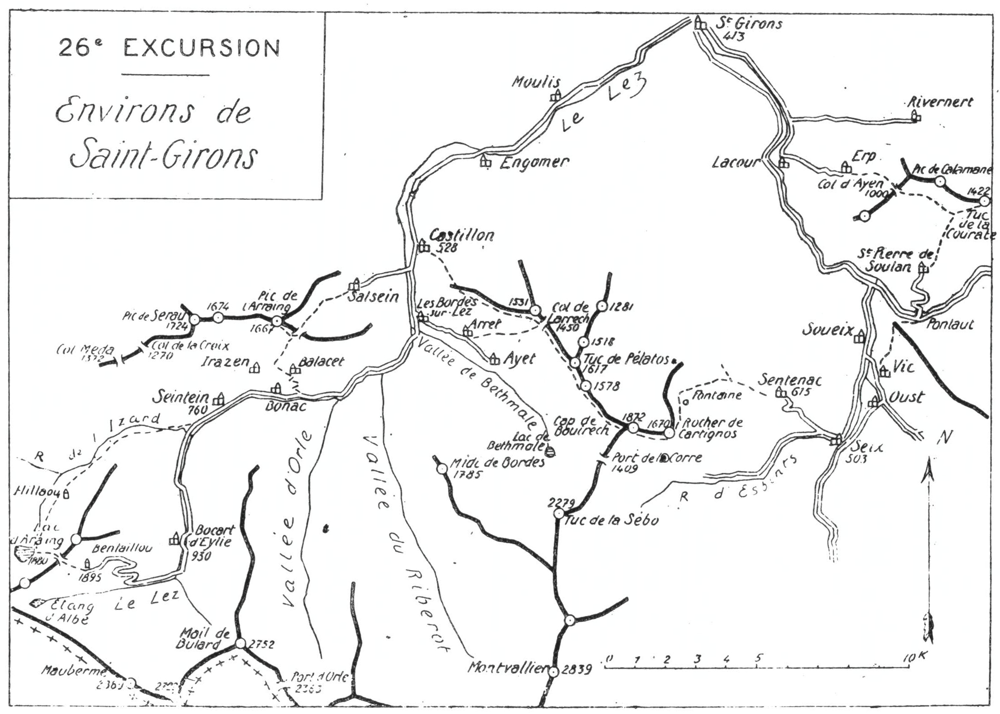

<style>.centre {text-align: center}</style>
<style>.droite {text-align: right}</style>

[//]: # (— p. 343 —)

# VINGT-SIXIÈME EXCURSION

__Quatre jours aux Environs de Saint-Girons__

_B. E. — Du 15 Juin au 15 Octobre._

Carte à emporter : Saint-Girons.

<u>__AVIS AUX TOURISTES__</u>

Les programmes des quatre journées peuvent ètre réalisés
séparément en allant coucher, la veille, au point de départ.
On peut aussi rentrer à Saint-Girons et à Toulouse les soirs
de la deuxième et de la quatrième journée.

<p class="droite">(Voir ci-contre la Carte de l'Excursion).</p>


****

****

## PREMIÈRE JOURNÉE

__De SAINT-GIRONS (413m) à SEIX (503m), par Lacourt (451m),__<br>
__Erp (697m), le Col d'Ayens (1.000m),__<br>
__le Tuc de la Courate (1.422m), Saint-Pierre de Soulan (607m),__<br>
__Pontaut (480m), Vic et Oust (499m).__

—— SANS GUIDE ——

__Conseils.__ — __Itin. recomm.__ On prendra la route qui longe
la rive dr. du Salat jusqu'à Lacourt où on la quittera pour monter
à l'E. au vill. d'Erp, 8 k. de Saint-Girons. Parvenu en face de
l'école, on apercevra à dr., à l'E.-S.-E. une large dépression de
la crête; c'est le Col d'Ayens, qui s'ouvre au haut du cirque de
Soulan, et c'est par là que passe le chemin direct de la Courate.
On peut s'y rendre par deux voies différentes : la première, en
poursuivant devant soi pour descendre à Vignau et remonter
une pente très rude ensuite; la seconde, en prenant à g. le sentier
qui contourne le haut du vallon en pente douce; on prendra

<div class="page"/>

— p. 344 — (26me EXCURSION)

****



<div class="page"/>

— p. 345 — (26me EXCURSION) TUC de LA COURATE

****

ce dernier. A 1/4 d'h. du col, les deux chemins se rejoignent.

On jouit au Col d'un très beau point de vue, et ce site, à lui
seul, vaut la peine qu'on en fasse l'ascension. Tout le cirque
verdoyant de Soulan est sous les yeux, et les toits d'ardoise de
ses nombreux hameaux étincellent au soleil matinal. Les premiers
plans de la moyenne montagne décrivent un arc de cercle
autour du col, tandis que, plus loin et plus haut, s'étagent les
sommets de la grande chaîne. Le Montvalier est majestueux.

Du Col d'Ayens, on prendra la petite route forestière qui file
par la g., à flanc de montagne, en s'élevant en pente douce
vers l'E. Cette marche en corniche est un vrai régal. On contourne
une partie du cirque de Soulan dont les aspects varient
à chaque pas.

Après avoir coupé deux ravins où coulent les eaux de sources
voisines, on arrive, au tournant d'une large croupe, sur un joli
promontoire gazonné situé à 800 m. au S.-O. de la Courate. On
y déposera le sac et on attaquera l'ascension directe du sommet
en suivant un sentier qui grimpe, d'abord, à travers les bruyères
et les fougeraies pour longer, ensuite, le haut d'une petite forêt
jusqu'à la crête de Calamane. De là, on aperçoit devant soi le
sentier de crête qui monte au point culminant (1.422m).

Le Tuc de la Courate, point de triangulation de premier ordre.
est un merveilleux belvédère. La vue s'étend du Pic de Midi de
Bigorre au Soularac, en passant par le Nèouvielle, la chaîne
frontière et le Carlitte. Au N., toute la plaine de Toulouse; à
l'E. celle de l'Aude et, à l'O., celle de Saint-Gaudens. Sous soi,
tout le Saint-Gironnais et tout le bassin du Salat. Au S., l'Arac
et la route qui serpente à près de 1.000 m. de profondeur retiennent
longtemps l'attention.

Comme les chaînons secondaires qui séparent les vallées sont
moins élevés, rien ne gêne la vue qui grimpe jusqu'aux majestueux
sommets de la chaîne frontière.

Après avoir repris le sac, on descendra droit sur Saint-Pierre
dont on aperçoit surtout l'église. Si on n'a pas déjeuné, il suffira
de faire un crochet de 5 min. à dr., à l'O., près de la première
grange, pour aboutir à une source située au creux d'un vallon
et à l'ombre.

Revenant ensuite 2 min. sur ses pas, on rejoindra un bon chemin
muletier qui descend vers Saint-Pierre. Parvenu en vue de

<div class="page"/>

— p. 346 — SAINT-PIERRE de SOULAN (26me EXCURSION)

****

la route, on peut éviter un long détour en coupant à travers les
prairies, droit sur le village.

Le hameau de Saint-Pierre, situé au centre du verdoyant cirque
de Soulan, me paraît être le plus riche de la commune. Il en
est sûrement le plus coquet.

En aval du vill, on suivra l'ancienne route, afin d'aboutir
directement, près du château, au pont de Pontaut (480m). On
franchira là l'Arac, et on rejoindra la route de Saint-Girons à
Tarascon par Massat, au 14° kilomètre.

Pour rentrer à Saint-Girons, 3 h. suffiraient depuis Pontaut
On peut même prendre au passage, soit le courrier descendant
de Massat, soit, 2 k. plus bas, au pont de Kercabanac,
celui de Seix à Saint-Girons. Mais, si on veut, le lendemain,
réaliser le programme de la deuxième journée, on ira coucher
à Seix.

Pour jouir d'un nouveau point de vue et conserver à l'excursion
tout son intérêt, on ne suivra pas la route; on se dirigera
sur Seix en ligne droite. A 300 m. en aval du pont de Pontaut,
au N. d'une maison, on apercevra un chemin qui grimpe raide
vers l'O. et qui mène, en 1/4 d'h., près d'une grange située à g.,
au bord d'un pré. En remontant ce dernier en diagonale, on
parviendra dans 10 min. au faîte de la colline qui sépare la
vallée de Massat de celle d'Aulus, vers 650 d'alt. De ce point,
on domine tout le bassin de Seix dont on a sous les yeux
Soueix, Vic, Oust, Seix, Sentenac et Rogalle.

A deux pas, en face, s'élève le Cap de Bouirech (1.872m), dont
on aperçoit toute la voie d'ascension au départ de Sentenac.
Plus haut, au S.-O., le Montvalier trône sur tout le paysage. Enfin,
si on se retourne, on voit s'étaler devant soi, comme un immense
amphithéâtre, tout le cirque de Soulan.

Pour descendre vers le vill. de Vic, on se dirigera à g. vers
le S., puis on laissera à dr. le chemin qui conduirait à Soueix.
Au delà d'une métairie, on fera un crochet à g., vers le fond du
ravin, pour passer ensuite sous une futaie, et déboucher, 10 min.
après, dans un plateau. Le chemin longe alors plusieurs prairies
en passant près de deux autres métairies, puis descend rapidement
sous forêt, pour rejoindre la route d'Aulus, à 5 min. de
Vic. Encore 1 h. de trajet par ce dernier vill. et Oust, et on
arrive, enfin, à Seix.

<div class="page"/>

— p. 347 — (26me EXCURSION) SEIX

****

__Horaire de la Journée :__

```
De Saint-Gironslau Col d'Ayens........ 2h.45 }
Du Col au Tuc de la Courate........... 1h.45 }   8h. »
De la Courate au pont de Pontaut...... 1h.40 } (Arrêts en sus).
Du pont de Pontaut à Seix............. 1h.50 }
```

## DEUXIÈME JOURNÉE

__De SEIX (503m) à SENTEIN (760m), par le Cap de Bouirech (1.872m),__<br>
__le Tuc de Pélatos (1.617m), le Col de Larrech (1.450m)__<br>
__et Les Bordes-sur-Lez (578m).__

—— SANS GUIDE ——

__Conseils.__ — __Itin. recomm.__ — On partira de très bonne heure,
afin d'arriver au Cap de Bouirech avant 10 h., car ce sommet
se couvre souvent de brouillard entre 10 et 11 h. On prendra
la route de Sentenac et, en haut du vill., on suivra le raccourci
qui monte directement au château de Campagna, près duquel on
fera la première halte. De ce point, on peut repérer la voie
d'ascension qui grimpe vers l'O. à la Fontaine de Coumière,
située vers 1.400 m. d'alt., à la naissance de la grande croupe
gazonnée qui mène au Cap de Bouirech.

A 500 m. du château, le grand chemin bifurque; on prendra
celui de g. qu'on suivra pendant quelques min. seulement. Sur
la dr., s'amorce un sentier rapide qui monte vers deux granges;
là, il tourne vers le N. et, après avoir traversé un flanc de taillis,
va aboutir près d'une autre grange située en haut des prairies.
Le sentier tourne alors à g., direction O., et on monte à travers
la forêt jusqu'à la fontaine. On coupe un grand chemin forestier,
on traverse une clairière humide, et enfin, en se maintenant
constamment en direction O., on débouche dans une prairie,
au centre de laquelle on trouve une grande cabane, un abreuvoir
et la bonne source de Coumière. On fera là sa provision
d'eau, car on n'en trouve pas sur la crête.

Le point de vue est déjà très beau vers l'E. On domine tout le

<div class="page"/>

— p. 348 — CAP de BOUIRECH (26me EXCURSION)

****

bassin de Seix et l'œil franchit les crêtes secondaires jusqu'au
Pic des Trois-Seigneurs, le Mont Ceint et le Port de Saleix.

De la fontaine de Coumière, en gagnera la crête dans 10 min.
et, à partir de là, si la journée est claire, on cheminera dans un
ravissement continu. On dominera constamment les deux versants: 
à g., celui des vallées d'Esbints et de Bethmale; à dr.
celui du cirque d'Alos et aussi toute la plaine du Saint-Gironnais.
L'ascension se fait en pente douce par des sentiers qui sillonnent
des bruyères et des gazons, et toujours à toute crête. On marche
ainsi parallèlement à la chaîne frontière, et il semble qu'on est
sur un balcon placé là par la nature, pour jouir longtemps de la
splendeur de ses hautes cimes.

Bien que le Montvalier soit très imposant, on regrette presque
sa présence, car il masque une grande partie des hauts sommets
de la frontière.

Au rocher de Cartignos (1.670m), on pourra faire une petite
halte, car on y jouit déjà d'une vue superbe. Encore 40 min. de
marche, et on arrive au point culminant de cet intéressant chaînon
au Cap de Bouirech (1.872m).

Le Bouirech n'a aucun caractère d'un pic; c'est le point culminant
et le mieux situé d'une chaîne secondaire très isolée qui
prend naissance à Castillon pour aller mourir plus à l'E. à Seix.
Cette situation est peut-être unique dans les Pyrénées. On pourrait
y circuler à cheval d'un bout à l'autre, soit un parcours
d'environ 20 k., et c'est véritablement l'un des plus beaux sites
du Saint-Gironnais, tant par sa situation que par sa facilité
d'accès. 

Si on va de Castillon à Seix par les vallées de Bethmale et
d'Esbints, on peut, du port de la Corre (1.409m), faire l'ascension
du Cap de Bouirech en 2 h., aller et retour.

Du Cap de Bouirech au Tuc de Pelatos, c'est encore un enchantement
On trouve en cours de route quelques points de vue spéciaux
qui méritent un arrêt : c'est, d'abord, le Cap de Pallus
(1.637m), puis, le Cap Houmateix 1.578m) après lequel on coupe
le Col de Batz où passe le chemin de Bethmale à Alos. Quelques
min. d'ascension, et on arrive au Tuc de Pélatos (1.617m) d'où se
détache, vers le N., le petit chaînon qui va mourir au Col de
Portech (930m), col par lequel passe le chemin de Moulis à Alos.

<div class="page"/>

— p. 349 — (26me EXCURSION) COL de LARRECH

****

Le Tuc de Pélatos est, comme le Bouirech, un très joli belvédère
régional, car sa vue rayonne dans toutes les directions. De
son sommet, on domine toute la vallée de Bethmale, et on a sous
soi, au S.-S.-O., son joli lac.

Continuant à toute crête, on descendra dans 20 min. au Col de
Larrech, au S.-O. duquel est situé le nouveau refuge, vers 1.500 m.
d'alt. Ce refuge, destiné surtout aux sports d'hiver, peut abriter
une trentaine de personnes, avec paillasses de couchage pour
douze touristes. Pour la clé, s'adresser à M. Dunglas, pharmacien,
à Castillon.

En 1h.30, on peut descendre du Col de Larrech à Castillon,
si on veut rentrer à Saint-Girons par le dernier tramway;
mais, si l'on doit continuer par l'excursion des deux jours
suivants, ou simplement de l'un des deux, on ira coucher à
Sentein en suivant l'itinéraire ci-dessous.

Sur le versant O., près du refuge, s'amorce un sentier qui descend
directement au hameau d'Arret, où l'on rejoint la route à
2 k. de Bordes. On descendra par là, et, parvenu à Bordes, on
n'aura plus qu'à prendre le tramway pour aller coucher à
Sentein.

__Horaire de la Journée :__

```
De Seix à Sentenac (3 k.)............... 0h.35 }
De Sentenac à la fontaine de Coumiere... 2h. » }    7h.30
De la fontaine au Cap de Bouirech....... 1h.25 } (Arrêts en sus).
Du Cap de Bouirech à Bordes............. 3h.30 }
```

<div class="page"/>

— p. 350 — LAC D'ARAING (26me EXCURSION)

****

## TROISIÈME JOURNÉE

__De SENTEIN (760m) à SENTEIN, par le Lac d'Araing (1.880m),__<br>
__la Serre d'Araing (2.200m), la Mine du Bentaillou (1.895m)__<br>
__et la Gorge d'Eylie.__

—— GUIDE UTILE ——

__Conseils.__ — __Itin. recomm.__ — Par un temps clair, un guide serait
inutile, mais on fera bien de prendre un porteur pour faire
monter le sac jusqu'au lac d'Araing, d'où on le renverra en lui
payant la matinée.

Au départ de Sentein, on suivra la rive g. du Lez et, 50 m.
avant le premier pont, on quittera la route pour prendre à dr.,
entre deux granges, le sentier de la vallée de l'Izard. Environ
1/4 d'h. après, on franchira le ruisseau pour passer rive dr. et
on montera obliquement à travers des prairies, afin d'aller rejoindre
en haut de celles-ci, le chemin du lac. On entrera immédiatement
dans la forêt de la Coste, qu'on traversera direction
S.-O. pour aboutir aux pâturages de Hillaou, près d'une belle
grange. Le Crabère apparaît alors dominant majestueusement le
Lac d'Araing qu'on ne voit pas encore, mais dont on devine la
cuvette. On montera au S.-O. en prenant le Crabère comme point
de direction. La pente s'accentue et, à travers les gazons et les
bruyères, plusieurs sentiers montent vers le lac en se rapprochant
du torrent qui lui sert de déversoir; on entendra bientôt le bruit
de ses nombreuses cascades. Après avoir longé ce dernier par la
rive dr., on découvre subitement le beau Lac d'Araing (1.880m),
au pied du Crabère qui le domine au S.-O. (1).

Depuis 1922, il existe, rive dr. du déversoir du lac, un refuge
couvert en tôle, avec lit de camp de six à huit places (V. 27° E.,
p. 395).

On fera sur les bords du lac un long casse-croûte, ce qui permettra
d'admirer à son aise ce magnifique paysage, et on ira
déjeuner à la Mine du Bentaillou.

Un sentier s'amorce sur la rive dr. du déversoir et monte di-

———<br>
(1) Cette voie d'ascension est déjà décrite dans la première édition
de mon guide, à la vingtième excursion, p. 245.

<div class="page"/>

— p. 351 — (26me EXCURSION) MINE du BENTAILLOU

****

rection S.-E. pour franchir la Serre d'Araing vers 2.200 m. d'alt.;
on le suivra. Parvenu à la Serre, on découvre subitement, à
l'E.-S.-E., les baraquements de la mine du Bentaillou. On jouit
là d'un très beau point de vue. A l'O., tout le cirque d'Araing,
très éclairé, avec, au centre, la magnifique nappe bleue de son
lac. Au S., tous les hauts sommets de la frontière, depuis le Crabère
jusqu'au Maubermé. A l'E., le Montvalier et, plus près, la
profonde gorge d'Eylie par laquelle on rentrera à Sentein.

Par une pente gazonnée des plus faciles, on descendra, au
S.-E., dans 1/2 h. environ, à la cantine du Bentaillou (1.895m)
située à côté des galeries de la mine. De ce point, on peut rentrer
à Sentein par deux voies différentes : 1° en 3 h. environ, par le
sentier qui s'amorce à l'E. de la cantine et qui descend directement
au Bocart, en longeant les câbles aériens; 2° en 3h.30, par
la route qui zigzague la forêt au S.-E. et qui va rejoindre le haut
de la vallée du Lez, près de la cascade. Cette dernière est plus
intéressante et moins pénible.

Au fond de la vallée, on rejoint le sentier qui descend du Port
d'Urets (V. 25° E., p. 342) et on tourne alors direction N., pour
entrer dans un étroit défilé. Ce coin est délicieux. On débouche
bientôt au Bocart d'Eylie où l'on traite le minerai de blende et de
galène, et on rejoint la route à 5 k. de Sentein.

Ce dernier trajet est des plus agréables. La route descend en
pente douce, sous de frais ombrages, en longant les rives du Lez
jusqu'à Sentein.

__Horaire de la Journée :__

```
De Sentein au Lac d'Araing.............. 3h.30 }
Du Lac d'Araing aux Mines du Bentaillou. 1h.45.}   8h.45
Des Mines du Bentailldu à Sentein....... 3h.30 } (Arrêts en sus).
```

<div class="page"/>

— p. 352 — PIC DE L'ARRAING — CASTILLON (26me EXCURSION)

****

## QUATRIÈME JOURNÉE

__De SENTEIN (760m) à TOULOUSE, par Bonac (750m),__<br>
__le Pic de l'Arraing (1.667m), Salsein, Castillon (528m)__<br>
__et Saint-Girons.__

—— SANS GUIDE ——

> Nota. - Le programme de la quatrième journée, qui n'exige
que six h. de marche et qui permet de rentrer le soir même
à Toulouse, peut tout aussi bien être réalisé à la suite de la
deuxième journée, si on n'effectue pas la troisième.

__Conseils.__ — __Itin. recomm.__ — On partira par Bonac, 2 k. de
Sentein, et, au milieu du vill., on prendra à g. un sentier qui
monte au N. jusqu'au Col de l'Arraing (1.350m). Dans ce trajet,
on passera entre Balacet qu'on laissera à dr., à l'E., et Irazem
qu'on laissera à g. Après avoir coupé la route qui relie ces deux
vill., le chemin fait plusieurs lacets sur la petite colline qui les
sépare, pour aboutir près du refuge du col, où l'on pourra laisser
le sac. Du Col de l'Arraing, on montera direction N.-O. par des
croupes faciles et, dans moins de 1 h., on atteindra le Pic de
l'Arraing (1.667m).

Ce sommet, d'accès très facile et qui n'a nullement la forme
d'un pic, est cependant un très joli belvédère. Ce qui en fait
surtout le charme, c'est sa vue très étendue vers l'O., car on aperçoit
notamment le Pic de Midi de Bigorre, l'Arbizon et le Nèouvielle.

Revenu au col, on descendra au N.-E. à travers une petite
forêt à l'orée de laquelle on trouve le chemin muletier qui mène
directement au vill. de Salsein. A partir de là, on suivra la route
qui descend en pente douce par le vallon de Cazalus dont elle
longe le ruisseau à une certaine hauteur, et enfin, après avoir
franchi le Lez, on rejoindra la grand'route, 5 min. en amont de
Castillon. On n'aura alors qu'à prendre le tram électrique qui
correspond, à Saint-Girons, au dernier train sur Toulouse.

__Horaire de la Journée :__

```
De Sentein au Col de l'Arraing........ 2h.15 }   6h.15
Du Col au Pic, aller et retour........ 1h.30 } (Arrêts en sus).
Du Col de l'Arraing à Castillon....... 2h.30 }
```

> Nota. - Cette excursion peut être faite aussi de Saint-Girons 
à Saint-Girons dans la journée, en partant par le premier
train du matin.
