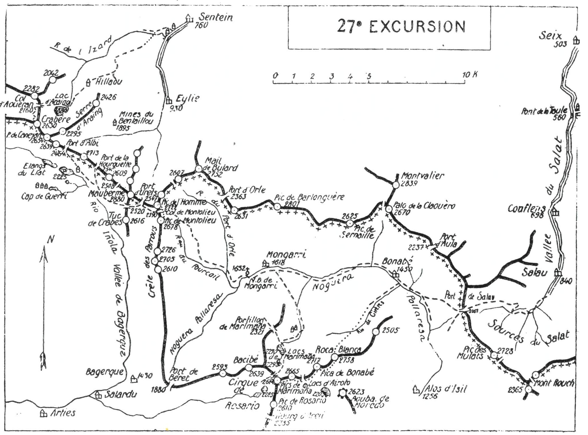

<style>.centre {text-align: center}</style>
<style>.droite {text-align: right}</style>

-----------------------
[//]: # (— p. 353 —)

# VINGT-SEPTIÈME EXCURSION

(N° 20 de la 1re édition)

__Quatre jours au départ de Sentein__

_B. E. — Du 1° Juillet au 15 Septembre._

Cartes à emporter : Saint-Girons et Mont Rouch réunies.

__De SENTEIN (1) à SEIX,__<br>
__par le Lac d'Araing, le Crabère, les Etangs Liat,__<br>
__le Pic de l'Homme, le Pic de Montolieu,__<br>
__N.-D. de Mongarri, les Pics de Marimana, la Pica de Bonabé.__<br>
__la Roca Blanca et le Port de Salau.__

<u>__AVIS AUX TOURISTES__</u>

Avec la vingt-septième excursion, nous attaquons la partie
orientale de la chaîne et nous entrons définitivement dans les
Pyrénées ariégeoises et catalanes, région peu connue, peu fréquentée
et cependant si attrayante. Aussi, pour cette partie,
ai-je donné un plus grand développement à mes itinéraires,
afin de combler de regrettables lacunes et de remédier à
l'inexistence de guides exercés.

Sauf l'Estats et le Montcalm, on ne trouvera plus de sommets
atteignant 3.000 m., mais de fières cimes oscillant entre
2.000 et 2.950 m. Pourtant, elles sont aussi intéressantes, tout
en présentant moins de difficultés. Si les amateurs de fortes
émotions veulent en éprouver dans ces montagnes secondaires.
ils n'auront qu'à les ascendre avant saison, c'est-à-dire du
15 juin au 15 juillet.

On emportera des provisions pour quatre repas et les divers
casse-croûte. On pourra se ravitailler en pain et en vin à
Mongarri pour les troisième et quatrième jour.

<p class="droite">(Voir ci-contre la Carte de l'Excursion).</p>

———<br>
(1) Sentein (Ariège), 1.200 hab., arr. de Saint-Girons, c. de Castillon
desservi par un tramway électrique en correspondance avec la
Compagnie du Midi par la gare de Saint-Girons (25 k.).

<div class="page"/>

— p. 354 — (27me EXCURSION) 
****



<div class="page"/>

— p. 355 — (27me EXCURSION) SENTEIN — LAC D'ARAING
****

## PREMIÈRE JOURNÉE

__De SENTEIN (760m) au PLATEAU du LIAT (2.225m),__<br>
__par le Lac d'Araing (1.880m),__<br>
__le Col d'Aouéran (2.160m) et le Crabère (2.630m).__

—— GUIDE UTILE ——

__Conseils.__ — __Itin. recomm.__ — Par un temps clair, un guide serait
inutile, mais on fera bien de prendre un porteur pour faire monter
le sac jusqu'au Col d'Aouéran.

Au départ de Sentein, on suivra la rive g. du Lez et, 50 m.
avant le premier pont, on quittera la route pour prendre à dr.
entre deux granges, le sentier de la vallée de l'Izard. Environ
1/4 d'h. après, on franchira le ruisseau pour passer rive dr.
et on montera obliquement à travers des prairies, afin d'aller
rejoindre, en haut de celles-ci, le chemin du lac. On entrera immédiatement
dans la forêt de la Coste, qu'on traversera direction
S.-O. pour aboutir aux pâturages de Hillaou, près d'une belle
grange. Le Crabère apparait alors dominant majestueusement
le Lac d'Araing qu'on ne voit pas encore, mais dont on devine la
cuvette. On montera au S.-O. en prenant le Crabère comme point
de direction. La pente s'accentue et, à travers les gazons et les
bruyères, plusieurs sentiers montent vers le lac en se rapprochant
du torrent qui lui sert de déversoir; on entendra bientôt le bruit
de ses nombreuses cascades. Après avoir longé ce dernier par la
rive dr., on découvre subitement le beau Lac d'Araing (1.880m).
au pied du Crabère qui le domine au S.-O.

Depuis 1922, il existe un pelit refuge qui a été construit sur la
rive dr. du déversoir du lac; ce refuge comprend un lit de camp
pour six à huit personnes, plus un petit grenier. Il est couvert
en tôle, et on l'aperçoit du haut du Crabère (V. 26° E., p. 350)

On fera sur les bords du lac un long casse-croûte, ce qui permettra
d'admirer à son aise la belle nappe bleue, le magnifique
décor qui la domine à l'O. et d'aller déjeuner au sommet du Crabère.

Après avoir franchi le déversoir, on s'élèvera insensiblement
vers l'O, en bordure d'une serre jusqu'au large col d'Aouéran

<div class="page"/>

— p. 356 — COL D'AOUERAN — CRABERE (27me EXCURSION)
****

(2.160m) qu'on aura constamment devant soi. Ce col est situé
entre le Tuc det Bouc.(2.282m), au N. et le Crabère au S. De ce
point, on distingue très bien les lacets du sentier qui conduit à
ce dernier sommet. On n'aura donc qu'à se diriger droit au S.
et à franchir une bosse gazonnée pour aller rejoindre le chemin
qui mène directement à la tourelle du Crabère (2.630m).

Le belvédère du Crabère est de tout premier ordre et la vue
s'étend sur toute la grande chaîne, depuis le Pic de Midi de Bigorre
à l'O., jusqu'au Grand Péguéra, au S.-S.-E. Presque tout
le Val d'Aran est sous les yeux et, au N., on domine tout le massif
d'Arbas et la plaine vers Toulouse.

On descendra à toute crête au S., puis à flanc en longeant les
pentes méridionales du Pic de Canejan (2.654m). Là, on prendra
la direction S.-E. pour rejoindre le sentier qui descend du port
d'Albi (2.464m) et qui aboutit un peu plus loin, près du grand
Etang Liat (2.225m).

Les Etangs Liat occupent le haut du plateau de ce nom qui
s'incline au S.-E. Le plus grand, situé plus à l'E. et orné à son
centre d'une petite ile, s'écoule dans la vallée de Bagerque, tandis
que celui aui est plus à l'O. envoie ses eaux dans le Val de Toran.
A quelques min. au S. du grand lac, existe ordinairement une
baraque dans laquelle on peut coucher. Dans tous les cas, on
trouvera facilement à se loger aux baraques des mines de Cap
de Guerri qui sont situées à 1 k. environ au S.-O. du grand Etang
Liat. On peut aussi, en 1h.15, aller coucher à l'une des baraques
des mines de Montolieu, près du Port d'Urets.

__Horaire de la Journée :__

```
De Sentein au Lac d'Araing............ 3h.30 }
Du Lac d'Araing au Col d'Aouéran...... 0h.50 }   8h.30
Du Col d'Aouéran au Crabère........... 1h.40 } (Arrêts en sus).
Du Crabère à l'Etang Liat............. 2h.30 }

 (Si on va coucher à Cap de Guerri, 20 min. en plus.)
```

<div class="page"/>

— p. 357 — (27me EXCURSION) PLATEAU du LIAT — PIC de L'HOMME
****

## DEUXIÈME JOURNÉE

__Du PLATEAU du LIAT (2.225m) à N.-D. de MONGARRI (1.652m),__<br>
__par le Pic de l'Homme (2.722m) et le Pic de Montolieu (2.678m).__

—— SANS GUIDE ——

> Nota. - Cette journée d'excursion permet de refaire facilement
l'ascension du Maubermé. Dans l'affirmative, on montera
droit à l'E. vers le Col de Tartereau (2.508m) pour grimper
ensuite par la cheminée S.-O. On redescendra par la cheminée
d'ascension, puis on tournera au S.-E. pour rejoindre l'itinéraire
régulier ci-dessous au Col de Maubermé. On peut donc,
dans 2 h. de plus, répéter l'ascension de ce magnifique sommet
ou la reprendre si on l'a manquée à la vingt-cinquième
excursion.

__Conseils.__ — __Itin. recomm.__ — On prendra, au bout du grand
étang, le sentier qui se dirige au S.-E. en passant près d'une petite
baraque. Environ 1/2 h. après, on coupera celui qui descend du
port de la Hourquette vers Salardu par la vallée de Bagerque. On
tournera alors à g., à l'E., pour monter au Col de Maubermé
(2.520m) (V. 25° E., p. 341). De ce point, on apercevra, à l'E.
l'échancrure du Col de Montolieu (2.590m) et on découvrira le
chemin des mineurs qui y conduit en laissant le Port d'Urets à g.
On passera par là près des baraques de la mine de blende qui
appartient à la Société « La Vieille Montagne », et on longera le
petit decauville qui transporte le minerai au port d'Urets. C'est
sur les flancs du Pic de l'Homme que s'ouvrent les galeries de la
mine. On contournera donc le haut de la coume de Montolieu par
le chemin des mineurs pour aboutir presque horizontalement au
col où on laissera le sac.

Le Col de Montolieu (2.590m) est situé sur la ligne de partage
des eaux d'Europe, entre le pic du même nom (2.678m), au S., et
le Pic de l'Homme (2.722m), au N. Les eaux de son versant O. s'en
vont à la Garonne par la vallée de Bagerque, et celles du versant
E. s'écoulent par le vallon du Fourcail à la Noguera Pallaresa.

On fera l'ascension du Pic de l'Homme, au N., puis celle du
Pic de Montolieu, au S. De ces deux sommets, on dominera, non
seulement la plus grande partie du Val d'Aran, mais encore les

<div class="page"/>

— p. 358 — N.-D. de MONGARRI (27me EXCURSION)
****

régions de Béret, de Mongarri et de Marimaña. On pourra repérer
presque tout le trajet du lendemain, et on aura sous ses yeux
le chemin de descente à Mongarri par le vallon du Fourcail.

Si, par hasard, on a pris un guide à Sentein, c'est du Col de
Montolieu qu'il faut le renvoyer, pour lui permettre de rentrer
chez lui le soir même, par le Port d'Urets.

Après avoir repris le sac, on descendra au S.-E. en suivant la
rive g. du vallon du Fourcail jusqu'au ruisseau du Port d'Orle
qu'on franchira immédiatement. On rejoindra là le grand sentier
du Port d'Orle qui mène directement à N.-D. de Mongarri
(1.652m). On pourra coucher à la posada d'el Señor Espagne, où
on trouvera quelques provisions.

> Nota. - On peut coucher aussi à l'auberge del Señor François
Molas, qui est située au confluent du ruisseau d'Orle,
1 k. en amont de N.-D. de Mongarri.

__Horaire de la Journée :__

```
Du Plateau du Liat au Col de Montolieu.... 2h.15 } 
Ascension des deux pics (aller et retour). 1h.30 }    6h
Du Col de Montolieu à Mongarri............ 2h.15 } (Arrêts en sus).

  (Si on y ajoute l'ascension du Maubermé, 2 h. en sus.)
```

## TROISIÈME JOURNÉE

__De N.-D. de MONGARRI (1.652m) à BONABÉ (1.450m) [1]__<br>
__par les Pics de Marimanñna (2.674m-2.665m),__<br>
__la Pica de Bonabé (2.717m) et la Roca Blanca (2.758m).__

—— GUIDE UTILE ——

> Nota. - Comme l'exploitation de la forêt est terminée, il est
probable qu'il n'existe plus de cantine à Bonabé. On se renseignera
donc à Mongarri, afin d'emporter des provisions pour
le soir si cela est nécessaire. On pourra toujours coucher à
Bonabé, soit dans une baraque, soit dans une grange.

__Conseils.__ — __Itin. recomm.__ — Il n'y a pas de guide attitré à
Notre-Dame de Mongarri, mais, si le temps est brumeux, on
pourra se faire accompagner par un berger ou un chasseur jus-

———<br>
(1) Bonabé, petite station industrielle, située à 1.450 m. d'alt., sur
la rive g. de la Noguera Pallaresa, au point marqué dans les cartes
« Bordes d'Isil ».

<div class="page"/>

— p. 359 — (27me EXCURSION) PICS de MARIMANA
****

qu'à la Pica de Bonabé, c'est-à-dire pendant les 3/4 de la
journée. Par un temps clair, cette course peut être faite sans
guide.

On franchira le pont qui est au S. de la chapelle pour prendre
le chemin qui longe la Noguera Pallaresa par la rive dr. et qui.
dans 10 min., conduit au vill. de Mongarri. En aval de celui-ci.
on quittera le grand chemin pour suivre, à dr., un sentier qui
se dirige au S.-E. et qui monte en pente douce par le bois de
Dossal. On rejoindra bientôt le vallon de Marimaña dont on
franchira le torrent immédiatement pour le remonter ensuite
par la rive dr. Environ 1/2 h. après, on repassera rive g. et on
continuera l'ascension, direction S., jusqu'aux Bordes de Marimaña
situées à 1h.30 de Mongarri, sur un petit plateau gazonné.

Là, on laissera à dr. un sentier qui monte à l'O. au portillon
de Marimaña (1), et bientôt on arrivera au lac inférieur (2.270m)
dominé au S.-O. par le Pic de Bacibé (2.639m) et au S., par les
deux pics de Marimaña (2.674m-2.665m). A dr. du grand pic, on
apercevra l'échancrure du Col de Marimaña (2.410m) vers lequel
il faut se diriger en longeant les deux lacs par la g. A partir du
lac supérieur (2.290m), le terrain se redresse et c'est par une
pente rapide qu'on arrive au Col de Marimaña (2.410m) situé sur
la ligne de partage des eaux d'Europe, immédiatement au N.-O
du grand pic du même nom et à l'E. du Pic de Bacibé (2.639m). Il
fait communiquer la région de Marimaña avec celle de Rosario.

Du col, l'ascension du grand pic de Marimaña est des plus faciles; 
on n'a qu'à passer sur le versant S. et à monter à flanc de
crête d'abord, puis à toute crête jusqu'au sommet (2.674m).

Le belvédère du Marimaña est de toute beauté, surtout sur les
abords immédiats. On domine les trois cirques lacustres de Rosario
de Marimaña et d'Airoto. Comme de la Pointe de Sabourède
(V. 25° E., p. 338), on peut suivre la ligne de partage des eaux
d'Europe jusqu'à la chaîne frontière qui paraît à deux pas, au N.

Dans 1/2 h. environ, on ira à toute crête du pic occidental au
pic oriental (2.665m) d'où l'on descendra vers une large dépres-

———<br>
(1) Dans les cartes, ce portillon porte à tort le nom de Col de Marimaña
avec la cote 2.325. Le vrai Col de Marimaña (2.410m) est échancré
sur la grande crête. immédiatement-au N.-O. du grand pic de ce
nom (2.674m),

<div class="page"/>

— p. 360 — PICA DE BONABE — ROCA BLANCA (27me EXCURSION)
****

sion. On remontera ensuite au N.-E. jusqu'à la Pica de Bonabé
(2.717m) d'où l'on pourra renvoyer le guide, si on en a pris un.

A partir de la Pica de Bonabé, la crête s'élargit et à environ.
1 k. au N.-E., paraît la montagne trapue de la Roca Blanca, point
culminant du massif. Un col insignifiant sépare les deux sommets,
et le trajet de la Pica à la Roca est un véritable régal, car on,
domine constamment deux régions magnifiques.

Comme l'indique son nom, les faces de cette belle montagne
sont toutes blanches; cette particularité et la puissance de ses
formes la font reconnaître de très loin. On jouit sur son sommet
d'un belvédère splendide dans toutes les directions. Au N.-E.,
à une portée de fusil, s'échancre le Port de Salau et on peut en
repérer la voie d'ascension pour le lendemain. Vers le S., paraissent
toutes les grandes cimes des régions de Sabourède, de Colomès
et des Encantados. Sauf les Monts Rouch qui sont tout près,
à l'E., et qu'une prochaine excursion nous fera connaitre, on ne
sera entouré que de cimes familières qui rappelleront les précédentes
excursions.

Au N. de la Roca Blanca, prend naissance le Rio de Cirères
qui s'écoule direction N.-E. par le barranco de ce nom, pour
aller se jeter dans la Noguera Pallaresa, un peu en aval de Bonabé
Il faut aller vers lui de façon à le rejoindre dans la partie
supérieure au point où il prend la direction N.-E. Il n'y a, en
fait de difficulté dans cette descente, que celle de rester en direction
On franchit plusieurs terrasses, on contourne des ressauts
rocheux jusqu'au torrent au bord duquel on aboutit à des
pelouses faciles, surtout sur la rive g. du vallon.

Dans la partie inférieure, on trouve des sentiers de moutons
qui descendent directement vers la grande vallée et, en longeant
le torrent par la rive g., on aboutira à Bonabé presque en face de
l'ancienne cantine où on couchera.

__Horaire de la Journée :__

```
De Mongarri au grand Pic de Marimaña.... 4h. » }
Du grand Pic de Marimaña au Pic oriental 0h.30 }   9h.30
Du Pic oriental à la Pica de Bonabé..... 1h.15 }
De la Pica de Bonabé à la Roca Blanca... 1h. » } (Arrêts en sus).
De la Roca Blanca à Bonabé.............. 2h.45 }
```

<div class="page"/>

— p. 361 — (27me EXCURSION) BONABE — PORT DE SALAU
****

## QUATRIÈME JOURNÉE

__De BONABÉ (1.450m) à SEIX (503m), par le Port de Salau (2.052m),__<br>
__le Village de Salau (840m) et la Vallée du Salat,__

—— SANS GUIDE ——

__Conseils.__ — __Itin. recomm.__ - Le retour en France par le port de
Salau est une balade de santé et toute pleine de charme, surtout
si on prend la précaution de commander son déjeuner à
l'avance à l'auberge Andrieu, à Salau.

Partant par la rive g. de la Noguera Pallaresa, on suivra le
chemin d'Alos pendant 1/4 d'h. environ. On apercevra alors, à g.,
un sentier qui monte, à l'E., à travers des prairies le long des poteaux
télégraphiques; il conduit en pente douce au Port de Salau.

Par cet admirable sentier en corniche, l'ascension du port de
Salau est un véritable régal. A mesure qu'on s'élève, on voit les
cimes émerger et les vallées s'enfoncer. Si le soleil daigne prodiguer
ses meilleurs rayons, la vue vers l'O. et le S.-O. est un
enchantement. La Roca Blanca est là tout près, superbe, et plus
loin, vers le S., paraissent le grand Péguéra et les pointes
jumelles de Los Encantados.

Au Port de Salau, l'œil est surtout attiré vers les profondeurs
de la vallée-et les neuf sources du Salat qu'on aperçoit en partie
à 1.000 m. en contrebas. Au S.-E., les crêtes des Monts Rouch
qui dominent le cirque de 2.000 m., semblent inaccessibles, tant
leurs faces N. sont vertigineuses.

Du port, on remarquera la situation, peut-être unique dans les
Pyrénées, d'une vallée espagnole faisant suite de si près, en droite
ligne, à une vallée française à pareille profondeur. En effet,
il suffirait de percer un tunnel de 4 k. pour effectuer la jonction
des deux vallées, à 1.300 d'alt.

Un grand chemin, aux nombreux et réguliers lacets, descend
en pente douce dans le vaste entonnoir pour conduire directement
au vill. de Salau. On peut gagner une bonne demi-h. en prenant
quelques raccourcis.

De Salau à Seix, par Couflens et le Pont de la Taule, on suivra
une route pleine d'intérêt qui longe le Salat pendant 14 k. En

<div class="page"/>

— p. 362 — VALLEE du SALAT (27me EXCURSION)
****

attendant l'ouverture de la ligne en construction, on pourra descendre
de Seix à Saint-Girons (18 Kk.), par l'autobus qui fait ce
service.

> Nota. - Si on est pressé et qu'on veuille prendre le dernier
train du soir à Saint-Girons, cela est possible en partant de
Bonabé à 5 h., afin d'arriver à Seix vers 13 h. L'horaire serait
le suivant : de Bonabé au port, 1 h. 45; du port à Salau, 2 h.;
de Salau à Seix, 2h.45: soit au total 6h.30, arrêts en sus.
>
> La course faite ainsi perdrait beaucoup de son intérêt et si
j'indique cet horaire rapide, sans le conseiller, c'est pour un
cas de nécessité.

__Horaire de la Journée :__

```
De Bonabé au Port de Salau......... 2h. » }
Du Port au Village de Salau........ 2h.30 }    7h.30
De Salau à Seix.................... 3h. » } (Arrêts en sus).
```

<u>__POINTS D'INTERRUPTION__</u>

- __MONGARRI__
  - 1° Pour rejoindre de Castillon par le port d'Orle : 8h.30
  - Pour rentrer-à Castillon par le port d'Orle : 7h. »
  - 2° Pour rej. de Salardu par les sources de la Garonne : 4h.30
  - Pour rentrer à Salardu par la même voie : 4h. »

