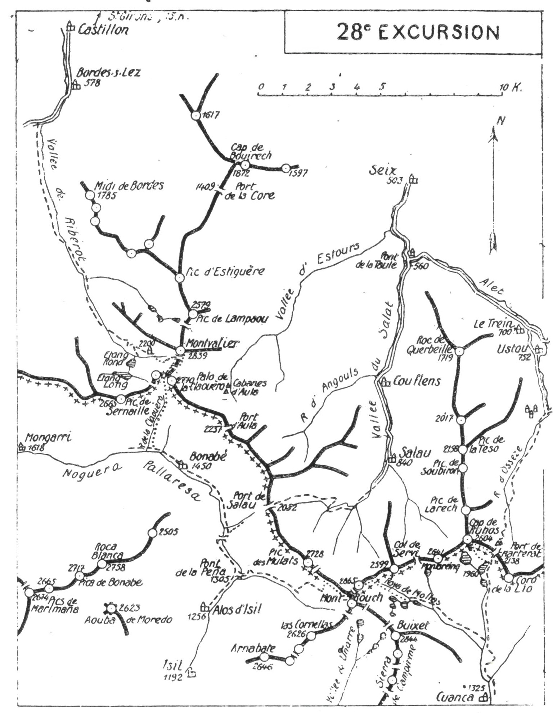

<style>.centre {text-align: center}</style>
<style>.droite {text-align: right}</style>

-----------------------
[//]: # (— p. XX —)

— p. 363 —

# VINGT-HUITIÈME EXCURSION

(N° 21 de la 1re édition)

Quatre jours au départ de Saint-Girons

_B. E. — Du 1% Juillet au 15 Septembre._

Cartes à emporter : Saint-Girons et Mont Rouch réunies.

__De SAINT-GIRONS à USTOU __

__par le Montvalier,__\
__la Palo de la Claouëro, Alos d'Isil, les Pics de Mont Rouch,__\
__la Roya de Mollas, le Cap de Ruhos__\
__et le Port de Marterat.__

<u>__AVIS AUX TOURISTES__</u>

Pour les clés du refuge du Montvalier, il y a au moins un
détenteur dans chaque vallée du Salat et du Lez; c'est M. Dunglas
pharmacien à Castillon, qui l'est actuellement pour cette
dernière. Il faut donc s'arrêter au passage à Castillon pour
prendre la clé et les ordres concernant les conditions d'admission
au refuge. On pourra peut-être aussi trouver un guide ou
un porteur à Castillon, ne serait-ce que pour arriver jusqu'à
la chaîne frontière.

<p class="droite">(Voir ci-contre la Carte de l'Excursion.)</p>

———\
(1) Saint-Lizier-d'Ustou (Ariège), arr. de Saint-Girons (30 k.),
c. d'Oust, postes, télégraphe et téléphone.

<div class="page"/>

— p. 364 — DE SAINT-GIRONS A USTOU (28me EXCURSION)



<div class="page"/>

— p. 365 — (28me EXCURSION) Le MONTVALIER MUR

## PREMIÈRE JOURNÉE

De SAINT-GIRONS (413m) au REFUGE du MONTVALIER (2.200m)

—— GUIDE UTILE ——

__Conseils.__ — __Itin. recomm.__ — On emportera des provisions pour
cinq repas et on partira par le premier tramway en s'arrêtant à
Castillon pour prendre la clé et le guide. On ira déjeuner dans la
vallée de Riberot. On remontera ensuite cette dernière en suivant
le chemin muletier qui longe le ruisseau jusqu'à la cascade de
Nérech. Là, après être passé rive dr., on franchit un ressaut rocheux
par des lacets taillés dans le roc même.

En amont du ressaut, le sentier continue jusqu'au lac Rond;
on le quittera 10 m. après pour prendre celui qui monte à g.,
à l'E., et qui, à travers des pelouses et des broussailles, conduit
au refuge du Montvalier. Ce refuge est situé au-dessus et à l'E.
de l'Etang Rond, vers 2.200 d'alt., au point qu'on nomme « Les
Estagnous. »

Horaire : De Castillon au Refuge, 7 h., arrêts en sus.

## DEUXIÈME JOURNÉE

__Du REFUGE du MONTVALIER (2.200m) à ALOS d'ISIL (1.256m),__

__par le Montvalier (2.839m),__\
__la Palo de la Claouèro (2.670m), Bonabé (1.450m)__\
__et la Gorge de la Noguera Pallaresa.__

—— SANS GUIDE ——

__Conseils.__ — __Itin. recomm.__ - - On peut garder le guide pour la
matinée, afin de se faire accompagner jusqu'à la crête frontière;
on le renverra de la Palo de la Claouèro pour qu'il puisse rentrer
le soir même, à Bordes ou Castillon.

<div class="page"/>

— p. 366 — PIC DE LA PALO DE La CLAOUERO (28me EXCURSION)

Du refuge, on descendra au $., au petit cirque des Estagnous
qu'on traversera pour remonter en face; obliquant ensuite à
g, à l'E., on trouvera l'amorce d'un sentier qui monte au Col
de Faustin (2.600m) où on laissera le sac. On n'aura plus qu'à
tourner au N. et à gravir des pentes faciles par lesquelles on
atteint le Montvalier en 40 min.

Le Montvalier (2.839m), si imposant vu du N., perd un peu
de sa majesté lorsqu'on foule sa cime. Le belvédère est très

beau vers la plaine, vers l'O. et l'E.; il serait de tout premier

ordre si la crête frontière, qu'il ne domine pas assez, ne lui
masquait une partie de la vue fvers de S. et notamment sur les
massifs de Marimaña et de la Roca Blanca.

Le sommet du Montvalier est surmonté d'une tourelle et de
deux croix.

On redescendra au Col de Faustin en droite ligne et, après
avoir repris le sac, on montera au S. par une cheminée qui
passe sous un rocher coincé et qui conduit en haut, à dr., au
Pas de la Balme. C'est là une escalade courte et facile, dans du
bon rocher, et après laquelle on aboutit à un petit plateau
gazonné. On aura sur la dr., direction N;O., un à-pic impres-
sionnant; de là, on domine toute la vallée de Riberot et le refuge
paraît sous les pieds à 500 m. de profondeur.

A partir de ce point, on marchera dr. au S. sans monter à la
crête, de manière à aboutir presque horizontalement à la brèche
de Peyroblanco dont le couloir rapide descend, là g., vers le
cirque d'Aula. On laissera la brèche à ÿg. et on continuera a
flanc O. de montagne en contournant un gros éperon rocheux
assez délicat, après lequel on arrive à une nouvelle brèche vertigineuse
entre deux couloirs à pic. Le couloir ©. est sans danger;
on le traversera pour remonter en face. On entrera là dans
une petite cheminée pour aboutir en haut, à dr., à une corniche
oblique qui monte en pente douce, direction S.-O., jus-
qu'à l'échancrure de la Palo de la Claouère, sur la crête frontière
(2.650m).

En quelques min., sans sac, on pourra faire, à g., l'ascension
du Pic de la Palo de la Claouèro (2.670m) d'où on jouit d'un
magnifique point de vue sur les massifs espagnols, des Monts-
Maudits au Grand Péguéra. De l'autre côté de la vallée, on aura
au premier plan la Roca Blanca et toute la crête qui lui fait
suite vers l'O. jusqu'au Pic de Bacibé.

<div class="page"/>

— p. 367 — La ROYA DE MOLLAS (28me EXCURSION)

## TROISIÈME JOURNÉE

__D'ALOS d'ISIL (1.256m) à CUANCA (1.325m),__\
__par les Pics de Mont Rouch (2.865m) et la Roya de Mollas.__

—— GUIDE UTILE ——

<u>__AVIS AUX TOURISTES__</u>
Avant d'entreprendre cette journée d'excursion par un itinéraire
presque inconnu, deux notes me paraissent indispensables
pour bien mettre en lumière l'état des lieux à traverser
la première sur les Monts Rouch et la deuxième sur la
Roya de Mollas.

1° Les Pics de Mont Rouch, dont l'un est en France et l'autre
en Espagne, à une même altitude de 2.865 m., sont à peu prés
inconnus, quoique admirablement situés. La cause en est, sans
doute, aux difficultés d'ascension par le versant français? En
effet, au départ de Salau, avec les 2.025 m. de différence de
niveau et un terrain à pente excessive, l'ascension en est très
dure. Elle est aussi dangereuse à cause de fréquentes chutes de
pierres qui se détachent des faces N. du pic et des terrains mouvants
de la partie supérieure du cirque. Cependant, si on veut
la tenter par la face N., on montera par la cabane de Léziou
(1.700m) pour atteindre la frontière au Pourtanech des Mulats
et de là, à toute crête, jusqu'au sommet espagnol.

Par le versant espagnol, il n'y a pas de difficultés et on peut
partir de deux points différents : 1° du vill. d'Alos d'Isil pour
aboutir au pic par le vallon de Comamala; 2° du will. de Servi
pour y arriver par la vallée d'Unarre ou de Pallas. C'est du point
le plus commode et le plus rapproché du pic, c'est-à-dire d'Alos,
que je conseille de partir; j'en décris l'itinéraire plus loin.

2° La Roya de Mollas (qu'on nomme aussi Vallon de Gabera),
tout à fait inconnue, est une petite merveille. Orientée du N.-O.
au S.-E., elle est située entre le massif de Campirme, au S., et
la chaîne frontière, au N. Ses points extrêmes sont les deux
Monts Rouch, au N.-O., et le hameau de Cuanca, au S.-E.

<div class="page"/>

— p. 368 —

(28me EXCURSION) ALOS D'ISIL 367

C'est de la Palo de la Claouèro qu'on renverra le guide, ce
qui lui permettra de rentrer, le soir même, à Bordes. On descendra
ensuite sur le versant espagnol jusqu'à une petite source
qui est située 250 m. plus bas, un peu à g., près de laquelle on
pourra déjeuner.

De la brèche frontière, comme, d'ailleurs, de la petite source,
on pourra repérer presque tout le chemin de descente jusqu'au
fond de la vallée. Il suffit de se diriger droit au S. en laissant,
à dr., un morne rocheux et le petit lac qui est à côté. On
rejoindra bientôt le ruisseau de la Palo de la Claouèro qu'on
longera jusqu'au chemin de la rive g. de la Noguera Pallaresa.
Environ 1/2 h. après, on arrivera à Bonabé (V. 27° E., p. 358).
De Bonabé, un grand chemin muletier longe la Noguera Pallaresa
jusqu'à Alos d'Isil, et il est impossible de se tromper.

Environ 1 h. en aval de Bonabé, on rejoindra le sentier qui
descend du Port de Salau et, tout de suite après, on entrera
 dans un étroit défilé où il n'y a place que pour le sentier et le
torrent. On a dû souvent tailler le chemin dans le roc même.
Dix min. après avoir franchi un pont en bois qui fait passer
rive dr., on remarquera le curieux pont ogival de la Peña sur
lequel on passera le lendemain. De ce point, 20 min. suffisent
pour arriver à Alos d'Isil où on couchera.

__Horaire de la Journée :__

```
Du Refuge au Montvalier................. 2h. » }
Du Montvalier à la Palo de la Claouèro.. 2h.10 }   9h.15
De la Palo de la Claouèro à Bonabé...... 2h.50 } (Arrêts en sus).
De Bonabé à Alos d'Isil................. 2h.15 }
```

<div class="page"/>

— p. 369 — (28me EXCURSION) PICS de MONT ROUCH

Un chapelet de cinq lacs, creusés dans le roc et régulièrement
étagés, orne sa partie supérieure. De l'avant-dernier, qui affecte
la forme d'un bénitier, s'élance une belle cascade qui va s'épanouir
sur un rond-point de verdure, au centre d'une pleta qu'on
nomine « Sarrat de la Gallina ». Les eaux, disciplinées, rentrent
ensuite dans un canal naturel, long et régulier, avec une succession
de chutes pareilles à des écluses. Un petit sentier longe ce
canal par la rive g. pendant 2 k. environ.

Plus bas, après avoir traversé la cuvette d'un ancien grand lac
et reçu les eaux du port de Marterat et du lac Mariola, le torrent
s'ouvre un étroit passage dans le roc même; il en sort pour
déboucher à Cuanca où il se jette dans la Noguera de Cardos.

__Conseils.__ — __Itin. recomm.__ — A Alos, on pourrait prendre
comme guide un berger ou un chasseur pour se faire accompagner
jusqu'au Mont Rouch. La descente à Cuanca peut être
faite 

—— SANS GUIDE ——

On remontera la Noguera Pallaresa jusqu'au pont de la Penñx
qu'on passera, afin de prendre immédiatement après, à g., le
sentier qui remonte la vallée de Comamala par la rive dr. Parvenu
au point supérieur où la vallée s'élargit en forme de cirque.
on obliquera à g., au N.-E., pour suivre le sentier qui monte au
Pas de la Peyrade; là, il tourne à l'E. dans la direction du
Mont Rouch d'Espagne qu'on aperçoit tout en haut. Après 3/4 d'h.
de marche dans cette direction, le sentier disparait. On fera alors
un crochet à g., direction N., et, par une pente très redressée,
mais facile, on gagnera la crête frontière d'où on découvre subitement
les profondeurs du cirque de Salau. A partir de là, on
n'aura qu'à continuer à toute crête jusqu'au Mont Rouch d'Espagne
(2.865m). Ce sommet est situé à l'extrémité S. d'une crête
horizontale qui se détache de la chaîne frontière; il est surmonté
d'une tourelle.

Le belvédère du Mont Rouch est de tout premier ordre et
bien peu de pics de 3.000 m. en offrent un pareil. Son panorama
est immense dans toutes les directions; il s'étend du Posets aux
cimes andorranes. Les abords immédiats sont des plus intéressants
puisqu'on domine quatre vallées dont deux sont constellées
de jolis lacs bleus.

Le Mont Rouch de France, de même alt., est situé au N.-E. du

<div class="page"/>

— p. 370 — CUANCA (28me EXCURSION)

Mont Rouch d'Espagne dont il est séparé par une profonde
dépression de la crête frontière. Il faut 1/2 h. environ pour
aller d'un pic à l'autre. Du Mont Rouch espagnol, on reviendra
sur ses pas pour rejoindre la crête frontière qu'on suivra ensuite
vers l'E. en restant sur le versant espagnol jusqu'à la brèche
située entre les deux sommets. Cette brèche domine deux couloirs
rapides, celui de g. plonge dans le haut du cirque de Salau
et celui de dr. descend, au S.-E., à la Roya de Mollas. On traversera
la brèche avec prudence et on montera à toute crête au
Mont Rouch de France.

Le belvédère est analogue à celui du Mont Rouch d'Espagne
en ce qui concerne les lointains; il le complète sur les abords
immédiats, surtout sur la vallée du Salat.

Pour la descente, on suivra, au N.-N.-E., la crête frontière pendant
quelques min. jusqu'au moment où elle tourne au N.-E.
Obliquant alors à dr., au S.-E., on la quittera pour rejoindre un
peu plus bas le couloir rapide qui descend de la brèche et qui
conduit au Sarrat de la Gallina. On passera devant une cabane
en ruines et, quelques min. après, on trouvera le sentier qui longe
le canal par la rive g. et qui mène sur les bords d'un petit lac. A
partir de là, on s'éloignera du fond de la vallée qui devient plus
rapide, et on suivra par la g. un sentier qui passe à une certaine
hauteur.

Bientôt, on franchira le torrent du port de Marterat qui coule
droit au S. vers la cuvette de l'ancien lac, et environ 20 min.
après, on rejoindra le grand sentier du port. On n'aura alors
qu'à descendre au S. jusqu'à Cuanca (1.325m), où on pourra coucher
dans la grange de Thomas Tourrenq.

__Horaire de la Journée :__

```
D'Alos au Mont Rouch d'Espagne...... 5h. » }
Du Mont Rouch d'Espagne à celui de         }   9h.30 
  France ........................... 0h.30 } (Arrêts en sus).
Du Mont Rouch de France à Cuanca.... 4h. » }
```

<div class="page"/>

— p. 371 —  (28me EXCURSION)   CAP de RUHOS

## QUATRIÈME JOURNÉE

__De CUANCA (1.325m) à SAINT-LIZIER d'USTOU (752m),__\
__par le Cap de Ruhos (2.604m) et le Port de Marterat (2.138m).__

—— SANS GUIDE ——

__Conseils.__ — __Itin. recomm.__ — Un bon sentier monte au N. au
Port de Marterat; c'est celui par lequel on est arrivé la veille et
par lequel on repartira. Environ 1 h. après, on laissera à g. le
sentier de la Roya de Mollas et, en continuant direction N., on
arrivera bientôt en vue d'un premier lac situé à l'entrée du vallon
rapide qui grimpe vers le port. Le sentier longe le lac par la
rive g. et, environ 1/2 h. plus haut, on arrive au lac supérieur
un peu plus grand. C'est là qu'il faut quitter le chemin du port.

Passant en amont du lac, on montera au N.-O. par des terrasses
superposées, afin d'atteindre le contrefort S. du Cap de Ruhos
dont le point culminant est Ic sommet secondaire de ce nom. On
contournera le sommet S. et, par une marche à flanc, direction N.,
on gagnera l'arête et on montera à toute crête au Cap de Ruhos
(2.604m) qui est situé sur la frontière.

De ce sommet, on jouit d'une vue splendide sur les montagnes
et les vallées de la région. Sur le versant français, les vallons
plongent verticalement et on domine la vallée du Salat d'environ
2.000 m. C'est avec ceux du Port de Salau et du Mont Rouch, le
belvédère qui complète le point de vue circulaire sur l'immense
entonnoir de Salau.

Du Cap de Ruhos, on suivra à l'E. la chaîne frontière et on
descendra ensuite au S.-E., à flanc S. de crête, afin de rejoindre
le sentier près du Port de Marterat.

Si, venant d'Espagne, on monte en pente relativement douce
jusqu'au port, le versant français est, au contraire, presque à pic,
et on peut affirmer que, malgré sa petite alt. de 2.138 m., le Port
de Martcrat est un des plus mauvais de la chaine. Par moments,
il souffle là de telles tourmentes qu'on serait emporté comme un
fétu de paille si on commettait l'imprudence de s'y engager.

Sur le versant français, à g. et un peu en contrebas du Col, il
existait autrefois une bonne cabane, aujourd'hui en ruines, dont
<div class="page"/>

— p. 372 — USTOU (28me EXCURSION)

la mise en état s'impose pour pouvoir s'y réfugier en cas de tourmente

Au-dessous de la cabane, un petit sentier de contrebandiers
descend en lacets rapides; je le déconseille, car, par le mauvais
temps, il serait dangereux. Il vaut mieux suivre le chemin régulier
qui va faire un long lacet à g. et qui reprend ensuite la direction
N. Vers le fond de la ligne de plus grande pente, les deux
sentiers se réunissent, et on franchit le torrent pour passer rive
dr. A partir de là, le chemin, qui devient muletier, est des plus
agréables; on remarquera sur la g. la belle cascade d'Ossèze. Bientôt
il se transforme en chemin de chars jusqu'au premier hameau
où l'on rejoint la route. Encore 1/2 h. de marche, et on
arrivera à Saint-Lizier d'Ustou (752m), chef-lieu de la commune
de ce nom, où on pourra coucher à l'Hôtel Gleyzes.

Nota. — Un courrier ordinaire fait tous les matins le service
de Saint-Girons (30 k.) et un autobus monte également tous les
jours au village du Trein, situé à 1 k. 500 en aval de Saint-
Lizier 1'Ustou. On fera bien de se renseigner au passage sur
les horaires de ces services, en vuc de la vingt-neuvième
excursion.

Si on est parti de très bonne heure de Cuanca, on peut aller
coucher à Seix (12 k.), où on trouvera le confortable de la
ie et des autobus correspondant à tous les trains de Saint-
Girons.

__Horaire de la Journée :__

```
De Cuanca au Lac supérieur de Marterat.. 2h.15 }
Du Lac supérieur au Cap de Ruhos...... 2h. » } 8h.45
Du Cap de Ruhos au Port de Marterat.. 11h.30 } (Arrêts en sus).
Du Port à Saint-Lizier d'Ustou......... 3h. » }
(Si on poursuit jusqu'à Seix, 2h.20 }
```

<u>__POINTS D’INTERRUPTION__</u>

Pour rejoindre de Salau, afin de prendre la cara-
lre ) ë . . «
vane au passage, le soir du 2e jour........... 4h.30

ÿme Pour rentrer à Salau le soir du 2° jour (ce qui
porterait la durée de l'excursion à 11 heures). 4h. »


BONABÉ

, Pour rejoindre de Salau par le Port de ce nom. 5h. »
DER OMSIE Pour rentrer à Salau par cette voie............ 5h.30

