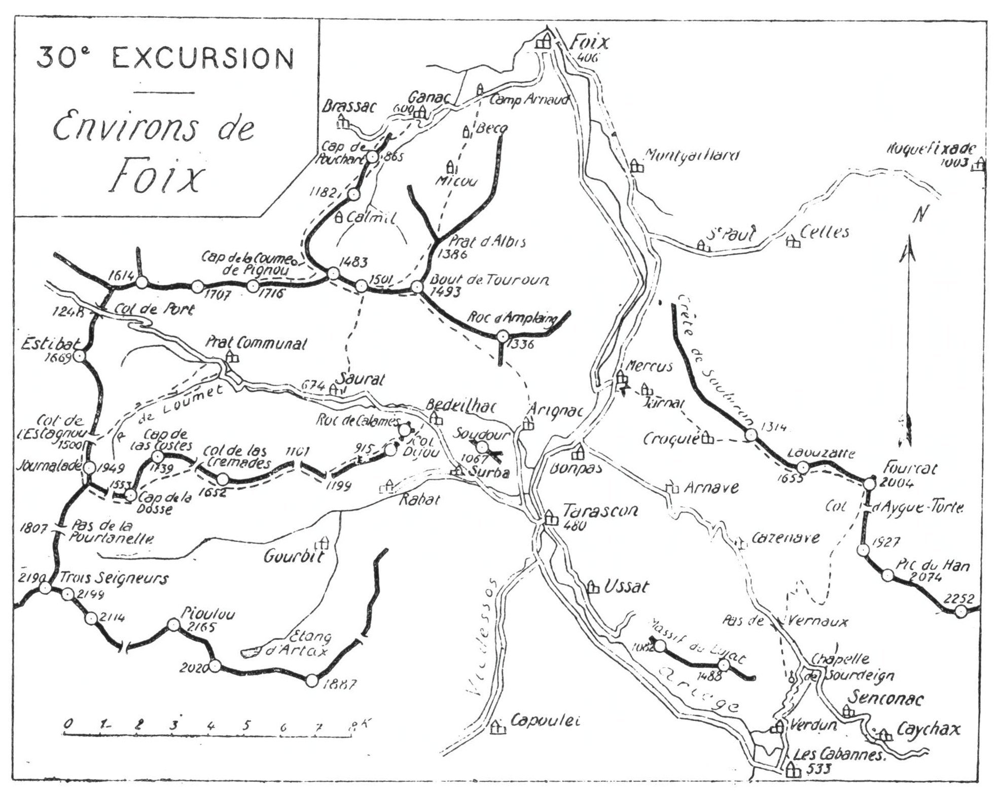

<style>.centre {text-align: center}</style>
<style>.droite {text-align: right}</style>

[//]: # (— p. 385 —)

# TRENTIÈME EXCURSION

__Trois jours aux Environs de Foix__

_B. E. — Du 15 Juin au 15 Octobre._

Carte à emporter : Foix.

## PREMIÈRE JOURNÉE

__De FOIX (406m) à SAURAT (674m), par Ganac (600m),__<br>
__le Calmil (1.160m), le Cap de la Coume de Pignou (1.716m)__<br>
__et le Roc des Louvetières (1.501m).__

—— SANS GUIDE ——

__Conseils.__ — __Itin. recomm.__ — Si on n'a pas couché la veille à
Foix, on y arrivera par le premier train, et on partira immiédiatement
pour Ganac (5 k.). Là, on quittera la route pour traverser
le vill., afin d'en sortir par le S.-O. et commencer l'ascension
par la rive g. du vallon de Ganac.

Au hameau de Carrigas, le chemin s'élève à dr., en lacets
rapides, vers la colline qui sépare le vallon de Ganac de celui
de Brassac, et on arrive bientôt sur un petit promontoire d'où
l'œil plonge sur la Barguillère. A partir de là, le chemin monte
en pente douce, d'abord, par le flanc O. de 1a colline, ensuite,
en longeant un petit plateau; puis, après avoir fait deux lacets,
aboutit au Cap de Bouchart (865m). On fera là une petite halte,
car on y jouit déjà d'un coquet point de vue sur la plaine, sur
Foix et sur toute la Barguillère qu'on domine en entier.

Le chemin continue par la face O. de la colline en contournant
le Picou du Calmil (1.182m) qu'on laisse à g., et on arrive, enfin.
à la bifurcation du sentier de crête qui quitte celui de la fruitière
du Calmil. Ce dernier continue tout droit devant soi, entre

<p class="droite">(Voir ci-contre la Carte de l'Excursion).</p>

<div class="page"/>

[//]: # (— p. 386 —)



<div class="page"/>

— p. 387 — (30me EXCURSION) CAP de LA COUME DE PIGNOU

****

deux rangées de bouleaux; on le laissera à g., et on suivra celui,
à peine tracé, qui suit la crête.

Après 10 min. d'ascension, on apercevra en contrebas, à g.,
les bâtisses du Calmil dans un site des plus riants, et on aura
devant soi, au S., le Picou de Ganac (1.483m), dominant tout le
paysage. On montera vers lui sans quitter le faite de la colline
et, parvenu à sa base, on le contournera par la dr., afin d'aboutir
presque horizontalement au col de verdure situé au S. De ce
point, on poursuivra l'ascension par des pentes gazonnées, direction
S.-O., pour rejoindre le sentier de crête qui mène directement
au point culminant du chaînon, au Cap de la Coume de
Pignou (1).

Le Cap de la Coume de Pignou (1.716m) comprend deux pointes
d'égale alt. et distantes d'environ 800 m.; c'est à la pointe O.
qu'est le plus beau point de vue. Son panorama est immense;
il n'y en a pas de supérieur aux Pyrénées parmi les sommets de
premier plan. On peut identifier tous les pics importants de la
grande chaîne, depuis le Pic de Midi de Bigorre au Canigou,
Néthou compris.

Une infinité de vallées, avec leurs nombreux vill., se creusent
autour de soi dans toutes les directions, et la vue vers la plaine
s'étend jusqu'à Toulouse qu'on aperçoit très bien par une journée
claire. L'œil est ensuite attiré par une muraille blanche, unique
dans les Pyrénées; c'est le chaînon calcaire du Plantaurel, qui
s'étend du Mas-d'Azil à Lavelanet, et qui a l'air d'une barrière
entre la montagne et la plaine.

Si le Cagire est le belvédère de la Garonne et la Courate celui
du Salat, le Cap de la Coume de Pignou est merveilleusement
celui de l'Ariège; il la prend en enfilade de Tarascon à Ax et la
domine ensuite dans la plaine vers Toulouse.

Les environs immédiats sont de toute beauté. Tout près, au
S.-O. et au premier plan, paraissent la Journalade (1.949m) et le
Cap de la Dosse (1.953m) qu'on ascendra le lendemain; plus loin
et très imposant, le Pic des Trois Seigneurs dont on trouvera la
description à la 31° excursion.

A l'E.-S.-E., le massif de Tabe, qu'on aperçoit en entier, paraît
à deux pas.

———<br>
(1) Pour les gens du versant de Foix, ce sommet s'appelle le
« Picou ».

<div class="page"/>

— p. 388 — ROC des LOUVETIERES - SAURAT (30me EXCURSION)

****

Pour jouir des principaux points de vue de cet intéressant
chaînon, on en suivra la crête à l'E. jusqu'au Roc des Louvetières
(1.501m), situé à 3 k. C'est un amas de rochers superposés,
au sommet de la crête et dominant un beau centre de verdoyants
pâturages, parmi lesquels le Prat d'Albis, au N.-E. On fera là
une longue halte.

Pour descendre à Saurat, on dévalera droit au S., à travers les
pelouses, en laissant à dr. le sentier muletier qui va faire un
trop long lacet vers l'O. Aux premières granges, on rejoindra
un grand chemin pavé qui conduit directement à Saurat où il
aboutit sur la place, près de l'église.

__Horaire de la Journée :__

```
De Foix à Ganac (5 k.)................ 1h.10 }
De Ganac au Cap de la Coume de Pignou. 3h.35 }   7h.45
De la Coume de Pignou au Roc des Louve-      }
  tières.............................. 1h. » } (Arrêts en sus).
Du Roc des Louvetières à Saurat....... 2h. » }
```

__Variante possible :__

Selon les buts du lendemain (au cas où on ne continuerait pas
par la deuxième journée), on peut, du Roc des Louvetières, descendre
par deux autres voies :

1° A Foix, en 2h.45, par le Prat d'Albis, Micou et Becq,
pour rejoindre la route à Camp-Arnaud, 3 k. de Foix;

2° A Tarascon, en 3h.15, par le Bout de Touroun (1.498m),
pour rejoindre un sentier qui descend au S.-E.; à Arignac, 3 k.
de la gare de Tarascon. Cette dernière voie est la plus 
intéressante.

## DEUXIÈME JOURNÉE

__De SAURAT (67142m) aux CABANNES (533m),__<br>
__par le Pic de la Journalade (1.949m), le Cap de la Dosse (1.953m),__<br>
__le Roc de Trabinet (1.652m), le Roc des Iretgés, le Cap__<br>
__de Brougat (915m), Bédeilhac et Tarascon (480m).__

—— SANS GUIDE ——

__Conseils.__ — __Itin. recomm.__ — Partant par la route du Col de
Port, on la suivra pendant 4 k., jusqu'au pont qui franchit lc
Loumet avant d'arriver à Frat-Communal. Après le pont, on

<div class="page"/>

— p. 389 — (30me EXCURSION) PIC de LA JOURNALADE

****

prendra le chemin de chars qui s'amorce à g., et qui remonte
le cours du Loumet; c'est la voie la plus directe de Saurat à
Massat par le col de l'Estagnou (1.500m).

Après avoir quitté la route, on monte en pente douce entre
des granges et en longeant des prairies pendant 1 h. environ.
On débouche bientôt à découvert, au haut de celles-ci, dans les
pâturages communaux où le chemin se transforme en sentier.
Les deux pointes de la Journalade paraissent alors devant soi,
s'élançant, superbes, en plein ciel; un col gazonné les sépare.
La pointe N. n'est qu'un simple contrefort; c'est à la pointe S.,
nœud de trois crêtes, qu'est le point culminant.

On franchira le ruisseau pour en suivre la rive g., et 10 min.
plus haut, on rejoindra le sentier qui vient de Prat-Communal
par Loumet et Courtavieil, et qui mène au Col de l'Estagnou. Au
pied du col, le sentier tourne à dr., à l'O., et c'est en zigzaguant
la pente rapide qu'on parvient à la plus basse dépression de la
crête qui va de la Journalade, au S., au Pic d'Estibat (1.669m),
au N.

Au Col de l'Estagnou, le point de vue est déjà très beau sur
les environs immédiats, car l'œil prend en enfilade toute la
vallée de Saurat jusqu'à Tarascon. On entre là dans la région
favorite des perdrix; je n'y suis jamais passé sans en apercevoir
plusieurs compagnies.

A partir du col, on prendra la direction S. pour monter à
toute crête vers la pointe secondaire de la Journalade, pointe N.
qu'il faut contourner par l'O. afin d'aboutir au col gazonné
aperçu d'en bas. Il n'y aura plus qu'une grimpette de 10 min.
sur un bon terrain, et on atteindra la cime de la Journalade
(1.949m).

Sur ses trois faces, prennent naissance trois vallées : celle
de Massat, au N.-O.; celle de Saurat, au N.-E., et celle de Rabat,
au S. Cette situation fait de ce petit sommet un très joli belvédère
régional, moins étendu cependant que celui de la Coume
de Pignou; mais, ce qui donne un grand charme à cette excursion
c'est le trajet par les crêtes, depuis la Journalade jusqu'au
Roc de Calamès.

A 1.500 m. au S.-E., parait la pointe massive du Cap de la
Dosse (1.953m); un petit sentier y conduit en passant au col qui
la sépare de la Journalade. On ira d'un sommet à l'autre par le
petit sentier qui longe la crête par la face S.

<div class="page"/>

— p. 390 — LE ROC de TRABINET (30me EXCURSION)

****

Le point de vue est analogue à celui de la Journalade, sauf sur
la vallée de Massat qui lui est en partie masquée. En revanche,
le Pic des Trois Seigneurs, qui est là tout près, a plus belle allure
vu du Cap de la Dosse que de la Journalade.

Du Cap de la Dosse, on filera droit à l'E., en laissant à g. le
Cap de las Costes (1.739m) et en coupant par le haut le petit
cirque de Freychinet, afin d'aboutir horizontalement au Col de
las Crémades. Une petite remontée conduira sur la bosse du Roc
de Trabinet (1.652m), d'où on jouira d'un nouveau point de vue
sur les vallées de Saurat et de Rabat.

A partir du Roc de Trabinet, c'est un vagabondage par les
multiples sentiers qui suivent cette intéressante colline, tantôt
à travers les alpages, tantôt le long des prairies et des forêts. On
coupe d'abord de Col de Carloung (1.101m), puis celui de Banalouse
(1.199m). Après ce dernier, on fera, dans quelques min.
l'ascension du Roc des Iretgés (1); puis, un peu plus loin, celle
du Cap de Brougat (915m). Chacun de ces petits sommets est un
balcon suspendu sur le vill. de Rabat. On arrive, enfin. au Col
Dijou, au pied du Roc de Calamès; si on dispose d'une demi-h.
on peut en faire la facile ascension, car un sentier monte jusqu'au 
pied des ruines.

Un grand chemin qui vient de Rabat passe au-dessous du Col,
pour descendre ensuite à Bédeilhac où on rejoint la grand'route,
à 4 k. de Tarascon; là, on n'aura plus qu'à prendre le train pour
aller coucher aux Cabannes.

__Horaire de la Journée :__

```
De Saurat au pont du Loumet.......... 1h. » }
Du pont au Col de l'Estagnou......... 2h. » }
Du Col à la Journalade............... 1h.30 }    9h. »
De la Journalade au Cap de la Dosse.. 0h.30 } (Arrêts en sus).
Du Cap de la Dosse à Bédeilhac........3h. » }
De Bédeilhac à Tarascon.............. 1h. » }
```

———<br>
(1) Roc des hérétiques.

<div class="page"/>

— p. 391 — (30me EXCURSION) VERDUN

****

## TROISIÈME JOURNÉE

__Des CABANNES (533m) à FOIX (406m), par Verdun,__<br>
__le Mont Fourcat (2.004m), le Pic de la Laouzatte (1.655m),__<br>
__Croquié et Mercus.__

—— SANS GUIDE ——

__Conseils.__ — __Itin. recomm.__ — On sortira des Cabannes par
le N., et après avoir traversé le chemin de fer, on prendra la
route qui, par Verdun, monte à la chapelle de Sourdeign. Au-
dessus de Verdun, la route grimpe par une étroite gorge dans
laquelle elle fait neuf lacets, pour atteindre le plateau où est
bâtie la chapelle, près du lac desséché de Sourdeign. On fera là
une petite halte et on donnera un coup d'œil en arrière sur le
verdoyant bassin des Cabannes, si coquet au soleil levant.

A la chapelle, on quittera la route pour suivre à g. un chemin
qui file horizontalement, en longeant le lac, et qui aboutit aux
granges de Miquel. On rejoindra là une vraie route touristique et
l'une des plus agréables de l'Ariège : celle qui va de Caussou à
Mercus. En effet, de Caussou, elle part en corniche par Bestiat,
en dominant la grande vallée de très haut jusqu'au Col de
Lordat, puis continue par un vallon suspendu à flanc de montagne
en desservant Axiat, Appy, Caychax, Senconac, Cazenave
et Arnave.

A 800 m. au N.-O. des granges de Miquel, cette route franchit
un passage très étranglé, nommé Pas de Vernaux (1). Environ
500 m. avant d'y arriver, on la quittera pour prendre à dr. un
grand sentier qui monte au Bois de las Bernières (1.375m) qu'on
traversera en entier, direction N. Après quelques courts et
rapides lacets, le sentier fait un grand crochet à dr. et aboutit
à une petite clairière d'où on domine une grande partie de l'intéressante
route vers Caychax. Au S.-O., de l'autre côté du vallon,
l'Aiguille de Souloumbrie (1.277m) fait un effet superbe.

De la clairière, le sentier repart en pente douce, direction N.,
et, à mesure qu'on avance, on découvre l'autre versant vers Mercus
et Foix. Au S.. on aperçoit maintenant presque tout le massif
du Lujat. Après avoir franchi le ruisseau d'Arnave et traversé
un ravin, on quitte la forêt pour aborder les pâturages supérieurs
vers 1.600 m. d'alt. On inclinera alors légèrement à dr.,

———<br>
(1) Pas de Souloumbrie de la carte d'Etat-Major.

<div class="page"/>

— p. 392 — MONT FOURCAT - LAOUZATTE (30me EXCURSION)

****

et on montera à travers les croupes gazonnées, direction N.-E.,
afin d'aboutir à la crête, près des ruines de la cabane du Col
d'Aigue-Torte. C'est là que passe le chemin direct d'Ussat à
Montferrier et à Lavelanet.

Au Col d'Aigue-Torte, on est sur un vaste plateau herbeux, peu
incliné, et il suffit d'en suivre le faîte direction N., pour arriver,
20 min. après, au Mont Fourcat (2.004m).

Le panorama du Fourcat est splendide; il rayonne dans toutes
les directions comme celui de la Coume de Pignou, avec une
vue plus complète vers les plaines de l'Aude. Mais ce qui retient
le plus longtemps l'attention, c'est la grande chaîne frontière et
ses profondes vallées qui dégringolent vers le cours de l'Ariège
où elles vont mourir. La vue est si étendue vers la plaine que,
par un temps clair, on aperçoit très bien Toulouse à la lorgnette.

Du Fourcat, on obliquera à g., à l'O. d'abord, au N.-O. ensuite,
et, sans quitter la crête, on aboutira, 35 min. après, au Pic de
la Laouzatte (1.655m). Son belvédère est sensiblement le même
que celui du Fourcat, mais moins étendu.

De la Laouzatte, un très joli sentier descend direction N.-O.,
en longeant par la g. la crête de Soubiron (1.314m) pendant
20 min. puis tourne à l'O. jusqu'au hameau de Croquié. A partir
de là, un chemin de chars mène directement à Jarnat d'où il
descend à Mercus, où on prendra le train pour Foix.

Durant toute cette descente, on aura devant soi le massif du
Montcalm, les montagres d'Aulus, ainsi que les cimes secondaires
gravies les jours précédents.

__Horaire de la Journée :__

```
Des Cabannes au Mont Fourcat....... 4h.45 }  7 h. 45
Du Fourcat à la Laouzatte.......... 0h.35 }
De la Laouzatte à Mercus........... 2h.25 } (Arrêts en sus).
```

> Nota. - Cette excursion peut être effectuée en sens inverse;
mais, dans ce cas, celle présente l'inconvénient de faire toute
l'ascension à découvert et face au soleil.


****

****

__<u>POINTS D'INTERRUPTION</u>__

- __SAURAT__
  - Pour faire la deuxième et la troisième journée ou
pour abandonner après la premiére.
- __LES CABANNES__
  - Pour ne faire que la troisième journée.
