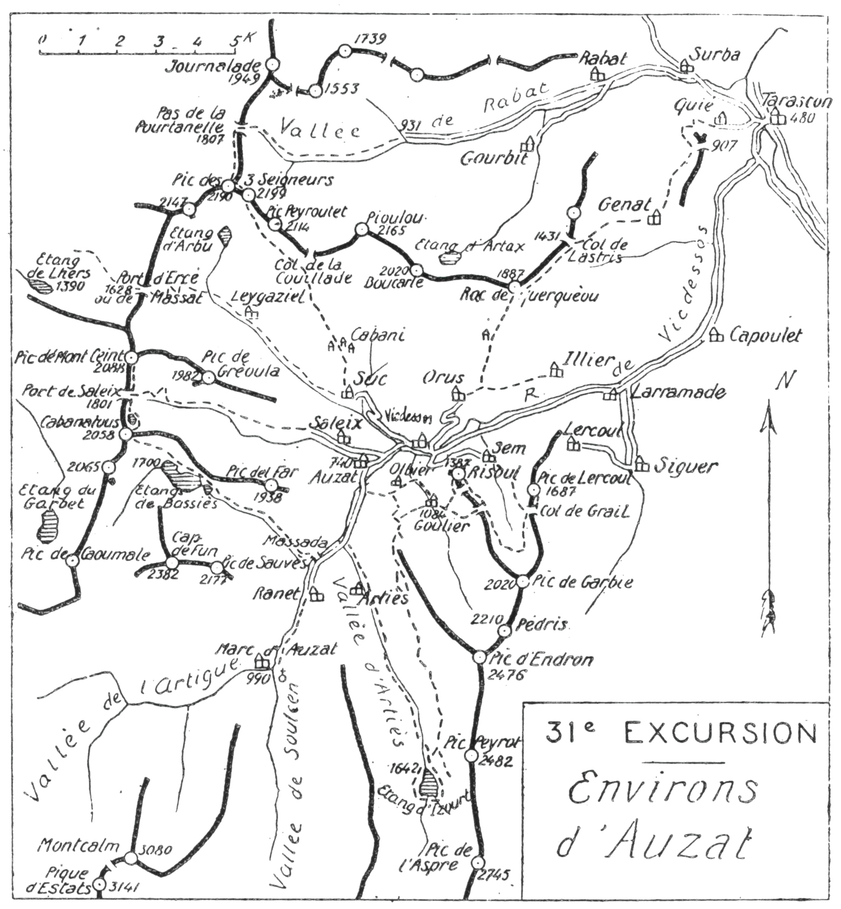

<style>.centre {text-align: center}</style>
<style>.droite {text-align: right}</style>

-----------------------
[//]: # (— p. 393 —)

# TRENTE ET UNIÈME EXCURSION

__Quatre jours aux Environs d'Auzat__\
__AU DÉPART DE TARASCON__\
__(1° Série)__

B. E. — Du 15 Juin au 15 Octobre.

Cartes à emporter : Foix et Perles.

__De Tarascon à Tarascon, par le roc de Querquéou__\
__Vicdessos, l'Etang d'Izourt, Goulier, le Pic de Risoul, le Col__\
__de Grail, le Pic de Lercoul, le Roc de Berquié,__\
__le Pic des Trois Seigneurs et la Vallée de Rabat.__
 

<u>__AVIS AUX TOURISTES__</u>


Comme pour Luchon, c'est par la montagne que nous arriverons 
à Auzat, en montant, d'abord, au Roc de Querquèou
(1.887m); cela permettra d'avoir, le premier jour, une belle
vue d'ensemble sur la magnifique région qu'on va explorer.

<p class="droite">(Voir ci-contre la Carte de l'Excursion).</p>

<div class="page"/>


— p. 394 — ENVIRONS D'AUZAT (31me EXCURSION)
 


<div class="page"/>


— p. 395 — (31me EXCURSION) ROC de QUERQUEOU


## PREMIÈRE JOURNÉE

__De TARASCON (480m) à AUZAT (740m), par Quié, le Plateau__\
__de Génat (980m), le Roc de Querquèou (1.887m),__\
__Orus (984m) et Vicdessos (695m).__

__Conseils.__ — __Itin. recomm.__ — Si on n'a pas couché la veille à
Tarascon, on y arrivera par le premier train, et on partira immédiatement 
pour Quié, situé 1 k. à l'O. de la gare. En haut du
vill., on prendra le grand chemin muletier qui monte en de nombreux 
lacets au plateau de Génat. Après 20 min. d'ascension, un
sentier file à dr., vers le Bois de la Garrigue, tandis que celui
de Génat tourne à g., ct passe sous des taillis pendant 10 min.;
on arrive alors à la base d'un petit vallon qui monte direction 
S.-E., et moins de 1/4 d'h. après, on débouche, à l'entrée
du plateau, au large col coté 907 m.

Tout le plateau est devant soi, et on aperçoit, au S.-O., le sentier 
du Querquèou par le Bois du Débès. On suivra donc le chemin 
de Génat qui traverse tout le plateau direction S. et, parvenu 
au vil, on y fera sa provision d'eau, car on n'en trouvera
de potable qu'après avoir quitté le Querquèou.

Avant d'arriver à Génat, on remarquera à dr. l'amorce du
chemin qu'il faut prendre; on montera donc d'abord direction 
N. par une petite route qu'on quittera quelques min. après.
puis, direction N.-E. Un peu plus haut, on laissera à dr. le sentier 
du Col du Pla de Faradès, pour suivre à g. celui qui se
dirige à l'O. par le Bois de Débès. C'est le chemin direct de
Génat à Lapège par la Fontaine du Ber et le col de la
Bène (1.314m).

Parvenu au haut du Bois de Débès, le chemin de Lapège redéscend 
à partir d'un petit col; on le quittera là pour remonter
à dr., à travers la forêt, afin de gagner la grande crête au Col
de Lastris (1.431m), à l'orée du Bois de Las Taillades. A partir
de là, on n'aura qu'à suivre la crête gazonnée jusqu'au Roc de
Querquéou (1.887m).


<div class="page"/>


— p. 396 — ORUS — VICDESSOS (31me EXCURSION)

Le Roc de Querquèou est le dernier sommet important du
chainon à l'E. des Trois Seigneurs, et l'un des mieux situés
de la région. La cime est constituée par un amas de rochers
granitiques, entassés les uns sur les autres, comme s'ils étaient
tombés du ciel. C'est par le Querquèou qu'il faut débuter pour
explorer la région d'Auzat, de Siguer et de Vicdéssos, car il est
le belvédère de choix pour en étudier leurs formes et en apercevoir 
leurs beautés.

Autour de soi, circulent les vallées de Rabat, de Suc, de Vicdessos 
et de Siguer. On prend en enfilade cette dernière, et on
domine une vinglaine de villages. Vers le S., en amont d'Auzat,
s'étagent une infinité de lacs et de petits sommets jusqu'aux
grandes cimes de la frontière.

Au S. du Querquèou, se creuse un ravin de pâturages qui
descend rapidement vers la cabane de Turlou et les granges
de Peyrelade; on peut passer partout, soit par le faîte de la
colline, soit par le creux. du ravin. On dévalera donc à sa fantaisie, 
droit au S., jusqu'à la rencontre du grand chemin muletier 
qui va d'Orus à Iller-Larramade. Ce chemin rejoint, on
n'aura qu'à le suivre à dr. jusqu'au vill. d'Orus (984m). De là,
une route descend à Vicdessos qu'on traversera en entier pour
aller coucher à Auzat, Hôtel Denjean.

__Horaire de la Journée :__

``` 
De Tarascon à Génat.................. 1h.45 }  7h.15
De Génat au Querquèou................ 2h.45 } (Arrêts en sus)
Du Querquèou à Auzat................. 2h.45 }
```

Nota. — Pour les excursions des environs d'Auzat, on peut
aussi coucher à Vicdessos, puisqu'il n'y a que 1/4 d'h. d'une
localité à l'autre.


<div class="page"/>


— p. 397 — (3lme EXCURSION) ETANG D'IZOURT

 
## DEUXIÈME JOURNÉE

__Ascension de l'Etang d'Izourt (1.642m), avec retour à Auzat__\
__par la Bède d'Olbier.__

—— SANS GUIDE ——

__Conseils.__ — __Itin. recomm.__ — On partira par la route de Marc
en remarquant au passage, au pont de Capounta, la petite cascade 
et la jolie gorge de ce nom. A 2 k. 500 d'Auzat, on quittera
la grand'route pour prendre à g. le chemin de chars qui monte
à la vallée d'Arties. En deux lacets, on arrive au-dessus d'un
tertre duquel on domine le torrent à une grande hauteur, torrent
qu'on longera désormais jusqu'au lac, tantôt sur une rive, tantôt
sur l'autre.

Environ 1 h. après le départ, on traversera le hameau de
Benasc (959m), puis celui d'Arties qui a donné son nom à la
vallée. En amont d'Arties, le chemin se transforme en sentier
muletier tracé à la base des pentes O. du Pic d'Endron (2.476m)
jusqu'au Pla de Pradières. Bientôt, on passe près de la source
de « Piquo-Aouzel », située dans un pré 3 ou 4 m. en contrebas,
à dr.

En amont de la cuvette de l'ancien étang de Pradière, vers
1.300 mm. d'alt., on sautera le torrent pour rejoindre, sur la rive g.,
le nouveau sentier muletier qui conduit directement à l'Etang
d'Izourt. On remarquera sur la g. l'une des prises d'eau des canalisations 
de l'usine d'Auzat. A 5 min. de l'étang, un pont en bois
fait repasser rive dr., et on découvre subitement la sombre nappe
d'Izourt, dans un cirque profond entouré de hautes montagnes.

Tout près, au S., le Pic de Petsiguer (2.400m), qui baigne presque 
dans le lac, s'y reflète merveilleusement. Plus haut, au S.-E.
le Pic de l'Aspre (2.745m) s'élance majestueux vers le ciel; enfin.
au S. et au S.-O., le Tristagnes (2.879m), le Malcaras (2.850m) et
le Picot (2.662m) dominent tout le cirque de leurs cimes imposantes. 
Au S. du lac, on aperçoit le vallon qui grimpe au Port
de l'Arbeille et les lacets du sentier qui conduirait en 2h.30 au
grand Etang Fourcat. Dans 40 min., on peut faire le tour du
lac dont les nuances varient sous le jeu de la lumière.


<div class="page"/>


— p. 398 —  BEDE d'OLBIER (31me EXCURSION)

Pour avoir une vue plus complète de la région, on s'élèvera
direction N.-E., afin de rejoindre l'admirable sentier en corniche 
de la Bède d'Olbier (1). Ce sentier est l'un des plus intéressants 
des Pyrénées.

Sur un parcours d'environ 8 k., on cheminera à flanc de montagne, 
d'abord, par les pentes O. du Pic Peyrot (2.482m), puis
par celles du Pic d'Endron (2.476m). Comme l'on circule très
haut et que les pentes sont très rapides, on a l'impression de
marcher sur un long balcon suspendu. On traverse des pâturages 
verdoyants comme Tayan et le Haut Cayanne, puis on
contourne des ravins arides striés de couloirs rapides et, à chaque 
pas, l'horizon change. Tout cela, par un très beau sentier,
un chemin de tout repos. On se retournera de temps en temps
pour admirer les belles cimes de la frontière qui deviennent de
plus en plus aériennes, à mesure qu'on s'en éloigne, surtout au
déclin du jour.

Parvenu à la Bède d'Olbier, au moment où le grand sentier
tourne horizontalement à l'E., on prendra, à g., celui qui plonge
dans la forêt, direction N., et qui descend en lacets rapides jusqu'à 
Olbier. Là, on n'aura qu'à suivre à l'O. le grand chemin
muletier qui mène directement à Auzat, en allant rejoindre la
route de Marc, 2 min. en amont de Capounta.

Horaire de la Journée:

```
D'Auzat à l'étang d'Izourt............. 3h.15 }  7h. »
De l'étang d'Izourt à Olbier........... 3h. » } (Arrêts en sus)
D'Olbier à Auzat ...................... 0h.45 }
```

———\
(1) Bède est synonyme de forêt.


<div class="page"/>


— p. 399 — (31me EXCURSION) PIC de RISOUL


## TROISIÈME JOURNÉE

__D'AUZAT (740m) à VICDESSOS (695m), par Olbier, Goulier (1.084m),__\
__le Pic de Risoul (1.387m), le Col de Grail (1.500m),__\
__le Pic de Lercoul (1.687m), Sem (960m) et le Roc de Berquié.__

—— SANS GUIDE ——

__Conseils.__ — __Itin. recomm.__ On repartira par Capounta cet
Olbier, puis on montera à Goulier (1.084m). On traversera le vill.
en coupant la rue principale et en passant sous un arceau, afin
de rejoindre, au-dessus de l'école, le grand chemin du Col de
Risoul. A partir de là, on monte en pente douce et, à mesure
qu'on s'élève, on découvre vers l'O. tout le paysage parcouru
l'avant-veille. On domine Auzat à une grande hauteur; Saleix et
le chemin du port sont sous les yeux.

Parvenu au Col de Risoul (1.350m), on y déposera le sac et, en
20 min., aller et retour, on fera l'ascension du Pic.(1.387m). On
l'attaquera par la g., par l'O., et on y montera à toute crête. Cette
ascension est très impressionnante, mais sans danger.

Ce petit sommet, d'accès très facile, est l'un des plus jolis
points de vue des environs d'Auzat. Du côté N., on a littéralement 
Vicdessos sous les pieds, à 700 m. de profondeur. Il semble
qu'on est en l'air. On aperçoit tout le bassin d'Auzat, ainsi que
les communes de Goulier-Olbier, Suc et Sentenac, Orus, Iller, etc.
Vers le S.-O., le massif du Montcalm est splendide.

Du Risoul, si on donne un coup d'œil sur les pentes N.-O. de
Suc, on peut repérer la voie d'ascension du lendemain- vers le
Pic des Trois-Seigneurs.

Du Col de Risoul, on suivra, direction S.-S.-E., un sentier qui
monte par le haut de la forêt, côté de Goulier, et qui passe,
10 min. après, sur le versant E. de la crête. On s'élèvera en pente
douce, en s'éloignant insensiblement de la crête, pour arriver,
au haut du vallon de Sem, au milieu de vertes prairies. On aura
rejoint au passage le sentier qui va de Goulier à Lercoul, par
les cols d'Esquérus et de Grail. Au col d'Esquérus, les deux
sentiers se confondent. On contournera ensuite presque horizontalement 
le haut du vallon, en prenant la direction N.-E., et on
aboutira au Col de Grail (1.500m), près du refuge forestier. On


<div class="page"/>


— p. 400 — PIC de LERCOUL (31me EXCURSION)

déposera là le sac et, à travers la forêt et les taillis, on montera
droit au N., pour faire l'ascension du Pic de Lercoul (1.687m).

Ce petit sommet de premier Pan est admirablement situé.
Quand on vient de la plaine et qu'on arrive à Niaux (4 k. de
Tarascon), on l'aperçoit devant soi, dans l'axe de la vallée, mais
on ne se doute pas ‘encore de sa situation privilégiée. De sa
cime, on domine les grandes vallées de Vicdessos et de Siguer et
on prend en enfilade celles qui partent d'Auzat. Le Roc de
Querquèou est à deux pas, en face, de l'autre côté de la vallée.
Presque tous les grands sommets de la frontière sont sous
les yeux.

Après avoir repris le sac au col de Grail, on descendra à l'O.
sous forêt d'abord, puis à découvert en longeant des prairies par
la dr. Le sentier se transforme maintenant en un chemin de
chars qui se dirige au N., et qui conduit directement à Sem, en
laissant à dr. les mines de Rancié.

On fera une visite à la curieuse église de Sem, puis on repartira 
par le chemin de Vicdessos qui sort du vill. par l'O. Quelques 
min. après, à dr. d'un petit col, on apercevra un rocher
bizarre perché en l'air comme un dolmen; c'est le Roc de Berquié, 
qu'on appelle aussi « Table de Samson ». On s'écartera de
sa route quelques instants pour le voir de près et y monter
dessus. On reprendra ensuite le grand chemin pour descendre
à Vicdessos.

Horaire de ia Journée :

```
D'Auzat au Pic de Risoul............... 2h. » }   7h. »
Du Pic de Risoul au Pic de Lercoul..... 2h.15 } (Arrêts en sus)
Du Pic de Lercoul à Vicdessos.......... 2h.45 } 
```

Nota. — Si on revient coucher à Auzat, 1/4 d'h. en sus.

<div class="page"/>


— p. 401 — (31me EXCURSION) PIC des TROIS SEIGNEURS

## QUATRIÈME JOURNÉE

__De VICDESSOS (695m) à TARASCON (480m), par le Pic__\
__des Trois Seigneurs (2.199m), le Pas de la Pourtanelle (1.807m)__\
__et la Vallée de Rabat.__

—— GUIDE UTILE ——

<u>__AVIS AUX TOURISTES__</u>

Comme cette journée est un peu longue, on partira de très
bonne heure et, si le temps n'est pas absolument clair, on se
fera accompagner par un guide jusqu'au sommet des Trois
Seigneurs.

Il existe, en Ariège, deux cimes de moyenne montagne, très
isolées et très en recul de la grande chaîne, qui constituent
deux des plus admirables belvédères de premier plan qu'on
puisse trouver dans les Pyrénées : le Soularac (2.360m) et le
Pic des Trois Seigneurs (2.199m).

Du Pic des Trois Seigneurs, qui fait face à la chaîne ariéscoise, 
on en embrasse tous les sommets, du Crabère au Carlitte.
Aussi, le touriste va-t-il pouvoir admirer à nouveau la partie
occidentale qu'il vient de quitter et apercevoir la partie orientale 
que lui feront visiter les prochaines excursions.

__Conseils.__ —— __Itin. recomm.__ —— On partira par la route de Suc
et Sentenac et, 1/2 h. après, au moment où elle tourne à dr., on
la quittera pour franchir, en face, le petit pont sur lequel passe
le chemin muletier qui monte directement à Suc. On traversera
le vill. en entier pour en sortir par le N.-O.

En amont de Suc, on prendra le chemin qui dessert les granges
de Cabani et qui continue, direction N.-O., vers d'autres granges
plus élevées. Après avoir coupé un premier vallon, le sentier
monte au N. pendant 1 h. environ, puis reprend la direction
N.-O. On laissera à dr., en haut, le Col de la Couillade et on
s'élèvera insensiblement vers la base des pentes S. du Pic de
Peyroutet (2.114m). A partir de là, un sentier presque horizontal
se dirige vers l'O. à flanc de montagne, pour aboutir à un col
gazonné situé au S. du Pic des Trois Seigneurs. On n'aura alors
qu'à monter droit au N. par des pentes faciles pour atteindre
le sommet (2.199m).

Le Pic des Trois Seigneurs comprend deux sommets, c'est à


<div class="page"/>


— p. 402 — VALLEÉ DE RABAT

la pointe S.-E., point culminant du massif, qu'on trouve la table
des Trois Seigneurs, sorte de dalle plate qui surmonte le sommet 
principal. Le panorama est immense; il s'étend des plaines
de Saint-Gaudens à celles de l'Aude.

Pour compléter le point de vue sur les abords inédits, on
fera à flanc S. de crête le sommet N.-O., situé au point de jonction 
des trois crêtes (1), d'où on descendra, au N., vers le Pas
de la Pourtanelle. On trouve là un joli sentier presque horizontal
qui traverse le haut des pâturages par la dr., en laissant constamment 
la vue dominer la haute vallée de Rabat; il aboutit à
une échancrure de la crête qu'on nomme Pas de la Pourtanelle
(1.807m). C'est par là qu'on communique directement de la vallée
de Rabat avec celle de Massat par un chemin muletier.

On passera la Pourtanelle pour descendre, à l'E. au petit
cirque verdoyant où le Rabat prend sa source. On tournera a
dr., au S.-E., à travers de riants pâturages et en longeant le torrent 
par la rive g. jusqu'à la forêt d'Arlières. Là, le chemin
oblique un peu à g., pour éviter un ressaut que le Rabat franchit
en cascade, et se transforme bientôt en un chemin de chars.
Enfin, après avoir dépassé une ancienne forge à la Catalane et
la cascade del Ressec, on rejoint la route qui conduit directement 
à Rabat, 6 k. de Tarascon.

Horaire de la journée :

```
De Vicdessos à Suc.................... 0h.50 }    9h
De Suc au Pic des Trois Seigneurs..... 3h.45 } (Arrêts en sus)
Du Pic des Trois Seigneurs à Tarascon. 4h.25 }
```
 
<u>__POINTS D’INTERRUPTION__</u>

__AUZAT__
- Pour rejoindre où abandonner après la première ou deuxième journée.


__VICDESSOS__
- Pour abandonner après la troisième journée ou pour rejoindre, afin d'effectuer la quatrième.

———\
(1) Pour les gens du pays, c'est ce dernier sommet qui serait le
vrai Pic des Trois Seigneurs.

