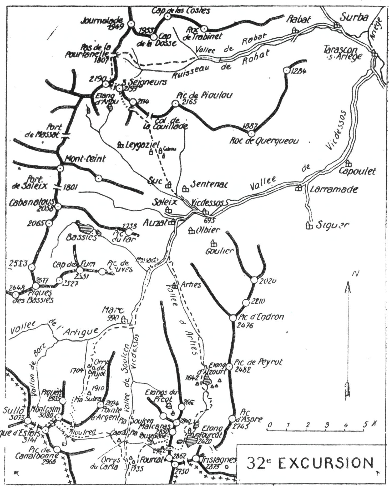

<style>.centre {text-align: center}</style>
<style>.droite {text-align: right}</style>

[//]: # (— p. 403 —)

# TRENTE-DEUXIÈME EXCURSION

(N° 23 de la 1re édition)

__Trois jours aux Environs d'Auzat.__

(2° Série)<br>
_B. E. — Du 15 Juillet au 15 Seplembre._

Cartes à emporter : Foix et Perles réunies.

__<u>AVIS AUX TOURISTES</u>__

Comme on a pu le constater par les 29me et 31me excursions,
Auzat est un admirable centre de tourisme pour la haute montagne. 
Tête de ligne d'un petit chemin de fer qui mène :
touriste à pied-d'œuvre, c'est le point de départ désigné pour
explorer toutes 1es montagnes comprises entre les ports de
Guillou et de Siguer.

Cinq vallées et plusieurs petits vallons convergent vers
Auzat, y ramenant le touriste et le laissant toujours au pied
de la montagne. C'est pour toutes ces raisons que je l'ai choisi
comme port d'attache pour les 32me, 33me et 34me excursions.

Pour faire l'ascension du Montcalm et des trois pointes de la
Pique d'Estats dans la même journée et dans les meilleures
conditions, il faut aller coucher en montagne, la veille, et s'y
faire accompagner par un guide. Les orrys de Pujol (1.704m)
sont le meilleur point de départ pour cette ascension.

On retiendra donc un guide à l'avance, et on arrivera à Auzat
dans la matinée pour avoir le temps de prendre les dernières
dispositions, et être prèt à partir vers treize heures.

<p class="droite">(Voir ci-contre la Carte de l'Excursion)</p>


****

****

## PREMIÈRE JOURNÉE

__D'AUZAT (710m) aux ORRYS de PUJOL (1.704m).__<br>
__par Marc d'Auzat (99m).__

—— GUIDE UTILE ——

__Conseils.__ — __Itin. recomm.__ — On emportera des vivres pour
quatre repas et les divers casse-croûte. Si on ne veut pas s'encombrer 
de la totalité pour lascension du Montcalm. on louera
un porteur pour le lendemain. avec mission de monter la moitié
des provisions aux orrys du Carla.

<div class="page"></div>

— p. 404 — aux ENVIRONS d'AUZAT (32me EXCURSION)

****



<div class="page"></div>

— p. 405 — (32me EXCURSION) MARC D'AUZAT

****

On partira vers 13 h. et on prendra, au S.-S.-O., le chemin
d'Espagne en suivant la route qui conduit au hameau de Ranet
(5 k.). Là, elle se transforme en un chemin de chars jusqu'à
Marc d'Auzat (990m), au confluent des vallées de l'Artigue et de
Soulcen. Laissant à g. le chemin qui monte, au S., vers cette
dernière, on tournera à dr., à l'O., pour franchir le pont près
de la coquette chapelle de Marc.

On montera ensuite à l'O., en laissant le vill. à dr., en haut.
On longera le torrent par la rive dr., on passera devant la
maison forestière, et on s'engagera dans la vallée de l'Artigue
par un bon chemin muletier. Environ 20 min. en amont de Marc,
on quittera le grand chemin du port de l'Artigue pour suivre,
à g.. un sentier qui monte pendant 1 h., direction S.-O. On se
dirigera enfin au S. et, après avoir franchi plusieurs lacets, on
aboutira aux orrys de Pujol où on couchera.

Il y a là plusieurs orrys très convenables, et les bergers qui
les habitent sont très complaisants. Pour une petite rémunération, 
ils cèdent les meilleures places.

__Horaire de la Journée :__

``` 
D'Auzat aux Orrys de Pujol, 4 h. environ.
```
 
## DEUXIÈME JOURNÉE

__Des ORRYS de PUJOL (1.704m) aux ORRYS du CARLA (1.735m),__<br>
__par le Montcalm (3.080m),__<br>
__la Pique d'Estats (3.141m), la Combe de Rioufred__<br>
__et le Pla Soulcem.__

—— GUIDE INDISPENSABLE ——

__Conseils.__ — __Itin. recomm.__ — On partira de très bonne heure
et on suivra, direction S., le sentier qui mène au Pla Subra
(1.910m). Là, la vallée finit en forme de cirque et on se heurte
aux premières terrasses qu'il faut escalader pour atteindre le
Montcalm. On tournera à dr., à l'O., et après avoir franchi le
torrent, on trouvera un petit sentier qui, en deux lacets, grimpe
jusqu'à la première terrasse. Reprenant alors la direction S., on
suivra des corniches faciles qui longent la base de la face E. de
la Piquéto et qui grimpent jusqu'aux clots du plateau supérieur
où se trouve le lac glacé de Montcalm.

<div class="page"></div>

— p. 406 — MONTCALM — PIQUE D'ESTATS  (32me EXCURSION)

****

A Partir du plateau des clots, on peut suivre deux voies différentes :
la plus courte monte à l'O., vers une cheminée rapide
qu'on-nomme « Canaléto » et par laquelle on arrive directement
au sommet. Cette cheminée est enneigée souvent jusqu'au 15 août;
de plus, elle est garnie d'éboulis mouvants et de rocs instables
qui en rendent l'ascension dangereuse à une nombreuse caravane.

Comme ces difficultés pourraient être un obstacle, j'indique
l'itinéraire classique comme étant de tout repos. Au débouché
de la « Canaléto », On tournera à g., au S.-E., et on s'élèvera à
flanc de montagne par le haut d'un névé, afin d'aboutir sur des
corniches faciles qui dominent le lac au S. Environ 1/2 h. après,
on atteindra la, crête vers 2.800 d'alt. et on, découvrira subitement 
devant soi la combe de Rioufred qui, ordinairement, a un
aspect polaire.

Le point de vue est déjà splendide. Vers le S., on aperçoit tous
les grands sommets et presque tous les ports de la haute vallée
de Soulcen et l'œil peut suivre les sinuosités capricieuses de la
chaîne frontière, de la Pique d'Estats au pic de Rialp

De ce point, on découvre toute la voie d'ascension jusqu'au
Montcalm et on peut, selon la quantité et l'état de la neige, en
préciser l'itinéraire. On passera sur le versant de Rioufred et on
s'élèvera en écharpe pour arriver au sommet par la face S.-E.

La particularité du sommet du Montcalm est sa grande surface; 
il est, en effet, le plus vaste des Pyrénées, car on pourrait
y faire manœuvrer une compagnie d'infanterie. C'est, sans doute,
pour cette raison que les gens du pays l'appellent « La Plaine ».
Bien que le panorama du Montcalm soit magnifique, il vaut
mieux consacrer plus de temps à la Pique d'Estats, d'où la vue
est beaucoup plus belle et plus étendue. On descendra donc, au
S.-O., au Col de Rioufred (2.985m) où on laissera le sac, et on
montera directement à la pointe centrale de la Pique d'Estats
(3.141m).

C'est l'un des plus beaux belvédères des Pyrénées; il s'étend
du Posets au Canigou. Tous les grands pics de la chaîne, entre
ces deux sommets, sont sous les yeux. Bien qu'à plus de 60 K.,
les Monts-Maudits font un effet grandiose.

Pour jouir d'un panorama complet sur les abords immédiats,
il faut faire les trois pointes. La pointe S.-E. (3.011m), surmontée
d'une jolie tourelle, est un peu délicate; seuls, les pyrénéistes
exercés en feront l'ascension à toute crête et reviendront à la

<div class="page"></div>

— p. 407 — (32me EXCURSION) Le PLA SOULCEN

****

pointe centrale. On passera ensuite facilement à la pointe N.-O.
(3.100m).

C'est entre cette dernière et le pic de Sullo (3.073m) qu'est
entaillé l'étroit passage qui fait communiquer la vallée française
de l'Artigue avec la vallée espagnole de Cardos. Ce port très
élevé (2.894m) et très difficile à franchir est appelé « Port
d'Estats » par les Français et « Port de Sullo » par les Espagnols.

De la pointe N.-O., on reviendra directement au Col de Rioufred 
d'où on descendra, au S.-E., à la combe de ce nom. Ordinairement, 
le couloir qui part du col est garni d'une neige propice 
à une longue glissade; on peut s'y lancer sans crainte, car
le terrain du fond est des plus commodes. Après la glissade, on
longera le torrent par la rive g. d'abord, puis, pendant quelques
min., par la rive dr. En amont du lac de Rioufred, on passera
définitivement rive g.

C'est de ce point qu'il faut se retourner pour admirer, s'estompant 
sur le ciel, la fine dentelure de la crête d'Estats.

A partir de là, où trouve un sentier qui descend directement
au Pla Soulcen en longeant le Rioufred par la rive g. Vers le
bas, on domine subitement le fond de la vallée de Soulcen et
le sentier décrit plusieurs lacets pour franchir ce grand ressaut.
Parvenu aux premières pelouses du Pla Soulcen, on tournera
à dr.. au S.-E., pour franchir le Rioufred et aboutir près de
l'orry du Cap du Pla. Là, on trouve un sentier qui remonte la
rive g. du Vicdessos et qui conduit directement aux orrys du
Carla où on couchera.

Les orrys du Carla sont situés à 1.735 d'alt., sur la rive dr.
de la vallée. Adossés à flanc de montagne et bien protégés contre
les vents, on jouit dans leur intérieur d'une température idéale
sans s'enfumer. Le meilleur des orrys est celui de l'ancien berger
Pampaline qui accordait si aimablement l'hospitalité.

__Horaire de la Journée :__

``` 
D'Auzat aux Orrys de Pujol, 4 h. environ.        }
Des Orrys de Pujol au Montcalm............ 4h.30 }
Du Montcalm à la Pique d'Estats........... 0h.45 }   10h. »
De la pointe Centrale à la pointe S.-E. et       }
  retour ..................................0h.50 } (Arrêts en sus).
De la pointe Centrale à la pointe N.-O.... 0h.10 }
De la Pique d'Estats aux Orrys du Carla... 3h.45 }
```

<div class="page"></div>

— p. 408 — ORRY du CARLA — MALCARAS  (32me EXCURSION)

****

## TROISIÈME JOURNÉE

__Des ORRYS du CARLA (1.735m) à AUZAT (740m),__<br>
__par le Pic de Malcaras (2.850m), l'Etang Fourcat (2.420m).__<br>
__l'Etang d'Izourt (1.642m) et la Vallée d'Arties.__

—— GUIDE UTILE ——

__Conseils.__ — __Itin. recomm.__ — En amont, quelques min. au S.
des orrys du Carla, se détache, à g., un sentier qui monte à l'E.
et qui, après de nombreux lacets, prend la direction N.-E. pour
aboutir aux orrys de Pauseplane. On les suivra jusqu'à l'orry
supérieur qui est situé, vers 2.000 d'alt, sur un rond-point de
verdure où paissent de nombreux moutons. Là, on prendra définitivement 
la direction E. pour suivre un étroit vallon qui
grimpe jusqu'au petit lac glacé de Pauseplane ne figurant sur
aucune carte. Ce lac est au pied du col coté 2.742 m., col situé
au N. du grand pic de l'Etang Fourcat (2. 862m) et au S. du pic
de Malcaras (2.850m).

Au début, on trouve un petit sentier qui remonte le vallon
par la rive dr., mais qui disparaît bientôt dans la pierraille.

A partir de là, le terrain s'améliore et on peut monter à l'aise
par le creux du vallon. Dès qu'on apercevra le petit lac, on
obliquera à g., au N.-E. afin de rejoindre la crête au N. du
Col 2.742 où on déposera le sac. On éprouvera là une des plus
agréables surprises que puisse réserver la montagne et que
j'appellerai le clou de la journée. On découvre subitement l'immense 
cuvette du cirque du Fourcat, et son grand étang parait,
presque sous soi, dans toute sa splendeur. L'œil fait instinctivement 
le tour du cirque par les crêtes, puis par le fond où
s'étale la masse noire et trapue du refuge sur un grand promontoire 
rocheux. Ce site est splendide.

De ce point, on apercevra, droit au N., la petite tourelle du
sommet que les cartes cotent 2.850 m.; une crête facile y conduit 
dans 20 min. Ce sommet est appelé pic de Pauseplane par
les bergers de la vallée de Soulcen, et pic de Malcaras par ceux
de la vallée d'Arties. J'ai adopté ce dernier nom parce qu'il
correspond mieux à sa forme accidentée.

Le Malcaras comprend deux pointes très rapprochées; c'est
sur celle du S., sommet principal, qu'est bâtie la tourelle.

<div class="page"></div>

— p. 409 — (32me EXCURSION) CIRQUE du FOURCAT

****

Le cirque du Fourcat est dominé par trois magnifiques belvédères : 
le Tristagnes (2.879m), au S.-E.; le Grand Fourcat
(2.862m), au S.-O., et enfin, le Malcaras (2.850m), à l'O. Des trois
sommets, c'est ce dernier qui est le plus facile. Sans un pas de
3m. de haut sur un rocher en escalier et à 2 min. de la tourelle, 
on y ferait monter un mulet. C'est cependant le plus impressionnant 
des trois, car, sauf sur la face S., il est entouré de
profonds abîmes, surtout sur le petit étang de la Oussade qui
baigne la base de ses murailles E.

Le belvédère du Malcaras est de premier ordre, car, dans
toutes les directions, rien ne gêne sa vue sur les montagnes
ariégeoises. On domine de 400m. tout le cirque du Fourcat et
son magnifique étang. Le refuge paraît sous les pieds.

En 10 min., par une crête délicate, un pyrénéiste très exercé
et amateur de fortes émotions peut faire la terrifiante pointe N.
qui est en contrebas d'une dizaine de m. La vue y est inférieure
à celle du sommet principal, mais ce trajet prouvera qu'il existe
en Ariège des points qui ne sont accessibles qu'à de bons rochassiers. 
C'est de cette pointe que se détache, vers l'O., l'arête conduisant 
au sommet secondaire que les cartes cotent par erreur
2.904m., alors qu'il ne dépasse pas 2.750m. Pour les bergers de
Soulcen, c'est ce sommet qui est le vrai Malcaras.

Comme on ne peut aller plus loin que la pointe N., on reviendra 
au sommet principal pour redescendre ensuite au Col 2.742.
par où on dévalera, à l'E., au cirque du Fourcat. Au bas du
ravin, on trouve un sentier qui tourne à g. vers le déversoir de
l'étang de la Oussade qu'il faut franchir. On longera ainsi le
grand Etang Fourcat par l'O., à une certaine hauteur, en se
dirigeant vers le refuge. Bientôt, on rejoindra le chemin qui
monte d'Auzat vers ce dernier. On ira reconnaître au passage
sa situation et son état.

Un coup d'oeil circulaire sur le cirque splendide du Fourcat
fera jouir d'un joli point de vue sur toutes les crêtes qui le
couronnent, sur son lac magnifique et enfin, vers le N.. sur le
petit Etang Fourcat qu'on domine à pic de plus de 100 m.

La vallée d'Arties prolongée jusqu'au cirque du Fourcat est
l'une des plus coquettes de l'Ariège, avec ses aspects variés et
les sites splendides qu'on y rencontre. Prise par en haut, elle
devient un enchantement, car on jouit bien mieux de ses beautés
quand on les voit défiler sans fatigue.

<div class="page"></div>

— p. 410 — VALLEE D'ARTIES (32me EXCURSION)

****

Grâce au bon-chemin muletier que l'usine d'Auzat a fait construire 
jusqu'à l'Etang Fourcat, on redescend tout à fait à l'aise
et en toute sécurité. Repartant du refuge direction O., on tourne,
5 min. après, au N. pour longer la rive g. du petit étang, puis,
on franchit un ressaut. C'est ensuite une succession de nombreux
lacets qui contournent d'autres ressauts pour aboutir à la petite
jasse de la Chaudière (1).

Là, le sentier fait un crochet vers l'E. et, après avoir sauté
le torrent du Fourcat et passé devant un orry, va rejoindre celui
qui descend du port de l'Arbeille. Il reprend à nouveau la direction 
N. et, par une descente rapide en quelques lacets réguliers,
aboutit en amont de l'Etang d'Izourt (1.642m).

On arrive là dans un petit cirque entouré de hautes montagnes, 
mais avec des alentours plus verdoyants qu'au Fourcat,
car l'étang est entouré de beaux pâturages où paissent de nombreux 
troupeaux. Au S.-E. et au S.-O. de l'étang, il y a plusieurs
orrys où-on peut coucher.

Le chemin principal (il y a aussi un sentier sur la rive dr.),
longe l'étang par la rive O. en en franchissant une partie sur
une digue en pierres; il passe ensuite pour quelques min. sur
la rive dr., au déversoir, et revient sur la rive g. jusqu'à la
cuvette de l'ancien lac de Pradières. A partir de là, on longe
la base des contreforts O. du pic d'Endron par la rive dr. du
torrent; on traverse le hameau d'Arties et enfin, on rejoint la
route du départ à 2 k. 500 d'Auzat.

En fermant là cette boucle, on aura visité trois grandes vallées
et trois vallons, ascensionné cinq sommets magnifiques et contemplé 
une des plus curieuses régions de la chaîne pyrénéenne.

__Horaire de la Journée :__

``` 
Des Orrys du Carla au Malcaras........... 3h.30 }   8h. »
Du Malcaras au refuge de l'Etang Fourcat. 1h.20 } (Arrêts en sus)
Du refuge du Fourcat à Auzat............. 3h.10 }
```

> Nota. - En descendant, on aura soin de repérer tous les
points de couchage en vue des prochaines excursions. 1° Le
refuge du Fourcat, au cas où on obtiendrait, du directeur de
l'usine, l'autorisation d'y coucher; 2° l'orry situé sur la rive g.
du petit étang, s'il existe encore; 3° l'orry de la « Chaudière »;
4° enfin, les orrys d'Izourt.

———<br>
(1) Le mot la « Claudière » n'a aucun sens pour le lieu que les
cartes désignent. Les gens du pays disent la « Caoudèro », c'est-à-dire
« La Chaudière ».

[p393 à 402](guide-soubiron-393-402.md) - [Sommaire](../README.md) - [p411 à 422](guide-soubiron-411-422.md)