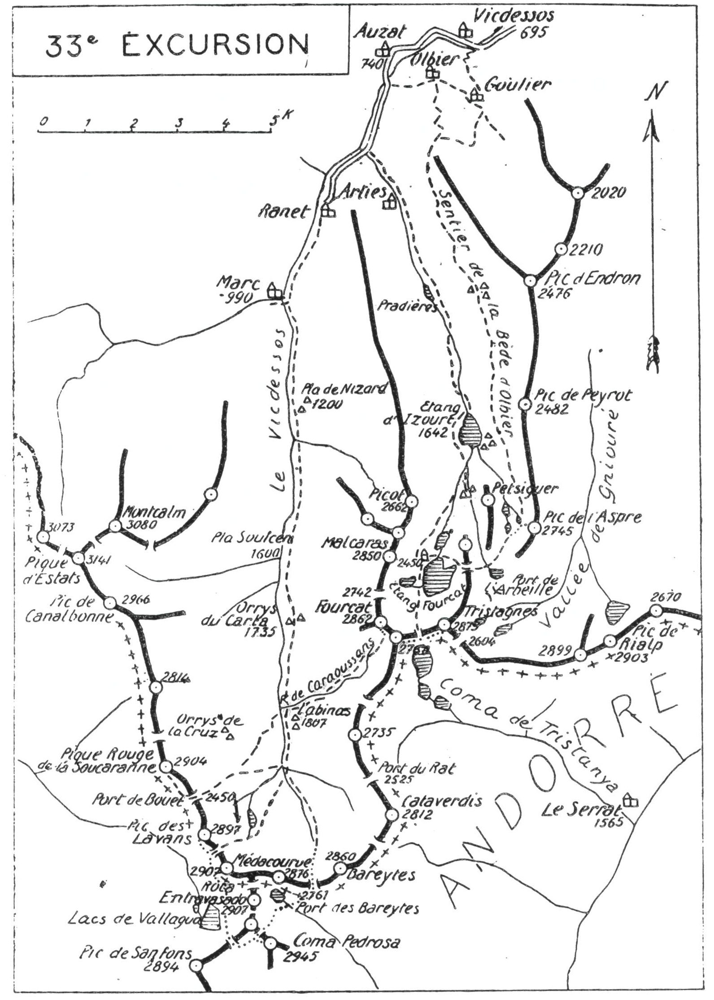

<style>.centre {text-align: center}</style>
<style>.droite {text-align: right}</style>

-----------------------
[//]: # (— p. 411 —)

# TRENTE-TROISIÈME EXCURSION

(No 24 de la 1re édition)

__Quatre jours au départ d'Auzat__

_B. E. — Du 15 Juillet au 15 Septembre._

Cartes à emporter : Foix et Perles réunies

__En HAUTE ARIÈGE, en CATALOGNE__<br>
__et en ANDORRE,__<br>
__par la Vallée de Soulcen, la Pique Rouge de la Soucaranne__<br>
__la Coma Pedrosa, le Port de Médacourbe,__<br>
__le Pic des Lavans, les Pics de l'Etang Fourcat,__<br>
__le Tristagnes et le Pic de l'Aspre.__
 
<u>__AVIS AUX TOURISTES__</u>

On demandera à M. le Directeur des usines d'Auzat l'autorisation 
de coucher au refuge de l'Etang Fourcat, et on arrivera
assez tôt à Auzat, la veille du départ. pour s'en faire remettre
les clés.

Un guide, qui cest indispensable pour la deuxième journée
me paraît utile pour toute l'excursion et on fera bien de le
retenir à l'avance. Dès son arrivée à Auzat, on louera un âne
ou un mulet pour faire monter à l'Orry du Labinas (1.807m)
les vivres de trois jours et demi qu'il faut emporter.

<p class="droite">(Voir ci-contre la Carte de l'Excursion).</p>

<div class="page"/>

— p. 412 — VALLEE de SOULCEN (33me EXCURSION)
****

 

<div class="page"/>

— p. 413 — (33me EXCURSION) PORT de BOUET
****

## PREMIÈRE JOURNÉE

__D'AUZAT (740m) à l'ORRY du LABINAS (1.807m),__<br>
__par la Vallée de Soulcen,__<br>
__et ascension de la Pique Rouge de la Soucaranne (2.904m),__<br>
__par le Port de Bouet (2.450m).__

__Conseils.__ — __Itin. recomm.__ — On prendra au S. d'Auzat la
route d'Espagne qui arrive jusqu'à Ranet, et on continuera par
le chemin de chars jusqu'au vill. de Marc (V. 32° E., p. 405) qu'on
laissera à dr. pour poursuivre devant soi, direction S. On entrera
alors dans la vallée de Soulcen qu'un sentier muletier remonte
jusqu'au port de Bouet (2.450m) où on passe en Espagne.

La vallée de Soulcen, si attrayante par ses naturelles beautés,
est, en outre, l'une des plus riches de l'Ariège en abondants pâturages. 
Ses quatre ressauts qui forment le Pla de Nisard (1.200m),
le Pla de Soulcen (1.600m), le Pla du Carla (1.735m), et le Pla
de la Cruz (1.850m) sont d'admirables cirques verdoyants où
paissent de nombreux troupeaux.

Le chemin, très bien tracé, monte régulièrement par la rive dr.
de la vallée jusqu'au Pla de la Cruz, sauf en amont des Orrys
du Carla où il passe pour quelques min. rive g. On arrive enfin
à l'entrée du cirque qu'on nomme Pla de la Cruz, autour duquel
on trouve une dizaine d'orrys. Le plus commode est celui de
Labinas qui est situé à l'entrée du cirque, à 1.807 d'alt., tout près,
et sur la rive g. du ruisseau de Caraoussans. C'est aussi le premier 
qu'on trouve en arrivant à l'entrée du grand cirque de
la Cruz.

Là, on est dans un site curieux qui, par sa forme, est unique
dans les Pyrénées. Sauf au N., on est entouré de la crête frontière 
qu'on a à dr., à g. et devant soi. Une pointe de la terre de
France, large de 5 k., s'avance comme un éperon vers le S. sur
1 K. de profondeur, pour séparer la Catalogne, qu'elle laisse à
l'O. de l'Andorre, qui est à l'E. Ce sont quelques sommets de ce
fer à cheval frontière que nous allons ascendre en commençant
par la Pique rouge de la Soucaranne.

<div class="page"/>

— p. 414 — PIQUE ROUGE de La SOUCARANNE (33me EXCURSION)
****

On déjeunera au Labinas et, après avoir déposé ses bagages
à l'Orry, on repartira, sans sac, avec un casse-croûte dans sa
poche.

Pour monter au port de Bouet, on suivra la rive dr. jusqu'au
pont de las Bareytes qu'on franchira. Cela permettra de reconnaître 
au passage une partie de l'ascenston du lendemain matin.
Après le pont, les sentiers des deux rives se fondent en un chemin 
qui, en lacets réguliers, monte, à l'O., au port de Bouet
(2.450m). On s'arrêtera peu au col pour grimper immédiatement
à la Soucaranne qui le domine à 1 k. au N.-O. et dont l'ascension 
est des plus faciles.

Du port, on montera au N.-O. à flanc S. de crête, car il faut
rester sur le versant espagnol jusqu'au sommet. Bientôt on apercevra 
une corniche de verdure qui précède un petit col situé
sur un contrefort, vers 2.650 d'alt.; c'est par là qu'est le meilleur
chemin. Parvenu au petit col, on découvre le sommet tout en
haut, au N.; on n'aura qu'à y monter tout droit.

La Pique Rouge de la Soucaranne (2.904m) est l'un des plus
beaux belvédères de la chaîne frontière. Son panorama s'étend
du Posets au Canigou. Comme à la Pique d'Estats, les Monts-
Maudits paraissent dans toute leur splendeur. Les environs immédiats 
sont de toute beauté. Au S.-O., se profile, tout près, la Sierra
de Montech avec, en face, le pic de ce nom de mème alt. que
la Soucaranne; à ses pieds, les sombres profondeurs du Val
Ferrera qui s'enfoncent vers Areo; au S. les cinq lacs de
Vallagua dominés par les pics de ce nom, le pic de Sanfons et,
en arrière-plan, la Coma Pedrosa.

On pourra repérer, pour le lendemain, la descente de la crête
de Vallagua vers le couloir qui monte au port de Médacourbe.
Au N.-E. et presque sous les pieds, brillent les étangs de la Soucaranne 
et de Roumazet. Enfin, plus loin, l'œil prend en enfilade,
tout le vallon de Caraoussans par lequel on montera, le surlendemain, 
vers les pics de l'Etang Fourcat. Bien peu de sommets
offrent un pareil point de vue dvec une si grande facilité d'ascension.

On redescendra par le même chemin jusqu'en face du pont de
las Bareytes; là, on prendra le sentier de la rive g. qui passe
devant plusieurs orrys et qui continue à travers les pelouses.
Parvenu à environ 10 min. de l'orry du Labinas, on franchira

<div class="page"/>

— p. 415 — (33me EXCURSION) PORT DE LAS BAREYTES
****

le torrent sur deux rochers qui se font face et sont assez rapprochés 
pour constituer un passage idéal qu'on appelle le Pountet.

__Horaire de la Journée :__

``` 
D'Auzat à l'Orry du Labinas............. 5h. » }
De l'Orry du Labinas au Port de Bouet... 2h.10 }    10h.45
Du Port de Bouet à la Soucaranne........ 1h.20 }  (Arrêts en sus)
De la Soucaranne à l'Orry du Labinas.... 2h.15 }
```

## DEUXIÈME JOURNÉE

__Ascension de la Coma Pedrosa (2.945m),__<br>
__par le Port de las Bareytes (2.761m) et du Pic des Lavans (2.897m),__<br>
__par le Port de Médacourbe (2.750m ?).__

—— GUIDE INDISPENSABLE ——

__Conseils.__ — __Itin. recomm.__ — On partira par la rive dr. du Vicdessos 
en suivant le chemin du port de Bouet pendant 1/2 h.
environ. Après avoir franchi le torrent de las Bareytes, on trouve
un sentier qui le remonte par la rive g.; c'est celui du port de
ce nom qui domine le vallon en haut, au S.

Jusque vers 2.400 d'alt., le sentier est assez bien tracé et facile
à suivre; mais, lorsqu'on arrive au pied du ressaut supérieur,
les traces disparaissent en partie. Dans le haut du vallon, on
fera un long crochet vers l'E., afin de contourner par la g. une
muraille à pic. Un lacet à dr. mènera au haut de la muraille
formant le seuil du dernier bassin que, d'en bas, on prend pour
le port. De ce point, on apercevra en haut, à dr, le vrai port
de las Bareytes (2.761m) situé à l'E. du pic de Recoufret (2.876m)
par lequel on communique avec l'Andorre.

Au port, l'œil est tout de suite attiré vers le S.-O. par la cime
trapue de la Roca Entravesado (2.927m) qui s'élève tout près.
de l'autre côté du vallon, et que surmonte une belle tourelle.
Sa face N. est une muraille presque verticale sur un large col
situé à la limite de la Catalogne et de l'Andorre, col qui fait
communiquer le Val Ferrera avec la vallée d'Arinsal. La Coma

<div class="page"/>

— p. 416 — COMA PEDROSA (33me EXCURSION)
****

Pedrosa, plus au S., est en partie masquée par un contrefort de
la Roca Entravesado.

Comme son nom l'indique, la Roca Entravesado (roche mise
en travers) coupe net un chaînon qui monte du S. au N. vers
la frontière, créant ainsi un large col qui empêche sa soudure
avec la grande chaîne. C'est ce chaînon qui sépare la Catalogne
de l'Andorre.

Du port, on descendra au S., vers la vallée d'Arinsal, en laissant 
un petit lac à dr., puis, on contournera le contrefort S.-E.
de la Roca Entravesado, pour aboutir, derrière celui-ci, à un
petit vallon pierreux. On remontera ensuite ce vallon de l'E. à
l'O. et, parvenu à mi-hauteur, on continuera l'ascension en
écharpe par le versant N. de la Coma Pedrosa, afin d'atteindre
un petit col situé entre celle-ci et le Pic de Vallagua (2.879m),
au N.-O. On n'aura alors qu'à grimper à toute crête à l'E. pour
arriver en 1/4 d'h. au sommet de la Coma Pedrosa, près de la
grande tour carrée (2.945m), Ce sommet est le point culminant
de l'Andorre.

Le belvédère de la Coma Pedrosa est de tout premier ordre
et son panorama est immense. Vers l'E., on a toute l'Andorre
sous les yeux et on en domine tous les sommets. La vue s'étend
jusqu'aux cimes des Pyrénées orientales. Vers le N. et vers l'O.
l'œil suit la grande chaîne jusqu'aux cimes luchonnaises et les
Monts-Maudits. Les deux Monts Rouch paraissent tout près avec
leurs flancs zébrés de couloirs neigeux.

Si, de l'Estanyo, on aperçoit mieux les vallées et les vill.
andorrans, en revanche, la vue de la Coma Pedrosa est bien
supérieure vers l'O.

On descendra au S.-O. vers le lac glacé de Coma Pedrosa qu'on
laissera à g. pour tourner à dr., au N.-O., et aboutir à un petit
col situé au S. du Pic de Vallagua (2.879m). En franchissant cette
crête, on passera de l'Andorre dans la Catalogne, au Val Ferrera,
et on reverra, les lacs aperçus la veille depuis la Soucaranne.
Après une descente de quelques min. vers l'O., on obliquera carrément 
à dr., au N., et on poursuivra sa marche à flanc de montagne 
en laissant les grands lacs de Vallagua en bas, à g. On
coupera deux petits couloirs et le contrefort S.-O. de la Roca
Entravesado, et, après une marche presque horizontale de 1h.30,
on aboutira au pied du vallon pierreux qui monte au Port de

<div class="page"/>

— p. 417 — (33me EXCURSION) PIC des LAVANS
****

Médacourbe (2.750m) où on déposera le sac. Ce port est situé
entre le Pic de Médacourbe (2.907m) au S.-E., et le Pic des Lavans,
au N.-O. C'est une large brèche coupée en deux dans son centre
par un morne rocheux qui forme ainsi deux petits cols.

Dans 45 min., aller et retour, on fera l'ascension du Pic des
Lavans (2.897m) surmonté d'une tourelle. C'est un des plus jolis
belvédères de la région et le mieux situé pour une vue d'ensemble 
sur les abords immédiats. Sauf vers le Port de Médacourbe,
il est entouré de toutes parts d'impressionnants à-pic.

La descente vers le Lac de Médacourbe est des plus faciles par
l'un des deux petits cols du port frontière. C'est, d'abord, un
ravin d'éboulis, puis un flanc de pâturages qui s'incline vers le
lac, en amont duquel on trouve un sentier qui le contourne. On
suivra ce dernier par la dr., afin d'aboutir à un col qui le
domine, à l'E., d'environ 50 m. C'est de ce point qu'il paraît
dans toute sa beauté. Suspendu à flanc de montagne comme un
énorme bénitier, ce lac de haute alt. est une petite merveille.
A partir du col, le sentier descend au N.-E. en lacets réguliers
pour aller rejoindre le chemin de las Bareytes, à 3/4 d'h. de
l'Orry du Labinas où on recouchera.

__Horaire de la Journée :__

``` 
De l'Orry du Labinas au Port de las Ba-            }
  reytes.................................... 3h.   }
Du Port de las Bareytes à la Coma Pedrosa... 2h.15 }
De la Coma Pedrosa au Port de Méda-                }   10h. » 
  courbe ................................... 2h. » } (Arrêts en sus).
Du Port au Pic des Lavans (aller et retour). 0h.45 }
Du Port de Médacourbe à l'Orry du Labi-            }
  nas ...................................... 2h. » }
``` 

> Nota. - On sera peut-être surpris que je ne fasse pas ascensionner 
le Médacourbe au lieu du Lavans. Ce dernier est bien
supérieur comme belvédère, et la grande muraille du Médacourbe 
n'est réellement intéressante que vue du N. surtout
du fond de la vallée.

La journée déjà chargée ne permettrait d'y ajouter ce sommet
qu'en faisant la tournée entière avec vitesse. Si on dispose de
1h.30, on peut y monter sans sac, depuis le port, en grimpant
par la cheminée rapide qui conduit à un col situé à 10 min. du
point culminant. Personnellement, j'ai regretté cette ascension
peu intéressante du Médacourbe, parce qu'elle m'a obligé à
écourter mon séjour sur les autres sommets.

<div class="page"/>

— p. 418 — VALLON de CARAOUSSANS (33me EXCURSION)
****

## TROISIÈME JOURNÉE

__De l'ORRY du LABINAS (1.807m)__<br>
__au REFUGE de l'ETANG FOURCAT (2. 450m),__<br>
__par le Vallon de Caraoussans,__<br>
__les Pics de l'Etang Fourcat (2.862-2.750m) ;__<br>
__et le Pic de Tristagnes (2.879m).__

—— GUIDE UTILE ——

__Conseils.__ — __Itin. recomm.__ — Immédiatement au-dessus de
l'orry, on trouve un sentier qui monte à l'E. par la rive g. du
ruisseau de Caraoussans et qui, en de nombreux et rapides lacets,
fait franchir le ressaut qui mène au cirque supérieur. On suivra
lentement ce sentier dans la ligne de grande pente, et on accélérera 
la marche lorsqu'il pénètre dans la gorge en franchissant
le torrent. Quelques min. après, on aboutit à l'entrée du vallon
de Caraoussans et on passe devant les premiers orrys. Là, on
laissera à dr. le sentier qui monte à l'E., au Port de Caraoussans
et on franchira le ruisseau principal en faisant un crochet à g.
C'est l'endroit où, d'ordinaire, se trouvent les bergers dont les
troupeaux sont aux environs.

A partir de là, le sentier prend la direction N.-E. qu'on ne
quittera plus jusqu'à la crête du Fourcat. On longe bientôt un
lac par la g., puis un second par la dr.; on grimpe un nouveau
gradin au-dessus duquel on découvre un nouveau bassin lacustre
dominé, à l'E., par la crête frontière et au N.-E., par les deux
pics de l'Etang Fourcat. Le sentier disparaît et il faut alors
s'élever par la g. à flanc de montagne, afin d'aboutir à la dépression 
qui sépare les deux Fourcat.

Cette ascension est pleine de charme, tout en étant très facile.
A mesure qu'on monte, on aperçoit successivement les douze
petits lacs du riant vallon de Caraoussans, et on découvre la magnifique 
région de Médacourbe. On peut monter à sa fantaisie,
car le meilleur terrain est celui qui conduit au large col situé
au N.-E. entre les deux Fourcat.

Parvenu à la crête, on ressentira la même impression qu'à
l'ascension du Malcaras (V. 32° E., p. 408), car on découvrira
subitement tout le cirque du Fourcat; on déposera là le sac.
Du col, on apercevra, à quelques 200 m. à l'E., la tourelle du pic
secondaire, 2.750 m. environ, et sur la g., au N.-O., la masse

<div class="page"/>

— p. 419 — (33me EXCURSION) GRAND FOURCAT et TRISTAGNES
****

hirsute du grand Fourcat (2.862m). On fera l'ascension de ce
dernier par la face S., en utilisant une petite-cheminée qui grimpe
droit au sommet. Cette ascension n'offre pas la moindre difficulté 
et, en suivant le flanc S. jusqu'à la petite cheminée, ou
atteint le sommet dans 20 min.

Comme le Malcaras, le Grand Fourcat (2.862m) est un belvédère
de premier ordre. Les deux points de vue sont analogues en ce
qui concerne les lointains; mais, pour les abords immédiats, la
vue du Fourcat est sensiblement supérieure. On aperçoit toutes
les cimes de la haute vallée de Soulcen et le lac de Médacourbe
apparait comme un sombre miroir. Quant à l'Etang Fourcat, il
est simplement splendide.

Le Grand Fourcat est en entier en France, tandis que le pic
secondaire est au point de jonction de la crête frontière.

Après avoir repris le sac, on suivra la (crête, à l'E., jusqu'au
Petit Fourcat où on ne fera que passer. Venant après le grand
sommet, celui-ci ne présente que l'intérêt de faire apercevoir, au
S.-E., les trois lacs de la Coma de Tristanya vers laquelle on
descendra pour passer en Andorre. Quelques min. plus loin, on
prendra la direction E. à flanc S. de crête, afin d'aboutir presque
horizontalement au Port du Fourcat situé sur la crête frontière,
vers 2.650 d'alt., entre le Petit Fourcat et le Tristagnes.

On laissera là son sac, car on y repassera en descendant du
Tristagnes. L'ascension de ce dernier sommet est des plus faciles
par ce côté. Du port, on monte à toute crête d'abord, puis, à
flanc S. pendant 1/4 d'h., et finalement, à toute crête jusqu'au
sommet.

Comme le Malcaras et le Grand Fourcat, le Tristagnes (ou TresEstanys) 
(2.879m) est un belvédère de premier ordre. Les lointains 
sont pareils, mais les abords immédiats sont bien différents.
Comme, au Tristagnes, on est dans l'axe de la vallée
d'Arties, on jouit sur elle d'une magnifique vue plongeante. Le
Rialp est à deux pas et, si on avance d'une cinquantaine de m.
sur la crête du contrefort N.-E., on arrive sur un terrifiant à-pic
de 500 m. On a sous ses pieds le petit bassin lacustre de Petsiguer, 
le Port et l'Etang de l'Arbeille; puis, légèrement à dr. les
deux petits étangs et le Port de l'Albelle (2.604m) situé sur la
frontière.

On pourra, de ce point, repérer l'itinéraire du lendemain.
depuis le vallon de l'Arbeille jusqu'aux étangs de Petsiguer.

<div class="page"/>

— p. 420 — ETANG FOURCAT  (33me EXCURSION)
****

On reviendra au port du Fourcat par la voie d'ascension et on
descendra droit au N. jusqu'au grand étang. On longera ce
dernier par la rive g. en suivant les traces d'un sentier qui,
1/4 d'h. après, remonte un ressaut rocheux en deux courts lacets.
En quelques min., on rejoindra le sentier régulier du plateau
de g. par lequel on est passé à la précédente excursion, en descendant 
du Malcaras (V. 32° E., p. 409). De ce point, 1/4 d'h.
suffit pour arriver au refuge du Fourcat (2.450m) où on couchera.

Comme on l'a remarqué à la précédente excursion, le refuge
du Fourcat est admirablement situé et on ne peut en rêver de
meilleur, dans un plus joli centre d'excursion, à pareille alt. Je
ne forme qu'un vœu : c'est que le C.A.F. en fasse l'acquisition.
si jamais on le vend, ou qu'il passe un baïl « In æternum », si
jamais on le loue.

__Horaire de la Journée :__

``` 
De l'Orry du Labinas au Grand Fourcat.. 4h. » }
Du Grand Fourcat au Petit Fourcat...... 0h.30 }
Du Petit Fourcat au Port du Fourcat.... 1h.15 }    8h.30
Du Port au Pic de Tristagnes (aller et re-    } (Arrêts en sus)
  tour) ..............................  1h.45 }
Du Port du Fourcat au Refuge........... 1h. » }
``` 

> Nota. - Si on n'a pu obtenir l'autorisation de coucher au
refuge du Fourcat, on descendra, dans 40 min. jusqu'à l'orry
de la Chaudière. Dans ce dernier cas, on montera directement
par le vallon de l'Arbeille le lendemain matin, afin de rejoindre 
l'itinéraire de la quatrième journée au col de Petsiguer.
Cela constituerait un supplément de marche d'environ 3/4 d'h.

## QUATRIÈME JOURNÉE

__De l'ETANG FOURCAT à VICDESSOS (695m),__<br>
__par le Pic de l'Aspre (2.745m), la Bède d'Olbier et Goulier.__

—— GUIDE UTILE ——

__Conseils.__ — __Itin. recomm.__ — On descendra, au S.-E. du refuge,
au barrage du lac pour franchir ensuite, vers l'E., la serre séparative 
des deux fourches qui ont donné à l'étang le nom de
Fourcat, c'est-à-dire « Fourchu ». Quelques min. après avoir

<div class="page"/>

— p. 421 — (33me EXCURSION) PIC DE L'ASPRE
****

dépassé l'extrémité de la fourche E., on aboutit à un petit col
qui débouche sur le vallon de l'Arbeille qu'on domine. Presque
en face, au N.-E. et de l'autre côté du vallon, s'ouvre un large
col. qui fait communiquer avec le petit bassin lacustre de Petsiguer, 
par lequel l'ascension de l'Aspre est des plus faciles. On
descendra vers le fond du vallon en décrivant un arc de cercle
par la dr., afin de perdre le moins d'alt. possible et on remontera, 
en face, au col de Petsiguer. Une petite descente en pente
douce mènera en 20 min. au bord du plus grand des étangs où
on pourra déposer le sac.

Comme de ce point l'ascension de l'Aspre se fait dans 1h.30
environ, on fera bien de casser la croûte aux étangs de Petsiguer
et de monter au pic sans sac, ce qui fera gagner 1/2 h. On
grimpera direction N.-E. d'abord, puis à toute crête, droit à l'E.
sur des pentes mi-gazonnées, très faciles. Dans la partie supérieure, 
on aborde le rocher en place par une arête presque
verticale qu'on escalade en s'aidant fortement des mains, mais
dont l'ascension est amusante. On aboutit immédiatement après
à un petit ravin d'éboulis qui monte directement à la crête, près
de la tourelle.

Le point culminant est environ 200 m. plus au S.; mais, comme
il ne domine le sommet N. que de 3 ou 4 m., et qu'il n'est pas
mieux situé, son ascension est sans intérêt, car c'est le même
point de vue.

Le panorama de l'Aspre, quoique limité aux cimes ariégeoises
et andorranes de la région, est de toute beauté. Sa situation un
peu en avant de la grande chaîne en fait un splendide belvédère,
vers le N., sur tous les sommets secondaires et jusqu'à la plaine.
De la route de Foix à Tarascon, aux environs de Saint-Paul, on
aperçoit l'Aspre qui pointe sa double cime vers le ciel et qui
paraît plus imposant que ses grands voisins, le Tristagnes et
le Rialp.

C'est du haut de l'Aspre qu'on aperçoit le mieux le bel Etang
du Rialp qui ne figure dans aucune carte.

On redescendra par la voie d'ascension et, après avoir repris
le sac, on franchira le déversoir de l'étang inférieur après lequel
on trouve le sentier de Petsiguer à la Bède d'Olbier. A peine
tracé dans la partie supérieure, il devient un bon chemin dès
qu'on arrive en vue de l'Etang d'Izourt.

<div class="page"/>

— p. 422 — BEDE d'OLBIER- GOULIER. (33me EXCURSION)
****

Je ne connais rien de plus pittoresque que le trajet de Petsiguer
au. vill de Goulier. Sur un parcours de plus de 12 k.; on a
construit à flanc de montagne un chemin suspendu qui forme
la plus belle corniche de haute alt. Si on l'avait tracé pour l'agrément 
du touriste, on n'aurait pas mieux réussi. Des étangs de
Petsiguer à la Bède d'Olbier (1), on longe à une grande hauteur
toute la vallée d'Arties qu'on domine constamment; toutes ses
beautés défilent l'une après l'autre, et c'est dans un ravissement
constant qu'on chemine jusqu'à l'extrême pointe du contrefort
N.-O. du Pic d'Endron, où on arrive à la Bède d'Olbier.

Parvenu à la forêt, le chemin tourne presque horizontalement
à l'E, et, dès qu'on en sort, on découvre subitement Goulier
devant soi. Un grand chemin de chars descend de Goulier à
Vicdessos.

> Nota. - Si on veut aller à Auzat et y revenir directement,
c'est à la Bède d'Olbier qu'il faut abandonner l'itinéraire ci-
dessus. On trouve là un sentier qui, en de nombreux lacets,
descend à Olbier, où on prendra le chemin qui va rejoindre la
route à Capounta.

__Horaire de la Journée :__

``` 
Du Refuge aux Etangs de Petsiguer........ 1h.30 }
Des Etangs au Pic de l'Aspre (aller et re-      }
  tour) ..................................2h.30 }   8h.15
Des Etangs de Petsiguer à Goulier........ 3h.30 } (Arrêts en sus)
De Goulier à Vicdessos................... 0h.45 }
``` 

<u>__POINTS D'INTERRUPTION__</u>

- __ORRY DU LABINAS__
  - Pour rejoindre d'Auzat : 5h.30
  - Pour rentrer à Auzat : 4h. »
- __REFUGE DU FOURCAT__
  - Pour rejoindre d'Auzat : 5h. »
  - Pour rentrer à Auzat : 3h.30

———<br>
(1)  Le mot « Bède » est synonyme de forêt.
