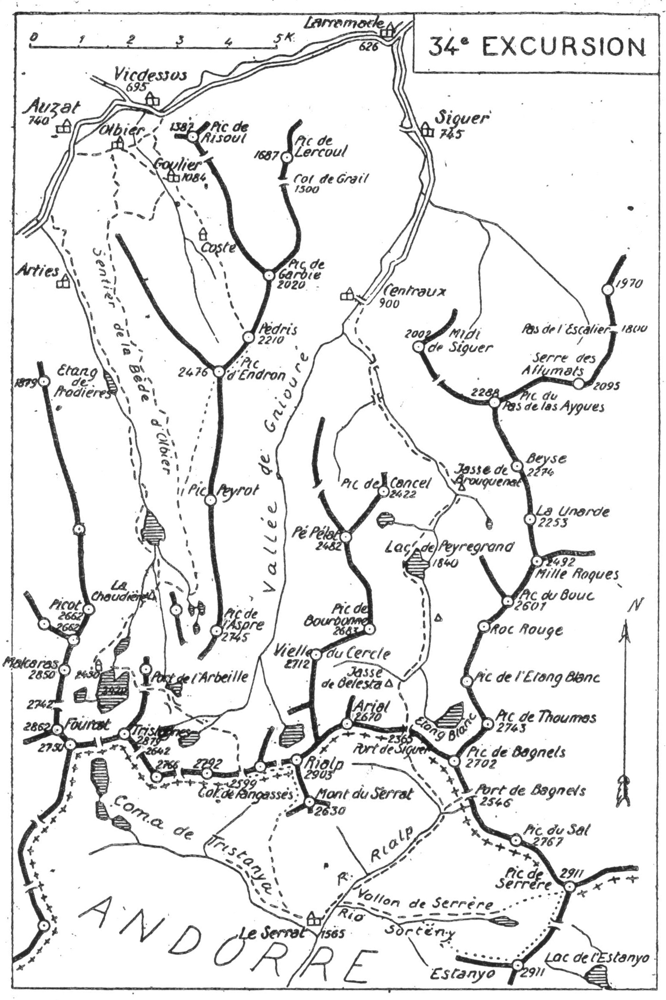

<style>.centre {text-align: center}</style>
<style>.droite {text-align: right}</style>

[//]: # (— p. 423 —)

# TRENTE-QUATRIÈME EXCURSION

(No 25 de la 1re édition)

__Quatre jours au départ d'Auzat__

_B. E. — Du 15 Juillet au 15 Septembre._

Cartes à emporter : Foix et Perles réunies.

__D'AUZAT à SIGUER (1),__<br>
__par le Pic d'Endron, l'Etang Fourcat, le Pic de Rialp,__<br>
__l'Estanyo, le Pic de Serrère, le Port de Siguer,__<br>
__le Lac de Peyregrand et la Gorge de Brouquenat.__

<u>__AVIS AUX TOURISTES__</u>

Pour cette excursion, un guide peut être utile, si on n'a pas
l'habitude de la montagne, mais un porteur est indispensable
pour les quatre jours. Il faut, en effet, prendre des provisions
pour trois jours et demi, car, au Serrat, on ne trouve ordinairement
que du lait. Le seul jour où le guide peut rendre de
bons services, c'est le troisième pour l'ascension de l'Estanyo et
du Serrère; or, les guides d'Auzat ne connaissent pas ces montagnes. 
C'est au Serrat qu'il faudrait en louer un pour faire ces
deux sommets.

Comme à la précédente excursion, on demandera à M. le
Directeur de l'usine d'Auzat l'autorisation de coucher au Refuge
du Fourcat et on s'en fera remettre les clés. Le porteur y
montera directement avec les provisions de trois jours et y
attendra la caravane.

Ne pas oublier les bougies.

<p class="droite">(Voir ci-contre la Carte de l'Excursion.)</p>

———<br>
(1) Siguer (Ariège), 650 hab. c. de Vicdessos, à 2 k. 500 de la station
de Larramade, ligne de Tarascon à Auzat. Postes et télégraphes.

<div class="page"/>

— p. 424 —



<div class="page"/>

— p. 425 — (34me EXCURSION) PIC PEDRIS - PIC D'ENDRON

****

## PREMIÈRE JOURNÉE

__D'AUZAT (740m) à l'ETANG FOURCAT (2.450m),__<br>
__par Goulier, le Pic Pédris (2.210m), le Pic d'Endron (2. 476m)__<br>
__et la Haute Vallée d'Arties.__

—— GUIDE UTILE ——

__Conseils.__ — __Itin. recomm.__ — On partira de très bonne heure
par la route d'Espagne et, à 10 min. d'Auzat, après le pont de
Capounta, on la quittera pour prendre, à g., le chemin qui, par
Olbier, conduit à Goulier (V. 33° E., p. 422). En haut du vill:, on
suivra celui qui monte au S.-E. vers Coste et qui aboutit 1 h. après
devant un refuge ouvert situé au milieu d'une prairie. De ce
point, on aperçoit, tout en haut, la tourelle du Pic Pédris (2.210m)
vers lequel il faut se diriger, car il est situé sur la crête qui conduit
au Pic d'Endron.

A partir de là, plusieurs petits sentiers longent et traversent des
prairies. On suivra celui qui monte dans la direction du Pic
Pédris et qui passe près d'un parc à bestiaux avant de tourner à
l'O. En amont du parc, on obliquera un peu à dr. pour gagner
une serre gazonnée par laquelle on grimpera afin d'aboutir à la
tourelle du Pic Pédris (2.210m). On n'aura ensuite qu'à monter à
toute crête au Pic d'Endron (2.476m) surmonté d'une belle tourelle
Cette crête est facile, sauf à quelques min. du sommet où on
franchit un petit col sur une dalle lisse sans danger, puisqu'elle
est à peine inclinée, mais qu'on traversera avec prudence.

Le Pic d'Endron est un belvédère régional de premier ordre. Il
est situé à l'extrême pointe de cette jolie crête qui, de l'Aspre, se
dirige au N. et, après avoir franchi la double pointe du Pic Peyrot
(2.482m), s'infléchit légèrement pour se relever dans un bel
élan jusqu'à la cote 2476. On domine merveilleusement toutes les
vallées environnantes, surtout celle de Siguer; la gorge de Brouquenat
paraît sous les pieds. Les étangs des Bassiès sont à une
portée de fusil, mais ce qui retient surtout le regard, ce sont les
grands sommets de la chaîne frontière, depuis la Pique d'Estats
jusqu'aux cimes de la région de Fontargente.

On aperçoit très bien, au S., à sa hauteur, le refuge de l'Etang

<div class="page"/>

— p. 426 — HAUTE VALLEE d'ARTIES (34me EXCURSION)

****

Fourcat et on peut repérer en entier l'itinéraire qui va nous y
conduire. C'est là un des grands charmes de cette journée.

De l'Endron, on suivra la crête S.. environ 20 min., puis on descendra
légèrement à dr., pour passer à flanc de montagne, en
contrebas du Pic Peyrot (2482m) qu'on laissera à g. On continuera
direction S. en choisissant le meilleur terrain et en perdant-sensiblement
de l'alt., de manière à rejoindre le sentier de la Bède
d'Olbier en vue de l'Etang d'Izourt. On repassera là pendant près
de 1 h. dans le chemin de descente de l'Aspre, lors de la précédente
excursion (V. 33° E., p. 422).

On suivra le chemin de Petsiguer jusqu'au torrent de ce nom où
on le quittera pour tourner à dr. On trouve, sur la rive g.,
l'amorce d'un pétit sentier qui contourne la face N. du Pic de
Petsiguer et qui aboutit presque horizontalement à la jasse de la
Chaudière (V. 32° E., p. 410).

Du point où on aura rejoint le sentier de la Bède d'Olbier jusqu'à 
la Chaudière, on dominera constamment l'Etang d'Izourt à
une grande hauteur, et on le contournera en partie. Ce trajet est
des plus intéressants.

A la Chaudière, on retrouve le chemin muletier de l'Etang Fourcat; 
on n'aura qu'à le suivre jusqu'au refuge.

__Horaire de la Journée :__

```
D'Auzat au Pic d'Endron.............. 5h. » }   9h.45
Du Pic d'Endron à l'Etang Fourcat.... 4h.45 } (Arrêts en sus).
```

> Nota. - Si on n'a pas obtenu la clé du refuge du Fourcat,
on pourra coucher à l'orry de la Chaudière, et rejoindre l'itinéraire
du lendemain au port de l'Arbeille par le vallon de
ce nom. 

<div class="page"/>

— p. 427 — (34me EXCURSION) COL de FANGASSES

****

## DEUXIÈME JOURNÉE

__De l'ETANG FOURCAT (2.450m) au SERRAT (1.565m),__<br>
__par le Col de Fangassès (2.599m), le Pic de Rialp (2.903m)__<br>
__et la Coma de Tristanya.__

—— GUIDE UTILE ——

__Conseils.__ — __Itin. recomm.__ — On reprendra l'itinéraire du dernier
jour de la 33° E. (V. p. 420) en passant au barrage de l'étang
et en franchissant, à l'E., la serre qui sépare ses deux fourches,
afin d'aboutir au petit col qui domine le vallon de l'Arbeille. La,
au lieu de descendre, on contournera par la dr. le contrefort N.
du Pic de Tristagnes en coupant horizontalement deux petits couloirs
et un éperon rocheux. On aboutira ainsi en haut du vallon
de l'Arbeille et, quelques min. après, on arrivera près du lac. On
longera ce dernier par la dr., et bientôt on quittera le sentier qui
monte au S. vers le port de l'Albelle; on continuera sa marche
vers l'E., jusqu'au Port de l'Arbeille.

Ce dernier port est en France, vers 2400 d'alt.; il fait communiquer
la vallée d'Arties avec celle de Gniouré. Il ne faut pas le
confondre avec le Port de l'Albelle (2.604m) qui est situé sur la
frontière.

De ce point, on aperçoit, au S.-E., l'échancrure du col de Fangassès
par lequel passe le chemin direct du Rialp, et on peut
repérer la meilleure voie pour y arriver. On descendra d'abord,
à l'E., au fond de la vallée en perdant le moins d'alt. possible, et
on remontera ensuite en face pour aboutir sur le flanc N. du Pic
de l'Albelle (2.792m), à une hauteur égale à celle du Port de l'Arbeille
On n'aura plus qu'à contourner un contrefort par la g. et à
remonter un petit vallon qui grimpe droit au Col de Fangassès
(2.599m) où on passera en Andorre.

A environ 1.500 m. au N.-E. parait, dominateur, le Pic de Rialp;
mais, en suivant des yeux la crête qui y conduit, on cherche en
vain le Pic de Fangassès que les cartes cotent 2899. A la place
du Fangassès, on trouve une protubérance qui est à environ
2.800 d'alt.

Du Col de Fangassès, on se dirigera à l'E., à flanc de montagne,

<div class="page"/>

— p. 428 — PIC de RIALP — Le SERRAT (34me EXCURSION)

****

en s'élevant légèrement, afin de passer à la base d'un étroit couloir
qui descend de la crête. Le couloir dépassé, on obliquera un
peu à g., et on montera droit au N.-E. pour rejoindre la crête à
une petite brèche située à l'O. du Rialp. Là, on apercevra sur le
versant N., à environ 500 m. sous soi, le joli Lac du Rialp qui ne
figure sur aucune carte. Il paraît avoir une dizaine d'héctares de
superficie et il s'écoule sur la vallée de Gniouré. Il occupe le centre
d'une grande cuvette sauvage qu'on ne découvre qu'en montant
au Rialp, et il est certain qu'avant le passage de ses eaux
dans le roc vers l'O., passage qui diminue tous les jours son importance
le lac du Rialp devait mesurer 40 ou 50 hectares (1).

De la petite brèche, la pointe du Rialp paraît, à l'E., à 10 min.:
on n'a qu'à contourner un sommet secondaire par le S. et à remonter
à flanc de crête droit à la cime.

Comme la Coma Pedrosaset la Soucaranne, le belvédère du
Rialp est de tout premier ordre. Il embrasse un panorama immense
qui s'étend du Néthou au Canigou. Au S., on a à ses pieds
toute l'Andorre dont on distingue nettement la Massana et quelques
maisons d'Andorra-Vella.

Du Rialp, on descendra au S. par des pentes faciles et, 1/2 h.
après, on fera un petit crochet à dr., direction S.-O., pour passer
à la base d'un contrefort du Mont du Serrat (2.630m) qu'on laissera
à g. On reprendra bientôt la direction S., afin de rejoindre le vallon
au fond de la Coma de Tristanya et le sentier qui longe la
rive g. du torrent de ce nom.

Si on a pris un guide à Auzat et qu'on ne veuille pas le garder
pour le reste de l'excursion, c'est de ce point qu'il faut le renvoyer
pour lui permettre de rentrer, le soir même, par le port de
l'Albelle et de rapporter la clé du refuge.

On n'aura ensuite qu'à suivre le sentier qui, par la rive g. du
vallon, descend directement aa Serrat (1.565m) situé dans la vallée
du Rialp ou Valira del Nort (2).

———<br>
(1) Dans un article très documenté, mon excellent compagnon
d'ascension, J. Lataste, a signalé l'existence de ce lac et mis en lumière
toutes les beautés de la région du Rialp. (V. Bulletin de le Section
des Pyrénées Centrales, n° 52.)<br>
(2) Le Serrat, vill. d'été, comprend une vingtaine de maisons couvertes
en ardoise. La plus recommandée est celle de Vincente Zacurraga.

<div class="page"/>

— p. 429 — (34me EXCURSION) PIC DE L'ESTANYO

****

On trouvera au Serrat du lait et, peut-être, du pain; mais, si
on à besoin d'autres provisions, il faut descendre à Ordino, 2 h.
plus bas.

__Horaire de la Journée :__

```
De l'Etang Fourcat au Col de Fangassès.. 2h.40 }
Du Col de Fangassès au Pic de Rialp..... 1h.05 }  7h. 15
Du Pic de Rialp au Serrat............... 3h.30 } (Arrêts en sus).
```

## TROISIÈME JOURNÉE

__Ascensions du Pic de l'estanyo (2.911m)__<br>
__et du Pic de Serrère (2.911m), avec retour au Serrat,__<br>
__par le Vallon de Serrère.__

—— GUIDE UTILE ——

> Nota. - Voici une région qui n'a pas reçu la visite de vingt
touristes et qui possède cependant deux des plus beaux sommets
de l'Andorre et de l'Ariège : l'Estanyo qui plane sur toute
l'Andorre et le Serrère qui trône, à la crête frontière, sur les
deux versants.
>
> C'est du Serrat qu'il faut partir pour faire commodément
l'ascension des deux sommets dans la même journée. On peut se
faire accompagner par un berger de la région; mais ce n'est
pas indispensable, si on n'est pas un débutant.

__Conseils.__ — __Itin. recomm.__ — On ne mettra dans son sac que ce
qui est nécessaire pour la journée et on laissera le reste au Serrat.

On partira par le chemin du port de Siguer et, environ 1/2 h.
après, on le quittera pour prendre, à l'E., le sentier qui monte
au vallon de Serrère par la rive dr. du ruisseau de Sorteny.
Parvenu au haut d'un ressaut dans un vert cortal où la pente
s'adoucit, on obliquera à dr., au S., pour zigzaguer un flanc de
montagne, afin de gagner le faite d'une croupe gazonnée qui
monte à l'E., droit à l'Estanyo. On apercevra, d'ailleurs, ce dernier
dès qu'on atteindra la crête.

On arrivera là sur un chaînon de haute alt. orienté O.-E.; c'est
un belvédère merveilleux d'un bout à l'autre sur les montagnes
de l'Andorre et de la crête frontière. C'est plutôt une serre parsemée
de petits arbustes vers le fond et d'herbes fines dans la
partie supérieure, ce qui la rend très facile et très agréable à

<div class="page"/>

— p. 430 — PIC de SERRERE  (34me EXCURSION)

****

parcourir. On reste constamment sur la crête et, en la suivant
régulièrement, on arrive en pente douce au plus beau pic de
l'Andorre, à l'Estanyo (2.911m)

Vers l'E., le panorama est à peu près le même que celui de la
Coma Pedrosa. Mais si le point de vue de ce dernier sommet est
supérieur vers l'O., celui de l'Estanyo l'emporte en beauté sur
les abords immédiats. Situé au centre de l'Andorre, il domine en
entier toutes ses vallées et un grand nombre de ses vill. Ce
sommet est bien le vrai monarque des cimes andorranes.

De l'Estanyo, on apercevra, à environ 2 k. au N., le Pic de
Serrère (2.911m), de même alt. et on pourra reconnaître presque
tout le trajet d'un pic à l'autre par la crête qui les réunit. Elle
s'infléchit vers la moitié du parcours d'environ 180 m., mais elle
est praticable dans toute sa longueur. Ce trajet est, d'ailleurs, de
toute beauté, car on domine, à l'E., la haute Coma de Ransol et,
à l'O., tout le cirque de Sorteny et la Coma de Tristanya. On ira
donc de l'Estanyo au Serrère en partant d'abord, à toute crête,
puis, à flanc, tantôt sur l'un, tantôt sur l'autre versant.

Le panorama du Serrère est analogue à celui de l'Estanyo en
ce qui concerne la grande chaîne; ils se complètent pour les
abords immédiats. De l'Estanyo, on voit mieux l'Andorre, mais
du Serrère, on découvre tout le versant N. de la chaîne ariégeoise.
Il faut donc ascendre les deux sommets dans la même journée
pour jouir complètement d'un des plus beaux points de vue des
Pyrénées.

Immédiatement au S.-O. du Serrère, on aura remarqué l'amorce
d'un large couloir d'éboulis qui plonge vers l'O.; c'est par là
qu'on descendra au vallon de Serrère nommé aussi Sorteny.
Parvenu au fond du ravin, on obliquera à g., au S.-O., pour
aboutir près du ruisseau de. Sorteny, en aval du lac de ce nom.
On n'aura ensuite qu'à longer le ruisseau par la rive dr., et
bientôt, on rejoindra l'itinéraire du matin pour rentrer au Serrat.

__Horaire de la Journée :__

```
Du Serrat à l'Estanyo............. 4h.15 }
De l'Estanyo au Pic de Serrère.... 2h. » }   9h.30
Du Pic de Serrère au Serrat....... 3h.15 } (Arrêts en sus).
```
<div class="page"/>

— p. 431 — (34me EXCURSION) PORT de SIGUER

****

## QUATRIÈME JOURNÉE

__Du SERRAT (1.565m) à SIGUER (745m),__<br>
__par le Port de Siguer (2.365m), le Lac de Peyregrand (1.840m)__<br>
__et la Gorge de Brouquenat.__

—— SANS GUIDE ——

__Conseils.__ — __Itin. recomm.__ - Du Serrat, un sentier remonte la
vallée du Rialp ou Valira del Nort, pour communiquer avec la
France par les ports de Bagnels et de Siguer. Par le premier, on
aboutit à la vallée d'Aston et aux Cabannes; par le second, à
Siguer et à Tarascon. Nous allons franchir ce dernier.

On prendra le sentier de la veille qui remonte vers le N. et qui,
en amont du torrent de Sorteny, passe sur la rive g. du Rialp.
Pendant 1 h., le vallon suit la direction N.-E. pour prendre brusquement
celle du N.-O. Avant le tournant, on laissera à dr. le
sentier qui grimpe vers le port de Bagnels (2.546m), et on suivra
la vallée principale. Bientôt, au détour du torrent, le pic de
Rialp apparait magnifique, en forme de pyramide et dominant
tout ce qui l'entoure.

Environ 2 h. après le départ, le ruisseau du Rialp forme un
nouveau coude vers l'O.; c'est à ce moment que le sentier s'en
éloigne pour monter au N., en de multiples lacets, jusqu'au Port
de Siguer (2.365m) par lequel on repassera en France. Avant de
le franchir, on donnera un dernier coup d'œil aux belles cimes
qu'on va quitter, surtout à l'Estanyo et au Rialp.

La longue descente de la vallée de Siguer serait monotone,
si elle était moins accidentée. On ne risque pas de perdre sa
direction, car, dès qu'on a quitté le port, on est canalisé par la
vallée entre une succession de hautes cimes qui forment la haie
sur les deux rives jusqu'au vill. de Siguer. A chaque pas, l'horizon
change d'aspect pour offrir au touriste un spectacle nouveau.
C'est, d'abord, immédiatement sous le port, le magnifique Etang
Blanc qui anime le paysage, puis, un peu plus bas, le rond-point
de verdure de la jasse de Belesta qui apporte sa note gaie dans
cetie région désolée. La vallée se rétrécit ensuite et le sentier qui
vient de passer rive g. descend côte à côte avec le torrent jusqu'à
la minuscule jasse du Roc Rouge.

<div class="page"/>

— p. 432 — LAC de PEYREGRAND (34me EXCURSION)

****

Un peu plus bas, on entre dans un étroit défilé qui finit par
s'étrangler entre deux hautes falaises, où passent avec peine le
torrent et le chemin qui est maintenant muletier. C'est la porte
qui s'ouvre sur le grand bassin du lac de Peyregrand complétement
entouré de hautes montagnes. Ce site est l'un des plus
beaux de l'Ariège et on s'y attarde volontiers.

Après avoir contourné le lac par la g., par l'O., le chemin
franchit une haute banquette de rochers pour dégringoler rapidement
jusqu'à la jasse de Brouquenat d'en Haut, où il passe
rive dr. Là, il s'assagit en traversant paresseusement de riants
pâturages jusqu'à la jasse de Brouquenat d'en Bas, après laquelle
il reprend sa descente rapide.

On arrive enfin dans le plus joli coin de ce long trajet, car
la Gorge de Brouquenat est splendide. Le torrent bondit en
cascades dans des ressauts fantastiques et, comme en certains
endroits la montagne est en surplomb, c'est dans les flancs mêmes
du rocher qu'il a fallu creuser le chemin. Deux fois, on a été
obligé de changer de rive pour pouvoir passer, et c'est sur des
ponts en poutres de ter qu'on franchit deux fois le torrent. Enfin,
1/2 h. plus bas, au hameau de Centraux, on rejoint la route qui
conduit en 3/4 d'h. à Siguer.

__Horaire de la Journée :__

```
Du Serrat au Port de Siguer........... 2h.30 }   7h.30
Du Port au village de Siguer.......... 5h. » } (Arrêts en sus).
```

> Nota. - En 1/2 h., on peut descendre de Siguer à Larramade
(2 k. 500), pour prendre le train, soit pour Tarascon, soit pour
Auzat.


****

****

<u>__POINTS D'INTERRUPTION__</u>

- __LE SERRAT__
    - Pour rejoindre de Siguer : 9h. »
    - Pour rentrer à Siguer : 7h.30

