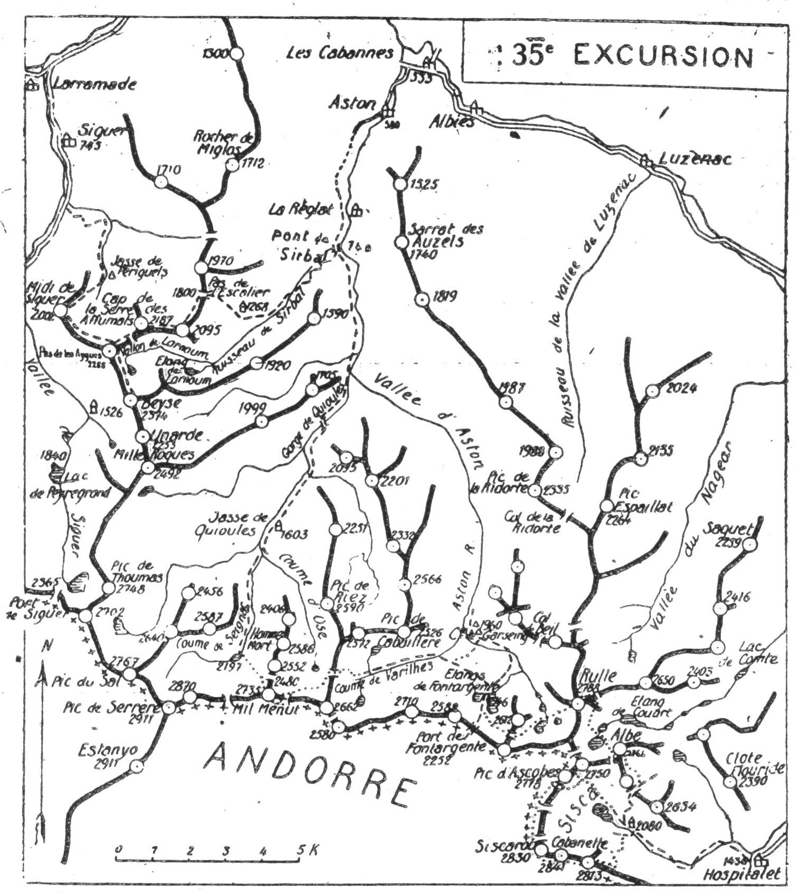

<style>.centre {text-align: center}</style>
<style>.droite {text-align: right}</style>

-----------------------
[//]: # (— p. 433 —)

# TRENTE CINQUIÈME EXCURSION

(N° 26 de la 1re édition)

__Quatre jours au départ de l'Hospitalet__

_B. E. — Du 1* au 20 Juillet ou du 20 Août au 15 Septembre._

Cartes à emporter : Foix et Perles réunies.

__De l'HOSPITALET à SIGUER,__\
__par le Cirque du Sisca, le Roc Mélé, le Pic de la Cabanette,__\
__le Signal de Siscarou, le Pic d'Ascobes, le Pic de l'Albe,__\
__le Pic de Rulle, le Pic Noir de Joucla,__\
__les Etangs de Fontargente,__\
__le Pic de Mil-Ménut, la Gorge de Quioules, la Vallée d'Astorn,__\
__le Pic du Pas de las Aygues et le Pic de Midi de Siguer.__

<u>__AVIS AUX TOURISTES__</u>

Le programme de a 35me Excursion qui, pour faire suite à
celui de la 34me, devrait commencer à Siguer et finir à l'Hospitalet
a été renversé. Il présente ainsi les avantages suivants :
1° de faire partir le touriste d'un point plus élevé; 2° de mieux
situer le couchage en montagne; 3° enfin, de faire prendre par
en haut la longue vallée d'Aston, ce qui fait gagner un jour.

Il n'existe pas, dans la région, de guides connaissant la course
en entier; mais on trouvera un porteur à l'Hospitalet. On
pourrait en louer un pour les deux premiers jours.

<p class="droite">(Voir ci-contre la Carte du Sisca, du Rulle et de Fontargente).<br/>
(Voir, page 440, la Carte générale de l'Excursion).</p>

———\
(1) L'Hospitalet (Arièze), 148 hab., c. d'Ax-les-Thermes (17 k.), ligne
d'Ax à Bourg-Madame.

<div class="page"/>

— p. 434 — SISCA - RULLE - FONTARGENTE  (35me EXCURSION)


<div class="page"/>

— p. 435 — (35me EXCURSION) REFUGE du SISCA

## PREMIÈRE JOURNÉE

__De l'HOSPITALET (1.436m) au REFUGE du SISCA (2.080m),__\
__par le Roc Mélé (2.813m),__\
__le Pic de la Cabanette (2.841m), le Signal de Siscarou (2.830m)__\
__et le Pic d'Ascobes (2.778m).__

—— SANS GUIDE ——

__Conseils.__ — __Itin. recomm.__ - On emportera des provisions pour
deux jours et demi et on prendra un porteur, tout au moins
pour la journée, car il est indispensable de faire monter les
vivres au refuge et de les y faire garder le premier jour.

On partira dès qu'on pourra se conduire, de façon à être au
refuge du Sisca au plus tard à 7 h. On franchira l'Ariège sur le
nouveau pont Sainte-Suzanne (1) pour suivre à dr., au N.-O., le
chemin du Sisca qui monte entre le Roc de Carrouch et les
pentes S. du Pic de Clote Flouride. A 3/4 d'h. de l'Hospitalet.
on franchira le ruisseau du Sisca sur un pont formé par deux
dalles en pierre et, 20 m. plus haut, on laissera à dr. le sentier
qui conduirait à l'éting de Pédourès par le Val d'Arques. Là, le
vallon du Sisca tourne au S.-O. et le sentier en remonte la rive g.
jusqu'au pied des cascades du Saut du Taureau où il passe, pour
1/4 d'h., rive dr. En amont des cascades, on reviendra définitivement
rive g. pour longer le torrent jusqu'au refuge du Sisca
(2.080m).

En cours de route, on remarquera dans l'axe du vallon et tout
en haut du cirque la cime la plus intéressante du Sisca : le Pic
d'Ascobes (2.778m); puis, sur sa g., le curieux cylindre d'Ascobes.
entre deux étroites et profondes brèches par lesquelles on peut
passer en Andorre.

Le Cylindre d'Ascobes, d'une alt. de 2.600 m. environ, a été
gravi pour la première fois, ie 7 juillet 1920, par mon disciple,
le Dr Jean Arlaud (V. La Montagne, 1920. p. 149).

———\
(1) Pour que la voie ferrée puisse, en quittant la gare de l'Hospitalet
décrire la courbe nécessaire à son entrée dans le grand tunnel
de 3 kil. de cette localité à Porté, on a déplacé l'Ariège, vers l'O. au
point de l'ancienne passerelle, Un pont nouveau, en une seule arche
de granit en plein cintre, à remplacé la passerelle sur le nouveau
cours de l'Ariège.

<div class="page"/>

— p. 436 — ROC MELE — PIC de La CABANETTE (35me EXCURSION)

Le refuge forestier de la Bésine du Sisca (1) est situé sur la
rive g., à 20 m. du torrent et à 10 min. du cirque. Il est confortable
puisqu'il est pourvu d'un lit de camp en bois, d'une cheminée
qui tire bien et d'une porte qui ferme au loquet. Il y a
de la place pour cinq ou six personnes et, même avec du brouillard
on ne risque pas de le manquer, si on suit le sentier qui
longe la rive g. du ruisseau.

On arrive là à l'entrée d'une merveille pyrénéenne presque
inconnue : le Cirque du Sisca. C'est par les crêtes que nous
allons en effectuer le tour en faisant au passage l'ascension de
ses principaux sommets. On ne mettra dans son sac que les provisions
nécessaires pour la journée; on laissera les autres au
refuge. Le porteur y restera pour les garder et faire la corvée
du bois.

Partant direction S.-O., on franchira le torrent sur un alignement
de grosses pierres et on remontera devant soi en zigzaguant
les pentes et en contournant les bosses du terrain, de façon à
rejoindre la frontière 500 m. au S.-E. du Roc Mélé (2.813m). On
montera au sommet et on continuera à toute crête, vers l'O., en
faisant au passage le Pic de la Cabanette (2.841m) et le Signal de
Siscarou (2.830m). A partir de là, la crête frontière prend la
direction N.; on la suivra à flanc sur le versant andorran jusqu'au
Cylindre d'Ascobes où on descendra d'une cinquantaine de m.

Ce trajet est de toute beauté. Du Roc Mélé au Cylindre d'Ascobes
on domine successivement la haute vallée de l'Ariège et la
région de Font-Nègre, le Cirque dels Pessons, la vallée d'Embalire
et celle d'Incles. Sur la dr., l'œil découvre insensiblement les
formes harmonieuses du cirque qui paraît tourner à mesure
qu'on marche.

Parvenu à la base O. du Cylindre, on pourrait continuer vers
le N. et faire l'ascension un peu délicate de l'Ascobes par cette
face; mais ce trajet serait moins intéressant que celui qui fait
franchir la brèche N.-E. du Cylindre pour repasser au cirque.

Par caprice, sans doute, la nature a creusé là, sur les deux
versants, deux petits couloirs rapides et faciles qui grimpent
vers une étroite et très profonde entaille de la crête où il n'y a
de passage que pour une personne. De cette brèche, on domine

———\
(1) Il ne faut pas confondre ce refuge avec celui de la vallée des
Bésines, au N.-E. de l'Hospitalet.

<div class="page"/>

— p. 437 — (35me EXCURSION) PIC D'ASCOBES

le Cirque du Sisca au S.-E. et la vallée d'Incles à l'O. On contournera
donc la base du Cylindre pour remonter immédiatement
à l'E. par l'étroit couloir qui mène à la brèche d'où on reviendra
au Cirque du Sisca.

Après une descente de 3 min., on tournera à g., à l'E., pour
couper les contreforts S. du Pic d'Ascobes et aboutir, par une
marche horizontale, à la base d'une coume rapide qui monte vers
la crête E. du pic. On laissera là son sac et on fera l'ascension
de l'Ascobes par la face N.-E.

Le Pic d'Ascobes (2.778m) est surmonté d'une tourelle qui a
été bâtie par M. d'Ussel, lors de sa première ascension, le 28 juillet
1900. C'est un belvédère de premier ordre sur les environs
immédiats et surtout sur le cirque.

On domine merveilleusement ce dernier dont tous les détails
sont en lumière. L'Etang du Sisca, qui en occupe le centre, retient
longtemps l'attention avec sa petite île rocheuse. Plus près de
soi, perdus dans la rocaille, brillent quatre autres petits étangs.

Sur le versant andorran, au N.-O. de l'Ascobes, on remarquera
les deux étangs andorrans de Joucla (2.300m), qui ne figurent
dans aucune carte, quoique très importants. Leurs eaux s'écoulent
dans la vallée d'Incles qu'on domine de l'Ascobes (1).

On redescendra au refuge par la rive E. du cirque en passant
près des estagnoles de Régalécio et de Moulsude et en laissant
l'Etang du Sisca à dr. On fera ainsi le tour complet du cirque.
Par cette voie, non seulement on trouvera moins d'éboulis, mais
on repèrera, au passage, le sentier de départ du lendemain par
la rive g.

__Horaire de la Journée :__

```
De l'Hospitalet au Refuge de la Bésine... 2h. » }
Du Refuge au Roc Mélé.................... 2h.10 }   9h.45
Du Roc Mélé au Cylindre d'Ascobes........ 2h.15 }
Du Cylindre au Pic d'Ascobes............. 1h.20 } (Arrêts en sus).
Du Pic d'Ascobes au Refuge............... 2h. » }
```

———\
(1) Au S. de ces deux étangs, existe le très joli Pic Noir andorran
de Joucla, 2.640 m. environ. Nous avons donc deux pics Noir de
Joucla un en France et un en Andorre, comme nous avons quatre
étangs de Joucla. V. p. 441.

<div class="page"/>

— p. 438 — PORTEILLE du SISCA  (35me EXCURSION)

## DEUXIÈME JOURNÉE

__Du SISCA aux CABANNES de GARSEING (1.960m) [1],__\
__par la Porteille du Sisca (2.450m), le Pic de l'Albe (2.764m),__\
__le Pic de Rulle (2.788m), le Pic Noir de Joucla (2.612m)__\
__et les Etangs de Fontargente.__

—— SANS GUIDE ——

__Conseils.__ — __Itin. recomm.__ — On prendra, derrière le refuge, le
sentier de descente de la veille par la rive g. du torrent. Dix min.
après, en vue de l'Etang du Sisca, on tournera à dr., au N.-E,
afin de monter à la Porteille du Sisca, en laissant le petit étang
de Moulsude à g. Pendant le second quart d'heure, le sentier, qui
monte à travers des pelouses, est à peine tracé. Il se précise et
s'agrandit dans les pentes supérieures, et, après avoir fait un crochet
à dr., file droit au N., jusqu'à la Portejlle du Sisca (2.450m),
où apparaît subitement, sur l'autre vérsant, le bel Etang de
Pédourès.

La Porteille du Sisca est située entre le Pic de Néressolle
(2.634m), au S.-E., et le pic de Régalécio (2.590m), au N.

De ce point, on aperçoit tout le pourtour du cirque, et c'est
déjà, au moment où le soleil se lève, une fort belle vue.

Après une descente de 5 min. au N.-E., par le sentier de Pédourès
on se dirigera au N.-O., afin de contourner par sa base le
contrefort E. du pic de Régalécio. On s'élèvera ensuite à flanc de
montagne, par le haut d'une coume dont le fond est plein de gros
éboulis, pour aboutir à l'entrée d'un couloir de verdure très
incliné. Ce couloir conduit directement à la crête, 10 min. au S.
de la Tose de l'Albe, large bosse gazonnée, dont on apercevra
bientôt la tourelle (2.600m).

A partir de là, on marchera sur une croupe arrondie, parsemée
de pierraille et de jispet, pour parvenir, 20 min. après, au
Pic de l'Albe (2.764m), à 40 m. de la tourelle. On déposera là son
sac, et on arrivera au Signal à toute crête (2).

———\
(1) Les gens du pays prononcent Garsangn.

(2) Sur les régions de l'Albe, du Rulle, de Fontargente et sur le
Cirque du Sisca, voir les articles très intéressants et très documentés
de M. L. Rouch : 1° au Bulletin Pyrénéen, année 1914, pages 321 et
362; 2° à La Montagne, n° d'avril-juin 1916.

<div class="page"/>

— p. 439 — (35me EXCURSION) PIC ET ETANGS D'ALBE

Le point de vue de l'Albe est très beau, surtout sur les abords
immédiats, cirques de Couart et de Rulle, jasse de Pédourès et
vallée du Mourgouillou. Le Pic d'Ascobes prend l'aspect d'une
pyramide aiguë et les crêtes qui entourent le cirque du Sisca
paraissent en entier. Mais, ce qui attire le plus les regards, c'est
d'abord le majestueux pic de Rulle, qui se dresse au N.-O., d'un
élan magnifique, de l'autre côté du cirque; c'est ensuite le grand
Étang supérieur de l'Albe qu'on domine presque verticalement
de plus de 400 mètres.

A l'O. du Pic de l'Albe, un beau couloir très facile, s'il est sans
neige, plonge directement vers le grand Etang de l'Albe (2.330m);
c'est par là qu'on descendra, en faisant un crochet, à g.. au bas
du couloir, pour éviter un à-pic.

Situé dans un cadre d'une coquetterie sauvage, l'Etang supérieur
de l'Albe est un des plus attrayants des Pyrénées. On le
longera par la rive dr. jusqu'à son déversoir qu'on franchira
100 m. plus bas; on se dirigera ensuite vers le Rulle en passant
entre les deux étangs de l'Albe.

En face, au N.-O. de l'Etang inférieur de l'Albe (2.285m), on
apercevra, d'abord, une pente gazonnée, puis, tout en haut, un
vert couloir qui grimpe vers la crête et la rejoint à l'E. du Rulle;
c'est la voie d'ascension par le cirque S.-E. (1). On zigzaguera
la pente gazonnée et, parvenu en haut, on tournera à g. pour
éviter la fastidieuse traversée d'une profonde cuvette de gros
éboulis. Après avoir décrit un arc de cercle de g. à dr., en gagnant
de la hauteur, on aboutira au vert couloir supérieur qu'on remonlera
avec précaution. En appuyant un peu à dr., dès qu'on aura
atteint le rocher, on gagnera la crête d'un contrefort à l'E. d'un
gendarme qu'il faut contourner par derrière. On trouvera alors
des terrasses faciles pour rejoindre, dans quelques min., la grande
arête N.-E. du Rulle. A partir de là, c'est un entassement de gros
blocs qu'on escaladera à toute crête jusqu'au sommet principai
du Rulle (2.788m).

Par sa situation privilégiée, puisque aucun pic de plus haute
altitude ne gène sa vue (2), le Rule est un belvédère de tout pre-

———\
(4) Si on partait de l'étang Couart, on pourrait monter par le cirque
E. et rejoindre le premier itinéraire à la crête, en haut du vert
couloir,

(2) Le Pic de Serrère (2.911m) est à 11 Kk. à l'O. et le Carlitte (2.921m),
à 17 h., à l'E.

<div class="page"/>

— p. 440 — De L'HOSPITALET à SIGUER (35e EXCURSION)



mier ordre. C'est bien lui qui commande les cirques de Rulle
et de l'Albe, le haut Nagear, le cirque de Joucla et la région de
Fontargente.

Tout près, vers l'O., c'est une multitude de pics de haute et de
moyenne alt., et, sauf le Serrère et l'Estanyo, ces sommets sont
presque tous inconnus.

Le sommet coté 2416, que les cartes situent au S.-O. du Rulle,
n'existe pas, et on se demande à quel pic il faut attribuer le nom
de Fontargente. Pour beaucoup de gens du pays, le Rulle et le
Fontargente seraient le même pic. Pour d'autres (ceux de la

<div class="page"/>

— p. 441 — (35me, ExCURSION) PIC NOIR De JOUCLA

région d'Aston), c'est le Pic Noir de Joucla (2.612m) qui serait le
vrai pic de Fontargente (1).

Du sommet principal (sommet E.), on descendra, à l'O. à la
large brèche qui sépare les deux cimes et on y déposera le sac;
c'est là que prend naissance le couloir S.-O. par lequel on quittera
le Rulle. On fera à toute crête le sommet O., surmonté de
deux tourelles jumelles de construction particulière. Bâties sur
des dalles qui forment un pont à leurs bases, on voit le jour
par-dessous en y arrivant.

Le sommet O. est en contrebas de quelques mètres et la vue v
est analogue à celle du sommet E., sauf sur les abords immédiats:
il faut faire les deux cimes pour jouir du panorama complet.

Excepté par la muraille qui domine le cirque S.-E., le Rulle
est accessible par toutes ses faces. Dans moins de 2 h., on descendrait
par la face N.-O. aux cabanes de Garseing; mais, pour
donner à l'excursion son maximum d'intérêt, on ira faire le tour
par les étangs de Joucla, le Pic Noir et les étangs de Fontargente.

Prenant à la large brèche le couloir S.-O., on descendra directement
aux étangs français de Joucla (2) en obliquant un peu à g..
vers le fond. On franchira le déversoir du grand étang (2.350m)
qu'on longera par la rive O. jusqu'à la base du ravin pierreux.
S'élevant alors en biais, on remontera ce dernier jusqu'au col qui
est situé vers 2.500 m. d'alt., au S.-O. du Pic Noir de Joucla
(2.612m), où on déposera le sac. On fera ensuite, au N.-E., l'ascension
du sommet, partie à toute crête, partie à flanc.

Du Pic Noir de Joucla, on dominera de 500m. les beaux étangs
de Fontargente situés au N.-O., vers lesquels on descendra après
être revenu au col. Là, naissent deux longs couloirs d'éboulis
dont l'un, celui de dr., se dirige vers le grand étang, et l'autre
vers le petit. On prendra ce dernier, afin d'aller rejoindre le
sentier qui vient du Port de Fontargente (2.252m). Passant ensuite
entre les deux étangs, on quittera le plateau en obliquant un peu
à dr. au N.-E., pour suivre le sentier qui longe la rive g. du
déversoir du grand étang jusqu'au ruisseau d'Aston qu'il franchit.
On trouvera sur la rive dr. un chemin muletier qui, à travers

———\
(1) V. à ce sujet l'article de M. L. Rouch dans le Bulletin Pyrénéen.
année 1917, p. 68.

(2) Les deux étangs andorrans de Joucla dont il est question à la
page 437, sont plus au S., de l'autre côté de la frontière. Un col facile
les fait communiquer avec les étangs français de Joucla.

<div class="page"/>

— p. 442 — CABANES De GARSEING (35me EXCURSION)

les pelouses, conduit, dans 1/4 d'h., à la première cabane de
Garseing 1.960m où on couchera. Il en existe une autre 150 m.
plus loin, mais moins importante.
Les deux cabanes de Garseing sont admirablement situées sur
un beau plateau de verdure, rive dr. de la haute vallée d'Aston.
La plus confortable est la première, celle qui appartenait à
l'ancien berger principal, Papy (1).

Nota. — Si on n'a pris le porteur que pour deux jours, c'est
du Rulle qu'il faut le renvoyer; il pourra ainsi rentrer facilement 
à l'Hospitalet le soir même, par la Couillade et la Jasse
de Pédourès.

__Horaire de la Journée :__

```
Du Refuge à la Porteille du Sisca........ 0h.45 }
De la Porteille au Pic de l'Albe......... 1h.30 }
Du Pic de l'Albe au Pic de Rulle......... 2h.15 }  8h. 15
Du Pic de Rulle au Pic Noir de Joucla.... 2h. » } (Arrêts en sus).
Du Pic Noir aux Cabanes de Garseing...... 1h.45 }
```

## TROISIÈME JOURNÉE

__Du PLATEAU de GARSEING (1.960m) à ASTON (580m),__\
__par la Coume de Varilhes, le Col de la Coume d'Ose (2.352m),__\
__le Pic de Mil-Ménut (2.735m), la Coume de Seignac,__\
__la Jasse et la Gorgé de Quioules et la Vailée d'Aston.__

—— SANS GUIDE ——

__Conseils.__ — __Itin. recomm.__ — Si on suivait le sentier qui descend
au confluent de la Coume de Varilhes, on perdrait 150 m. d'alt.
qu'il faudrait regagner ensuite. Appliquant le principe du bon
pyrénéiste, il faut « couper » horizontalement les pentes d'en
face, afin de rejoindre la Coume de Varilhes à mi-hauteur. Un
trajet de ce genre, au début de l'excursion, se fait sans fatigue.

Franchissant l'Aston au S. de la cabane, on obliquera immédiatement
à dr. pour contourner le flanc N. de la montagne. Après

———\
(1) Papy était un bon chasseur qui connaissait admirablement les
montagnes de Fontargente et qui pouvait donner des renseignements
précieux. Comme il était très serviable, c'était, pour le touriste qui
passait dans cette région, le berger providentiel.

<div class="page"/>

— p. 443 — (35me EXCURSION) COL. de la COUME d'OSE

20 min. de marche vers l'O., on rejoindra un petit sentier qui,
venant des étangs de Fontargente, se dirige horizontalement vers
la Coume de Varilhes. Là, on franchira le ruisseau de la Coume
pour prendre le sentier qui la remonte par la rive g.

Tout en haut de la Coume, un peu à dr., on apercevra une large
échancrure gazonnée; c'est le Col de la Coume d'Ose. (2.352m),
vers lequel il faut se diriger. On franchira bientôt le petit torrent
qui descend de l'Etang de Mirabal (2.272m), situé à dr., au N., et,
quelques min. après, on découvrira, sur la rive dr., de l'autre
côté de la vallée, la Coume d'Enfer avec son étang sombre et le
pic de ce nom.

Au S.-O. l'étroite brèche de la Portaneille (2.500m) fait l'effet
d'un profond coup de scie entre le Pic de la Coume d'Enfer
(2.580m) et le Pic de la Coume d'Ose (2.662m). Le Col de la Portaneille
fait communiquer la vallée d'Aston avec l'Andorre par la
Coume de Varilhes; c'est par un étroit couloir d'éboulis qu'on
grimpe à cette brèche pour aboutir ensuite, par une pente rapide
à la Coma de Ransol, en Andorre.

En haut de la Coume de Varilhes, on parviendra à la base d'un
couloir terreux et raviné qui monte à dr.; on le suivra en zigzaguant
ses pentes, et, 1/4 d'h. après, on aboutira à un rond-point
de verdure. Encore 10 min. d'ascension vers l'O. et on atteindra
le Col de la Coume d'Ose (2.352m).

Le Col de la Coume d'Ose fait communiquer la Coume de
Varilhes avec celle d'Ose. Orienté E.-O., il est en entier en France.
et il ne faut pas le confondre avec le Port-Vieux de la Coume
d'Ose qui est situé sur la crête frontière et est orienté N.-S.

Immédiatement à l'O. du Col, on aura sous ses pieds, en contrebas 
de plus de 300 m., le petit étang de la Coume d'Ose. A une
heure matinale, ce petit étang, comme celui de la Coume d'Enfer,
apparaît sous un aspect lugubre. Seule, sa partie S. est moirée
d'argent, sous la chute d'une cascade qu'alimente un névé.

A partir du Col de la Coume d'Ose, on entre dans la région
tributaire du grand pic de Serrère (2.911m), situé sur la frontière.
à environ 5 k. plus à l'O. Le plus intéressant de ses satellites est
le Mil-Ménut (2.735m) qu'on a devant soi, à l'O.-S.-O.. à environ
2 k. Vu du Col, il affecte la forme d'une noire pyramide, tandis
que si on l'observe du N. (de la Pique de Baychon, par exemple),
on n'aperçoit qu'une longue crête plusieurs fois ensellée. L'ascension
en est très facile.

<div class="page"/>

— p. 444 — MIL-MENUT — JASSE de QUIOULES (35me EXCURSION)

On quittera le Col par la g., et, par une marche horizontale, on
coupera les terrasses du flanc N. du Pic de la Coume d'Ose. On
dominera constamment le petit étang, qu'on laissera à dr., et on
aboutira bientôt à la base du grand couloir qui monte au Port-
Vieux de la Coume d'Ose (2.500?). Ce port est situé entre le Pic
de la Coume d'Ose (2.662m), à l'E., et le Pic de Mil-Ménut (2.735m),
à l'O. Une grimpette de 20 min. mènera au port. On n'aura plus
qu'à faire, à l'O., l'ascension du Mil-Ménut à toute crête.

Sans qu'elle puisse: être comparée à celles du Rulle et du Serrère, 
la vue du Mil-Ménut est très belle, surtout vers le N. et le
S. On aperçoit de son sommet les multiples vallons secondaires
Qui, aussi bien sur le versant andorran que sur le versant français
apportent aux grandes vallées le tribut de leurs eaux torrentueuses.

Du Mil-Ménut, on descendra, au N.-O., par un contrefort et un
couloir vers la cuvette de l'ancien petit étang de la Coume de
Seignac (2.197m), maintenant disparu. Passant ensuite sur la
rive g. du torrent, on rejoindra le sentier qui descend directement
à la Jasse de Quioules (1.603m).

La Jasse de Quioules est, peut-être, la plus importante de
l'Ariège; elle voit passer, à l'aller et au retour, tous les troupeaux
qui pâturent aux jasses supérieures de la Coume d'Ose, la Coume
de Seignac, de Soulanet et des deux Sabines. Un berger m'a
affirmé qu'on pourrait faire pacager 30.000 moutons dans ces
jasses réunies.

On trouve à la Jasse de Quioules une belle cabane couverte en
ardoise et munie d'une porte en fer fermant à clé. C'est un beau
centre d'excursion, et c'est là que je conseille d'aller coucher si
on veut faire le pic de Serrère séparément. Au cas où on irait
avant saison, on s'informera à Aston si la cabane est habitée.

De la Jasse de Quioules, le chemin, bien tracé, suit la rive dr.
à travers les pelouses et en pente douce, pendant 1/2 h. environ.
Au débouché de la Coume de Jax, on franchit son torrent sur un
petit pont, et 10 min. après, la vallée se transforme en une étroite
et profonde gorge.

La gorge de Quioules est un des défilés les plus importants des
Pyrénées, et on est saisi d'admiration pour les hommes hardis
qui ont osé construire un chemin dans ce lieu diabolique.

Une gorge étroite dont on ne peut mesurer la profondeur de
certaines parties; des falaises de 2 à 300 mètres de hauteur et

<div class="page"/>

— p. 445 — (35me EXCURSION) GORGE de QUIOULES

presque verticales; un chemin souvent accroché très haut sur le
flanc de la montagne : voilà la partie supérieure de la gorge.
Puis, subitement, les roches de la rive dr. étant en surplomb et le
torrent à des profondeurs insondables, on a l'impression qu'on
est embouteillé et qu'on n'ira pas plus loin. Cependant, des arbres
aux troncs noueux ont poussé dans les fissures du roc, mais la
gorge est si resserrée que leurs branches crochues se sont enchevêtrées
avec celles des arbres de l'autre rive.

On a jeté là un tout petit pont en fer (1) pour passer rive g.
où une remontée de chemin mène à un col situé sur un contrefort 
rocheux. Après le col, on reprendra la descente rapide et on
sera à nouveau canalisé vers le fond de la gorge, pour rejoindre
le torrent prés du confluent de l'Aston qui descend de Fontargente
A partir de là, le chemin s'aplanit en traversant des jasses
de verdure de la rive g. et une belle forêt. Il continue en bordure
de l'Aston qu'il domine souvent d'une centaine de m., et, après
deux petites remontées, il descend rapidement, en coupant le
ruisseau de Sirbal, jusqu'en face de La Réglat, petit hameau situé
sur l'autre rive.

Le chemin, garni de pavés glissants, monte ensuite pendant
1/4 d'h. environ et bientôt on rejoint la grande route qui conduit
directement à Aston (2).

Nota. — Si on avait les provisions nécessaires, on pourrait
éviter 1 h. de marche, le soir, et autant, le lendemain matin,
en couchant au hameau de la Réglat, 10 min. en aval du ruisseau
de Sirbal.

__Horaire de la Journée :__

```
Du Plateau de Garseing au Col de la           }
  Coume d'Ose ......................... 2h.15 }   10h. »
Du Col de la Coume d'Ose au Mil-Ménut.. 2h. » }
Du Mil-Ménut à la Jasse de Quioules.... 2h. » } (Arrêts en sus).
De la Jasse de Quioules à Aston........ 3h.45 }
```

———\
(1) Pont de la Crabe 1.300m, appelé ainsi parce qu'une chèvre le
franchirait d'un bond.

(2) Aston, 334 hab., c. des Cabannes (3 k.).

<div class="page"/>

— p. 446 — ASTON — VALLON de SIRBAL (35me EXCURSION)

## QUATRIEME JOURNEE

__D'ASTON (580m) à SIGUER (745m),__\
__par le Vallon de Sirbal, le Pas de l'Escalier (1.800m),__\
__la Serre des Affumats (2.095-2.187m),__\
__le Pic du Pas de las Aygues (2.288m) et le Pic de Midi__\
__de Siguer (2.002m).__

—— SANS GUIDE ——

__Conseils.__ — __Itin. recomm.__ — Cette excursion, dans un des coins
les moins connus de l'Ariège, ne saurait être trop recommandée,
tant pour son intérêt que pour sa facilité. Elle peut être entreprise
par des touristes de tout àge et de toute aptitude, pourvu
qu'ils puissent effectuer 9 h. de marche dans la journée, doni
5h.30 en montant en pente douce.

On reprendra le chemin de Fontargente et on le suivra jusqu'au
pont de Sirbal (740m) qu'on passera. Immédiatement après, on
pénètrera dans la forêt, afin de remonter le vallon de Sirbal par
la rive dr., direction S.-O.

Le sentier, à peine tracé au déhut, se précise et s'agrandit dès
que la pente s'accentue en entrant en forêt.

Le torrent impétueux dégringole dans une profonde gorge
boisée en de multiples et bruyantes cascades et, chaque fois
qu'un lacet du sentier ramène vers ses bords, on entend, sous ses
pieds, ses mugissements lugubres à plus de 100 m. de profondeur.

Après 1 h. d'ascension sous bois, on débouche dans une clairière
de verdure où meurt le sentier. Là, il faut franchir le ruisseau 
de Sirbal sur les cailloux et passer rive g. pour rejoindre le
nouveau sentier qui longe le torrent à une certaine hauteur jusqu'à 
la jasse de Sirbal. On quittera le grand sentier qui continue,
direction S.-O., vers la gorge de Larnoum, et on montera au N.-O.
par des sentes de moutons qui aboutissent sur un nouveau cortal,
près de la cabane de Baloudreyt (1.268m) (1). De ce point, on
apercevra droit au N.-O. la large échancrure du Pas des Escaliers,
presque dans l'axe d'un petit vallon qui monte vers la crête. Il
n'y a pas de sentier régulier, mais de nombreuses traces sur un

———\
(1) La cote 1268 est celle de la carte d'Etat-Major; à mon avis, cette
cabane est au moins à 1.400 m.

<div class="page"/>

— p. 447 — (35me EXCURSION) PAS DE L'ESCALIER — SERRE des AFFUMATS

terrain facile qu'on zigzaguera à sa fantaisie jusqu'au Pas des
Escaliers (1.800m). On ne peut pas se tromper; c'est la dépression
la plus basse de la crête, au S. du Pic del Clot Taillat (1.970m).

Le Pas des Escaliers fait communiquer la vallée d'Aston avec
celle de Siguer et on a devant soi, au N.-O., le sentier bien tracé
qui descend vers cette dernièré par le vallon de Durbat.

Tournant alors au S., on montera à toute crête jusqu'à la Serre
des Affumats (2.095m) où on trouve les débris de l'ancien signal.
On arrive là sur une magnifique terrasse de pâturages, longue
de 2 k. environ et large de 300 m. Orientée E.-O., à une alt.
moyenne de 2.100 m., elle procure le plaisir de faire sans fatigue
une promenade ravissante. On aperçoit successivement plusieurs
vill. des vallées d'Ax, de Siguer, de Vicdessos, et on domine au S.
le vallon de Larnoum.

Pour augmenter l'agrément, on fera un petit crochet à dr., au
N.-E., afin de passer au point culminant, au Cap de la Serre des
Affumats (2.187m), d'où on a une jolie vue plongeante vers Siguer
et la vallée de ce nom.

Du Cap de la Serre des Affumats, on aperçoit, au S.-S.-O., la
tête noire d'une cime facile flanquée d'une face d'éboulis : c'est
le Pic du Pas de las Aygues (2.288m), point culminant de l'excursion; 
on n'aura qu'à marcher dans sa direction. Après une petite
descente. jusqu'au Col de Larnoum qui domine à l'O. le vallon
de ce nom, une remontée facile conduit en 40 min. au sommet.
Au Col de Larnoum, on verra pour la dernière fois le petit lac
de ce nom qui brille à environ 1.500 m. au S.-E.

Le Pic du Pas de las Aygues est constitué par un entassement
de blocs granitiques et l'ascension en est facile par toutes ses
faces. C'est un magnifique belvédère d'où on embrasse les montagnes
ariégeoises en arc de cercle, du Certescons au massif de
Tabe. Les hautes cimes du Montcalm, du Serrère et de la région
de Fontargente sont splendides.

Le grand sentier de crête, qui vient de la Unarde pour continuer
jusqu'au Pic de Midi de Siguer, passe à 20 m. en contrebas
sur la face E.; on n'aura qu'à le suivre jusqu'à ce dernier pic
situé au N.-O. du Pas de las Aygues. Ce trajet est des plus intéressants
car on domine constamment la région de Pevregrand,
la haute vallée de Siguer et la gorge de Brouquenat.

Dès qu'on a quitté le Pas de las Aygues, le sentier se dirige
au N.-O. pour rester toujours sur la crête et, après avoir dépassé

<div class="page"/>

— p. 448 — PIC de MIDI de SIGUER (35me EXCURSION)

le Col de Bayle, remonte légèrement direction N. jusqu'au Pic de
Midi de Siguer (2.002m). Ce n'est pas à proprement parler un
pic, car il n'en a aucun caractère; c'est le point culminant d'une
colline gazonnée qui n'a l'aspect d'un pic que vu de Siguer. C'est
un joli belvédère sur les abords immédiats, surtout sur les vil.
de Gestiès, de Siguer, de Lercoul et de Lapège; ce dernier s'étage,
suspendu à flanc de montagne, sur la rive g. de-la grande vallée
de Vicdessos.

Du Pic de Midi, on suivra, d'abord, la croupe N.-E. qui descend
en pente douce, puis on tournera à dr., à l'E. afin d'aller
trouver le grand sentier de la Jasse de Périguels. A partir de là,
il y a plusieurs chemins pour descendre à Siguer : le premier
fait un long crochet à g. et va rejoindre la grand'route à Sarradel;
le second continue droit au N. et, après avoir franchi le torrent
de Durbat, y aboutit 1 k. en amont de Siguer. Les deux sont
bons et demandent le même temps.

Nota. - on peut, en 1/2 h., descendre de Siguer à Larramade
(2 k. 500) et là, prendre le petit train, soit pour Vicdessos ou
Auzat, soit pour Tarascon.

__Horaire de la Journée :__

```
D'Aston au Pont de Sirbal............... 1h.10 }
Du Pont de Sirbal au Pas des Escaliers.. 3h.20 }
Du Pas des Escaliers au Pic du Pas de          }    9h.30
  las Aygues............................ 1h.45 }
Du Pic du Pas de las Aygues au Pic de          } (Arrêts en sus).
  Midi de Siguer........................ 1h.»  }
Du Pic de Midi à Siguer................. 2h.15 }
```

<u>__POINTS D’INTERRUPTION__</u>

__REFUGE DU SISCA__
- Pour rejoindre de l'Hospitalet : 2h »
- Pour rentrer à l'Hospilalet : 1h.30.

__CABANNES DE GARSEING__
- Pour rejoindre des Cabannes : 6h. »
- Pour rentrer aux Cabannes : 5h. »

__ASTON__
- Pour rejoindre des Cabannes, afin d'effectuer la quatrième journée, 35 minutes.
- Pour rentrer aux Cabannes, après la 3° journée, 1/2h.
