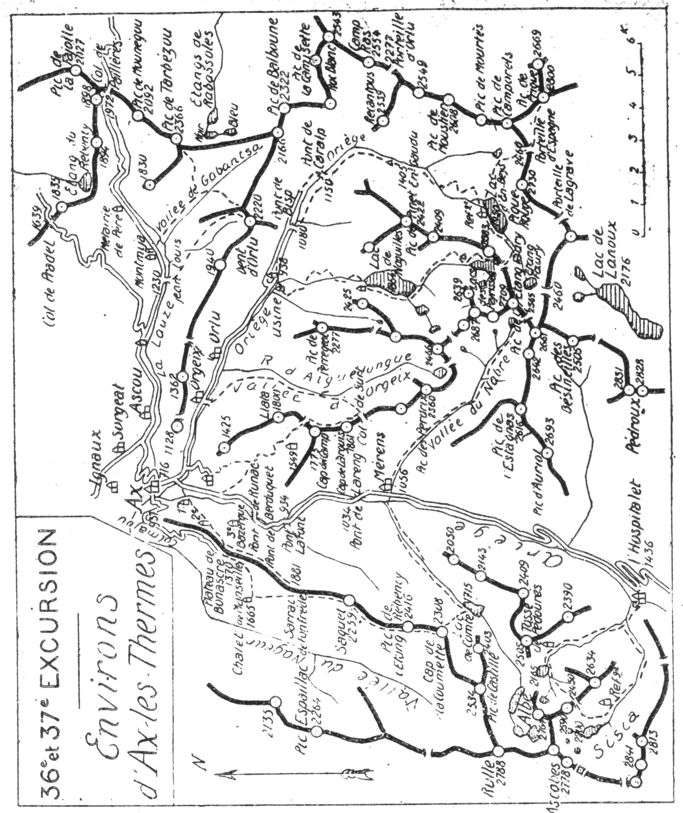

<style>.centre {text-align: center}</style>
<style>.droite {text-align: right}</style>

-----------------------
[//]: # (— p. XX —)

— p. 449 —

# TRENTE-SIXIÈME EXCURSION

Quatre jours aux Environs d'Ax-les-Thermes
(1° Série)

_B. E. — Du 15 Juin au 15 Octobre._

Cartes à emporter : Perles et Ax-les-Thermes.

_——— ——))e—

<u>__AVIS AUX TOURISTES__</u>

Comme Auzat, Ax-les-Thermes est un admirable centre de
tourisme. Plus mondain, moins encaissé, il est plus éloigné des
hautes cimes, mais, comme Auzat, il est entouré de belles montagnes
de magnifiques lacs et de gorges splendides.

11 faudrait une vingtaine de jours pour visiter en détail tous
les sites intéressants des environs immédiats d'Ax. Deux excursions
de quatre et de trois jours nous permettront, non seulement
de tout apercevoir, mais encore de monter aux jolis
belvédères qui dominent tous Îles alentours de cette belle station
thermale. |

<p class="droite">(Voir ci-contre la Carte des Environs d'Ax).</p>

## PREMIÈRE JOURNÉE

__D'AX (716m) à MÉRENS (1.056m),__\
__par le Plateau de Bonascre (1.370m), le Chalet de Manseille(1.665m),__\
__le Saquet (2.259m), le Pic de l'Etang Rebenty (2.416m),__\
__et le Lac de Comte (1.715m).__

Avec retour à Ax facultatif

—— SANS GUIDE ——

__Conseils.__ — __Itin. recomm.__ — On prendra, à l'O. d'Ax, la route
stratégique qui contourne la montagne de Pointe Couronne et
qui, par le Colmajou, monte au plateau de Bonascre (1.370m).
On dirait qu'elle a été construite pour l'agrément du touriste.


<div class="page"/>

— p. 450 —



<div class="page"/>

— p. 451 —
(36me EXCURSION) Le SAQUET ° 451

droit au S.; ce raccourci mène directement au plateau de Bonascre
en faisant gagner 1/2 h. Au début, on ne trouve que de
ehetites sentes, mais au bout de 10 min., on rejoint un grand sentier
qui s'élève en pente douce jusqu'au plateau (1.370m). On
jouit là d'un joli point de vue, surtout sur,le massif de Tabe.
Du plateau de Bonascre, on se rend bien compte que le Soularac
en est le point culminant et non le Saint-Barthélémy.

La bonne fontaine est située au S. du plateau, à environ 200 m.
à l'E. de la cantine des bûcherons, entre deux blocs de pierre.
A la cantine le chemin bifurque; celui de dr. se dirige au S.-O.,
vers la vallée du Nagear; celui de g. monte direction S. et, après
de nombreux lacets, fait un crochet à dr., pour aboutir au chalet
farestier de Manseille (1.665m). Le site est charmant et on y fait
généralement une grande pause. Au S., en face du chalet, coule
une source très froide qui n'a, paraît-il, que 3°.

Il serait prudent de faire là sa provision d'eau, afin de pouvoir
éjeuner au belvédère même du Saquet.

On auittera là le grand chemin pour monter sous bois direction
S.. et bientôt, au sortir de la forêt, au Sarrat de Fonfrède (1.881m).
on apercevra la tête hirsute du Saquet (2.259m). Il suffira de
suivre les sentiers qui longent les croupes gazonnées vers le S.
jusqu'au haut de la jasse du Saquet, vers 2.000 d'alt. A partir de
ce point, la pente s'accentue et se garnit de bruyères et de rhododendrons
à travers lesquels le sentier, très sinueux, disparaît
par moments. (Ce qu'il y a de plus simple, c'est de monter droit au
sommet en suivant la crête qui domine à g. des pentes très rapides.

Le Saquet n'est pas un pic, c'est l'extrémité d'une crête gazonnée
légèrement relevée et qui, vu d'Ax, ressemble à une tête
l'ours. C'est, sans doute, sa forme qui l'a aussi fait nommer
« Tête de lOurs » par la carte du Ministère de l'Intérieur, et

Tute de lPOurs » par les gens du pays. Son vrai nom est le
Saquet.

Le Saquet (2.259m), qui est d'accès très facile, est un admirable
belvédère, et son panorama s'étend à tous les grands sommets
de la région. Vers le S., les crêtes du Sisca et de l'Albe sont
nagniliques; au S.-O., à deux pas, le Rulle dresse majestueusenent
ses murailles vers le ciel. Vers l'E., on pourra repérer presque
en entier toute la voie d'ascension au pic de l'Etang Faury.
car l'œil prend en enfilade toute la vallée du Nabré.

<div class="page"/>

— p. 452 —
CLÉS. “452 - PIC de L'ETANG REBENTY (36me ExGURsiON].

Pour donner à l'excursion toute son ampleur, on poursuivra à
toute crête, au S., jusqu'au Pic de l'Etang Rebenty (2.416m) dont
on aperçoit la tourelle depuis le Saquet. Il n'y a par là aucunæ
difficulté, et on jouit constamment d'une vue splendide. Des
sentes de moutons longent l'arête sur l'un ou l'autre versant.
Après le pic de l'Etang Rebenty, on continuera à toute crête
jusqu'au Cap de la Coumette (2.308m). On obliquera ensuite à-g.,
pour aboutir au vallon de la Lioze qui descend à l'E., vers le
Lac de Comte (1.715m). On passe par là à la vallée du Mourgouillou
et bientôt on arrive au haut d'un ressaut d'où on domine
le lac d'environ 200 m. C'est de ce point qu'il paraît le
plus beau, et il n'est pas nécessaire de descendre sur ses bords.

On prendra sur la g. un petit sentier qui suit le haut du ressaut
et qui dévale, quelques min. après, vers le fond du vallon
qu'on rejoint à la jasse de Leuillasse (1.645m), près de l'estagnol
(1). Un grand sentier longe le torrent du Mourgouillou par
la rive g. jusqu'au joli pont de Lhabérolés constitué par quatre
dalles en pierre. C'est immédiatement en aval de ce pont que le
Mourgouillou s'élance superbement pour former la cascade de
Loubac..

Là, le sentier se transforme en chemin muletier qui continue
sur les deux rives jusqu'au Pont de Gazeil. Il vaut mieux descendre
par la rive dr., parce qu'on passe sous forêt et que la
pente est plus régulière. Au Pont de Gazeil, on se retournera pour
donner un coup d'œil à la cascade; puis, dans 20 min., on arrivera
à Mérens.

Si on ne connaît pas la gorge de Mérens et qu'on ne soit pas
fatigué, on rentrera à Ax par la route; en fin de journée, ce trajet
est de toute beauté.

__Horaire de la Journée :__

```
DA au Saquel...se -sussimaamans.. vus 4h.30
Du Saquet au Lac de Comté............ 2h.30 10h. »
Du Lac de Comté à Mérens............. 1h.30 } (Arrêts en sus).
De Mérens à Ax (8 k. de route)......... 1h.30
```

Nota. — Si on rentre à Ax par le train, l'excursion sera |

réduite à 8h.30 de marche effective.

———\
(1) Petit étang.

<div class="page"/>

— p. 453 —

(36me EXCURSION) COL De JOUX 453

## DEUXIÈME JOURNÉE

Ascension du Cap de Larguis (1.861»),
par Petches et le Col de Joux (1.685m), avec retour à Ax
par le Col de Surt (1.775m), la Vallée
et le village d'Orgeix.

—— SANS GUIDE ——

<u>__AVIS AUX TOURISTES__</u>

Au pont de Betsou, qui fait franchir l'Oriège à 1 k. 500 d'Ax,
s'amorce une nouvelle route qui, par le hameau de Petches,
monte en de multiples lacets jusqu'à la lisière de la forêt du
Llata, vers 1.000 m. d'alt.; puis, un sentier muletier lui succède
jusqu'au Col de Joux (1.685m). Tout ce parcours est jalonné É
la lettre G, peinte en blanc, tantôt sur des pierres et plus
souvent sur des arbres. C'est ce trajet que nous allons suivre
pour faire l'ascension du Cap de Larguis par la meilleure voie.

__Conseils.__ — __Itin. recomm.__ — On partira par la route d'Orlu et,
à 1 k. 500 d'Ax, on la quittera pour franchir l'Oriège au Pont de
Betsou, et suivre celle qui, par Petches, monte à la forêt du
Llata. Au pont même, on remarquera la première lettre G. qui
accompagnera le touriste jusqu'au haut de la forêt, à 10 min. du
Col de Joux.

Dès qu'on a dépassé Petches, l'intérêt commence, car le point
de vue s'élargit à mesure qu'on monte. Ax et la gorge de Mérens
s'enfoncent sous soi et, là-bas, vers le N., émergent les deux pointes
du Soularac et du Saint-Barthélémy dorées par le soleil matinal
Au terminus de la route, le sentier bifurque; on prendra
celui de g. qui fait tout de suite un grand lacet vers l'E., et qui
reprend enfin la direction S. jusqu'au Col de Joux. On aura soin
de ne pas perdre de vue là lettre G.

Après avoir rejoint le torrent de Joux, qui gronde impétueusement
on en suivra la rive dr. jusqu'au haut de la forêt. Parvenu
aux premières pelouses, on remarquera en haut, à g., un abreuvoir
creusé dans un gros tronc de sapin, où coule l'excellente
source située à 5 min. au N. du Col de Joux; c'est là qu'on fera
sa provision d'eau, car on n'en trouvera qu'en redescendant vers
la vallée.

<div class="page"/>

— p. 454 —

Au Col de Joux @ 685m), où s'élève une cabane, le point de vue
est déjà très beau, car on découvre subitement devant soi la coquette
vallée d'Orgeix qu'on appelle aussi d'Aiguelongue, du nom
du joli lac situé tout en haut, vers 2.200 m. d'alt. Les pics des
Perdrix (2.360m), de la Girounelle (2.440m), d'Aiguelongue (2.390m).
et de l'Homme (2.466m) qui couronnent le haut de la vallée, sont
pleins de majesté.

Du Col de Joux, un sentier s'élève en pente douce par le flanc-Æ.
du Cap del Camp (1.775m), pour aboutir à un second col verdoyant
d'où il monte à toute crête au Cap de Larguis. Le dernier quart
d'heure d'ascension s'effectue sous des sapins, puis le rideau se
lève, en une seconde, sur la haute vallée de l'Ariège jusqu'en
Andorre.

Le Cap de Larguis (1.861m) est l'un des plus sens belvédères
des environs d'Ax, car la vue rayonne dans toutes les directions
sur un paysage splendide. Le Saquet (2.259m) et le Pic de l'Etang.
Rebenty (2.416m) sont là, à deux pas, et l'œil prend en enfilade
la vallée du Mourgouillou qu'on aperçoit en entier. Vers, le S:;
paraît toute la haute vallée de l'Ariège, depuis Mérens jusqu'aux
sept sources de la rivière au massif de Font-Nègre. Le grand
pic Andorran dels Pessons (2.865m), montre sa tête hirsute par
l'échancrure du port de Framiquel (2.445m).

De l'O. à l'E., les hautes cimes défilent en arc de cercle, depuis
le Pic de Rulle (2.788m) jusqu'au Tarbezou (2.366m). Enfin, vers le
N., le tour d'horizon est complété par les pointes du Soularac
(2.360m), le Saint-Barthélémy (2.349m) et tout le massif de Tabe.

Au S. du Cap de Larguis, la crête s'infléchit en pente douce; on
la suivra facilement jusqu'au Col de Surt (1.775m) où passe le
chemin de Mérens au lac de Naguilles. Parvenu au col, on obliquera
carrément à g., en laissant à dr. le sentier de Naguilles qui
file à flanc de montagne. On descendra direction N.-E., à travers
des pelouses d'abord, puis, sous forêt jusqu'au fond de la vallée
d'Orgeix. On rejoindra là le grand chemin de chars qui longe
le ruisseau d'Aiguelongue par la rive g., et bientôt apparaitra
devant soi, tout au fond, la vallée d'Orlu, le vill. de ce nom et
celui d'Orgeix. De ce point, le ruisseau dégringole en cascades
vers le vill. d'Orlu et le chemin tourne à g., au NÉ, pour se
transformer bientôt en une petite route qui aboutit à Orgeix.

Parvenu au pont qui fait franchir l'Oriège, on tournera ses
regards vers le S., car c'est de ce point que la Porteille d'Orlu

<div class="page"/>

— p. 455 —

(36me EXCURSION)

VALLEE D'ORLU 455
(2.277m) parait dans toute sa splendeur, au haut de la vallée.
Après le pont, on rejoint la grand'route qui traverse le vill.
d'Orgeix, situé à 2 k. 700 m. d'Ax (V. 3° journée, p. 456).

__Horaire de la Journée :__

```
D'Ax au Col de Joux..............ssss 3h. » | E7h.30
Du Col de Joux au Cap de Larguis...... 0h.55 } (Arrêts en sus).
Du Cap de Larguis à Ax.............. … 3h.35 #
```

## TROISIÈME JOURNÉE

__D'AX (716m) au LAC d'EN-BEYS (1.950m), par la Vallée d'Orlu__\
__et les rives de l'Oriège.__

—— SANS GUIDE ——

<u>__AVIS AUX TOURISTES__</u>
Grâce à lédification récente d'un refuge au lac d'En-Beys,
par le Club Alpin Français, on peut faire maintenant, en deux
jours, l'une des plus belles excursions des Pyrénées en moyenne
montagne.

La vallée de l'Oriège, Les lacs d'En-Beys, des Peyrisses et de
Naguilles, qui offrent déjà un intérêt historique, sont aussi
captivants par leurs beautés naturelles que par le charme des
sites qui les environnent.

Au temps des Romains, l'Oriège charriait des paillettes d'or,
et ceux-ci auraient même exploité une mine au ravin de
Baxouillade, où existe encore un puits creusé de main d'homme.
La passerelle qui y conduit porte toujours le nom latin de
« Justinia ».

Les étymologies de la vallée et de ses deux villages indiquent
bien qu'elles ont pour origine le précieux métal : Orlu,
or qui luit; Orgeix, or qui gît.

Nora, = - Pour les clés du refuge d'En-Beys, s'adresser à
M. le docteur Gomma, à AXx, qui en est le détenteur.

__Conseils.__ — __Itin. recomm.__ — On emportera des provisions pour
trois repas et, pour faciliter l'excursion et lui conserver tout son
charme, on se fera conduire en voiture jusqu'aux Forges d'Orlu,
8 k. 500 d'Ax. A 800 m. de la mairie d'Ax, on laisse à dr. la route
de Mérens pour remonter à g., vers l'E., le cours accidenté de
l'Oriège.

<div class="page"/>

— p. 456 —

Hi FORGES »'ORLU, (36me EXCURSION) : :

La vallée d'Orlu, très étroite et très encaissèe, est/des plus intéressantes
sur tout son parcours. C'est, d'abord, le superbe viaduc
de Betsou qui attire l'œil au passage; puis, au vill, d'Orgeix, le
splendide point de vue sur les hautes montagnes. La Dent d'Orlu
(2.220m) se présente devant soi, tout en haut, en forme de pyramide
aérienne et, plus loin, paraît la profonde échancrure en V
de la Porteille d'Orlu (2.277m). .

La vallée qui s'était un peu élargie en vertes prairies avant
d'arriver à Orgeix, se rétrécit à nouveau en amont d'Orlu, et on a
l'impression, en arrivant aux forges, qu'elle finit là. Tout se redresse
aux environs et on est dominé sur trois côtés par des
cimes qui surplombent le cirque de 1.200 à 1.500 m.

Un petit hameau s'est édifié là, à 938 m. d'alt., avec la construction
de l'usine électrique de la Pyrénéenne, usine modèle et
l'une des plus importantes d'Europe. On peut la visiter avec l'autorisation
du directeur de la Pyrénéenne, mais accompagné par
l'ingénieur qui est sur place. |

AUX Forges d'Orlu, on mettra sac au dos et, au-lieu de suivre
la petite route qui va faire un long détour vers le N., on prendra
à g. dela cantine, le sentier qui grimpe raide pour aller la
rejoindre 1 k. plus haut. Cette route arrive jusqu'au Pont de
Bisp, à 1.080 m. d'alt. et à 11 k. d'Ax. Là, le chemin régulier
passe rive g. pour 3 h. environ.

Pendant le trajet des Forges au Pont de Bisp, on passe dans la
partie la plus étranglée de la vallée, partie qui, tout à l'heure,
semblait interdire le passage vers les hautes régions de l'Oriège.
La route qui monte en corniche domine constamment Je torrent
qui dégringole en cascatelles vers les Forges d'Orlu. Sur la g., les
parois S. de la Dent d'Orlu surplombent la-route de plus de
1.000 m. :

Le Pont de Bisp actuel a été bâti à quelques m. en amont de
l'ancien, dont la construction était attribuée aux Romains, et la
route s'arrête là (1). Un grand sentier muletier d'environeii k.
lui succède jusqu'au lac d'En-Beys.

———\
(1) En amont du pont de Bisp, sur la rive dr. et à travers les prairies
on vient de construire un bout de route de 1.500 m.; un sentier
lui succède jusqu'au pont-passerelle de Caralp, où on rejoint le chemin
de la rive g. :

Avant de s'engager par cette voie, qui est, d'ailleurs, en plein soleil,
on s'informera si le pont existe toujours. On peut, avec avantage,
passer par là à la descente, sans s'exposer à être embouteillé: L

<div class="page"/>

— p. 457 —

(36me EXCURSION) HAUTE VALLEE De L'ORIEGE.. | 457

Au Pont de Bisp, la vallée s'ouvre à nouveau sur un cirque verdoyant
de belles prairies, cirque des plus riants, en même temps
que des plus sauvages, puisqu'on n'a, pour toute vue, que quelques
crêtes aériennes et le ciel. Au N., la prestigieuse Dent d'Orlu
paraît être la sentinelle qui veille sur ces lieux.

Le chemin de la rive g. continue en pente douce sous des frondaisons
et à travers des prairies jusqu'à la passerelle de Justinia
(1.285m) où la vallée tourne carrément au $. On laissera la passerelle
à l'E., et on continuera par la rive g. fe la vallée.

On aure bientôt devant soi, tout en haut, la lignc de partage
des eaux d'Europe qui constituait la crête frontière avant le
traité des Pyrénées. On longera la base de cette crête jusqu'au
lac d'En-Beys.

Après une petile remontée en lacets, on arrivera au plateau
gazonné de Gaudu, vers 1.400 m. d'alt., et on laissera à g. le petit
Estagnol qui est en train de disparaitre. Environ 10 min. plus
loin, au haut de la Jasse de Gaudu, on remarquera la cuvette de
l'ancien lac aujourd'hui comblé par les érosions du ravin de
Mourtès. C'est là que s'amorce le sentier qui mène à la Bouillouse
par la Porteille d'Espagne (2.460m). De ce point, on péut faire l'ascension
du magnifique pic de Prigue (2.810m), en moins de 5 h.

A la Jasse de Gaudu, la vallée tourne définitivement au S.-O.,
et on attaque bientôt les pentes rapides supérieures en dépassant
les derniers arbres. Tout en haut, devant soi, paraît alors la roche
transversale de Balussière qui borne le lac d'En-Beys au
N.-E., et en dissimule la cuvette.

Vers 1.600 m. d'alt., on laisse à dr. les traces de l'ancien sentier
et on franchit l'Oriège pour suivre celui qu'a fait construire
la” Société des grandes entreprises sur la rive dr. Ce sentier.
admirablement tracé, s'élève en de nombreux lacets par la base
des pentes septentrionales de la Pique Rouge (2.730m).

En vue du lac, on a dû, pour pouvoir passer, faire grimper le
sentier sur la Roche de Balussière, et on arrive ainsi sur un balcon
suspendu d'où on domine la nappe bleue d'une cinquantaine
de m. De ce point, on peut repérer le Col de Beys (2.355m) qu'on
franchira le lendemain, et dont la large échancrure s'estompe sur
le ciel, droit à l'O. Le refuge est devant soi, un peu en contrebas
et à 5 min. environ; on peut donc séjourner là quelques instants
pour jouir de l'admirable décor de ce coin presque inconnu.

<div class="page"/>

— p. 458 —

LA aqaË € D'EN-BEVS

Le ee d'En-Beys est l'un des plus sauvages et des plus pitto: <#
resques des Pyrénées. Mesurant 28 hectares, il est situé à 1.950 m.
d'alt., au centre d'un cirque formé bar les pics de Beys (2.683m),
des Peyrisses (2.690m), de l'Etang-Faury (2.709m), de Madidès :
(2.661m), de Lanoux (2.667m), de Lagrave (es 688m) et des trois
- Piques Rouges (2.670m-2690m et 2.730m). 4 ne

A son extrémité N. et N.-E., existent deux petits cols séparés
par la roche de Balussière; ces deux cols sont les deux déversoirs
du lac aux hautes eaux. C'est par le col N.-E. que passe le.
nouveau sentier; et c'est sur la rive N. du lac qu'est situé le rouveau
refuge du Club Alpin Français.

Lorsque la Pyrénéenne a fait percer un tunnel pour faire écnuler
les eaux d'En-Beys sur Naguilles, afin d'augmenter sa réserve
de houille blanche, la Société des Grandes Entreprises avait construit
plusieurs baraques à En-Beys; c'est la meilleure de ces baraques
qui-aiété cédée gracieusement au Club Alpis Francais, et
c'est grâce à la généreuse subvention de M. Burrus, propriétaire
de la montagne, qu'elle a pu être rapidement aménagée en refuge

Le refuge comprend quatre grandes pièces dont deux, sitirées
à l'aile S.-O., sont ouvertes au public; celles-ci contiennent deux
bas-flancs pouvant recevoir 20 personnès, des couvertures, des
tables, des bancs et une cuisinière. Les deux pieces du N.-F., qui
constituent la partie fermée à clé, sont pourvues de quatre lits
avec matelas et couvertures, et d'un bas-flanc pour 10 personnes.

__Horaire de la Journée :__

```
D'Ax aux Forges d'Orlu, 8 k. 500 de route.
Des Forges d'Orlu au pont de Bisp...... O0h.35 ) 4h.45°
Du pont de Bisp à la Jasse de Gaudu.... 2h.10 : °
 De la Jasse de Gaudu au lac d'En-Beys... 2h. » } (Arrêts en sus).
```

<div class="page"/>

— p. 459 —
(36me EXCURSION) COL DE BEYS 159

## QUATRIÈME JOURNÉE

__Du LAC d'EN-BEYS (1.950m) à Ax, par le Col de Beys (2.355m),__\
__le Lac de Naguilles (1.864m) et les Forges d'Orlu (938m).__

—— GUIDE UTILE ——

__Conseils.__ — __Itin. recomm.__ — Si le brouillard est intense et qu'au
n'ait pas, dans la caravane un pyrénéiste exercé, un guide me
parait utile pour faire le'trajet d'En-Beys à Naguilles.

Du refuge, on remontera la rive g. du lac, direction S.-O., jusqu'à 
une vieille cabane située 1/4 d'h. plus haut; un petit sentier
y conduit. Là, on remarquera un nouveau sentier qui s'amorce
devant soi, derrière un contrefort rocheux, et qui grimpe raide
par un vallon très rapide, c'est le sentier de Naguilles par le Col
de Beys (2.355m) situé à l'O. du refuge. On suivra ce sentier, et
aprés 20 min. d'ascension, on obliquera à dr. pour passer au-
dessus du contrefort rocheux qu'on aura contourné en partie. Le
Col de Beys paraîtra bientôt, et on n'aura qu'à monter tout droit
vers lui.

Du Col de Beys, on domine le cirque des Peyrisses et son
grand étang. C'est par là que passe le sentier qui fait communiquer
l'étang d'En-Beys avec le lac de Naguilles. Après quelques
lacets sur le versant des Peyrisses, le chemin fait un crochet, à
dr., par la base des pentes N. du Pic de Beys, puis prend la direction
N., vers un petit étang. Il passe près d'une grange en ruines
et, après avoir longé le torrent quelques instants par la rive
dr., il repart vers l'E. en un long lacet, pour aboutir en haut du
vallon d'Eychounzé. Là, il saute un petit ruisseau et, 1/4 d'h. plus
bas, il retrouve le torrent des Peyrisses qu'il longe jusqu'au lac
de Naguilles. On remarquera au passage la sortie du nouveau
tunnel par où se déversent les eaux d'En-Beys (1).

Environ 50 m. en amont du lac de Naguilles, on franchira le
torrent sur une petite passerelle pour rejoindre le chemin qu'or
aperçoit devant soi, taillé dans le roc à une certaine hauteur. Ou
contournera ensuite le lac par le S. et on coupera bientôt le tor-
L'eau qui se déverse par un tunnel de 2.200 m.
réserve de Naguilles d'environ 60 %.

augmente la

<div class="page"/>

— p. 460 —
NAGUILLES

rent qui descend de l'Etang Dérouñ. On n'aura alors qu'à suivre ;
le grand sentier qui, par la rive g. du lac de Naguilles, conduit ,
aux baraques situées près du barrage.

Les travaux exécutés par la Pyrénéenne pour emmagasiner
une grande réserve de houille blanche ont considérablement
agrandi le lac. de Naguilles. I1 aurait une superficie de 65 hectares
environ, au lieu de 46 avant les travaux; sa profondeur
dépasse 60 m.

Le Lac de Naguilles est l'un des plus beaux des Pyrénées, tant
par ses dimensions que par la magnificence de ses alentours. Ce
qui en fait aussi son grand charme, c'est qu'il est l'un des plus
cachés du versant français. |

Un tunnel de 710 m., creusé dans le granit, amène les eaux
vers l'O. au vallon de Coumanicles; de là, elles descendent presque
verticalement par des conduites forcées, d'une plongée de
900 m. sur l'usine d'Orlu. On passera près de ces conduites,
10 min. avant d'arriver aux forges.

Du lac de Naguilles, un grand sentier muletier, qi part,
d'abord par la rive g., mais passe une min. après rive dr., descend
directement aux Forges d'Orlu par le vallon de Gnoles. On
longe d'abord le torrent, puis on fait un long crochet à dr.
vers un petit plateau duquel on aperçoit, de l'autre côté de la
vallée et très aérienne, la Dent d'Orlu (2.220m). Le sentier dévale
ensuite par des lacets rapides jusqu'à la Cloutade de Gnoles
(1.445m) où on franchit le torrent sur une passerelle.

Quelques min. plus bas, on arrive à hauteur et tout près de la
Cascade de Gnoles qu'on voit en partie, mais dont les bouillonnements 
irisés s'élancent dans l'air. Ce coin est de toute beauté,
car on a littéralement la vallée sous soi à 500 m. de profondeur.

A partir de là, la descente s'effectue presque en entier sous
forêt, et on n'arrive à découvert qu'après avoir rejoint la canalisation
quelques min. en amont de l'usine de la Pyrénéenne. On
tournera alors à dr., pour passer devant celle-ci où on franchira
l'Oriège à 2 min. de la route.

__Horaire de la Journée :__

```
D'En-Beys au Col de Beys.............. 1h.20
Du Col de Beys à Naguilles............. 2h.15 | 7h.30
Du lac de Naguilles aux Forges d'Orlu... 2h.05 ( (Arrêts en sus).
Des Forges d'Orlu à Ax (8 k. 500 de route). 1h.50
```
