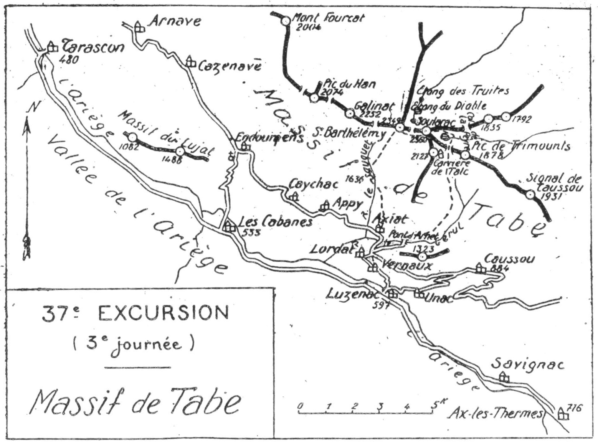

<style>.centre {text-align: center}</style>
<style>.droite {text-align: right}</style>

-----------------------
[//]: # (— p. XX —)

— p. 461 —

# TRENTE-SEPTIÈME EXCURSION

Trois jours aux Environs d'Ax-les-Thermes
(2° Série)

_B. E. — Du 15 Juin au 15 Octobre._

Cartes à emporter : Perles et Ax-les-Thermes.

(Voir page 450 la Carte d-s Envirnns d'Ax-lec-Thermes).
(Voir page 466 la Carte du Massif de Tabe).

## PREMIÈRE JOURNÉE

__D'AX (716m) aux GRANGES de MONTMIJA (1.400m),__\
__par la Dent d'Orlu (2.220m).__

—— SANS GUIDE ——

__Conseils.__ — __Itin. recomm.__ — Comme il faut prendre des vivres
pour deux jours, on pourrait louer un porteur qui irait attendre
la caravane aux granges de Montmija et organiserait le coucher.
Dans ce cas, on ne mettra dans son sac que ce qui est nécessaire
pour la journée, ce qui permettra de faire l'ascension plus
à son aise.

On prendra, en amont de l'église, le vieux chemin du Col de

<div class="page"/>

— p. 462 —

la Dent d'Orlu (1).

Paillères qui suit la rive g. de la Lauze jusqu'aux Forges d'Ascou
(1.080m), où il passe rive dr.; 300 m. en amont des forges, on laissera, 
à g., la route qui monte au Col de Pradel.

Continuant direction*E., on suivra celle qui longe la vallée de
la Lauze par la rive dr. jusqu'au pont Jean-Louis (1.230m) qu'il
faut passer pour monter au S., à travers la forêt. Plusieurs lacets
d'un sentier à pente rapide conduisent à l'entrée des pâturages
de Cabane-Longue d'En-Bas où apparaît, pour la première fois.

Vue de ce point, s'estompant très haut dans le ciel, cette cime
a grande allure. Plus un seul instant, on ne perdra de vue ce
beau pic dont l'attirance croît à mesure qu'on s'en approche.

Après avoir traversé les premières pelouses, on obliquera un
peu à g., vers le torrent que l'on franchira sur un pont en troncs
de sapins, et on continuera l'ascension jusqu'aux pâturages de
Cabane-Longue d'En-Haut.

Sur sa g., une colline gazonnée sépare le vallon de Cabane-
Longue de la vallée de Gabantsa; sa croupe, qu'on nonïme Coumeil
de Brasseil, monte directement jusqu'au pied de la Dent
d'Orlu. On s'élèvera itisensiblement sur sa face O., afin de gagne:
la crête. Un petit sentier passe près d'un bouquet de hêtres, sous
lequel on trouve la dernière fontaine.

Parvenu en haut du Coumeil de Brasseil, au point où la pente
se redresse subitement, on déposera le sac.

L'ascension dé la Dent d'Orlu se fait par la face N.-N.-E.; elle
est rude, mais elle est des plus faciles et sans danger. "

Le sommet principal aui est entouré de précipices verticaux
sur trois faces, peut à peine contenir une douzaine de personnes.
C'est, sans doute, de sa forme, qui rappelle une gigantesque canine
que lui vient le nom de « Dent d'Orlu ». Son belvédère est
de toute beauté et son panorama très étendu.

On domine verticalement les forges d'Orlu de 1.300 m. et, plus
au S., on aperçoit le beau lac de Naguilles visité la veille.

A PO. de la Dent d'Orlu, un peu en contrebas, on remarquera

———\
(1) Ce sommet porte dans les cartes le nom de Pic de Brasseil.

Plusieurs pyrénéistes en ont tenté, en vain, l'ascension par la
face S. Elle a été réussie pour la première fois, je crois, par nos jeunes
camarades, Jean Arlaud et Raoul Rives, le 28 juin 1914, pendant que
j'y conduisais une caravane par la face N.-N.-E., et qu'un vieil isard
solitaire nous narguait du haut de la crête.

<div class="page"/>

— p. 463 —

(37me EXCURSION) GRANGES ne MONTMIJA 463

l'aiguille hardie qu'on nomme « Capucin d'Orlu ». Jusqu'en 1922,
plusieurs pyrénéistes, et notamment le .vicomte d'Ussel, en
avaient vainement tenté l'escalade. La première ascension en «à
été réussie le 3 juin 1923 par deux membres de la Section des
Pyrénées Centrales : Pierre Mengaud (leader) et Louis Tisseyre.

De la Dent d'Orlu, on pourra repérer presque en entier le trajet
de l'excursion du lendemain au Tarbézou, ainsi que celui de
Fascension prochaine au Puig Prigue. Puis, tout près, au S.-E..
on apercevra très distinctement la profonde échancrure de la
Porteille d'Orlu (2.277m).

Après avoir repris le sac, on continuera la descente, direction
N.-E., sur le versant de la vallée de Gabantsa où on trouve de
nombreuses sources. On franchira bientôt le torrent de Combe-
Grande pour rejoindre le sentier qui le longe par la rive dr. jusqu'à 
son confluent avec la Lauze (1.384m). Là, on laissera, à g., la
route d'Ax pour prendre, en face, celle du Col de Paillères; on la
suivra jusqu'aux granges de Montmija, qui ne sont qu'à quelques
min. et où l'on couchera.

Nota. — Du Coumeil de Brasseil, on peut rentrer à Ax dans

3h.30 par la voie d'ascension.

__Horaire de la Journée :__

```
D'Ax au Pont Jean-Louis .............. 2h.30 ;
Du Pont à Cabane-Longue d'En-Haut.... 1h.15 9h.30
De Cabane-Longue à la Dent d'Orlu...... 2h.15 } (Arrêts en sus).
De la Dent d'Orlu à Montmija.......... 3h.30
```
## DEUXIÈME JOURNÉE

Des GRANGES de MONTMIJA (1.400m) à Ax (716m),
par le Col de Paillères (1.972m) et le Pic de Tarbézou (2.366m),

—— SANS GUIDE ——

__Conseils.__ — __Itin. recomm.__ — On suivra, au N.-E., la route du
Col de Paillères en utilisant aans la partie supérieure les raccourcis
qui mèénent directement près du refuge du Col; vu de
ioin, celui-r1 à l'aspect d'une tour carrée (1972m), Là, on quit-

<div class="page"/>

— p. 464 —
Ces PIC de TARBEZOU : (B7me EXCURSION) :

tera la route pour tourner, à dr., au S.-O. On traversera d'abord
un plateau de pâturages, puis on montera par une croupe parsemée
de bruyères et de jispet, afin d'atteindre le flanc E. du
Pic de Mounégou (2.099m) qu'on laissera à dr. Ce dernier pic
dépassé, on reprendra la. crête de la croupe qui s'élève en pente
douce direction S., et on montera directement au Pic de Tarbézou
(2.366m) surmonté d'une jolie tourelle.

Le panorama du Tarbézou est immense ; il s'étend dû massif
de Madres à la Pique d'Estats. La vue sur la plaine, à l'E., est
magnifique, mais c'est surtout par les sommets de la grande
chaîne que l'œil est attiré. Si, de la tourelle, on s'avance un peu
vers le S.-E. jusqu'à l'extrémité d'un petit promontoire, on aperçoit
tout en bas, les trois jolis Etangs Noir, Bleu et de Rabassoles
qui sont les sources de la Bruyante.

On descendra ensuite, au S.-O., au Sarrat des Escales, où on
tournera à l'O. pour dégringoler, de terrasse en terrasse, jusqu'à
la vallée de Gabantsa. Là, on reprendra le sentier de la veille,
puis on laissera Montmija à dr. pour suivre la route qui descend
directement à Ax.

Parvenu aux Forges d'Ascou, on peut faire une variante en
suivant la grand'route pour passer au vill. de ce nom. Celle-ci.
longeant en corniche le flanc de la montagne, offre à la descente
un joli point de vue. A environ 1 k. en aval d'Ascou, on trouve,
sur la g., un petit sentier qui raccourcit de 1/2 h. et par lequet
on aboutit directement près de l'église d'Ax.

__Horaire de la Journée :__

```
De Montmija au Col de Paillères........ 2h. » | 8h
Du Col de Paillères au Tarbézou......... 1h.45 
Du Tarbézou à AXx............:........ 4h.15 } (Arrêts en sus).
```

<div class="page"/>

— p. 465 —

(37me EXCURSION) CARRIERES be TRIMOUNTS 465

## TROISIÈME JOURNÉE

Ascension du Soularac (2.360m) et du Saint-Barthélémy (2.349m),
par Trimounts, avec retour à Luzenac (5971m)
par le ravin du Sauquet, Axiat et le Col de Lordat.

—— SANS GUIDE ——

<u>__AVIS AUX TOURISTES__</u>
On peut faire l'ascension du Soularac à la suite de n'importe
quelle excursion ariégeoise, à la condition d'aller coucher la
veille à Luzenac; mais, pour lui conserver toute sa splendeur,
il vaut mieux l'effectuer .la dernière. Si, parvenu au sommet,
on jouit d'une journée claire, on aperçoit, non seulement presque
tout le pays parcouru du Cagire au Tarbézou, mais encore
les hautes cimes de la grande chaîne situées entre ces deux
montagnes. |

__Conseils.__ — __Itin. recomm.__ - - On quittera Luzenac à # h., heure
solaire, car pour la plus grande chance du joli point de vue, il
faudrait être au Soularac vers 10 h. De plus, si on doit rentrer
à Ax pour dîner, ou encore, si on doit prendre le train vers la
plaine, le temps sera limité; cette excursion est, en effet, l'une
des plus longues de cette région.

On partira par le vill. de Vernaux et, en amont de celui-ci,
on laissera Lordat et son château à g. pour monter au N.; c'est
par un sentier assez rapide qu'on aboutit au Col de Lordat où on
rejoint la jolie route de Caussou à Axiat (1). Quelques min. après.
on quittera cette dernière pour prendre à l'E. celle qui remonte
la rive g. du Gérul jusqu'au Pont d'Arnet. Là, la route se transforme
en chemin muletier et, après avoir franchi le pont et fait
deux lacets, suit la direction N.-E.; c'est le chemin direct des
carrières de Trimounts (1.800m). Après 1 h. d'ascension, ce dernier
tourne insensiblement vers le N. en laissant à dr. la jasse
de la Lauze. A partir de là, on ne peut plus se tromper, car on
a pour guides les câbles auëériens par lesquels descendent les
bennes qui portent le tale à Luzenac. On n'a qu'à monter parai-
———\
(1) V. 30me E., p. 391.

<div class="page"/>

— p. 466 —

37: EXCURSION
( 3° journée )
Massif de TRADE | e 22 52 pts rem"



lèlement à eux pour aboutir, sans erreur, aux carrières de talc
qu'il faut traverser. :

L'itinéraire que j'indique à partir de Trimounts ne figure dans
aucun guide et, comme conséquence, est peu pratiqué par les
touristes; il est cependant le plus direct et aussi le plus intéressant

Du haut des carrières, à g, on montera au N. au col de Trimounts
d'où on découvre le versant de Montségur. Près de la
cabine téléphonique, on trouve l'amorce d'un petit sentier qui
part à flanc E. de la montagne de Soularac, à travers des rhododendrons
et qui passe bientôf sous la cascade qui descerid de
V'Etang Tort. Il grimpe ensuite sur un ressaut rocheux au haut
duquel il fait un crochet à g. pour conduire, dans quelques min.
près de l'étang. L'Etang Tort, à forme imprécise, constitue pour
le touriste une agréable surprise; ce petit lac, suspendu à flanc
de montagne, dans un site charmant, est vraiment plein d'attrait.

On contournera ce dernier par la dr. et on zigzaguera les

<div class="page"/>

— p. 467 —

(37me EXCURSION) SOULARAC - SAINT-BARTHELEMY 467

pentes gazonnées pour monter à un petit col d'où on découvre
toute la plaine vers le N.

On sera dominé sur la g. par une pointe secondaire du
Soularac; le véritable sommet est derrière, plus à l'O. On n'aura
plus qu'à s'élever par une marche de flanc, versant N., en passant
à la base de cette pointe qu'on laissera à g. On aboutira
par là au petit col qui sépare les deux cimes et, 5 min. après,
on arrivera au sommet principal du Soularac (2.360m). Au cas
où le flanc N. du sommet secondaire serait garni de neige, il
vaudrait mieux le contourner par lesS.

Un monolithe de 4 où 5 m. surmonte le Soularac; sa pointe,
où il n'v a de place que pour deux ou trois personnes, est le point
culminant du massif de Tabe (1).

Par son isolement et son grand éloignement de la grande
chaine (20 k. environ), le Soularac est un belvédère de tout premier
ordre. La vue s'étend du Pic de Midi de Bigorre au Canigou
et embrasse toutes les cimes ariégeoises. On « sous les yeux les
plaines de Toulouse et de l'Aude, et on domine merveilleusement
les vallées ariégeoises de l'arr. de Foix, surtout celles qui descendent
au N.

Pour passer du Soularac au Saint-Barthélémy, on n'aura qu'à
descendre en biais d'une cinquantaine de m. sur la face S. et à
marcher à flanc, direction O. afin d'aboutir au col qui sépare
les deux sommets et nomimé Pas de T'Ours. Un peu en contrebas,
au N.. on apercevra un petit lac au bord duquel on pourra déjeuner; 
il s'écoule au N., sur les étangs du Diable et des Truites.
Du col, on montera à toute crête et, dans 1/4 d'h., on atteindra
la cime du Saint-Barthélémy (2.349m).

Le panorama du Saint-Barthélémy est sensiblement le mème
que celui du Soularac, sauf vers l'E. que ce dernier masque en
partie. On ne s'explique pas que tous les guides aient indiqué
le Saint-Barthélémy comme principale ascension, alors qu'elle
n'est que le complément de celle du Soularac. Pour moi, c'est
tout simplement une variante pour descendre à Luzenac par ur
chemin différent de celui de l'ascension.

(1, C'est par erreur que les cartes cotent le Soularac 2.343 m. au
lieu de 2.360 m. plaçant ainsi le point culminant au Saint-Barthélémy
qui n'est qu'à 2.349 m. V. note rectificative à La Monlagne, année
1914, p. 165.

<div class="page"/>

— p. 468 —

488 © AXIAT — LUZENAC (Sime EXCURSION) ,

On quittera le sommet par les pentes faciles du versant S. s. A.
et, 3/4 d'h. après, on se dirigera droit au S., afin de rejoindre le
sentier du col de Girabal en amont de la forêt des Estellades:
(1.636m). On marchera à travers des bruyères, des rhododendrons
-et des genévriers, mais surtout du jispet. Cette dernière. plante,
si désagréable à la montée, ne gêne nullement à la descente.

Vers le fond de la grand pente, on franchira un dernier ressaut
et, 1/4 d'h. après, on arrivera à la forêt sur les bords du
 Sauquet. On longera ce ruisseau pendant quelques min. et bientôt,
on rejoindra, sur la rive dr., un chemin muletier qui vient de
l'O. et qui le franchit un peu plus bas. A partir de là, il descend
directement à Axiat par la rive. g. du vallon et en évitant le
ravin du Sauquet par un crochet vers l'E. A Axiat, on prendra
la route de Caussoü et, 20 min. après, on rejoindra l'itinéraire
d'ascension au Col de Lordat. On n'aura plus qu'à rentrer à
Luzenac où l'on prendra le train pour aller coucher à Ax ou filer
vers la plaine. .

__Horaire de la Journée :__

```
De Luzenac aux Carrières de Trimounts. 3h.30
Des Carrières de Trimounts au Soularac. 1h.45 9h.45
Du Soularac au Saint-Barthélémy....... O0h.40 } (Arrêts en sus).
Du Saint-Barthélémy à Luzenac......... 3h.50
```
