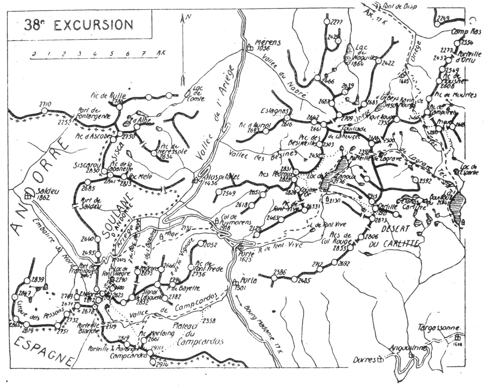

<style>.centre {text-align: center}</style>
<style>.droite {text-align: right}</style>

[//]: # (— p. 469 —)

# TRENTE-HUITIÈME EXCURSION

__Cinq jours au départ d'Ax-les-Thermes__

(N°28 de la 1re édition)<br>
_BE, — Du 1 Juillet au 15 Septembre._

Cartes à emporter : Perles, Ax et Saillagouse.

__D'AX-les-THERMES à BOURG-MADAME, par Mérens,__<br>
__la Vallée du Nabré, le Pic de l'Etang-Faury,__<br>
__le Refuge d'En-Beys, le Pic de Prigue, la Bouillouse,__<br>
__le Lac de Lanroux, le Pic Pédroux, le Carlitte,__<br>
__le Col de Puymorens, le Lac de Font-Nègre,__<br>
__les Sources de l'Ariège, le Pic Nègre d'Embalire__<br>
__et le Campcardos.__

__<u>AVIS AUX TOURISTES</u>__

Il n'existe pas à Ax des guides connaissant l'excursion en
entier, mais on peut trouver en cours de route, en cas de brouillard
des auxiliaires précieux parmi les nombreux bergers de
la Haute-Ariège. Pour une modique rémunération, ils accompagneront
la caravane sur une fraction du parcours, au cas où
on aurait des doutes sur la meilleure voie à suivre. Comme il
faut prendre des provisions pour trois jours, le mieux est de
louer un porteur qu'on gardera jusqu'au Lac de Lanoux.

C'est M. le docteur Gomma, à Ax, qui est le détenteur de la
clé du refuge d'En-Beys; on s'entendra avec lui à ce sujet.

<p class="droite">(Voir ci-contre la Carte de l'Excursion).<br>
(Voir aussi la Carte des Environs d'Ax, p. 450).</p>

<div class="page"/>

— p. 470 — D'AX-LES-THERMES A BOURG-MADAME (38me EXCURSION)

****



<div class="page"/>

— p. 471 — (38me EXCURSION) MERENS — VALLEE du NABRE

****

## PREMIÈRE JOURNÉE

__D'AX (716m) au REFUGE d'EN-BEYS (1.950m), par Mérens (1.056m),__<br>
__la Vallée du Nabré ét le Pic de l'Etang-Faury (2.709m).__

—— GUIDE UTILE ——

__Conseils.__ — __Itin. recomm.__ — On partira par le premier train,
ou encore en auto, afin d'arriver à Mérens au plus tard à 7 h.
On pourra, au passage, louer un mulet pour faire monter les sacs
jusqu'à la Jasse de Madidès-d'en-Haut, vers 2.200 m. d'alt.

Repartant par Mérens-d'en-Haut, on remontera au S.-E., par
la rive dr., la vallée rocuilleuse du Nabré jusqu'à la cascade
du Nabreil (1.705m). Là, on franchira le torrent pour passer
rive g., et bientôt on parviendra à la jasse de Présassé (1.820m),
au confluent du ruisseau de l'Estagnas. De ce point, on aperçoit,
au N.-E., la Porteille de l'Etang Tort. Quelques min. plus haut,
on laissera à g. le ruisseau qui descend du petit lac de Parade.
A partir de ce point, le paysage change. On quitte la rocaille
pour de beaux pâturages et la vallée, jusqu'alors très étranglée,
s'élargit en un immense cirque entouré de belles cimes. L'ascension
se continue par la rive g. du Nabré, et le sentier monte
direction S.-E., pour aboutir à la jasse de Madidès-d'en-Bas,
entre le premier lac (2.140m), à g., et le deuxième (2.160m), à
dr. Il se poursuit à travers les pâturages de la jasse de Madidès-
d'en-Haut, puis, après avoir laissé en contrebas, à g.. le grand
lac de Madidès (2.200m), fait un crochet, à dr., pour atteindre
le lac supérieur (2.395m). On arrive là au pied du pic de l'Etang
Faury qu'on aperçoit droit devant soi, à l'E., et on est à 1/2 h.
de la Porteille de Madidès (2.563m), ouverte au S. du pic (1).

On montera en écharpe en laissant la Porteille un peu à dr.,
afin de rejoindre l'arête le plus près possible du sommet et on
continuera à toute crête.

Le Pic de l'Étang Faury (2.709m) s'élève au point de jonction
de trois crêtes, au centre de l'un des plus jolis coins de la haute

———<br>
(1) Le qualificatif de « Porteille » est impropre pour un si large
col, c'est plutôt Couillade de Madidès qu'il faudrait dire, puisque le
mot « Porteille » signifie une brèche, un étroit passage.

<div class="page"/>

— p. 472 — PIC de L'ETANG-FAURY (38me EXCURSION)

****

Ariège. Ses abords immédiats sont splendides. Des vallées se
creusent dans toutes les directions et, entre elles, les crêtes
sinueuses portent sur leur échine un grand nombre de petits
sommets des plus intéressants. Partout, de grands et de petits
lacs avec des ruisseaux qui courent d'une nappe à l'autre.

On a sous les pieds les étangs des Peyrisses au N.-E., et, par
la Couillade de Lanouzet, au S., on aperçoit presque en entier
le grand étang de Lanoux. Tous les hauts sommets de la région,
Rulle, Pédroux, Carlitte, Prigue, etc., etc., ont l'aspect de grands
pics dépassant 3.000 m.

A 10 min. à l'E. du pic principal, existe une deuxième cime
d'alt. presque égale et de laquelle on jouit d'un meilleur point
de vue sur le Lanoux et sur la haute vallée de l'Oriège. On
n'aura qu'à descendre d'une cinquantaine de m. sur le versant S.
pour passer à la base de la brèche qui les sépare, et à remonter
à flanc jusqu'au deuxième sommet formé par une crête facile. On
continuera ensuite vers l'E., à flanc S. de montagne, pour aboutir
environ 400 m. au S. du Col de Beys (2.355m) (V. 36° E., p. 459).

Pendant ce trajet, on jouit d'une belle vue sur la haute vallée
de l'Oriège et le massif de Lagrave. On aperçoit la source de
l'Oriège, l'Etang-Faury et le grand Etang d'En-Beys dont une
partie des eaux s'écoule sur le lac de Naguilles par le tunnel
qu'on vient de percer.

Du pic de l'Etang-Faury, on pourrait aussi descendre au
N.-E. jusqu'au fond de la vallée et suivre cette dernière jusqu'au
lac d'En-Beys; le chemin ne serait pas meilleur, et on serait
privé des jolis points de vue qui défilent pendant le trajet à
flanc de montagne.

Parvenu en aval du col de Beys, on descendra, d'abord, au S.,
à travers des pentes gazonnées, puis, en faisant un petit crochet
à dr., afin de rejoindre un petit vallon qui tourne définitivement
à l'E. On aboutira par là au S.-O. et en amont du lac d'En-Beys,
qu'on n'aura plus qu'à longer par la rive g. jusqu'au refuge.

Du col de Beys au refuge, on aura fait en sens inverse le trajet
de la quatrième journée de la 36° E. (V. p. 459).

__Horaire de la Journée :__

```
De Mérens au Pic de l'Etang-Faury..... 5h.30 }   8h.30
Du Pic de l'Etang-Faury au refuge d'En-      }
  Beys.................................3h. » } (Arrêts en sus).
```

<div class="page"/>

— p. 473 — (38me EXCURSION) PORTEILLE D'ESPAGNXE 

****

## DEUXIÈME JOURNÉE

__Du LAC d'EN-BEYS (1.950m) à LA BOUILLOUSE (2.014m),__<br>
__par la Porteille d'Espagne (2.460m) et le Pic de Prigue (2.810m).__

—— GUIDE UTILE ——

__<u>AVIS AUX TOURISTES</u>__

La grande Pique Rouge (2.730m) projette au N. un contrefort
qui descend jusqu'aux rives de l'Oriège, en amont de la Jasse
de Gaudu. A mi-hauteur de ce contrefort, vers 2.300 m. d'alt.
existe une dépression qui forme un petit replat; c'est par cette
dépression qu'il faut passer pour aller du Lac d'En-Beys à la
Porteille d'Espagne. Pour ce trajet. consulter la carte des
« Environs d'AX », p. 450.

__Conseils.__ — __Itin. recomm.__ — On partira par le sentier qui
redescend aux Forges d'Orlu, et on le suivra jusqu'au petit col
situé à l'extrémité N.-E. du lac. Là, on montera en diagonale,
direction E. vers la dépression du contrefort N. de la Pique
Rouge. Du balcon suspendu de la Roche de Balussière, on aperçoit
très bien cette dépression légèrement gazonnée.

Le contrefort passé, on continuera presque horizontalement
à flanc de montagne, en inclinant légèrement au S., afin d'aboutir
au-dessus du petit lac situé au ravin supérieur de Mourtés qu'on
nomme « Coumette d'Espagne ». Pendant ce trajet, on aura, tout
en haut et devant soi, la large échancrure de la Porteille d'Espagne
et on pourra en repérer toute la voie d'ascension par
un couloir étroit et rapide.

Après le petit lac, la pente s'accentue par un terrain rocailleux,
et l'ascension du couloir qui mène à la Porteille est une véritable
escalade de cheminée qu'il faudra effectuer en rang serré.

La Forteille d'Espagne est située sur la ligne de partage des
eaux d'Europe, entre le Pic de Camporeils, au N.-E., et la Pique
Rouge (2.730m), à l'O.; ce large col servait de passage frontière
avant le traité des Pyrénées qui nous à donné la moitié de la
Cerdagne. On a sous les yeux : au N., la profonde vallée de
l'Oriège dont les eaux s'écoulent vers l'Océan et, au S. les
sources de la Tet qui descend à la Méditerranée. Presque sous
ses pieds. au S. de la Porteille, brille l'étang supérieur de la

<div class="page"/>

— p. 474 — PIC de PRIGUE (38me EXCURSION)

****

Coume de la Tet, source principale de ce fleuve. Pour aller d'Ax
à la Cerdagne par la montagne, on ne peut choisir une plus
belle voie.
Le Pic de Prigue (nommé aussi Puig Péric), objet principal
de l'excursion, n'est pas situé sur la grande crête. C'est le point
culminant d'un chaînon qui se détache de la chaîne principale,
au S.-E. du Pic de Camporeils. Comme son rival, le Carlitte, ce
pic est catalan. De la Porteille d'Espagne; on peut en repérer la
voie facile d'ascension. On n'a qu'à prendre le chemin de descente
vers le S., en laissant le lac supérieur à dr., et à suivre
le sentier environ 10 min. seulement. On apercevra alors, sur
la g., un large couloir d'éboulis qui monte directement vers la
crête du Prigue et la rejoint à 5 min. au N. du sommet. Cette
ascension n'offre pas la moindre difficulté et, dans 1h.10, on
ira de la Porteille d'Espagne au sommet du Prigue (2.810m).

Sauf par le versant N.-E., très difficile à gravir, le Prigue est
accessible par toutes ses faces. Son belvédère est de tout premier
ordre. De tous les sommets environnants, seul, celui du Carlitte
peut lui être comparé.

On domine une merveilleuse région faite toute de contrastes.
Au N.-E., le regard plane sur le haut plateau boisé de Camporeils
constellé de nombreux lacs; à l'O., il plonge sur les vertes
pelouses de la Coume de la Tet et du vallon de Lagrave, où s'étagent
de grands et de petits étangs; enfin, au S. et au S.-O., s'étalent
la grande Bouillouse et le désert du Carlitte, lui aussi parsemé
de nombreux lacs. Partout et dans toutes les directions, ce
ne sont que nappes vertes et bleues : là, au milieu de sombres
forêts; ici, à travers des pentes fleuries, et, là-bas, au centre d'un
monde rocailleux. Cette situation est unique dans les Pyrénées.

Les lointains ne sont pas moins intéressants. De l'E. à l'O.
défilent en arc de cercle : le Capcir, le massif de Madres, la
chaîne catalane, du Canigou au Puig d'Alp, la Cerdagne et toutes
les cimes ariégeoises jusqu'aux monts luchonnais.

Autrefois, on pouvait descendre directement au déversoir de la
Bouillouse en longeant le ruisseau de Prigue et la rive g. du
grand étang; mais, depuis la construction du barrage qui a
transformë ce marais en un immense réservoir, rétablissant ainsi
l'un des plus grands lacs des Pyrénées, le sentier de la rive g.
a été en partie submergé. On fera donc bien d'aller rejoindre, en

<div class="page"/>

— p. 475 — (38me EXCURSION) LA BOUILLOUSE

****

amont de la Bouillouse, le sentier qui descend de la Porteille
d'Espagne el d'arriver au déversoir par la rive dr.

A 800 m. à l'E. du grand pic, s'élève le petit Prigue (2.669m),
séparé du grand sommet par une large dépression d'accès très
facile. On descendra donc à toute crête, à l'E., jusqu'à moitié
chemin du petit pic et on dégringolera ensuite, droit au S., par
le vallon de Prigue jusqu'à 10 min. en amont de l'étang de la
Llose. Là, on trouve un sentier qui tourne à l'O., pour passer
à la base du contrefort S. du Pic de Prigue et qui rejoint, 1/4 d'h.
plus bas, celui qui descend de la Porteille d'Espagne.

Bientôt après, la Tet incline au S.-O. vers le vallon de Lagrave.
tandis que le sentier s'en détache en se dirigeant au S.-E. pour
faire un crochet vers le lac d'Esparbé qu'on laissera à g. On descendra
par des pelouses, droit au S., afin d'aboutir à un petit
pont qui fait franchir la Tet en amont de la Bouillouse, entre
cette dernière et le petit marais situé à l'entrée du vallon de
Lagrave. Dans quelques min., on rejoindra le grand chemin qui
longe la Bouillouse par la rive dr. jusqu'au déversoir.

A la Bouillouse, on trouve maintenant 30 lits, des dortoirs et
des provisions tarifées au Chalet-Hôtel du Touring-Club.

__Horaire de la Journée :__

```
Du lac d'En-Beys à la Porteille d'Espagne. 2h.15 }
De la Porteille au Pic de Prigue.......... 1h.10 }    6h.
Du Pic de Prigue à La Bouillouse.......... 2h.35 } (Arrêts en sus).
```

## TROISIÈME JOURNÉE

__De LA BOUILLOUSE (2.014m) au LAC de LANOUX (2.176m),__<br>
__par le Vallon et la Porteille de Lagrave (2.397m),__<br>
__le Col des Bésineilles (2.450m) et les Pics Pédroux (2.831-2.828m).__

—— SANS GUIDE ——

__Conseils.__ — __Itin. recomm.__ — On reprendra le chemin qui longe
la Bouillouse par la rive dr. et, parvenu en amont, on tournera
à g., au N.-O., pour remonter le vallon de Lagrave en entier.

Quoique les cartes indiquent le sentier sur la rive g., on ne
franchira pas le torrent et on restera constamment sur la rive dr.

<div class="page"/>

— p. 476 — COL des BESINEILLES (38me EXCURSION)

****

Parvenu en haut du vallon, au point où celui-ci se transforme
en cirque, on laissera à dr. le sentier qui grimpe dans son axe
au Col de Lagrave (2.500m), et on prendra, à g., celui qui monte
vers l'O. jusqu'à l'Estagnol. Ce petit étang est situé au pied de
la Porteille de Lagrave (2.397m). Echancrée au S. du Pic de
Lagrave (2.688m), sur la crête qui relie ce sommet au Carlitte, la
Porteille de Lagrave fait communiquer le vallon de ce nom avec
le Lac de Lanoux.

On peut passer sur les deux rives de l'Estagnol et un petit
sentier monte à la porteille d'où on jouit d'un magnifique point
de vue vers l'O. et sur le Lanoux.

De la Porteille de Lagrave, on repèrera en entier l'itinéraire
de la journée jusqu'au sommet du Pédroux, par les deux petits
étangs de Lanouzet, le col et la crête des Bésineilles. On descendra
droit à l'O., et bientôt, on laissera, à g.; le sentier qui
longe le Lanoux par la rive E. On n'arrivera pas jusqu'au grand
lac; mais, en se maintenant à une certaine hauteur, on contournera
le haut du bassin par la dr., afin de passer au déversoir
du Lanouzet oriental, ainsi qu'à celui du Lanouzet occidental.
Par cette marche à flanc de montagne, on perdra peu d'alt., tout
en passant au pied de la Couillade de Lanouzet (1).

Après avoir franchi le déversoir du Lanouzet occidental, on
montera en écharpe, à travers des pâturages, direction S.-O.
pour aboutir au Col des Bésineilles (2.450m), situé à environ 1 k.
au S. du Pic de Bésineilles (2.503m). On retrouvera là la ligne
de partage des eaux d'Europe qu'on a franchie, la veille, à la
Porteille d'Espagne, et on la suivra jusqu'au sommet des Pics
Pédroux.

Si on ne garde pas le porteur pour le reste de l'excursion, c'est
du Col des Bésineilles qu'il faut le renvoyer; cela lui permettra,
en descendant par la vallée des Bésines, de rejoindre la route
à la cascade de Saillens et de rentrer le soir même à Ax.

Du Col des Bésineilles, on suivra la crête qui file presque horizontalement
direction S.-O. Elle ne prend une pente rapide qu'au
moment où elle tourne à l'O., pour grimper directement au
Pédroux N. (2.831m). Ce trajet, qui n'offre pas de difficulté, est
des plus intéressants. On domine constamment les deux cirques

———<br>
(1) La carte d'Etat-Major appelle ce large col : Porteille de la
Serre Blanche.

<div class="page"/>

— p. 477 — (38me EXCURSION) PIC PEDROUX

****

du Lanoux et des Bésines, et, lorsqu'on arrive au sommet du
Pédroux N., on jouit de lun des plus jolis belvédères de la
contrée. La vue sur le Lanoux y est bien plus complète que du
Carlitte.

En parcourant la crête des Bésineilles, on comprend combien
ont raison les agents des Ponts et Chaussées en demandant qu'on
fasse écouler les eaux du Lanoux en Ariège par la vallée de
Mérens. En effet, un simple tunnel de 1.500 ou 1.600 m. permettrait
de conserver à la France cette immense réserve de houille
blanche. La force produite pourrait ainsi être utilisée un grand
nombre de fois jusqu'aux plaines de Toulouse, tandis qu'en
s'écoulant par la vallée de Carol, elle est perdue pour la France,
puisqu'elle passe en Espagne après un parcours de quelques k.

Le massif du Pédroux comprend, d'abord, les deux cimes N.
et S. (2.831-2.828m), distantes de 300 ou 400 m., puis, un troisième
sommet, le Pic de la Coume d'Or (2.826m), situé 700 m. plus au S.
Une simple dépression sépare les deux Pédroux, et on peut afler
d'un pic à l'autre, à toute crête, dans 20 min. environ. Grâce à
leur haute alt. et à leur situation isolée, on jouit aux deux
Pédroux d'un magnifique point de vue, surtout sur les abords
immédiats. C'est sur leurs cimes qu'il faut monter pour apercevoir
le lac de Lanoux dans toute sa splendeur.

Par sa forme spéciale, qui est celle d'un violon, et sa grande
superficie de 110 hectares, le Lanoux est l'un des plus remarquables
des grands lacs pyrénéens. Il mesure 3 k. de long sur
4 à 500 m. de large et 60 m. de profondeur. Un petit sentier
en fait le tour. Malgré sa haute alt. (1), on y pêche en abondance
des truites saumonées qui, tous les étés, font les délices des
baigneurs d'Ax.

Droit au S.-E., de l'autre côté du lac et faisant pendant aux
Pédroux, se dresse, majestueux, l'imposant Carlitte. On en peut
repérer en entier la meilleure voie d'ascension. Dans l'axe et
verticalement au-dessus du petit lac rond des Fourats, lac inférieur
situé au N. de l'autre, grimpe un couloir d'éboulis qui
rejoint la crête du Carlitte entre les deux sommets. Des Pédroux.
on peut, à la lorgnette, en examiner tous les détails, ce qui

———<br>
(1) Les cartes cotent le Lanoux à 2.154 m. mais des nivellements
récents ont élevé l'alt. de ses eaux à 2.176 m.

<div class="page"/>

— p. 478 — LAC de LANOUX (38me EXCURSION)

****

permettra d'en faire l'ascension le lendemain, même avec du
brouillard.

La descente des Pédroux au Lanoux est des plus simples. A l'E.
de la dépression qui sépare les deux sommets, prend naissance
un petit vallon qui décrit bientôt une courbe vers le S. et, finalement
reprend la direction E. pour aborder au S.-O. du lac. On
n'aura qu'à le suivre en longeant le ruisseau dans la partie inférieure
On trouve, d'ailleurs, des lambeaux de sentiers.

On peut coucher dans deux endroits au Lanoux : 1° à la cabane
du pêcheur Barnole qui est située au S. du lac, tout près du
déversoir, sur la rive dr.; 2° au Refuge du Lanoux (2.130m),
maison bâtie par les Ponts et Chaussées à 7 ou 800 m. au S. du
lac, sur une pente rocheuse de la rive g. du ruisseau de Font-
vive. Ce refuge ne figure sur aucune carte et, pour y coucher,
il faut l'autorisation de l'administration qui en détient la clé.
Pour s'y rendre, on suivra le sentier qui longe la rive dr. du
déversoir jusqu'en amont de la cascade, où on franchira le
torrent sur une passerelle en bois. De là, un chemin presque
horizontal, qui file vers l'E., conduit au refuge dans 10 min.
environ.

Le Touring-Club a déposé huit couchettes au Refuge du Lanoux
mais elles sont sans utilité s'il n'est pas habité en ce
moment-là ou si on n'en à pas la clé. On fera bien de se renseigner
à l'avance.

Au S.-O. du lac, près du ruisselet qui descend des Pédroux.
existe une petite cabane où, à la rigueur, on peut coucher deux.
ou trois. Mais elle est si petite et si souvent en mauvais état que
je la signale simplement à titre de renseignement.

__Horaire de la Journée :__

```
De la Bouillouse à la Porteille de Lagrave. 3h.15 }
De la Porteille de Lagrave aux Pics Pé-           }    8h. » 
  droux.................................... 3h. » } (Arrêts en sus).
Des Pics Pédroux au Lanoux................. 1h.45 }
```

<div class="page"/>

— p. 479 — (38me EXCURSION) LE CARLITTE

****

## QUATRIÈME JOURNÉE

__Du LAC de LANOUX (2.176m) à PORTÉ (1.623m),__<br>
__par le Carlitte (2.915-2.921m) et l'Etang de Font-Vive.__

—— SANS GUIDE ——

__Conseils.__ — __Itin. recomm.__ — Dans la matinée, on fera l'ascension
du Carlitte sans sac. On emportera simplement un casse-
croûte dans sa poche. l'indique l'itinéraire au départ de la cabane
du pêcheur, c'est-à-dire au S. mème du lac, au commencement
du déversoir. Si on à couché au refuge, on montera droit au N.,
en franchissant deux petites crêtes rocheuses, afin de rejoindre
l'itinéraire à 1/4 d'h. à l'E. de la cabane.

A quelques m. au S. du lac, en face de la cabane du pêcheur.
un alignement de grosses pierres et un long madrier permettent
de franchir le déversoir pour aller rejoindre, un peu sur la dr.
un vallon qui monte à l'E. et conduit diréctement sur la rive S.
du petit lac rond des Fourats (2.500m). Le sentier longe le ruisseau
du lac supérieur, mais environ 3/4 d'h. après le départ, on laisse
ce dernier à dr. et, en continuant vers l'E., on arrive. dans
10 min, sur la digue qui sépare le lac rond du ruisseau du lac
supérieur.

De ce point, on aperçoit devant soi le large couloir. incliné
à 45 ou 50°, qui grimpe droit au sommet du Carlitte. On se dirigera
vers sa base par une croupe facile et on l'attaquera en
écharpe vers la g., afin d'atteindre un terrain solide qui en longe
la rive N. L'ascension par les éboulis du centre du couloir serait
très dure, et il vaut mieux monter par les croupes de g. constituées
de rochers et de gazon et affectant la forme d'un escalier.

Le grand couloir se ramifie deux fois vers le N.; on coupera
ces couloirs secondaires pour rester en bordure du grand et, dans
la partie supérieure, on traversera ce dernier en diagonale, vers
la dr., afin d'aboutir à un replat situé sur le haut d'un contre-
fort O. du Carlitte. Brusquement, on découvre devant soi un
ravin rapide qui plonge, direction S.-O., vers le lac supérieur
et, un peu plus haut, à g., la brèche qui échancre la crête du
Carlitte, entre le sommet 2,915, au N., et le sommet principal
(2.921m) au S. On obliquera alors à g., et, par une marche à flanc,

<div class="page"/>

— p. 480 — COL du CARLITTE (38me EXCURSION)

****

en corniche, on contournera le haut du ravin pour aboutir directement
à la brèche du Carlitte. Dans 2 min., on fera, à g., le
sommet secondaire pour mieux jouir du magnifique spectacle
qu'on découvre vers l'E. en arrivant à la brèche.

Le Carlitte (Carlit en catalan) comprend deux pointes jumelles
distantes d'une quarantaine de m.; c'est au sommet S. (2.921m)
qu'est le point culminant des monts Catalans. On ira à toute
crête d'un pic à l'autre.

Le panorama du Carlitte est anaolgue à celui du Prigue sur
les montagnes ariégeoises et catalanes; mais il lui est supérieur
vers l'O., sur la grande chaîne, car, par un, temps clair, la vue
s'étend jusqu'aux Monts-Maudits. Les environs immédiats du
Prigue sont plus coquets, plus reposants, mais le belvédère du
Carlitte est plus grandiose.

Comme au Prigue, on aperçoit une quantité de lacs. Le désert
du Carlitte en recèle une douzaine et, en y comprenant les deux
grandes nappes de la Bouillouse et du Lanoux, c'est environ une
trentaine d'étangs qui font cercle autour du grand pic et en
illuminent tous les alentours. Il est indispensable de faire les
deux sommets pour les apercevoir tous.

Seul, le Lanoux est en partie masqué dans son centre par un
contrefort.

Que ceux qui croient qu'il n'existe plus de hautes cimes ni de
spectacles grandioses à l'E. du Montcaim, fassent l'ascension du
Prigue et du Carlitte. Ils constateront que, s'il y a des montagnes
plus imposantes, il n'en est pas de plus attrayantes.

Pour varier et compléter le spectacle, on descendra par le Col
du Carlitte qui s'échancre au S. du pic, à 2.660 m: d'alt. On n'aura
qu'à suivre la crête en se tenant de préférence sur le versant E.
Pendant ce trajet, on découvrira la partie de l'Etang Llat, invisible
du sommet du Carlitte, parce qu'elle est masquée par la
pointe secondaire (2.666m), située à l'E.-S.-E. du grand pic.

Du Col du Carlitte, on pourra dévaler, à l'O., par un ravin
d'éboulis qui plonge vers le lac supérieur des Fourats. Laissant
celui-ci à g., on se dirigera au N.-O. en longeant le ruisseau du
lac, afin de rejoindre, 1/4 d'h. plus bas, le chemin d'ascension.

Dans l'après-midi, on descendra à Porté par l'admirable sentier
en corniche que les Ponts et Chaussées ont construit sur les
pentes S. du Pic de Font-Vive. De la cabane du pêcheur, on longe

<div class="page"/>

— p. 481 — (38me EXCURSION) ETANGS de FONT-VIVE — PORTE

****

le torrent par la rive dr. jusqu'à la passerelle qui domine la
cascade. Là, alors que le torrent plonge dans les abîmes du fond
de la vallée, le chemin continue en pente douce et régulière à
une grande hauteur. On contourne plusieurs petits ravins et
contreforts; on passe verticalement au-dessus de l'Etang de Font-
Vive, et c'est en conservant constamment le magnifique point de
vue sur la profonde vallée qu'on rejoint en douceur la grand'
route, en amont de Porté, au tournant des cerisiers.

On descendra au fond du vill. et on ira coucher à l'hôtel Michette.

__Horaire de la Journée :__

```
Du Lanoux au Carlitte................ 2h.10 }  6h. »
Du Carlitte au Lanoux par le Col..... 1h.50 }
Du Lanoux à Porté.................... 2h. » } (Arrêts en sus).
```

## CINQUIÈME JOURNÉE

__De PORTÉ (1.623m) à BOURG-MADAME (1.140m),__<br>
__par le Col de Puymorens (1.918m), le Lac de Font-Nègre (2.290m),__<br>
__les Sources de l'Ariège, le Pic Nègre d'Embalire (2.812m)__<br>
__et le Pic de Campcardos (2.914m).__

—— GUIDE UTILE ——

> Nota. - Un service postal franco-andorran fonctionne entre
le bureau de Porté et le premier vill. andorran de Saldeu. Un
courrier à pied fait le trajet, entre ces localités, par le chemin
muletier des mineurs jusqu'au Pas de la Casa (2.075m); il passe
la frontière pour monter ensuite au port de Framiquel (2.445m),
et, de là, descendre à Saldeu par la vallée d'Embalire.
>
> Nous suivrons cet itinéraire jusqu'à la frontière, c'est-à-dire
jusqu'au Pas de la Casa. On peut aussi, depuis le Col de Puymorens
partir par la route nationale n° 20 jusqu'au Llata et
prendre la nouvelle route de l'Andorre; cette voie cest plus
longue et moins intéressante.

__Conseils.__ — __Itin. recomm.__ — Si on a besoin d'un guide pour
la journée, on le trouvera à Porté; mais, par un temps clair, on
s'oriente très bien dans cette région qui n'offre aucune difficulté.

De l'hôtel Michette, on se dirigera à l'O. pour rejoindre la
route, 5 min. après, en amont du pont. Immédiatement au-dessus,
on prendra le chemin de traverse qui monte, en 30 min., au Col

<div class="page"/>

— p. 482 — COL de PUYMORENS (38me EXCURSION)

****

de Puymorens (1.918m). On y jouit d'un magnifique point de vue
et on aperçoit, notamment au N.-O., une grande partie des crêtes
qui entourent le Cirque du Sisca (V. 35° E., p. 435).

Le chemin des mineurs s'amorce à g., en face de la maison
cantonnière. Il se dirige vers l'O., à travers des pelouses, pour
gagner en pente douce la croupe d'une serre à la cote 2.135. Là
aussi, le belvédère est magnifique sur Les alentours, surtout sur la
vallée de Mérens qu'on aperçoit en entier.

Continuant le ravissant trajet, on chemine presque horizontalement
à flanc de montagne, en coupant en écharpe plusieurs ravins
au fond desquels coulent des ruisseaux descendant vers
l'Ariège. Après avoir dépassé l'ancienne mine et franchi les
ravins du Baladra et du Bac del Moré, le chemin aboutit à la
nouvelle route d'Andorre qu'il rejoint au pont frontière du Pas de
la Casa (2.075m).

On trouve là, sur la rive g., deux cabanes dont une très confortable
mais fermée à clé, lorsque les bergers sont absents.

La route fait un crochet à dr. et, après de nombreux lacets,
franchit la crête du Port de Framiquel (2.445m) d'où elle descend
à Saldeu. On la quittera immédiatement après le pont, afin de
passer devant les cabanes et on se dirigera, droit au S., pour remonter
le cours de l'Ariège, par la rive g., jusqu'au Lac de Font-
Nègre (2.296m). Le site est splendide. Le Cirque de Font-Nègre
est dominé, au S., par le massif de ce nom comprenant plusieurs
sommets parmi lesquels le Signal de Lasquelle (2.852m) et le Pic
Nègre d'Embalire (2.812m); à l'E. par le Pic des Padrons (2.675m)
et, enfin, à l'O., par la crête qui forme la ligne de partage des
eaux d'Europe.

Tout près et baignant presque dans le lac, s'élève le Roc des
Porteilles qui n'est que l'extrémité relevée d'un chaînon secondaire
se détachant de la crête principale au S.-S.-O. du lac. Si je
signale ce chaînon, c'est parce qu'il faudra le franchir, tout à
l'heure, de l'O. à l'E., et aussi parce qu'il est probable que la ligne
frontière passe sur sa crête. Du haut du cirque, viennent de toutes
les directions des ruisselets qui convergent vers le lac : ce sont
les sept sources de l'Ariège. Le plus important descend du S.-O..
du petit cirque formé par le chaînon des Porteilles. Si on examine
attentivement l'état des lieux, on est tenté de croire que la
principale source de l'Ariège est en Andorre. En effet, toute la

<div class="page"/>

— p. 483 — (38me EXCURSION) LAC ET PORT DE FONT-NEGRE

****

rive g. de l'Ariège, qu'on appelle « la Soulane », appartenant à
l'Andorre jusqu'au lac de Font-Nègre, il est probable que la ligne
frontière passe sur la crête du chaînon des Porteilles.

Tout en haut, au S.-O. du lac, paraît, très escarpé, le Pic Nègre
d'Embalire (2.812m) dont l'ascension est des plus faciles par la
face E. C'est sur ce sommet qu'est le plus joli point de vue de la
contrée. Il est bien supérieur à celui du Signal de Lasquelle, plus
haut de 40 m. et bien plus pénible à gravir. On montera dans sa
direction en suivant le petit sentier qui longe la source principale
de l'Ariège jusqu'au point où ele disparaît, dans un cirque de
rocaille, au pied du pic. Là, il tourne à g. et on aperçoit les lacets
qui grimpent vers le petit Col des Isards, par lequel il franchit le
chaînon secondaire des Porteilles, vers 2.550 d'alt. Il redescend
quelques m. par la dr. pour passer dans la partie haute du grand
cirque et, tout de suite, on distingue, droit au S., la large échancrure
du Port de Font-Nègre (2.625m). Le sentier y conduit directement
dans 10 min. environ.

Le Port de Font-Nègre, qui est à angle droit du Col des Isards.
s'ouvre sur la grande chaîne de partage des eaux d'Europe, immédiatement
à l'E. du Pic Nègre (2.812m). Il fait communiquer la
vallée de l'Ariège avec celle de Campcardos. Presque sous soi, un
peu à dr. brille l'Etang de las Passadéras (1) et, un peu plus
loin, on aperçoit la Porteille Blanche d'Andorre (2.519m). On domine
tout le cirque verdoyant de la haute vallée de Campcardos.
et on a, en face, le grand pic de ce nom. On peut, à la lorgnette.
en repérer toute la voie d'ascension par la Porteille de Maranges.

On laissera le sac au port et, en 1/2 h., par des gazonnés faciles,
on fera, à l'O., l'ascension du Pic Nègre d'Embalire (2.812m). Cette
cime comprend deux pointes jumelles, d'alt. à peu près égale et
séparées par une profonde brèche. Il ne faut que 5 min. pour aller
d'un sommet à l'autre, et il est indispensable de faire les deux
pour jouir d'un panorama complet sur les environs immédiats.

Le premier sommet (pointe N.) est situé sur la grande chaîne;
le second (pointe S.) fait partie des chaînes secondaires qui se
détachent, à l'O. vers le Cirque dels Pessons et, au S., vers la

———<br>
(1) C'est par erreur que la carte d'Etat-Major place ce lac à 2.107
d'alt., dans la vallée de Campeardos. Il y a confusion; celui qui est
situé à 2.107 est le Lac de Campcardos, lac très peu profond et en train.
de disparaître.

<div class="page"/>

— p. 484 — PIC NEGRE D'EMBALIRE (38me EXCURSION)

****

Porteille Blanche d'Andorre. Si les faces E. et S. sont faciles, la
face N. des deux sommets est inaccessible, car elle plonge verticalement
de plusieurs centaines de m. sur la vallée d'Embalire
et son petit lac.

La situation privilégiée du Pic Nègre, au sommet de la vallée de
Campcardos et dans l'axe des vallées de l'Ariège et d'Embalire, en
fait un belvédère de premier ordre. Il est cependant à peu près
inconnu, et si on l'a cité dans quelques articles de montagne,
aucun guide n'en a indiqué l'itinéraire d'ascension, si facile
pourtant.

On a sous les yeux, tout près, le Cirque dels Pessons et on aperçoit
très distinctement 11 de ses 18 lacs: Le vill. de Saldeu semble
à deux pas, puis, un peu plus loin, paraît presque toute l'Andorre.
Vers le N.-O., l'œil prend en biais toute la grande chaîne ariégeoise
dont on peut identifier tous les grands pics. Enfin, au N,
les cimes de Fontargente et du Sisca s'entremêlent dans un décor
splendide.

Cependant, ce qui retient longuement l'attention, c'est la vallée
de l'Ariège qu'on aperçoit jusqu'en aval de Mérens, égayée tout le
long par la jolie rivière aux reflets argentés.

Le Campcardos qu'on aperçoit très bien du Pic Nègre n'a aucun
caractère d'un pic. C'est le point culminant d'un haut plateau de
pâturages, long d'environ 4 k., avec une pente moyenne de 15 %.
A dimensions égales, c'est certainement le pâturage le plus élevé
des Pyrénées, car les moutons montent pacager jusqu'au sommet
du Campcardos, vers 2.900 d'alt.

Plusieurs guides indiquent l'ascension du Campcardos par le
plateau, ce qui est, peut-être, plus court, mais sûrement plus éreintant
Mieux vaut, même en partant de Porta, remonter la vallée de
Campcardos jusqu'à 2.200 d'alt. et là, tourner au S., pour gagner
la crête à la Porteille de Maranges, à 1.500 m. au N.-O. du sommet
Sauf 1/4 d'h. d'escalade un peu rude, sur un flanc d'éboulis,
pour atteindre la porteille, cet itinéraire d'ascension fait monter
en pente douce et régulière jusqu'au pic. Il y a, d'ailleurs, un sentier
qui arrive au pied de la porteille.

Du Port de Font-Nègre, on distingue très bien la voie d'ascension
par la Porteille de Maranges, et c'est par là que nous allons
passer pour faire l'ascension du Campcardos. A 5 min. en contre-
bas du port, on laissera à dr. le sentier qui, par l'étang de las

<div class="page"/>

— p. 485 — (38me EXCURSION) PIC DE CAMPCARDOS

****

Passadéras, descend à la Porteille Blanche. On dégringolera à
travers les pelouses, direction S.-E., afin de rejoindre le ruisseau
de Campeardos 1.500 m. en amont du lac, vers 2.300 d'alt. Franchissant
alors le torrent, on se dirigera droit au S. pour aboutir
au petit cirque situé au pied de la porteille.

On aura, sur la dr. les escarpements du Signal 2.819 et, sur la
g. ceux du Pic Marfaing (2.661m). En face, au S., on sera dominé
pur la crêle frontière de la Porteille de Maranges.

On contournera le cirque par la g. et on gagnera la crête à la
dépression de la porteille. A partir de là, on n'aura qu'à continuer
à toute crête jusqu'au sommet du Campeardos, situé à environ
1.500 m. au S.-E. de la Porteille de Maranges. On passera
d'abord à la cime 2.910 qui est sur la frontière, et on montera
ensuite au Signal de Campcardos (2.914m), situé plus au S. et en
Espagne.

Le Pic de Campcardos est aux confins de la France, de l'Espagne
et de l'Andorre. On l'appelle Tosal de Maranges, mais surtout
Puig Pédros. Dans le pays, le nom de Campcardos ne désigne que
la vallée et ses pâturages.

Quoique de forme trapue, le Campcardos est visible de très loin,
à cause de sa situation avancée vers la Cerdagne et l'Andorre, et
surtout, parce qu'une grande cassure de la chaîne se creuse au S.
du massif. C'est du Campcardos qu'on aperçoit bien l'immense et
luxuriant bassin de la Cerdagne qui coupe les Pyrénées en deux,
en isolant le tronçon des Pyrénées-Orientales de la grande chaîne.

De son sommet, on se rend bien compte que la Cerdagne est la
cuvette d'un ancien grand lac qui s'est vidé lorsque le Sègre a
rompu la digue qui formait la soudure entre la grande chaîne et
la Sierra de Cadi qu'on aperçoit en face, de l'autre côté de la Cerdagne.

Comme le Carlitte, le Campcardos est un belvédère de premier
ordre, car son panorama s'étend du Canigou au Posets. Tout près,
au S.-E., on distingue les grands pics de la chaîne orientale, principalement
la masse arrondie du Puigmal par lequel débutera la
prochaine excursion.

Pour la descente, on traversera le plateau du Campcardos, du
S.-O. au N.-E. jusqu'au point coté 2.358. Là, on tournera au N. et,
quelques min. après, on abordera les pentes rapides qui paraissent
plonger jusqu'au fond de la vallée,

<div class="page"/>

— p. 486 — PORTA — BOURG-MADAME (38me EXCURSION)

****

Quoi qu'en disent certains guides, il n'y a dans cette descente
ni danger, ni difficulté. Ce sont, il est vrai, des pentes inclinées
à 45 et 50 degrés, mais garnies de bruyères et d'arbustes qui en
facilitent le passage. On trouve, d'ailleurs, des sentes de moutons
et bientôt un bon sentier qui aboutit à un petit pont de bois. On
franchira le torrent et on rejoindra tout de suite le chemin de
chars de la rive g., à environ 3/4 d'h. de Porta.

A Porta, on prendra de train pour aller coucher à Bourg-
Madame. On pourra aussi repartir dans l'autre sens pour revenir
à Ax. Dans tous les cas, si on a pris un guide à Porté, c'est de
Porta qu'il faut le renvoyer.

> Nota. - A la gare internationale de Latour-de-Carol, on
changera de train pour prendre la ligne de Perpignan par
Bourg-Madame.

__Horaire de la Journée :__

```
De Porté au Pas de la Casa.............. 2h. » }
Du Pas de la Casa au Port de Font-Nègre. 1h.45 }   10h. »
Du Port au Pic Nègre et retour.......... 0h.50 }
Du Port de Font-Nègre au Campcardos..... 2h.40 } (Arrêts en sus).
Du Pic de Campcardos à Porta............ 2h.45 }
```


****

****

__<u>POINTS D'INTERRUPTION</u>__

- __LA BOUILLOUSE__
  - Pour rejoindre de Montlouis (14 k.) : 4 h.
  - Pour descendre à Montlouis : 3 h. »
- __LAC DE LANOUX__
  - Pour rejoindre de Porté : 2h.30
  - Pour descendre à Porté :  2h. »
- __PORTÉ__
  - Soit pour rejoindre pour faire la 5° journée, soit pour abandonner après la 4e.
