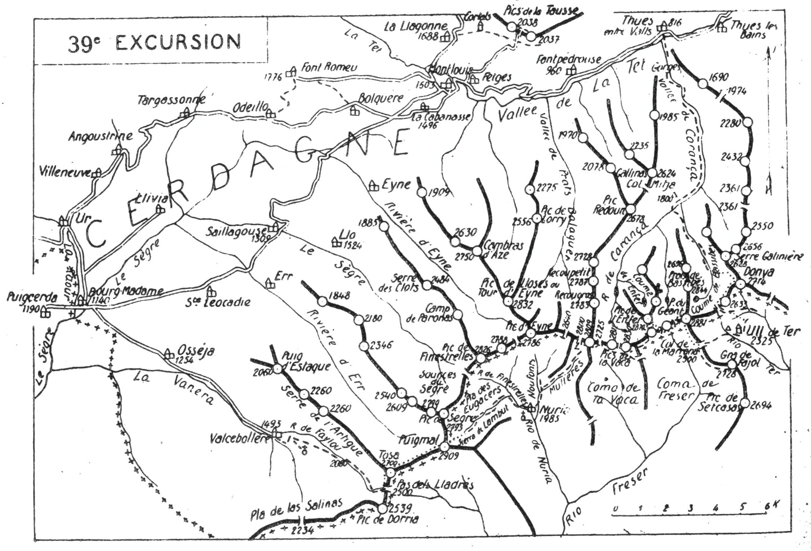

<style>.centre {text-align: center}</style>
<style>.droite {text-align: right}</style>

-----------------------
[//]: # (— p. 487 —)

# TRENTE-NEUVIÈME EXCURSION

(N° 29 de la 1" édition)

Quatre jours au départ de Bourg-Madame

_B. E. — Du 15 Juillet uu 15 Septembre._

Cartes à emporter : Ax et Saillagouse réunies.

__De BOURG-MADAME à MONTLOUIS,__

__par le Puigmal, le Sanctuaire de Nuria,__<br>
__le Pic de la Fosse du Géant, les deux Pics de la Vaca,__<br>
__le Pic de l'Enfer,__<br>
__le Pic de Fréser, le Pic du Géant, le Pic del Gra de Fajol,__<br>
__le Refuge de Ull de Ter,__<br>
__le Pic de la Donia, la Vallée et les Gorges de Carança,__<br>
__les Pics de la Tausse et Font-Romeu.__

<u>__AVIS AUX TOURISTES__</u>

Avec la 39me Excursion, nous quittons la grande chaîne pyrénéenne
et le bond qui nous fait franchir la Cerdagne dans sa
plus étroite mais plus coquette partie, nous mène à la chaîne
catalane, plus facile d'accès, mais surtout bien différente de
caractère.

Sauf le Canigou, qui est un pic mondain, cette région est
presque inconnue des Français. Seuls, quelques Catalans espagnols
presque tous membres fondateurs de l'importante société
le « Centre Excursionista de Catalunya », dont le siège est à
Barcelone, en ont parcouru tous les sommets qu'ils ont mis
en lumière, dans leur pays, par de luxueuses publications.

Le « Centre Excursionista de Catalunya » a fait aussi construire
à grands frais, l'admirable refuge de Ull de Ter qui,
avec le sanctuaire de Nuria et le refuge français des Cortalets,
permet de visiter confortablement toute la chaîne catalane, du
Puigmal au Canigou.

Comme il n'existe pas de guides la connaissant en entier, les
itinéraires des 39me et 40me Excursions seront très détaillés; on
pourra ainsi partir seul ou avec un simple porteur du pays.

<p class="droite">(Voir ci-contre la Carte de l'Excursion.)</p>

<div class="page"/>

— p. 488 —



<div class="page"/>

— p. 489 — (39me EXCURSION) BOURG-MADAME - VALCEBOLLERE

## PREMIÈRE JOURNÉE

__De BOURG-MADAME (1.140m) au SANCTUAIRE de NURIA (1.985m),__<br>
__par la Vallée d'Osséja,__<br>
__Valcebollère (1.493m), le Pas dels Lladres (2.500m ?),__<br>
__la Tosa (2.700m ?) et le Puigmal (2.909m).__<br>

—— SANS GUIDE ——

__Conseils.__ — __Itin. recomm.__ — Commme on trouve des provisions à
Nuria, on n'emportera comme gros repas que ce qui est nécessaire
pour la journée. On partira à 4 h., en se faisant conduire
en voiture au vill. de Valcebollère (10 k.). terminus de la route.

Ce parcours est de toute beauté, surtout au lever du soleil.
De Bourg-Madame à Osséja (4 k. 500), la route monte en pente
douce à travers un pays magnifique. On a sous les veux, à g.
la Cerdagne française et, à dr. la Cerdagne espagnole. Si on se
retourne, on aperçoit Puigcerda dans un décor splendide qu'illumine
le soleil levant.

On entre à Osséja entre deux rangées de parcs et de villas,
et on à tout de suite l'impression que l'on arrive dans la plus
importante et la plus riche commune de la Cerdagne. Ses alentours
à plusieurs k. à la ronde, sont constitués par des jardins
fruitiers d'une luxuriance qu'on est surpris de trouver à 1.254 m.
d'alt.

Dès qu'on a dépassé Osséja, on rejoint le cours de la Vanera
qu'on longe par la rive dr. à une certaine hauteur. Bientôt, l'
allée se rétrécit pour devenir plus pittoresque, et on arrive enfin
au misérable vill. de Valcebollère (1.493m) où la route finit en
cul-de-sac, en haut de la vallée.

Là, s'ouvrent deux vallons secondaires qui conduisent à Ia
crête frontière; le premier grimpe, droit au S., au Pla de las
Seinas (2.234m); le second qui tourne à g., au S.-E. conduit au
Pas dels Lladres (2.5007m ****). C'est ce dernier qu'il faut suivre mais
sans l'aborder immédiatement.

Au S.-E., sur un plateau dominant Valcebollère, on aperçoit
une croix, c'est près d'elle qu'il faut passer pour monter au Pas
dels Lladres. En amont du vill., après la dernière maison, on
prendra le chemin de chars qui se dirige au S. et qui, 5 min.

<div class="page"/>

— p. 490 — PAS **** pezs LLADRES - La TOSA (39me EXCURSION)

après, fait un lacet à g., pour conduire près de la croix. Sur le
plateau, le chemin bifurque; celui de dr. mène à la chapelle de
Saint-Barnabé qui, vue de loin, a l'aspect d'une cabane. On prendra
celui de g. qui file presque horizontalement par le flanc E.
du plateau, pour aller rejoindre le creux du vallon à la jasse de
Monteils (2.088m).

A partir de là, on sera canalisé vers le S.-E., et on suivra les
rives du ruisseau de Faylou jusqu'à sa source, en amont de la
jasse de las Clédés. On fera là sa provision d'eau, car on n'en
trouvera plus qu'après le Puigmal. Continuant par le creux du
vallon, on arrivera, 1/2 h. après, au point où il se divise en deux
branches plus rapides, au pied du port. On prendra celle de qui
monte direction S.-E. et, dans sa partie supérieure, on suivra
un petit sentier qui grimpe à dr., pour aboutir à une immense
dépression de la crête frontière, vers 2.500 d'alt.

Les cartes françaises situent le Pas dels Lladres sur la crête
de la Serre de l'Artigue, au N.-O. du pic de la Tosa (2.700m). Les
Espagnols le situent, au contraire, au S. de la Tosa et immédiatement
au N. du pic de Dorria (2.539m). J'adopte l'opinion
espagnole en indiquant que la Tosa, qui est au N., a le caractère 
d'un pic, tandis que le Pic de Dorria, situé au S. du Pas dels
Lladres, n'est qu'un simple renflement de la large croupe gazonnée
de la crête frontière (1).

En réalité, le Pas dels Lladres est constitué par un étroit et
long plateau formé par le surbaissement momentané de la grande
chaîne dont le point le plus bas est marqué par la borne n° 506.
C'est un port accessible aux mulets et par lequel passent plusieurs
sentiers; c'est le chemin le plus court de Valcebollère à Caralps
(2).

Du Pas dels Lladres, on montera à toute crête au N. jusqu'à
la tourelle de la Tosa (2.700m) que les cartes françaises appellent
« Pic du Pas dels Lladres ». On jouit là d'un joli point de
vue sur la région catalane, mais surtout sur les profondeurs de la
vallée d'Err. La croupe arrondie du Puigmal paraît à deux pas,
et on peut repérer en entier la voie qui y conduit. Un petit sentier
va à toute crête d'un pic à l'autre.

———<br>
(1) La dépression située au N.-O. de la Tosa est nommée Col de las
Clèdes par les Espagnols.<br>
(2) Caralps, 600 hab.; vill. catalan du versant espagnol, à 2 h. du
Pas dels Lladres.

<div class="page"/>

— p. 491 — (39me EXCURSION) Le PUIGMAL

Après une descente de 3 min. et une marche presque horizontale
de 1/4 d'h., on grimpe la rampe finale qui mène, en 45 min.
à la tourelle du Puigmal (2.909m).

Le Puigmal est un sommet aux formes trapues, du haut duquel 
on jouit d'un panorama immense dans toutes les directions.
Au N.-O., presque à ses pieds, on découvre la luxuriante Cerdagne
avec ses nombreux vill. à demi cachés dans la verdure.
Puigcerda sur son promontoire et Font-Romeu sur sa terrasse
font un effet merveilleux. Plus loin, on aperçoit toutes les hautes
cimes ariégeoises caractérisées par de petits névés. Vers l'O.
l'œil peut identifier presque tous les sommets de premier ordre.
depuis le Campeardos jusqu'aux Monts-Maudits.

Au S., s'étalent toutes les sierras catalanes jusqu'au Tibidubo.
près de Barcelone. Enfin, à l'E., on a sous les yeux tous les sommets
de la chaîne frontière, ce qui permet de suivre les sinuosités
de la crête qui serpente vers la Méditerranée. Mais ce qui frappe
le plus l'esprit, c'est le caractère particulier des montagnes catalanes
Les tons sont plus chauds, la lumière plus éclatante. Malgré
la grande chaleur, les crêtes sont très aérées, ce qui augmente
le charme qu'on éprouve à les parcourir.

Très souvent, de nombreuses caravanes espagnoles visitent le
Puigmal, alors qu'il se passe des années sans qu'un Français y
monte. Lors d'une ascension avec mes vaillants compagnons,
Dehoey de Sicard et G. Jauzion, le 3 août 1919, nous y sommes
arrivés en même temps que sept membres du « Centre Excursionista
de Sabadell. » La tourelle du Puigmal est si grande que
nous avons pu nous faire photographier trois au sommet : le
président Mosella, le secrétaire Serravinyals et moi, en poussant
de nombreux vivats en l'honneur des deux nations.

Du Puigmal, le sanctuaire de Nuria n'est pas visible, mais on
peut repérer toute la voie d'ascension du lendemain au Col des
Neuf-Croix.

La descente sur le sanctuaire est des plus faciles, car, sauf le
dernier quart d'h., tout le trajet est à découvert. On domine, en
effet, au N.-E., le Pla d'Eugacers qui occupe le haut du vallon, à
**** &., et la Coma de Lambut située plus bas, à dr.

On dégringolera à travers la rocaille, droit au N.-E., pour rejoindre
un sentier qui aboutit au Pla d'Eugacers, après avoir
franchi le torrent. On pourra alors, à son choix, soit descendre

<div class="page"/>

— p. 492 — SANCTUAIRE DE NURIA (39me EXCURSION)

tout droit à travers les croupes gazonnées, soit suivre un des
nombreux sentiers qui sillonnent le vallon. Vers le fond du Pla
d'Eugacers, on passera sur la rive dr. pour quelques min., mais
on reviendra à la rive g., dès qu'on parviendra en amont de la
gorge rocheuse qui se creuse au bas de la coma de Lambut. On
trouve là un bon sentier muletier qui rejoint bientôt celui qui
descend du Col de Finestrelles (2.558m) par la rive dr. du ruisseau
de ce nom. De ce point, on découvre subitement les bâtiments
du sanctuaire de Nuria qui est 1/4 d'h. plus bas, au centre
d'un joli cirque de verdure.

__Horaire de la Journée :__

```
De Bourg-Madame à Valcebollère, 10 k. de route. }
De Valcebollère au Pas dels Lladres...... 3h. » }   7h.
Du Pas dels Lladres au Puigmal........... 1h.45 }
Du Puigmal au Sanctuaire de Nuria........ 2h.15 } (Arrêts en sus).
```

__Note concernant NURIA__
****
On peut affirmer que le sanctuaire de Nuria est le paradis des
pyrénéistes qui veulent explorer la région s'étendant du Puigmai
au Pic de l'Enfer, y compris les hautes vallées d'Eyne et de Carança
Il est situé au centre d'un cirque verdoyant et entouré par
une dizaine de sommets de haute alt., dont, pour la plupart, on
peut faire l'ascension dans moins de 3 h.

On y trouve de confortables chambres à deux lits au prix de
3 pesetas, et on y sert des repas à la française pour 5 pesetas en
première classe et 4 en seconde. Il n'y a pas moins de cent cinquante
lits, et cela à 1.985 m. d'alt. C'est donc un magnifique
centre de tourisme, en même temps qu'une admirable station
pour une cure de montagne.

On peut s'y rendre de France, presque en entier à cheval, par
les voies suivantes :

1° De Llo (1.524m), par la haute vallée du Sègre, le Col de Lilo
ou de Finestrelies (2.558m), en 5h.30 environ;

2° D'Eyne (1.500m), par la vallée de ce nom, le Col de Nuria ou
d'Eyne (2.650m), en 6 h. environ; |

3° De Fonpédrouse (960m), par la vallée de Prats-Balaguer et le
col de Noufonts (2.640m), en 7h.30 environ;

4° Enfin, de Thuës-entre-Valls (816m), par les gorges et la vallée
de Carança et le Col des Neuf-Croix (2.800m), en 8h.30.

<div class="page"/>

— p. 493 — (39me EXCURSION) COUME DE MULLERES

## DEUXIEME JOURNEE

De NURIA (1.985m) au REFUGE de ULL DE TER (2.325m),
 par le Col des Neuf-Croix (2.800m),
le Pic de la Fosse du Géant (2.809m), le Col de Carança (2.7251m),
les deux Pics de la Vaca (2.812-2.830m),
le Pic de l'Enfer (2.870m), le Pic de Fréser (2.825m),
le Pic du Géant (2.881m),
le Col de la Marrana (2.500m) et le Pic del Gra de Fajol (2.728m).

—— SANS GUIDE ——

> Nota. - Cette journée est celle qui fait ascendre le plus
grand nombre de sommets et franchir le plus de cols, avec le
minimum de fatigue. En effet, dès qu'on a rejoint la chaîne
frontière au Col des Neuf-Croix, ce n'est plus, par les crêtes,
qu'une délicieuse marche pendant laquelle on monte sur sept
pics et on traverse six cols dans moins de 5h.

Les dépressions entre chaque sommet sont si peu profondes
qu'elles procurent plutôt un repos aux divers muscles en
aitcrnant leur travail et en pe.:mettant de marcher presque
aussi vite à l'ascension qu'à la descente. Puis, ce qui augmente
le charme de ce trajet, c'est qu'on domine successivement les
quatre coumes de Carança, de l'Enfer, de Mitxane et de Bassibès
ayec leurs innombrables petits lacs et leurs multiples ruisselets
J'ajoute, pour compléter, que je ne suis jamais passé
par là sans apercevoir des isards et des lagopèdes (1), ces
vivants et gracieux ornements de la haute montagne.

__Conseils.__ — __Itin. recomm.__ -- Comme on trouvera des provisions
à Ull de Ter, on n'emportera que ce qui est nécéssaire pour ia
journée.

On partira de Nuria par derrière l'église et, 2 min. après, on
passera un petit pont pour prendre le sentier qui monte au
N.-N.-E., par la rive g. du torrent, en longeant la base du bois
de la Mare de Peu. Environ 20 min. plus haut, on franchira le
ruisseau de Mullères immédiatement au-dessus du confluent de
celui de Noufonts.

On passe là sur la rive dr. de la coume de Mullères et, quelques
min. après, on arrive à l'embranchement des deux sentiers
qui conduisent à la erète frontière. Celui de g. se dirige droit
au N., vers le col de Noufonts; celui de dr. monte au N.-E., par

———<br>
(1) Perdrix blanches.

<div class="page"/>

— p. 494 —  COL des NEUF-CROIX - FOSSE du GEANT (39me EXCURSION)

la coume de Mullères, au Col_ des Neuf-Croix (2.800m); c'est ce
dernier qu'il faut suivre, Le sentier, très bien tracé, s'élève en
pente douce en longeant la rive dr. du ruisseau de Mullères jusqu'à 
sa source, en haut de la coume. On fera là sa provision d'eau.

Le ruisseau disparu, le sentier grimpe en quelques lacets un
ressaut gazonné et, quelques min. après, on arrivera au pied du
port, près d'un névé qui existe ordinairement jusqu'au 15 ou
20 août. On a alors devant soi, au N., un plan très incliné d'éboulis
à travers lesquels grimpe le sentier, en de nombreux lacets,
jusqu'au Col des Neuf-Croix, situé à l'O. du pic de la Fosse du
Géant (2.809m).

Le trajet de Nuria au col, qui se fait toujours à l'ombre, si
on part vers 5 h., est des. plus agréables. On ne perd jamais le
sanctuaire de vue, et on le voit s'enfoncer petit à petit, tandis
que le massif du Puigmal s'élève derrière lui.

Le Col des Neuf-Croix, l'un des plus élevés des Pyrénées
(2.800m), est formé par une large dépression de la chaîne frontière; 
on y jouit d'un magnifique point de vue. On découvre, au
N., les vallées de Prats-Balaguer et de Carança, séparées par la
crête de Recougros et Recoupetit qu'on a devant soi. On peut descendre
dans l'une ou l'autre de ces deux vallées sans difficulté.

Actuellement, on trouve au col 14 croix de fer, de 0m 40 à
0m 60 de hauteur, plantées dans le roc. Sur chacune d'elles, est
gravé le nom de la victime de la tourmente et la date de l'accident.

Pour jouir du point de vue complet, on montera, à l'E. du col,
au pic de la Fosse du Géant (2.809m) qu'on atteint dans 5 min.
On a alors sous les yeux tous les grands sommets de la haute
région de Carança et d'Eyne et, si on se retourne vers le S.-O.,
on aperçoit, superbe, la masse imposante du Puigmal et sa grande
tourelle. Le sanctuaire de Nuria paraît à ses pieds, à une portée
de fronde.

Le « Centre Excursionista de Catalunya » a fait construire un
très joli sentier muletier qui va directement du Col des Neuf-
Croix au refuge de Ull de Ter, par le N. du Pic de la Fosse du
Géant, le Col de Carança (2.725m), le flanc S. des pics de la Vaca
(2.812m-2.830m), la Coma de Fréser et le Col de la Marrana (2.500m).
Comme on le voit, il dessert admirablement toute cette belle partie
de la crête catalane et les nombreux sommets qu'on rencontre

<div class="page"/>

— p. 495 — (39me EXCURSION) COL DE CARANÇA - PICS DE LA VACA

du Pic de la Fosse du Géant äu Pic del Gra de Fajol. On peut, à
tout moment, limiter son ascension en rejoignant le sentier pour
se rendre directement au refuge.

Du Pic de la Fosse du Géant, on descendra à toute crête au
Col de Carança (2.725m) où on retrouvera le sentier. Ce col fait
communiquer la Coma de la Vaca avec la haute vallée de Carança.
Le sentier s'élève ensuite en pente douce en suivant la frontière
jusqu'aux pics de la Vaca qu'il contourne, tout près des sommets,
par le versant espagnol. On le quittera momentanément pour
faire, en quelques min., l'ascension du premier pic (2.812m), et on
passera à toute crête au pic principal (2.830m). Il ne faut que
2 min. pour aller d'un pic à l'autre.

Le belvédère des deux pics de la Vaca est de toute beauté, surtout
sur les abords immédiats. On domine merveilleusement le
cirque supérieur de Carança avec ses nombreux lacs et la coume
accidentée de l'Enfer. La face N. est un à-pic de 500 m. et, de
l'autre côté de cette dernière coume, le Pic de l'Enfer s'élance en
plein ciel jusqu'à 2.870 m. d'alt. Du grand Pic de la Vaca, on
s'aperçoit déjà d'une grosse erreur des cartes françaises qui le
situeot sur la frontière. Il est en entier en France, à 400 m. environ
de la grande chaîne, sur un chaînon secondaire qui se détache
au N. Le sommet situé sur la crête frontière (2.800m), s'appelle
Pic des Gourgs.

Le charme indéfinissable qu'on éprouve aux deux pics de la
Vaca, d'ascension si facile, les fera quitter avec regret. Cependant
l'intérêt ne faiblira pas un instant sur les sommets qui
restent à visiter, et on peut mème dire qu'il augmentera d'intensité
au Pic du Géant.

Avant de quitter le grand pic de la Vaca, on pourra repérer
tout le trajet jusqu'au Pic de l'Enfer. Il est des plus simples
il faut suivre la crête frontière jusqu'au pied du Pic des Gourgs,
puis contourner celui-ci en écharpe, par la face N., afin d'aboutir
au col situé au S. de l'Enfer. Là, on sera à quelques min. du
sommet.

On descendra donc à l'E., par le flanc S. de la crête, pour rejoindre
le sentier d'Ull de Ter qu'on quittera, 5 min. après, au
point où il tourne à dr. Obliquant légèrement à g., on reprendra
sa marche à toute crête en suivant un sentier à peine tracc.
Bientôt celui-ci descend par le flanc S. jusqu'à un petit col situé
sur la frontière. On remontera à toute crête jusqu'au pied du Pic

<div class="page"/>

— p. 496 — PIC de L'ENFER - PIC du GEANT (39me EXCURSION)

des Gourgs qu'on contournera par la g., afin d'aboutir au col qui
le sépare de l'Enfer. On y laissera le sac et, dans moins de
10 min., on fera, à toute crête, l'ascension du Pic de l'Enfer
(2.870m). 

Sauf vers le S., le point de vue sur les lointains est analogue
à celui des pics de la Vaca. En revanche, il est tout différent sur
les abords immédiats, car on est entouré, sur trois faces, par des
cpumes profondes où scintillent une infinité de lacs. On aperçoit
les plus importants de la haute vallée de Carança, tous ceux de la
Coume de l'Enfer et enfin, ceux de la Coume Mitxane. Ce tableau
constitue la coquetterie de ce pic qui, vu de loin, a un aspect rébarbatif
alors qu'il est d'accès si commode par le S. et l'E.

A 1.500 m. à l'E. de l'Enfer, s'élève la masse imposante du
point culminant de l'excursion, le Pic du Géant (2.881m), dont on
aperçoit en entier la large croupe qui grimpe au sommet. On
peut y aller directement, dans 1 h. environ, en passant sur le
flanc N. du Pic de Fréser et au large col situé à l'E. de ce dernier
pic. Mais, pour jouir d'un nouveau point de vue, on ascendra au
passage le Pic de Fréser.

Après avoir repris le sac, on contourngra le Pic des Gourgs
par l'E., pour aboutir presque horizontalement au col frontière.
Passant alors sur le versant espagnol, on n'aura qu'à grimper à
flanc de crête au pic pointu de Fréser (2.825m).

De son sommet, on domine toute la coume de Fréser et on:
peut suivre les traces du grand sentier de Ull de Ter, depuis la
coume de la Vaca au Col de la Marrana. Derrière ce dernier, le
Pic del Gra de Fajol a tout à fait belle allure.

Un large col sans nom sépare le Pic de Fréser du Pic du Géant
qui est à deux pas. On n'aura qu'à descendre vers lui et, après une
marche de 10 min. par la crête frontière, on remontera en face,
droit au Géant (2.881m). Ce sommet est appelé Pic des Bastiments
par les Espagnols, la tradition prétendant que c'est le premier
pic aperçu par les marins lorsqu'ils s'approchent de la côte méditerranéenne

Comme le Puigmal, le Pic du Géant est un sommet aux formes
trapues constitué par une large et longue crête ondulée. Ses faces
sont si peu accidentées qu'on peut l'ascendre par tous les côtés.

Son panorama est analogue à celui du Puigmal. Il embrasse
toute la Catalogne et on a sous les yeux tous les grands sommets

<div class="page"/>

— p. 497 — (39me EXCURSION) COL DE LA MARRANA - GRA DE FAJOL

de la région, depuis le Carlitte à la Méditerranée. Vers l'O., la vue
s'étend sur la chaîne ariégeoise et jusqu'aux Monts-Maudits.

Sur ses flancs naissent, au S., le Rio Ter et le Rio Fréser et,
sur le versant français, les ruisseaux des froides coumes de Mitxane
et de Bassibès. Au N. de la tourelle, se détache un important
chaînon qui, après une large dépression, se relève jusqu'à
2.844 m. au Pic de Prats de Bassibès. Un joli lac (encore glacé le
» août), brille au S.-E. de ce dernier sommet, vers 2.500 d'alt.

En s'avançant légèrement à l'E. de la tourelle, on a, à ses pieds,
tout le cirque de Ull de Ter avec, au centre, le superbe refuge qui
affecte la forme d'un grand éléphant noir.

De l'extrémité E. de la crête, on aperçoit la coume sauvage de
Bassibès, par laquelle on descendra le lendemain. L'œil peut suivre
toute la chaîne principale jusqu'au Canigou, car on domine
le plateau de Campmagré, le Pla Guillem, etc., etc. La tourelle du
pic gracieux de la Donya (2.714m) parait à deux pas, et on pourrait
y aller à toute crête dans 1 1h. 1/2.

Mais au S.-E., de l'autre côté du Col de la Marrana (2.500m),
un sommet de nature particulière retient l'attention : c'est le
Gra de Fajol (2.728m), signalé déjà du haut du Pic de Fréser. Sa
face N., presque verticale, est striée de haut en bas par plusieurs
filons blancs de quartz translucide. On en fera l'ascension tout
à l'heure, du Col de la Marrana. Cette ascension s'impose, non
seulement pour le plaisir qu'elle procure, mais surtout pour reconnaître
le coin de la chaîne frontière, vers Roque Couloum, au
moment où elle prend le nom de chaînes des Albères.

On descendra du Géant à sa fantaisie, par la face S., jusqu'au
Col de la Marrana où on laissera le sac, puis, dans 1 h., aller et
retour, on fera l'ascension du Pic del Gra de Fajol (2.728m). Un
petit sentier qui s'amorce au S. du col, grimpe à travers gazons
et pierraille; on le suivra jusqu'à la croupe E. du pic et, à partir
de 1à, on montera à toute crête jusqu'à la tourelle du sommet.

Le Pic del Gra de Fajol, d'accès si facile, donne cependant
une grande impression de vide, si on s'avance sur la face N.
Quoique constitué par une étroite arête, il a tout à fait la forme
dune « Tose. » Le versant S. est un gazonné en pente douce,
tandis que la face N. est une muraille presque verticale de 400 m.
de hauteur. Le refuge est sous les pieds, et il semble qu'on l'atleindrait
facilement d'un jet de pierre. C'est sur la face N. du
Gra de Fajol que se réfugient souvent les isards de la contrée.

<div class="page"/>

— p. 498 — REFUGE de ULL DE TER (39me EXCURSION)

* Le Gra de Fajol est l'un des plus jolis belvédères de la région.

Les premiers plans sont admirables, surtout la partie de la chaîne
frontière qui décrit un arc de cercle du Géant au Costabona,
entourant ainsi plusieurs petits cirques. Par le Col du Géant, on
aperçoit le Prats de Bassibès et, dans le lointain, les montagnes
de Madres. A l'E.-N.-E., par delà le Campmagré,|émerge, splendide
le massif du Canigou. Enfin, au S. et au S.-O., se creusent les
vallées profondes de Carlat et de Fréser.

Pour la descente au Col de la Marrana, on pourra, 5 min. après
avoir quitté le sommet, passer directement à flanc, un peu plus
bas qu'à l'ascension. On coupera ainsi deux filons de quartz, et
20 min. suffiront pour rejoindre le col. On retrouvera là le grand
sentier de Nuria et, dans 20 min., ou arrivera au refuge de Ull de
Ter (2.325m).

__Horaire de la Journée :__

```
De Nuria au Col des Neuf-Croix........ 2h.15 :
Du Col des Neuf-Croix au grand Pic de la
NA sans mass caucs hasne rte reves 0h.30 6h.45
Du grand Pic de la Vaca au Pic de l'Enfer. 1h. »
Du Pic de l'Enfer au Pic du Géant...... 1h.10 <br> } (Arrêts en sus).
Du Pic du Géant au Pic del Gra de Fajol. 1h.10
Du Pic del Gra de Fajol au Refuge...... 0h.40 }
```

Note concernant le REFUGE de ULL de TER
Le refuge gardé de Ull de Ter a été construit par le « Centre
Excusionista de Catalunya » et inauguré en juillet 1909. Il est
bâti sur le versant espagnol, immédiatement au S. du Pic de la
Donia, et, à 1 h. 1/2 au S.-O. de la Porteille de Mantet. Par sa
haute alt. de 2.325 m., sa situation exceptionnelle au centre d'un
cirque et à la naissance du Ter, il facilite l'ascension de tous les
sommets de la frontière, du Puigmal au Costabona, et de tous
ceux situés immédiatement au N. et au S. de la grande chaîne.

Il est ouvert du 15 juillet au 15 septembre et il y a vingt et un
lits à 2 pesetas et medio chacun. On y trouve des provisions et le
prix des repas est de 6 .pesetas. A 2 min. à l'O., existe un petit
refuge, ouvert toute l'année, dans lequel il y a de la paille pour
dormir et une provision de bois pour se chauffer.

<div class="page"/>

— p. 499 — (39me EXCURSION) COL per GEANT - PIC De LA DONYA

## TROISIÈME JOURNÉE

__De ULL DE TER (2.3251m) à MONTLOUIS (1.603m),__<br>
__par le Col du Géant (2.600m),__<br>
__l'Esquino d'Azé (2.633m), le Pic de la Donya (2.714m),__<br>
__la Coume de Bassibès.__<br>
__la Vallée et les Gorges de Carança et Thuès-entre-Valls (816m).__

—— SANS GUIDE ——

__Conseils.__ — __Itin. recomm.__ — Au N.-N.-E. du refuge, lout près,
s'élève Ie jeli Pic de la Donya (2.714m), sillonné sur sa face S.
de plusieurs couloirs rapides. On pourrait en faire l'ascension
directe par l'un de ces couloirs, mais, comme elle serait délicate
et fatigante, il vaut mieux rejoindre la frontière au Col du Géant
pour s'v rendre ensuite à toute crête.
On partira du refuge par le sentier qui se dirige au N.-E. vers
la Porteille de Mantet (2.478m) et, après une descente de 5 min.
on le quittera par la g., afin de couper un petit vallon et de
sauter le ruisseau naissant de Morens. On passera à travers la
rocaille et les rhododendrons pour remonter en face vers un
sapin rabougri que domine un petit rocher en équilibre. Il n'y
a pas de sentier et l'ascension est un peu rude pendant 1/4 d'h.
On grimpera direction N. et bientôt, on rejoindra le chemin qui
va de Camprodon à Thuès par le Col du Géant. Environ 20 min.
après, on arrivera à la crête frontière, au Col du Géant (2.600m).

Là, on découvre subitement, à ses pieds, le cirque supérieur
de Bassibès et la cuvette du petit lac glacé de ce nom. La coume
de Bassibès se creuse devant soi en tournant vers la dr.

On quittera le grand sentier pour suivre, vers le N.-E., celui
qui longe la crête frontière par l'Esquino d'Azé (2.633m) et qui
monte ensuite en pente douce vers la tourelle de la Donya.
(C'est une balade des plus agréables, car la pente n'excède pas
10 p. 100 dans un terrain facile et aussi parce qu'on domine
merveilleusement le cirque de UI de Ter qu'on à en entier sous
ses VeUX.

Le Pic de la Donva (2.714m) est situé sur la frontière, au point
de jonction de plusieurs voies de montagne qui filent dans toutes

<div class="page"/>

— p. 500 — COUME de BASSIBES - VALLEE DE CARANÇA (39me EXCURSION)

les directions. Immédiatement au-dessous, à l'E., s'ouvre la Porteille
de Mantet (2.478m), par laquelle passe l'une des plus importantes
de ces voies, celle qui fait communiquer la région es:
pagnole de Camprodon avec le Conflent. Au N.-E., on a sous
les yeux la vallée et le vill. de Mantet. Vers l'E., à travers le
Campmagré qu'on domine en entier, file un sentier qui conduil
directement à La Preste par les sources du Tech. Au N.-O., par
la coume de Bassibès, descend le chemin que nous prendrons
tout à l'heure, pour rejoindre la vallée de Caranca, traverser
ses admirables gorges, et aboutir à Thuës-entre-Valls.

Quoique la Donya soit un sommet de second ordre, c'est un
belvédère magnifique sur les deux versants. On: aperçoit, au N.,
tout le massif de Madres et, au N.-O., par l'échancrure du Col
Mitja, une partie du Capcir et Je vill. de La Llagonne. Vu de là,
le double Pic de la Tausse (2.037m-2.038m) a tout à fait belle
allure. Mais ce qui impressionne le plus, c'est l'imposant massif
du ,Canigou qui est à deux pas. On peut suivre tous les détails
du chaînon qui auitte la frontière à Roque-Couloum pour filer,
 au N.-E., jusqu'au monarque du Roussillon. 

L'horaire de la journée étant très large, on pourra s'attarder
longuement sur la Donya, pour contempler les beautés de son
tour d'horizon que le cadre restreint de mon guide ne me permet
pas de décrire. k

Pour rejoindre directement le sentier de la coume de Bassibés.
on se dirigera d'abord au N.-O., vers la Serre Galinière (2.628m),
puis, au point où un ravin se creuse à g., on descendra droit à
JO. Vers le fond, ce dernier se transforme en un couloir étroit
où prend naissance un petit ruisseau. Sur la rive dr., s'amorce
un sentier qui, dans 10 min., conduit au bord du torrent de
Bassibès; on le franchira et on le longera par la rive g. 1/4 d'b.
environ. Quoique les cartes indiquent le sentier comme continuant
par cette rive, il passe sur la rive dr. pendant 1/2 h. Il
traverse alors un lambeau de forêt et revient définitivement
rive g. pour passer à découvert au milieu de vertes pelouses; il
fait ensuite, vers l'O., un long lacet pour aboutir à la jasse de
Carança.

Au moment où on rejoint la grande vallée de Carança, on en
franchit le torrent sur un petit pont et, quelques min. après, on
arrive près d'une grande cabane située sur la rive g., vers 1.800

<div class="page"/>

— p. 501 — (39me EXCURSION)  GORGE DE CARANÇA

Valt. C'est en amont de cette cabane que s'umorce le sentier
du Col Mitja par lequel on peut passer à la vallée de Prats-
Balaguer et aussi descendre à Fontpédrouse par la gorge de
la Sourde.

Le sentier direct de Nuria à Thuès par le Col des Neuf-Croix
passe devant li? cabane cet descend ensuite, par la rive g de Ia
vallée, jusqu'aux gorges de Carança, Pendant 20 min. le chemin
louvoie à travers les rhododendrons et les ajoncs, à une
certaine hauteur, et souvent par un sol humide. C'est le seul
Irajet peu intéressant de cette admirable vallée.

Bientôt, on arrive au grand chemin, puis à la route en construction
On entre alors sous la futaie aux essences diverses et,
pendant plusieurs kilomètres, on marche sous un dôme de verdure
De temps en temps, on rencontre des clairières parsemées
de fleurs rares de haute alt. : lis Martagon, épilobes en épi, gentianes
ete, ele. C'est dans un perpétuel enchantement qu'on
arrive au point où la vallée se ferme, à Pentrée des gorges. Le
site est saisissant (1).

Des murailles verticales. hautes de plusieurs centaines de m.,
vous dominent de toutes parts; leurs sommets sont hérissés d'aiguilles
qui pointent vers le ciel, et la vallée paraît sans issue.
Le sentier s'engage dans l'étroit défilé où il est taillé souvent
dans le roc mème, On à dù lui faire franchir plusieurs fois le
torrent qui serpente en grondant toujours furieusement.

On marche ainsi pendant 2 k. 500, dans une des plus belles
gorges des Pyrénées. On en sort enfin par un petit tunnel, on
passe sous un pont du chemin de fer qui bouche en partie
Pentrée de la gorge, et on arrive à la vallée de la Tet, à Thuès-
entre-Valls (816m). Là, on n'aura qu'à prendre le train électrique
pour aller coucher à Montlouis. °

Ce trajet de 12 K. est certainement le plus pittoresque des
chemins de fer français en travaux d'art en points de vue et en
beautés naturelles. C'est entre Fhuës et Montlouis qu'on traverse

En cours de roule, on se renseignera auprès des bergers pour
savoir si le trajet par le fond des gorges est en ce moment-là praticable
Dans tous les cas. on pourra toujours passer par le sentier
supérieur de la rive dr qui S'amoree en amont des gorges et qui
débute par une remontée.

<div class="page"/>

— p. 502 — VALLEE de La TET - MONTLOUIS (39me EXCURSION)

le merveilleux pont Séjourné de 65 m. de haut et le pont suspendu, 
construction vertigineuse de Gisclard, qui franchit la
Tet à 80 m. de hauteur.

__Horaire de la Journée :__

```
De Ull de Ter au Pic de la Donya....... 1h.20 «
De la Donya à la Jasse de Carança...... 2h. » G h. »
De la Jasse de Carança à Thuëès-entre- } (Arrêts en sus).
Valls ....... dosettes sesesereseeeeee 2h.40
```

## QUATRIÈME JOURNÉE

__Ascension des Pics de la Tausse (2.037-2.038m), dans la matinée,__<br>
__et promenade à Font-Romeu (1.776m), dans l'après-midi.__

—— SANS GUIDE ——

> Nota. - Deux ascensions sans sac, c'est-à-dire deux balades
de santé, constituent le programme de la quatrième journée,
afin de terminer très agréablement la 39me Excursion de mon
guide.

A la Itme E., p. 189, j'ai déjà signalé comme belvédére de
premier ordre les deux pics de la Tausse. Il convient d'y ajouter
la terrasse de Font-Romeu qui est aussi un merveilleux
balcon sur la Cerdagne et sur la grande chaîne frontière. Heureux
ceux qui pourront y séjourner longtemps, car ils y trouveront
à la fois, et le régal des veux et le repos de l'esprit.

En conduisant le touriste à ces deux points de vue, je lui
procure l'agrément de revivre Îles impressions des jours précédents
et aussi d'observer l'extrémité de la chhine par laquelle
se terminera la longue randonnée de 200 jours.

__Conseils.__ — __Itin. recomm.__ —On partira, sans sac, avec un
simple casse-croûte dans sa poche. On prendra, au N. de Mont-
louis, la route de Formiguères qu'on suivra jusqu'au vill. de la
Llagonne (1.688m). C'est là que s'amorce, à dr., un des chemins
les plus intéressants du Roussillon, le chemin de Llansadès
Dans son trajet de la Llagonne à Olette, il contourne presque
toujours en corniche l'extrémité S. du massif de Madres, offrant
ainsi au touriste une succession de points de vue splendides
aussi nombreux que variés.

On prendra ce chemin qui conduit, d'abord, au Hameau des
Cortals après lequel il s'infléchit à l'E.-S.-E., pour rejoindre,

<div class="page"/>

— p. 503 — (39me EXCURSION) PICS DE LA TAUSSE

plus loin, la route stratégique qui monte aux forts de la Tausse.
On jouira pendant ce trajet de belles échappées sur la Cerdagne
et la chaîne frontière, et on dominera constamment Montlouis.
Cette voie est plus longue d'environ 1/2 h., mais elle est de beaucoup
la plus intéressante.

La route rejointe, on la suivra pour monter, au N., au Col de
Brilles et on fera successivement lascension des pics de la
Tausse en commençant par le sommet N.-O. (2.038m). Comme
c'est sur le sommet 2.037 qu'est le meilleur point de vue, on
passera rapidement sur le pic principal, afin de pouvoir consacrer
plus de temps au sommet secondaire.

Le panorama du Pic de la Tausse (2.037m) est lun des plus
beaux des Pyrénées. On à sous les veux un merveilleux tableau
qui s'étend du Campcardos aux plaines du Roussillon et à la
Méditerranée. Toute la Cerdagne resplendit au S.-O., et toutes
les cimes catalanes défilent en arc de cercle, depuis l'imposant
Carlitte jusqu'au majestueux Canigou.

Par une claire matinée, à accessibilité égale, je ne connais.
dans les Pyrénées, aucun belvédère de même alt. qui puisse
être comparé à celui de la Tausse.

On rentrera par la roëte stratégique qui descend au S.-O., en
de nombreux lacets, et qui va rejoindre la grand'route en amont
de Fetges, à°10 min. de Montlouis.

Horaire de la Tausse (aller et retour) : 3h.30, arrêts en sus.

L'APRÈS-MIDI à FONT-ROMEU

Dans l'après-midi, on repartira par la route de Formiguères
et, 1/4 d'h. après, on prendra, à g., celle de Font-Romeu au
poteau indicateur. Il y a 7 k. de Montlouis à Font-Romeu, le
trajet se fait la plupart du temps en forêt, ce qui le rend très
agréable, surtout par la grande chaleur,

Font-Romeu, renommé depuis longtemps par son pèlerinage.
est aussi devenu un lieu de villégiature depuis la construction
dun hôtel de montagne dans ce site merveilleux. Placé à
1.776 d'alt. cette terrasse est un véritable balcon suspendu sur
la Cerdagne el un magnifique belvédère sur la chaîne frontière

<div class="page"/>

— p. 504 — FONT-ROMEU (39me EXCURSION)

qui lui fait face. Après l'ascension des pics de la Tausse, l'excursion
de Font-Romeu s'impose pour jouir de toutes hi beautés
de cette admirable région.

Si on veut varier le chemin de retour, on descendra, au S.-E.,
au vill. de Bolquère où on rejoindra la grand'route qui, par le
Col de la Perche (1.577m), conduit directement à Montlouis. Par
cette voie, on allongera d'environ 1/2 h., mais on jouira, en
cours de route, de merveilleux effets de lumière au moment où
le soleil décline à l'horizon. On peut aussi rentrer en chemin de
fer en prenant le train à Odeillo, à 1/2 h. de Font-Romeu.

Horaire de Font-Romeu (aller et retour) : 3h.30, arrêts en sus.
(Si on rentre par Bolquère, # h.)

<u>__POINTS D'INTERRUPTION__</u>

<br> Pour rejoindre d'Eyne par le Col de Nuria.......... Gh. »
NURIA A Pour rentrer à Eyne........................ éereecee oh. »

COL des NEUF-CROIX | Pour descendre à Thuës par la Val-

et lée de Cardic.::: 2 soma msnsss 4h.40
) Pour rejoindre de Thuës par la Val-
OL de CARANER | lée de Carança...................... 6h.30

+ Soit pour abandonner à la fin de la 3 journée, soil
} P
MONTLOUIS | __ pour rejoindre, afin d'effectuer la #°.

ST Let
