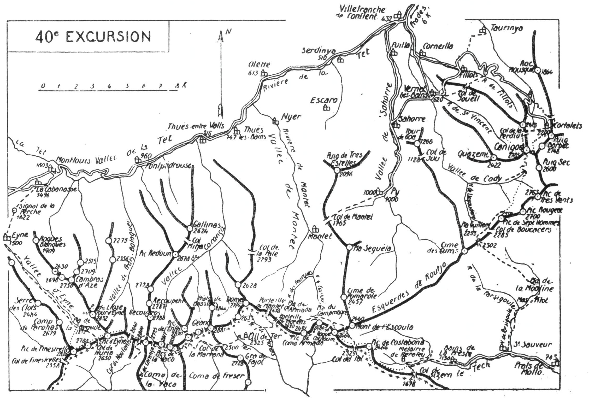

<style>.centre {text-align: center}</style>
<style>.droite {text-align: right}</style>

[//]: # (— p. 505 —)

# QUARANTIÈME EXCURSION

(N° 30 de la 1re édition)

__Quatre jours au départ de Montlouis__

_B. E. — Du 15 Juillet au 15 Septembre._

Cartes à emporter : Saillagouse, Prades et Céret réunies.

__De MONTLOUIS à VERNET-LES-BAINS,__<br>
__par la Vallée d'Eyne,__<br>
__le Pic de Finestrelles, le Col de Nuria, le Pic d'Eyne,__<br>
__le Col des Neuf-Croix,__<br>
__le Refuge de Ull de Ter, Roque Couloum, le Pic de Costabona.__<br>
__La Preste, le Pla Guillem et le Canigou.__

__<u>AVIS AUX TOURISTES</u>__

Comme on l'a constaté à la 39° excursion, les montagnes
catalanes sont sans difficultés. Les sommets de la 40° n'offrent
des passages un peu délicats qu'aux endroits où on voudrait
couper court pour arriver plus tôt. Pour le touriste qui à
parcouru les Pyrénées Centrales et escaladé leurs hauts sommets
l'ascension des pics catalans n'est qu'un jeu.

Soit par lyrisme, soit par méconnaissance des autres régions,
certains auteurs espagnols en ont exagéré les difficultés. En
réalité, elles sont nulles pour tous les sommets à l'E. du
Col de Puymaurens, si l'on suit la meilleure voie.

On pourrait prendre, à Montlouis, un porteur du pays pour
toute l'excursion, à la condition qu'il connaisse le chemin jusqu'au 
Col de Nuria. J'indiquerai plus loin de trajet pour lequel
un guide peut être utile.

<p class="droite">(Voir ci-contre la Carte de l'Excursion).</p>

<div class="page"/>

— p. 506 —



<div class="page"/>

— p. 507 — (40me EXCURSION) VALLEE D'EYNE - PIC de FINESTRELLES

****

## PREMIERE JOURNEE

__De MONTLOUIS (1.603m) à ULL DE TER (2.325m),__<br>
__par la Vallée d'Eyne,__<br>
__le Pic de Finestrelles (2.826m), le Col de Nuria (2.650m),__<br>
__le Pic d'Eyne (2.786m), le Col de Noufonts (2.640m),__<br>
__le Col des Neuf-Croix (2.800m),__<br>
__le Col de Carança (2.725m), les Sources du Fréser (2.450m)__<br>
__et le Col de la Marrana (2.500m).__

—— SANS GUIDE ——

__Conseils.__ — __Itin. recomm.__ On partira de très bonne heure
par la Cabanasse et on prendra le chemin qui monte au Signal
de la Perche (1.622m). De ce point, on peut éviter de descendre
au vill. d'Eyne et gagner 20 min. On n'aura qu'à suivre, par la g.
un canal d'arrosage qui conduit en pente douce au creux de la
vallée d'Eyne, dans la région des pâturages. La vallée est assez
resserrée au début, mais elle s'élargit bientôt.

Il y a un sentier sur les deux rives de la rivière d'Eyne, mais
environ 1 h. en amont du vill., il vaut mieux suivre celui de la
rive dr. jusqu'à l'entrée du Pla de la Bégude (2.272m). Là, la
vallée se transforme en un grand cirque verdoyant où on trouve
les fleurs les plus rares. Dans sa partie supérieure, au Pla de la
Bégude, la vallée d'Eyne est considérée, par les botanistes, comme
étant la plus riche des Pyrénées.

Dès l'entrée du joli cirque, on est entouré de toutes parts par
de hautes montagnes : à l'E, par la Tour d'Eyne (2.832m); au
S., par la crête frontière et le Pic de Finestrelles (2.826m}; enfin.
à l'O. par les murailles verticales de la crête de Camp de
Paronas (2.679m),

Droit au S. de l'autre côté du cirque, on aperçoit un ravin
rapide qui grimpe directement au Pic de Finestrelles. On montera
par là, et qui fera gagner 1h. Seul, le porteur suivra le
sentier régulier et ira attendre la caravane au Col de Nuria
(2.650m) dont on aperçoit l'échancrure du Pla de la Bégude.

Pour l'ascension directe du Pic de Finestrelles, on peut, soit
zigzaguer les pentes du ravin droit au sommet, soit grimper un
peu à dr. afin de rejoindre la crête de Paronas. à 500 m. au
N. du pic. Cette dernière voie, qui n'est pas plus longue, est plus

<div class="page"/>

— p. 508 — PIC D'EYNE - COL de NOUFONTS (40me EXCURSION)

****

intéressante, car on aperçoit mieux et plus tôt la vallée du Sègre.
On traversera donc le Pla de la Bégude et on fera l'ascension
directe par l'une des deux voies ci-dessus.

Le panorama du Pic de Finestrelles est immense et presque
analogue à celui du Puigmal en ce qui concerne les lointains.
Ses abords immédiats sont de toute beauté. Au N. du sommet, se
détache une crête altière qui sépare la vallée d'Eyne de celle
du Sègre qu'on domine en entier. A ses pieds, le Cirque de la
Bégude réjouit les yeux par l'éclat et la richesse de sa flore.
Enfin, au S., on voit se creuser en pente rapide les nombreux
vallons qui convergent vers Nuria.

Du Pic de Finestrelles, on continuera l'excursion à toute crête,
au N.-E., tantôt sur l'un, tantôt sur l'autre versant. On fera au
passage le pic du Col d'Eyne (2.788m) et, de là, on descendra au
Col de Nuria (2.650m) où on rejoindra le porteur pour le déjeuner.
Le Col de Nuria, qu'on nomme aussi Col d'Eyne, est situé au
S.-O. et tout près du Pic d'Eyne (2.786m). On y jouit d'un très
joli point de vue sur la vallée, sur Font-Romeu et la région du
Carlitte.

A partir du Col de Nuria jusqu'à Ull de Ter, ce ne sera qu'une
délicieuse marche sans fatigue et toujours avec des horizons nouveaux
On rejoindra au Col des Neuf-Croix le grand sentier de
Nuria à Ull de Ter et on revivra au passage toutes les émotions
éprouvées dans la précédente excursion, lors de l'ascension des
sommets qu'on longera par leurs bases.

On montera d'abord au N.-E. pour faire l'ascension facile du
Pic d'Eyne (2.786m). C'est l'un des plus jolis belvédères de la
région et son panorama est très étendu. Il est, à la frontière, le
point de jonction de la crête qui sépare le Conflent de la Cerdagne
De ses flancs, les eaux descendent vers trois directions :
au N.-E., à la Tet, par la vallée de Prats Balaguer; au N.-O., au
Sègre, par la vallée d'Eyne et, enfin, au S., au Fréser, par la
Coma de Nuria.

Au N. du Pic d'Eyne s'élève l'énorme cime arrondie de Lloses,
ou Tour d'Eyne (2.832m), qui masque une partie du point de vue
dans cette direction. Ce dernier sommet perd de son intérêt,
parce qu'il n'est pas sur la frontière et qu'il a, de ce fait, sa vue
bornée vers le S.

On descendra ensuite; à l'E., au Col de Noufonts (2.640m) et,
en suivant toujours la crête frontière, on escaladera au passage

<div class="page"/>

— p. 509 — (40me EXCURSION) COUME DE FRESER

****

un sommet sans nom qui sépare le vallon de Noufonts de la
Coume de Mullères. A partir de là, on s'en va presque partout
en plaine jusqu'au Col des Neuf-Croix (2.800m). (V. 39° E., p. 494).

Au Col des Neuf-Croix, on rejoint le sentier de Nuria à Ull de
Ter qui contourne, par le N., le Pic de la Fosse du Géant (2.809m)
pour passer après au Col de Carança; il remonte ensuite aux deux
pics de la Vaca-(2.812-2.830m) qu'il longe près du sommet par la
face S. En quelques min. supplémentaires, on pourra refaire l'ascension
de ces trois sommets, afin de jouir à nouveau de leurs
merveilleux points de vue.

Après les pics de la Vaca, le sentier fait un long crochet à dr.
vers le S.-E., et, par une marche horizontale, on arrive à la crête
de Tirapitz (2.780m) d'où le regard plonge subitement, d'environ
400 m., sur la Coume de Fréser. Puis, dans une descente rapide
en plusieurs lacets, on aboutit, au haut de la Coume, aux sources
du Fréser (2.450m). Poursuivant sa marche vers l'E., une petite
remontée en pente douce mène au Col de la Marrana (2.500m)
d'où on aperçoit le refuge de Ull de Ter (2.325m), 20 min. plus
bas. (V. 39° E., p. 497).

__Horaire de la Journée :__

```
De Montlouis au Pla de la Bégude........... 3h. » }
Du Pla de la Bégude au Pic de Finestrelles. 1h.45 }
Du Pic de Finestrelles au Col de Nuria..... 0h.45 }  9h.30
Du Col de Nuria au Col des Neuf-Croix...... 1h.45 } (Arrêts en sus).
Du Col des Neuf-Croix au Refuge de Ull            }
  de Ter .................................. 2h.15 }
```
> Nota. - V. notice sur Ull de Ter, p. 498.

## DEUXIÈME JOURNÉE

__De ULL DE TER (2.325m)à LA PRESTE (1.130m),__<br>
__par la Porteille de Morens (2.420m),__<br>
__Roque Couloum (2.464m) et le Pic de Costabona (2.464m),__

—— GUIDE UTILE ——

__Conseils.__ — __Itin. recomm.__ — Par une journée claire, le parcours
de Ull de Ter à la Preste n'offre pas de difficultés. Ce n'est
qu'en cas de brouillard qu'on pourrait commettre des erreurs

<div class="page"/>

— p. 510 — PORTEILLE de MORENS (40me EXCURSION)

****

dans le trajet de Ull de Ter à Roque Couloum. Donc, si la journée
est sombre, on se fera accompagner par un berger ou un chasseur
jusqu'à Roque Couloum.

A l'E. de la Porteille de Mantet, s'étalent successivement deux
immenses plateaux qui longent le N. de la grande chaîne avec des
ondulations plus où moins prononcées : le Pla de Coma Armada
et le Pla du Campmagré. Il faut plus de 2 h. pour les traverser
d'un bout à l'autre; mais, étant donné leur alt. qui dépasse toujours
2.200 m. et leur situation en terrasse, on y arrive constamment
sous le charme de leurs divers points de vue. Pour nous
rendre à Roque Couloum, nous allons traverser ces deux plas
presque en entier.

On partira du refuge, direction N.-E., en laissant, à dr., l'arête
avancée du Pas dels Lladres et on descendra vers le petit
vallon du ruisseau naissant de Morens. Au lieu de monter au N.,
comme à la précédente excursion, on suivra le sentier qui tourne
à dr. et qui franchit bientôt le torrent pour aboutir au Pla grand
de Morens (2.075m). Par là, on empruntera quelques instants le
passage du chemin qui va de Thuès à Camprodon par le Col
du Géant. Quittant ce dernier, on traversera le Pla de Morens
vers l'E. jusqu'aux cabanes de bergers qui sont situées à la base
des pentes d'en face. Là, le sentier prend la direction N. vers
le couloir qui grimpe à la Porteille de Mantet, et la pente s'accentue
Après 1/2 h. d'ascension, on laissera, à g., le chemin de la
Porteille de Mantet et on montera à dr., à l'E., afin de franchir
la frontière à la Porteille de Morens (2.420m).

Pendant cette ascension, on jouira de très jolis points de vue
sur les criques de Morens et d'Ull de Ter, mais surtout sur le pic
accidenté del Gra de Fajol qui pointe vers le ciel son arête
effilée. Tout près, au N.-O., la Donya, avec ses escarpements méridionaux
fait aussi grand effet.

La Porteille de Morens est située entre les ondulations qui la
séparent de la Porteille de Mantet, au N.-O. et le Pic de Coma
Armada (2.491m), au S.-E. En y arrivant, on débouche sur le Pla
de Coma Armada, où prend naissance le ruisseau des Fourques,
et, quelques min. après, on rejoint le grand sentier des plateaux
qui file vers l'E.

C'est de ce point à Roque Couloum qu'une erreur est possible,
en cas de brouillard, à cause du moutonnement du terrain pen-

<div class="page"/>

— p. 511 — (40me EXCURSION) ROQUE COULOUM

****

dant ce trajet. Le sentier se dirige droit à l'E., sauf à la serre de
Caillau où il fait un crochet au N.-E. pour franchir cette dernière
et passer du vallon des Fourques à celui de Caillau. L'important,
c'est de se maintenir en direction E. sans perdre de vue les
pentes de la chaîne frontière qu'on longe constamment par la
face N.

A la serre de Caillau, le sentier remonte sensiblement en faisant
un crochet au N.-E., puis, dès qu'il est passé sur l'autre
versant, redescend direction S.-E. en contournant par le N. le
Pic de la Llosa (2.484m). On croisera là le chemin qui va de
Mantet à Setcasas par la Porteilie de Caillau.

Quittant le grand sentier de Campmagré, qui file à l'E. vers le
Mort de Lescoula (2.460m), on se dirigera au S.-E. et, après avoir
dépassé la Porteille de Caillau qu'on laissera à dr., on montera
à toute crête à Roque Couloum (2.464m).

Ce pic secondaire est, par sa situation spéciale, non seulement
un des plus jolis belvédères de la contrée, mais aussi un des plus
importants sommets au point de vue géographique. Il est le nœud
de trois chaînes, puisque c'est de Roque Couloum que se détache
le chaînon qui conduit au Canigou, chaînon qui, en réalité, est la
continuation de la grande chaîne. De son sommet, se détache
aussi la crête frontière qui se dirige au S.-E. d'abord, puis à l'E.,
en s'infléchissant vers la Méditerranée pour mourir sur ses bords.
au Cap Creus.

Depuis Roque Couloum, cette dernière prend le nom de
« Chaîne des Albères ».

Le tour d'horizon de Roque Couloum est merveilleux : vers
l'E., on domine le joli cirque verdoyant des sources du Tech
et toute la vallée de ce nom; au N.-E., l'œil suit l'arête régulière
qui mène au superbe Canigou; au N., s'étalent le Pla du Camp-
magré, les crêtes secondaires du Conflent et, comme fond de
tableau, le massif de Madres au dernier plan; au N.-O. et à l'O.
les grands monts catalans jusqu'au Puigmal, et enfin, au S. se
creuse la vallée de Carlat qui descend à Camprodon.

A 2 k. 500 au S.-E., paraît le Pic de Costabona de même alt. que
le Roque Couloum vers lequel on peut aller, par deux voies différentes
en 1 h. environ : 1° par la crête frontière; 2° par les
sources supérieures du Tech. Cette dernière voie est plus facile,
mais moins intéressante. On descendra donc à toute crête jus-

<div class="page"/>

— p. 512 — PIC de COSTABONE (40me EXCURSION)

****

qu'au Col du Pal (2.335m) et, de là, on montera de même jusqu'au
Costabona (2.464m). Pendant ce trajet, on jouira constamment de
jolis points de vue sur la région. Si, au départ de Roque Couloum,
on préfère l'itinéraire moins accidenté, on n'aura qu'à descendre
au S.-E. jusqu'aux sources supérieures du Tech; on trouvera là
un sentier qui conduit presque horizontalement au Col du Pal
où on rejoindra la voie par les crêtes.

Le Pic de Costabona est formé de deux petits mamelons entre
lesquels passe la frontière. Quoique de même alt. que le Roque
Couloum, son belvédère lui est inférieur sur les lointains. Il lui
est analogue sur les abords immédiats, sauf vers le N. En revanche
la vue vers l'E., sur la vallée du Tech et la chaîne frontière,
est plus complète qu'à Roque Couloum.

Du sommet du Costabona, on descendra d'abord au S. sur le
versant espagnol, puis on tournera à l'E. pour suivre, environ
20 min., les larges croupes de la frontière. On dépassera ainsi
les premiers escarpements du versant N. et on arrivera bientôt
en vue de la branche méridionale de la Soulanette qu'on aura
sur sa g. On dégringolera alors les pentes vers le torrent pour
le longer jusqu'à la rencontre du sentier qui descend du Col de
Sizern. On passera près de la métairie de Perafeu et, à partir de
là, on n'aura qu'à suivre le chemin muletier qui conduit aux
Bains de la Preste en longeant d'abord la Soulanette, puis le
Tech.

__Horaire de la Journée :__

```
De Ull de Ter à la Porteille de Morens.. 1h.25 }
De la Porteille de Morens à Roque Cou-         }
  loum.................................. 1h.50 }     7h. »
De Roque Couloum au Costabona........... 1h. » }  (Arrêts en sus).
Du  Costabona à La Preste............... 2h.45 }
```

> Nota. - La Preste, 55 hab., commune de Prats-de-Mollo, est
une station thermale dont les établissements sont ouverts du
1er juin au 31 octobre. Ils sont situés à 1.130 m. d'alt., dans un
magnifique centre d'excursion où on trouve des guides pour
gravir les montagnes environnantes. C'est la gare d'Arles-sur-
Tech qui dessert les bains de la Preste; d'abord, par un tramway
électrique jusqu'à Prats-de-Mollo (20 k.), puis par un
autobus pour les derniers 7 K. de route.

<div class="page"/>

— p. 513 — (40me EXCURSION) La PRESTE - PLA GUILLEM

****

## TROISIÈME JOURNÉE

__De LA PRESTE (1.130m) au CHALET des CORTALETS (2.060m),__<br>
__par le Pla Guillem (2.253m),__<br>
__le Col de Boucacers (2.285m), la haute Vallée de Cady__<br>
__et le Canigou (2.785m).__

—— GUIDE INDISPENSABLE ——

__Conseils.__ — __Itin. recomm.__ — Un guide me parait indispensable
pour le trajet de La Preste au Canigou, car, si on était surpris
par le brouillard dans la région compliquée du Pla Guillem, on
risquerait de prendre une fausse direction et d'être obligé de
coucher dans la montagne.

On partira, dès qu'on pourra se conduire, par la route de
Prats de Mollo et, 3/4 d'h. après, au hameau de Saint-Sauveur, on
la quittera pour monter au N. par la vallée de la Parsigoule.
C'est par là que passe le chemin direct de La Preste au Pla
Guillem.

Le sentier muletier suit le creux de la vallée en longeant le
ruisseau de la Parsigoule qu'il franchit trois fois avant d'arriver
au Mas Pitot. On laisse ce dernier à g. pour suivre, au N.-N.-E.
le torrent de la Mouline jusqu'au pla de ce nom. A partir de là.
la pente devient plus rapide et le sentier prend définitivement
la direction N.-O. jusqu'à la crête qu'il franchit à 2.302 m. d'alt.
au N.-E. de la Cime des Cums. On débouche sur le Pla Guillem.
et c'est par là que passera la future grande route des Pyrénées
à son point culminant.

Comme la Coma Armada et le Campmagré, le Pla Guillem est
un haut plateau disposé en terrasse, au pied de la grande chaîne.
ce qui en fait un magnifique belvédère. A lui seul, il constitue
l'une des plus belles attractions des environs de La Preste. Pour
nous, c'est un beau spectacle de passage, car nous sommes attirés
vers notre dr. par le superbe Canigou, qui est là, à deux pas.

Au Pla Guillem, on a construit un abri où on peut coucher
cinq ou six, abri qu'on nomme « Cabane de la Rouquette »; cette
cabane est située au S. du rocher coté 2,253, vers 2.240 m. d'alt.

Du Pla Guillem, on se dirigera au N.-E., en longeant les pentes
le la chaîne, afin de couper le haut du vallon de Llapoudère.

<div class="page"/>

— p. 514 — VALLEE de CADY - Le CANIGOU (40m EXCURSION)

****

qui descend à g., et de passer tout près du Col de Boucacers
(2.285m) qu'on laissera à dr. Continuant sa marche de flanc, on
contournera par le N. le Pic de Sept Hommes (2.550m) et, immédiatement
après, on prendra la direction du Canigou sans perdre
d'alt. Après avoir coupé trois petits ravins, on rejoindra un
chemin qui mène tout en haut de la vallée de Cady. A partir de
là, un sentier bien tracé, dont on aperçoit les lacets devant soi,
monte droit au Canigou par la face S. A l'heure où l'on arrive,
le soleil commence à décliner vers l'Occident et les environs de
ce magnifique sommet prennent des teintes dorées qui charment
puissamment les yeux.

Tant d'écrivains ont chanté les beautés du monarque catalan
qu'une description nouvelle serait superflue. A mon avis, on a
un peu exagéré, comme l'ont fait les Catalans espagnols, pour
leur chaîne du Puigmal au Géant. Certes, le belvédère du Canigou
est de tout premier ordre. Sa vue sur les plaines du Roussillon
et sur la mer est peut-être unique dans les Pyrénées; mais je lui
préfère celui du Géant et celui du Puigmal, parce que leur tour
d'horizon est complètement constitué par des montagnes.

Si on arrive au Canigou vers 15 h., on pourra renvoyer le guide
de ce point, ce qui lui permettra de rentrer à La Preste à la
tombée de la nuit. Même par du brouillard, un guide est inutile
pour descendre aux Cortalets.

Du haut du Canigou, le refuge parait à ses pieds, au N.-E., et
un sentier muletier y conduit, sans erreur possible. Il descend
par la face N., d'abord en de multiples lacets, puis en longeant
la crête jusqu'au Col de la Perdiu. Là, il tourne brusquement à
dr., à l'E., pour aboutir au Clot des Estanyols où est construit
le refuge, à 2.060 m. d'al. (1).

__Horaire de la Journée :__

```
De la Preste au Pla Guillem............ 4h. 45 } 
Du Pla Guillem au Canigou.............. 3h. 15 }    9h. 15
Du Canigou au Refuge des Cortalets..... 1h. 15 }  (Arrêts en sus).
```

> Nota. - Le chalet-hôtel des Cortalets a été bâti par le
« Club Alpin Français » et inauguré en 1899. Il y a une vingtaine
de lits et on y trouve des provisions. Il est ouvert du

———<br>
(1) L'altitude de 2.200 m. indiquée primitivement pour le refuge
des Cortalets était exagérée; un contrôle rigoureux et récent l'a ramenée
à 2.060 m.

<div class="page"/>

— p. 515 — (40me EXCURSION) CHALET des CORTALETS

****

> 15 juin à fin septembre. Une petite route de 21 k., pour voitures
légères, a été construite de Vernet-les-Bains au chalet
par Fillols, le Col de Millères et la forêt de Balatg.
> 
> Les piétons peuvent faire ce trajet dans moins de 5 h., en
utilisant les divers raccourcis. Le plus important est celui
qui fait passer au Col de Jouell pour retrouver la route à
moitié parcours, près du grand lacet qui la ramène vers le ruisseau
de Fillols. On peut aussi partir de Prades et, par Taurinya
rejoindre la route au Col de Millères.

## QUATRIÈME JOURNÉE

__Du CANIGOU (2.785m) à VERNET-LES-BAINS (620m),__<br>
__par la Forêt de Balatg et le Col de Jouell.__

—— SANS GUIDE ——

__<u>AVIS AUX TOURISTES</u>__

Nous voici arrivés au terminus de la longue randonnée de
200 jours qui se clôlurera par une excursion des plus attrayantes
Dans la matinée, on remontera au Canigou pour y jouir
d'un nouveau point de vue par une nouvelle lumière; dans
l'après-midi, on fera, en flânant, la descente idéale qui fait
perdre 1.400 m. d'alt. et conduit à Vernet-les-Bains.

__Conseils.__ — __Itin. recomm.__ - En partant à 3 h., on arriverait au
Canigou pour le lever du soleil, mais on peut se contenter d'y
assister près du chalet. C'est, d'ailleurs, d'un charme aussi prenant
qu'au sommet même. On ira donc s'installer dans la terrasse
qui fait face à la Méditerranée pour jouir de toutes les phases
de ce spectacle sublime.

On remontera ensuite au Canigou, auquel on consacrera la
matinée, et on rentrera au refuge pour déjeuner. On fera l'ascension
sans sac, avec un simple casse-croûte. Pour varier l'excursion
et lui donner son maximum d'intérêt, on montera par la
Brèche Durier; pour un pyrénéiste exercé, c'est la voie d'ascension
la plus attrayante.

On partira, direction S., par le chemin du Puig Barbet qu'on
quittera 5 min. après pour prendre, à dr., un sentier qui conduit,
au haut du Clot des Estanvols, au petit glacier situé à la base de
la face E. du Canigou. On aura devant soi la cheminée rapide,

<div class="page"/>

— p. 516 — BRECHE DURIER - COL DE LA PERDIU (40me EXCURSION)

****

mais facile, qui grimpe à la Brèche Durier, du haut de laquelle on
découvre le versant de Cady. Dans l'après-midi, surtout si on est
nombreux, il faut se méfier des chutes de pierres assez fréquentes
dans ce couloir; mais, dans la matinée, ce danger n'existe pas
si on marche en rang serré. Au delà de la Brèche Durier, on
prendra une deuxième cheminée, plus petite, qui monte droit au
sommet, en rejoignant au passage la voie d'ascension de la veille.

Comme on arrivera au Canigou avant 8 h., on aura tout son
temps pour examiner à nouveau son tour d'horizon. On utilisera
pour cela la belle table d'orientation qui s'élève sur le sommet.
C'est surtout au début de la matinée que les montagnes sont
belles, parce qu'elles se présentent avec leur relief exact et leurs
véritables couleurs. On jouit, en outre, surtout au Canigou, du
contraste qu'offrent les vallées et les sommets au moment où le
soleil monte vers le zénith. Autant les premières sont sombres et
mystérieuses, autant les seconds sont éclairés. Si la mer de nuages
se forme dans les fonds, alors le spectacle est sublime.

Parmi les environs immédiats du Canigou, l'œil est attiré, vers
le S., par la tourelle du magnifique Pic des Treize-Vents (1) se
détachant nettement sur la crête du chaînon qui va du Canigou
à Roque Couloum. Si le Pic des Treize-Vents (2.763m), presque
aussi haut que le Canigou, lui masque une partie de sa vue méridionale
en revanche, il lui constitue un premier plan de toute
beauté.

Vers 10 h., on rentrera déjeuner au refuge par la voie ordinaire
du Col de la Perdiu.

Dans l'après-midi, on descendra au Vernet par l'itinéraire
ci-dessous qui est le plus commode et le plus intéressant. Au lieu
de prendre la route, on partira par la terrasse située derrière le
chalet pour suivre le sentier des Sourdes qui aboutit, au N.-E.
au Col des Cortalets. Par ce chemin, non seulement on raccourcit
de 2 k., mais on jouit des meilleurs points de vue.

Le Col des Cortalets, peu caractérisé, est situé sur la crête du
Roc Mousquit qui sépare la vallée de Llech de celle de Taurinya.
C'est un très joli belvédère sur la vallée de la Tet et aussi sur
la plaine du Roussillon.

———<br>
(1) En réalité, cette cime s'appelle le Pic des Trés Vents, en raison
des trois vents qui balaient alternativement son sommet, le vent
d'Espagne, le vent marin et la Tramontane. Les auteurs des cartes
lui ont attribué dix vents de trop.

<div class="page"/>

— p. 517 — (40me EXCURSION) VERNET-LES-BAINS

****

Du Col des Cortalets, le chemin descend, au N.-O., à travers
la forêt de Balatg et, après avoir franchi le ruisseau de Taurinya,
il rejoint la route près de la maison forestière. On cheminera
ensuite sous une voûte de verdure jusqu'à la sortie de la forêt.

La route, tracée en corniche sur la rive g. de la vallée de Taurinya
longe des rochers verticaux en dominant très souvent de
profonds précipices. On traverse un petit tunnel et, en face, de
l'autre côté de la vallée, les flancs escarpés du Roc Mousquit
(1.864m) en accentuent la profondeur.

On s'attarde volontiers dans cette partie du trajet qui est de
toute beauté.

Enfin, après la forêt, on débouche à un tournant d'où on
découvre les bassins de Vernet-les-Bains et de Prades. On y fera
une, longue halte. Là, on a la sensation qu'on va quitter la montagne
et, malgré la beauté du spectacle, on éprouve alors quelques
regrets. Tous les amants des hautes cimes ont ressenti ces
impressions profondes.

Après avoir contourné la colline, de l'E. à l'O., la route fait
un long lacet, à g., vers le ruisseau de Fillols. De l'extrémité de
ce lacet, se détache le joli sentier qui franchit le ruisseau et
conduit directement à Vernet-les-Bains (1) par le Col de Jouell.

__Horaire de la Journée :__

```
Du Chalet au Canigou et retour.............. 3h. » }   7h. »
Du Chalet des Cortalets à Vernet-les-Bains.- 4h. » } (Arrêts en sus).
```

———<br>
(1) Vernet-les-Bains, 1.300 hab. arr. et c. de Prades (Pyrén.-Orient.),
Station thermale desservie par un autobus depuis la gare de Ville-
franche-de-Conflent (6 K.), en attendant l'ouverture d'un chemin de
ter électrique.


****

****

__<u>POINTS D'INTERRUPTION</u>__

- __LA PRESTE__
  - Pour rejoindre de Prats de Mollo, 7 k. de roule en autobus.
  - Pour descendre vers Perpignan après la 2me journée.
- __CHALET des PORTALETS__ 
  - Pour rejoindre de Vernet : 5h.30
  - Pour rejoindre de Prades : 6h.30

> Nota. - Voir ci-contre la note sur le Canigou.

<div class="page"/>

— p. 518 — ASCENSION DU CANIGOU  (40me EXCURSION) 

****

## NOTE CONCERNANT<br>L'ASCENSION DIRECTE DU CANIGOU

Si on veut faire l'ascension directe du Canigou en venant de
la plaine, voici comment je la conseille :

On arrivera dans la matinée à la gare de Villefranche-de-
Conflent, d'où un autobus conduira à Vernet-les-Bains (6 k.)
pour y déjeuner. On en repartira au plus tard à 14 h. par le
vieux Vernet, après lequel on laissera la route à g. Poursuivant
droit à l'E., on prendra le sentier qui fait passer au premier
raccourci; on montera vers le col de Jouell, afin de rejoindre la
route à moitié parcours, à 11 k. du Chalet des Cortalets.

En amont de la maison forestière de Balach, vers 1.600 m.
d'alt., on quittera la route, qui va faire un long détour à l'O., et
on suivra à g. le sentier qui monte au Col des Cortalets, sentier
plus intéressant que la route et par lequel on raccourcit d'au
moins une demi-h. Quelques min. après le col, on apercevra le
chalet droit au S.

On couchera au refuge et, le lendemain matin, on fera l'ascension 
du sommet en suivant le sentier qui passe au col de la
Perdiu. On redescendra déjeuner au refuge, ce qui permettra de
reprendre le train le soir même.

__Horaires probables :__

```
De Vernet-les-Bains au chalet des Cortalets 5h. » }   12h. »
Du chalet au Canigou, aller et retour...... 3h. » } (Arrêts en sus).
```